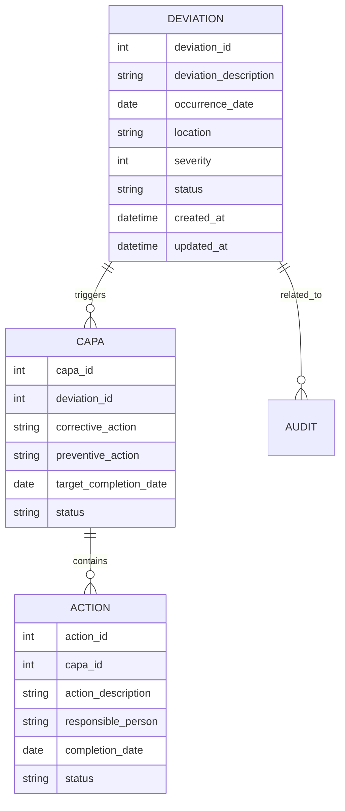
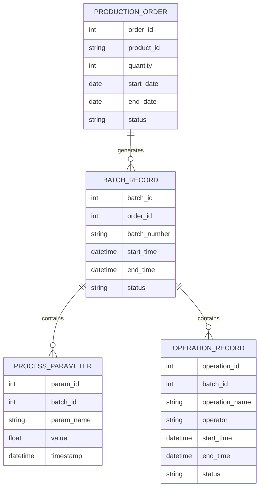
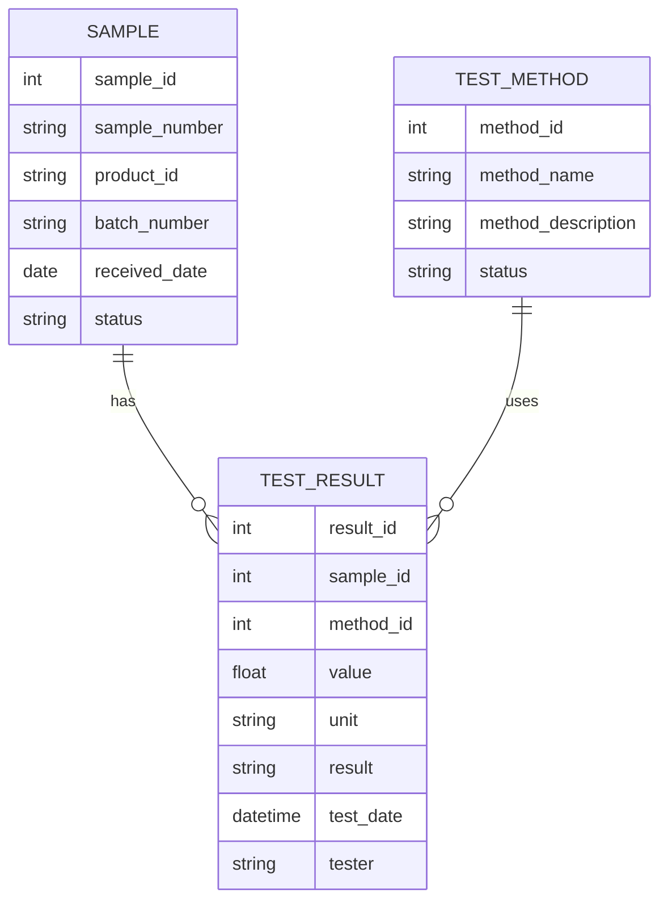

# GMP系统详细需求分析

## 1. 用户角色定义

| 角色名称 | 角色描述 | 主要职责 |
|---------|---------|---------|
| 系统管理员 | 系统的总管理员 | 系统配置、用户管理、权限分配 |
| 质量经理 | 质量管理部门负责人 | 质量事件审批、质量报告审核 |
| 生产经理 | 生产部门负责人 | 生产计划审批、生产进度监控 |
| 实验室技术员 | 实验室工作人员 | 样品测试、数据记录 |
| 仓库管理员 | 仓库工作人员 | 物料接收、库存管理 |
| 设备管理员 | 设备管理部门工作人员 | 设备校准、维护记录 |
| 文件管理员 | 文档管理部门工作人员 | 文档创建、审批流程管理 |
| 生产操作员 | 生产车间工作人员 | 生产操作、工艺参数记录 |
| 供应商 | 外部供应商 | 物料供应、资质提交 |

## 2. 子系统详细需求

### 2.1 质量管理系统（QMS）

#### 2.1.1 具体功能要求

- **偏差管理**
  - 偏差事件记录（事件描述、发生时间、地点、相关人员）
  - 偏差分级（重大偏差、次要偏差、微小偏差）
  - 偏差调查（根本原因分析、CAPA计划）
  - 偏差审批流程
  - 偏差关闭验证

- **CAPA管理**
  - CAPA计划制定（纠正措施、预防措施）
  - CAPA责任人分配
  - CAPA进度跟踪
  - CAPA效果验证
  - CAPA关闭审批

- **投诉管理**
  - 投诉记录（投诉来源、内容、产品信息）
  - 投诉调查
  - 投诉处理措施
  - 投诉关闭验证
  - 投诉数据分析

- **审计管理**
  - 审计计划制定
  - 审计实施记录
  - 审计发现管理
  - 审计报告生成
  - 审计整改跟踪

- **供应商管理**
  - 供应商资质管理（营业执照、GMP证书）
  - 供应商评估（质量、交货期、服务）
  - 供应商绩效分析
  - 供应商变更管理

- **产品放行管理**
  - 产品质量回顾
  - 放行审核流程
  - 放行记录管理

#### 2.1.2 使用流程

1. **偏差管理流程**
   - 生产操作员发现偏差并记录
   - 质量工程师进行偏差分级和初步调查
   - 质量经理审批偏差调查结果
   - 相关部门制定CAPA计划
   - 质量经理审批CAPA计划
   - 执行CAPA计划并跟踪进度
   - CAPA效果验证
   - 质量经理关闭偏差

2. **供应商管理流程**
   - 采购部门提交新供应商申请
   - 质量部门审核供应商资质
   - 质量部门进行供应商现场审计
   - 质量经理批准供应商
   - 供应商纳入合格供应商名录

### 2.2 生产执行系统（MES）

#### 2.2.1 具体功能要求

- **生产订单管理**
  - 生产订单创建和审批
  - 生产订单调度
  - 生产订单进度跟踪
  - 生产订单完成记录

- **批记录管理**
  - 电子批记录（eBPR）生成
  - 工艺参数自动采集
  - 生产操作记录
  - 异常事件记录
  - 批记录审核和批准

- **工艺参数监控**
  - 实时工艺参数采集
  - 工艺参数阈值设置
  - 工艺参数异常报警
  - 工艺参数趋势分析

- **物料追溯**
  - 物料批次追溯
  - 物料使用记录
  - 成品追溯
  - 追溯报告生成

#### 2.2.2 使用流程

1. **生产订单执行流程**
   - 生产计划部门创建生产订单
   - 生产经理审批生产订单
   - MES系统生成电子批记录
   - 生产操作员登录系统并开始生产
   - 系统自动采集工艺参数
   - 生产操作员记录生产操作
   - 生产完成后提交批记录
   - 质量部门审核批记录
   - 生产订单完成

### 2.3 实验室信息管理系统（LIMS）

#### 2.3.1 具体功能要求

- **样品管理**
  - 样品接收和登记
  - 样品编号自动生成
  - 样品存储管理
  - 样品处理和流转

- **测试计划管理**
  - 测试计划制定
  - 测试方法选择
  - 测试任务分配
  - 测试进度跟踪

- **数据采集**
  - 仪器数据自动采集
  - 手动数据录入
  - 数据格式转换
  - 数据完整性检查

- **结果审核**
  - 测试结果自动计算
  - 结果偏差检查
  - 结果审核流程
  - 不合格结果处理

#### 2.3.2 使用流程

1. **样品测试流程**
   - 仓库管理员提交样品测试请求
   - 实验室负责人制定测试计划
   - 实验室技术员接收样品
   - 实验室技术员选择测试方法
   - 仪器自动采集测试数据
   - 实验室技术员记录测试结果
   - 实验室负责人审核测试结果
   - 系统生成测试报告
   - 测试报告发送给相关部门

### 2.4 电子文档管理系统（EDMS）

#### 2.4.1 具体功能要求

- **文档创建和编辑**
  - 文档模板管理
  - 文档版本控制
  - 协作编辑功能
  - 文档格式转换

- **审批流程**
  - 文档审批流程定义
  - 电子签名审批
  - 审批状态跟踪
  - 审批记录保留

- **文档分发**
  - 文档发布控制
  - 文档接收确认
  - 文档更新通知
  - 文档废止管理

#### 2.4.2 使用流程

1. **文档审批流程**
   - 文档创建者创建文档
   - 文档创建者选择审批流程
   - 审批人收到审批请求
   - 审批人进行电子签名审批
   - 文档自动更新版本
   - 文档发布并通知相关人员
   - 旧版文档自动废止

## 3. 商业流程建模

### 3.1 生产流程建模

### 3.2 质量事件处理流程

### 3.3 物料管理流程

## 4. 数据建模

### 4.1 质量管理数据模型

### 4.2 生产执行数据模型

### 4.3 实验室数据模型

## 5. 系统集成需求

### 5.1 系统间集成

- **QMS与MES集成**：质量事件自动触发生产调整
- **MES与ERP集成**：生产订单和物料信息共享
- **LIMS与MES集成**：测试结果自动反馈到生产批记录
- **EDMS与所有系统集成**：文档链接到相关业务流程

### 5.2 接口要求

- **REST API**：系统间通信接口
- **ODBC/JDBC**：数据库级集成
- **OPC UA**：设备数据采集接口
- **SFTP**：文件传输接口

## 6. 安全与合规需求

### 6.1 访问控制

- **角色-权限模型**：基于角色的访问控制
- **最小权限原则**：用户仅拥有必要的权限
- **会话管理**：会话超时自动注销
- **密码策略**：强密码要求和定期更换

### 6.2 数据安全

- **数据加密**：传输和存储数据加密
- **数据备份**：定期数据备份和恢复
- **数据完整性**：防止数据篡改
- **数据归档**：符合法规要求的数据归档

### 6.3 GMP合规性

- **电子记录**：符合FDA 21 CFR Part 11要求
- **电子签名**：支持手写电子签名和数字签名
- **审计追踪**：所有操作的完整审计记录
- **权限管理**：确保数据访问的可追溯性

## 7. 性能与可用性需求

### 7.1 性能要求

- **响应时间**：页面加载时间<2秒
- **并发用户数**：支持1000个并发用户
- **数据处理**：批量处理时间<30分钟

### 7.2 可用性要求

- **系统可用性**：99.9%（除计划维护外）
- **备份恢复**：数据恢复时间<2小时
- **故障响应**：系统故障响应时间<1小时

## 8. 技术实现要求

### 8.1 技术架构

- **微服务架构**：各子系统独立部署
- **前后端分离**：前端Vue.js，后端Spring Boot
- **云原生支持**：支持容器化部署

### 8.2 数据库要求

- **关系型数据库**：PostgreSQL或Oracle
- **缓存数据库**：Redis
- **时间序列数据库**：InfluxDB（用于工艺参数存储）

## 9. 测试与验证要求

### 9.1 测试类型

- **功能测试**：验证系统功能正确性
- **性能测试**：验证系统性能指标
- **安全测试**：验证系统安全性
- **合规性测试**：验证GMP合规性
- **用户验收测试**：用户验证系统满足需求

### 9.2 验证要求

- **系统验证**：IQ/OQ/PQ验证
- **计算机系统验证（CSV）**：符合GMP要求的系统验证
- **数据完整性验证**：确保数据的完整性和准确性