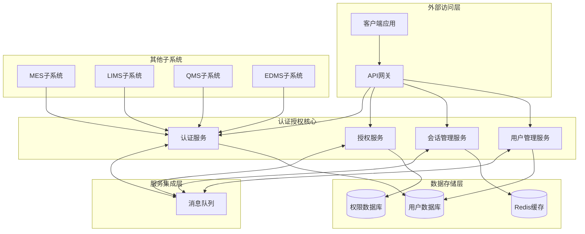
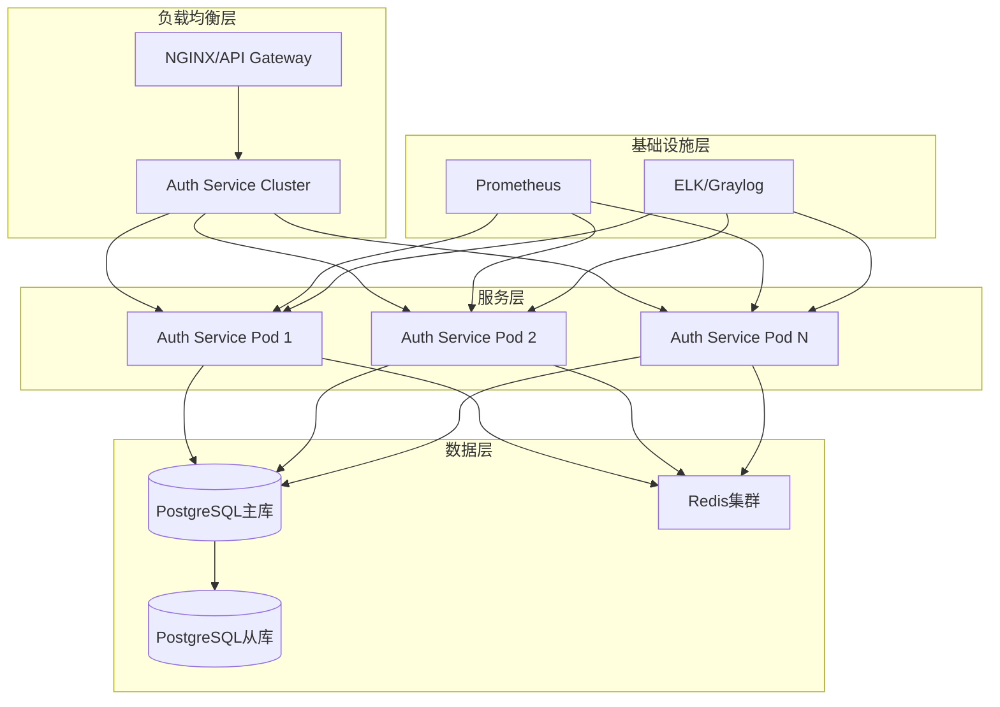

# 认证与授权子系统架构设计

## 1. 概述

认证与授权子系统基于微服务架构设计，提供统一的身份认证、授权管理和安全访问控制，通过OAuth2、JWT和RBAC等技术实现GMP系统的用户身份管理、权限分配和安全审计功能。

## 2. 系统架构

### 2.1 分层架构设计

认证与授权子系统采用典型的多层架构设计，确保系统的可维护性、可扩展性和安全性。


**分层说明：**

1. **表现层**
   - 提供RESTful API接口，供前端应用和其他微服务调用
   - 支持OAuth2授权流程的端点实现
   - 处理HTTP请求/响应，参数验证和错误处理

2. **业务逻辑层**
   - 用户认证管理：处理用户登录、注册、密码重置等功能
   - 授权管理：基于RBAC实现权限控制和资源访问管理
   - 会话管理：处理用户会话的创建、验证和销毁
   - 令牌管理：JWT令牌的生成、验证和刷新

3. **数据访问层**
   - 数据库交互：通过Repository模式实现数据访问抽象
   - 缓存操作：Redis缓存用户会话和权限信息
   - 数据持久化：用户信息、角色定义、权限映射等数据的存储

4. **基础设施层**
   - 安全组件：加密算法、HTTPS配置、CSRF防护
   - 配置管理：环境配置、密钥管理、参数设置
   - 日志记录：操作日志、安全日志、审计日志
   - 监控告警：系统性能、安全事件、异常监控

### 2.2 微服务架构图

认证与授权子系统在微服务架构中作为核心组件，为其他子系统提供身份验证和授权服务。



**架构组件说明：**

1. **认证服务**：负责用户身份验证、令牌颁发和验证
2. **授权服务**：实现RBAC权限模型，管理用户角色和权限
3. **会话管理服务**：维护用户会话状态，处理会话过期和失效
4. **用户管理服务**：提供用户信息的CRUD操作和用户属性管理
5. **API网关**：统一入口，处理请求路由、负载均衡和安全过滤
6. **消息队列**：实现服务间异步通信，特别是安全事件通知
7. **数据存储**：分离的用户数据库、权限数据库和Redis缓存

## 3. 服务设计

### 3.1 微服务边界

| 服务名称           | 主要职责                                       | 关键接口                                     | 依赖服务                     |
| :----------------- | :--------------------------------------------- | :------------------------------------------- | :--------------------------- |
| **认证服务**       | 用户身份验证、令牌管理                         | /api/auth/login, /api/auth/logout, /api/auth/token | 用户服务、Redis缓存          |
| **授权服务**       | 权限验证、角色管理                             | /api/auth/authorize, /api/auth/roles        | 权限数据库、缓存服务         |
| **会话管理服务**   | 会话创建、维护和销毁                           | /api/auth/session, /api/auth/refresh         | Redis缓存                    |
| **用户管理服务**   | 用户信息管理、密码策略                         | /api/auth/users, /api/auth/users/{id}        | 用户数据库、消息队列         |
| **策略配置服务**   | 认证策略、授权规则配置                         | /api/auth/policies, /api/auth/rules          | 配置数据库                   |
| **审计日志服务**   | 记录安全事件、访问日志                         | /api/auth/audit, /api/auth/events            | 日志数据库、消息队列         |

### 3.2 服务接口设计

#### 认证服务接口

| API路径                 | 方法 | 模块/文件                | 类型 | 功能描述                                     | 请求体 (JSON)                                          | 成功响应 (200 OK)                                      |
| :---------------------- | :--- | :----------------------- | :--- | :------------------------------------------- | :----------------------------------------------------- | :----------------------------------------------------- |
| `/api/auth/login`       | `POST` | `auth-service/src/main/java/com/gmp/auth/controller/AuthController.java` | `Router` | 用户登录认证                                 | `{"username": "string", "password": "string", "captcha": "string"}` | `{"token": "string", "refreshToken": "string", "expireTime": "string", "userInfo": {...}}` |
| `/api/auth/logout`      | `POST` | `auth-service/src/main/java/com/gmp/auth/controller/AuthController.java` | `Router` | 用户登出                                     | `{"token": "string"}`                               | `{"status": "success", "message": "登出成功"}`    |
| `/api/auth/refresh`     | `POST` | `auth-service/src/main/java/com/gmp/auth/controller/AuthController.java` | `Router` | 刷新访问令牌                                 | `{"refreshToken": "string"}`                        | `{"token": "string", "expireTime": "string"}`   |
| `/api/auth/verify`      | `GET`  | `auth-service/src/main/java/com/gmp/auth/controller/AuthController.java` | `Router` | 验证令牌有效性                               | N/A                                                    | `{"valid": true, "userId": "string", "expireAt": "string"}` |
| `/api/auth/captcha`     | `GET`  | `auth-service/src/main/java/com/gmp/auth/controller/CaptchaController.java` | `Router` | 获取验证码                                   | N/A                                                    | `{"captchaId": "string", "captchaImage": "base64"}` |

#### 授权服务接口

| API路径                     | 方法 | 模块/文件                  | 类型 | 功能描述                                     | 请求体 (JSON)                                                        | 成功响应 (200 OK)                                                    |
| :-------------------------- | :--- | :------------------------- | :--- | :------------------------------------------- | :------------------------------------------------------------------- | :------------------------------------------------------------------- |
| `/api/auth/roles`           | `GET`  | `auth-service/src/main/java/com/gmp/auth/controller/RoleController.java` | `Router` | 获取角色列表                                 | N/A                                                                  | `[{"id": "string", "name": "string", "description": "string"}]` |
| `/api/auth/roles`           | `POST` | `auth-service/src/main/java/com/gmp/auth/controller/RoleController.java` | `Router` | 创建新角色                                   | `{"name": "string", "description": "string", "permissions": ["string"]}` | `{"id": "string", "name": "string", "description": "string", "createdAt": "string"}` |
| `/api/auth/roles/{id}`      | `PUT`  | `auth-service/src/main/java/com/gmp/auth/controller/RoleController.java` | `Router` | 更新角色信息                                 | `{"name": "string", "description": "string", "permissions": ["string"]}` | `{"id": "string", "name": "string", "description": "string", "updatedAt": "string"}` |
| `/api/auth/roles/{id}`      | `DELETE` | `auth-service/src/main/java/com/gmp/auth/controller/RoleController.java` | `Router` | 删除角色                                     | N/A                                                                  | `{"status": "success", "message": "角色删除成功"}`              |
| `/api/auth/check-permission` | `POST` | `auth-service/src/main/java/com/gmp/auth/controller/PermissionController.java` | `Router` | 检查用户权限                                 | `{"userId": "string", "permission": "string"}`                  | `{"hasPermission": true}`                                          |

#### 用户管理服务接口

| API路径                 | 方法 | 模块/文件                  | 类型 | 功能描述                                     | 请求体 (JSON)                                                                  | 成功响应 (200 OK)                                                              |
| :---------------------- | :--- | :------------------------- | :--- | :------------------------------------------- | :----------------------------------------------------------------------------- | :----------------------------------------------------------------------------- |
| `/api/auth/users`       | `GET`  | `auth-service/src/main/java/com/gmp/auth/controller/UserController.java` | `Router` | 获取用户列表                                 | N/A                                                                            | `[{"id": "string", "username": "string", "email": "string", "status": "string"}]` |
| `/api/auth/users`       | `POST` | `auth-service/src/main/java/com/gmp/auth/controller/UserController.java` | `Router` | 创建新用户                                   | `{"username": "string", "password": "string", "email": "string", "roles": ["string"]}` | `{"id": "string", "username": "string", "email": "string", "createdAt": "string"}` |
| `/api/auth/users/{id}`  | `GET`  | `auth-service/src/main/java/com/gmp/auth/controller/UserController.java` | `Router` | 获取用户详情                                 | N/A                                                                            | `{"id": "string", "username": "string", "email": "string", "roles": ["string"], "createdAt": "string"}` |
| `/api/auth/users/{id}`  | `PUT`  | `auth-service/src/main/java/com/gmp/auth/controller/UserController.java` | `Router` | 更新用户信息                                 | `{"username": "string", "email": "string", "roles": ["string"], "status": "string"}` | `{"id": "string", "username": "string", "email": "string", "updatedAt": "string"}` |
| `/api/auth/users/{id}`  | `DELETE` | `auth-service/src/main/java/com/gmp/auth/controller/UserController.java` | `Router` | 删除用户                                     | N/A                                                                            | `{"status": "success", "message": "用户删除成功"}`                         |
| `/api/auth/users/{id}/reset-password` | `POST` | `auth-service/src/main/java/com/gmp/auth/controller/UserController.java` | `Router` | 重置用户密码                                 | `{"newPassword": "string"}`                                                 | `{"status": "success", "message": "密码重置成功"}`                         |

## 4. 数据架构设计

### 4.1 核心数据模型

#### 用户模型 (User)

```java
@Entity
@Table(name = "auth_users")
public class User {
    @Id
    @GeneratedValue(strategy = GenerationType.UUID)
    private String id;
    
    @Column(nullable = false, unique = true)
    private String username;
    
    @Column(nullable = false)
    private String password; // 加密存储
    
    @Column(unique = true)
    private String email;
    
    private String phoneNumber;
    
    @Column(name = "full_name")
    private String fullName;
    
    @Enumerated(EnumType.STRING)
    private UserStatus status; // ACTIVE, INACTIVE, LOCKED, PENDING
    
    @ManyToMany(fetch = FetchType.EAGER)
    @JoinTable(
        name = "auth_user_roles",
        joinColumns = @JoinColumn(name = "user_id"),
        inverseJoinColumns = @JoinColumn(name = "role_id")
    )
    private Set<Role> roles = new HashSet<>();
    
    @Column(name = "last_login_time")
    private LocalDateTime lastLoginTime;
    
    @Column(name = "login_attempts")
    private int loginAttempts;
    
    @Column(name = "password_expire_time")
    private LocalDateTime passwordExpireTime;
    
    @Column(name = "created_at", updatable = false)
    private LocalDateTime createdAt;
    
    @Column(name = "updated_at")
    private LocalDateTime updatedAt;
    
    // Getters and Setters
}
```

#### 角色模型 (Role)

```java
@Entity
@Table(name = "auth_roles")
public class Role {
    @Id
    @GeneratedValue(strategy = GenerationType.UUID)
    private String id;
    
    @Column(nullable = false, unique = true)
    private String name;
    
    private String description;
    
    @ManyToMany(fetch = FetchType.EAGER)
    @JoinTable(
        name = "auth_role_permissions",
        joinColumns = @JoinColumn(name = "role_id"),
        inverseJoinColumns = @JoinColumn(name = "permission_id")
    )
    private Set<Permission> permissions = new HashSet<>();
    
    @Column(name = "created_at", updatable = false)
    private LocalDateTime createdAt;
    
    @Column(name = "updated_at")
    private LocalDateTime updatedAt;
    
    // Getters and Setters
}
```

#### 权限模型 (Permission)

```java
@Entity
@Table(name = "auth_permissions")
public class Permission {
    @Id
    @GeneratedValue(strategy = GenerationType.UUID)
    private String id;
    
    @Column(nullable = false, unique = true)
    private String code; // 权限标识，如：user:read, role:write
    
    private String name;
    
    private String description;
    
    @Column(name = "resource_type")
    private String resourceType;
    
    @Column(name = "action")
    private String action;
    
    @Column(name = "created_at", updatable = false)
    private LocalDateTime createdAt;
    
    @Column(name = "updated_at")
    private LocalDateTime updatedAt;
    
    // Getters and Setters
}
```

#### 会话模型 (Session)

```java
@Entity
@Table(name = "auth_sessions")
public class Session {
    @Id
    @GeneratedValue(strategy = GenerationType.UUID)
    private String id;
    
    @Column(name = "session_token", nullable = false, unique = true)
    private String sessionToken;
    
    @ManyToOne
    @JoinColumn(name = "user_id", nullable = false)
    private User user;
    
    @Column(name = "ip_address")
    private String ipAddress;
    
    @Column(name = "user_agent")
    private String userAgent;
    
    @Column(name = "device_id")
    private String deviceId;
    
    @Column(name = "login_time", nullable = false)
    private LocalDateTime loginTime;
    
    @Column(name = "last_activity_time")
    private LocalDateTime lastActivityTime;
    
    @Column(name = "expire_time")
    private LocalDateTime expireTime;
    
    @Enumerated(EnumType.STRING)
    private SessionStatus status; // ACTIVE, EXPIRED, INVALIDATED
    
    // Getters and Setters
}
```

#### 审计日志模型 (AuditLog)

```java
@Entity
@Table(name = "auth_audit_logs")
public class AuditLog {
    @Id
    @GeneratedValue(strategy = GenerationType.UUID)
    private String id;
    
    @Column(name = "event_type")
    private String eventType; // LOGIN, LOGOUT, PERMISSION_DENIED, PASSWORD_CHANGE, etc.
    
    @ManyToOne
    @JoinColumn(name = "user_id")
    private User user;
    
    @Column(name = "ip_address")
    private String ipAddress;
    
    @Column(name = "user_agent")
    private String userAgent;
    
    @Column(columnDefinition = "TEXT")
    private String details;
    
    @Column(name = "success")
    private boolean success;
    
    @Column(name = "error_message")
    private String errorMessage;
    
    @Column(name = "created_at", updatable = false)
    private LocalDateTime createdAt;
    
    // Getters and Setters
}
```

### 4.2 Repository层设计

#### UserRepository

```java
public interface UserRepository extends JpaRepository<User, String> {
    Optional<User> findByUsername(String username);
    Optional<User> findByEmail(String email);
    boolean existsByUsername(String username);
    boolean existsByEmail(String email);
    Page<User> findByStatus(UserStatus status, Pageable pageable);
    List<User> findByRoles_Name(String roleName);
}
```

#### RoleRepository

```java
public interface RoleRepository extends JpaRepository<Role, String> {
    Optional<Role> findByName(String name);
    boolean existsByName(String name);
    List<Role> findByPermissions_Code(String permissionCode);
}
```

#### PermissionRepository

```java
public interface PermissionRepository extends JpaRepository<Permission, String> {
    Optional<Permission> findByCode(String code);
    boolean existsByCode(String code);
    List<Permission> findByResourceType(String resourceType);
    List<Permission> findByAction(String action);
}
```

#### SessionRepository

```java
public interface SessionRepository extends JpaRepository<Session, String> {
    Optional<Session> findBySessionToken(String sessionToken);
    List<Session> findByUserIdAndStatus(String userId, SessionStatus status);
    void deleteByExpireTimeBefore(LocalDateTime time);
    long countByUserIdAndStatus(String userId, SessionStatus status);
}
```

#### AuditLogRepository

```java
public interface AuditLogRepository extends JpaRepository<AuditLog, String> {
    Page<AuditLog> findByUserId(String userId, Pageable pageable);
    Page<AuditLog> findByEventType(String eventType, Pageable pageable);
    Page<AuditLog> findByCreatedAtBetween(LocalDateTime startTime, LocalDateTime endTime, Pageable pageable);
    List<AuditLog> findTop10ByUserIdOrderByCreatedAtDesc(String userId);
}
```

## 5. MCP协议实现

### 5.1 MCP服务概述

认证与授权子系统实现了MCP协议，为GMP系统提供统一的身份验证和授权服务。MCP协议的实现确保了系统之间安全、标准化的通信方式，同时支持上下文传递和安全审计。

### 5.2 MCP工具定义

| 工具名称 | 描述 | 参数 | 返回值 |
|---------|------|------|--------|
| `authenticate` | 提供用户认证服务 | `{"username": "string", "password": "string"}` | `{"success": boolean, "token": "string", "userInfo": {...}}` |
| `authorize` | 验证用户权限 | `{"token": "string", "resource": "string", "action": "string"}` | `{"allowed": boolean, "reason": "string"}` |
| `getUserInfo` | 获取用户信息 | `{"token": "string"}` | `{"user": {...}, "roles": [...], "permissions": [...]}` |
| `validateToken` | 验证令牌有效性 | `{"token": "string"}` | `{"valid": boolean, "expired": boolean, "user_id": "string"}` |
| `refreshToken` | 刷新访问令牌 | `{"refreshToken": "string"}` | `{"token": "string", "expireTime": "string"}` |

### 5.3 MCP配置示例

```yaml
# MCP服务配置
mcp:
  server:
    port: 8081
    host: 0.0.0.0
    timeout: 30s
    max-connections: 1000
  security:
    enable-tls: true
    tls-cert-path: /path/to/cert.pem
    tls-key-path: /path/to/key.pem
    require-client-auth: false
  tools:
    - name: authenticate
      handler-class: com.gmp.auth.mcp.AuthenticateTool
      enabled: true
      rate-limit: 100/hour
    - name: authorize
      handler-class: com.gmp.auth.mcp.AuthorizeTool
      enabled: true
      rate-limit: 1000/hour
    - name: getUserInfo
      handler-class: com.gmp.auth.mcp.GetUserInfoTool
      enabled: true
      rate-limit: 500/hour
    - name: validateToken
      handler-class: com.gmp.auth.mcp.ValidateTokenTool
      enabled: true
      rate-limit: 2000/hour
    - name: refreshToken
      handler-class: com.gmp.auth.mcp.RefreshTokenTool
      enabled: true
      rate-limit: 200/hour
  logging:
    level: INFO
    include-payloads: false
  metrics:
    enabled: true
    expose-endpoints: [prometheus, health]
```

### 5.4 MCP工具实现示例

#### 认证工具实现

```java
@Component
public class AuthenticateTool implements MCPTool {
    
    @Autowired
    private AuthenticationService authenticationService;
    
    @Override
    public String getName() {
        return "authenticate";
    }
    
    @Override
    public Map<String, Object> execute(Map<String, Object> params) {
        String username = (String) params.get("username");
        String password = (String) params.get("password");
        
        // 验证参数
        if (username == null || password == null) {
            throw new IllegalArgumentException("Username and password are required");
        }
        
        // 调用认证服务
        AuthenticationResult result = authenticationService.authenticate(username, password);
        
        // 构建返回结果
        Map<String, Object> response = new HashMap<>();
        response.put("success", result.isSuccess());
        
        if (result.isSuccess()) {
            response.put("token", result.getToken());
            response.put("userInfo", convertToMap(result.getUser()));
        }
        
        return response;
    }
    
    private Map<String, Object> convertToMap(User user) {
        Map<String, Object> userMap = new HashMap<>();
        userMap.put("id", user.getId());
        userMap.put("username", user.getUsername());
        userMap.put("email", user.getEmail());
        userMap.put("fullName", user.getFullName());
        // 添加其他用户信息...
        return userMap;
    }
}
```

#### 授权工具实现

```java
@Component
public class AuthorizeTool implements MCPTool {
    
    @Autowired
    private AuthorizationService authorizationService;
    
    @Override
    public String getName() {
        return "authorize";
    }
    
    @Override
    public Map<String, Object> execute(Map<String, Object> params) {
        String token = (String) params.get("token");
        String resource = (String) params.get("resource");
        String action = (String) params.get("action");
        
        // 验证参数
        if (token == null || resource == null || action == null) {
            throw new IllegalArgumentException("Token, resource and action are required");
        }
        
        // 验证令牌有效性
        boolean tokenValid = authorizationService.validateToken(token);
        if (!tokenValid) {
            Map<String, Object> response = new HashMap<>();
            response.put("allowed", false);
            response.put("reason", "Invalid or expired token");
            return response;
        }
        
        // 获取用户ID
        String userId = authorizationService.getUserIdFromToken(token);
        
        // 检查权限
        boolean hasPermission = authorizationService.hasPermission(userId, resource, action);
        
        // 构建返回结果
        Map<String, Object> response = new HashMap<>();
        response.put("allowed", hasPermission);
        response.put("reason", hasPermission ? "Access granted" : "Insufficient permissions");
        
        return response;
    }
}
```

## 6. 集成设计

### 6.1 与其他子系统集成

认证与授权子系统作为GMP系统的核心组件，需要与其他所有子系统进行集成，提供身份验证和授权服务。集成方式包括：

1. **API网关集成**：通过API网关拦截所有请求，进行统一的身份验证和授权检查
2. **JWT令牌共享**：生成的JWT令牌在所有子系统间共享，确保单点登录体验
3. **事件通知**：当用户状态发生变更时，通过消息队列通知其他子系统

### 6.2 外部系统集成

认证与授权子系统可以与企业现有的身份管理系统集成，支持多种认证源：

1. **LDAP/Active Directory集成**：支持企业级目录服务
2. **OAuth2/OIDC提供方**：支持第三方认证，如Google、Microsoft等
3. **SAML集成**：支持与符合SAML标准的身份提供商集成
4. **API密钥管理**：为系统间集成提供API密钥认证

### 6.3 消息队列集成

使用消息队列实现系统间异步通信，特别是安全事件通知：

```java
@Service
public class AuthEventPublisher {
    
    @Autowired
    private RabbitTemplate rabbitTemplate;
    
    public void publishUserCreatedEvent(User user) {
        Map<String, Object> event = new HashMap<>();
        event.put("type", "USER_CREATED");
        event.put("userId", user.getId());
        event.put("username", user.getUsername());
        event.put("timestamp", LocalDateTime.now());
        
        rabbitTemplate.convertAndSend("auth-events", "user.created", event);
    }
    
    public void publishLoginEvent(String userId, String ipAddress, boolean success) {
        Map<String, Object> event = new HashMap<>();
        event.put("type", "USER_LOGIN");
        event.put("userId", userId);
        event.put("ipAddress", ipAddress);
        event.put("success", success);
        event.put("timestamp", LocalDateTime.now());
        
        rabbitTemplate.convertAndSend("auth-events", "user.login", event);
    }
    
    // 其他事件发布方法...
}
```

## 7. 安全架构

### 7.1 认证机制

1. **多因素认证**：支持密码+验证码、密码+短信、密码+邮箱等多种认证方式
2. **生物识别**：预留指纹、面部识别等生物识别接口
3. **证书认证**：支持客户端证书认证方式
4. **社交登录**：支持OAuth2/OIDC第三方登录

### 7.2 授权机制

1. **基于角色的访问控制（RBAC）**：通过用户-角色-权限的映射实现细粒度权限控制
2. **基于属性的访问控制（ABAC）**：支持基于上下文和属性的动态权限控制
3. **资源级权限控制**：对不同业务资源实现独立的权限管理
4. **数据行级权限**：支持数据隔离和多租户访问控制

### 7.3 密码策略

1. **复杂度要求**：密码必须包含大小写字母、数字和特殊字符
2. **长度要求**：密码长度至少8位，建议12位以上
3. **定期更换**：支持密码有效期设置，默认90天
4. **历史密码检查**：禁止使用最近N次使用过的密码
5. **账户锁定**：连续失败登录超过5次，账户自动锁定30分钟

### 7.4 加密传输与存储

1. **传输加密**：强制使用TLS 1.2+加密所有HTTP通信
2. **密码存储**：使用bcrypt算法加密存储用户密码
3. **敏感数据加密**：对个人身份信息（PII）进行加密存储
4. **密钥管理**：实现密钥轮换机制，定期更新加密密钥

### 7.5 安全审计

1. **操作日志**：记录所有用户身份和权限相关操作
2. **访问日志**：记录所有API访问请求和响应
3. **异常检测**：实时监控和分析异常登录行为
4. **合规报告**：生成满足GMP要求的安全审计报告

## 8. 性能优化

### 8.1 缓存策略

1. **用户信息缓存**：将频繁访问的用户信息缓存在Redis中，TTL设为1小时
2. **权限信息缓存**：缓存用户角色和权限映射，TTL设为30分钟
3. **会话缓存**：活跃会话信息缓存在Redis中，实时更新最后活动时间
4. **分布式缓存**：使用Redis集群确保高可用性和高性能

### 8.2 数据库优化

1. **索引优化**：在常用查询字段上创建合适的索引
2. **查询优化**：使用JPQL/HQL优化复杂查询，避免N+1问题
3. **连接池配置**：优化数据库连接池参数，合理设置最小、最大连接数
4. **读写分离**：考虑使用数据库读写分离提高性能

### 8.3 请求处理优化

1. **异步处理**：非关键路径使用异步处理提高响应速度
2. **请求合并**：对于频繁的权限检查，实现批量验证机制
3. **超时控制**：为所有外部调用设置合理的超时时间
4. **限流保护**：实现API限流，防止恶意请求和资源滥用

## 9. 监控与可观测性

### 9.1 日志管理

1. **结构化日志**：使用JSON格式记录日志，方便后续分析
2. **日志级别**：根据环境设置合适的日志级别（开发环境DEBUG，生产环境INFO）
3. **日志聚合**：集成ELK/Graylog等日志聚合平台
4. **关键操作记录**：所有认证、授权相关操作必须记录详细日志

### 9.2 性能监控

1. **JVM监控**：监控JVM内存使用、GC情况、线程状态
2. **API监控**：监控关键API的响应时间、吞吐量、错误率
3. **资源监控**：监控服务器CPU、内存、磁盘、网络使用情况
4. **数据库监控**：监控数据库连接数、慢查询、死锁等

### 9.3 告警机制

1. **异常告警**：关键服务异常、认证失败率异常等情况下触发告警
2. **性能告警**：API响应时间超出阈值、系统负载过高等触发告警
3. **安全告警**：检测到可疑登录、暴力破解尝试等触发告警
4. **告警渠道**：支持邮件、短信、企业微信等多种告警方式

## 10. 部署与扩展性

### 10.1 部署架构

认证与授权子系统采用容器化部署，基于Kubernetes平台实现高可用和自动伸缩。



### 10.2 容器化部署

#### Dockerfile示例

```dockerfile
FROM openjdk:17-jdk-slim

WORKDIR /app

# 复制Maven构建产物
COPY target/auth-service.jar app.jar

# 设置JVM参数
ENV JAVA_OPTS="-Xms512m -Xmx1024m -XX:+UseG1GC"

# 暴露服务端口
EXPOSE 8080

# 启动命令
CMD ["sh", "-c", "java $JAVA_OPTS -jar app.jar"]
```

#### Kubernetes Deployment配置示例

```yaml
apiVersion: apps/v1
kind: Deployment
metadata:
  name: auth-service
spec:
  replicas: 3
  selector:
    matchLabels:
      app: auth-service
  template:
    metadata:
      labels:
        app: auth-service
    spec:
      containers:
      - name: auth-service
        image: gmp-system/auth-service:latest
        ports:
        - containerPort: 8080
        resources:
          requests:
            memory: "512Mi"
            cpu: "500m"
          limits:
            memory: "1Gi"
            cpu: "1000m"
        env:
        - name: SPRING_PROFILES_ACTIVE
          value: "production"
        - name: SPRING_REDIS_HOST
          valueFrom:
            configMapKeyRef:
              name: auth-config
              key: redis.host
        - name: SPRING_DATASOURCE_URL
          valueFrom:
            configMapKeyRef:
              name: auth-config
              key: db.url
        - name: SPRING_DATASOURCE_USERNAME
          valueFrom:
            secretKeyRef:
              name: auth-secrets
              key: db.username
        - name: SPRING_DATASOURCE_PASSWORD
          valueFrom:
            secretKeyRef:
              name: auth-secrets
              key: db.password
        readinessProbe:
          httpGet:
            path: /actuator/health/readiness
            port: 8080
          initialDelaySeconds: 30
          periodSeconds: 10
        livenessProbe:
          httpGet:
            path: /actuator/health/liveness
            port: 8080
          initialDelaySeconds: 60
          periodSeconds: 30
```

#### Kubernetes Service配置示例

```yaml
apiVersion: v1
kind: Service
metadata:
  name: auth-service
spec:
  selector:
    app: auth-service
  ports:
  - port: 80
    targetPort: 8080
  type: ClusterIP
```

#### Kubernetes Ingress配置示例

```yaml
apiVersion: networking.k8s.io/v1
kind: Ingress
metadata:
  name: auth-ingress
  annotations:
    kubernetes.io/ingress.class: nginx
    nginx.ingress.kubernetes.io/ssl-redirect: "true"
    nginx.ingress.kubernetes.io/backend-protocol: "HTTP"
    nginx.ingress.kubernetes.io/rewrite-target: /$2
spec:
  tls:
  - hosts:
    - auth.gmp-system.com
    secretName: auth-tls-secret
  rules:
  - host: auth.gmp-system.com
    http:
      paths:
      - path: /api(/|$)(.*)
        pathType: Prefix
        backend:
          service:
            name: auth-service
            port:
              number: 80
```

### 10.3 CI/CD流程配置

#### GitHub Actions工作流示例

```yaml
name: Auth Service CI/CD

on:
  push:
    branches: [ main, develop ]
    paths:
      - 'auth-service/**'
  pull_request:
    branches: [ main ]
    paths:
      - 'auth-service/**'

jobs:
  build-and-test:
    runs-on: ubuntu-latest
    steps:
    - uses: actions/checkout@v3
    - name: Set up JDK 17
      uses: actions/setup-java@v3
      with:
        java-version: '17'
        distribution: 'temurin'
        cache: maven
    - name: Build with Maven
      run: mvn -B package --file auth-service/pom.xml
    - name: Run tests
      run: mvn -B test --file auth-service/pom.xml
    - name: Build and push Docker image
      uses: docker/build-push-action@v4
      with:
        context: ./auth-service
        push: true
        tags: gmp-system/auth-service:${{ github.sha }}
        cache-from: type=registry,ref=gmp-system/auth-service:latest
        cache-to: type=inline

  deploy-to-staging:
    needs: build-and-test
    if: github.ref == 'refs/heads/develop'
    runs-on: ubuntu-latest
    steps:
    - uses: actions/checkout@v3
    - name: Set up kubectl
      uses: azure/setup-kubectl@v3
      with:
        version: 'latest'
    - name: Configure Kubernetes context
      uses: azure/k8s-set-context@v3
      with:
        method: kubeconfig
        kubeconfig: ${{ secrets.KUBE_CONFIG_STAGING }}
    - name: Update image in Kubernetes
      run: |
        kubectl set image deployment/auth-service auth-service=gmp-system/auth-service:${{ github.sha }} -n staging
        kubectl rollout status deployment/auth-service -n staging

  deploy-to-production:
    needs: build-and-test
    if: github.ref == 'refs/heads/main'
    runs-on: ubuntu-latest
    steps:
    - uses: actions/checkout@v3
    - name: Set up kubectl
      uses: azure/setup-kubectl@v3
      with:
        version: 'latest'
    - name: Configure Kubernetes context
      uses: azure/k8s-set-context@v3
      with:
        method: kubeconfig
        kubeconfig: ${{ secrets.KUBE_CONFIG_PRODUCTION }}
    - name: Update image in Kubernetes
      run: |
        kubectl set image deployment/auth-service auth-service=gmp-system/auth-service:${{ github.sha }} -n production
        kubectl rollout status deployment/auth-service -n production
```

## 11. 总结与展望

### 11.1 架构设计总结

认证与授权子系统采用微服务架构，实现了以下关键特性：

1. **高安全性**：多层认证机制、细粒度授权控制、完整的安全审计体系
2. **高性能**：缓存优化、异步处理、分布式部署支持高并发访问
3. **高可用性**：多副本部署、自动故障转移、完善的监控告警机制
4. **可扩展性**：模块化设计、标准接口、支持多种认证源集成
5. **标准化**：遵循OAuth2、JWT等行业标准，实现与外部系统的无缝集成

### 11.2 技术债务与改进方向

1. **安全加固**：定期进行安全审计和渗透测试，持续提升系统安全性
2. **性能优化**：针对高并发场景进一步优化缓存策略和数据库访问
3. **功能增强**：支持更多认证方式，如生物识别、硬件令牌等
4. **用户体验**：优化认证流程，提供自助服务功能
5. **合规性**：确保系统满足GDPR、HIPAA等法规要求

### 11.3 未来扩展规划

1. **AI安全**：引入AI技术进行异常行为检测和预测性安全防护
2. **零信任架构**：实现基于零信任理念的安全模型，对每次访问进行严格验证
3. **身份联合**：增强跨系统身份联合能力，支持更多企业级身份提供商
4. **移动认证**：优化移动端认证体验，支持推送通知等新型认证方式
5. **区块链集成**：探索区块链技术在身份验证和审计日志方面的应用

---

本架构设计文档为认证与授权子系统的技术实现提供了完整的指导。系统设计遵循了现代微服务架构的最佳实践，确保了系统的安全性、可靠性和可扩展性。通过合理的分层设计和服务划分，系统能够支持GMP系统的安全访问控制需求，为整个系统的安全运行提供坚实的保障。