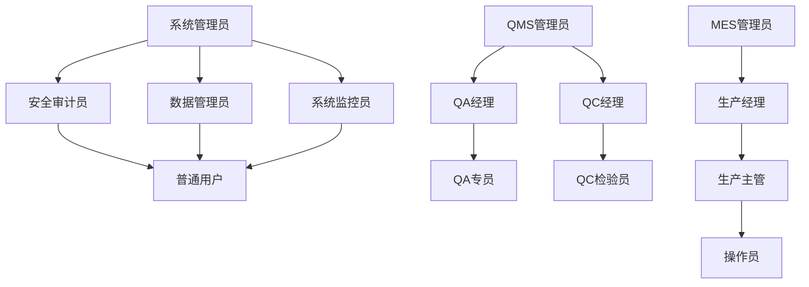

# GMP系统认证授权子系统综合说明文档

## 📋 文档信息

| 属性 | 值 |
|------|---|
| 文档标题 | GMP系统认证授权子系统综合说明文档 |
| 版本号 | v1.0.0 |
| 创建日期 | 2025年11月20日 |
| 作者 | GMP系统开发团队 |
| 状态 | 发布 |

## 1. 文档目的

本文档旨在提供GMP系统认证授权子系统的全面技术说明，包括组织结构设计、角色权限体系、数据库架构、模板数据和实施指南。本文档面向系统开发人员、测试人员、运维人员和项目管理人员，作为系统实施和维护的权威参考资料。

## 2. 认证授权子系统概述

### 2.1 系统定位

认证授权子系统是GMP系统的核心基础组件，负责提供统一的身份认证、授权管理、组织结构管理和安全审计功能。该子系统支撑QMS、MES、EAMS等所有GMP业务子系统的安全访问和权限控制，确保系统符合GMP和21 CFR Part 11等法规要求。

### 2.2 核心功能

- **用户管理**：用户账号创建、维护、状态管理和批量操作
- **角色管理**：角色定义、权限分配、角色继承和层级管理
- **权限管理**：细粒度权限控制、权限分组和动态授权
- **组织结构管理**：组织层级、部门结构和关系维护
- **身份认证**：多因素认证、会话管理和单点登录
- **安全审计**：操作日志记录、审计追踪和合规报告
- **电子签名**：符合GMP要求的电子签名功能

### 2.3 系统架构

```mermaid
digraph G {
    rankdir=TB;
    
    subgraph 客户端层
        WebUI["Web用户界面"];
        MobileApp["移动应用"];
        ThirdParty["第三方系统集成"];
    end
    
    subgraph 网关层
        API_Gateway["API网关<br>认证/路由/限流"];
    end
    
    subgraph 服务层
        AuthService["认证服务<br>身份验证/会话管理"];
        UserService["用户服务<br>用户信息管理"];
        RoleService["角色服务<br>角色权限管理"];
        OrgService["组织服务<br>组织结构管理"];
        AuditService["审计服务<br>日志记录与分析"];
        SignatureService["电子签名服务<br>签名验证与管理"];
    end
    
    subgraph 数据层
        PostgreSQL["PostgreSQL<br>auth_db"];
        Redis["Redis<br>缓存/会话存储"];
    end
    
    subgraph 外部系统
        Ldap["LDAP/AD<br>外部身份源"];
        SMS["短信服务<br>多因素认证"];
    end
    
    WebUI -> API_Gateway;
    MobileApp -> API_Gateway;
    ThirdParty -> API_Gateway;
    
    API_Gateway -> AuthService;
    API_Gateway -> UserService;
    API_Gateway -> RoleService;
    API_Gateway -> OrgService;
    API_Gateway -> AuditService;
    API_Gateway -> SignatureService;
    
    AuthService -> PostgreSQL;
    AuthService -> Redis;
    AuthService -> Ldap;
    AuthService -> SMS;
    
    UserService -> PostgreSQL;
    RoleService -> PostgreSQL;
    OrgService -> PostgreSQL;
    AuditService -> PostgreSQL;
    SignatureService -> PostgreSQL;
}
```

## 3. 组织结构设计

### 3.1 组织结构架构

GMP系统采用多层级组织结构模式，支持集团化企业管理需求：

1. **集团层**：GMP制药集团总部，作为最高级组织节点
2. **分公司层**：按照地理区域划分的分公司（华北、华东、华南等）
3. **部门层**：各组织内的职能部门
4. **子部门层**：部门内的二级组织结构

组织结构遵循树状层级关系，支持无限层级嵌套，便于企业灵活调整组织架构。

### 3.2 核心职能部门

| 部门名称 | 部门代码 | 主要职责 | 关联子系统 |
|---------|---------|---------|-----------|
| 质量管理部 | QA_DEPT | 负责质量体系管理和产品质量控制 | QMS |
| 生产管理部 | PROD_DEPT | 负责生产计划和生产过程管理 | MES |
| 设备管理部 | EQUIP_DEPT | 负责设备维护和设备验证 | EAMS |
| 研发部 | R&D_DEPT | 负责产品研发和工艺开发 | R&D |
| 物料管理部 | MATERIAL_DEPT | 负责物料采购和库存管理 | MATERIAL |
| 人力资源部 | HR_DEPT | 负责人力资源管理和培训 | HR |
| IT运维部 | IT_DEPT | 负责信息系统维护和支持 | 全系统 |
| 安全环保部 | EHS_DEPT | 负责安全管理和环境保护 | EHS |
| 法规合规部 | COMPLIANCE_DEPT | 负责法规事务和合规管理 | COMPLIANCE |

### 3.3 部门组织结构示例

质量管理部下属子部门：
- 质量控制实验室 (QC_LAB)
- 质量保证组 (QA_GROUP)
- 验证管理组 (VALIDATION_GROUP)

生产管理部下属子部门：
- 固体制剂车间 (SOLID_WORKSHOP)
- 液体制剂车间 (LIQUID_WORKSHOP)
- 无菌制剂车间 (STERILE_WORKSHOP)

## 4. 角色权限体系

### 4.1 角色分类

#### 4.1.1 系统级角色

系统级角色负责系统的整体管理和运维：

| 角色名称 | 角色代码 | 角色类型 | 主要职责 |
|---------|---------|---------|--------|
| 系统管理员 | SYS_ADMIN | SYSTEM | 系统最高权限，负责系统整体管理 |
| 安全审计员 | SECURITY_AUDITOR | SYSTEM | 负责系统安全审计和日志监控 |
| 数据管理员 | DATA_ADMIN | SYSTEM | 负责数据管理和维护 |
| 系统监控员 | SYS_MONITOR | SYSTEM | 负责系统性能监控和问题诊断 |
| 普通用户 | NORMAL_USER | NORMAL | 基础访问权限 |

#### 4.1.2 业务子系统角色

各个业务子系统的专用角色，按照业务职能划分：

**QMS子系统角色**
- QMS管理员 (QMS_ADMIN)
- QA经理 (QA_MANAGER)
- QA专员 (QA_SPECIALIST)
- QC经理 (QC_MANAGER)
- QC检验员 (QC_INSPECTOR)

**MES子系统角色**
- MES管理员 (MES_ADMIN)
- 生产经理 (PROD_MANAGER)
- 生产主管 (PROD_SUPERVISOR)
- 操作员 (OPERATOR)

**EAMS子系统角色**
- EAMS管理员 (EAMS_ADMIN)
- 设备经理 (EQUIP_MANAGER)
- 设备工程师 (EQUIP_ENGINEER)

### 4.2 角色层级关系

系统实现角色继承机制，通过角色层级关系简化权限管理：



### 4.3 权限管理模式

#### 4.3.1 权限分组

权限按照功能模块和业务领域进行分组管理：

1. **系统管理权限组**：用户管理、角色管理、权限管理等系统级功能
2. **质量管理权限组**：文档控制、偏差管理、CAPA管理等QMS相关功能
3. **生产管理权限组**：生产订单、批记录、过程控制等MES相关功能
4. **设备管理权限组**：设备注册、维护计划、校准管理等EAMS相关功能
5. **GMP权限组**：电子签名、批记录审核、验证执行等GMP特殊功能

#### 4.3.2 权限粒度

系统支持以下权限粒度控制：

- **功能级权限**：控制对特定功能模块的访问
- **操作级权限**：控制对特定操作的执行（创建/读取/更新/删除）
- **数据级权限**：控制对特定数据记录的访问（如按部门、按产品线）
- **字段级权限**：控制对特定数据字段的查看和编辑

## 5. 数据库设计

### 5.1 数据库架构概述

认证授权子系统采用PostgreSQL作为主数据库，Redis作为缓存层，确保高性能和数据一致性。

核心数据实体关系如下：

- **组织结构**：组织表(organization)与部门表(department)构成层级关系
- **用户管理**：用户表(user)关联部门表，用户可拥有详细信息(user_profile)
- **角色管理**：角色表(role)通过角色层级表(role_hierarchy)建立继承关系
- **权限管理**：权限表(permission)通过角色权限表(role_permission)分配给角色
- **用户授权**：用户通过用户角色表(user_role)关联到角色
- **审计追踪**：审计日志表(audit_log)记录所有关键操作

### 5.2 核心数据实体

#### 5.2.1 用户与组织结构

- **组织(Organization)**：公司、分公司等组织结构单元
- **部门(Department)**：各组织内的职能部门
- **用户(User)**：系统用户，关联到特定部门
- **用户档案(UserProfile)**：用户的扩展信息

#### 5.2.2 角色与权限

- **角色(Role)**：定义用户权限集合
- **角色层级(RoleHierarchy)**：定义角色间的继承关系
- **权限(Permission)**：细粒度的访问控制权限
- **角色权限(RolePermission)**：角色与权限的关联关系
- **用户角色(UserRole)**：用户与角色的关联关系

#### 5.2.3 审计与合规

- **审计日志(AuditLog)**：记录所有关键操作
- **用户登录历史(UserLoginHistory)**：记录用户登录活动
- **电子签名(ElectronicSignature)**：记录GMP关键操作的电子签名

### 5.3 数据安全性设计

- **密码加密**：使用BCrypt算法加密存储用户密码
- **数据脱敏**：敏感字段在日志和查询中进行脱敏处理
- **审计追踪**：所有数据变更操作必须记录完整审计日志
- **权限控制**：严格的数据访问权限验证

## 6. 模板数据说明

### 6.1 模板数据概述

系统提供完整的模板数据，包括组织结构、部门、角色、权限和示例用户，用于快速搭建测试环境或初始化生产系统。模板数据基于典型GMP制药企业的组织结构设计，涵盖了所有核心业务部门和角色。

### 6.2 组织结构模板

模板包含4级组织结构示例：
- 1个集团组织节点
- 3个区域分公司
- 9个核心职能部门
- 多个部门下属子部门

### 6.3 角色模板

模板提供30+预定义角色，包括：
- 5个系统级角色
- 7个QMS子系统角色
- 5个MES子系统角色
- 5个EAMS子系统角色
- 4个研发子系统角色
- 4个物料管理子系统角色
- 3个合规子系统角色

### 6.4 权限模板

模板包含50+预定义权限，按照功能分组：
- 系统管理权限组(22个权限)
- 质量管理权限组(9个权限)
- 生产管理权限组(7个权限)
- 设备管理权限组(6个权限)
- 研发管理权限组(4个权限)
- 物料管理权限组(5个权限)
- 合规管理权限组(3个权限)
- GMP权限组(4个权限)

### 6.5 示例用户

模板提供15个示例用户，覆盖各主要部门和角色：
- 4个系统管理用户
- 4个质量管理相关用户
- 4个生产管理相关用户
- 3个其他部门用户

## 7. GMP合规特性

### 7.1 电子签名功能

系统实现符合21 CFR Part 11的电子签名功能：

- **签名级别**：支持单人签名和双人复核签名
- **签名原因**：签名时必须提供操作原因
- **签名验证**：签名时需要重新验证用户身份
- **签名记录**：完整记录签名过程和相关信息
- **不可否认**：确保签名不可篡改和否认

### 7.2 审计追踪

系统提供全面的审计追踪能力：

- **操作日志**：记录所有关键操作的详细信息
- **数据变更**：记录数据修改前后的完整状态
- **访问记录**：记录敏感数据的访问活动
- **合规报告**：支持生成GMP审计所需报告

### 7.3 权限管理

严格的权限控制确保数据安全：

- **最小权限原则**：用户只能获得完成工作所需的最小权限
- **职责分离**：关键操作需要多人协作完成
- **临时权限**：支持设置临时权限并自动过期
- **权限审批**：重要权限变更需要多级审批

## 8. 系统集成与API

### 8.1 认证集成

系统支持多种认证方式集成：

- **LDAP/AD集成**：与企业现有目录服务集成
- **OAuth 2.0**：支持第三方系统认证集成
- **OpenID Connect**：支持现代SSO解决方案
- **多因素认证**：支持短信、邮件等多种因素认证

### 8.2 API接口

系统提供RESTful API接口供各子系统集成：

- **认证API**：用户登录、注销、令牌验证
- **用户API**：用户信息管理和查询
- **角色API**：角色管理和权限分配
- **组织API**：组织结构和部门管理
- **权限验证API**：批量权限验证和检查

### 8.3 集成示例

以QMS子系统集成为例：

1. 使用认证API获取访问令牌
2. 通过权限验证API检查用户权限
3. 调用业务API执行业务操作
4. 记录操作到审计日志
5. 关键操作使用电子签名API

## 9. 部署与配置

### 9.1 技术栈

- **后端**：Spring Boot 2.7.x, Spring Security, JWT
- **数据库**：PostgreSQL 13+
- **缓存**：Redis 7.0+
- **容器化**：Docker, Docker Compose
- **监控**：Prometheus, Grafana

### 9.2 配置管理

关键配置项：

- **数据库连接**：PostgreSQL连接参数
- **缓存配置**：Redis连接和缓存策略
- **安全设置**：密码策略、会话超时
- **日志配置**：日志级别和存储策略
- **集成设置**：LDAP、短信等集成参数

### 9.3 部署架构

系统支持多种部署模式：

- **开发环境**：单机Docker Compose部署
- **测试环境**：多机集群部署
- **生产环境**：高可用集群部署

## 10. 维护与支持

### 10.1 日志管理

- **操作日志**：记录用户操作活动
- **系统日志**：记录系统运行状态
- **错误日志**：记录异常和错误信息
- **审计日志**：记录合规相关活动

### 10.2 常见问题处理

| 问题类型 | 可能原因 | 解决方法 |
|---------|---------|--------|
| 登录失败 | 密码错误、账号锁定、网络问题 | 重置密码、解锁账号、检查网络 |
| 权限不足 | 角色配置错误、权限分配问题 | 检查角色权限配置、重新分配权限 |
| 性能问题 | 缓存配置不当、查询优化不足 | 调整缓存策略、优化数据库索引 |
| 数据同步 | 集成接口异常、数据冲突 | 检查集成日志、解决数据冲突 |

### 10.3 定期维护任务

- **密码定期更新**：强制用户定期修改密码
- **权限定期审查**：定期检查和调整用户权限
- **审计日志归档**：定期归档审计日志数据
- **系统性能优化**：监控和优化系统性能

## 11. 实施路线图

### 11.1 实施阶段

1. **准备阶段**：需求确认、环境准备、数据收集
2. **配置阶段**：组织结构配置、角色权限配置、系统参数设置
3. **迁移阶段**：历史数据迁移、用户导入、权限转换
4. **测试阶段**：功能测试、性能测试、安全测试、合规测试
5. **上线阶段**：系统部署、用户培训、试运行、正式上线

### 11.2 数据迁移策略

- **用户数据**：从现有系统导出并转换用户信息
- **组织结构**：根据企业实际情况映射到新结构
- **角色权限**：重新设计和配置角色权限体系
- **历史审计**：选择性迁移关键历史审计数据

### 11.3 用户培训

- **系统管理员培训**：系统配置和管理
- **部门管理员培训**：用户和权限管理
- **普通用户培训**：日常操作和使用
- **安全审计员培训**：审计日志和安全检查

## 12. 附录

### 12.1 数据字典

#### 12.1.1 用户状态码

| 状态码 | 描述 |
|-------|------|
| ACTIVE | 活动状态，正常使用 |
| INACTIVE | 非活动状态，暂停使用 |
| LOCKED | 锁定状态，因密码错误多次锁定 |
| EXPIRED | 过期状态，账号已过期 |
| PENDING | 待激活状态，新创建未激活 |

#### 12.1.2 操作类型码

| 操作码 | 描述 |
|-------|------|
| CREATE | 创建操作 |
| READ | 读取操作 |
| UPDATE | 更新操作 |
| DELETE | 删除操作 |
| EXECUTE | 执行操作 |
| LOGIN | 登录操作 |
| LOGOUT | 登出操作 |
| SIGN | 签名操作 |

### 12.2 示例SQL查询

#### 12.2.1 查询用户权限

```sql
SELECT DISTINCT p.code, p.name, p.description 
FROM "user" u
JOIN user_role ur ON u.user_id = ur.user_id AND ur.active = true
JOIN role r ON ur.role_id = r.role_id
JOIN role_permission rp ON r.role_id = rp.role_id
JOIN permission p ON rp.perm_id = p.perm_id
WHERE u.username = 'qa_manager';
```

#### 12.2.2 查询组织结构

```sql
WITH RECURSIVE org_tree AS (
    SELECT 
        org_id, 
        name, 
        code, 
        parent_id, 
        level,
        name AS path
    FROM organization
    WHERE parent_id IS NULL
    
    UNION ALL
    
    SELECT 
        o.org_id,
        o.name,
        o.code,
        o.parent_id,
        o.level,
        t.path || ' > ' || o.name AS path
    FROM organization o
    JOIN org_tree t ON o.parent_id = t.org_id
)
SELECT * FROM org_tree ORDER BY path;
```

### 12.3 相关文档

- 《GMP系统认证授权子系统用户手册》
- 《GMP系统认证授权子系统API参考》
- 《GMP系统认证授权子系统部署指南》
- 《GMP系统安全策略与最佳实践》
- 《GMP系统合规性检查清单》

---

*本文档由GMP系统开发团队编制，版权所有，未经授权不得复制或传播。*