# GMP系统组织结构与角色权限分析

## 📋 文档信息

| 属性 | 值 |
|------|---|
| 文档标题 | GMP系统组织结构与角色权限分析 |
| 版本号 | v1.0.0 |
| 创建日期 | 2025年11月20日 |
| 作者 | GMP系统开发团队 |
| 状态 | 草稿 |

## 1. 组织结构分析

基于对各子系统文档的扫描和分析，GMP系统所需的组织结构如下：

### 1.1 核心职能部门

| 部门名称 | 部门代码 | 主要职责 | 关联子系统 |
|---------|---------|---------|-----------|
| 质量管理部 | QA | 质量标准制定、质量审核、偏差管理、变更控制 | QMS, LIMS |
| 生产管理部 | PROD | 生产计划、工艺执行、生产记录 | MES |
| 设备管理部 | EQM | 设备维护、校准、资产管理 | Equipment |
| 实验室管理部 | LAB | 样品检验、分析方法验证、数据管理 | LIMS |
| 仓库管理部 | WH | 物料接收、存储、发放、库存管理 | Warehouse |
| 人力资源部 | HR | 员工信息管理、培训计划、考核记录 | HR, Training |
| 文档管理部 | DM | 文档创建、审核、批准、归档 | EDMS |
| 安全合规部 | SC | 安全策略制定、合规审计、风险管理 | Auth-Sys |
| 信息系统部 | IT | 系统维护、权限管理、技术支持 | Auth-Sys, 所有子系统 |

### 1.2 组织结构层级关系

```mermaid
graph TD
    TOP[高级管理层]
    TOP --> QA[质量管理部]
    TOP --> PROD[生产管理部]
    TOP --> EQM[设备管理部]
    TOP --> LAB[实验室管理部]
    TOP --> WH[仓库管理部]
    TOP --> HR[人力资源部]
    TOP --> DM[文档管理部]
    TOP --> SC[安全合规部]
    TOP --> IT[信息系统部]
    
    QA --> QA_MANAGER[质量经理]
    QA --> QA_SPECIALIST[质量专员]
    QA --> AUDITOR[质量审核员]
    
    PROD --> PROD_MANAGER[生产经理]
    PROD --> PROD_SUPERVISOR[生产主管]
    PROD --> OPERATOR[操作员]
    
    EQM --> EQ_MANAGER[设备经理]
    EQM --> MAINT_ENG[维护工程师]
    EQM --> CALIB_ENG[校准工程师]
    
    LAB --> LAB_MANAGER[实验室经理]
    LAB --> LAB_TECH[实验技术员]
    LAB --> ANALYST[分析员]
    
    WH --> WH_MANAGER[仓库经理]
    WH --> WH_SUPERVISOR[仓库主管]
    WH --> WH_STAFF[仓库人员]
    
    HR --> HR_MANAGER[HR经理]
    HR --> RECRUITER[招聘专员]
    HR --> TRAIN_ADMIN[培训管理员]
    
    DM --> DOC_MANAGER[文档经理]
    DM --> DOC_SPECIALIST[文档专员]
    
    SC --> SEC_MANAGER[安全经理]
    SC --> COMPLIANCE_OFFICER[合规官]
    
    IT --> IT_MANAGER[IT经理]
    IT --> SYS_ADMIN[系统管理员]
    IT --> DEV_ENG[开发工程师]
```

## 2. 角色体系分析

### 2.1 全局通用角色

| 角色名称 | 角色代码 | 所属部门 | 角色描述 | 权限级别 |
|---------|---------|---------|---------|--------|
| 系统管理员 | SYS_ADMIN | IT | 系统最高权限，管理所有功能和配置 | 1(最高) |
| GMP管理员 | GMP_ADMIN | SC | 负责GMP相关配置和权限管理 | 2 |
| 安全管理员 | SECURITY_ADMIN | SC | 负责系统安全策略管理和审计 | 2 |
| 配置管理员 | CONFIG_ADMIN | IT | 负责系统配置管理 | 2 |
| 审核员 | AUDITOR | QA/SC | 负责系统操作审计和合规检查 | 2 |

### 2.2 子系统特定角色

#### 2.2.1 质量管理系统(QMS)

| 角色名称 | 角色代码 | 所属部门 | 角色描述 |
|---------|---------|---------|--------|
| 质量管理员 | QMS_ADMIN | QA | 管理QMS系统配置和权限 |
| 质量审核员 | QA_AUDITOR | QA | 执行质量审核和偏差处理 |
| 供应商管理专员 | VENDOR_SPECIALIST | QA | 负责供应商资质管理和评估 |
| 质量检验员 | QUALITY_INSPECTOR | QA | 执行产品和物料质量检验 |

#### 2.2.2 制造执行系统(MES)

| 角色名称 | 角色代码 | 所属部门 | 角色描述 |
|---------|---------|---------|--------|
| 生产管理员 | MES_ADMIN | PROD | 管理MES系统配置和权限 |
| 工艺工程师 | PROCESS_ENG | PROD | 制定和维护生产工艺 |
| 生产主管 | PROD_SUPERVISOR | PROD | 监督生产执行和数据记录 |
| 操作员 | OPERATOR | PROD | 执行生产操作和数据录入 |

#### 2.2.3 实验室信息管理系统(LIMS)

| 角色名称 | 角色代码 | 所属部门 | 角色描述 |
|---------|---------|---------|--------|
| 实验室管理员 | LIMS_ADMIN | LAB | 管理LIMS系统配置和权限 |
| 实验技术员 | LAB_TECH | LAB | 执行实验和记录数据 |
| 检验员 | ANALYST | LAB | 执行样品检验和结果报告 |

#### 2.2.4 设备管理系统(Equipment)

| 角色名称 | 角色代码 | 所属部门 | 角色描述 |
|---------|---------|---------|--------|
| 设备管理员 | EQ_ADMIN | EQM | 管理设备系统配置和权限 |
| 维护工程师 | MAINT_ENG | EQM | 执行设备维护和故障处理 |
| 校准工程师 | CALIB_ENG | EQM | 执行设备校准和验证 |

#### 2.2.5 仓库管理系统(Warehouse)

| 角色名称 | 角色代码 | 所属部门 | 角色描述 |
|---------|---------|---------|--------|
| 仓库管理员 | WH_ADMIN | WH | 管理仓库系统配置和权限 |
| 物料专员 | MATERIAL_SPECIALIST | WH | 负责物料接收、存储和发放 |
| 仓库操作员 | WH_OPERATOR | WH | 执行仓库日常操作和数据录入 |

#### 2.2.6 人力资源与培训系统(HR/Training)

| 角色名称 | 角色代码 | 所属部门 | 角色描述 |
|---------|---------|---------|--------|
| HR管理员 | HR_ADMIN | HR | 管理HR系统配置和权限 |
| 培训管理员 | TRAIN_ADMIN | HR | 负责培训计划和记录管理 |
| 讲师 | INSTRUCTOR | HR | 执行培训课程 |
| 学员 | TRAINEE | 各部门 | 参加培训课程的员工 |

#### 2.2.7 电子文档管理系统(EDMS)

| 角色名称 | 角色代码 | 所属部门 | 角色描述 |
|---------|---------|---------|--------|
| 文档管理员 | EDMS_ADMIN | DM | 管理文档系统配置和权限 |
| 文档专员 | DOC_SPECIALIST | DM | 负责文档创建和管理 |
| 文档审核员 | DOC_AUDITOR | DM | 负责文档审核和批准 |

## 3. 权限体系分析

### 3.1 功能权限分类

根据认证子系统的角色权限矩阵_detail.md文档，功能权限分为以下几大类：

1. **用户管理**：用户创建、查询、修改、删除、状态管理等
2. **角色权限管理**：角色创建、权限分配、权限变更等
3. **认证安全管理**：密码策略、认证方式、安全设置等
4. **审计监控**：操作日志查询、安全事件监控等
5. **系统配置**：系统参数设置、集成接口配置等
6. **GMP特殊权限**：合规权限、数据保护权限等

### 3.2 数据访问权限分类

1. **认证数据访问**：用户认证、令牌管理等
2. **敏感数据访问**：用户个人信息、权限数据等

### 3.3 核心角色权限矩阵

| 角色 | 用户管理 | 系统配置 | QMS模块 | MES模块 | LIMS模块 | 审计日志 | 监控查看 |
|------|----------|----------|---------|---------|----------|----------|----------|
| 系统管理员 | ✅ | ✅ | ✅ | ✅ | ✅ | ✅ | ✅ |
| GMP管理员 | ✅ | ✅ | ✅ | ✅ | ✅ | ✅ | ✅ |
| 质量管理员 | ❌ | ❌ | ✅ | ❌ | ❌ | ✅ | ✅ |
| 生产管理员 | ❌ | ❌ | ❌ | ✅ | ❌ | ✅ | ✅ |
| 实验室管理员 | ❌ | ❌ | ❌ | ❌ | ✅ | ✅ | ✅ |
| 操作员 | ❌ | ❌ | 查看 | 参与 | 参与 | 查看 | 查看 |

## 4. 角色权限管理策略

### 4.1 权限授予策略

1. **最小权限原则**：用户仅被授予完成工作所需的最小权限集
2. **职责分离**：关键操作需多人协作完成，避免单人控制整个流程
3. **授权审批**：权限授予需经过适当级别管理人员审批
4. **定期审查**：每季度审查用户权限分配情况

### 4.2 权限变更策略

1. **变更记录**：所有权限变更必须记录详细日志
2. **变更审批**：权限变更需经过原授权人或更高级别管理人员审批
3. **变更通知**：权限变更后通知相关人员

### 4.3 权限回收策略

1. **定期清理**：定期清理未使用的账户和权限
2. **人员变动**：员工离职或调岗时及时回收权限
3. **临时权限**：临时权限到期自动回收

## 5. GMP特殊权限需求

### 5.1 合规权限

1. **操作签名权限**：电子签名和记录确认权限
2. **记录修改权限**：受控环境下修改记录的权限
3. **审计追踪权限**：查看详细操作日志的权限

### 5.2 数据保护权限

1. **敏感数据访问**：访问客户数据、知识产权等敏感信息的权限
2. **数据导出权限**：导出系统数据的权限
3. **数据归档权限**：归档和恢复数据的权限

## 6. 组织结构和角色关系分析

### 6.1 组织-角色-用户三者关系

1. **用户**：属于特定**组织**，拥有一个或多个**角色**
2. **角色**：关联特定**权限**集合，可被分配给**用户**
3. **组织**：包含**用户**，可按组织结构设置权限继承

### 6.2 权限继承机制

1. **组织层级继承**：上级组织权限可继承给下级组织
2. **角色层级继承**：高级角色自动继承低级角色权限
3. **基于职位的继承**：基于组织职位自动分配基础角色

## 7. 结论与建议

### 7.1 组织结构建议

1. 采用扁平化管理模式，减少管理层级，提高响应速度
2. 明确各部门职责边界，确保职责不重叠不遗漏
3. 设立跨部门协作机制，特别是在质量、安全等关键领域

### 7.2 角色权限优化建议

1. 进一步细化角色定义，确保权限分配精确到功能点
2. 引入临时权限机制，支持特定场景下的临时授权
3. 强化权限审计功能，确保所有权限变更可追溯
4. 建立权限分析工具，定期检查权限分配合理性

---

*本文档基于各子系统现有文档整理，将作为用户权限管理系统数据库设计和实现的基础。*