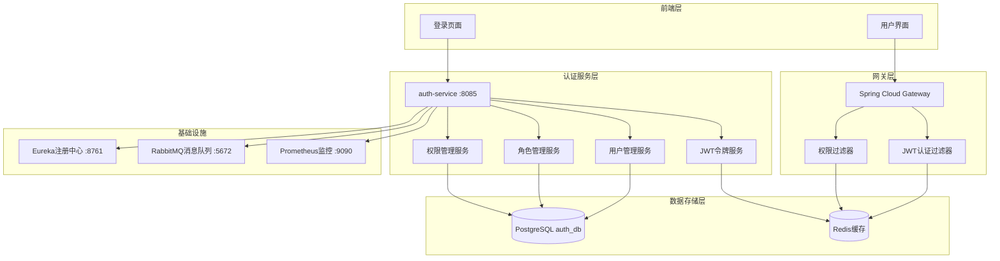
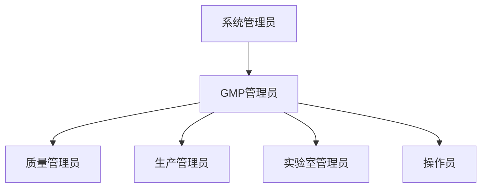

# 用户认证、权限管理和登录系统 - 总体设计

## 📋 文档信息

| 属性 | 值 |
|------|---|
| 文档标题 | 用户认证、权限管理和登录系统 - 总体设计 |
| 版本号 | v0.3.0-draft |
| 创建日期 | 2025年11月19日 |
| 更新日期 | 2025年11月19日 |
| 作者 | GMP系统开发团队 |
| 状态 | 草稿 |

## 🎯 概述

用户认证、权限管理和登录系统（以下简称"认证系统"）是GMP信息管理系统的核心安全组件，提供统一的身份认证、权限控制和安全访问管理。本系统基于微服务架构设计，支持GMP药品生产的合规性要求和安全性标准。

## 🏛️ 系统架构

### 总体架构图



## 🎯 设计目标

### 功能目标

- **安全性**：提供企业级安全认证机制
- **合规性**：满足GMP药品生产安全合规要求
- **扩展性**：支持微服务架构的权限控制
- **可用性**：提供直观的Web管理界面
- **可监控**：完整的审计日志和监控体系

### 性能目标

- **认证响应**：登录响应时间<500ms
- **权限检查**：API权限验证<100ms
- **并发处理**：支持1000+并发用户
- **系统可用性**：99.9%服务可用性

### 安全目标

- **密码复杂度**：符合企业安全标准
- **会话管理**：支持安全会话控制
- **审计跟踪**：完整的用户操作审计
- **合规性**：满足GMP CFR 21 Part 11要求

## 🔍 功能模块

### 核心功能模块

#### 1. 用户管理模块
- 用户注册和激活
- 用户信息维护
- 密码管理与重置
- 用户状态控制（激活、禁用、锁定）

#### 2. 身份认证模块
- JWT令牌生成和管理
- 多因素认证（MFA）支持
- 单点登录（SSO）集成
- 会话管理和超时控制

#### 3. 权限管理模块
- 角色权限体系设计
- 资源和权限分配
- 权限继承和控制
- 动态权限配置

#### 4. 安全审计模块
- 用户操作日志记录
- 登录记录和异常检测
- 权限变更审计
- 安全事件监控

#### 5. 管理界面模块
- Web管理控制台
- 角色权限管理界面
- 用户管理面板
- 安全监控仪表板

## 👥 用户角色体系

### 预定义角色等级



### 角色权限矩阵

| 角色 | 用户管理 | 系统配置 | QMS模块 | MES模块 | LIMS模块 | 审计日志 | 监控查看 |
|------|----------|----------|---------|---------|----------|----------|----------|
| 系统管理员 | ✅ | ✅ | ✅ | ✅ | ✅ | ✅ | ✅ |
| GMP管理员 | ✅ | ✅ | ✅ | ✅ | ✅ | ✅ | ✅ |
| 质量管理员 | ❌ | ❌ | ✅ | ❌ | ❌ | ✅ | ✅ |
| 生产管理员 | ❌ | ❌ | ❌ | ✅ | ❌ | ✅ | ✅ |
| 实验室管理员 | ❌ | ❌ | ❌ | ❌ | ✅ | ✅ | ✅ |
| 操作员 | ❌ | ❌ | 查看 | 参与 | 参与 | 查看 | 查看 |

## 🔐 安全策略

### 认证策略

- **密码加密**：BCrypt单向加密
- **密码策略**：至少8位，包含大小写字母+数字+特殊字符
- **JWT令牌**：RSA签名，24小时有效期
- **刷新令牌**：7天有效期，避免频繁登录

### 权限策略

- **RBAC模型**：基于角色的访问控制
- **资源权限**：细粒度API级别权限控制
- **权限缓存**：Redis高速权限缓存
- **动态更新**：支持运行时权限变更

### 会话管理

- **会话超时**：120分钟自动注销
- **并发登录**：每个用户只允许单一会话
- **令牌黑名单**：登出后令牌立即失效
- **安全检测**：异常登录IP检测和告警

## 🔄 集成方案

### 微服务集成

#### API网关集成
```yaml
spring:
  cloud:
    gateway:
      routes:
        - id: auth-service
          uri: lb://auth-service
          predicates:
            - Path=/api/auth/**
          filters:
            - StripPrefix=1
            - name: AuthenticationFilter
              args:
                authServiceUrl: http://auth-service:8085
```

#### 服务间调用
```java
@FeignClient("auth-service")
public interface AuthServiceClient {
    @PostMapping("/auth/verify")
    AuthResult verifyToken(@RequestBody TokenRequest request);
}
```

### 基础设施集成

#### 数据库集成
```yaml
spring:
  datasource:
    url: jdbc:postgresql://localhost:5432/auth_db
    username: auth_user
    password: ${DB_PASSWORD}
  jpa:
    hibernate:
      ddl-auto: validate
    show-sql: false
```

#### 缓存集成
```yaml
spring:
  data:
    redis:
      host: localhost
      port: 6379
      password: ${REDIS_PASSWORD}
      timeout: 2000ms
```

## 📊 性能需求

### 响应时间

| 操作类型 | 目标响应时间 | 允许最大延迟 |
|----------|--------------|--------------|
| 用户登录 | < 1000ms | < 3000ms |
| 页面加载 | < 500ms | < 1000ms |
| API权限验证 | < 50ms | < 200ms |
| 数据库查询 | < 100ms | < 500ms |

### 并发容量

- **并发用户数**：1000+ QPS
- **峰值处理**：5000 QPS
- **数据库连接池**：50个连接
- **缓存命中率**：>95%

### 高可用设计

- **负载均衡**：多实例部署
- **故障转移**：自动故障检测和恢复
- **数据备份**：每日自动备份策略
- **监控告警**：7×24小时监控

## 🏗️ 技术实现

### 技术栈

#### 后端技术
- **框架**：Spring Boot 3.2.5
- **安全**：Spring Security 6.2
- **数据库**：PostgreSQL 13 + Hibernate JPA
- **缓存**：Redis 7.2 + RedisTemplate
- **JWT**：JJWT 0.11.5
- **通信**：FeignClient + OpenFeign

#### 前端技术
- **框架**：Pure JavaScript + HTML5 + CSS3
- **样式**：Bootstrap 5.x
- **HTTP客户端**：Axios
- **表单验证**：自定义JavaScript

#### 基础设施
- **容器化**：Docker + Docker Compose
- **服务发现**：Netflix Eureka
- **API网关**：Spring Cloud Gateway
- **配置中心**：Spring Cloud Config (计划)
- **监控**：Prometheus + Grafana

### 部署架构

```yaml
# docker-compose 片段
services:
  auth-service:
    image: gmp-auth-service:v0.3.0
    ports:
      - "8085:8085"
    environment:
      - SPRING_PROFILES_ACTIVE=prod
      - EUREKA_CLIENT_SERVICE_URL_DEFAULTZONE=http://eureka-server:8761/eureka/
    depends_on:
      - postgres
      - redis
      - eureka-server
    networks:
      - gmp-network
```

## 🔍 风险评估

### 技术风险

1. **性能风险**：JWT验证成为性能瓶颈
   - **缓解方案**：Redis缓存权限数据，优化JWT验证算法

2. **安全风险**：JWT泄密导致权限泄露
   - **缓解方案**：使用RSA签名，定期轮换密钥，HTTPS传输

3. **可用性风险**：单点故障影响全系统
   - **缓解方案**：多实例部署，Redis HA集群配置

### 业务风险

1. **合规风险**：违反GMP审计要求
   - **缓解方案**：完整的审计日志，操作留痕机制

2. **用户体验风险**：复杂的权限控制影响操作效率
   - **缓解方案**：界面的平滑过渡，权限配置的简化

## 📋 开发计划

### 第一阶段 (已完成)
- ✅ 基础设施部署
- ✅ 总体设计文档
- ✅ 版本管理 (v0.1.0-0.2.0)

### 第二阶段 (当前阶段)
- 🔄 详细设计文档
- 🔄 数据库设计
- 🔄 API接口设计

### 第三阶段 (下一个阶段)
- 📅 后端服务实现
- 📅 前端界面开发
- 📅 集成测试

### 第四阶段 (最终上线)
- 📅 系统联调
- 📅 安全测试
- 📅 生产部署

---

*文档版本：v0.2.0-draft*
*审核状态：待审核*
*下次更新：详细设计完成*
