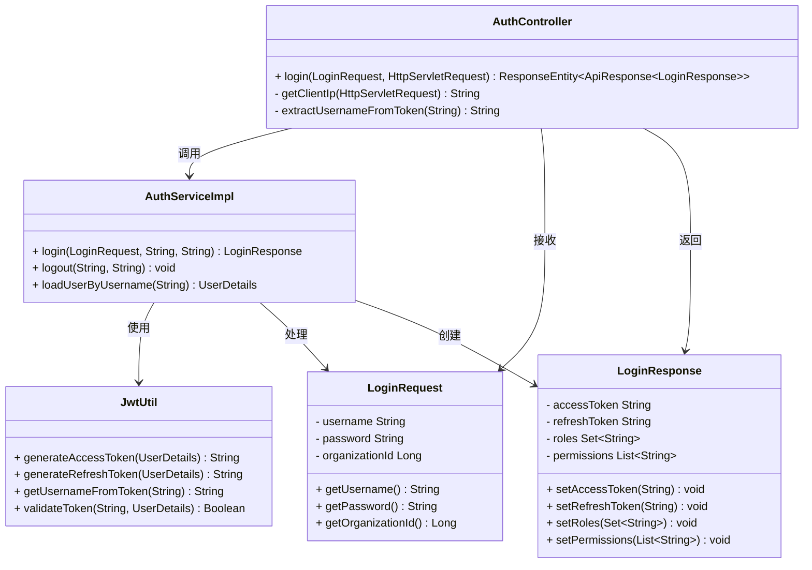
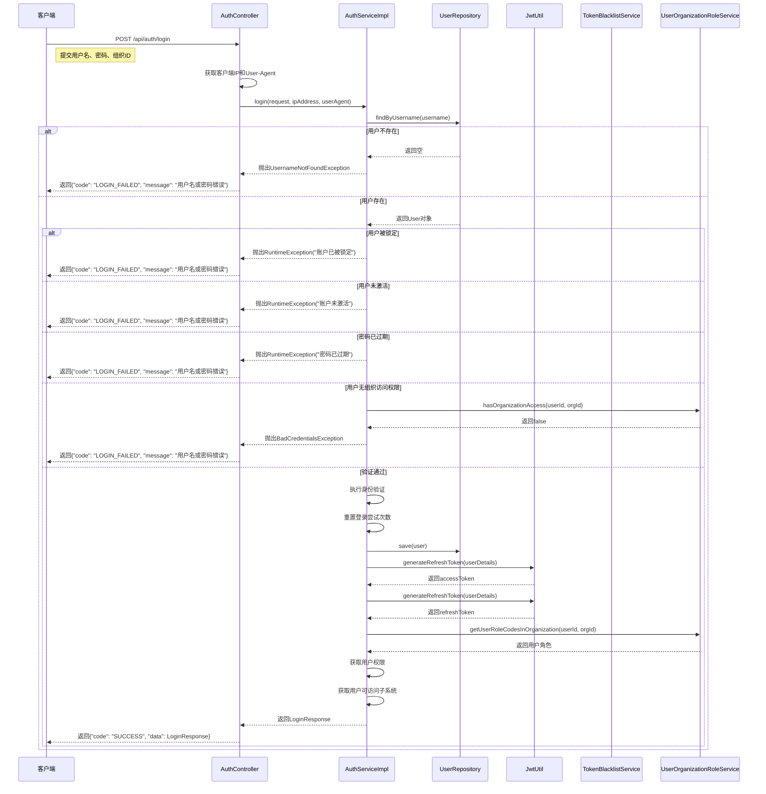
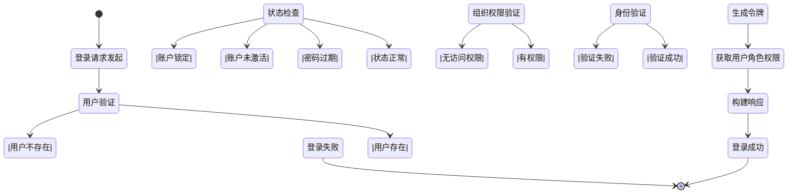
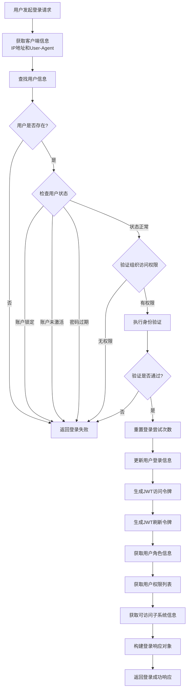
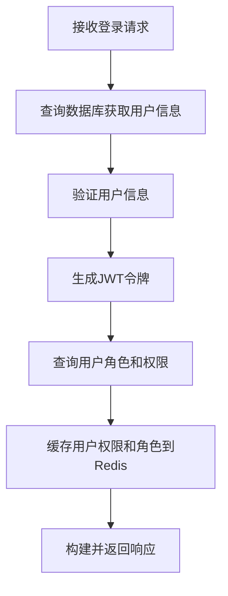
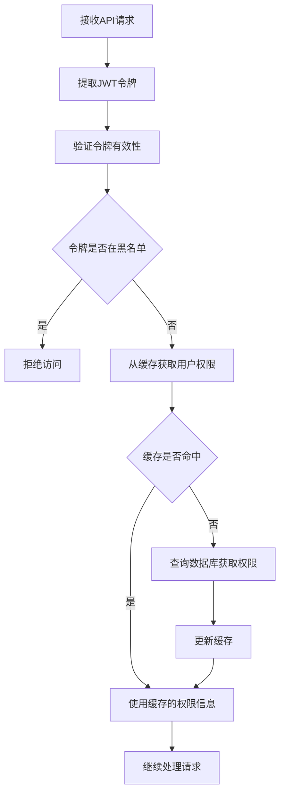
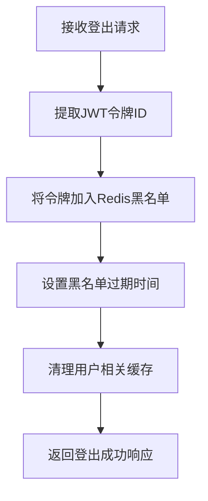

# 用户登录流程详细设计文档

## 1. 概述

本文档详细描述GMP认证系统中的用户登录流程设计，包括系统组件交互、数据流程、核心算法以及相关类的实现。该流程实现了基于JWT的身份认证机制，支持多组织架构下的用户登录和权限验证。

## 2. 功能需求

根据认证系统的需求文档，用户登录流程应满足以下功能需求：

- 支持用户名密码登录认证
- 支持多组织架构，用户可选择特定组织登录
- 支持JWT令牌生成和验证
- 支持用户角色和权限信息的获取
- 支持用户可访问子系统信息的获取
- 支持登录日志记录

## 3. 核心组件

### 3.1 控制器层

**AuthController**

主要负责接收和处理HTTP登录请求，包括：
- 接收登录请求参数
- 获取客户端IP地址和用户代理信息
- 调用认证服务进行登录验证
- 返回登录结果

### 3.2 服务层

**AuthServiceImpl**

实现核心的认证业务逻辑，包括：
- 用户身份验证
- 用户状态检查
- 组织访问权限验证
- JWT令牌生成
- 用户角色和权限获取
- 登录日志记录

### 3.3 工具类

**JwtUtil**

提供JWT令牌相关的工具方法，包括：
- 令牌生成
- 令牌解析
- 令牌验证
- 令牌撤销

### 3.4 数据传输对象

**LoginRequest**

封装登录请求参数：
- 用户名
- 密码
- 组织ID
- 记住我选项
- 验证码

**LoginResponse**

封装登录响应数据：
- 访问令牌
- 刷新令牌
- 令牌类型
- 过期时间
- 用户信息
- 角色信息
- 权限信息
- 可访问子系统信息

## 4. 类图



## 5. 顺序图



## 6. 状态图



## 7. 活动图



## 8. 核心算法

### 8.1 JWT令牌生成算法

JWT令牌生成使用HMAC-SHA512算法进行签名，主要步骤包括：

1. 创建令牌声明（Claims），包含用户信息和角色权限
2. 设置令牌主题（Subject）为用户名
3. 生成唯一令牌ID
4. 设置令牌签发时间和过期时间
5. 使用密钥对令牌进行签名
6. 返回紧凑格式的JWT字符串

```java
private String doGenerateToken(Map<String, Object> claims, String subject, long expiration) {
    String tokenId = UUID.randomUUID().toString();
    
    return Jwts.builder()
            .setClaims(claims)
            .setSubject(subject)
            .setId(tokenId)
            .setIssuedAt(new Date(System.currentTimeMillis()))
            .setExpiration(new Date(System.currentTimeMillis() + expiration * 1000))
            .setIssuer("GMP-Auth-Service")
            .setNotBefore(new Date(System.currentTimeMillis()))
            .signWith(getSigningKey(), SignatureAlgorithm.HS512)
            .compact();
}
```

### 8.2 用户身份验证算法

用户身份验证使用Spring Security的AuthenticationManager，主要步骤包括：

1. 构建UsernamePasswordAuthenticationToken对象
2. 调用AuthenticationManager的authenticate方法进行身份验证
3. 将验证结果设置到SecurityContext中
4. 验证成功后重置登录尝试次数并更新登录信息

### 8.3 令牌验证算法

令牌验证主要包括以下步骤：

1. 解析JWT令牌获取Claims
2. 验证令牌签名是否有效
3. 验证令牌是否已过期
4. 验证令牌是否已被撤销
5. 验证令牌中的用户名与当前用户匹配

```java
public Boolean validateToken(String token, UserDetails userDetails) {
    try {
        final String username = getUsernameFromToken(token);
        return (username.equals(userDetails.getUsername()) && 
               !isTokenExpired(token) && 
               !isTokenRevoked(token));
    } catch (JwtException e) {
        logger.error("JWT令牌验证失败: {}", e.getMessage());
        return false;
    }
}
```

## 9. 数据结构

### 9.1 用户请求数据结构

| 字段名 | 数据类型 | 必填 | 描述 |
|-------|---------|------|------|
| username | String | 是 | 用户名 |
| password | String | 是 | 密码 |
| rememberMe | Boolean | 否 | 记住我选项 |
| captchaCode | String | 否 | 验证码 |
| organizationId | Long | 否 | 组织ID |

### 9.2 登录响应数据结构

| 字段名 | 数据类型 | 描述 |
|-------|---------|------|
| accessToken | String | 访问令牌 |
| refreshToken | String | 刷新令牌 |
| tokenType | String | 令牌类型 |
| expiresIn | Long | 令牌过期时间（秒） |
| userId | Long | 用户ID |
| username | String | 用户名 |
| fullName | String | 用户全名 |
| organizationId | Long | 组织ID |
| roles | Set<String> | 用户角色集合 |
| permissions | List<String> | 用户权限列表 |
| accessibleSubsystems | List<String> | 可访问子系统列表 |
| subsystemAccessLevels | Map<String, Integer> | 子系统访问级别映射 |
| loginTime | LocalDateTime | 登录时间 |

## 10. 异常处理

登录流程中的异常处理主要包括：

1. **用户名不存在**：返回通用错误信息，避免泄露用户名是否存在
2. **账户锁定**：返回登录失败错误
3. **账户未激活**：返回登录失败错误
4. **密码过期**：返回登录失败错误
5. **无组织访问权限**：返回登录失败错误
6. **身份验证失败**：返回登录失败错误
7. **令牌生成失败**：记录日志并返回错误信息

## 11. 安全考虑

1. 密码存储采用加密存储（使用Spring Security的PasswordEncoder）
2. JWT令牌使用HMAC-SHA512算法进行签名，确保令牌的完整性和真实性
3. 令牌包含过期时间，自动失效
4. 登录失败记录日志，可用于安全审计
5. 登录成功记录IP地址和用户代理信息，用于跟踪用户活动
6. 支持令牌撤销机制，用户登出时将令牌加入黑名单

## 12. 性能优化

1. 使用Spring Security的缓存机制缓存用户信息，减少数据库查询
2. JWT令牌生成使用高效的算法实现
3. 登录成功后重置登录尝试次数，避免累积导致性能问题
4. 系统健康检查API提供服务状态监控

## 13. 相关接口

| API路径 | 方法 | 功能描述 |
|--------|------|--------|
| /api/auth/login | POST | 用户登录 |
| /api/auth/logout | POST | 用户登出 |
| /api/auth/health | GET | 系统健康检查 |

## 14. 数据库与缓存交互设计

### 14.1 PostgreSQL数据库交互

#### 14.1.1 配置信息

认证系统使用PostgreSQL作为主数据库，存储用户信息、权限和角色数据。配置信息如下：

```yaml
spring:
  datasource:
    url: jdbc:postgresql://localhost:5432/auth_db
    username: auth_user
    password: auth123456
    driver-class-name: org.postgresql.Driver
    hikari:
      maximum-pool-size: 10
      minimum-idle: 5
      connection-timeout: 30000
      max-lifetime: 1800000
  jpa:
    hibernate:
      ddl-auto: update
    show-sql: false
    properties:
      hibernate:
        dialect: org.hibernate.dialect.PostgreSQLDialect
        jdbc.lob.non_contextual_creation: true
```

#### 14.1.2 数据模型

系统通过JPA实体映射管理以下核心数据：
- 用户信息（User）
- 用户组织角色关联（UserOrganizationRole）
- 组织信息（Organization）
- 角色和权限信息

#### 14.1.3 交互方式

认证系统通过Spring Data JPA与PostgreSQL进行交互：

1. **用户验证流程**：
   - 通过`UserRepository.findByUsername(username)`查询用户信息
   - 验证用户状态（是否锁定、激活、密码是否过期）
   - 验证用户对组织的访问权限
   - 验证成功后更新用户登录信息

2. **用户信息获取**：
   - 通过`userRepository.findById(userId)`获取用户详细信息
   - 通过`userOrganizationRoleService`获取用户在特定组织中的角色和权限

3. **数据持久化**：
   - 用户登录成功后更新登录时间、IP等信息
   - 重置登录失败次数

### 14.2 Redis缓存交互

#### 14.2.1 配置信息

认证系统使用Redis作为缓存和令牌管理存储，配置信息如下：

```yaml
spring:
  redis:
    host: localhost
    port: 6379
    password: ''
    timeout: 10000
    database: 0
```

#### 14.2.2 Redis配置实现

Redis配置通过`RedisConfig`和`RedisCacheConfig`类实现：

1. **RedisTemplate配置**：
   - 使用`StringRedisSerializer`作为key序列化器
   - 使用`GenericJackson2JsonRedisSerializer`作为value序列化器
   - 支持复杂对象的序列化和反序列化

2. **缓存配置**：
   - 默认缓存过期时间：1小时
   - `revokedTokens`缓存过期时间：基于JWT刷新令牌过期时间
   - `userPermissions`缓存过期时间：30分钟
   - `userRoles`缓存过期时间：30分钟

#### 14.2.3 令牌黑名单管理

系统通过`TokenBlacklistServiceImpl`实现JWT令牌的黑名单管理：

1. **令牌黑名单存储结构**：
   - 键格式：`token:blacklist:{tokenId}`
   - 值：令牌信息
   - 过期时间：与JWT刷新令牌的过期时间一致

2. **核心方法**：
   - `blacklistToken(String tokenId, Date expirationTime)`：将令牌加入黑名单并设置过期时间
   - `isTokenBlacklisted(String tokenId)`：检查令牌是否在黑名单中
   - `removeTokenFromBlacklist(String tokenId)`：从黑名单中移除令牌

#### 14.2.4 用户权限和角色缓存

为提高系统性能，用户的权限和角色信息通过Redis缓存：

1. **缓存键格式**：
   - 用户权限缓存：`userPermissions:{userId}:{organizationId}`
   - 用户角色缓存：`userRoles:{userId}:{organizationId}`

2. **缓存注解使用**：
   - 使用`@Cacheable`注解缓存用户权限和角色数据
   - 缓存自动过期，保证数据的最终一致性

### 14.3 数据流向

#### 14.3.1 登录流程数据流向



#### 14.3.2 令牌验证流程数据流向



#### 14.3.3 登出流程数据流向



### 14.4 性能优化策略

1. **缓存策略**：
   - 热点数据（用户权限、角色）优先缓存
   - 设置合理的缓存过期时间，平衡性能和数据一致性

2. **连接池优化**：
   - 使用HikariCP连接池管理数据库连接
   - 合理配置连接池大小和超时时间

3. **查询优化**：
   - 按需获取用户信息，避免不必要的关联查询
   - 使用索引优化用户查询性能

## 15. 总结

用户登录流程是GMP认证系统的核心功能之一，通过JWT令牌机制结合PostgreSQL和Redis实现了安全高效的身份认证。本设计文档详细描述了登录流程的各个组件、交互关系、数据流程以及与数据库和缓存的交互设计，为系统实现提供了详细的技术指导。