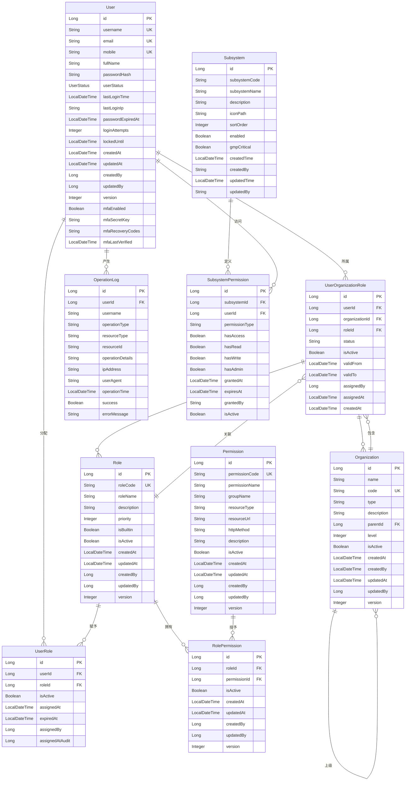

# GMP认证系统数据模型ER图及设计报告

## 📋 文档信息

| 属性 | 值 |
|------|---|
| 文档标题 | GMP认证系统数据模型ER图及设计报告 |
| 版本号 | v1.0.0 |
| 创建日期 | 2025年11月26日 |
| 作者 | GMP系统开发团队 |
| 状态 | 完成 |

## 1. 数据模型概述

### 1.1 设计目标

基于Spring Cloud微服务架构的GMP认证系统，采用RBAC（基于角色的访问控制）权限模型，实现用户认证、授权管理、操作审计等核心功能。通过实体关系模型实现：

- **用户管理**：多状态用户生命周期管理（ACTIVE/INACTIVE/LOCKED等）
- **权限控制**：角色-权限关联，支持细粒度权限控制
- **组织架构**：分层组织结构，支撑复杂的企业组织关系
- **审计追踪**：完整的操作日志记录，支持合规性追溯

### 1.2 核心设计原则

1. **安全性优先**：密码加密、JWT Token管理、操作审计
2. **数据完整性**：外键约束、唯一性约束、状态检查
3. **扩展性**：模块化设计，支持多租户和子系统扩展
4. **性能优化**：合理的索引设计、缓存策略

## 2. 实体关系图 (ERD)



## 3. 实体详细设计

### 3.1 User (用户表)

| 字段名 | 数据类型 | 约束 | 描述 |
|-------|---------|------|-----|
| `id` | BIGINT | PRIMARY KEY | 用户ID |
| `username` | VARCHAR(100) | UNIQUE NOT NULL | 用户名 |
| `email` | VARCHAR(255) | UNIQUE | 邮箱 |
| `mobile` | VARCHAR(20) | UNIQUE | 手机号 |
| `full_name` | VARCHAR(200) | NOT NULL | 姓名 |
| `password_hash` | VARCHAR(255) | NOT NULL | 密码哈希 |
| `user_status` | VARCHAR(20) | NOT NULL DEFAULT 'ACTIVE' | 用户状态 |
| `last_login_time` | TIMESTAMP | - | 最后登录时间 |
| `last_login_ip` | VARCHAR(50) | - | 最后登录IP |
| `password_expired_at` | TIMESTAMP | - | 密码过期时间 |
| `login_attempts` | INTEGER | DEFAULT 0 | 登录尝试次数 |
| `locked_until` | TIMESTAMP | - | 锁定截止时间 |
| `created_at` | TIMESTAMP | NOT NULL | 创建时间 |
| `updated_at` | TIMESTAMP | NOT NULL | 更新时间 |
| `created_by` | BIGINT | - | 创建者ID |
| `updated_by` | BIGINT | - | 更新者ID |
| `version` | INTEGER | DEFAULT 1 | 版本号 |
| `mfa_enabled` | BOOLEAN | DEFAULT FALSE | 多因素认证启用 |
| `mfa_secret_key` | VARCHAR(100) | - | MFA密钥 |
| `mfa_recovery_codes` | VARCHAR(500) | - | 恢复码 |
| `mfa_last_verified` | TIMESTAMP | - | 最后验证时间 |

**关键约束：**
- 用户名、邮箱、手机号必须唯一
- 密码采用BCrypt加密
- 支持MFA多因素认证
- 用户状态枚举：ACTIVE(活跃)、INACTIVE(未激活)、LOCKED(锁定)、EXPIRED(过期)

### 3.2 Role (角色表)

| 字段名 | 数据类型 | 约束 | 描述 |
|-------|---------|------|-----|
| `id` | BIGINT | PRIMARY KEY | 角色ID |
| `role_code` | VARCHAR(100) | UNIQUE NOT NULL | 角色代码 |
| `role_name` | VARCHAR(200) | NOT NULL | 角色名称 |
| `description` | TEXT | - | 角色描述 |
| `priority` | INTEGER | DEFAULT 0 | 角色优先级 |
| `is_builtin` | BOOLEAN | DEFAULT FALSE | 是否内置角色 |
| `is_active` | BOOLEAN | DEFAULT TRUE | 是否启用 |
| `created_at` | TIMESTAMP | - | 创建时间 |
| `updated_at` | TIMESTAMP | - | 更新时间 |
| `created_by` | BIGINT | - | 创建者ID |
| `updated_by` | BIGINT | - | 更新者ID |
| `version` | INTEGER | DEFAULT 1 | 版本号 |

**设计说明：**
- 角色代码采用ROLE_前缀规范，如ROLE_ADMIN、ROLE_QMS_MANAGER
- 支持优先级排序，便于权限冲突解决
- 内置角色不可删除，由系统预定义

### 3.3 Permission (权限表)

| 字段名 | 数据类型 | 约束 | 描述 |
|-------|---------|------|-----|
| `id` | BIGINT | PRIMARY KEY | 权限ID |
| `permission_code` | VARCHAR(100) | UNIQUE NOT NULL | 权限代码 |
| `permission_name` | VARCHAR(200) | NOT NULL | 权限名称 |
| `group_name` | VARCHAR(100) | - | 权限分组 |
| `resource_type` | VARCHAR(50) | - | 资源类型 |
| `resource_url` | VARCHAR(500) | - | 资源URL |
| `http_method` | VARCHAR(20) | - | HTTP方法 |
| `description` | TEXT | - | 权限描述 |
| `is_active` | BOOLEAN | DEFAULT TRUE | 是否启用 |
| `created_at` | TIMESTAMP | NOT NULL | 创建时间 |
| `updated_at` | TIMESTAMP | NOT NULL | 更新时间 |
| `created_by` | BIGINT | - | 创建者ID |
| `updated_by` | BIGINT | - | 更新者ID |
| `version` | INTEGER | DEFAULT 1 | 版本号 |

**设计说明：**
- 权限代码采用PERMISSION_前缀，如PERMISSION_SYSTEM_ACCESS
- 支持URL模式匹配和HTTP方法控制
- 权限分组用于界面展示和管理

### 3.4 UserRole (用户角色关联表)

| 字段名 | 数据类型 | 约束 | 描述 |
|-------|---------|------|-----|
| `id` | BIGINT | PRIMARY KEY | 关联ID |
| `user_id` | BIGINT | FOREIGN KEY NOT NULL | 用户ID |
| `role_id` | BIGINT | FOREIGN KEY NOT NULL | 角色ID |
| `is_active` | BOOLEAN | DEFAULT TRUE | 是否有效 |
| `assigned_at` | TIMESTAMP | NOT NULL | 分配时间 |
| `expired_at` | TIMESTAMP | - | 过期时间 |
| `assigned_by` | BIGINT | - | 分配人 |
| `assigned_at_audit` | TIMESTAMP | - | 审计分配时间 |

**关键约束：**
- UNIQUE(user_id, role_id) 确保用户角色唯一
- 支持时间范围控制的角色分配
- 记录分配人，便于审计追踪

### 3.5 RolePermission (角色权限关联表)

| 字段名 | 数据类型 | 约束 | 描述 |
|-------|---------|------|-----|
| `id` | BIGINT | PRIMARY KEY | 关联ID |
| `role_id` | BIGINT | FOREIGN KEY NOT NULL | 角色ID |
| `permission_id` | BIGINT | FOREIGN KEY NOT NULL | 权限ID |
| `is_active` | BOOLEAN | DEFAULT TRUE | 是否有效 |
| `created_at` | TIMESTAMP | NOT NULL | 创建时间 |
| `updated_at` | TIMESTAMP | NOT NULL | 更新时间 |
| `created_by` | BIGINT | - | 创建者ID |
| `updated_by` | BIGINT | - | 更新者ID |
| `version` | INTEGER | DEFAULT 1 | 版本号 |

**关键约束：**
- UNIQUE(role_id, permission_id) 确保角色权限唯一
- 支持软删除，通过is_active控制状态

### 3.6 Organization (组织表)

| 字段名 | 数据类型 | 约束 | 描述 |
|-------|---------|------|-----|
| `id` | BIGINT | PRIMARY KEY | 组织ID |
| `name` | VARCHAR(200) | NOT NULL | 组织名称 |
| `code` | VARCHAR(50) | UNIQUE NOT NULL | 组织代码 |
| `type` | VARCHAR(50) | - | 组织类型 |
| `description` | TEXT | - | 组织描述 |
| `parent_id` | BIGINT | FOREIGN KEY | 父组织ID |
| `level` | INTEGER | DEFAULT 1 | 组织层级 |
| `is_active` | BOOLEAN | DEFAULT TRUE | 是否启用 |
| `created_at` | TIMESTAMP | NOT NULL | 创建时间 |
| `created_by` | VARCHAR(100) | - | 创建者 |
| `updated_at` | TIMESTAMP | NOT NULL | 更新时间 |
| `updated_by` | BIGINT | - | 更新者ID |
| `version` | INTEGER | DEFAULT 1 | 版本号 |

**设计说明：**
- 支持树形组织结构
- 层级计算自动维护
- 组织类型支持扩展（如COMPANY、DEPARTMENT等）

### 3.7 UserOrganizationRole (用户组织角色关联表)

| 字段名 | 数据类型 | 约束 | 描述 |
|-------|---------|------|-----|
| `id` | BIGINT | PRIMARY KEY | 关联ID |
| `user_id` | BIGINT | FOREIGN KEY NOT NULL | 用户ID |
| `organization_id` | BIGINT | FOREIGN KEY NOT NULL | 组织ID |
| `role_id` | BIGINT | FOREIGN KEY NOT NULL | 角色ID |
| `status` | VARCHAR(20) | DEFAULT 'APPROVED' | 状态 |
| `is_active` | BOOLEAN | DEFAULT TRUE | 是否有效 |
| `valid_from` | TIMESTAMP | NOT NULL | 有效期开始 |
| `valid_to` | TIMESTAMP | - | 有效期结束 |
| `assigned_by` | BIGINT | - | 分配人 |
| `assigned_at` | TIMESTAMP | NOT NULL | 分配时间 |
| `created_at` | TIMESTAMP | NOT NULL | 创建时间 |

**设计说明：**
- 关联用户、组织、角色的三元关系
- 支持状态审批流程
- 时间范围控制的有效期管理

### 3.8 Subsystem (子系统表)

| 字段名 | 数据类型 | 约束 | 描述 |
|-------|---------|------|-----|
| `id` | BIGINT | PRIMARY KEY | 子系统ID |
| `subsystem_code` | VARCHAR(100) | UNIQUE | 子系统编码 |
| `subsystem_name` | VARCHAR(200) | - | 子系统名称 |
| `description` | TEXT | - | 子系统描述 |
| `icon_path` | VARCHAR(255) | - | 图标路径 |
| `sort_order` | INTEGER | - | 排序序号 |
| `enabled` | BOOLEAN | DEFAULT TRUE | 是否启用 |
| `gmp_critical` | BOOLEAN | DEFAULT FALSE | 是否GMP关键系统 |
| `created_time` | TIMESTAMP | - | 创建时间 |
| `created_by` | VARCHAR(100) | - | 创建者 |
| `updated_time` | TIMESTAMP | - | 更新时间 |
| `updated_by` | VARCHAR(100) | - | 更新者 |

**设计说明：**
- 定义GMP系统的各个子系统
- 支持GMP关键系统标识
- 可配置的显示顺序和图标

### 3.9 SubsystemPermission (子系统权限表)

| 字段名 | 数据类型 | 约束 | 描述 |
|-------|---------|------|-----|
| `id` | BIGINT | PRIMARY KEY | 权限ID |
| `subsystem_id` | BIGINT | FOREIGN KEY | 子系统ID |
| `user_id` | BIGINT | FOREIGN KEY | 用户ID |
| `permission_type` | VARCHAR(50) | - | 权限类型 |
| `has_access` | BOOLEAN | DEFAULT FALSE | 访问权限 |
| `has_read` | BOOLEAN | DEFAULT FALSE | 读取权限 |
| `has_write` | BOOLEAN | DEFAULT FALSE | 写入权限 |
| `has_admin` | BOOLEAN | DEFAULT FALSE | 管理权限 |
| `granted_at` | TIMESTAMP | - | 授权时间 |
| `expires_at` | TIMESTAMP | - | 过期时间 |
| `granted_by` | VARCHAR(100) | - | 授权人 |
| `is_active` | BOOLEAN | DEFAULT TRUE | 是否有效 |

**设计说明：**
- 细粒度的子系统访问控制
- 支持多种权限级别（访问、读取、写入、管理）
- 基于用户的权限分配

### 3.10 OperationLog (操作日志表)

| 字段名 | 数据类型 | 约束 | 描述 |
|-------|---------|------|-----|
| `id` | BIGINT | PRIMARY KEY | 日志ID |
| `user_id` | BIGINT | FOREIGN KEY | 用户ID |
| `username` | VARCHAR(100) | - | 用户名 |
| `operation_type` | VARCHAR(50) | NOT NULL | 操作类型 |
| `resource_type` | VARCHAR(50) | - | 资源类型 |
| `resource_id` | VARCHAR(100) | - | 资源ID |
| `operation_details` | TEXT | - | 操作详情 |
| `ip_address` | VARCHAR(50) | - | IP地址 |
| `user_agent` | VARCHAR(500) | - | 用户代理 |
| `operation_time` | TIMESTAMP | NOT NULL | 操作时间 |
| `success` | BOOLEAN | DEFAULT TRUE | 是否成功 |
| `error_message` | TEXT | - | 错误信息 |

**设计说明：**
- 完整的操作审计日志
- 支持多维度查询和分析
- GMP合规审计要求

## 4. 索引设计

### 4.1 主键和外键索引
所有主键自动创建索引，外键字段建议创建索引以提高查询性能。

### 4.2 性能优化索引

```sql
-- 用户查询优化
CREATE INDEX idx_user_username ON sys_users(username);
CREATE INDEX idx_user_email ON sys_users(email);
CREATE INDEX idx_user_mobile ON sys_users(mobile);
CREATE INDEX idx_user_status ON sys_users(user_status);

-- 角色查询优化
CREATE INDEX idx_role_code ON sys_roles(role_code);
CREATE INDEX idx_role_name ON sys_roles(role_name);

-- 权限查询优化
CREATE INDEX idx_permission_code ON sys_permissions(permission_code);
CREATE INDEX idx_permission_group ON sys_permissions(group_name);
CREATE INDEX idx_permission_resource ON sys_permissions(resource_type, resource_url);

-- 用户角色关联查询优化
CREATE INDEX idx_user_role_user ON sys_user_roles(user_id);
CREATE INDEX idx_user_role_role ON sys_user_roles(role_id);
CREATE INDEX idx_user_role_status ON sys_user_roles(is_active);

-- 角色权限关联查询优化
CREATE INDEX idx_role_perm_role ON role_permissions(role_id);
CREATE INDEX idx_role_perm_permission ON role_permissions(permission_id);

-- 组织查询优化
CREATE INDEX idx_org_code ON sys_organizations(code);
CREATE INDEX idx_org_parent ON sys_organizations(parent_id);
CREATE INDEX idx_org_level ON sys_organizations(level);

-- 用户组织角色查询优化
CREATE INDEX idx_user_org_role_user ON sys_user_org_roles(user_id);
CREATE INDEX idx_user_org_role_org ON sys_user_org_roles(organization_id);
CREATE INDEX idx_user_org_role_role ON sys_user_org_roles(role_id);

-- 操作日志查询优化
CREATE INDEX idx_log_user ON user_operation_logs(user_id);
CREATE INDEX idx_log_time ON user_operation_logs(operation_time);
CREATE INDEX idx_log_type ON user_operation_logs(operation_type);
CREATE INDEX idx_log_resource ON user_operation_logs(resource_type);
```

## 5. 业务规则和约束

### 5.1 数据完整性约束

1. **用户相关约束**：
   - 用户名必须唯一，符合正则表达式格式
   - 密码加密存储，永远不以明文形式存储
   - 邮箱格式验证，保持唯一性
   - 登录尝试次数限制，防止暴力破解

2. **角色权限约束**：
   - 角色代码必须以ROLE_开头，使用大写字母和下划线
   - 权限代码必须以PERMISSION_开头
   - 角色和权限的状态控制其有效性

3. **组织架构约束**：
   - 组织代码全局唯一，作为业务标识
   - 组织层级关系防止形成循环引用
   - 父子关系维护层级正确性

### 5.2 业务规则

1. **密码策略**：
   - 密码复杂度要求：至少8位，包含字母、数字、特殊字符
   - 定期更换：建议90天更换一次
   - 历史密码：防止重复使用近期密码

2. **会话管理**：
   - JWT Token有效期控制：默认2小时
   - 自动续期机制：活动用户可自动续期
   - 多端登录限制：同一用户同时在线设备限制

3. **权限检查**：
   - 基于URL路径和HTTP方法的权限验证
   - 角色继承：高优先级角色拥有低优先级角色的权限
   - 临时权限：支持时间范围限定的临时权限

## 6. 性能优化策略

### 6.1 查询优化

1. **权限缓存**：
   - 用户权限信息缓存到Redis，过期时间5-15分钟
   - 权限变更时主动更新缓存

2. **预加载策略**：
   - 用户登录时一次性加载所有权限信息
   - 应用程序启动时预加载角色和权限定义

3. **分页查询**：
   - 大数据量查询使用分页机制
   - 索引优化分页查询性能

### 6.2 数据维护

1. **数据清理**：
   - 操作日志定期归档（超过1年的日志）
   - 过期JWT Token清理机制
   - 无效用户数据清理

2. **备份策略**：
   - 每日增量备份，重要数据实时备份
   - 权限数据备份恢复方案

## 7. 安全考虑

### 7.1 数据安全

1. **加密策略**：
   - 密码BCrypt加密
   - 敏感信息AES加密存储
   - 传输数据HTTPS加密

2. **访问控制**：
   - 多层权限验证机制
   - 最小权限原则
   - 权限分离设计

### 7.2 审计追踪

1. **操作审计**：
   - 所有重要操作记录审计日志
   - 操作失败记录错误原因
   - IP地址和用户代理信息记录

2. **合规要求**：
   - GMP 21 CFR Part 11合规
   - 数据完整性和不可否认性
   - 审计追踪完整性

## 8. 扩展性设计

### 8.1 多租户支持

1. **租户隔离**：
   - 数据层面的租户隔离
   - 权限体系的租户扩展
   - 子系统级别的租户管理

2. **自定义权限**：
   - 支持自定义权限扩展
   - 插件化的权限提供机制
   - 动态权限加载机制

### 8.2 子系统集成

1. **统一接口**：
   - 标准化的权限验证接口
   - 统一的认证接入方式
   - 服务间权限传递协议

2. **子系统权限**：
   - 细粒度的子系统权限控制
   - 子系统管理员角色支持
   - 跨子系统的权限继承

---

**总结：**

本数据模型设计基于实际的Spring Cloud微服务架构和实体类定义，采用RBAC权限模型，提供完整的用户认证、授权管理、审计追踪功能。设计重点考虑安全性、可扩展性、性能优化和GMP合规性要求，确保系统在生产环境中的稳定运行和合规性保障。
