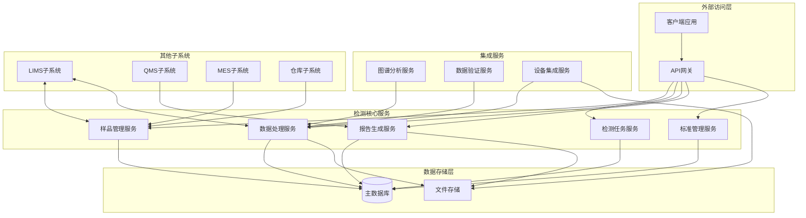
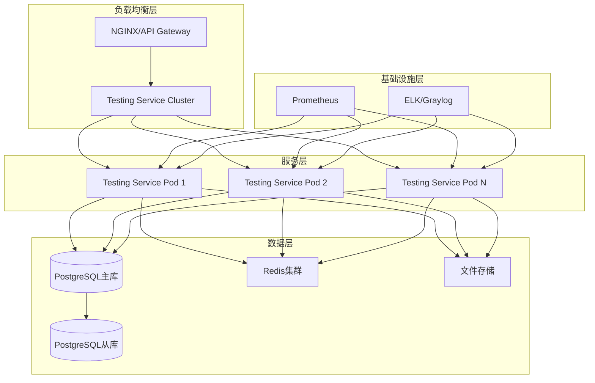

# 中成药检测子系统架构设计

## 1. 概述

中成药检测子系统基于微服务架构设计，实现中成药从原料到成品的全流程质量检测和控制，通过集成先进的检测设备、智能数据分析算法和合规性管理，确保中成药产品质量符合GMP要求和相关法规标准。

## 2. 系统架构

### 2.1 分层架构设计

中成药检测子系统采用典型的多层架构设计，确保系统的可维护性、可扩展性和安全性。


**分层说明：**

1. **表现层**
   - 提供Web界面和RESTful API接口
   - 支持检测任务创建、查询、结果录入和报告生成
   - 处理用户交互、数据验证和权限控制

2. **业务逻辑层**
   - 检测流程管理：样品接收、检测任务分配、结果审核
   - 标准管理：检测标准、限量标准、方法标准的管理
   - 数据处理：实验数据的计算、统计和分析
   - 报告生成：根据模板自动生成检测报告

3. **数据访问层**
   - 数据库交互：通过Repository模式实现数据访问抽象
   - 缓存操作：Redis缓存常用检测标准和限量值
   - 文件存储：实验数据、图谱、报告的存储和检索

4. **基础设施层**
   - 安全组件：加密算法、权限控制、审计日志
   - 配置管理：环境配置、系统参数设置
   - 日志记录：操作日志、系统日志、错误日志
   - 监控告警：系统性能、任务进度、异常监控

### 2.2 微服务架构图

中成药检测子系统作为GMP系统的核心组件之一，与其他子系统紧密协作，特别是与LIMS系统共享实验数据。



**架构组件说明：**

1. **样品管理服务**：负责样品接收、登记、编号和状态管理
2. **检测任务服务**：创建检测任务、分配检测人员、跟踪任务进度
3. **数据处理服务**：处理实验原始数据、进行计算和统计分析
4. **报告生成服务**：根据模板生成检测报告、管理报告版本
5. **标准管理服务**：维护检测标准、限量标准、方法标准
6. **图谱分析服务**：分析色谱图、光谱图等实验图谱数据
7. **数据验证服务**：验证实验数据的准确性、有效性和完整性
8. **设备集成服务**：与检测设备对接，实现数据自动采集

## 3. 服务设计

### 3.1 微服务边界

| 服务名称           | 主要职责                                       | 关键接口                                     | 依赖服务                     |
| :----------------- | :--------------------------------------------- | :------------------------------------------- | :--------------------------- |
| **样品管理服务**   | 样品接收、登记、存储管理                       | /api/samples, /api/samples/{id}/status       | 数据库、仓库子系统           |
| **检测任务服务**   | 检测任务创建、分配、进度跟踪                   | /api/tasks, /api/tasks/{id}/assign           | 数据库、用户服务             |
| **数据处理服务**   | 实验数据接收、计算、分析                       | /api/data, /api/data/analysis                | 数据库、文件存储、图谱分析服务 |
| **报告生成服务**   | 检测报告生成、审批、发布                       | /api/reports, /api/reports/{id}/approve      | 数据库、文件存储、QMS子系统 |
| **标准管理服务**   | 检测标准、限量标准维护                         | /api/standards, /api/limits                  | 数据库、缓存服务             |
| **图谱分析服务**   | 色谱图、光谱图等分析                           | /api/spectra/analyze, /api/chromatograms/compare | 数据库、文件存储             |

### 3.2 服务接口设计

#### 样品管理服务接口

| API路径                 | 方法 | 模块/文件                | 类型 | 功能描述                                     | 请求体 (JSON)                                                                   | 成功响应 (200 OK)                                                               |
| :---------------------- | :--- | :----------------------- | :--- | :------------------------------------------- | :------------------------------------------------------------------------------ | :------------------------------------------------------------------------------ |
| `/api/samples`          | `GET` | `chinese-medicine-testing-service/src/main/java/com/gmp/testing/controller/SampleController.java` | `Router` | 获取样品列表                                 | N/A                                                                             | `[{"id": "string", "code": "string", "name": "string", "status": "string"}]` |
| `/api/samples`          | `POST` | `chinese-medicine-testing-service/src/main/java/com/gmp/testing/controller/SampleController.java` | `Router` | 创建新样品                                   | `{"code": "string", "name": "string", "batchNo": "string", "spec": "string", "quantity": number}` | `{"id": "string", "code": "string", "name": "string", "createdAt": "string"}` |
| `/api/samples/{id}`     | `GET` | `chinese-medicine-testing-service/src/main/java/com/gmp/testing/controller/SampleController.java` | `Router` | 获取样品详情                                 | N/A                                                                             | `{"id": "string", "code": "string", "name": "string", "batchNo": "string", "status": "string"}` |
| `/api/samples/{id}`     | `PUT` | `chinese-medicine-testing-service/src/main/java/com/gmp/testing/controller/SampleController.java` | `Router` | 更新样品信息                                 | `{"name": "string", "batchNo": "string", "spec": "string", "quantity": number}` | `{"id": "string", "code": "string", "name": "string", "updatedAt": "string"}` |
| `/api/samples/{id}/status` | `PUT` | `chinese-medicine-testing-service/src/main/java/com/gmp/testing/controller/SampleController.java` | `Router` | 更新样品状态                                 | `{"status": "string", "remark": "string"}`                                | `{"id": "string", "status": "string", "updatedAt": "string"}`        |

#### 检测任务服务接口

| API路径                 | 方法 | 模块/文件                | 类型 | 功能描述                                     | 请求体 (JSON)                                                                   | 成功响应 (200 OK)                                                               |
| :---------------------- | :--- | :----------------------- | :--- | :------------------------------------------- | :------------------------------------------------------------------------------ | :------------------------------------------------------------------------------ |
| `/api/tasks`            | `GET` | `chinese-medicine-testing-service/src/main/java/com/gmp/testing/controller/TaskController.java` | `Router` | 获取任务列表                                 | N/A                                                                             | `[{"id": "string", "sampleId": "string", "taskName": "string", "status": "string"}]` |
| `/api/tasks`            | `POST` | `chinese-medicine-testing-service/src/main/java/com/gmp/testing/controller/TaskController.java` | `Router` | 创建检测任务                                 | `{"sampleId": "string", "taskName": "string", "testItems": ["string"], "deadline": "string"}` | `{"id": "string", "taskCode": "string", "taskName": "string", "createdAt": "string"}` |
| `/api/tasks/{id}`       | `GET` | `chinese-medicine-testing-service/src/main/java/com/gmp/testing/controller/TaskController.java` | `Router` | 获取任务详情                                 | N/A                                                                             | `{"id": "string", "sampleId": "string", "taskName": "string", "status": "string", "testItems": ["string"]}` |
| `/api/tasks/{id}/assign` | `PUT` | `chinese-medicine-testing-service/src/main/java/com/gmp/testing/controller/TaskController.java` | `Router` | 分配任务                                     | `{"assigneeId": "string", "assignTime": "string"}`                        | `{"id": "string", "assigneeId": "string", "status": "ASSIGNED"}`      |
| `/api/tasks/{id}/complete` | `PUT` | `chinese-medicine-testing-service/src/main/java/com/gmp/testing/controller/TaskController.java` | `Router` | 完成任务                                     | `{"resultIds": ["string"], "completionTime": "string"}`                   | `{"id": "string", "status": "COMPLETED", "completedAt": "string"}`   |

#### 数据处理服务接口

| API路径                 | 方法 | 模块/文件                | 类型 | 功能描述                                     | 请求体 (JSON)                                                                   | 成功响应 (200 OK)                                                               |
| :---------------------- | :--- | :----------------------- | :--- | :------------------------------------------- | :------------------------------------------------------------------------------ | :------------------------------------------------------------------------------ |
| `/api/data`             | `GET` | `chinese-medicine-testing-service/src/main/java/com/gmp/testing/controller/DataController.java` | `Router` | 获取检测数据列表                             | N/A                                                                             | `[{"id": "string", "taskId": "string", "testItem": "string", "value": "string"}]` |
| `/api/data`             | `POST` | `chinese-medicine-testing-service/src/main/java/com/gmp/testing/controller/DataController.java` | `Router` | 录入检测数据                                 | `{"taskId": "string", "testItem": "string", "value": "string", "unit": "string", "analystId": "string"}` | `{"id": "string", "taskId": "string", "testItem": "string", "createdAt": "string"}` |
| `/api/data/{id}`        | `PUT` | `chinese-medicine-testing-service/src/main/java/com/gmp/testing/controller/DataController.java` | `Router` | 更新检测数据                                 | `{"value": "string", "unit": "string", "remark": "string"}`           | `{"id": "string", "value": "string", "updatedAt": "string"}`         |
| `/api/data/analysis`    | `POST` | `chinese-medicine-testing-service/src/main/java/com/gmp/testing/controller/DataAnalysisController.java` | `Router` | 数据统计分析                                 | `{"dataIds": ["string"], "analysisType": "string"}`                       | `{"analysisResult": {...}, "charts": [...]}`                                 |
| `/api/data/validate`    | `POST` | `chinese-medicine-testing-service/src/main/java/com/gmp/testing/controller/DataValidationController.java` | `Router` | 验证数据有效性                               | `{"data": [{"testItem": "string", "value": "string", "unit": "string"}]}` | `{"validResults": [...], "invalidResults": [...]}`                            |

## 4. 数据架构设计

### 4.1 核心数据模型

#### 样品模型 (Sample)

```java
@Entity
@Table(name = "cmt_samples")
public class Sample {
    @Id
    @GeneratedValue(strategy = GenerationType.UUID)
    private String id;
    
    @Column(nullable = false, unique = true)
    private String code; // 样品编号
    
    @Column(nullable = false)
    private String name; // 样品名称
    
    @Column(name = "batch_no")
    private String batchNo; // 批次号
    
    private String spec; // 规格
    
    private Integer quantity; // 数量
    
    @Column(name = "unit")
    private String unit; // 单位
    
    @Column(name = "production_date")
    private LocalDate productionDate; // 生产日期
    
    @Column(name = "expiry_date")
    private LocalDate expiryDate; // 有效期
    
    @Column(name = "supplier")
    private String supplier; // 供应商
    
    @Enumerated(EnumType.STRING)
    private SampleStatus status; // 样品状态：RECEIVED, TESTING, COMPLETED, STORED, DISCARDED
    
    @Column(name = "sample_location")
    private String sampleLocation; // 样品存储位置
    
    @Column(name = "received_by")
    private String receivedBy; // 接收人
    
    @Column(name = "received_time")
    private LocalDateTime receivedTime; // 接收时间
    
    @Column(columnDefinition = "TEXT")
    private String remark; // 备注
    
    @Column(name = "created_at", updatable = false)
    private LocalDateTime createdAt;
    
    @Column(name = "updated_at")
    private LocalDateTime updatedAt;
    
    // Getters and Setters
}
```

#### 检测任务模型 (TestTask)

```java
@Entity
@Table(name = "cmt_test_tasks")
public class TestTask {
    @Id
    @GeneratedValue(strategy = GenerationType.UUID)
    private String id;
    
    @Column(name = "task_code", nullable = false, unique = true)
    private String taskCode; // 任务编号
    
    @Column(name = "task_name", nullable = false)
    private String taskName; // 任务名称
    
    @ManyToOne
    @JoinColumn(name = "sample_id", nullable = false)
    private Sample sample; // 关联样品
    
    @ElementCollection
    @CollectionTable(name = "cmt_task_test_items", joinColumns = @JoinColumn(name = "task_id"))
    @Column(name = "test_item")
    private Set<String> testItems = new HashSet<>(); // 检测项目
    
    @Column(name = "created_by")
    private String createdBy; // 创建人
    
    @Column(name = "assigned_to")
    private String assignedTo; // 分配给
    
    @Column(name = "assign_time")
    private LocalDateTime assignTime; // 分配时间
    
    @Enumerated(EnumType.STRING)
    private TaskStatus status; // 任务状态：CREATED, ASSIGNED, IN_PROGRESS, COMPLETED, APPROVED
    
    @Column(name = "deadline")
    private LocalDateTime deadline; // 截止时间
    
    @Column(name = "actual_completion_time")
    private LocalDateTime actualCompletionTime; // 实际完成时间
    
    @Column(columnDefinition = "TEXT")
    private String remark; // 备注
    
    @Column(name = "created_at", updatable = false)
    private LocalDateTime createdAt;
    
    @Column(name = "updated_at")
    private LocalDateTime updatedAt;
    
    // Getters and Setters
}
```

#### 检测数据模型 (TestData)

```java
@Entity
@Table(name = "cmt_test_data")
public class TestData {
    @Id
    @GeneratedValue(strategy = GenerationType.UUID)
    private String id;
    
    @ManyToOne
    @JoinColumn(name = "task_id", nullable = false)
    private TestTask task; // 关联任务
    
    @Column(name = "test_item", nullable = false)
    private String testItem; // 检测项目
    
    @Column(name = "test_method")
    private String testMethod; // 检测方法
    
    @Column(name = "test_value")
    private String testValue; // 检测值
    
    @Column(name = "unit")
    private String unit; // 单位
    
    @Column(name = "reference_value")
    private String referenceValue; // 参考值
    
    @Enumerated(EnumType.STRING)
    private TestResultStatus resultStatus; // 结果状态：PASS, FAIL, INCONCLUSIVE
    
    @Column(name = "analyst_id")
    private String analystId; // 分析人员
    
    @Column(name = "analysis_time")
    private LocalDateTime analysisTime; // 分析时间
    
    @Column(name = "approved_by")
    private String approvedBy; // 审核人
    
    @Column(name = "approval_time")
    private LocalDateTime approvalTime; // 审核时间
    
    @Column(name = "data_file_path")
    private String dataFilePath; // 原始数据文件路径
    
    @Column(columnDefinition = "TEXT")
    private String remark; // 备注
    
    @Column(name = "created_at", updatable = false)
    private LocalDateTime createdAt;
    
    @Column(name = "updated_at")
    private LocalDateTime updatedAt;
    
    // Getters and Setters
}
```

#### 检测标准模型 (TestStandard)

```java
@Entity
@Table(name = "cmt_test_standards")
public class TestStandard {
    @Id
    @GeneratedValue(strategy = GenerationType.UUID)
    private String id;
    
    @Column(name = "standard_code", nullable = false, unique = true)
    private String standardCode; // 标准编号
    
    @Column(name = "standard_name", nullable = false)
    private String standardName; // 标准名称
    
    @Column(name = "test_item", nullable = false)
    private String testItem; // 检测项目
    
    @Column(name = "lower_limit")
    private String lowerLimit; // 下限值
    
    @Column(name = "upper_limit")
    private String upperLimit; // 上限值
    
    @Column(name = "unit")
    private String unit; // 单位
    
    @Column(name = "standard_type")
    private String standardType; // 标准类型：PHARMACOPOEIA, COMPANY_STANDARD, INDUSTRY_STANDARD
    
    @Column(name = "version")
    private String version; // 版本号
    
    @Column(name = "effective_date")
    private LocalDate effectiveDate; // 生效日期
    
    @Column(name = "expiry_date")
    private LocalDate expiryDate; // 过期日期
    
    @Column(columnDefinition = "TEXT")
    private String description; // 描述
    
    @Column(name = "created_at", updatable = false)
    private LocalDateTime createdAt;
    
    @Column(name = "updated_at")
    private LocalDateTime updatedAt;
    
    // Getters and Setters
}
```

#### 检测报告模型 (TestReport)

```java
@Entity
@Table(name = "cmt_test_reports")
public class TestReport {
    @Id
    @GeneratedValue(strategy = GenerationType.UUID)
    private String id;
    
    @Column(name = "report_no", nullable = false, unique = true)
    private String reportNo; // 报告编号
    
    @ManyToOne
    @JoinColumn(name = "sample_id", nullable = false)
    private Sample sample; // 关联样品
    
    @OneToMany
    @JoinColumn(name = "task_id")
    private List<TestTask> tasks = new ArrayList<>(); // 关联任务
    
    @ElementCollection
    @CollectionTable(name = "cmt_report_data", joinColumns = @JoinColumn(name = "report_id"))
    @MapKeyColumn(name = "data_key")
    @Column(name = "data_value")
    private Map<String, String> reportData = new HashMap<>(); // 报告数据
    
    @Enumerated(EnumType.STRING)
    private ReportStatus status; // 报告状态：DRAFT, SUBMITTED, APPROVED, PUBLISHED
    
    @Column(name = "report_file_path")
    private String reportFilePath; // 报告文件路径
    
    @Column(name = "prepared_by")
    private String preparedBy; // 编制人
    
    @Column(name = "prepared_time")
    private LocalDateTime preparedTime; // 编制时间
    
    @Column(name = "reviewed_by")
    private String reviewedBy; // 审核人
    
    @Column(name = "reviewed_time")
    private LocalDateTime reviewedTime; // 审核时间
    
    @Column(name = "approved_by")
    private String approvedBy; // 批准人
    
    @Column(name = "approved_time")
    private LocalDateTime approvedTime; // 批准时间
    
    @Column(columnDefinition = "TEXT")
    private String conclusion; // 结论
    
    @Column(name = "created_at", updatable = false)
    private LocalDateTime createdAt;
    
    @Column(name = "updated_at")
    private LocalDateTime updatedAt;
    
    // Getters and Setters
}
```

### 4.2 Repository层设计

#### SampleRepository

```java
public interface SampleRepository extends JpaRepository<Sample, String> {
    Optional<Sample> findByCode(String code);
    boolean existsByCode(String code);
    Page<Sample> findByNameContaining(String name, Pageable pageable);
    List<Sample> findByBatchNo(String batchNo);
    Page<Sample> findByStatus(SampleStatus status, Pageable pageable);
    List<Sample> findByReceivedTimeBetween(LocalDateTime startTime, LocalDateTime endTime);
}
```

#### TestTaskRepository

```java
public interface TestTaskRepository extends JpaRepository<TestTask, String> {
    Optional<TestTask> findByTaskCode(String taskCode);
    List<TestTask> findBySampleId(String sampleId);
    Page<TestTask> findByAssignedTo(String userId, Pageable pageable);
    Page<TestTask> findByStatus(TaskStatus status, Pageable pageable);
    List<TestTask> findByDeadlineBeforeAndStatusNot(LocalDateTime time, TaskStatus status);
    long countByStatus(TaskStatus status);
}
```

#### TestDataRepository

```java
public interface TestDataRepository extends JpaRepository<TestData, String> {
    List<TestData> findByTaskId(String taskId);
    List<TestData> findByTaskIdAndTestItem(String taskId, String testItem);
    List<TestData> findByResultStatus(TestResultStatus resultStatus);
    Page<TestData> findByAnalystId(String analystId, Pageable pageable);
    List<TestData> findByAnalysisTimeBetween(LocalDateTime startTime, LocalDateTime endTime);
}
```

#### TestStandardRepository

```java
public interface TestStandardRepository extends JpaRepository<TestStandard, String> {
    Optional<TestStandard> findByStandardCode(String standardCode);
    List<TestStandard> findByTestItem(String testItem);
    List<TestStandard> findByStandardType(String standardType);
    List<TestStandard> findByEffectiveDateBeforeAndExpiryDateAfterOrExpiryDateIsNull(LocalDate date);
}
```

#### TestReportRepository

```java
public interface TestReportRepository extends JpaRepository<TestReport, String> {
    Optional<TestReport> findByReportNo(String reportNo);
    List<TestReport> findBySampleId(String sampleId);
    Page<TestReport> findByStatus(ReportStatus status, Pageable pageable);
    List<TestReport> findByApprovedTimeBetween(LocalDateTime startTime, LocalDateTime endTime);
}
```

## 5. MCP协议实现

### 5.1 MCP服务概述

中成药检测子系统实现了MCP协议，为GMP系统提供中成药检测相关的服务。MCP协议的实现确保了系统之间安全、标准化的通信方式，同时支持上下文传递和安全审计。

### 5.2 MCP工具定义

| 工具名称 | 描述 | 参数 | 返回值 |
|---------|------|------|--------|
| `createSample` | 创建检测样品 | `{"code": "string", "name": "string", "batchNo": "string", "spec": "string", "quantity": number}` | `{"id": "string", "code": "string", "status": "string"}` |
| `createTestTask` | 创建检测任务 | `{"sampleId": "string", "testItems": ["string"], "deadline": "string"}` | `{"id": "string", "taskCode": "string", "status": "string"}` |
| `saveTestData` | 保存检测数据 | `{"taskId": "string", "testItem": "string", "value": "string", "unit": "string"}` | `{"id": "string", "resultStatus": "string"}` |
| `generateReport` | 生成检测报告 | `{"sampleId": "string", "taskIds": ["string"]}` | `{"id": "string", "reportNo": "string", "filePath": "string"}` |
| `validateTestResult` | 验证检测结果 | `{"testItem": "string", "value": "string", "standardCode": "string"}` | `{"pass": boolean, "reason": "string", "limits": {"lower": "string", "upper": "string"}}` |

### 5.3 MCP配置示例

```yaml
# MCP服务配置
mcp:
  server:
    port: 8082
    host: 0.0.0.0
    timeout: 30s
    max-connections: 1000
  security:
    enable-tls: true
    tls-cert-path: /path/to/cert.pem
    tls-key-path: /path/to/key.pem
    require-client-auth: false
  tools:
    - name: createSample
      handler-class: com.gmp.testing.mcp.CreateSampleTool
      enabled: true
      rate-limit: 100/hour
    - name: createTestTask
      handler-class: com.gmp.testing.mcp.CreateTestTaskTool
      enabled: true
      rate-limit: 100/hour
    - name: saveTestData
      handler-class: com.gmp.testing.mcp.SaveTestDataTool
      enabled: true
      rate-limit: 200/hour
    - name: generateReport
      handler-class: com.gmp.testing.mcp.GenerateReportTool
      enabled: true
      rate-limit: 50/hour
    - name: validateTestResult
      handler-class: com.gmp.testing.mcp.ValidateTestResultTool
      enabled: true
      rate-limit: 500/hour
  logging:
    level: INFO
    include-payloads: false
  metrics:
    enabled: true
    expose-endpoints: [prometheus, health]
```

### 5.4 MCP工具实现示例

#### 创建样品工具实现

```java
@Component
public class CreateSampleTool implements MCPTool {
    
    @Autowired
    private SampleService sampleService;
    
    @Override
    public String getName() {
        return "createSample";
    }
    
    @Override
    public Map<String, Object> execute(Map<String, Object> params) {
        String code = (String) params.get("code");
        String name = (String) params.get("name");
        String batchNo = (String) params.get("batchNo");
        String spec = (String) params.get("spec");
        Integer quantity = (Integer) params.get("quantity");
        
        // 验证必要参数
        if (code == null || name == null) {
            throw new IllegalArgumentException("Sample code and name are required");
        }
        
        // 创建样品对象
        Sample sample = new Sample();
        sample.setCode(code);
        sample.setName(name);
        sample.setBatchNo(batchNo);
        sample.setSpec(spec);
        sample.setQuantity(quantity);
        sample.setStatus(SampleStatus.RECEIVED);
        
        // 保存样品
        Sample savedSample = sampleService.saveSample(sample);
        
        // 构建返回结果
        Map<String, Object> response = new HashMap<>();
        response.put("id", savedSample.getId());
        response.put("code", savedSample.getCode());
        response.put("status", savedSample.getStatus().name());
        
        return response;
    }
}
```

#### 验证检测结果工具实现

```java
@Component
public class ValidateTestResultTool implements MCPTool {
    
    @Autowired
    private TestStandardService standardService;
    
    @Override
    public String getName() {
        return "validateTestResult";
    }
    
    @Override
    public Map<String, Object> execute(Map<String, Object> params) {
        String testItem = (String) params.get("testItem");
        String value = (String) params.get("value");
        String standardCode = (String) params.get("standardCode");
        
        // 验证参数
        if (testItem == null || value == null || standardCode == null) {
            throw new IllegalArgumentException("Test item, value and standard code are required");
        }
        
        // 获取标准
        Optional<TestStandard> standardOpt = standardService.findByCode(standardCode);
        if (!standardOpt.isPresent()) {
            throw new IllegalArgumentException("Standard not found: " + standardCode);
        }
        
        TestStandard standard = standardOpt.get();
        
        // 执行验证逻辑
        boolean pass = false;
        String reason = "";
        
        try {
            Double testValue = Double.parseDouble(value);
            
            if (standard.getLowerLimit() != null) {
                Double lowerLimit = Double.parseDouble(standard.getLowerLimit());
                if (testValue < lowerLimit) {
                    pass = false;
                    reason = "Value below lower limit: " + standard.getLowerLimit();
                    return buildResponse(pass, reason, standard);
                }
            }
            
            if (standard.getUpperLimit() != null) {
                Double upperLimit = Double.parseDouble(standard.getUpperLimit());
                if (testValue > upperLimit) {
                    pass = false;
                    reason = "Value exceeds upper limit: " + standard.getUpperLimit();
                    return buildResponse(pass, reason, standard);
                }
            }
            
            pass = true;
            reason = "Value within acceptable range";
        } catch (NumberFormatException e) {
            // 处理非数值类型的比较
            if (standard.getLowerLimit() != null || standard.getUpperLimit() != null) {
                pass = false;
                reason = "Cannot compare non-numeric value with numeric limits";
            } else {
                pass = true;
                reason = "No numeric limits defined";
            }
        }
        
        return buildResponse(pass, reason, standard);
    }
    
    private Map<String, Object> buildResponse(boolean pass, String reason, TestStandard standard) {
        Map<String, Object> response = new HashMap<>();
        response.put("pass", pass);
        response.put("reason", reason);
        
        Map<String, String> limits = new HashMap<>();
        limits.put("lower", standard.getLowerLimit());
        limits.put("upper", standard.getUpperLimit());
        response.put("limits", limits);
        
        return response;
    }
}
```

## 6. 集成设计

### 6.1 与其他子系统集成

中成药检测子系统作为GMP系统的关键组件，需要与其他子系统进行紧密集成：

1. **与LIMS系统集成**：共享实验数据和检测方法，避免重复录入
2. **与QMS系统集成**：检测报告需要经过质量管理系统的审核和批准
3. **与MES系统集成**：获取生产批次信息，将检测结果反馈给生产系统
4. **与仓库子系统集成**：样品的接收和存储管理
5. **与认证授权子系统集成**：统一的用户身份验证和权限控制

### 6.2 外部系统集成

中成药检测子系统需要与外部系统和设备进行集成：

1. **检测设备集成**：与色谱仪、光谱仪等分析设备对接，实现数据自动采集
2. **电子天平集成**：自动获取样品称量数据
3. **试剂管理系统集成**：管理实验用试剂的库存和使用记录
4. **环境监测系统集成**：记录实验室环境条件（温度、湿度等）
5. **电子签名系统集成**：支持检测报告的电子签名和审批

### 6.3 消息队列集成

使用消息队列实现系统间异步通信，特别是在任务状态变更和数据更新时：

```java
@Service
public class TestingEventPublisher {
    
    @Autowired
    private RabbitTemplate rabbitTemplate;
    
    public void publishSampleCreatedEvent(Sample sample) {
        Map<String, Object> event = new HashMap<>();
        event.put("type", "SAMPLE_CREATED");
        event.put("sampleId", sample.getId());
        event.put("sampleCode", sample.getCode());
        event.put("timestamp", LocalDateTime.now());
        
        rabbitTemplate.convertAndSend("testing-events", "sample.created", event);
    }
    
    public void publishTaskCompletedEvent(TestTask task) {
        Map<String, Object> event = new HashMap<>();
        event.put("type", "TASK_COMPLETED");
        event.put("taskId", task.getId());
        event.put("taskCode", task.getTaskCode());
        event.put("sampleId", task.getSample().getId());
        event.put("timestamp", LocalDateTime.now());
        
        rabbitTemplate.convertAndSend("testing-events", "task.completed", event);
    }
    
    public void publishReportGeneratedEvent(TestReport report) {
        Map<String, Object> event = new HashMap<>();
        event.put("type", "REPORT_GENERATED");
        event.put("reportId", report.getId());
        event.put("reportNo", report.getReportNo());
        event.put("sampleId", report.getSample().getId());
        event.put("timestamp", LocalDateTime.now());
        
        rabbitTemplate.convertAndSend("testing-events", "report.generated", event);
    }
    
    // 其他事件发布方法...
}
```

## 7. 安全架构

### 7.1 认证机制

1. **统一身份认证**：集成认证授权子系统，实现统一的用户身份验证
2. **基于角色的访问控制**：根据用户角色分配不同的操作权限
3. **电子签名**：关键操作需要电子签名确认，满足GMP合规要求
4. **操作审计**：记录所有用户操作，确保数据可追溯性

### 7.2 数据安全

1. **数据加密**：敏感数据传输和存储加密
2. **数据完整性**：通过校验和机制确保数据不被篡改
3. **数据备份与恢复**：定期数据备份，确保数据安全和业务连续性
4. **访问控制**：对敏感数据实施细粒度的访问控制

### 7.3 合规性

1. **GMP合规**：满足药品生产质量管理规范的要求
2. **电子记录合规**：符合21 CFR Part 11等电子记录法规要求
3. **审计追踪**：完整的操作审计日志，支持事件追溯
4. **变更控制**：系统变更需要经过审核和批准

## 8. 性能优化

### 8.1 缓存策略

1. **检测标准缓存**：将常用检测标准缓存在Redis中，TTL设为1小时
2. **样品信息缓存**：频繁访问的样品信息缓存，TTL设为30分钟
3. **报告模板缓存**：预加载常用报告模板，提高报告生成速度

### 8.2 数据库优化

1. **索引优化**：在常用查询字段（如样品编号、任务编号、报告编号）上创建索引
2. **查询优化**：优化复杂查询，使用适当的连接方式和查询条件
3. **读写分离**：考虑使用数据库读写分离提高性能
4. **批量操作**：大批量数据处理使用批量插入和更新操作

### 8.3 文件处理优化

1. **文件压缩存储**：大型数据文件和图谱文件采用压缩存储
2. **分布式存储**：使用分布式文件系统存储大量检测数据和图谱
3. **异步处理**：图谱分析和报告生成等耗时操作采用异步处理

## 9. 监控与可观测性

### 9.1 日志管理

1. **结构化日志**：使用JSON格式记录日志，方便后续分析
2. **多级别日志**：根据操作类型和重要性记录不同级别的日志
3. **审计日志**：专门记录审计相关日志，满足合规要求
4. **日志聚合**：使用ELK或Graylog等工具进行日志聚合和分析

### 9.2 性能监控

1. **API性能监控**：监控API响应时间、吞吐量和错误率
2. **数据库性能监控**：监控数据库连接数、慢查询和事务状态
3. **系统资源监控**：监控服务器CPU、内存、磁盘和网络使用情况
4. **业务指标监控**：监控检测任务数量、平均检测时间等业务指标

### 9.3 告警机制

1. **系统告警**：系统异常、性能下降等情况触发告警
2. **业务告警**：检测任务超时、结果异常等情况触发告警
3. **安全告警**：可疑操作、权限异常等情况触发告警
4. **多渠道告警**：支持邮件、短信、企业微信等多种告警方式

## 10. 部署与扩展性

### 10.1 部署架构

中成药检测子系统采用容器化部署，基于Kubernetes平台实现高可用和自动伸缩。



### 10.2 容器化部署

#### Dockerfile示例

```dockerfile
FROM openjdk:17-jdk-slim

WORKDIR /app

# 复制Maven构建产物
COPY target/chinese-medicine-testing-service.jar app.jar

# 设置JVM参数
ENV JAVA_OPTS="-Xms512m -Xmx1024m -XX:+UseG1GC"

# 暴露服务端口
EXPOSE 8080

# 启动命令
CMD ["sh", "-c", "java $JAVA_OPTS -jar app.jar"]
```

#### Kubernetes Deployment配置示例

```yaml
apiVersion: apps/v1
kind: Deployment
metadata:
  name: chinese-medicine-testing-service
spec:
  replicas: 3
  selector:
    matchLabels:
      app: chinese-medicine-testing-service
  template:
    metadata:
      labels:
        app: chinese-medicine-testing-service
    spec:
      containers:
      - name: chinese-medicine-testing-service
        image: gmp-system/chinese-medicine-testing-service:latest
        ports:
        - containerPort: 8080
        resources:
          requests:
            memory: "512Mi"
            cpu: "500m"
          limits:
            memory: "1Gi"
            cpu: "1000m"
        env:
        - name: SPRING_PROFILES_ACTIVE
          value: "production"
        - name: SPRING_REDIS_HOST
          valueFrom:
            configMapKeyRef:
              name: testing-config
              key: redis.host
        - name: SPRING_DATASOURCE_URL
          valueFrom:
            configMapKeyRef:
              name: testing-config
              key: db.url
        - name: SPRING_DATASOURCE_USERNAME
          valueFrom:
            secretKeyRef:
              name: testing-secrets
              key: db.username
        - name: SPRING_DATASOURCE_PASSWORD
          valueFrom:
            secretKeyRef:
              name: testing-secrets
              key: db.password
        - name: FILE_STORAGE_PATH
          valueFrom:
            configMapKeyRef:
              name: testing-config
              key: file.storage.path
        readinessProbe:
          httpGet:
            path: /actuator/health/readiness
            port: 8080
          initialDelaySeconds: 30
          periodSeconds: 10
        livenessProbe:
          httpGet:
            path: /actuator/health/liveness
            port: 8080
          initialDelaySeconds: 60
          periodSeconds: 30
        volumeMounts:
        - name: file-storage
          mountPath: /app/storage
      volumes:
      - name: file-storage
        persistentVolumeClaim:
          claimName: testing-file-storage
```

#### Kubernetes Service配置示例

```yaml
apiVersion: v1
kind: Service
metadata:
  name: chinese-medicine-testing-service
spec:
  selector:
    app: chinese-medicine-testing-service
  ports:
  - port: 80
    targetPort: 8080
  type: ClusterIP
```

#### Kubernetes Ingress配置示例

```yaml
apiVersion: networking.k8s.io/v1
kind: Ingress
metadata:
  name: testing-ingress
  annotations:
    kubernetes.io/ingress.class: nginx
    nginx.ingress.kubernetes.io/ssl-redirect: "true"
    nginx.ingress.kubernetes.io/backend-protocol: "HTTP"
    nginx.ingress.kubernetes.io/rewrite-target: /$2
spec:
  tls:
  - hosts:
    - testing.gmp-system.com
    secretName: testing-tls-secret
  rules:
  - host: testing.gmp-system.com
    http:
      paths:
      - path: /api(/|$)(.*)
        pathType: Prefix
        backend:
          service:
            name: chinese-medicine-testing-service
            port:
              number: 80
```

### 10.3 CI/CD流程配置

#### GitHub Actions工作流示例

```yaml
name: Chinese Medicine Testing Service CI/CD

on:
  push:
    branches: [ main, develop ]
    paths:
      - 'chinese-medicine-testing-service/**'
  pull_request:
    branches: [ main ]
    paths:
      - 'chinese-medicine-testing-service/**'

jobs:
  build-and-test:
    runs-on: ubuntu-latest
    steps:
    - uses: actions/checkout@v3
    - name: Set up JDK 17
      uses: actions/setup-java@v3
      with:
        java-version: '17'
        distribution: 'temurin'
        cache: maven
    - name: Build with Maven
      run: mvn -B package --file chinese-medicine-testing-service/pom.xml
    - name: Run tests
      run: mvn -B test --file chinese-medicine-testing-service/pom.xml
    - name: Build and push Docker image
      uses: docker/build-push-action@v4
      with:
        context: ./chinese-medicine-testing-service
        push: true
        tags: gmp-system/chinese-medicine-testing-service:${{ github.sha }}
        cache-from: type=registry,ref=gmp-system/chinese-medicine-testing-service:latest
        cache-to: type=inline

  deploy-to-staging:
    needs: build-and-test
    if: github.ref == 'refs/heads/develop'
    runs-on: ubuntu-latest
    steps:
    - uses: actions/checkout@v3
    - name: Set up kubectl
      uses: azure/setup-kubectl@v3
      with:
        version: 'latest'
    - name: Configure Kubernetes context
      uses: azure/k8s-set-context@v3
      with:
        method: kubeconfig
        kubeconfig: ${{ secrets.KUBE_CONFIG_STAGING }}
    - name: Update image in Kubernetes
      run: |
        kubectl set image deployment/chinese-medicine-testing-service chinese-medicine-testing-service=gmp-system/chinese-medicine-testing-service:${{ github.sha }} -n staging
        kubectl rollout status deployment/chinese-medicine-testing-service -n staging

  deploy-to-production:
    needs: build-and-test
    if: github.ref == 'refs/heads/main'
    runs-on: ubuntu-latest
    steps:
    - uses: actions/checkout@v3
    - name: Set up kubectl
      uses: azure/setup-kubectl@v3
      with:
        version: 'latest'
    - name: Configure Kubernetes context
      uses: azure/k8s-set-context@v3
      with:
        method: kubeconfig
        kubeconfig: ${{ secrets.KUBE_CONFIG_PRODUCTION }}
    - name: Update image in Kubernetes
      run: |
        kubectl set image deployment/chinese-medicine-testing-service chinese-medicine-testing-service=gmp-system/chinese-medicine-testing-service:${{ github.sha }} -n production
        kubectl rollout status deployment/chinese-medicine-testing-service -n production
```

## 11. 总结与展望

### 11.1 架构设计总结

中成药检测子系统采用微服务架构，实现了以下关键特性：

1. **模块化设计**：将检测流程拆分为独立的微服务，便于维护和扩展
2. **数据完整性**：严格的数据校验和审计机制，确保检测数据的准确性和可追溯性
3. **合规性支持**：满足GMP、21 CFR Part 11等法规要求
4. **高可用性**：多副本部署、自动故障转移，确保系统稳定运行
5. **可扩展性**：支持横向扩展，应对未来业务增长需求

### 11.2 技术债务与改进方向

1. **性能优化**：针对大数据量的图谱分析进行性能优化
2. **设备集成**：扩展对更多检测设备的支持
3. **AI赋能**：引入人工智能技术，提高数据异常检测和分析效率
4. **移动端支持**：开发移动端应用，支持远程任务查看和审批

### 11.3 未来扩展规划

1. **预测分析**：基于历史数据进行预测分析，提前发现潜在问题
2. **智能报告**：自动分析检测结果，生成智能报告结论
3. **区块链应用**：探索区块链技术在检测数据存证方面的应用
4. **实验室自动化**：与实验室自动化设备集成，提高检测效率
5. **国际化支持**：支持多语言和多地区法规要求

---

本架构设计文档为中成药检测子系统的技术实现提供了完整的指导。系统设计遵循了现代微服务架构的最佳实践，确保了系统的安全性、可靠性和可扩展性。通过合理的分层设计和服务划分，系统能够支持中成药检测的特殊业务需求，为企业提供高效、合规的检测管理解决方案。