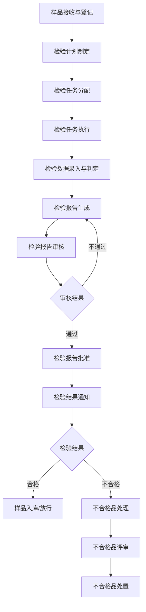
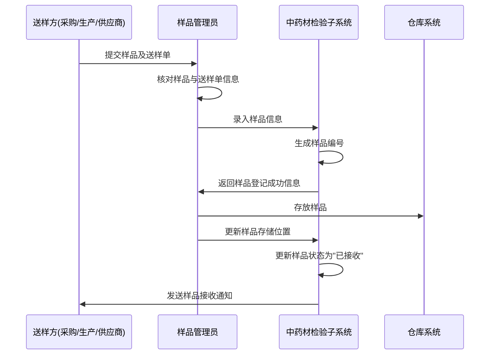
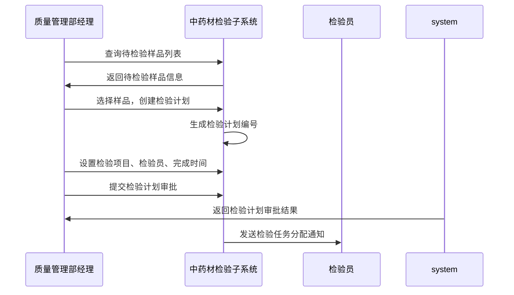
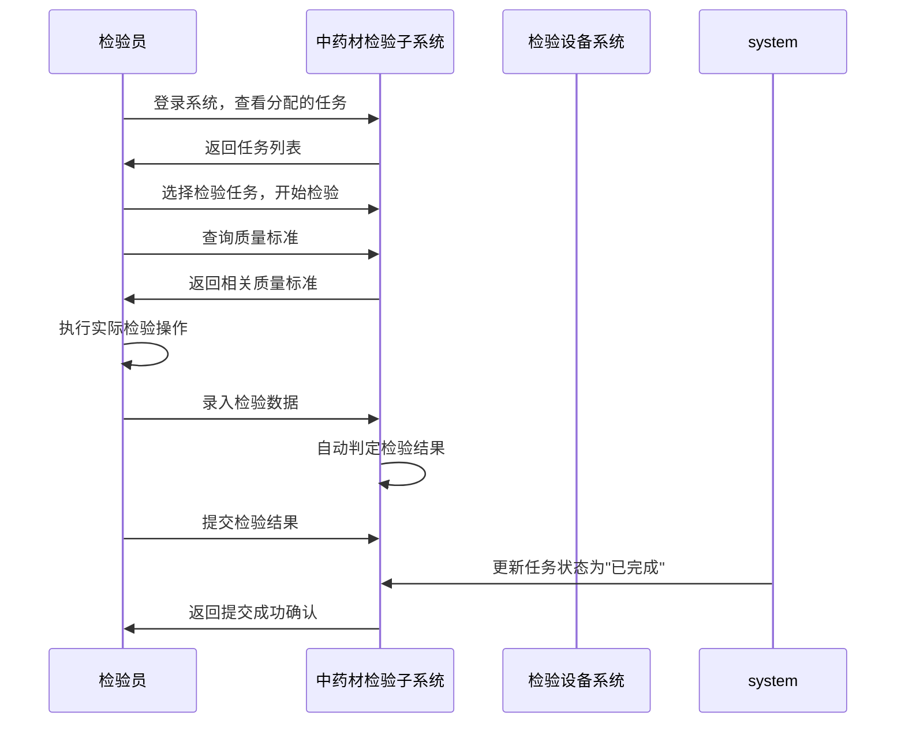
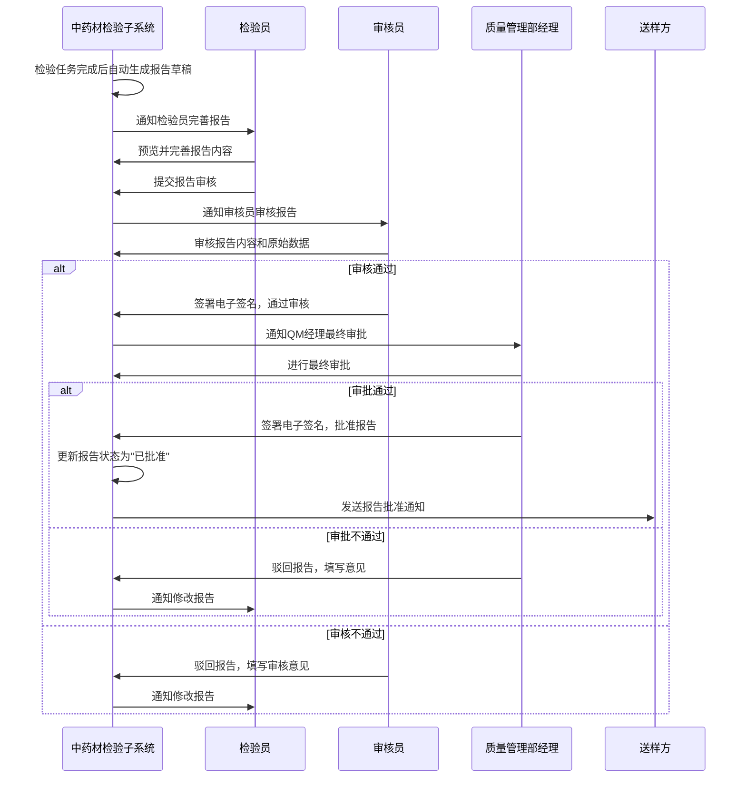
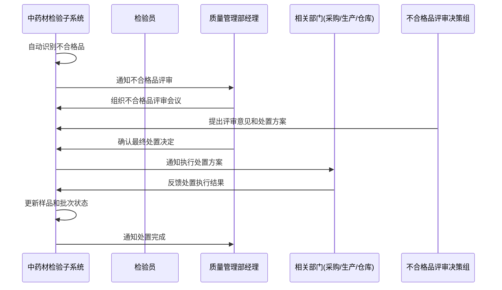
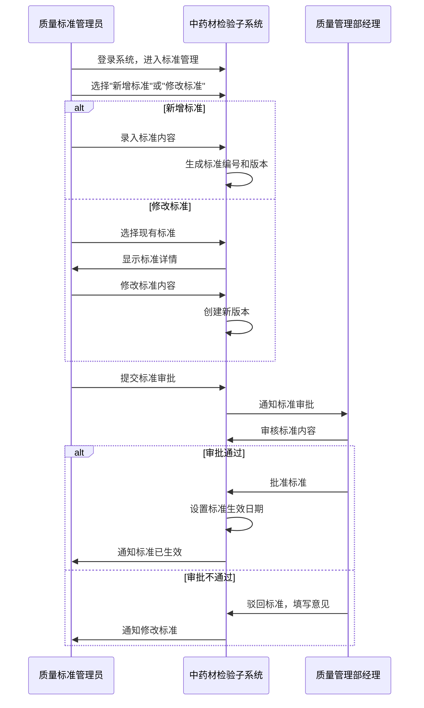

# 中药材检验子系统 - 业务流程描述

## 1. 引言

### 1.1 文档目的

本文档详细描述了中药材检验子系统的业务流程，旨在清晰展示系统中各环节的操作流程、数据流向和交互关系，为系统设计、开发和实施提供指导。

### 1.2 术语定义

| 术语 | 解释 |
|-----|------|
| 中药材 | 传统中医药使用的植物、动物或矿物药材 |
| 样品 | 从批次中药材中抽取用于检验的代表性部分 |
| 检验项目 | 对中药材进行的各项检验指标，如性状、鉴别、检查、含量测定等 |
| 质量标准 | 规定中药材质量要求的技术文件，包括国家标准、行业标准或企业标准 |
| 检验计划 | 安排检验任务的工作计划，包括样品、检验项目、检验人员和时间要求等 |
| 检验报告 | 记录检验过程和结果的正式文件 |
| GMP | 药品生产质量管理规范(Good Manufacturing Practice) |
| 不合格品 | 不符合质量标准要求的中药材 |

## 2. 系统业务流程图

### 2.1 整体业务流程概览

以下流程图展示了中药材从接收样品到生成检验报告的整体业务流程：

## 3. 主要业务流程详述

### 3.1 样品接收与登记流程

**流程描述**：样品管理员接收来自采购、生产或供应商的中药材样品，并在系统中进行登记。

**流程图**：

**操作步骤**：
1. 送样方（采购、生产或供应商）将中药材样品及送样单提交给样品管理员
2. 样品管理员核对样品与送样单信息的一致性
3. 样品管理员登录系统，选择"样品接收"功能
4. 样品管理员录入样品信息，包括：
   - 样品名称（中药材名称）
   - 来源（供应商/生产部门）
   - 批次号
   - 数量/重量
   - 送样日期
   - 送样部门/人员
   - 检验需求（全检/部分检验）
5. 系统自动生成唯一的样品编号
6. 样品管理员确认录入信息无误后保存
7. 样品管理员将样品存放到指定位置
8. 样品管理员在系统中更新样品的存储位置
9. 系统更新样品状态为"已接收"
10. 系统向送样方发送样品接收通知

**数据输入**：样品信息、送样单信息、存储位置
**数据输出**：样品编号、样品接收确认、样品状态更新

### 3.2 检验计划制定与审批流程

**流程描述**：质量管理部经理根据已接收的样品情况，制定检验计划并进行审批。

**流程图**：

**操作步骤**：
1. 质量管理部经理登录系统，选择"检验计划管理"功能
2. 系统显示所有已接收但未检验的样品列表
3. 质量管理部经理根据检验需求和优先级，选择需要纳入同一检验计划的样品
4. 质量管理部经理点击"创建检验计划"按钮
5. 系统自动生成检验计划编号
6. 质量管理部经理设置检验计划信息，包括：
   - 检验计划名称
   - 计划完成日期
   - 检验依据标准
   - 检验项目（系统根据中药材类型自动建议，可调整）
   - 分配检验员
7. 质量管理部经理点击"提交审批"按钮
8. 系统根据预设的审批流程，将检验计划提交给相关人员审批
9. 审批通过后，系统自动将检验任务分配给指定的检验员
10. 系统向检验员发送检验任务分配通知

**数据输入**：检验计划信息、检验项目选择、检验员分配
**数据输出**：检验计划编号、检验任务分配结果、通知消息

### 3.3 检验任务执行流程

**流程描述**：检验员根据分配的检验任务，执行实际的检验操作，录入检验数据，并提交检验结果。

**流程图**：

**操作步骤**：
1. 检验员登录系统，进入"我的任务"页面
2. 系统显示所有分配给该检验员的检验任务列表，按优先级和截止日期排序
3. 检验员选择一个待执行的检验任务，点击"开始检验"
4. 系统显示检验任务详情，包括样品信息、检验项目和质量标准要求
5. 检验员根据标准操作规程执行各项检验
6. 对于需要使用检验设备的项目，检验员操作设备进行检验
7. 检验员将检验结果录入系统：
   - 对于简单数值型结果，直接输入数值
   - 对于需要计算的结果，系统提供计算公式辅助计算
   - 对于文字描述型结果，选择预设的描述或输入文字
   - 可以上传检验过程中的图片或附件
8. 系统根据预设的质量标准自动判定每个检验项目的结果（合格/不合格/待确认）
9. 检验员确认所有检验数据录入完毕并准确无误后，点击"提交结果"
10. 系统更新检验任务状态为"已完成"
11. 系统提示检验结果提交成功

**数据输入**：检验数据、检验过程记录、检验图片/附件
**数据输出**：检验结果判定、任务状态更新

### 3.4 检验报告生成与审核流程

**流程描述**：系统根据检验数据自动生成检验报告，经过审核员审核和质量管理部经理批准后生效。

**流程图**：

**操作步骤**：
1. 检验任务完成后，系统根据检验数据自动生成检验报告草稿
2. 系统通知检验员完善报告内容
3. 检验员登录系统，查看待完善的检验报告
4. 检验员预览报告内容，补充必要的说明和结论
5. 检验员确认报告内容无误后，点击"提交审核"
6. 系统将报告提交给指定的审核员进行审核
7. 系统通知审核员有新的报告需要审核
8. 审核员登录系统，查看待审核的报告
9. 审核员仔细审核报告内容，核对原始检验数据
10. 审核员做出审核决定：
    - 审核通过：签署电子签名，报告提交给质量管理部经理进行最终审批
    - 审核不通过：填写审核意见，报告退回给检验员修改
11. 质量管理部经理收到报告审批通知
12. 质量管理部经理进行最终审批：
    - 审批通过：签署电子签名，报告正式生效
    - 审批不通过：填写审批意见，报告退回给检验员修改
13. 系统更新报告状态为"已批准"
14. 系统向送样方发送报告批准通知

**数据输入**：报告补充内容、审核意见、电子签名
**数据输出**：正式检验报告、审核结果、通知消息

### 3.5 不合格品处理流程

**流程描述**：对于检验不合格的中药材，系统启动不合格品处理流程，包括不合格评审和处置。

**流程图**：

**操作步骤**：
1. 当检验结果判定为不合格时，系统自动将样品标记为不合格品
2. 系统通知质量管理部经理组织不合格品评审
3. 质量管理部经理登录系统，查看不合格品详情
4. 质量管理部经理安排不合格品评审会议，邀请相关部门（采购、生产、仓库等）参加
5. 评审决策组在系统中记录评审意见和处置方案
6. 质量管理部经理确认最终的处置决定，包括：
   - 退货给供应商
   - 让步接收（降级使用）
   - 返工处理
   - 销毁处理
   - 其他处理方式
7. 系统将处置决定通知相关执行部门
8. 执行部门按照处置决定执行具体操作
9. 执行部门在系统中反馈处置执行结果
10. 系统更新样品和批次状态
11. 系统通知质量管理部经理处置已完成

**数据输入**：评审意见、处置方案、执行结果
**数据输出**：处置决定、样品状态更新、通知消息

### 3.6 质量标准管理流程

**流程描述**：质量标准管理员负责维护和更新中药材的质量标准。

**流程图**：

**操作步骤**：
1. 质量标准管理员登录系统，进入"质量标准管理"页面
2. 质量标准管理员选择"新增标准"或"修改标准"操作
3. 如果是新增标准：
   - 质量标准管理员录入新的质量标准内容，包括标准名称、适用中药材、检验项目、限值要求等
   - 系统自动生成标准编号和初始版本号
4. 如果是修改标准：
   - 质量标准管理员从现有标准列表中选择需要修改的标准
   - 系统显示标准的当前版本详情
   - 质量标准管理员修改标准内容
   - 系统自动创建新版本，保留历史版本
5. 质量标准管理员设置标准的生效日期
6. 质量标准管理员点击"提交审批"按钮
7. 系统将标准提交给质量管理部经理进行审批
8. 质量管理部经理审核标准内容
9. 质量管理部经理做出审批决定：
   - 审批通过：标准生效或按设定日期生效
   - 审批不通过：填写审批意见，标准退回给质量标准管理员修改
10. 系统更新标准状态，并通知相关人员

**数据输入**：标准内容、版本信息、生效日期
**数据输出**：标准编号、版本号、标准状态更新

## 4. 业务流程之间的关系

各业务流程之间存在紧密的依赖和触发关系，形成完整的中药材检验闭环管理：

1. **样品接收与登记流程**是整个检验流程的起点，为后续流程提供样品信息
2. **检验计划制定与审批流程**基于已接收的样品创建检验任务
3. **检验任务执行流程**依赖于已分配的检验任务，产生检验数据
4. **检验报告生成与审核流程**基于检验数据生成报告，是对检验结果的总结和确认
5. **不合格品处理流程**是**检验报告生成与审核流程**的一个分支，针对不合格情况进行特殊处理
6. **质量标准管理流程**为**检验任务执行流程**提供检验依据，同时可能受到其他流程的反馈影响而更新

## 5. 特殊业务场景

### 5.1 紧急检验流程

**场景描述**：当有急需使用的中药材需要快速检验时，采用紧急检验流程。

**操作步骤**：
1. 送样方向质量管理部提出紧急检验申请
2. 质量管理部经理确认紧急程度，决定是否启动紧急检验流程
3. 质量管理部经理直接创建优先检验计划，无需常规审批
4. 系统将紧急检验任务标记为高优先级，并立即通知检验员
5. 检验员优先执行紧急检验任务
6. 检验完成后，系统快速生成简化版检验报告，供紧急使用参考
7. 同时启动常规的完整检验和报告流程

### 5.2 复验流程

**场景描述**：当对检验结果有异议，需要重新检验时，启动复验流程。

**操作步骤**：
1. 提出复验申请（送样方、检验员或审核员均可提出）
2. 质量管理部经理审核复验申请，决定是否批准
3. 如批准，质量管理部经理指定其他检验员执行复验
4. 系统生成复验任务，标记为"复验"类型
5. 检验员执行复验任务，录入复验数据
6. 系统生成复验报告，并与原检验报告关联
7. 质量管理部经理根据原检验和复验结果，做出最终判定

### 5.3 偏差处理流程

**场景描述**：在检验过程中出现异常情况，如设备故障、试剂异常等，需要启动偏差处理流程。

**操作步骤**：
1. 检验员在系统中记录偏差情况，包括：
   - 偏差发生的时间和环节
   - 偏差的具体描述
   - 可能的原因分析
   - 初步处理措施
2. 系统通知质量管理部经理
3. 质量管理部经理评估偏差的影响程度
4. 根据影响程度，决定：
   - 继续检验，但记录偏差
   - 暂停检验，更换设备或试剂后重新开始
   - 取消本次检验，重新取样
5. 检验员根据决定执行后续操作
6. 系统记录完整的偏差处理过程

## 6. 附录

### 6.1 参考文档
- GMP系统总体需求文档
- 中药材检验标准操作规程
- 相关法规和标准要求

### 6.2 流程图索引
- 系统整体业务流程图
- 样品接收与登记流程图
- 检验计划制定与审批流程图
- 检验任务执行流程图
- 检验报告生成与审核流程图
- 不合格品处理流程图
- 质量标准管理流程图