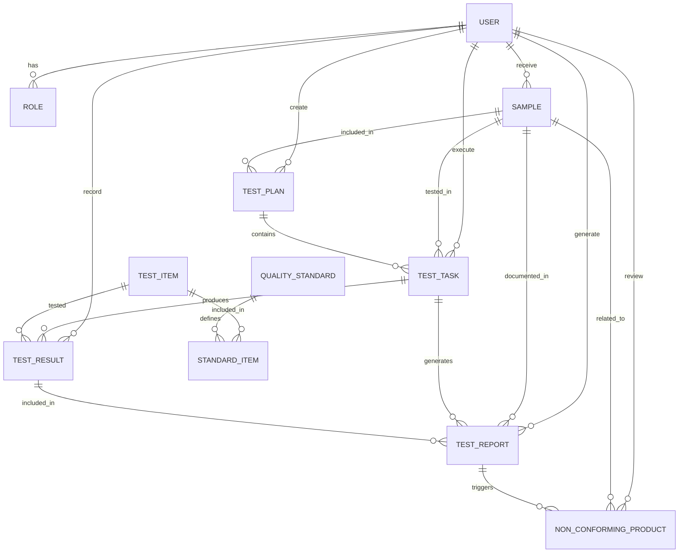

# 中药材检验子系统 - 数据需求与分析

## 1. 引言

### 1.1 文档目的

本文档详细描述了中药材检验子系统的数据需求，包括数据类型、数据结构、数据关系、数据约束以及数据处理要求等，为系统的数据模型设计和数据库设计提供依据。

### 1.2 术语定义

| 术语 | 解释 |
|-----|------|
| 数据实体 | 系统中需要管理的各类业务对象，如样品、检验计划、检验报告等 |
| 数据属性 | 描述数据实体特征的具体信息项，如样品的名称、批次号等 |
| 关系 | 数据实体之间的逻辑联系，如一对多、多对多等 |
| 主键 | 唯一标识数据实体的属性或属性组合 |
| 外键 | 建立与其他实体关联的属性，引用另一个实体的主键 |
| 数据完整性 | 确保数据的准确性、一致性和可靠性的约束条件 |
| 数据流 | 数据在系统中的流动路径和处理过程 |

## 2. 数据实体与属性

### 2.1 样品（Sample）

**描述**：从中药材批次中抽取的用于检验的代表性部分。

**属性**：
- 样品ID（SampleID）：唯一标识符，主键
- 样品编号（SampleCode）：样品的唯一编号，通常采用前缀+日期+序号格式
- 中药材名称（MedicineName）：样品对应的中药材名称
- 来源（Source）：样品的来源，如供应商、生产部门等
- 供应商ID（SupplierID）：供应商的唯一标识符，外键
- 批次号（BatchNumber）：中药材的批次编号
- 样品数量/重量（Quantity）：样品的数量或重量
- 单位（Unit）：数量或重量的计量单位
- 送样日期（SampleDate）：样品送检的日期
- 送样部门（SendDepartment）：送样的部门
- 送样人（Sender）：送样人姓名
- 检验需求类型（TestType）：全检、部分检验等
- 样品状态（Status）：样品的当前状态，如已接收、检验中、已完成等
- 存储位置（StorageLocation）：样品的存储位置
- 备注（Remarks）：其他需要说明的信息

### 2.2 检验计划（TestPlan）

**描述**：安排检验任务的工作计划。

**属性**：
- 计划ID（PlanID）：唯一标识符，主键
- 计划编号（PlanCode）：检验计划的唯一编号
- 计划名称（PlanName）：检验计划的名称
- 制定日期（CreateDate）：计划制定的日期
- 计划完成日期（DueDate）：计划完成的截止日期
- 制定人ID（CreatorID）：制定计划的用户ID，外键
- 计划状态（Status）：计划的状态，如待审批、已批准、已完成等
- 检验依据标准（StandardReference）：检验所依据的标准
- 备注（Remarks）：其他需要说明的信息

### 2.3 检验任务（TestTask）

**描述**：分配给检验员的具体检验工作。

**属性**：
- 任务ID（TaskID）：唯一标识符，主键
- 任务编号（TaskCode）：任务的唯一编号
- 计划ID（PlanID）：所属检验计划的ID，外键
- 样品ID（SampleID）：待检验样品的ID，外键
- 分配日期（AssignDate）：任务分配的日期
- 计划完成日期（DueDate）：任务计划完成的日期
- 检验员ID（TesterID）：执行检验的检验员ID，外键
- 任务状态（Status）：任务的状态，如待执行、执行中、已完成等
- 开始检验时间（StartTime）：检验开始的时间
- 结束检验时间（EndTime）：检验结束的时间
- 备注（Remarks）：其他需要说明的信息

### 2.4 检验项目（TestItem）

**描述**：对中药材进行的各项检验指标。

**属性**：
- 项目ID（ItemID）：唯一标识符，主键
- 项目代码（ItemCode）：检验项目的代码
- 项目名称（ItemName）：检验项目的名称，如性状、鉴别、检查、含量测定等
- 项目类型（ItemType）：项目的类型，如定性、定量等
- 计量单位（Unit）：结果的计量单位
- 检验方法（Method）：检验使用的方法
- 描述（Description）：项目的详细描述
- 备注（Remarks）：其他需要说明的信息

### 2.5 质量标准（QualityStandard）

**描述**：规定中药材质量要求的技术文件。

**属性**：
- 标准ID（StandardID）：唯一标识符，主键
- 标准编号（StandardCode）：标准的编号
- 标准名称（StandardName）：标准的名称
- 适用中药材（ApplicableMedicine）：适用的中药材名称
- 版本号（Version）：标准的版本号
- 发布日期（PublishDate）：标准发布的日期
- 生效日期（EffectiveDate）：标准生效的日期
- 失效日期（ExpireDate）：标准失效的日期（如适用）
- 状态（Status）：标准的状态，如有效、已失效等
- 制定部门（EstablishDepartment）：制定标准的部门
- 备注（Remarks）：其他需要说明的信息

### 2.6 标准项目（StandardItem）

**描述**：质量标准中的具体检验项目及其限值要求。

**属性**：
- 标准项目ID（StandardItemID）：唯一标识符，主键
- 标准ID（StandardID）：所属标准的ID，外键
- 检验项目ID（TestItemID）：检验项目的ID，外键
- 检验方法（TestMethod）：具体的检验方法
- 合格限值类型（LimitType）：限值类型，如范围、最大值、最小值、等于等
- 合格最小值（MinLimit）：合格的最小值（如适用）
- 合格最大值（MaxLimit）：合格的最大值（如适用）
- 合格标准值（StandardValue）：合格的标准值（如适用）
- 允许偏差（Tolerance）：允许的偏差范围
- 备注（Remarks）：其他需要说明的信息

### 2.7 检验结果（TestResult）

**描述**：检验项目的具体检验结果。

**属性**：
- 结果ID（ResultID）：唯一标识符，主键
- 任务ID（TaskID）：所属检验任务的ID，外键
- 检验项目ID（TestItemID）：检验项目的ID，外键
- 检验值（TestValue）：检验的实际数值
- 文字描述结果（TextResult）：文字描述型结果
- 判定结果（Judgment）：合格/不合格/待确认
- 检验时间（TestTime）：检验执行的时间
- 检验员ID（TesterID）：记录结果的检验员ID，外键
- 异常说明（AbnormalityDescription）：异常情况说明
- 附件URL（AttachmentURL）：相关附件的存储路径
- 备注（Remarks）：其他需要说明的信息

### 2.8 检验报告（TestReport）

**描述**：记录检验过程和结果的正式文件。

**属性**：
- 报告ID（ReportID）：唯一标识符，主键
- 报告编号（ReportCode）：报告的唯一编号
- 任务ID（TaskID）：对应的检验任务ID，外键
- 样品ID（SampleID）：检验样品的ID，外键
- 报告生成日期（GenerateDate）：报告生成的日期
- 报告状态（Status）：报告的状态，如草稿、待审核、已审核、已批准等
- 总体判定（OverallJudgment）：合格/不合格
- 报告生成人ID（GeneratorID）：生成报告的用户ID，外键
- 审核人ID（ReviewerID）：审核报告的用户ID，外键
- 审核日期（ReviewDate）：审核的日期
- 批准人ID（ApproverID）：批准报告的用户ID，外键
- 批准日期（ApproveDate）：批准的日期
- 报告内容摘要（Summary）：报告的主要内容摘要
- 报告URL（ReportURL）：报告文件的存储路径
- 备注（Remarks）：其他需要说明的信息

### 2.9 不合格品处理（NonConformingProduct）

**描述**：对不合格中药材的处理记录。

**属性**：
- 处理ID（DisposalID）：唯一标识符，主键
- 样品ID（SampleID）：不合格样品的ID，外键
- 报告ID（ReportID）：相关检验报告的ID，外键
- 不合格原因（NonConformReason）：不合格的具体原因
- 不合格项目（NonConformItem）：不合格的检验项目
- 评审日期（ReviewDate）：评审的日期
- 评审负责人ID（ReviewerID）：评审负责人的用户ID，外键
- 处置方案（DisposalPlan）：最终的处置方案
- 处置执行人ID（ExecutorID）：执行处置的用户ID，外键
- 处置日期（DisposalDate）：处置执行的日期
- 处置结果（DisposalResult）：处置的结果描述
- 备注（Remarks）：其他需要说明的信息

### 2.10 用户（User）

**描述**：系统的用户，包括检验员、审核员、管理员等。

**属性**：
- 用户ID（UserID）：唯一标识符，主键
- 用户名（Username）：登录用户名
- 密码（PasswordHash）：密码的哈希值
- 姓名（FullName）：用户的真实姓名
- 角色ID（RoleID）：用户所属角色的ID，外键
- 部门ID（DepartmentID）：用户所属部门的ID，外键
- 联系电话（PhoneNumber）：联系电话
- 电子邮箱（Email）：电子邮箱
- 用户状态（Status）：用户的状态，如启用、禁用等
- 创建日期（CreateDate）：用户创建的日期
- 最后登录时间（LastLoginTime）：最后一次登录系统的时间

### 2.11 角色（Role）

**描述**：系统中具有特定权限和职责的用户类型。

**属性**：
- 角色ID（RoleID）：唯一标识符，主键
- 角色名称（RoleName）：角色的名称，如检验员、审核员、系统管理员等
- 角色描述（RoleDescription）：角色的详细描述
- 创建日期（CreateDate）：角色创建的日期
- 最后修改日期（LastModifyDate）：角色最后修改的日期

## 3. 数据关系

### 3.1 实体关系图

### 3.2 主要关系说明

1. **用户与角色**：一对多关系，一个角色可以分配给多个用户，每个用户属于一个角色
2. **用户与样品**：一对多关系，一个用户可以接收多个样品，每个样品由一个用户接收
3. **用户与检验计划**：一对多关系，一个用户可以创建多个检验计划，每个检验计划由一个用户创建
4. **用户与检验任务**：一对多关系，一个用户可以执行多个检验任务，每个检验任务分配给一个用户
5. **用户与检验结果**：一对多关系，一个用户可以记录多个检验结果，每个检验结果由一个用户记录
6. **用户与检验报告**：一对多关系，一个用户可以生成多个检验报告，每个检验报告由一个用户生成
7. **用户与不合格品处理**：一对多关系，一个用户可以评审多个不合格品，每个不合格品由一个用户评审
8. **样品与检验计划**：多对多关系，一个样品可以包含在多个检验计划中，一个检验计划可以包含多个样品
9. **样品与检验任务**：一对多关系，一个样品可以有多个检验任务（如初次检验和复验），每个检验任务针对一个样品
10. **样品与检验报告**：一对多关系，一个样品可以有多个检验报告（如初次检验和复验报告），每个检验报告针对一个样品
11. **样品与不合格品处理**：一对一关系，一个样品可能对应一个不合格品处理记录
12. **检验计划与检验任务**：一对多关系，一个检验计划可以包含多个检验任务，每个检验任务属于一个检验计划
13. **检验任务与检验结果**：一对多关系，一个检验任务可以产生多个检验结果，每个检验结果属于一个检验任务
14. **检验任务与检验报告**：一对一关系，一个检验任务生成一个检验报告
15. **检验项目与标准项目**：一对多关系，一个检验项目可以包含在多个标准项目中，每个标准项目对应一个检验项目
16. **检验项目与检验结果**：一对多关系，一个检验项目可以有多个检验结果，每个检验结果对应一个检验项目
17. **质量标准与标准项目**：一对多关系，一个质量标准可以定义多个标准项目，每个标准项目属于一个质量标准
18. **检验结果与检验报告**：一对多关系，一个检验报告包含多个检验结果，每个检验结果包含在一个检验报告中
19. **检验报告与不合格品处理**：一对一关系，一个不合格的检验报告可能触发一个不合格品处理流程

## 4. 数据完整性要求

### 4.1 实体完整性

- 所有实体的主键必须唯一且不为空
- 禁止在主键字段中使用NULL值
- 主键的值应保持稳定，不应频繁修改

### 4.2 参照完整性

- 外键必须引用另一个表中存在的主键值
- 当被引用的主键值修改时，应相应更新或删除相关的外键记录
- 禁止在数据库中存在孤立的外键引用

### 4.3 域完整性

- 每个字段的数据类型必须明确定义
- 字段的值必须符合预定义的数据类型和格式
- 对于数值型字段，应设置合理的范围限制
- 对于日期型字段，应设置合理的日期范围

### 4.4 业务规则完整性

- 样品的批次号必须唯一
- 检验报告的编号必须唯一
- 同一检验任务的同一检验项目只能有一个最终检验结果
- 质量标准的版本管理必须保证版本号的唯一性和连续性
- 不合格品的处理流程必须完整记录

## 5. 数据处理要求

### 5.1 数据输入

- **输入方式**：支持手动输入、条码扫描、批量导入等多种方式
- **数据验证**：所有输入数据必须进行格式和业务规则验证
- **数据录入界面**：提供直观易用的数据录入界面，支持表单填写和数据选择
- **批量数据导入**：支持Excel、CSV等格式的批量数据导入，导入前进行数据校验

### 5.2 数据存储

- **数据存储方式**：采用关系型数据库进行结构化数据存储
- **文件存储**：检验报告、图片等非结构化数据采用文件系统存储，数据库中记录文件路径
- **数据备份**：定期对数据库和文件系统进行备份
- **数据归档**：对历史数据进行归档处理，以提高系统性能

### 5.3 数据检索

- **查询功能**：提供多条件组合查询功能
- **检索速度**：确保大数据量下的快速检索响应
- **排序功能**：支持多字段排序
- **分页显示**：大数据量查询结果采用分页显示

### 5.4 数据更新

- **数据修改权限**：根据用户角色控制数据修改权限
- **修改日志**：记录所有数据修改操作，包括修改人、修改时间、修改内容等
- **版本控制**：对重要数据（如质量标准）进行版本控制

### 5.5 数据输出

- **报表生成**：支持生成各类检验报告、统计报表等
- **导出功能**：支持数据导出为Excel、PDF等格式
- **打印功能**：支持报表和标签的打印
- **电子签名**：支持在检验报告等重要文档上进行电子签名

## 6. 数据安全要求

### 6.1 访问控制

- **用户认证**：采用用户名和密码进行身份认证
- **权限控制**：基于角色的访问控制，不同角色具有不同的数据访问权限
- **会话管理**：合理设置会话超时时间，确保用户离开时自动注销

### 6.2 数据加密

- **传输加密**：所有数据传输采用HTTPS加密
- **存储加密**：敏感数据（如密码）采用加密存储
- **备份加密**：数据备份采用加密存储

### 6.3 审计跟踪

- **操作日志**：记录所有用户操作，包括登录、查询、修改、删除等
- **数据变更日志**：记录重要数据的变更历史
- **审计报表**：提供审计报表功能，便于监管和内部审计

### 6.4 数据隔离

- **多租户隔离**：确保不同租户数据的隔离
- **测试环境与生产环境隔离**：确保测试环境不影响生产数据

## 7. 数据量估算

### 7.1 基础数据量

| 数据实体 | 预计年增长数据量 | 5年数据量估算 | 备注 |
|---------|----------------|------------|------|
| 样品 | 5,000-10,000 | 25,000-50,000 | 取决于企业规模和检验频率 |
| 检验计划 | 2,000-5,000 | 10,000-25,000 | 每个计划可能包含多个样品 |
| 检验任务 | 5,000-10,000 | 25,000-50,000 | 与样品数量基本一致 |
| 检验项目 | 50-100 | 250-500 | 相对稳定，新增较少 |
| 质量标准 | 30-50 | 150-250 | 相对稳定，版本更新为主 |
| 标准项目 | 500-1,000 | 2,500-5,000 | 与质量标准和检验项目相关 |
| 检验结果 | 50,000-100,000 | 250,000-500,000 | 每个样品有多个检验项目 |
| 检验报告 | 5,000-10,000 | 25,000-50,000 | 与样品数量基本一致 |
| 不合格品处理 | 500-1,000 | 2,500-5,000 | 按10%不合格率估算 |
| 用户 | 50-100 | 250-500 | 相对稳定，人员流动为主 |
| 角色 | 5-10 | 25-50 | 相对稳定，几乎不变化 |

### 7.2 存储空间估算

- **结构化数据**：5年结构化数据约需500MB-1GB存储空间
- **非结构化数据**（报告、图片等）：按每个报告500KB，5年约需12.5GB-25GB存储空间
- **日志数据**：按每天100MB，5年约需182.5GB存储空间
- **备份数据**：按原始数据的3倍估算，约需600GB-700GB存储空间

**总计**：5年数据存储需求约为800GB-750GB，建议系统配置至少1TB存储空间。

## 8. 附录

### 8.1 参考文档
- GMP系统总体需求文档
- 中药材检验标准操作规程
- 相关法规和标准要求

### 8.2 数据字典

#### 8.2.1 样品状态（SampleStatus）

| 状态编码 | 状态名称 | 描述 |
|---------|---------|------|
| RECEIVED | 已接收 | 样品已接收并登记 |
| PENDING | 待检验 | 样品等待检验安排 |
| TESTING | 检验中 | 样品正在检验过程中 |
| COMPLETED | 已完成 | 样品检验已完成 |
| DISPOSED | 已处置 | 样品已按规定处置 |
| EXPIRED | 已过期 | 样品超过保存期限 |

#### 8.2.2 检验任务状态（TaskStatus）

| 状态编码 | 状态名称 | 描述 |
|---------|---------|------|
| PENDING | 待执行 | 任务已分配，等待执行 |
| IN_PROGRESS | 执行中 | 任务正在执行 |
| COMPLETED | 已完成 | 任务执行完成 |
| CANCELLED | 已取消 | 任务因特殊原因取消 |
| PAUSED | 已暂停 | 任务因特殊原因暂停 |

#### 8.2.3 检验报告状态（ReportStatus）

| 状态编码 | 状态名称 | 描述 |
|---------|---------|------|
| DRAFT | 草稿 | 报告正在编辑中 |
| PENDING_REVIEW | 待审核 | 报告等待审核 |
| UNDER_REVIEW | 审核中 | 报告正在审核 |
| REVIEWED | 已审核 | 报告审核通过 |
| APPROVED | 已批准 | 报告最终批准 |
| REJECTED | 已驳回 | 报告审核不通过 |

#### 8.2.4 判定结果（Judgment）

| 结果编码 | 结果名称 | 描述 |
|---------|---------|------|
| PASSED | 合格 | 检验结果符合质量标准要求 |
| FAILED | 不合格 | 检验结果不符合质量标准要求 |
| PENDING | 待确认 | 检验结果需要进一步确认 |
| NA | 不适用 | 该检验项目不适用于当前样品 |

#### 8.2.5 不合格品处置方案（DisposalPlan）

| 方案编码 | 方案名称 | 描述 |
|---------|---------|------|
| RETURN | 退货 | 将不合格品退回给供应商 |
| REWORK | 返工 | 对不合格品进行返工处理 |
| SCRAP | 销毁 | 销毁不合格品 |
| CONCESSION | 让步接收 | 经批准后让步接收不合格品 |
| OTHER | 其他 | 其他处置方式 |