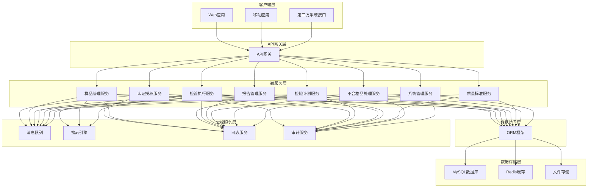
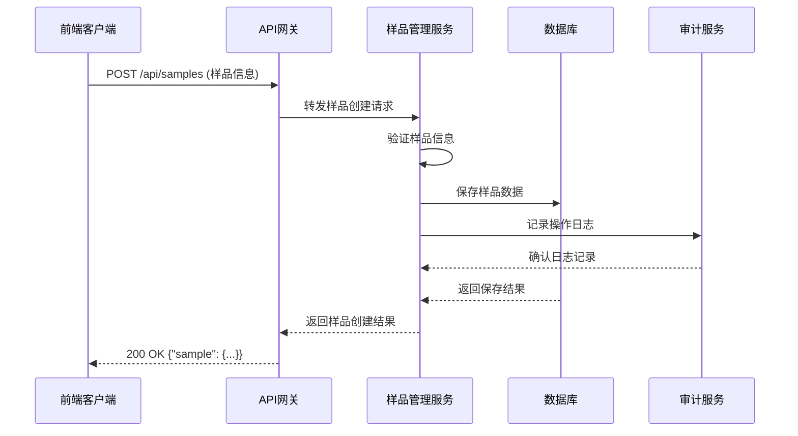
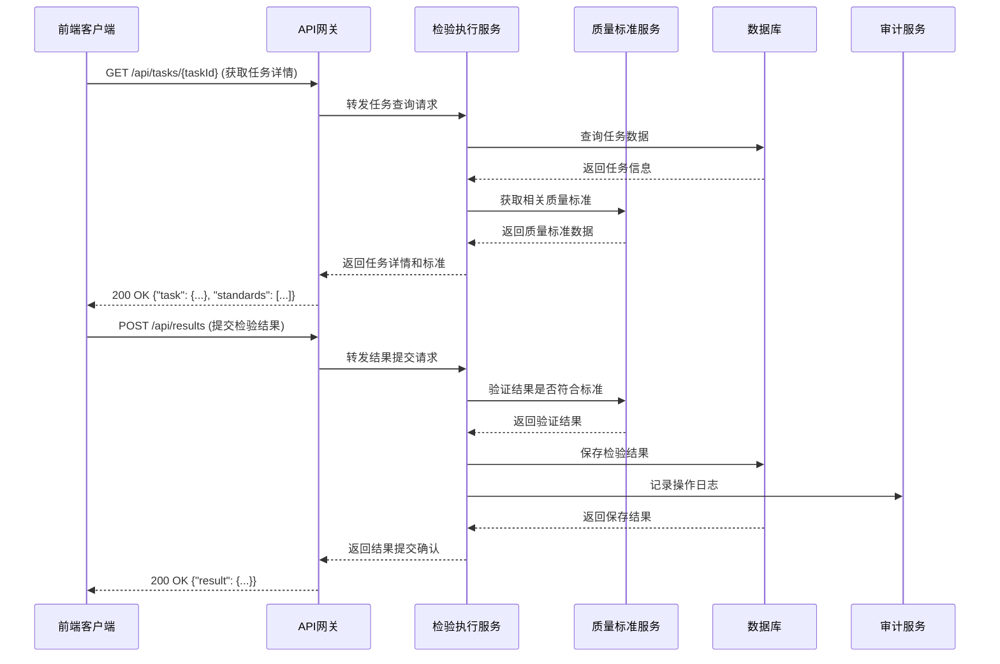
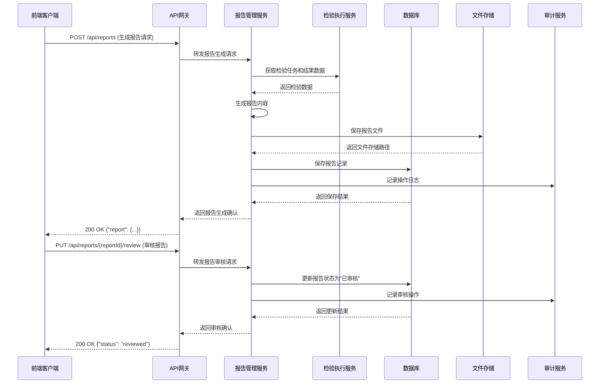
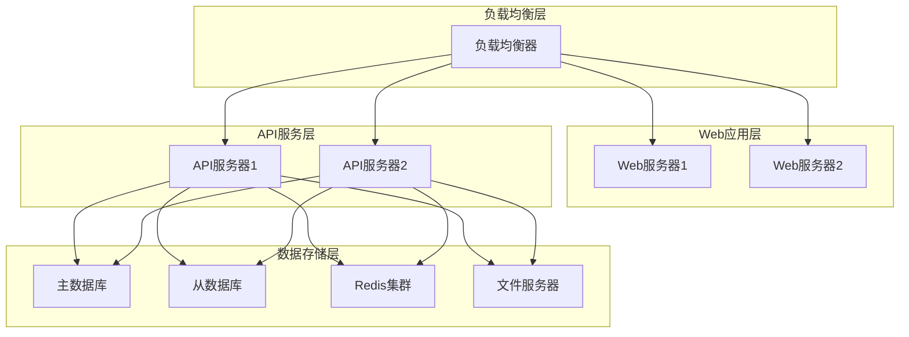

# 中药材检验子系统 - 架构设计

## 1. 引言

### 1.1 文档目的

本文档详细描述了中药材检验子系统的架构设计，包括系统的整体架构、技术栈选择、模块划分、数据流程、接口设计等，为系统的开发和实施提供技术指导。

### 1.2 术语定义

| 术语 | 解释 |
|-----|------|
| GMP | 药品生产质量管理规范(Good Manufacturing Practice) |
| RESTful API | 一种软件架构风格，用于设计网络应用程序接口 |
| 微服务 | 一种软件架构模式，将应用程序构建为一系列松散耦合的服务 |
| 前后端分离 | 将前端和后端开发分离，通过API进行通信的架构模式 |
| JWT | JSON Web Token，一种用于安全传输信息的开放标准 |
| RBAC | 基于角色的访问控制(Role-Based Access Control) |
| ORM | 对象关系映射(Object-Relational Mapping) |
| 数据字典 | 定义系统中使用的数据元素及其属性的集合 |

## 2. 系统架构概述

### 2.1 架构原则

中药材检验子系统的架构设计遵循以下原则：

1. **前后端分离**：采用前后端分离架构，提高开发效率和系统可维护性
2. **微服务架构**：系统核心功能拆分为微服务，实现高内聚低耦合
3. **安全性优先**：全面考虑系统安全性，包括身份认证、权限控制、数据加密等
4. **可扩展性**：系统设计具备良好的扩展性，支持未来功能扩展和业务增长
5. **合规性**：系统架构符合GMP规范要求，支持审计跟踪和数据完整性
6. **高可用性**：通过冗余设计和故障转移机制，确保系统的高可用性

### 2.2 整体架构图



## 3. 技术栈选择

### 3.1 前端技术栈

| 技术/框架 | 版本 | 用途 | 选型理由 |
|----------|------|-----|--------|
| Vue.js | 3.x | 前端框架 | 轻量级、易上手、组件化开发、性能优异 |
| Vuex | 4.x | 状态管理 | 与Vue.js完美集成，适合复杂应用状态管理 |
| Vue Router | 4.x | 路由管理 | Vue官方路由管理器，支持动态路由和路由守卫 |
| Element Plus | 2.x | UI组件库 | 丰富的组件、良好的文档、支持响应式设计 |
| Axios | 0.27.x | HTTP客户端 | 简洁易用、支持拦截器和Promise |
| ECharts | 5.x | 图表库 | 丰富的图表类型、优秀的数据可视化能力 |
| Quill | 1.3.x | 富文本编辑器 | 轻量级、可定制性强、用于报告编辑 |
| JWT | - | 认证令牌 | 无状态认证、便于水平扩展 |

### 3.2 后端技术栈

| 技术/框架 | 版本 | 用途 | 选型理由 |
|----------|------|-----|--------|
| Spring Boot | 2.7.x | 后端框架 | 自动配置、内嵌容器、简化开发 |
| Spring Cloud | 2021.x | 微服务框架 | 提供微服务生态组件、便于服务治理 |
| Spring Security | 5.7.x | 安全框架 | 全面的安全功能、与Spring生态集成 |
| MyBatis-Plus | 3.5.x | ORM框架 | 简化MyBatis操作、提高开发效率 |
| MySQL | 8.0 | 关系型数据库 | 稳定可靠、适合结构化数据存储、支持事务 |
| Redis | 6.x | 缓存数据库 | 高性能、支持多种数据结构、用于缓存和会话管理 |
| RabbitMQ | 3.9.x | 消息队列 | 可靠的消息传递、支持多种消息模式 |
| Elasticsearch | 7.x | 搜索引擎 | 强大的搜索能力、适合日志和报告检索 |
| Docker | 20.x | 容器化 | 简化部署、提高环境一致性 |
| Kubernetes | 1.23.x | 容器编排 | 自动化部署、扩展和管理容器化应用 |
| Swagger/OpenAPI | 3.0 | API文档 | 自动生成API文档、便于接口测试 |

## 4. 模块划分

### 4.1 前端模块

| 模块名称 | 主要功能 | 文件位置 | 依赖模块 |
|---------|---------|---------|--------|
| 认证模块 | 用户登录、注册、密码找回 | src/modules/auth | API模块 |
| 样品管理模块 | 样品接收、查询、状态跟踪 | src/modules/sample | API模块、公共组件 |
| 检验计划模块 | 检验计划制定、查询、状态管理 | src/modules/test-plan | API模块、公共组件 |
| 检验执行模块 | 检验任务执行、数据录入、结果判定 | src/modules/test-execution | API模块、公共组件、图表组件 |
| 报告管理模块 | 检验报告生成、审核、查询、导出 | src/modules/report | API模块、公共组件、富文本编辑器 |
| 质量标准模块 | 质量标准查询、管理 | src/modules/standard | API模块、公共组件 |
| 不合格品处理模块 | 不合格品识别、评审、处置 | src/modules/nonconforming | API模块、公共组件 |
| 系统管理模块 | 用户管理、权限管理、参数配置 | src/modules/system | API模块、公共组件 |
| 公共组件模块 | 表格、表单、弹窗等通用组件 | src/components | 无 |
| API模块 | 与后端API通信 | src/api | 无 |
| 工具模块 | 通用工具函数 | src/utils | 无 |
| 路由模块 | 系统路由配置 | src/router | 认证模块 |
| 状态管理模块 | 全局状态管理 | src/store | 各业务模块 |

### 4.2 后端模块

| 模块名称 | 主要功能 | 对应服务 | 依赖服务 |
|---------|---------|---------|--------|
| 认证授权模块 | 用户认证、权限控制、JWT管理 | AuthService | 系统管理服务 |
| 样品管理模块 | 样品信息管理、样品状态流转 | SampleService | 无 |
| 检验计划模块 | 检验计划的创建、审批、分配 | TestPlanService | 样品管理服务、系统管理服务 |
| 检验执行模块 | 检验任务执行、数据采集、结果判定 | TestExecService | 检验计划服务、质量标准服务 |
| 报告管理模块 | 检验报告的生成、审核、归档 | ReportService | 检验执行服务、系统管理服务 |
| 质量标准模块 | 质量标准的维护、版本管理 | StandardService | 无 |
| 不合格品处理模块 | 不合格品识别、评审、处置流程 | NonConformService | 报告管理服务、系统管理服务 |
| 系统管理模块 | 用户管理、角色管理、参数配置 | SysManageService | 无 |
| 日志审计模块 | 操作日志记录、审计跟踪 | LogService/AuditService | 所有服务 |
| 消息通知模块 | 系统消息、邮件、短信发送 | MessageQueue | 所有服务 |

## 5. 数据流程

### 5.1 样品管理数据流



### 5.2 检验执行数据流



### 5.3 报告生成与审核数据流



## 6. 数据库设计

### 6.1 数据库架构

采用关系型数据库MySQL存储结构化数据，Redis用于缓存和会话管理，文件存储系统用于存储非结构化数据如报告文件和图片。

### 6.2 关键数据表结构

#### 6.2.1 样品表（samples）

| 字段名 | 数据类型 | 约束 | 描述 |
|-------|---------|------|-----|
| id | BIGINT | PRIMARY KEY, AUTO_INCREMENT | 样品ID |
| code | VARCHAR(50) | UNIQUE NOT NULL | 样品编号 |
| medicine_name | VARCHAR(100) | NOT NULL | 中药材名称 |
| source | VARCHAR(100) | NOT NULL | 来源 |
| supplier_id | BIGINT | FOREIGN KEY | 供应商ID |
| batch_number | VARCHAR(100) | NOT NULL | 批次号 |
| quantity | DECIMAL(10,2) | NOT NULL | 数量/重量 |
| unit | VARCHAR(20) | NOT NULL | 单位 |
| sample_date | DATETIME | NOT NULL | 送样日期 |
| send_department | VARCHAR(100) | NOT NULL | 送样部门 |
| sender | VARCHAR(50) | NOT NULL | 送样人 |
| test_type | VARCHAR(20) | NOT NULL | 检验需求类型 |
| status | VARCHAR(20) | NOT NULL | 样品状态 |
| storage_location | VARCHAR(200) | NOT NULL | 存储位置 |
| remarks | TEXT | | 备注 |
| created_by | BIGINT | FOREIGN KEY | 创建人ID |
| created_at | DATETIME | NOT NULL | 创建时间 |
| updated_by | BIGINT | FOREIGN KEY | 更新人ID |
| updated_at | DATETIME | NOT NULL | 更新时间 |

#### 6.2.2 检验计划表（test_plans）

| 字段名 | 数据类型 | 约束 | 描述 |
|-------|---------|------|-----|
| id | BIGINT | PRIMARY KEY, AUTO_INCREMENT | 计划ID |
| code | VARCHAR(50) | UNIQUE NOT NULL | 计划编号 |
| name | VARCHAR(200) | NOT NULL | 计划名称 |
| create_date | DATETIME | NOT NULL | 制定日期 |
| due_date | DATETIME | NOT NULL | 计划完成日期 |
| creator_id | BIGINT | FOREIGN KEY NOT NULL | 制定人ID |
| status | VARCHAR(20) | NOT NULL | 计划状态 |
| standard_reference | VARCHAR(200) | NOT NULL | 检验依据标准 |
| remarks | TEXT | | 备注 |
| created_at | DATETIME | NOT NULL | 创建时间 |
| updated_at | DATETIME | NOT NULL | 更新时间 |

#### 6.2.3 检验任务表（test_tasks）

| 字段名 | 数据类型 | 约束 | 描述 |
|-------|---------|------|-----|
| id | BIGINT | PRIMARY KEY, AUTO_INCREMENT | 任务ID |
| code | VARCHAR(50) | UNIQUE NOT NULL | 任务编号 |
| plan_id | BIGINT | FOREIGN KEY NOT NULL | 计划ID |
| sample_id | BIGINT | FOREIGN KEY NOT NULL | 样品ID |
| assign_date | DATETIME | NOT NULL | 分配日期 |
| due_date | DATETIME | NOT NULL | 计划完成日期 |
| tester_id | BIGINT | FOREIGN KEY NOT NULL | 检验员ID |
| status | VARCHAR(20) | NOT NULL | 任务状态 |
| start_time | DATETIME | | 开始检验时间 |
| end_time | DATETIME | | 结束检验时间 |
| remarks | TEXT | | 备注 |
| created_at | DATETIME | NOT NULL | 创建时间 |
| updated_at | DATETIME | NOT NULL | 更新时间 |

#### 6.2.4 检验结果表（test_results）

| 字段名 | 数据类型 | 约束 | 描述 |
|-------|---------|------|-----|
| id | BIGINT | PRIMARY KEY, AUTO_INCREMENT | 结果ID |
| task_id | BIGINT | FOREIGN KEY NOT NULL | 任务ID |
| test_item_id | BIGINT | FOREIGN KEY NOT NULL | 检验项目ID |
| test_value | DECIMAL(15,6) | | 检验的实际数值 |
| text_result | TEXT | | 文字描述型结果 |
| judgment | VARCHAR(20) | NOT NULL | 判定结果 |
| test_time | DATETIME | NOT NULL | 检验执行的时间 |
| tester_id | BIGINT | FOREIGN KEY NOT NULL | 记录结果的检验员ID |
| abnormality_description | TEXT | | 异常情况说明 |
| attachment_url | VARCHAR(500) | | 相关附件的存储路径 |
| remarks | TEXT | | 备注 |
| created_at | DATETIME | NOT NULL | 创建时间 |
| updated_at | DATETIME | NOT NULL | 更新时间 |

#### 6.2.5 检验报告表（test_reports）

| 字段名 | 数据类型 | 约束 | 描述 |
|-------|---------|------|-----|
| id | BIGINT | PRIMARY KEY, AUTO_INCREMENT | 报告ID |
| code | VARCHAR(50) | UNIQUE NOT NULL | 报告编号 |
| task_id | BIGINT | FOREIGN KEY NOT NULL | 任务ID |
| sample_id | BIGINT | FOREIGN KEY NOT NULL | 样品ID |
| generate_date | DATETIME | NOT NULL | 报告生成日期 |
| status | VARCHAR(20) | NOT NULL | 报告状态 |
| overall_judgment | VARCHAR(20) | NOT NULL | 总体判定 |
| generator_id | BIGINT | FOREIGN KEY NOT NULL | 生成人ID |
| reviewer_id | BIGINT | FOREIGN KEY | 审核人ID |
| review_date | DATETIME | | 审核日期 |
| approver_id | BIGINT | FOREIGN KEY | 批准人ID |
| approve_date | DATETIME | | 批准日期 |
| summary | TEXT | | 报告内容摘要 |
| report_url | VARCHAR(500) | NOT NULL | 报告文件的存储路径 |
| remarks | TEXT | | 备注 |
| created_at | DATETIME | NOT NULL | 创建时间 |
| updated_at | DATETIME | NOT NULL | 更新时间 |

## 7. 接口设计

### 7.1 API设计原则

- **RESTful风格**：遵循RESTful API设计规范
- **版本控制**：API路径中包含版本号，如 `/api/v1/samples`
- **统一响应格式**：所有API返回统一的JSON格式响应
- **错误处理**：标准化错误码和错误信息
- **认证授权**：使用JWT进行身份认证，基于RBAC进行权限控制
- **参数验证**：请求参数的格式和业务规则验证

### 7.2 统一响应格式

```json
{
  "code": 200,                 // 状态码，200表示成功
  "message": "操作成功",       // 消息描述
  "data": {...},               // 业务数据
  "timestamp": "2023-01-01T12:00:00Z",  // 时间戳
  "traceId": "uuid-string"    // 追踪ID，用于问题排查
}
```

### 7.3 主要API接口

#### 7.3.1 样品管理接口

| API路径 | 方法 | 功能描述 | 请求体 (JSON) | 成功响应 (200 OK) |
|--------|-----|---------|-------------|----------------|
| `/api/v1/samples` | GET | 获取样品列表 | N/A | `{"data": [{"id": 1, "code": "S20230001", ...}]}` |
| `/api/v1/samples` | POST | 新增样品 | `{"medicineName": "...", "batchNumber": "...", ...}` | `{"data": {"id": 1, "code": "S20230001", ...}}` |
| `/api/v1/samples/{id}` | GET | 获取样品详情 | N/A | `{"data": {"id": 1, "code": "S20230001", ...}}` |
| `/api/v1/samples/{id}` | PUT | 更新样品信息 | `{"storageLocation": "...", "status": "...", ...}` | `{"data": {"id": 1, "code": "S20230001", ...}}` |
| `/api/v1/samples/{id}/status` | PATCH | 更新样品状态 | `{"status": "TESTING", "remarks": "..."}` | `{"data": {"id": 1, "status": "TESTING", ...}}` |

#### 7.3.2 检验计划接口

| API路径 | 方法 | 功能描述 | 请求体 (JSON) | 成功响应 (200 OK) |
|--------|-----|---------|-------------|----------------|
| `/api/v1/test-plans` | GET | 获取检验计划列表 | N/A | `{"data": [{"id": 1, "code": "P20230001", ...}]}` |
| `/api/v1/test-plans` | POST | 创建检验计划 | `{"name": "...", "sampleIds": [1, 2], ...}` | `{"data": {"id": 1, "code": "P20230001", ...}}` |
| `/api/v1/test-plans/{id}` | GET | 获取检验计划详情 | N/A | `{"data": {"id": 1, "code": "P20230001", ...}}` |
| `/api/v1/test-plans/{id}/approve` | PUT | 审批检验计划 | `{"approved": true, "remarks": "..."}` | `{"data": {"id": 1, "status": "APPROVED", ...}}` |
| `/api/v1/test-plans/{id}/assign` | POST | 分配检验任务 | `{"taskAssignments": [{"sampleId": 1, "testerId": 101}, ...]}` | `{"data": {"assignedTasks": [1, 2, ...]}}` |

#### 7.3.3 检验执行接口

| API路径 | 方法 | 功能描述 | 请求体 (JSON) | 成功响应 (200 OK) |
|--------|-----|---------|-------------|----------------|
| `/api/v1/tasks` | GET | 获取检验任务列表 | N/A | `{"data": [{"id": 1, "code": "T20230001", ...}]}` |
| `/api/v1/tasks/{id}` | GET | 获取检验任务详情 | N/A | `{"data": {"id": 1, "code": "T20230001", ...}}` |
| `/api/v1/tasks/{id}/start` | PUT | 开始检验任务 | `{"startTime": "2023-01-01T09:00:00Z"}` | `{"data": {"id": 1, "status": "IN_PROGRESS", ...}}` |
| `/api/v1/results` | POST | 提交检验结果 | `{"taskId": 1, "testItemId": 10, "testValue": 98.5, ...}` | `{"data": {"id": 1, "judgment": "PASSED", ...}}` |
| `/api/v1/tasks/{id}/complete` | PUT | 完成检验任务 | `{"endTime": "2023-01-01T11:30:00Z"}` | `{"data": {"id": 1, "status": "COMPLETED", ...}}` |

#### 7.3.4 报告管理接口

| API路径 | 方法 | 功能描述 | 请求体 (JSON) | 成功响应 (200 OK) |
|--------|-----|---------|-------------|----------------|
| `/api/v1/reports` | GET | 获取检验报告列表 | N/A | `{"data": [{"id": 1, "code": "R20230001", ...}]}` |
| `/api/v1/reports` | POST | 生成检验报告 | `{"taskId": 1, "generatorId": 101}` | `{"data": {"id": 1, "code": "R20230001", ...}}` |
| `/api/v1/reports/{id}` | GET | 获取检验报告详情 | N/A | `{"data": {"id": 1, "code": "R20230001", ...}}` |
| `/api/v1/reports/{id}/review` | PUT | 审核检验报告 | `{"reviewed": true, "reviewerId": 102, "remarks": "..."}` | `{"data": {"id": 1, "status": "REVIEWED", ...}}` |
| `/api/v1/reports/{id}/approve` | PUT | 批准检验报告 | `{"approved": true, "approverId": 103, "remarks": "..."}` | `{"data": {"id": 1, "status": "APPROVED", ...}}` |
| `/api/v1/reports/{id}/export` | GET | 导出检验报告 | N/A | 文件流 |

## 8. 安全设计

### 8.1 身份认证

- **JWT认证**：使用JSON Web Token进行无状态身份认证
- **密码策略**：强制密码复杂度要求，定期密码更新
- **多因素认证**：关键操作支持多因素认证（可选）
- **会话管理**：合理设置会话超时时间，支持会话失效

### 8.2 授权控制

- **RBAC模型**：基于角色的访问控制
- **细粒度权限**：支持功能级和数据级权限控制
- **最小权限原则**：用户仅拥有完成工作所需的最小权限
- **权限继承**：支持角色权限的继承和覆盖

### 8.3 数据安全

- **传输加密**：所有HTTP通信采用TLS/SSL加密
- **存储加密**：敏感数据存储加密
- **数据脱敏**：敏感信息展示时进行脱敏处理
- **数据备份与恢复**：定期数据备份，支持灾难恢复

### 8.4 审计跟踪

- **操作日志**：记录所有用户操作，包括登录、查询、修改、删除等
- **数据变更日志**：记录重要数据的变更历史，包括变更前后的值
- **访问控制日志**：记录权限相关操作，如角色分配、权限修改等
- **审计报表**：提供审计数据的查询和报表功能

## 9. 部署架构

### 9.1 开发环境

- **本地开发环境**：开发人员本地运行的环境，包括前端开发服务器和后端开发服务
- **开发测试环境**：集中的开发测试环境，用于集成测试和功能验证

### 9.2 测试环境

- **QA测试环境**：用于质量保证测试的环境
- **用户验收测试环境**：用于用户验收测试的环境

### 9.3 生产环境



## 10. 扩展性设计

### 10.1 横向扩展

- **无状态设计**：服务层设计为无状态，便于水平扩展
- **负载均衡**：通过负载均衡器分发请求
- **集群部署**：支持多实例集群部署，提高系统容量和可用性

### 10.2 纵向扩展

- **模块化设计**：系统功能模块化，便于功能扩展
- **插件架构**：支持插件机制，允许第三方扩展
- **API网关**：统一API入口，便于服务管理和扩展

### 10.3 数据扩展

- **分库分表**：支持数据库分库分表，应对大数据量
- **读写分离**：数据库读写分离，提高查询性能
- **缓存策略**：合理的缓存设计，减少数据库压力

## 11. 附录

### 11.1 参考文档
- GMP系统总体需求文档
- 中药材检验标准操作规程
- 相关法规和标准要求

### 11.2 技术栈版本兼容性

| 技术/框架 | 版本 | 兼容版本范围 | 备注 |
|----------|------|------------|------|
| Spring Boot | 2.7.x | 2.7.0-2.7.x | 推荐使用最新稳定版本 |
| Vue.js | 3.x | 3.0.0-3.x | 3.x版本有较大变化，不兼容2.x |
| MySQL | 8.0 | 8.0.x | 向下兼容5.7，但推荐使用8.0 |
| Redis | 6.x | 6.0-6.x | 支持新特性，性能更好 |

### 11.3 性能指标

| 指标 | 目标值 | 测试方法 |
|-----|-------|--------|
| 页面加载时间 | <3秒 | 前端性能监控 |
| API响应时间 | <500ms | 接口性能测试 |
| 系统并发用户数 | >100 | 负载测试 |
| 数据库查询时间 | <100ms | 数据库性能测试 |
| 系统可用性 | 99.9% | 长期运行监控 |