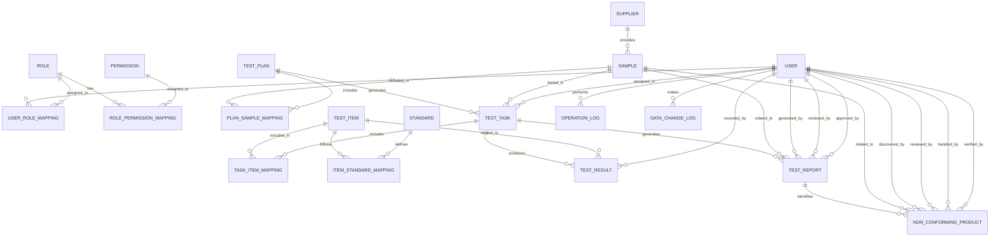

# 中药材检验子系统 - 数据库设计

## 文档信息
- **文档版本**: v1.0
- **创建日期**: 2024-01-15
- **最后更新**: 2024-01-15
- **作者**: 系统设计团队
- **审核人**: 架构师、质量保证经理、GMP合规专家

## 1. 引言

### 1.1 文档目的

本文档详细描述中药材检验子系统的数据库设计，包括数据需求分析、数据库结构设计、数据完整性约束、索引设计等内容。该文档旨在为系统开发提供明确的数据模型指导，确保数据库设计符合系统功能需求和GMP合规性要求。

### 1.2 术语定义

| 术语 | 解释 |
|-----|------|
| 数据模型 | 描述数据结构、数据间关系以及数据约束的概念性工具集 |
| E-R图 | 实体关系图(Entity-Relationship Diagram)，用于描述实体及其关系 |
| 主键 | 用于唯一标识表中记录的字段或字段组合 |
| 外键 | 用于建立与其他表之间关系的字段 |
| 数据完整性 | 确保数据库中的数据准确、一致和可靠的机制 |
| 范式 | 关系数据库设计的理论规范，用于减少数据冗余和提高数据完整性 |
| 索引 | 提高数据库查询性能的一种数据结构 |
| 存储过程 | 预编译的SQL代码集合，存储在数据库中并可通过名称调用 |
| 触发器 | 与表关联的特殊存储过程，在特定事件发生时自动执行 |

## 2. 数据需求分析

### 2.1 业务数据实体

基于中药材检验子系统的业务需求，系统涉及以下主要数据实体：

1. **样品(Sample)**：待检验的中药材样品信息
2. **检验计划(TestPlan)**：组织和管理检验活动的计划
3. **检验任务(TestTask)**：分配给检验员的具体检验工作
4. **检验项目(TestItem)**：需要进行的具体检验项目
5. **检验标准(Standard)**：检验项目的判定标准
6. **检验结果(TestResult)**：检验项目的实际检验结果
7. **检验报告(TestReport)**：汇总检验结果的正式文档
8. **不合格品(NonConforming)**：未通过检验的产品及其处理流程
9. **质量标准(QualityStandard)**：中药材质量相关标准
10. **用户(User)**：系统用户信息
11. **角色(Role)**：用户角色信息

### 2.2 数据关系分析

各实体之间存在以下主要关系：

1. **样品与检验计划**：一个检验计划可以包含多个样品
2. **样品与检验任务**：一个样品可以有多个检验任务，一个检验任务对应一个样品
3. **检验计划与检验任务**：一个检验计划可以生成多个检验任务
4. **检验任务与检验结果**：一个检验任务包含多个检验结果
5. **检验项目与检验结果**：一个检验项目可以有多个检验结果
6. **检验项目与检验标准**：一个检验项目有多个检验标准
7. **检验任务与检验报告**：一个检验任务生成一个检验报告
8. **检验报告与不合格品**：一个不合格的检验报告可能关联一个不合格品处理记录
9. **用户与角色**：多对多关系，一个用户可以有多个角色，一个角色可以分配给多个用户
10. **用户与检验任务**：一个用户可以执行多个检验任务

## 3. 数据库总体设计

### 3.1 数据库选型

| 数据库类型 | 数据库产品 | 版本 | 选型理由 |
|----------|----------|------|---------|
| 关系型数据库 | MySQL | 8.0.x | 稳定可靠、性能优异、支持事务和复杂查询、社区活跃、适合结构化数据存储 |
| 缓存数据库 | Redis | 6.x | 高性能内存数据库、支持多种数据结构、适合缓存热点数据和会话管理 |
| 文件存储 | MinIO/云存储 | - | 用于存储非结构化数据如报告文件、图片等附件 |

### 3.2 数据库架构

系统采用单数据库多模式的架构设计，各模块使用独立的数据库表，但共享同一个数据库实例，便于管理和维护。

### 3.3 数据字典

#### 3.3.1 通用状态字典

| 状态码 | 状态名称 | 适用实体 |
|-------|---------|--------|
| DRAFT | 草稿 | 检验计划、检验报告 |
| PENDING | 待处理 | 检验任务、不合格品 |
| APPROVED | 已批准 | 检验计划、检验报告 |
| IN_PROGRESS | 进行中 | 检验任务 |
| COMPLETED | 已完成 | 检验任务、检验报告 |
| PASSED | 合格 | 检验结果、检验报告 |
| FAILED | 不合格 | 检验结果、检验报告、样品 |
| REVIEWED | 已审核 | 检验报告 |
| REJECTED | 已拒绝 | 检验计划、检验报告 |
| CANCELED | 已取消 | 检验计划、检验任务 |

#### 3.3.2 检验类型字典

| 代码 | 名称 |
|-----|------|
| INCOMING | 入库检验 |
| PROCESSING | 过程检验 |
| FINAL | 成品检验 |
| RECHECK | 复查检验 |
| MONITORING | 质量监控 |
| EMERGENCY | 紧急检验 |

## 4. 详细数据表设计

### 4.1 样品管理相关表

#### 4.1.1 样品表(samples)

| 字段名 | 数据类型 | 约束 | 描述 |
|-------|---------|------|-----|
| id | BIGINT | PRIMARY KEY, AUTO_INCREMENT | 样品ID |
| code | VARCHAR(50) | UNIQUE NOT NULL | 样品编号 |
| medicine_name | VARCHAR(100) | NOT NULL | 中药材名称 |
| latin_name | VARCHAR(200) | | 拉丁名 |
| variety | VARCHAR(50) | | 品种 |
| origin | VARCHAR(100) | NOT NULL | 产地 |
| source | VARCHAR(100) | NOT NULL | 来源 |
| supplier_id | BIGINT | FOREIGN KEY REFERENCES suppliers(id) | 供应商ID |
| batch_number | VARCHAR(100) | NOT NULL | 批次号 |
| quantity | DECIMAL(10,2) | NOT NULL | 数量/重量 |
| unit | VARCHAR(20) | NOT NULL | 单位 |
| sample_date | DATETIME | NOT NULL | 送样日期 |
| send_department | VARCHAR(100) | NOT NULL | 送样部门 |
| sender | VARCHAR(50) | NOT NULL | 送样人 |
| sample_purpose | VARCHAR(50) | NOT NULL | 取样目的 |
| test_type | VARCHAR(20) | NOT NULL | 检验需求类型 |
| status | VARCHAR(20) | NOT NULL | 样品状态 |
| storage_location | VARCHAR(200) | NOT NULL | 存储位置 |
| photo_url | VARCHAR(500) | | 样品照片URL |
| description | TEXT | | 样品描述 |
| remarks | TEXT | | 备注 |
| created_by | BIGINT | FOREIGN KEY REFERENCES users(id) | 创建人ID |
| created_at | DATETIME | NOT NULL | 创建时间 |
| updated_by | BIGINT | FOREIGN KEY REFERENCES users(id) | 更新人ID |
| updated_at | DATETIME | NOT NULL | 更新时间 |
| deleted | TINYINT | DEFAULT 0 | 逻辑删除标记 |

#### 4.1.2 供应商表(suppliers)

| 字段名 | 数据类型 | 约束 | 描述 |
|-------|---------|------|-----|
| id | BIGINT | PRIMARY KEY, AUTO_INCREMENT | 供应商ID |
| name | VARCHAR(100) | NOT NULL | 供应商名称 |
| contact_person | VARCHAR(50) | NOT NULL | 联系人 |
| contact_phone | VARCHAR(20) | NOT NULL | 联系电话 |
| address | VARCHAR(200) | | 地址 |
| email | VARCHAR(100) | | 邮箱 |
| status | VARCHAR(20) | DEFAULT 'ACTIVE' | 状态 |
| created_at | DATETIME | NOT NULL | 创建时间 |
| updated_at | DATETIME | NOT NULL | 更新时间 |

### 4.2 检验计划与任务相关表

#### 4.2.1 检验计划表(test_plans)

| 字段名 | 数据类型 | 约束 | 描述 |
|-------|---------|------|-----|
| id | BIGINT | PRIMARY KEY, AUTO_INCREMENT | 计划ID |
| code | VARCHAR(50) | UNIQUE NOT NULL | 计划编号 |
| name | VARCHAR(200) | NOT NULL | 计划名称 |
| create_date | DATETIME | NOT NULL | 制定日期 |
| due_date | DATETIME | NOT NULL | 计划完成日期 |
| creator_id | BIGINT | FOREIGN KEY REFERENCES users(id) NOT NULL | 制定人ID |
| approver_id | BIGINT | FOREIGN KEY REFERENCES users(id) | 审批人ID |
| approve_date | DATETIME | | 审批日期 |
| status | VARCHAR(20) | NOT NULL | 计划状态 |
| standard_reference | VARCHAR(200) | NOT NULL | 检验依据标准 |
| description | TEXT | | 计划描述 |
| remarks | TEXT | | 备注 |
| created_at | DATETIME | NOT NULL | 创建时间 |
| updated_at | DATETIME | NOT NULL | 更新时间 |

#### 4.2.2 检验计划-样品关联表(plan_sample_mapping)

| 字段名 | 数据类型 | 约束 | 描述 |
|-------|---------|------|-----|
| id | BIGINT | PRIMARY KEY, AUTO_INCREMENT | 关联ID |
| plan_id | BIGINT | FOREIGN KEY REFERENCES test_plans(id) NOT NULL | 计划ID |
| sample_id | BIGINT | FOREIGN KEY REFERENCES samples(id) NOT NULL | 样品ID |
| created_at | DATETIME | NOT NULL | 创建时间 |
| UNIQUE KEY | (plan_id, sample_id) | | 确保计划和样品的组合唯一 |

#### 4.2.3 检验任务表(test_tasks)

| 字段名 | 数据类型 | 约束 | 描述 |
|-------|---------|------|-----|
| id | BIGINT | PRIMARY KEY, AUTO_INCREMENT | 任务ID |
| code | VARCHAR(50) | UNIQUE NOT NULL | 任务编号 |
| plan_id | BIGINT | FOREIGN KEY REFERENCES test_plans(id) NOT NULL | 计划ID |
| sample_id | BIGINT | FOREIGN KEY REFERENCES samples(id) NOT NULL | 样品ID |
| assign_date | DATETIME | NOT NULL | 分配日期 |
| due_date | DATETIME | NOT NULL | 计划完成日期 |
| tester_id | BIGINT | FOREIGN KEY REFERENCES users(id) NOT NULL | 检验员ID |
| status | VARCHAR(20) | NOT NULL | 任务状态 |
| start_time | DATETIME | | 开始检验时间 |
| end_time | DATETIME | | 结束检验时间 |
| description | TEXT | | 任务描述 |
| remarks | TEXT | | 备注 |
| created_at | DATETIME | NOT NULL | 创建时间 |
| updated_at | DATETIME | NOT NULL | 更新时间 |

### 4.3 检验项目与标准相关表

#### 4.3.1 检验项目表(test_items)

| 字段名 | 数据类型 | 约束 | 描述 |
|-------|---------|------|-----|
| id | BIGINT | PRIMARY KEY, AUTO_INCREMENT | 项目ID |
| code | VARCHAR(50) | UNIQUE NOT NULL | 项目编码 |
| name | VARCHAR(100) | NOT NULL | 项目名称 |
| category | VARCHAR(50) | NOT NULL | 项目类别(如:性状、鉴别、检查等) |
| test_method | TEXT | NOT NULL | 检验方法 |
| equipment_required | VARCHAR(200) | | 所需设备 |
| reagent_required | TEXT | | 所需试剂 |
| test_period | INT | | 检验周期(小时) |
| is_active | TINYINT | DEFAULT 1 | 是否启用 |
| created_at | DATETIME | NOT NULL | 创建时间 |
| updated_at | DATETIME | NOT NULL | 更新时间 |

#### 4.3.2 检验标准表(standards)

| 字段名 | 数据类型 | 约束 | 描述 |
|-------|---------|------|-----|
| id | BIGINT | PRIMARY KEY, AUTO_INCREMENT | 标准ID |
| name | VARCHAR(200) | NOT NULL | 标准名称 |
| type | VARCHAR(50) | NOT NULL | 标准类型 |
| version | VARCHAR(20) | NOT NULL | 版本号 |
| release_date | DATE | NOT NULL | 发布日期 |
| effective_date | DATE | NOT NULL | 生效日期 |
| status | VARCHAR(20) | DEFAULT 'ACTIVE' | 状态 |
| content_url | VARCHAR(500) | | 标准文件URL |
| remarks | TEXT | | 备注 |
| created_at | DATETIME | NOT NULL | 创建时间 |
| updated_at | DATETIME | NOT NULL | 更新时间 |

#### 4.3.3 项目标准关联表(item_standard_mapping)

| 字段名 | 数据类型 | 约束 | 描述 |
|-------|---------|------|-----|
| id | BIGINT | PRIMARY KEY, AUTO_INCREMENT | 关联ID |
| item_id | BIGINT | FOREIGN KEY REFERENCES test_items(id) NOT NULL | 检验项目ID |
| standard_id | BIGINT | FOREIGN KEY REFERENCES standards(id) NOT NULL | 标准ID |
| min_value | DECIMAL(15,6) | | 最小值要求 |
| max_value | DECIMAL(15,6) | | 最大值要求 |
| target_value | DECIMAL(15,6) | | 目标值 |
| unit | VARCHAR(20) | | 单位 |
| acceptable_values | TEXT | | 可接受的值范围(文本描述) |
| created_at | DATETIME | NOT NULL | 创建时间 |
| updated_at | DATETIME | NOT NULL | 更新时间 |

#### 4.3.4 中药材质量标准表(quality_standards)

| 字段名 | 数据类型 | 约束 | 描述 |
|-------|---------|------|-----|
| id | BIGINT | PRIMARY KEY, AUTO_INCREMENT | 质量标准ID |
| medicine_name | VARCHAR(100) | NOT NULL | 中药材名称 |
| standard_id | BIGINT | FOREIGN KEY REFERENCES standards(id) NOT NULL | 引用标准ID |
| item_id | BIGINT | FOREIGN KEY REFERENCES test_items(id) NOT NULL | 检验项目ID |
| requirement | TEXT | NOT NULL | 质量要求描述 |
| created_at | DATETIME | NOT NULL | 创建时间 |
| updated_at | DATETIME | NOT NULL | 更新时间 |
| UNIQUE KEY | (medicine_name, standard_id, item_id) | | 确保组合唯一 |

### 4.4 检验执行相关表

#### 4.4.1 任务项目关联表(task_item_mapping)

| 字段名 | 数据类型 | 约束 | 描述 |
|-------|---------|------|-----|
| id | BIGINT | PRIMARY KEY, AUTO_INCREMENT | 关联ID |
| task_id | BIGINT | FOREIGN KEY REFERENCES test_tasks(id) NOT NULL | 任务ID |
| item_id | BIGINT | FOREIGN KEY REFERENCES test_items(id) NOT NULL | 检验项目ID |
| created_at | DATETIME | NOT NULL | 创建时间 |
| UNIQUE KEY | (task_id, item_id) | | 确保任务和项目的组合唯一 |

#### 4.4.2 检验结果表(test_results)

| 字段名 | 数据类型 | 约束 | 描述 |
|-------|---------|------|-----|
| id | BIGINT | PRIMARY KEY, AUTO_INCREMENT | 结果ID |
| task_id | BIGINT | FOREIGN KEY REFERENCES test_tasks(id) NOT NULL | 任务ID |
| item_id | BIGINT | FOREIGN KEY REFERENCES test_items(id) NOT NULL | 检验项目ID |
| test_value | DECIMAL(15,6) | | 检验的实际数值 |
| text_result | TEXT | | 文字描述型结果 |
| judgment | VARCHAR(20) | NOT NULL | 判定结果(PASSED/FAILED) |
| test_time | DATETIME | NOT NULL | 检验执行的时间 |
| tester_id | BIGINT | FOREIGN KEY REFERENCES users(id) NOT NULL | 记录结果的检验员ID |
| testing_equipment | VARCHAR(200) | | 使用的检验设备 |
| abnormality_description | TEXT | | 异常情况说明 |
| attachment_url | VARCHAR(500) | | 相关附件的存储路径 |
| remarks | TEXT | | 备注 |
| created_at | DATETIME | NOT NULL | 创建时间 |
| updated_at | DATETIME | NOT NULL | 更新时间 |
| UNIQUE KEY | (task_id, item_id) | | 确保任务和项目的结果唯一 |

### 4.5 报告与不合格品相关表

#### 4.5.1 检验报告表(test_reports)

| 字段名 | 数据类型 | 约束 | 描述 |
|-------|---------|------|-----|
| id | BIGINT | PRIMARY KEY, AUTO_INCREMENT | 报告ID |
| code | VARCHAR(50) | UNIQUE NOT NULL | 报告编号 |
| task_id | BIGINT | FOREIGN KEY REFERENCES test_tasks(id) NOT NULL | 任务ID |
| sample_id | BIGINT | FOREIGN KEY REFERENCES samples(id) NOT NULL | 样品ID |
| generate_date | DATETIME | NOT NULL | 报告生成日期 |
| status | VARCHAR(20) | NOT NULL | 报告状态 |
| overall_judgment | VARCHAR(20) | NOT NULL | 总体判定 |
| generator_id | BIGINT | FOREIGN KEY REFERENCES users(id) NOT NULL | 生成人ID |
| reviewer_id | BIGINT | FOREIGN KEY REFERENCES users(id) | 审核人ID |
| review_date | DATETIME | | 审核日期 |
| review_comments | TEXT | | 审核意见 |
| approver_id | BIGINT | FOREIGN KEY REFERENCES users(id) | 批准人ID |
| approve_date | DATETIME | | 批准日期 |
| approve_comments | TEXT | | 批准意见 |
| summary | TEXT | | 报告内容摘要 |
| report_url | VARCHAR(500) | NOT NULL | 报告文件的存储路径 |
| remarks | TEXT | | 备注 |
| created_at | DATETIME | NOT NULL | 创建时间 |
| updated_at | DATETIME | NOT NULL | 更新时间 |
| UNIQUE KEY | (task_id) | | 确保一个任务只有一个报告 |

#### 4.5.2 不合格品表(non_conforming_products)

| 字段名 | 数据类型 | 约束 | 描述 |
|-------|---------|------|-----|
| id | BIGINT | PRIMARY KEY, AUTO_INCREMENT | 不合格品ID |
| code | VARCHAR(50) | UNIQUE NOT NULL | 不合格品编号 |
| report_id | BIGINT | FOREIGN KEY REFERENCES test_reports(id) NOT NULL | 检验报告ID |
| sample_id | BIGINT | FOREIGN KEY REFERENCES samples(id) NOT NULL | 样品ID |
| discovery_date | DATETIME | NOT NULL | 发现日期 |
| discoverer_id | BIGINT | FOREIGN KEY REFERENCES users(id) NOT NULL | 发现人ID |
| non_conforming_type | VARCHAR(50) | NOT NULL | 不合格类型 |
| defect_description | TEXT | NOT NULL | 缺陷描述 |
| severity_level | VARCHAR(20) | NOT NULL | 严重程度 |
| handling_status | VARCHAR(20) | NOT NULL | 处理状态 |
| reviewer_id | BIGINT | FOREIGN KEY REFERENCES users(id) | 评审人ID |
| review_date | DATETIME | | 评审日期 |
| handling_plan | TEXT | | 处理方案 |
| handler_id | BIGINT | FOREIGN KEY REFERENCES users(id) | 处理人ID |
| handle_date | DATETIME | | 处理日期 |
| handling_result | TEXT | | 处理结果 |
| verifier_id | BIGINT | FOREIGN KEY REFERENCES users(id) | 验证人ID |
| verify_date | DATETIME | | 验证日期 |
| verify_result | TEXT | | 验证结果 |
| remarks | TEXT | | 备注 |
| created_at | DATETIME | NOT NULL | 创建时间 |
| updated_at | DATETIME | NOT NULL | 更新时间 |
| UNIQUE KEY | (report_id) | | 确保一个不合格报告对应一个不合格品记录 |

### 4.6 系统管理相关表

#### 4.6.1 用户表(users)

| 字段名 | 数据类型 | 约束 | 描述 |
|-------|---------|------|-----|
| id | BIGINT | PRIMARY KEY, AUTO_INCREMENT | 用户ID |
| username | VARCHAR(50) | UNIQUE NOT NULL | 用户名 |
| password | VARCHAR(255) | NOT NULL | 密码(加密存储) |
| real_name | VARCHAR(50) | NOT NULL | 真实姓名 |
| employee_id | VARCHAR(50) | UNIQUE | 员工编号 |
| department | VARCHAR(100) | NOT NULL | 部门 |
| position | VARCHAR(100) | NOT NULL | 职位 |
| email | VARCHAR(100) | UNIQUE | 邮箱 |
| phone | VARCHAR(20) | NOT NULL | 电话号码 |
| status | VARCHAR(20) | DEFAULT 'ACTIVE' | 状态 |
| last_login_at | DATETIME | | 最后登录时间 |
| created_at | DATETIME | NOT NULL | 创建时间 |
| updated_at | DATETIME | NOT NULL | 更新时间 |

#### 4.6.2 角色表(roles)

| 字段名 | 数据类型 | 约束 | 描述 |
|-------|---------|------|-----|
| id | BIGINT | PRIMARY KEY, AUTO_INCREMENT | 角色ID |
| name | VARCHAR(50) | UNIQUE NOT NULL | 角色名称 |
| description | TEXT | | 角色描述 |
| created_at | DATETIME | NOT NULL | 创建时间 |
| updated_at | DATETIME | NOT NULL | 更新时间 |

#### 4.6.3 用户角色关联表(user_role_mapping)

| 字段名 | 数据类型 | 约束 | 描述 |
|-------|---------|------|-----|
| id | BIGINT | PRIMARY KEY, AUTO_INCREMENT | 关联ID |
| user_id | BIGINT | FOREIGN KEY REFERENCES users(id) NOT NULL | 用户ID |
| role_id | BIGINT | FOREIGN KEY REFERENCES roles(id) NOT NULL | 角色ID |
| created_at | DATETIME | NOT NULL | 创建时间 |
| UNIQUE KEY | (user_id, role_id) | | 确保用户和角色的组合唯一 |

#### 4.6.4 权限表(permissions)

| 字段名 | 数据类型 | 约束 | 描述 |
|-------|---------|------|-----|
| id | BIGINT | PRIMARY KEY, AUTO_INCREMENT | 权限ID |
| code | VARCHAR(100) | UNIQUE NOT NULL | 权限编码 |
| name | VARCHAR(100) | NOT NULL | 权限名称 |
| description | TEXT | | 权限描述 |
| resource_type | VARCHAR(50) | NOT NULL | 资源类型 |
| action | VARCHAR(50) | NOT NULL | 操作类型 |
| created_at | DATETIME | NOT NULL | 创建时间 |
| updated_at | DATETIME | NOT NULL | 更新时间 |

#### 4.6.5 角色权限关联表(role_permission_mapping)

| 字段名 | 数据类型 | 约束 | 描述 |
|-------|---------|------|-----|
| id | BIGINT | PRIMARY KEY, AUTO_INCREMENT | 关联ID |
| role_id | BIGINT | FOREIGN KEY REFERENCES roles(id) NOT NULL | 角色ID |
| permission_id | BIGINT | FOREIGN KEY REFERENCES permissions(id) NOT NULL | 权限ID |
| created_at | DATETIME | NOT NULL | 创建时间 |
| UNIQUE KEY | (role_id, permission_id) | | 确保角色和权限的组合唯一 |

### 4.7 审计与日志相关表

#### 4.7.1 操作日志表(operation_logs)

| 字段名 | 数据类型 | 约束 | 描述 |
|-------|---------|------|-----|
| id | BIGINT | PRIMARY KEY, AUTO_INCREMENT | 日志ID |
| user_id | BIGINT | FOREIGN KEY REFERENCES users(id) | 操作用户ID |
| username | VARCHAR(50) | NOT NULL | 用户名 |
| operation_time | DATETIME | NOT NULL | 操作时间 |
| operation_type | VARCHAR(50) | NOT NULL | 操作类型 |
| resource_type | VARCHAR(50) | NOT NULL | 资源类型 |
| resource_id | VARCHAR(100) | | 资源ID |
| operation_content | TEXT | NOT NULL | 操作内容 |
| client_ip | VARCHAR(50) | | 客户端IP |
| user_agent | TEXT | | 用户代理 |
| success | TINYINT | NOT NULL | 是否成功 |
| error_message | TEXT | | 错误信息 |
| created_at | DATETIME | NOT NULL | 创建时间 |

#### 4.7.2 数据变更日志表(data_change_logs)

| 字段名 | 数据类型 | 约束 | 描述 |
|-------|---------|------|-----|
| id | BIGINT | PRIMARY KEY, AUTO_INCREMENT | 日志ID |
| table_name | VARCHAR(100) | NOT NULL | 表名 |
| record_id | VARCHAR(100) | NOT NULL | 记录ID |
| operation_type | VARCHAR(20) | NOT NULL | 操作类型(INSERT/UPDATE/DELETE) |
| old_value | TEXT | | 变更前值(JSON格式) |
| new_value | TEXT | | 变更后值(JSON格式) |
| changed_by | BIGINT | FOREIGN KEY REFERENCES users(id) | 变更人ID |
| changed_at | DATETIME | NOT NULL | 变更时间 |
| created_at | DATETIME | NOT NULL | 创建时间 |

## 5. 实体关系图(E-R图)



## 6. 数据完整性设计

### 6.1 实体完整性

- **主键约束**：所有表都必须定义主键，确保每条记录的唯一性
- **外键约束**：建立表之间的关联关系，确保引用完整性
- **唯一约束**：对需要唯一标识的字段设置唯一约束，如样品编号、报告编号等

### 6.2 域完整性

- **数据类型约束**：正确设置字段的数据类型，限制数据格式
- **检查约束**：对字段值设置检查条件，如状态值的取值范围
- **默认值约束**：为适当的字段设置默认值
- **非空约束**：对必填字段设置非空约束

### 6.3 引用完整性

- **外键关联**：通过外键建立表与表之间的关系，确保数据的一致性
- **级联操作**：合理设置级联更新和级联删除规则，确保关联数据的一致性

### 6.4 业务规则完整性

- **业务验证**：通过存储过程、触发器或应用程序实现业务规则验证
- **版本控制**：对关键数据进行版本管理，确保数据的可追溯性
- **审批流程**：实现数据变更的审批流程，确保数据的准确性和合规性

## 7. 索引设计

### 7.1 主键索引

- 所有表的主键字段自动创建主键索引

### 7.2 外键索引

为以下外键字段创建索引，提高查询和连接性能：

- `samples.supplier_id`
- `test_tasks.plan_id`, `test_tasks.sample_id`, `test_tasks.tester_id`
- `test_results.task_id`, `test_results.item_id`, `test_results.tester_id`
- `test_reports.task_id`, `test_reports.sample_id`, `test_reports.generator_id`
- `non_conforming_products.report_id`, `non_conforming_products.sample_id`

### 7.3 普通索引

为以下常用查询字段创建索引：

- `samples.code`, `samples.batch_number`, `samples.medicine_name`, `samples.status`
- `test_plans.code`, `test_plans.name`, `test_plans.status`, `test_plans.creator_id`
- `test_tasks.code`, `test_tasks.status`, `test_tasks.due_date`
- `test_reports.code`, `test_reports.status`, `test_reports.overall_judgment`
- `users.username`, `users.employee_id`, `users.department`
- `operation_logs.user_id`, `operation_logs.operation_time`, `operation_logs.resource_type`

### 7.4 复合索引

为以下常用查询组合创建复合索引：

- `samples.source`, `samples.sample_date`：按来源和日期查询样品
- `test_tasks.status`, `test_tasks.due_date`：按状态和到期日期查询任务
- `test_reports.generate_date`, `test_reports.overall_judgment`：按生成日期和判定结果查询报告

## 8. 存储过程与触发器设计

### 8.1 存储过程

#### 8.1.1 生成样品编号

```sql
DELIMITER //
CREATE PROCEDURE generate_sample_code(OUT new_code VARCHAR(50))
BEGIN
    DECLARE last_num INT;
    DECLARE prefix VARCHAR(15);
    
    SET prefix = CONCAT('S', DATE_FORMAT(NOW(), '%Y%m'));
    
    SELECT CAST(SUBSTRING(code, 9) AS UNSIGNED) INTO last_num 
    FROM samples 
    WHERE code LIKE CONCAT(prefix, '%') 
    ORDER BY id DESC 
    LIMIT 1;
    
    IF last_num IS NULL THEN
        SET last_num = 0;
    END IF;
    
    SET new_code = CONCAT(prefix, LPAD(last_num + 1, 4, '0'));
END //
DELIMITER ;
```

#### 8.1.2 更新检验任务状态

```sql
DELIMITER //
CREATE PROCEDURE update_task_status(IN task_id BIGINT, IN new_status VARCHAR(20))
BEGIN
    DECLARE old_status VARCHAR(20);
    DECLARE sample_id_val BIGINT;
    
    -- 开启事务
    START TRANSACTION;
    
    -- 获取原始状态和关联样品ID
    SELECT status, sample_id INTO old_status, sample_id_val 
    FROM test_tasks WHERE id = task_id FOR UPDATE;
    
    IF old_status IS NULL THEN
        ROLLBACK;
        SIGNAL SQLSTATE '45000' SET MESSAGE_TEXT = 'Task not found';
    END IF;
    
    -- 更新任务状态
    UPDATE test_tasks SET status = new_status, updated_at = NOW() WHERE id = task_id;
    
    -- 记录数据变更日志
    INSERT INTO data_change_logs(table_name, record_id, operation_type, old_value, new_value, changed_by, changed_at)
    VALUES('test_tasks', task_id, 'UPDATE', 
           JSON_OBJECT('status', old_status), 
           JSON_OBJECT('status', new_status), 
           CURRENT_USER(), NOW());
    
    -- 如果任务完成，更新样品状态
    IF new_status = 'COMPLETED' THEN
        UPDATE samples SET status = 'TESTED', updated_at = NOW() WHERE id = sample_id_val;
    END IF;
    
    -- 提交事务
    COMMIT;
END //
DELIMITER ;
```

### 8.2 触发器

#### 8.2.1 样品删除前触发器

```sql
DELIMITER //
CREATE TRIGGER before_sample_delete
BEFORE DELETE ON samples
FOR EACH ROW
BEGIN
    DECLARE task_count INT;
    
    -- 检查是否有关联的检验任务
    SELECT COUNT(*) INTO task_count FROM test_tasks WHERE sample_id = OLD.id;
    
    IF task_count > 0 THEN
        SIGNAL SQLSTATE '45000' SET MESSAGE_TEXT = 'Cannot delete sample with associated tasks';
    END IF;
    
    -- 记录删除前的数据
    INSERT INTO data_change_logs(table_name, record_id, operation_type, old_value, new_value, changed_by, changed_at)
    VALUES('samples', OLD.id, 'DELETE', 
           JSON_OBJECT('id', OLD.id, 'code', OLD.code, 'medicine_name', OLD.medicine_name), 
           NULL, 
           CURRENT_USER(), NOW());
END //
DELIMITER ;
```

#### 8.2.2 检验结果插入后触发器

```sql
DELIMITER //
CREATE TRIGGER after_test_result_insert
AFTER INSERT ON test_results
FOR EACH ROW
BEGIN
    DECLARE task_id_val BIGINT;
    DECLARE remaining_items INT;
    
    SET task_id_val = NEW.task_id;
    
    -- 检查该任务是否所有检验项目都已完成
    SELECT COUNT(tim.id) INTO remaining_items
    FROM task_item_mapping tim
    LEFT JOIN test_results tr ON tim.task_id = tr.task_id AND tim.item_id = tr.item_id
    WHERE tim.task_id = task_id_val AND tr.id IS NULL;
    
    -- 如果所有项目都已完成，自动更新任务状态为已完成
    IF remaining_items = 0 THEN
        UPDATE test_tasks SET status = 'COMPLETED', end_time = NOW(), updated_at = NOW() 
        WHERE id = task_id_val AND status != 'COMPLETED';
        
        -- 如果有不合格项，自动创建不合格品记录
        IF NEW.judgment = 'FAILED' THEN
            INSERT INTO non_conforming_products(code, report_id, sample_id, discovery_date, discoverer_id, 
                                              non_conforming_type, defect_description, severity_level, handling_status)
            SELECT 
                CONCAT('NC', DATE_FORMAT(NOW(), '%Y%m%d'), LPAD(COALESCE(MAX(CAST(SUBSTRING(code, 11) AS UNSIGNED)), 0) + 1, 4, '0')),
                NULL, 
                tt.sample_id,
                NOW(),
                NEW.tester_id,
                '检验不合格',
                CONCAT('检验项目[', ti.name, ']不合格，实际值:', COALESCE(NEW.text_result, CAST(NEW.test_value AS CHAR))),
                'HIGH',
                'PENDING'
            FROM test_tasks tt
            JOIN test_items ti ON ti.id = NEW.item_id
            LEFT JOIN non_conforming_products ncp ON ncp.code LIKE CONCAT('NC', DATE_FORMAT(NOW(), '%Y%m%d'), '%');
        END IF;
    END IF;
END //
DELIMITER ;
```

## 9. 数据备份与恢复策略

### 9.1 备份策略

| 备份类型 | 频率 | 方式 | 保留周期 | 说明 |
|---------|------|------|---------|------|
| 全量备份 | 每周一次 | 物理备份 | 30天 | 完整备份数据库所有内容 |
| 增量备份 | 每天一次 | 逻辑备份 | 7天 | 备份自上次全量备份后变更的数据 |
| 事务日志备份 | 每小时一次 | 日志备份 | 7天 | 备份事务日志，支持时间点恢复 |
| 关键表备份 | 每天一次 | 数据导出 | 30天 | 单独备份关键业务表数据 |

### 9.2 恢复策略

- **完整恢复**：使用全量备份+增量备份+事务日志备份恢复到指定时间点
- **部分恢复**：针对特定表或数据进行选择性恢复
- **快速恢复**：关键业务数据的快速恢复流程，确保业务连续性

### 9.3 备份验证

- 定期测试备份恢复的有效性
- 监控备份作业的执行状态
- 记录备份和恢复操作的日志

## 10. 性能优化考虑

### 10.1 查询优化

- 合理设计索引，避免过多索引影响写入性能
- 使用覆盖索引减少回表操作
- 优化JOIN操作，避免大表之间的全表JOIN
- 使用EXPLAIN分析查询执行计划，优化低效查询

### 10.2 缓存策略

- 对频繁访问的数据使用Redis缓存
- 实现多级缓存策略，包括应用缓存和数据库缓存
- 合理设置缓存过期时间，避免数据不一致

### 10.3 分区与分表

- 考虑对历史数据进行分区存储
- 对大数据量表考虑分表策略
- 根据业务需求选择合适的分区键

### 10.4 资源配置

- 根据系统负载合理配置服务器资源
- 优化MySQL参数，如缓冲区大小、连接数等
- 考虑读写分离架构，提高查询性能

## 11. 附录

### 11.1 参考文档

- MySQL 8.0官方文档
- 数据库设计规范
- GMP系统总体需求文档
- 中药材检验标准操作规程

### 11.2 数据库安全建议

- 定期更新数据库补丁
- 限制数据库访问权限
- 开启数据库审计日志
- 加密敏感数据存储
- 实施数据库防火墙
