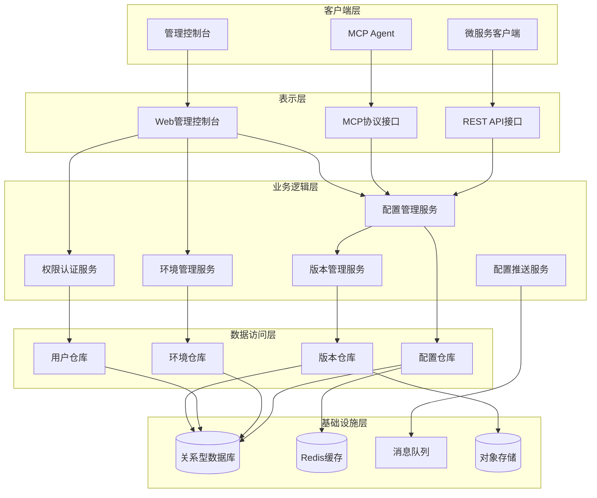
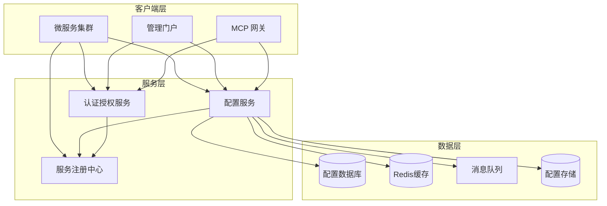

# 配置服务（Config Service）架构设计

## 1. 概述

配置服务是GMP系统的核心基础设施组件，负责集中管理所有微服务的配置信息，提供配置的动态更新、版本管理、环境隔离和配置热加载等能力。本文档详细描述配置服务的架构设计、组件划分、技术选型和实现方案。

### 1.1 设计目标

- **集中化配置管理**：所有微服务的配置信息统一存储和管理
- **动态配置更新**：支持配置的实时推送和热更新，无需重启服务
- **环境隔离**：支持多环境（开发、测试、生产）配置的隔离管理
- **版本控制**：配置变更历史记录和版本回滚能力
- **高可用**：确保配置服务自身的高可用性和容错性
- **安全访问**：基于角色的访问控制和配置加密传输
- **MCP协议支持**：实现MCP协议，提供标准化的配置管理接口

### 1.2 术语定义

| 术语 | 解释 |
| :--- | :--- |
| 配置项 | 系统中可配置的最小单元，通常以key-value形式存储 |
| 配置集 | 一组相关配置项的集合，通常对应一个微服务或应用 |
| 环境 | 系统运行的不同环境，如开发、测试、生产等 |
| 配置标签 | 用于标识配置版本或特性的标记 |
| 配置模板 | 预定义的配置结构，用于快速生成新配置 |
| MCP | Model Context Protocol，模型上下文协议，用于配置服务与其他组件交互 |

## 2. 系统架构

### 2.1 分层架构设计

配置服务采用经典的分层架构设计，由以下层次组成：

- **表示层**：REST API接口、MCP协议接口和管理控制台
- **业务逻辑层**：配置管理、环境管理、权限控制和配置推送等核心业务逻辑
- **数据访问层**：配置存储、索引和缓存访问接口
- **基础设施层**：数据库、缓存、消息队列等基础设施组件



### 2.2 微服务架构图

配置服务作为独立的微服务，与其他系统组件的交互关系如下：



## 3. 服务设计

### 3.1 微服务边界

配置服务作为独立微服务，负责以下功能域：

- **配置管理**：配置的CRUD操作、批量导入导出、配置模板管理
- **环境管理**：多环境配置隔离、环境变量管理
- **版本控制**：配置版本历史、变更记录、版本回滚
- **配置推送**：配置变更通知、实时推送
- **权限控制**：配置访问权限管理、操作审计
- **MCP集成**：提供标准化的MCP协议接口

### 3.2 服务接口设计

#### 3.2.1 REST API接口

| API路径 | 方法 | 模块/类 | 功能描述 | 请求体 (JSON) | 成功响应 (200 OK) |
| :--- | :--- | :--- | :--- | :--- | :--- |
| `/api/configs` | `GET` | `ConfigController` | 获取配置列表 | N/A | `[{"id": "...", "name": "...", "description": "...", "profile": "...", "label": "...", "content": {...}}]` |
| `/api/configs` | `POST` | `ConfigController` | 创建配置 | `{"name": "...", "description": "...", "profile": "...", "label": "...", "content": {...}}` | `{"id": "...", "name": "...", "description": "...", "profile": "...", "label": "...", "content": {...}}` |
| `/api/configs/{id}` | `GET` | `ConfigController` | 获取配置详情 | N/A | `{"id": "...", "name": "...", "description": "...", "profile": "...", "label": "...", "content": {...}}` |
| `/api/configs/{id}` | `PUT` | `ConfigController` | 更新配置 | `{"name": "...", "description": "...", "profile": "...", "label": "...", "content": {...}}` | `{"id": "...", "name": "...", "description": "...", "profile": "...", "label": "...", "content": {...}}` |
| `/api/configs/{id}` | `DELETE` | `ConfigController` | 删除配置 | N/A | `{"message": "配置删除成功"}` |
| `/api/configs/search` | `GET` | `ConfigController` | 搜索配置 | N/A | `[{"id": "...", "name": "...", "description": "...", "profile": "...", "label": "..."}]` |
| `/api/configs/{id}/versions` | `GET` | `VersionController` | 获取配置版本历史 | N/A | `[{"versionId": "...", "configId": "...", "content": {...}, "createdBy": "...", "createdTime": "..."}]` |
| `/api/configs/{id}/versions/{versionId}` | `GET` | `VersionController` | 获取指定版本配置 | N/A | `{"versionId": "...", "configId": "...", "content": {...}, "createdBy": "...", "createdTime": "..."}` |
| `/api/configs/{id}/versions/{versionId}/rollback` | `POST` | `VersionController` | 回滚到指定版本 | N/A | `{"message": "配置回滚成功"}` |
| `/api/environments` | `GET` | `EnvironmentController` | 获取环境列表 | N/A | `[{"id": "...", "name": "...", "description": "...", "isActive": true}]` |
| `/api/environments` | `POST` | `EnvironmentController` | 创建环境 | `{"name": "...", "description": "..."}` | `{"id": "...", "name": "...", "description": "...", "isActive": true}` |
| `/api/environments/{id}` | `PUT` | `EnvironmentController` | 更新环境 | `{"name": "...", "description": "...", "isActive": true}` | `{"id": "...", "name": "...", "description": "...", "isActive": true}` |
| `/api/environments/{id}` | `DELETE` | `EnvironmentController` | 删除环境 | N/A | `{"message": "环境删除成功"}` |
| `/api/templates` | `GET` | `TemplateController` | 获取配置模板列表 | N/A | `[{"id": "...", "name": "...", "description": "...", "templateContent": {...}}]` |
| `/api/templates` | `POST` | `TemplateController` | 创建配置模板 | `{"name": "...", "description": "...", "templateContent": {...}}` | `{"id": "...", "name": "...", "description": "...", "templateContent": {...}}` |
| `/api/templates/{id}` | `PUT` | `TemplateController` | 更新配置模板 | `{"name": "...", "description": "...", "templateContent": {...}}` | `{"id": "...", "name": "...", "description": "...", "templateContent": {...}}` |
| `/api/templates/{id}` | `DELETE` | `TemplateController` | 删除配置模板 | N/A | `{"message": "模板删除成功"}` |

#### 3.2.2 MCP协议接口

| 接口名称 | 模块/类 | 功能描述 | 请求参数 | 成功响应 |
| :--- | :--- | :--- | :--- | :--- |
| `getConfig` | `MCPConfigService` | 获取配置信息 | `{"appName": "...", "profile": "...", "label": "..."}` | `{"status": "success", "data": {...}}` |
| `updateConfig` | `MCPConfigService` | 更新配置信息 | `{"appName": "...", "profile": "...", "label": "...", "content": {...}}` | `{"status": "success", "message": "配置更新成功"}` |
| `watchConfig` | `MCPConfigService` | 监听配置变更 | `{"appName": "...", "profile": "...", "label": "..."}` | `{"status": "success", "subscriptionId": "..."}` |
| `getConfigHistory` | `MCPConfigService` | 获取配置历史 | `{"appName": "...", "profile": "...", "label": "...", "limit": 10}` | `{"status": "success", "data": [...]}` |
| `rollbackConfig` | `MCPConfigService` | 回滚配置版本 | `{"appName": "...", "profile": "...", "label": "...", "versionId": "..."}` | `{"status": "success", "message": "配置回滚成功"}` |

#### 3.2.3 内部服务接口

| 接口名称 | 模块/类 | 功能描述 | 参数 | 返回值 | 所属文件/模块 |
| :--- | :--- | :--- | :--- | :--- | :--- |
| `saveConfig` | `ConfigService` | 保存配置信息 | `config: Config` | `Config` | com.gmp.config.service.ConfigService |
| `getConfigById` | `ConfigService` | 根据ID获取配置 | `id: String` | `Config` | com.gmp.config.service.ConfigService |
| `deleteConfig` | `ConfigService` | 删除配置 | `id: String` | `Boolean` | com.gmp.config.service.ConfigService |
| `publishConfigChange` | `ConfigPublisher` | 发布配置变更消息 | `configId: String, changeType: String` | `void` | com.gmp.config.publisher.ConfigPublisher |
| `saveConfigVersion` | `VersionService` | 保存配置版本 | `configId: String, content: Map` | `ConfigVersion` | com.gmp.config.service.VersionService |
| `getConfigVersions` | `VersionService` | 获取配置版本历史 | `configId: String, limit: Integer` | `List<ConfigVersion>` | com.gmp.config.service.VersionService |
| `authenticateUser` | `AuthService` | 用户认证 | `username: String, password: String` | `AuthenticationResult` | com.gmp.config.service.AuthService |
| `checkPermission` | `PermissionService` | 检查用户权限 | `userId: String, resourceType: String, resourceId: String, action: String` | `Boolean` | com.gmp.config.service.PermissionService |

## 4. 数据架构设计

### 4.1 核心数据模型

#### Config (配置)
```java
@Entity
@Table(name = "configs")
public class Config {
    @Id
    @GeneratedValue(strategy = GenerationType.IDENTITY)
    private Long id;
    
    @Column(nullable = false)
    private String name;
    
    private String description;
    
    @Column(nullable = false)
    private String profile; // 环境标识：dev, test, prod
    
    private String label; // 配置标签
    
    @Column(columnDefinition = "jsonb")
    private String content; // 配置内容，JSON格式
    
    @Column(nullable = false)
    private String createdBy;
    
    @Column(nullable = false, updatable = false)
    private LocalDateTime createdAt;
    
    private String updatedBy;
    private LocalDateTime updatedAt;
    
    @Version
    private Long version;
    
    // getter and setter methods
}
```

#### ConfigVersion (配置版本)
```java
@Entity
@Table(name = "config_versions")
public class ConfigVersion {
    @Id
    @GeneratedValue(strategy = GenerationType.IDENTITY)
    private Long id;
    
    @Column(name = "version_id", nullable = false)
    private String versionId; // 版本唯一标识
    
    @Column(name = "config_id", nullable = false)
    private Long configId;
    
    @Column(columnDefinition = "jsonb")
    private String content; // 版本配置内容
    
    @Column(name = "change_log")
    private String changeLog; // 变更说明
    
    @Column(nullable = false)
    private String createdBy;
    
    @Column(nullable = false)
    private LocalDateTime createdAt;
    
    // getter and setter methods
}
```

#### Environment (环境)
```java
@Entity
@Table(name = "environments")
public class Environment {
    @Id
    @GeneratedValue(strategy = GenerationType.IDENTITY)
    private Long id;
    
    @Column(nullable = false, unique = true)
    private String name;
    
    private String description;
    
    @Column(name = "is_active", nullable = false)
    private boolean isActive;
    
    @Column(name = "created_by")
    private String createdBy;
    
    @Column(name = "created_at")
    private LocalDateTime createdAt;
    
    @Column(name = "updated_by")
    private String updatedBy;
    
    @Column(name = "updated_at")
    private LocalDateTime updatedAt;
    
    // getter and setter methods
}
```

#### ConfigTemplate (配置模板)
```java
@Entity
@Table(name = "config_templates")
public class ConfigTemplate {
    @Id
    @GeneratedValue(strategy = GenerationType.IDENTITY)
    private Long id;
    
    @Column(nullable = false, unique = true)
    private String name;
    
    private String description;
    
    @Column(name = "template_content", columnDefinition = "jsonb", nullable = false)
    private String templateContent; // 模板内容，JSON格式
    
    @Column(name = "created_by")
    private String createdBy;
    
    @Column(name = "created_at")
    private LocalDateTime createdAt;
    
    @Column(name = "updated_by")
    private String updatedBy;
    
    @Column(name = "updated_at")
    private LocalDateTime updatedAt;
    
    // getter and setter methods
}
```

### 4.2 Repository层设计

```java
@Repository
public interface ConfigRepository extends JpaRepository<Config, Long> {
    List<Config> findByProfile(String profile);
    List<Config> findByNameContainingOrDescriptionContaining(String name, String description);
    Optional<Config> findByNameAndProfile(String name, String profile);
    boolean existsByNameAndProfileAndIdNot(String name, String profile, Long id);
    
    @Query(value = "SELECT * FROM configs WHERE name LIKE %:keyword% OR description LIKE %:keyword% ORDER BY updated_at DESC", nativeQuery = true)
    Page<Config> searchConfigs(@Param("keyword") String keyword, Pageable pageable);
}
```

```java
@Repository
public interface ConfigVersionRepository extends JpaRepository<ConfigVersion, Long> {
    List<ConfigVersion> findByConfigIdOrderByCreatedAtDesc(Long configId);
    Optional<ConfigVersion> findByConfigIdAndVersionId(Long configId, String versionId);
    
    @Query(value = "SELECT * FROM config_versions WHERE config_id = :configId ORDER BY created_at DESC LIMIT :limit", nativeQuery = true)
    List<ConfigVersion> findRecentVersionsByConfigId(@Param("configId") Long configId, @Param("limit") Integer limit);
}
```

```java
@Repository
public interface EnvironmentRepository extends JpaRepository<Environment, Long> {
    Optional<Environment> findByName(String name);
    boolean existsByNameAndIdNot(String name, Long id);
    List<Environment> findByIsActiveTrue();
}
```

```java
@Repository
public interface ConfigTemplateRepository extends JpaRepository<ConfigTemplate, Long> {
    Optional<ConfigTemplate> findByName(String name);
    boolean existsByNameAndIdNot(String name, Long id);
    List<ConfigTemplate> findByNameContaining(String keyword);
}
```

## 5. MCP协议实现

### 5.1 MCP核心组件

配置服务作为MCP的提供者和使用者，实现了以下核心组件：

```java
@Service
public class MCPConfigService {
    
    @Autowired
    private ConfigService configService;
    
    @Autowired
    private VersionService versionService;
    
    @Autowired
    private ConfigChangeEventPublisher eventPublisher;
    
    /**
     * 获取配置信息
     */
    public MCPResponse getConfig(MCPRequest request) {
        try {
            String appName = request.getString("appName");
            String profile = request.getString("profile", "default");
            String label = request.getString("label", "master");
            
            Config config = configService.getConfig(appName, profile, label);
            if (config == null) {
                return MCPResponse.error("配置不存在");
            }
            
            return MCPResponse.success(configService.parseConfigContent(config.getContent()));
        } catch (Exception e) {
            return MCPResponse.error("获取配置失败: " + e.getMessage());
        }
    }
    
    /**
     * 更新配置信息
     */
    public MCPResponse updateConfig(MCPRequest request) {
        try {
            String appName = request.getString("appName");
            String profile = request.getString("profile", "default");
            String label = request.getString("label", "master");
            Map<String, Object> content = request.getMap("content");
            
            Config config = configService.updateConfig(appName, profile, label, content, request.getUserId());
            
            // 发布配置变更事件
            eventPublisher.publishConfigChangeEvent(config.getId(), "UPDATE", request.getUserId());
            
            return MCPResponse.success("配置更新成功");
        } catch (Exception e) {
            return MCPResponse.error("更新配置失败: " + e.getMessage());
        }
    }
    
    /**
     * 监听配置变更
     */
    public MCPResponse watchConfig(MCPRequest request) {
        try {
            String appName = request.getString("appName");
            String profile = request.getString("profile", "default");
            String label = request.getString("label", "master");
            
            String subscriptionId = configService.createConfigSubscription(appName, profile, label, request.getUserId());
            
            return MCPResponse.success(Map.of("subscriptionId", subscriptionId));
        } catch (Exception e) {
            return MCPResponse.error("创建配置监听失败: " + e.getMessage());
        }
    }
    
    /**
     * 获取配置历史
     */
    public MCPResponse getConfigHistory(MCPRequest request) {
        try {
            String appName = request.getString("appName");
            String profile = request.getString("profile", "default");
            String label = request.getString("label", "master");
            Integer limit = request.getInteger("limit", 10);
            
            Config config = configService.getConfig(appName, profile, label);
            if (config == null) {
                return MCPResponse.success(Collections.emptyList());
            }
            
            List<ConfigVersion> versions = versionService.getRecentVersions(config.getId(), limit);
            return MCPResponse.success(versions.stream()
                .map(v -> versionService.toVersionDTO(v))
                .collect(Collectors.toList()));
        } catch (Exception e) {
            return MCPResponse.error("获取配置历史失败: " + e.getMessage());
        }
    }
    
    /**
     * 回滚配置版本
     */
    public MCPResponse rollbackConfig(MCPRequest request) {
        try {
            String appName = request.getString("appName");
            String profile = request.getString("profile", "default");
            String label = request.getString("label", "master");
            String versionId = request.getString("versionId");
            
            Config config = configService.getConfig(appName, profile, label);
            if (config == null) {
                return MCPResponse.error("配置不存在");
            }
            
            versionService.rollbackToVersion(config.getId(), versionId, request.getUserId());
            
            // 发布配置变更事件
            eventPublisher.publishConfigChangeEvent(config.getId(), "ROLLBACK", request.getUserId());
            
            return MCPResponse.success("配置回滚成功");
        } catch (Exception e) {
            return MCPResponse.error("回滚配置失败: " + e.getMessage());
        }
    }
}
```

### 5.2 MCP消息格式

配置服务的MCP消息格式遵循标准MCP协议规范，主要包含以下字段：

#### 请求消息格式
```json
{
  "requestId": "唯一请求ID",
  "userId": "用户ID",
  "timestamp": "时间戳",
  "tool": "配置工具名称",
  "params": {
    "appName": "应用名称",
    "profile": "环境配置",
    "label": "配置标签",
    "content": {"配置内容": "值"},
    "versionId": "版本ID"
  },
  "metadata": {"附加元数据": "值"}
}
```

#### 响应消息格式
```json
{
  "requestId": "对应请求ID",
  "timestamp": "时间戳",
  "status": "success/error",
  "data": {"返回数据对象"},
  "message": "响应消息",
  "errorCode": "错误代码",
  "metadata": {"附加元数据": "值"}
}
```

### 5.3 MCP工具注册

配置服务向MCP注册了以下工具：

```java
@Configuration
public class MCPToolsConfig {
    
    @Bean
    public MCPToolRegistry configToolRegistry(MCPConfigService configService) {
        MCPToolRegistry registry = new MCPToolRegistry();
        
        // 注册配置获取工具
        registry.registerTool("getConfig", configService::getConfig);
        
        // 注册配置更新工具
        registry.registerTool("updateConfig", configService::updateConfig);
        
        // 注册配置监听工具
        registry.registerTool("watchConfig", configService::watchConfig);
        
        // 注册配置历史工具
        registry.registerTool("getConfigHistory", configService::getConfigHistory);
        
        // 注册配置回滚工具
        registry.registerTool("rollbackConfig", configService::rollbackConfig);
        
        return registry;
    }
}
```

## 6. 集成设计

### 6.1 外部系统集成

#### 服务注册中心集成
配置服务通过Spring Cloud Config Server集成服务注册中心，自动发现和注册自身服务。

```yaml
spring:
  application:
    name: config-service
  cloud:
    config:
      server:
        git:
          uri: https://github.com/gmp-system/config-repo
          default-label: main
          searchPaths: '{application}'
          timeout: 5
          force-pull: true

# 服务注册与发现配置
  cloud:
    nacos:
      discovery:
        server-addr: nacos-server:8848
        namespace: public
        group: DEFAULT_GROUP
```

#### 认证授权集成
配置服务与认证授权服务集成，实现统一的身份认证和权限控制。

```java
@Configuration
@EnableResourceServer
public class ResourceServerConfig extends ResourceServerConfigurerAdapter {
    
    @Override
    public void configure(HttpSecurity http) throws Exception {
        http.authorizeRequests()
            .antMatchers("/api/public/**").permitAll()
            .antMatchers("/api/configs/**").hasAuthority("SCOPE_CONFIG_ADMIN")
            .antMatchers("/api/environments/**").hasAuthority("SCOPE_ENV_ADMIN")
            .anyRequest().authenticated()
            .and()
            .oauth2ResourceServer().jwt();
    }
}
```

### 6.2 内部服务集成

#### 配置推送机制
配置服务通过消息队列实现配置变更的实时推送。

```java
@Service
public class ConfigChangeEventPublisher {
    
    @Autowired
    private RabbitTemplate rabbitTemplate;
    
    /**
     * 发布配置变更事件
     */
    public void publishConfigChangeEvent(Long configId, String changeType, String operator) {
        ConfigChangeEvent event = new ConfigChangeEvent();
        event.setConfigId(configId);
        event.setChangeType(changeType);
        event.setOperator(operator);
        event.setTimestamp(LocalDateTime.now());
        
        rabbitTemplate.convertAndSend("config-exchange", "config.changed", event);
    }
}
```

#### 缓存同步机制
配置服务使用Redis实现分布式缓存，确保配置的一致性。

```java
@Configuration
@EnableCaching
public class CacheConfig {
    
    @Bean
    public RedisCacheManager cacheManager(RedisConnectionFactory factory) {
        RedisCacheConfiguration config = RedisCacheConfiguration.defaultCacheConfig()
            .entryTtl(Duration.ofMinutes(10))
            .serializeKeysWith(RedisSerializationContext.SerializationPair.fromSerializer(new StringRedisSerializer()))
            .serializeValuesWith(RedisSerializationContext.SerializationPair.fromSerializer(new GenericJackson2JsonRedisSerializer()));
        
        return RedisCacheManager.builder(factory)
            .cacheDefaults(config)
            .withCacheConfiguration("configs", config.entryTtl(Duration.ofHours(1)))
            .withCacheConfiguration("templates", config.entryTtl(Duration.ofDays(1)))
            .build();
    }
}
```

## 7. 安全架构

### 7.1 认证与授权

配置服务采用OAuth 2.0和JWT实现认证授权，确保只有授权用户才能访问和修改配置。

```java
@Service
public class AuthServiceImpl implements AuthService {
    
    @Autowired
    private AuthenticationManager authenticationManager;
    
    @Autowired
    private JwtTokenProvider tokenProvider;
    
    @Override
    public AuthenticationResult authenticate(String username, String password) {
        try {
            Authentication authentication = authenticationManager.authenticate(
                new UsernamePasswordAuthenticationToken(username, password)
            );
            
            SecurityContextHolder.getContext().setAuthentication(authentication);
            String jwt = tokenProvider.generateToken(authentication);
            
            return AuthenticationResult.success(jwt);
        } catch (Exception e) {
            return AuthenticationResult.fail("认证失败: " + e.getMessage());
        }
    }
}
```

### 7.2 数据加密

敏感配置信息（如数据库密码、API密钥等）通过AES加密存储，确保数据安全。

```java
@Service
public class ConfigEncryptionService {
    
    private final SecretKey secretKey;
    
    public ConfigEncryptionService(@Value("${config.encryption.key}") String encryptionKey) {
        this.secretKey = new SecretKeySpec(encryptionKey.getBytes(), "AES");
    }
    
    /**
     * 加密敏感配置值
     */
    public String encrypt(String value) {
        try {
            Cipher cipher = Cipher.getInstance("AES/GCM/NoPadding");
            byte[] iv = new byte[12];
            new SecureRandom().nextBytes(iv);
            GCMParameterSpec parameterSpec = new GCMParameterSpec(128, iv);
            
            cipher.init(Cipher.ENCRYPT_MODE, secretKey, parameterSpec);
            byte[] encryptedData = cipher.doFinal(value.getBytes(StandardCharsets.UTF_8));
            
            ByteBuffer byteBuffer = ByteBuffer.allocate(iv.length + encryptedData.length);
            byteBuffer.put(iv);
            byteBuffer.put(encryptedData);
            
            return Base64.getEncoder().encodeToString(byteBuffer.array());
        } catch (Exception e) {
            throw new RuntimeException("加密失败", e);
        }
    }
    
    /**
     * 解密敏感配置值
     */
    public String decrypt(String encryptedValue) {
        try {
            byte[] encryptedData = Base64.getDecoder().decode(encryptedValue);
            ByteBuffer byteBuffer = ByteBuffer.wrap(encryptedData);
            
            byte[] iv = new byte[12];
            byteBuffer.get(iv);
            
            byte[] cipherText = new byte[byteBuffer.remaining()];
            byteBuffer.get(cipherText);
            
            Cipher cipher = Cipher.getInstance("AES/GCM/NoPadding");
            GCMParameterSpec parameterSpec = new GCMParameterSpec(128, iv);
            cipher.init(Cipher.DECRYPT_MODE, secretKey, parameterSpec);
            
            return new String(cipher.doFinal(cipherText), StandardCharsets.UTF_8);
        } catch (Exception e) {
            throw new RuntimeException("解密失败", e);
        }
    }
}
```

### 7.3 访问控制

配置服务实现细粒度的访问控制，基于角色和资源的权限管理。

```java
@Service
public class PermissionServiceImpl implements PermissionService {
    
    @Autowired
    private UserRoleRepository userRoleRepository;
    
    @Autowired
    private RolePermissionRepository rolePermissionRepository;
    
    @Override
    public boolean checkPermission(String userId, String resourceType, String resourceId, String action) {
        // 获取用户角色
        List<Role> roles = userRoleRepository.findRolesByUserId(userId);
        if (roles.isEmpty()) {
            return false;
        }
        
        // 检查角色权限
        for (Role role : roles) {
            List<Permission> permissions = rolePermissionRepository.findPermissionsByRoleIdAndResourceType(
                role.getId(), resourceType);
            
            for (Permission permission : permissions) {
                // 检查是否有权限执行指定操作
                if (permission.getActions().contains(action)) {
                    // 如果资源ID不为空，则检查是否有特定资源的权限
                    if (StringUtils.isEmpty(resourceId) || permission.getResourceId().equals("*") 
                            || permission.getResourceId().equals(resourceId)) {
                        return true;
                    }
                }
            }
        }
        
        return false;
    }
}
```

## 8. 性能优化

### 8.1 缓存策略

配置服务实现多级缓存策略，包括本地缓存和分布式缓存，提高配置读取性能。

```java
@Service
public class CachingConfigService {
    
    @Autowired
    private ConfigRepository configRepository;
    
    @Cacheable(value = "configs", key = "#appName + '-' + #profile + '-' + #label")
    public Config getConfig(String appName, String profile, String label) {
        return configRepository.findByNameAndProfile(appName, profile).orElse(null);
    }
    
    @CachePut(value = "configs", key = "#config.name + '-' + #config.profile + '-' + #config.label")
    public Config updateConfig(Config config) {
        return configRepository.save(config);
    }
    
    @CacheEvict(value = "configs", key = "#appName + '-' + #profile + '-' + #label")
    public void evictConfig(String appName, String profile, String label) {
        // 仅清除缓存，不执行其他操作
    }
    
    @CacheEvict(value = "configs", allEntries = true)
    public void clearAllCache() {
        // 清除所有缓存
    }
}
```

### 8.2 异步处理

配置服务使用异步处理机制，提高并发处理能力。

```java
@Configuration
@EnableAsync
public class AsyncConfig {
    
    @Bean
    public Executor taskExecutor() {
        ThreadPoolTaskExecutor executor = new ThreadPoolTaskExecutor();
        executor.setCorePoolSize(10);
        executor.setMaxPoolSize(20);
        executor.setQueueCapacity(500);
        executor.setThreadNamePrefix("ConfigAsync-");
        executor.initialize();
        return executor;
    }
}

@Service
public class AsyncConfigService {
    
    @Autowired
    private ConfigService configService;
    
    @Async
    public CompletableFuture<Config> asyncGetConfig(String appName, String profile, String label) {
        return CompletableFuture.completedFuture(
            configService.getConfig(appName, profile, label)
        );
    }
    
    @Async
    public CompletableFuture<Config> asyncUpdateConfig(Config config) {
        return CompletableFuture.completedFuture(
            configService.saveConfig(config)
        );
    }
    
    @Async
    public CompletableFuture<Void> asyncPublishConfigChange(Long configId, String changeType) {
        configService.publishConfigChange(configId, changeType);
        return CompletableFuture.runAsync(() -> {});
    }
}
```

### 8.3 数据库优化

配置服务通过索引优化、查询优化等手段提升数据库访问性能。

```sql
-- 为configs表创建索引
CREATE INDEX idx_configs_name_profile ON configs(name, profile);
CREATE INDEX idx_configs_profile ON configs(profile);
CREATE INDEX idx_configs_updated_at ON configs(updated_at);

-- 为config_versions表创建索引
CREATE INDEX idx_config_versions_config_id ON config_versions(config_id);
CREATE INDEX idx_config_versions_created_at ON config_versions(created_at);

-- 为environments表创建索引
CREATE INDEX idx_environments_is_active ON environments(is_active);
```

## 9. 监控与可观测性

### 9.1 日志监控

配置服务集成Spring Boot Actuator和ELK日志分析系统，实现日志的收集、分析和告警。

```yaml
# Spring Boot Actuator配置
management:
  endpoints:
    web:
      exposure:
        include: "health,info,metrics,prometheus,loggers"
  endpoint:
    health:
      show-details: always
  metrics:
    export:
      prometheus: {}
  prometheus:
    metrics:
      export:
        enabled: true

# 日志配置
logging:
  level:
    root: INFO
    com.gmp.config: DEBUG
    org.springframework.security: INFO
  pattern:
    console: "%d{yyyy-MM-dd HH:mm:ss} [%thread] %-5level %logger{36} - %msg%n"
  file:
    name: /var/log/config-service/config-service.log
    max-size: 10MB
    max-history: 10
```

### 9.2 健康检查

配置服务实现健康检查接口，用于监控系统运行状态。

```java
@Component
public class ConfigRepositoryHealthIndicator implements HealthIndicator {
    
    @Autowired
    private ConfigRepository configRepository;
    
    @Override
    public Health health() {
        try {
            // 简单查询验证数据库连接
            configRepository.count();
            return Health.up().withDetail("database", "Connected").build();
        } catch (Exception e) {
            return Health.down().withDetail("database", "Connection failed").withException(e).build();
        }
    }
}
```

### 9.3 指标监控

配置服务通过Prometheus监控系统收集关键性能指标。

```java
@Component
public class ConfigMetricsCollector {
    
    private final Counter configReadCounter;
    private final Counter configUpdateCounter;
    private final Counter configErrorCounter;
    private final Timer configReadTimer;
    private final Timer configUpdateTimer;
    
    public ConfigMetricsCollector(MeterRegistry registry) {
        // 注册计数器
        configReadCounter = Counter.builder("config.read.count")
            .description("配置读取次数")
            .register(registry);
        
        configUpdateCounter = Counter.builder("config.update.count")
            .description("配置更新次数")
            .register(registry);
        
        configErrorCounter = Counter.builder("config.error.count")
            .description("配置操作错误次数")
            .tag("operation", "read")
            .register(registry);
        
        // 注册计时器
        configReadTimer = Timer.builder("config.read.time")
            .description("配置读取耗时")
            .register(registry);
        
        configUpdateTimer = Timer.builder("config.update.time")
            .description("配置更新耗时")
            .register(registry);
    }
    
    public void recordConfigRead() {
        configReadCounter.increment();
    }
    
    public void recordConfigUpdate() {
        configUpdateCounter.increment();
    }
    
    public void recordConfigError(String operation) {
        configErrorCounter.increment();
    }
    
    public <T> T timeConfigRead(Supplier<T> operation) {
        return configReadTimer.record(operation);
    }
    
    public <T> T timeConfigUpdate(Supplier<T> operation) {
        return configUpdateTimer.record(operation);
    }
}
```

## 10. 部署与扩展性

### 10.1 容器化部署

配置服务使用Docker容器化部署，支持Kubernetes编排管理。

```dockerfile
FROM openjdk:17-jdk-slim

WORKDIR /app

COPY target/config-service.jar app.jar

EXPOSE 8888

ENTRYPOINT ["java", "-jar", "app.jar"]
```

### 10.2 Kubernetes配置

配置服务在Kubernetes集群中的部署配置示例：

```yaml
# Kubernetes Deployment配置
apiVersion: apps/v1
kind: Deployment
metadata:
  name: config-service
  namespace: gmp-system
spec:
  replicas: 2
  selector:
    matchLabels:
      app: config-service
  template:
    metadata:
      labels:
        app: config-service
    spec:
      containers:
      - name: config-service
        image: gmp-system/config-service:latest
        ports:
        - containerPort: 8888
        resources:
          requests:
            memory: "512Mi"
            cpu: "500m"
          limits:
            memory: "1Gi"
            cpu: "1000m"
        env:
        - name: SPRING_PROFILES_ACTIVE
          value: "prod"
        - name: SPRING_CLOUD_CONFIG_SERVER_GIT_URI
          valueFrom:
            secretKeyRef:
              name: config-git-credentials
              key: uri
        - name: SPRING_CLOUD_CONFIG_SERVER_GIT_USERNAME
          valueFrom:
            secretKeyRef:
              name: config-git-credentials
              key: username
        - name: SPRING_CLOUD_CONFIG_SERVER_GIT_PASSWORD
          valueFrom:
            secretKeyRef:
              name: config-git-credentials
              key: password
        - name: SPRING_REDIS_HOST
          value: "redis-master"
        - name: SPRING_REDIS_PORT
          value: "6379"
        - name: SPRING_RABBITMQ_HOST
          value: "rabbitmq"
        - name: SPRING_RABBITMQ_PORT
          value: "5672"
        - name: SPRING_DATASOURCE_URL
          value: "jdbc:postgresql://postgres:5432/config_db"
        - name: SPRING_DATASOURCE_USERNAME
          valueFrom:
            secretKeyRef:
              name: db-credentials
              key: username
        - name: SPRING_DATASOURCE_PASSWORD
          valueFrom:
            secretKeyRef:
              name: db-credentials
              key: password
        readinessProbe:
          httpGet:
            path: /actuator/health/readiness
            port: 8888
          initialDelaySeconds: 30
          periodSeconds: 10
        livenessProbe:
          httpGet:
            path: /actuator/health/liveness
            port: 8888
          initialDelaySeconds: 60
          periodSeconds: 20
```

```yaml
# Kubernetes Service配置
apiVersion: v1
kind: Service
metadata:
  name: config-service
  namespace: gmp-system
spec:
  selector:
    app: config-service
  ports:
  - port: 8888
    targetPort: 8888
  type: ClusterIP
```

```yaml
# Kubernetes Ingress配置
apiVersion: networking.k8s.io/v1
kind: Ingress
metadata:
  name: config-service-ingress
  namespace: gmp-system
  annotations:
    nginx.ingress.kubernetes.io/ssl-redirect: "true"
    nginx.ingress.kubernetes.io/rewrite-target: /$2
spec:
  rules:
  - host: config.gmp-system.com
    http:
      paths:
      - path: /api(/|$)(.*)
        pathType: Prefix
        backend:
          service:
            name: config-service
            port:
              number: 8888
  tls:
  - hosts:
    - config.gmp-system.com
    secretName: gmp-tls-secret
```

### 10.3 CI/CD流程

配置服务使用GitHub Actions实现持续集成和部署流程。

```yaml
# GitHub Actions工作流配置
name: Config Service CI/CD

on:
  push:
    branches: [ main, develop ]
    paths:
      - 'services/config-service/**'

jobs:
  build:
    runs-on: ubuntu-latest
    steps:
    - uses: actions/checkout@v3
    - name: Set up JDK 17
      uses: actions/setup-java@v3
      with:
        java-version: '17'
        distribution: 'temurin'
        cache: maven
    - name: Build with Maven
      run: cd services/config-service && mvn -B package --file pom.xml
    - name: Build and push Docker image
      uses: docker/build-push-action@v4
      with:
        context: ./services/config-service
        push: true
        tags: |
          gmp-system/config-service:${{ github.sha }}
          gmp-system/config-service:latest
        cache-from: type=registry,ref=gmp-system/config-service:latest
        cache-to: type=inline

  deploy-dev:
    needs: build
    runs-on: ubuntu-latest
    if: github.ref == 'refs/heads/develop'
    steps:
    - name: Deploy to Development
      uses: appleboy/ssh-action@master
      with:
        host: ${{ secrets.DEV_SERVER }}
        username: ${{ secrets.SSH_USERNAME }}
        key: ${{ secrets.SSH_PRIVATE_KEY }}
        script: |
          kubectl config use-context dev
          kubectl set image deployment/config-service config-service=gmp-system/config-service:${{ github.sha }} -n gmp-system

  deploy-prod:
    needs: build
    runs-on: ubuntu-latest
    if: github.ref == 'refs/heads/main'
    steps:
    - name: Deploy to Production
      uses: appleboy/ssh-action@master
      with:
        host: ${{ secrets.PROD_SERVER }}
        username: ${{ secrets.SSH_USERNAME }}
        key: ${{ secrets.SSH_PRIVATE_KEY }}
        script: |
          kubectl config use-context prod
          kubectl set image deployment/config-service config-service=gmp-system/config-service:${{ github.sha }} -n gmp-system
```

### 10.4 数据库迁移

配置服务使用Flyway管理数据库版本和迁移。

```yaml
# Flyway配置
spring:
  flyway:
    enabled: true
    locations: classpath:db/migration
    validate-on-migrate: true
    baseline-on-migrate: true
    baseline-version: 1.0.0
```

```sql
-- V1.0.0__Initial_Schema.sql
CREATE TABLE environments (
    id BIGSERIAL PRIMARY KEY,
    name VARCHAR(255) NOT NULL UNIQUE,
    description TEXT,
    is_active BOOLEAN NOT NULL DEFAULT TRUE,
    created_by VARCHAR(100),
    created_at TIMESTAMP NOT NULL DEFAULT CURRENT_TIMESTAMP,
    updated_by VARCHAR(100),
    updated_at TIMESTAMP
);

CREATE TABLE configs (
    id BIGSERIAL PRIMARY KEY,
    name VARCHAR(255) NOT NULL,
    description TEXT,
    profile VARCHAR(50) NOT NULL,
    label VARCHAR(50) DEFAULT 'master',
    content JSONB NOT NULL,
    created_by VARCHAR(100) NOT NULL,
    created_at TIMESTAMP NOT NULL DEFAULT CURRENT_TIMESTAMP,
    updated_by VARCHAR(100),
    updated_at TIMESTAMP,
    version BIGINT NOT NULL DEFAULT 1,
    UNIQUE(name, profile)
);

CREATE TABLE config_versions (
    id BIGSERIAL PRIMARY KEY,
    version_id VARCHAR(100) NOT NULL,
    config_id BIGINT NOT NULL REFERENCES configs(id) ON DELETE CASCADE,
    content JSONB NOT NULL,
    change_log TEXT,
    created_by VARCHAR(100) NOT NULL,
    created_at TIMESTAMP NOT NULL DEFAULT CURRENT_TIMESTAMP
);

CREATE TABLE config_templates (
    id BIGSERIAL PRIMARY KEY,
    name VARCHAR(255) NOT NULL UNIQUE,
    description TEXT,
    template_content JSONB NOT NULL,
    created_by VARCHAR(100),
    created_at TIMESTAMP NOT NULL DEFAULT CURRENT_TIMESTAMP,
    updated_by VARCHAR(100),
    updated_at TIMESTAMP
);
```

### 10.5 灾难恢复与备份策略

配置服务实现定期数据库备份和配置文件备份，确保数据安全和灾难恢复能力。

```yaml
# 备份配置
backup:
  database:
    enabled: true
    schedule: "0 0 * * *"  # 每天凌晨执行
    retention-days: 7
    location: "/backups/database"
  config-files:
    enabled: true
    schedule: "0 */6 * * *"  # 每6小时执行
    retention-days: 30
    location: "/backups/config-files"
```

## 11. 总结与展望

### 11.1 架构设计总结

配置服务采用微服务架构设计，实现了集中式配置管理、动态配置更新、环境隔离和版本控制等核心功能。通过MCP协议的集成，提供了标准化的配置管理接口，增强了系统的可扩展性和互操作性。系统设计遵循高可用、高性能、安全性和可扩展性原则，能够满足GMP系统对配置管理的严格要求。

### 11.2 技术债务与改进方向

1. **配置加密机制增强**：目前使用简单的AES加密，可以考虑采用更复杂的加密策略或集成专业的密钥管理服务
2. **配置验证机制**：增加配置内容的有效性验证，避免无效配置导致系统异常
3. **配置灰度发布**：实现配置的灰度发布能力，降低配置变更风险
4. **分布式锁优化**：优化并发配置更新的锁机制，提高并发性能
5. **配置依赖分析**：实现配置间依赖关系分析，避免配置冲突和循环依赖

### 11.3 未来扩展规划

1. **配置可视化管理**：开发配置可视化编辑器，提供更友好的配置管理界面
2. **配置变更审批流程**：实现配置变更的多级审批流程，增强配置管理的安全性
3. **配置热加载机制优化**：优化客户端配置热加载机制，减少配置更新延迟
4. **配置审计增强**：增强配置操作审计功能，提供更详细的操作日志和审计报告
5. **跨环境配置同步**：实现跨环境配置的自动同步和转换功能，简化多环境配置管理
6. **MCP协议高级特性**：扩展MCP协议支持的高级特性，如批量配置操作、配置依赖注入等