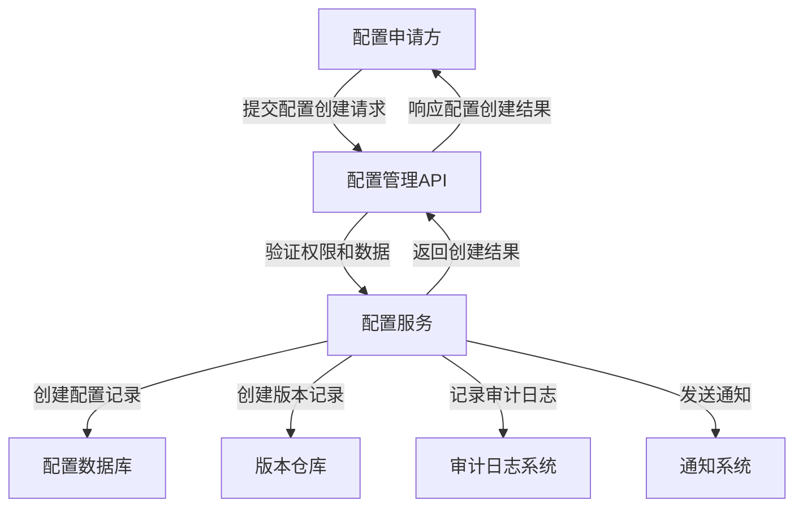
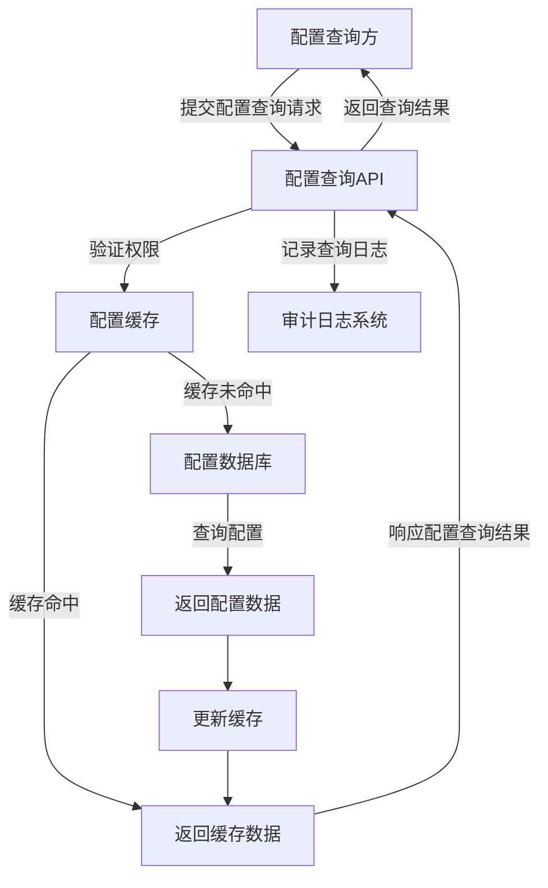
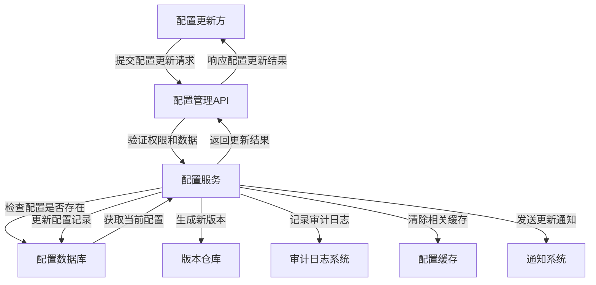
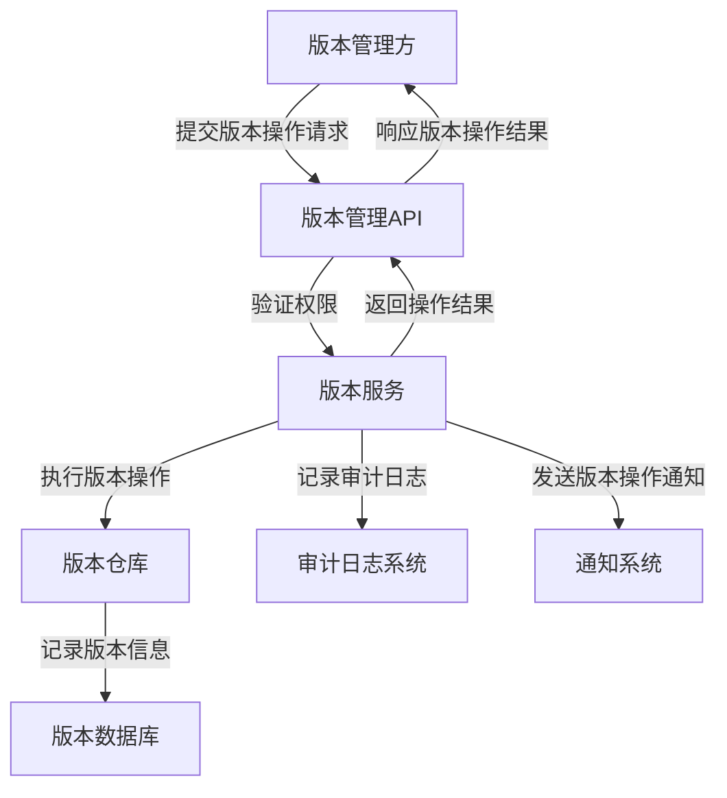
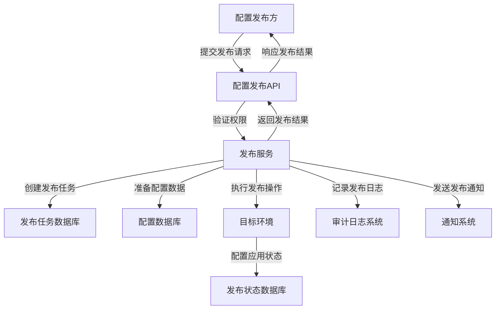

# GMP系统配置管理模块数据流和接口定义

## 文档信息
- **文档版本**: v1.0
- **创建日期**: 2025-11-21
- **最后更新**: 2025-11-21
- **作者**: 系统架构师
- **审核人**: GMP合规专家

## 目录
1. [概述](#概述)
2. [设计原则](#设计原则)
3. [数据流类型](#数据流类型)
4. [接口分类](#接口分类)
5. [数据流架构](#数据流架构)
6. [外部系统集成](#外部系统集成)
7. [接口安全要求](#接口安全要求)
8. [数据格式定义](#数据格式定义)

---

## 概述

本文档详细描述GMP系统配置管理模块的数据流和接口定义，包括各类数据的流动方式、接口的功能规范、安全要求等。配置管理模块作为GMP系统的核心组件，负责管理所有子系统的配置信息，确保配置的一致性、可靠性和合规性。

## 设计原则

### 1. 安全性优先
- 所有数据传输采用加密协议
- 严格的访问控制和权限验证
- 完整的操作审计日志
- 敏感配置信息加密存储

### 2. 可扩展性
- 标准化的接口设计
- 模块化的数据流设计
- 支持水平扩展的架构
- 灵活的数据模型

### 3. 可靠性
- 数据完整性校验
- 故障恢复机制
- 数据备份与恢复
- 版本控制和回滚能力

### 4. 性能优化
- 数据缓存机制
- 高效的数据检索
- 批量操作支持
- 异步处理模式

### 5. GMP合规性
- 满足数据完整性要求
- 支持电子记录和电子签名
- 完整的审计追踪
- 符合21 CFR Part 11规范

## 数据流类型

### 1. 配置数据
- **定义**: 系统和业务运行所需的各类参数和设置
- **特点**: 结构化、频繁访问、需要版本控制
- **示例**: 系统参数、业务规则、阈值配置、路径配置等

### 2. 配置元数据
- **定义**: 描述配置本身的数据
- **特点**: 结构化、静态
- **示例**: 配置名称、描述、数据类型、创建时间、创建人等

### 3. 操作日志数据
- **定义**: 记录配置操作的详细信息
- **特点**: 不可修改、时序性、需要长期保存
- **示例**: 操作类型、操作人、操作时间、操作内容、IP地址等

### 4. 审计数据
- **定义**: 用于合规审计的配置相关数据
- **特点**: 不可篡改、完整性要求高
- **示例**: 配置变更记录、访问记录、审批记录等

### 5. 版本数据
- **定义**: 配置的历史版本信息
- **特点**: 关联关系、可追溯性
- **示例**: 版本号、版本内容、变更摘要、创建时间等

## 接口分类

### 1. 配置管理接口
- **功能**: 提供配置的CRUD操作
- **调用方**: 内部子系统、管理界面、配置工具
- **安全性**: 需要认证和授权
- **示例**: 创建配置、查询配置、更新配置、删除配置等

### 2. 配置查询接口
- **功能**: 提供配置的查询和获取功能
- **调用方**: 所有子系统、客户端应用
- **安全性**: 部分接口可能需要认证
- **示例**: 按ID查询配置、按类型查询配置、批量查询配置等

### 3. 配置版本管理接口
- **功能**: 管理配置的版本信息
- **调用方**: 配置管理工具、审计系统
- **安全性**: 需要高级权限
- **示例**: 创建版本、查询版本历史、回滚版本等

### 4. 配置发布接口
- **功能**: 管理配置的发布和部署
- **调用方**: 配置部署工具、CI/CD系统
- **安全性**: 需要发布权限
- **示例**: 创建发布任务、执行发布、查询发布状态等

### 5. 审计和监控接口
- **功能**: 提供审计日志和监控数据
- **调用方**: 审计系统、监控系统
- **安全性**: 需要审计权限
- **示例**: 查询操作日志、查询访问统计、导出审计报告等

### 6. 通知接口
- **功能**: 发送配置变更和状态通知
- **调用方**: 配置管理系统
- **接收方**: 通知服务、消息队列
- **安全性**: 系统内部接口，需要认证
- **示例**: 配置变更通知、审批通知等

## 数据流架构

### 1. 核心数据流

#### 1.1 配置创建数据流


**数据格式定义**:
- **配置创建请求**:
```json
{
  "name": "string",           // 配置名称
  "key": "string",           // 配置键
  "value": "any",            // 配置值
  "description": "string",    // 配置描述
  "type": "string",          // 数据类型 (string, number, boolean, json等)
  "module": "string",        // 所属模块
  "environment": "string",   // 环境 (dev, test, prod)
  "sensitive": false,         // 是否敏感配置
  "owner": "string",         // 负责人
  "tags": ["string"]         // 标签列表
}
```

- **配置创建响应**:
```json
{
  "success": true,
  "data": {
    "id": "string",          // 配置ID
    "name": "string",        // 配置名称
    "key": "string",         // 配置键
    "value": "any",          // 配置值
    "createdAt": "timestamp", // 创建时间
    "createdBy": "string",    // 创建人
    "version": 1              // 初始版本号
  },
  "message": "配置创建成功"
}
```

#### 1.2 配置查询数据流


**数据格式定义**:
- **配置查询请求**:
```json
{
  "query": {
    "id": "string",          // 可选，配置ID
    "key": "string",         // 可选，配置键
    "module": "string",      // 可选，所属模块
    "environment": "string", // 可选，环境
    "tags": ["string"]       // 可选，标签
  },
  "pagination": {
    "page": 1,
    "pageSize": 10
  }
}
```

- **配置查询响应**:
```json
{
  "success": true,
  "data": {
    "total": 100,
    "items": [
      {
        "id": "string",          // 配置ID
        "name": "string",        // 配置名称
        "key": "string",         // 配置键
        "value": "any",          // 配置值
        "description": "string",  // 配置描述
        "type": "string",        // 数据类型
        "module": "string",      // 所属模块
        "environment": "string", // 环境
        "version": 1,             // 当前版本
        "lastModifiedAt": "timestamp", // 最后修改时间
        "lastModifiedBy": "string"     // 最后修改人
      }
      // 更多配置项...
    ]
  }
}
```

#### 1.3 配置更新数据流


**数据格式定义**:
- **配置更新请求**:
```json
{
  "id": "string",            // 配置ID
  "value": "any",            // 新的配置值
  "description": "string",   // 可选，更新描述
  "reason": "string",        // 更新原因
  "version": 1                // 当前版本号，用于乐观锁
}
```

- **配置更新响应**:
```json
{
  "success": true,
  "data": {
    "id": "string",           // 配置ID
    "name": "string",         // 配置名称
    "key": "string",          // 配置键
    "value": "any",           // 新的配置值
    "version": 2,              // 更新后的版本号
    "lastModifiedAt": "timestamp", // 最后修改时间
    "lastModifiedBy": "string"     // 最后修改人
  },
  "message": "配置更新成功"
}
```

#### 1.4 版本管理数据流


**数据格式定义**:
- **版本回滚请求**:
```json
{
  "configId": "string",      // 配置ID
  "targetVersion": 1,         // 目标版本号
  "reason": "string",        // 回滚原因
  "currentVersion": 3         // 当前版本号
}
```

- **版本回滚响应**:
```json
{
  "success": true,
  "data": {
    "configId": "string",     // 配置ID
    "previousVersion": 3,      // 回滚前版本
    "targetVersion": 1,        // 回滚到的版本
    "newVersion": 4,           // 新生成的版本号
    "rolledBackAt": "timestamp", // 回滚时间
    "rolledBackBy": "string"     // 回滚操作人
  },
  "message": "配置版本回滚成功"
}
```

#### 1.5 配置发布数据流


**数据格式定义**:
- **配置发布请求**:
```json
{
  "name": "string",            // 发布任务名称
  "description": "string",      // 发布描述
  "sourceEnvironment": "dev",  // 源环境
  "targetEnvironment": "prod", // 目标环境
  "configIds": ["string"],      // 待发布的配置ID列表
  "scheduledTime": "timestamp", // 可选，计划发布时间
  "autoRollback": true          // 可选，失败是否自动回滚
}
```

- **配置发布响应**:
```json
{
  "success": true,
  "data": {
    "releaseId": "string",        // 发布任务ID
    "name": "string",             // 发布任务名称
    "status": "created",          // 发布状态
    "sourceEnvironment": "dev",   // 源环境
    "targetEnvironment": "prod",  // 目标环境
    "createdAt": "timestamp",     // 创建时间
    "createdBy": "string"         // 创建人
  },
  "message": "发布任务创建成功"
}
```

## 外部系统集成

### 1. 与HR系统集成

#### 1.1 集成目的
- 获取用户组织架构信息
- 同步用户身份信息
- 获取用户角色和权限信息

#### 1.2 数据交换内容
- 用户基本信息（ID、姓名、部门、职位等）
- 用户角色和权限数据
- 组织架构数据

#### 1.3 接口定义
- **获取用户信息接口**:
  - URL: `/api/external/hr/user/{userId}`
  - 方法: GET
  - 认证方式: OAuth2.0
  - 响应格式: JSON

- **同步组织架构接口**:
  - URL: `/api/external/hr/organization`
  - 方法: POST
  - 认证方式: OAuth2.0
  - 请求/响应格式: JSON

### 2. 与审计系统集成

#### 2.1 集成目的
- 向审计系统提供配置操作日志
- 接收审计系统的审计请求
- 提供审计报告数据

#### 2.2 数据交换内容
- 配置操作审计日志
- 配置访问日志
- 审计查询结果

#### 2.3 接口定义
- **日志推送接口**:
  - URL: `/api/external/audit/logs`
  - 方法: POST
  - 认证方式: API Key
  - 请求格式: JSON Array

- **审计查询接口**:
  - URL: `/api/external/audit/query`
  - 方法: POST
  - 认证方式: API Key
  - 请求/响应格式: JSON

### 3. 与监控告警系统集成

#### 3.1 集成目的
- 提供配置状态监控数据
- 接收配置相关告警
- 同步系统健康状态

#### 3.2 数据交换内容
- 配置访问统计数据
- 配置变更频率数据
- 系统性能指标

#### 3.3 接口定义
- **监控数据推送接口**:
  - URL: `/api/external/monitoring/metrics`
  - 方法: POST
  - 认证方式: Token
  - 请求格式: JSON

- **告警接收接口**:
  - URL: `/api/external/monitoring/alerts`
  - 方法: POST
  - 认证方式: Token
  - 请求格式: JSON

### 4. 与CI/CD系统集成

#### 4.1 集成目的
- 支持配置在CI/CD流程中的自动化部署
- 与代码版本管理协同工作
- 实现配置和应用的同步发布

#### 4.2 数据交换内容
- 配置发布任务
- 配置变更通知
- 部署状态反馈

#### 4.3 接口定义
- **自动发布接口**:
  - URL: `/api/external/cicd/release`
  - 方法: POST
  - 认证方式: OAuth2.0
  - 请求/响应格式: JSON

- **部署状态查询接口**:
  - URL: `/api/external/cicd/status/{releaseId}`
  - 方法: GET
  - 认证方式: OAuth2.0
  - 响应格式: JSON

## 接口安全要求

### 1. 认证要求
- 所有接口必须实现认证机制
- 支持多种认证方式：OAuth 2.0、JWT、API Key等
- 认证信息必须加密传输
- 定期轮换认证凭证

### 2. 授权要求
- 基于角色的访问控制（RBAC）
- 细粒度的权限设计
- 权限检查必须在服务端进行
- 支持权限的动态更新

### 3. 传输安全
- 所有API调用必须使用HTTPS
- 采用TLS 1.2或更高版本
- 禁用不安全的加密套件
- 证书定期更新

### 4. 数据安全
- 敏感配置数据传输和存储必须加密
- 实现数据脱敏机制
- 防止SQL注入、XSS等常见攻击
- 输入数据严格验证

### 5. 访问控制
- 实现IP白名单机制
- 支持访问频率限制
- 防止暴力破解攻击
- 异常访问行为检测

### 6. 审计要求
- 记录所有API访问日志
- 包含操作人、操作时间、操作内容、IP地址等信息
- 日志数据不可篡改
- 支持日志查询和分析

## 数据格式定义

### 1. 配置对象格式
```json
{
  "id": "string",                // 配置唯一标识符
  "name": "string",              // 配置名称
  "key": "string",               // 配置键，通常是分层结构，如system.database.url
  "value": "any",                // 配置值，可以是字符串、数字、布尔值、JSON对象等
  "description": "string",        // 配置描述
  "type": "string",              // 数据类型：string, number, boolean, json, array等
  "module": "string",            // 所属模块，如auth, user, workflow等
  "environment": "string",       // 环境：dev, test, staging, prod
  "sensitive": false,             // 是否敏感配置，敏感配置需要加密存储和特殊权限查看
  "required": false,              // 是否必填配置
  "defaultValue": "any",         // 默认值
  "validationRule": "string",    // 验证规则，如正则表达式
  "tags": ["string"],            // 标签，用于分类和搜索
  "owner": "string",             // 负责人
  "createdAt": "timestamp",      // 创建时间
  "createdBy": "string",         // 创建人
  "lastModifiedAt": "timestamp", // 最后修改时间
  "lastModifiedBy": "string",    // 最后修改人
  "version": 1,                   // 当前版本号
  "status": "active",            // 状态：active, inactive, deprecated
  "accessControl": {
    "readRoles": ["string"],     // 可读角色列表
    "writeRoles": ["string"],    // 可写角色列表
    "adminRoles": ["string"]     // 管理角色列表
  }
}
```

### 2. 配置版本格式
```json
{
  "id": "string",                // 版本ID
  "configId": "string",          // 关联的配置ID
  "version": 1,                   // 版本号
  "value": "any",                // 该版本的配置值
  "changeSummary": "string",     // 变更摘要
  "changeType": "string",        // 变更类型：create, update, delete
  "createdAt": "timestamp",      // 创建时间
  "createdBy": "string",         // 创建人
  "previousVersionId": "string", // 前一个版本ID，用于构建版本链
  "metadata": {
    "requestId": "string",       // 关联的请求ID
    "clientIp": "string",        // 客户端IP
    "userAgent": "string",       // 用户代理
    "reason": "string"           // 变更原因
  }
}
```

### 3. 操作日志格式
```json
{
  "id": "string",                // 日志ID
  "operation": "string",         // 操作类型：create, read, update, delete, approve等
  "resourceType": "string",      // 资源类型：config, version, release等
  "resourceId": "string",        // 资源ID
  "userId": "string",            // 操作用户ID
  "userName": "string",          // 操作用户名称
  "clientIp": "string",          // 客户端IP
  "userAgent": "string",         // 用户代理
  "requestId": "string",         // 请求ID
  "requestParams": {},            // 请求参数
  "requestBody": {},              // 请求体
  "responseCode": 200,            // 响应代码
  "responseBody": {},             // 响应体
  "success": true,                // 操作是否成功
  "errorMessage": "string",       // 错误信息（如果有）
  "timestamp": "timestamp"       // 操作时间
}
```

### 4. 配置发布任务格式
```json
{
  "id": "string",                // 发布任务ID
  "name": "string",              // 任务名称
  "description": "string",        // 任务描述
  "sourceEnvironment": "string", // 源环境
  "targetEnvironment": "string", // 目标环境
  "configIds": ["string"],       // 待发布的配置ID列表
  "createdBy": "string",         // 创建人
  "createdAt": "timestamp",      // 创建时间
  "scheduledTime": "timestamp",  // 计划执行时间
  "actualTime": "timestamp",     // 实际执行时间
  "completedTime": "timestamp",  // 完成时间
  "status": "string",            // 状态：created, scheduled, running, completed, failed, rolledback
  "result": {
    "successCount": 10,           // 成功数量
    "failedCount": 0,             // 失败数量
    "errors": []                  // 错误详情
  },
  "autoRollback": true,           // 是否自动回滚
  "rollbackReason": "string",    // 回滚原因（如果有）
  "approvalInfo": {
    "required": true,
    "approved": true,
    "approvedBy": "string",
    "approvedAt": "timestamp"
  }
}
```

### 5. 审计报告格式
```json
{
  "id": "string",                // 报告ID
  "name": "string",              // 报告名称
  "description": "string",        // 报告描述
  "startDate": "timestamp",      // 审计开始时间
  "endDate": "timestamp",        // 审计结束时间
  "generatedBy": "string",       // 生成人
  "generatedAt": "timestamp",    // 生成时间
  "summary": {
    "totalConfigs": 100,          // 总配置数
    "totalChanges": 20,           // 总变更数
    "totalUsers": 10,             // 涉及用户数
    "criticalIssues": 0,          // 严重问题数
    "warnings": 2                 // 警告数
  },
  "details": {
    "configChanges": [],          // 配置变更详情
    "accessPatterns": [],         // 访问模式分析
    "complianceChecks": [],       // 合规检查结果
    "anomalies": []               // 异常情况
  },
  "recommendations": ["string"]  // 改进建议
}
```