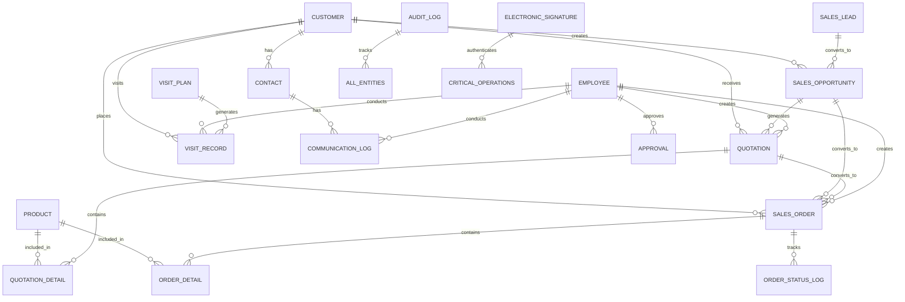

# CRM销售子系统详细需求文档

## 1. 文档概述

### 1.1 文档目的
本文档详细描述GMP医药企业CRM销售子系统的功能需求、非功能需求、数据需求、集成需求、验收标准和风险评估，作为系统设计、开发和测试的依据，确保系统满足GMP合规性要求和业务需求。

### 1.2 术语定义

| 术语 | 解释 |
|------|------|
| CRM | 客户关系管理(Customer Relationship Management)，指企业用于管理与客户之间关系的系统 |
| GMP | 药品生产质量管理规范(Good Manufacturing Practice)，确保药品质量的法规要求 |
| ERP | 企业资源计划(Enterprise Resource Planning)，整合企业所有资源的管理系统 |
| MES | 制造执行系统(Manufacturing Execution System)，用于监控和控制生产过程 |
| QMS | 质量管理系统(Quality Management System)，用于确保产品质量的管理系统 |
| 客户主数据 | 记录客户基本信息、资质、分类等核心数据的统一数据集合 |
| 拜访记录 | 销售人员对客户的实地访问记录，包含访问内容、达成的共识和后续计划 |
| 销售线索 | 潜在的销售机会，尚未转化为正式客户的销售对象 |
| 销售报价 | 向客户提供的产品或服务价格方案 |
| 销售订单 | 客户正式确认的购买请求，包含产品、数量、价格等信息 |
| 电子签名 | 符合GMP要求的数字签名，用于确认操作的真实性和完整性 |
| 审计跟踪 | 系统记录的所有关键操作的详细日志，用于合规审计 |

## 2. 功能需求

### 2.1 客户管理模块

#### 2.1.1 客户主数据管理

| 功能点 | 用户故事/缘由说明 | 输入/输出/流程 | 详细说明 | 验收标准 | 优先级 |
|--------|-------------------|----------------|----------|----------|--------|
| **客户信息创建** | 作为销售管理员，我希望创建新客户记录，以便系统中维护完整的客户信息 | 输入：客户基本信息、联系人信息、资质信息 输出：客户创建成功确认 流程：填写信息→数据验证→创建客户→发送通知 | 1. 支持创建个人客户和企业客户 2. 客户名称、联系人、联系方式为必填项 3. 创建时自动生成客户编码 4. 需电子签名确认 5. 自动记录操作日志 | 1. 成功创建客户并生成唯一编码 2. 必填字段验证有效 3. 操作日志完整记录 4. 电子签名功能正常 | 高 |
| **客户信息编辑** | 作为销售管理员，我希望修改客户信息，以保证客户数据的准确性 | 输入：需要修改的字段值 输出：客户信息更新确认 流程：查询客户→修改信息→数据验证→更新客户→审计记录 | 1. 支持修改除客户编码外的所有字段 2. 敏感信息修改需审批 3. 修改操作需电子签名 4. 自动记录变更历史 | 1. 成功修改客户信息 2. 变更历史完整记录 3. 敏感信息修改有审批记录 4. 电子签名功能正常 | 高 |
| **客户信息查询** | 作为销售经理，我希望按多种条件查询客户，以便快速找到目标客户 | 输入：查询条件(客户名称、编码、联系人等) 输出：符合条件的客户列表 流程：输入条件→执行查询→显示结果→可进一步筛选排序 | 1. 支持按关键字模糊查询 2. 支持多条件组合查询 3. 查询结果可分页、排序 4. 支持保存常用查询条件 | 1. 查询结果准确 2. 支持所有指定查询条件 3. 分页和排序功能正常 | 高 |
| **客户资质管理** | 作为销售合规员，我希望管理客户的资质文件，以确保客户满足销售合规要求 | 输入：资质文件、有效期、审核状态 输出：资质管理确认 流程：上传资质→审核→记录有效期→到期提醒 | 1. 支持上传各类资质文件(PDF、图片等) 2. 设置资质有效期和提醒时间 3. 资质审核流程管理 4. 资质到期自动提醒 | 1. 资质文件上传成功 2. 有效期设置有效 3. 到期提醒功能正常 4. 审核流程完整记录 | 高 |
| **客户分类与标签** | 作为销售经理，我希望对客户进行分类和打标签，以便更好地管理和分析客户 | 输入：客户分类、标签信息 输出：分类/标签设置确认 流程：选择客户→设置分类/标签→保存 | 1. 支持多级客户分类 2. 自定义客户标签 3. 按分类/标签统计和筛选客户 | 1. 成功设置客户分类和标签 2. 可按分类/标签筛选客户 3. 统计功能准确 | 中 |
| **客户禁用/启用** | 作为销售管理员，我希望禁用/启用客户账户，以便管理不再合作的客户 | 输入：操作类型(禁用/启用) 输出：操作成功确认 流程：选择客户→执行操作→确认→更新状态 | 1. 禁用后客户不能进行新的交易 2. 禁用原因需记录 3. 禁用客户数据保留可查询 4. 可重新启用已禁用客户 | 1. 禁用后客户状态正确更新 2. 禁用客户交易功能受限 3. 禁用原因完整记录 | 中 |

#### 2.1.2 联系人管理

| 功能点 | 用户故事/缘由说明 | 输入/输出/流程 | 详细说明 | 验收标准 | 优先级 |
|--------|-------------------|----------------|----------|----------|--------|
| **联系人信息管理** | 作为销售人员，我希望管理客户联系人信息，以便保持有效的客户沟通 | 输入：联系人基本信息、联系方式 输出：联系人管理确认 流程：添加/修改联系人→保存→关联客户 | 1. 支持为客户添加多个联系人 2. 设置联系人角色和优先级 3. 联系人信息变更记录 4. 支持联系人快速搜索 | 1. 成功添加/修改联系人 2. 联系人与客户正确关联 3. 变更记录完整 | 高 |
| **联系人沟通记录** | 作为销售人员，我希望记录与联系人的沟通内容，以便跟踪客户关系进展 | 输入：沟通日期、方式、内容、下次跟进计划 输出：沟通记录保存确认 流程：选择联系人→记录沟通内容→保存→设置跟进 | 1. 记录电话、邮件、会议等沟通方式 2. 支持添加附件 3. 设置下次沟通提醒 4. 沟通记录可查询统计 | 1. 沟通记录保存成功 2. 提醒功能正常 3. 查询统计准确 | 高 |
| **联系人分组管理** | 作为销售经理，我希望对联系人进行分组，以便进行精准营销和沟通 | 输入：分组名称、联系人成员 输出：分组管理确认 流程：创建分组→添加联系人→保存 | 1. 支持自定义联系人分组 2. 联系人可属于多个分组 3. 按分组发送通知或邮件 | 1. 成功创建联系人分组 2. 联系人正确分组 3. 通知发送功能正常 | 中 |

### 2.2 销售机会管理模块

#### 2.2.1 销售线索管理

| 功能点 | 用户故事/缘由说明 | 输入/输出/流程 | 详细说明 | 验收标准 | 优先级 |
|--------|-------------------|----------------|----------|----------|--------|
| **销售线索录入** | 作为销售人员，我希望录入新的销售线索，以便及时跟踪潜在客户 | 输入：线索来源、联系人信息、需求描述 输出：线索创建成功确认 流程：填写线索信息→保存→分配跟进人 | 1. 支持手动录入和批量导入 2. 记录线索来源和评级 3. 线索自动或手动分配 4. 新线索自动提醒 | 1. 线索录入成功 2. 分配功能正常 3. 提醒功能有效 | 高 |
| **线索跟踪与转化** | 作为销售人员，我希望跟踪线索状态并促进转化，以提高销售成功率 | 输入：跟踪内容、状态更新、转化决策 输出：跟踪记录/转化确认 流程：查看线索→更新状态→记录跟进→转化为客户/商机 | 1. 记录每次线索跟进活动 2. 设置线索状态(新建、跟进中、已转化、已放弃) 3. 线索转化为客户或商机 4. 转化过程完整记录 | 1. 跟踪记录保存成功 2. 状态更新正确 3. 转化流程完整 | 高 |
| **线索分析与报表** | 作为销售经理，我希望分析线索数据，以便优化销售策略 | 输入：分析条件、时间范围 输出：线索分析报表 流程：选择分析维度→生成报表→数据可视化 | 1. 线索来源分析 2. 转化率分析 3. 线索质量评估 4. 生成趋势图表 | 1. 分析数据准确 2. 报表生成正常 3. 可视化展示清晰 | 中 |

#### 2.2.2 商机管理

| 功能点 | 用户故事/缘由说明 | 输入/输出/流程 | 详细说明 | 验收标准 | 优先级 |
|--------|-------------------|----------------|----------|----------|--------|
| **商机创建与管理** | 作为销售人员，我希望创建和管理销售商机，以便有序推进销售流程 | 输入：商机名称、关联客户、产品、预计金额、销售阶段 输出：商机创建/更新确认 流程：填写商机信息→保存→设定销售阶段 | 1. 支持从线索转化或直接创建 2. 记录预计成交时间和金额 3. 设置销售阶段和赢率 4. 关联销售团队成员 | 1. 商机创建成功 2. 销售阶段正确设置 3. 关联关系准确 | 高 |
| **商机阶段管理** | 作为销售人员，我希望管理商机的销售阶段，以便清晰了解销售进度 | 输入：销售阶段变更、阶段达成条件 输出：阶段变更确认 流程：更新商机阶段→填写阶段详情→保存 | 1. 自定义销售阶段流程 2. 阶段变更需填写关键活动 3. 阶段停滞自动提醒 4. 阶段变更记录审计 | 1. 阶段变更记录完整 2. 提醒功能正常 3. 审计记录完整 | 高 |
| **商机协作与提醒** | 作为销售团队成员，我希望与团队协作跟进商机并接收提醒，以确保商机及时跟进 | 输入：协作任务分配、提醒设置 输出：任务分配/提醒通知 流程：分配任务→设置提醒→执行任务→更新状态 | 1. 商机任务分配与跟踪 2. 设置重要节点提醒 3. 团队协作沟通记录 4. 商机风险预警 | 1. 任务分配成功 2. 提醒功能正常 3. 协作记录完整 | 中 |
| **商机预测分析** | 作为销售经理，我希望预测销售机会和收入，以便制定销售目标和资源分配 | 输入：预测参数、历史数据 输出：销售预测报表 流程：选择预测模型→输入参数→生成预测→分析结果 | 1. 基于历史数据的销售预测 2. 多维度预测分析 3. 预测准确度评估 4. 预测结果可视化 | 1. 预测结果合理 2. 分析维度完整 3. 可视化展示清晰 | 高 |

### 2.3 销售报价与订单模块

#### 2.3.1 销售报价管理

| 功能点 | 用户故事/缘由说明 | 输入/输出/流程 | 详细说明 | 验收标准 | 优先级 |
|--------|-------------------|----------------|----------|----------|--------|
| **报价单创建** | 作为销售人员，我希望创建销售报价单，以便向客户提供产品价格方案 | 输入：客户信息、产品列表、价格、有效期 输出：报价单创建确认 流程：选择客户→添加产品→设置价格→生成报价单→提交审批 | 1. 支持从产品库选择产品 2. 自动计算总价和折扣 3. 设置报价有效期 4. 报价单版本管理 | 1. 报价单创建成功 2. 计算准确 3. 版本管理正常 | 高 |
| **报价单审批** | 作为销售经理，我希望审批报价单，以确保价格政策执行和授权管理 | 输入：审批意见、审批决策 输出：审批结果 流程：提交审批→审批人审核→同意/驳回→通知结果 | 1. 多级审批流程配置 2. 审批超时提醒 3. 审批历史完整记录 4. 审批意见可添加附件 | 1. 审批流程正常执行 2. 提醒功能有效 3. 历史记录完整 | 高 |
| **报价单发送与跟踪** | 作为销售人员，我希望发送报价单并跟踪客户反馈，以便促进成交 | 输入：发送方式、客户邮箱 输出：发送确认、反馈记录 流程：发送报价→客户查看→记录反馈→跟踪状态 | 1. 支持邮件、PDF等多种发送方式 2. 记录客户查看状态 3. 跟踪报价有效期 4. 客户反馈记录 | 1. 发送功能正常 2. 查看状态准确 3. 反馈记录完整 | 高 |
| **报价分析** | 作为销售经理，我希望分析报价数据，以便优化报价策略 | 输入：分析条件、时间范围 输出：报价分析报表 流程：选择分析维度→生成报表→数据可视化 | 1. 报价转化率分析 2. 价格敏感度分析 3. 报价历史对比 4. 生成趋势图表 | 1. 分析数据准确 2. 报表生成正常 3. 可视化展示清晰 | 中 |

#### 2.3.2 销售订单管理

| 功能点 | 用户故事/缘由说明 | 输入/输出/流程 | 详细说明 | 验收标准 | 优先级 |
|--------|-------------------|----------------|----------|----------|--------|
| **订单创建** | 作为销售人员，我希望创建销售订单，以便正式记录客户购买请求 | 输入：客户信息、产品列表、数量、价格、交付信息 输出：订单创建确认 流程：选择客户→添加产品→设置数量价格→确认订单→提交审批 | 1. 支持从报价单转化或直接创建 2. 产品信息自动验证 3. 价格策略应用 4. 订单编码自动生成 | 1. 订单创建成功 2. 信息验证有效 3. 编码生成正常 | 高 |
| **订单审批** | 作为销售经理，我希望审批销售订单，以确保订单合规性和授权管理 | 输入：审批意见、审批决策 输出：审批结果 流程：提交审批→审批人审核→同意/驳回→通知结果 | 1. 基于订单金额的多级审批 2. 异常订单特殊审批 3. 审批历史完整记录 4. 审批超时提醒 | 1. 审批流程正常执行 2. 异常订单处理正确 3. 历史记录完整 | 高 |
| **订单执行与跟踪** | 作为销售人员，我希望跟踪订单执行状态，以便及时了解订单进展 | 输入：订单状态更新、执行信息 输出：执行状态更新确认 流程：订单确认→生产/发货→签收→结算→完成 | 1. 订单状态实时更新 2. 关键节点自动通知 3. 订单异常预警 4. 执行历史完整记录 | 1. 状态更新及时准确 2. 通知功能正常 3. 预警有效 | 高 |
| **订单变更与取消** | 作为销售人员，我希望处理订单变更和取消请求，以应对客户需求变化 | 输入：变更内容、取消原因 输出：变更/取消确认 流程：提交变更/取消→审批→执行变更→通知相关方 | 1. 订单变更流程管理 2. 变更影响评估 3. 取消原因记录 4. 变更历史完整保存 | 1. 变更流程正常执行 2. 影响评估准确 3. 历史记录完整 | 高 |
| **订单分析报表** | 作为销售经理，我希望分析订单数据，以便了解销售业绩和客户购买模式 | 输入：分析条件、时间范围 输出：订单分析报表 流程：选择分析维度→生成报表→数据可视化 | 1. 销售业绩分析 2. 产品销售分析 3. 客户购买分析 4. 销售趋势预测 | 1. 分析数据准确 2. 报表生成正常 3. 可视化展示清晰 | 中 |

### 2.4 销售拜访与活动模块

#### 2.4.1 拜访计划管理

| 功能点 | 用户故事/缘由说明 | 输入/输出/流程 | 详细说明 | 验收标准 | 优先级 |
|--------|-------------------|----------------|----------|----------|--------|
| **拜访计划创建** | 作为销售人员，我希望创建客户拜访计划，以便有序安排销售活动 | 输入：拜访客户、日期时间、目的、参与人员 输出：拜访计划创建确认 流程：选择客户→设置时间→填写目的→安排人员→保存 | 1. 支持单客户和多客户拜访计划 2. 与日历系统集成 3. 自动冲突检测 4. 拜访计划审批 | 1. 计划创建成功 2. 日历集成正常 3. 冲突检测有效 | 高 |
| **拜访路线优化** | 作为销售人员，我希望优化拜访路线，以提高拜访效率 | 输入：多个拜访地点 输出：优化路线建议 流程：选择多个客户→生成路线→调整→确认 | 1. 基于地理位置的路线规划 2. 考虑交通和时间因素 3. 支持手动调整优化 | 1. 路线规划合理 2. 优化建议有效 | 中 |
| **拜访提醒与通知** | 作为销售人员，我希望接收拜访提醒，以确保按时进行客户拜访 | 输入：提醒设置 输出：提醒通知 流程：设置提醒→到达时间→发送提醒→确认 | 1. 拜访前多级提醒 2. 支持多种提醒方式 3. 提前准备建议 | 1. 提醒及时发送 2. 多种方式有效 | 高 |

#### 2.4.2 拜访记录管理

| 功能点 | 用户故事/缘由说明 | 输入/输出/流程 | 详细说明 | 验收标准 | 优先级 |
|--------|-------------------|----------------|----------|----------|--------|
| **拜访记录录入** | 作为销售人员，我希望记录拜访内容，以便跟踪客户关系维护情况 | 输入：拜访日期、客户、联系人、沟通内容、后续计划 输出：拜访记录保存确认 流程：填写拜访信息→添加附件→保存→设置后续行动 | 1. 支持移动端现场录入 2. 记录关键沟通内容 3. 设置后续跟进计划 4. 支持添加照片和附件 | 1. 记录保存成功 2. 移动端功能正常 3. 附件上传有效 | 高 |
| **拜访定位签到** | 作为销售人员，我希望进行拜访签到，以记录真实的拜访地点和时间 | 输入：地理位置信息 输出：签到确认 流程：到达客户地点→签到→上传位置→记录 | 1. 基于GPS的位置签到 2. 签到时间地点记录 3. 异常签到提示 4. 签到记录审计 | 1. 签到功能正常 2. 位置记录准确 3. 审计记录完整 | 高 |
| **拜访效果评估** | 作为销售经理，我希望评估拜访效果，以便改进销售活动 | 输入：评估指标、评分 输出：效果评估报告 流程：填写评估→提交→统计分析 | 1. 自定义评估指标 2. 拜访满意度评分 3. 拜访问题记录 4. 效果趋势分析 | 1. 评估功能正常 2. 统计分析准确 | 中 |

### 2.5 合规管理模块

#### 2.5.1 GMP合规控制

| 功能点 | 用户故事/缘由说明 | 输入/输出/流程 | 详细说明 | 验收标准 | 优先级 |
|--------|-------------------|----------------|----------|----------|--------|
| **销售流程合规检查** | 作为合规管理员，我希望确保销售流程符合GMP要求，以避免合规风险 | 输入：流程检查规则 输出：合规检查结果 流程：定义规则→执行检查→提示异常→整改跟踪 | 1. 销售记录完整性检查 2. 审批流程合规性检查 3. 电子签名有效性检查 4. 异常流程告警 | 1. 检查功能正常 2. 异常提示准确 3. 整改跟踪有效 | 高 |
| **客户资质合规性** | 作为合规管理员，我希望验证客户资质的合规性，以确保销售给合格客户 | 输入：资质审核标准、客户资质信息 输出：合规性评估结果 流程：定义标准→收集资质→审核评估→更新状态 | 1. 客户资质自动审核 2. 资质过期预警 3. 不合规客户限制 4. 资质审核记录 | 1. 审核结果准确 2. 预警功能正常 3. 限制措施有效 | 高 |
| **销售文档合规性** | 作为合规管理员，我希望确保销售文档符合GMP要求，以支持审计和追溯 | 输入：文档模板、文档内容 输出：合规性检查结果 流程：使用模板→填写内容→合规检查→电子签名 | 1. 标准文档模板管理 2. 文档内容合规检查 3. 电子签名验证 4. 文档版本控制 | 1. 模板管理正常 2. 检查功能有效 3. 签名验证准确 | 高 |

#### 2.5.2 审计跟踪与报告

| 功能点 | 用户故事/缘由说明 | 输入/输出/流程 | 详细说明 | 验收标准 | 优先级 |
|--------|-------------------|----------------|----------|----------|--------|
| **操作日志记录** | 作为系统管理员，我希望记录所有关键操作，以支持合规审计和问题追溯 | 输入：操作信息(用户、时间、操作类型、内容) 输出：审计日志记录 流程：执行操作→自动记录→存储日志→支持查询 | 1. 自动记录所有关键操作 2. 日志内容完整(谁、何时、做什么) 3. 日志不可篡改 4. 支持高级查询和过滤 | 1. 日志记录完整 2. 查询功能正常 3. 数据安全可靠 | 高 |
| **电子签名管理** | 作为合规管理员，我希望管理电子签名，以确保操作授权的真实性和完整性 | 输入：签名配置、签名操作 输出：签名记录确认 流程：签名初始化→签名验证→记录签名→审计跟踪 | 1. 符合GMP要求的电子签名 2. 签名前身份验证 3. 签名原因记录 4. 签名历史查询 | 1. 签名功能正常 2. 验证机制有效 3. 历史记录完整 | 高 |
| **合规报告生成** | 作为合规管理员，我希望生成合规报告，以支持内部审核和外部审计 | 输入：报告参数、时间范围 输出：合规报告 流程：设置参数→生成报告→审核确认→导出 | 1. 多维度合规报告 2. 异常情况统计 3. 合规趋势分析 4. 支持多种格式导出 | 1. 报告生成正常 2. 数据准确 3. 导出功能有效 | 高 |

### 2.6 数据分析与报表模块

#### 2.6.1 销售业绩分析

| 功能点 | 用户故事/缘由说明 | 输入/输出/流程 | 详细说明 | 验收标准 | 优先级 |
|--------|-------------------|----------------|----------|----------|--------|
| **销售业绩统计** | 作为销售经理，我希望查看销售业绩统计，以了解销售情况和完成进度 | 输入：统计维度、时间范围、人员/团队筛选 输出：业绩统计报表 流程：选择维度→设置时间→筛选→生成报表→查看/导出 | 1. 按人员、团队、产品等维度统计 2. 与目标对比分析 3. 历史同期对比 4. 支持多格式导出 | 1. 统计数据准确 2. 维度完整 3. 导出功能正常 | 高 |
| **销售漏斗分析** | 作为销售经理，我希望分析销售漏斗数据，以优化销售流程和资源分配 | 输入：分析维度、时间范围 输出：销售漏斗分析图表 流程：选择维度→设置时间→生成分析→查看趋势 | 1. 各销售阶段转化率 2. 漏斗瓶颈分析 3. 历史对比分析 4. 优化建议 | 1. 分析图表正确 2. 数据准确 3. 建议合理 | 中 |
| **客户价值分析** | 作为销售经理，我希望分析客户价值，以制定差异化客户管理策略 | 输入：分析维度、时间范围 输出：客户价值分析报告 流程：选择维度→设置时间→生成分析→客户分级 | 1. RFM客户价值模型 2. 客户分级管理 3. 客户生命周期分析 4. 价值趋势预测 | 1. 分析结果合理 2. 分级准确 3. 预测有效 | 中 |

#### 2.6.2 自定义报表

| 功能点 | 用户故事/缘由说明 | 输入/输出/流程 | 详细说明 | 验收标准 | 优先级 |
|--------|-------------------|----------------|----------|----------|--------|
| **报表模板定制** | 作为销售分析师，我希望自定义报表模板，以满足特定分析需求 | 输入：报表结构、数据来源、展示方式 输出：自定义报表模板 流程：创建模板→设置字段→定义查询→保存 | 1. 可视化报表设计器 2. 自定义数据查询 3. 灵活的图表类型 4. 模板权限管理 | 1. 模板创建成功 2. 设计器功能正常 3. 权限控制有效 | 中 |
| **报表订阅与分发** | 作为销售经理，我希望订阅报表并自动接收，以便及时获取业务信息 | 输入：订阅设置、分发方式、频率 输出：自动生成并发送的报表 流程：选择报表→设置订阅→确认→自动发送 | 1. 定期自动生成报表 2. 多渠道分发(邮件、系统通知等) 3. 订阅权限控制 4. 分发记录查询 | 1. 自动发送正常 2. 权限控制有效 3. 记录完整 | 中 |

## 3. 非功能需求

### 3.1 性能需求

| 需求点 | 详细说明 | 验收标准 | 优先级 |
|--------|----------|----------|--------|
| **响应时间** | 系统在正常负载下的响应时间需满足： 1. 页面加载时间 < 3秒 2. 简单查询响应时间 < 1秒 3. 复杂报表生成时间 < 10秒 4. 移动端数据同步时间 < 5秒 | 1. 负载测试验证响应时间 2. 95%请求在规定时间内完成 3. 高并发下性能稳定 | 高 |
| **并发处理** | 系统需支持的并发用户数： 1. 正常情况下：200用户 2. 峰值情况下：500用户 3. 支持的每秒事务数(TPS)：100 | 1. 并发测试验证用户承载 2. 峰值负载下系统稳定 3. 无明显性能下降 | 高 |
| **数据处理** | 系统需支持的数据处理能力： 1. 客户数据量：10万+ 2. 订单数据量：50万+ 3. 拜访记录：100万+ 4. 支持批量导入/导出：单次5万条 | 1. 大数据量测试通过 2. 批量操作性能符合要求 3. 查询性能稳定 | 高 |
| **移动端性能** | 移动应用需满足的性能要求： 1. 首屏加载时间 < 5秒 2. 数据同步效率高 3. 支持离线操作和数据缓存 | 1. 移动设备测试验证 2. 离线功能正常 3. 同步效率符合要求 | 高 |

### 3.2 可用性需求

| 需求点 | 详细说明 | 验收标准 | 优先级 |
|--------|----------|----------|--------|
| **系统可用性** | 系统整体可用性要求： 1. 正常运行时间(Uptime)：≥ 99.9% 2. 计划内维护时间：每月不超过4小时，且在非工作时间 3. 故障恢复时间(RTO)：≤ 1小时 | 1. 长期运行监控 2. 故障演练测试 3. 维护窗口记录 | 高 |
| **容错性** | 系统需具备的容错能力： 1. 单点故障不影响整体系统 2. 数据备份和恢复机制 3. 错误处理和友好提示 | 1. 故障注入测试 2. 恢复机制验证 3. 错误处理测试 | 高 |
| **数据可用性** | 数据访问的可用性要求： 1. 数据备份频率：每日全量备份，每小时增量备份 2. 数据恢复点目标(RPO)：≤ 15分钟 3. 数据一致性保障 | 1. 备份恢复测试 2. 数据一致性验证 3. 恢复时间测试 | 高 |

### 3.3 安全性需求

| 需求点 | 详细说明 | 验收标准 | 优先级 |
|--------|----------|----------|--------|
| **身份认证** | 用户身份认证要求： 1. 支持多因素认证 2. 密码策略符合安全要求(复杂度、定期更换) 3. 会话超时管理 4. 登录失败限制和锁定机制 | 1. 认证功能测试 2. 安全策略验证 3. 异常登录测试 | 高 |
| **授权控制** | 系统访问授权要求： 1. 基于角色的访问控制(RBAC) 2. 细粒度权限控制 3. 数据访问权限分离 4. 权限变更审计 | 1. 权限测试用例覆盖 2. 越权测试 3. 审计记录验证 | 高 |
| **数据安全** | 数据安全保护要求： 1. 敏感数据加密存储和传输 2. 数据脱敏展示 3. 数据访问审计 4. 防止SQL注入、XSS等攻击 | 1. 安全测试 2. 渗透测试 3. 加密验证 | 高 |
| **合规性安全** | 满足GMP合规的安全要求： 1. 电子签名功能符合21 CFR Part 11 2. 审计跟踪不可篡改 3. 数据完整性保护 4. 合规性报告生成 | 1. 合规性验证 2. 签名功能测试 3. 审计记录验证 | 高 |

### 3.4 可扩展性需求

| 需求点 | 详细说明 | 验收标准 | 优先级 |
|--------|----------|----------|--------|
| **功能扩展性** | 系统功能扩展要求： 1. 模块化设计，支持功能插件 2. 支持自定义字段和表单 3. 可配置工作流 4. API接口扩展 | 1. 扩展功能测试 2. 集成测试 3. 性能影响评估 | 高 |
| **数据扩展性** | 数据模型和存储扩展要求： 1. 支持大数据量增长 2. 数据分区和分片 3. 灵活的数据结构 4. 历史数据归档策略 | 1. 大数据量测试 2. 性能评估 3. 归档功能测试 | 高 |
| **技术架构扩展性** | 系统架构扩展要求： 1. 微服务架构，支持独立扩展 2. 容器化部署 3. 自动伸缩能力 4. 负载均衡 | 1. 架构评审 2. 扩展测试 3. 性能评估 | 高 |

### 3.5 易用性需求

| 需求点 | 详细说明 | 验收标准 | 优先级 |
|--------|----------|----------|--------|
| **用户界面设计** | 界面设计要求： 1. 符合现代UI/UX设计标准 2. 响应式设计，支持多设备 3. 直观的导航和操作流程 4. 一致的设计语言 | 1. UI评审 2. 用户测试 3. 易用性评估 | 高 |
| **交互体验** | 用户交互体验要求： 1. 操作反馈及时 2. 批量操作支持 3. 快捷键支持 4. 错误提示友好清晰 | 1. 交互测试 2. 用户体验评估 3. 错误处理测试 | 高 |
| **移动端体验** | 移动应用体验要求： 1. 触摸友好的界面 2. 离线操作支持 3. 地理位置服务集成 4. 推送通知 | 1. 移动设备测试 2. 用户体验评估 3. 功能验证 | 高 |

## 4. 数据需求

### 4.1 数据实体关系

#### 4.1.1 核心实体关系图

#### 4.1.2 主要实体描述

| 实体名称 | 描述 | 关键字段 | 关联实体 |
|----------|------|----------|----------|
| **客户(CUSTOMER)** | 企业的客户信息，包括基本信息、资质、分类等 | 客户ID、客户名称、类型、状态、创建时间、更新时间、负责人 | 联系人、销售机会、报价单、销售订单、拜访记录 |
| **联系人(CONTACT)** | 客户的联系人信息 | 联系人ID、客户ID、姓名、职位、电话、邮箱、角色 | 客户、沟通日志 |
| **销售线索(SALES_LEAD)** | 潜在的销售机会 | 线索ID、来源、状态、评级、负责人、创建时间、转化状态 | 销售机会 |
| **销售机会(SALES_OPPORTUNITY)** | 具体的销售机会信息 | 商机ID、客户ID、名称、阶段、赢率、预计金额、负责人 | 客户、报价单、销售订单 |
| **报价单(QUOTATION)** | 向客户提供的价格方案 | 报价单ID、客户ID、状态、金额、有效期、创建人、审批状态 | 客户、报价明细、销售订单 |
| **报价明细(QUOTATION_DETAIL)** | 报价单中的产品明细 | 明细ID、报价单ID、产品ID、数量、单价、折扣 | 报价单、产品 |
| **销售订单(SALES_ORDER)** | 客户的正式购买请求 | 订单ID、客户ID、状态、金额、创建时间、审批状态、负责人 | 客户、订单明细、订单状态日志 |
| **订单明细(ORDER_DETAIL)** | 销售订单中的产品明细 | 明细ID、订单ID、产品ID、数量、单价、交付日期 | 销售订单、产品 |
| **订单状态日志(ORDER_STATUS_LOG)** | 订单状态变更记录 | 日志ID、订单ID、状态、变更时间、变更人、变更原因 | 销售订单 |
| **产品(PRODUCT)** | 销售的产品信息 | 产品ID、名称、编码、规格、描述、价格 | 报价明细、订单明细 |
| **员工(EMPLOYEE)** | 系统用户，包括销售人员、管理人员等 | 员工ID、姓名、职位、部门、联系方式、用户权限 | 拜访记录、沟通日志、报价单、销售订单、审批 |
| **拜访计划(VISIT_PLAN)** | 客户拜访的计划信息 | 计划ID、客户ID、拜访日期、目的、负责人、参与人员 | 拜访记录 |
| **拜访记录(VISIT_RECORD)** | 实际的客户拜访记录 | 记录ID、客户ID、拜访日期、地点、参与人、沟通内容、后续计划 | 客户、员工、拜访计划 |
| **沟通日志(COMMUNICATION_LOG)** | 与客户的沟通记录 | 日志ID、联系人ID、沟通方式、内容、日期、参与人 | 联系人、员工 |
| **审批(APPROVAL)** | 各类审批流程记录 | 审批ID、关联业务ID、类型、状态、审批人、审批时间、意见 | 员工、报价单、销售订单 |
| **审计日志(AUDIT_LOG)** | 系统操作审计记录 | 日志ID、用户ID、操作类型、操作对象、操作时间、IP地址、结果 | 所有实体 |
| **电子签名(ELECTRONIC_SIGNATURE)** | 电子签名记录 | 签名ID、用户ID、操作ID、签名时间、签名方式、签名原因 | 关键操作 |

### 4.2 数据字典

#### 4.2.1 客户相关数据字典

| 字段名 | 数据类型 | 长度 | 是否为空 | 描述 | 示例值 |
|--------|----------|------|----------|------|--------|
| customer_id | BIGINT | 20 | 否 | 客户唯一标识 | 10001 |
| customer_code | VARCHAR | 50 | 否 | 客户编码 | CUST20230101 |
| customer_name | VARCHAR | 200 | 否 | 客户名称 | 北京医药有限公司 |
| customer_type | VARCHAR | 50 | 否 | 客户类型(企业/个人) | 企业 |
| registration_no | VARCHAR | 100 | 是 | 注册编号 | 91110105MA00123456 |
| business_license | VARCHAR | 200 | 是 | 营业执照编号 | 91110105MA00123456 |
| address | VARCHAR | 500 | 是 | 地址 | 北京市朝阳区建国路88号 |
| zip_code | VARCHAR | 20 | 是 | 邮政编码 | 100022 |
| contact_tel | VARCHAR | 50 | 是 | 联系电话 | 010-88888888 |
| fax | VARCHAR | 50 | 是 | 传真 | 010-88888889 |
| email | VARCHAR | 100 | 是 | 邮箱 | contact@beijing-pharma.com |
| website | VARCHAR | 200 | 是 | 网站 | www.beijing-pharma.com |
| status | VARCHAR | 20 | 否 | 客户状态(活跃/禁用/潜在) | 活跃 |
| credit_rating | VARCHAR | 20 | 是 | 信用评级 | A |
| created_by | BIGINT | 20 | 否 | 创建人ID | 101 |
| created_time | DATETIME | - | 否 | 创建时间 | 2023-01-01 10:00:00 |
| updated_by | BIGINT | 20 | 否 | 更新人ID | 101 |
| updated_time | DATETIME | - | 否 | 更新时间 | 2023-01-02 15:30:00 |
| last_visit_date | DATETIME | - | 是 | 最后拜访时间 | 2023-01-15 14:00:00 |
| sales_amount_year | DECIMAL | 18,2 | 是 | 年度销售额 | 1000000.00 |

#### 4.2.2 销售订单相关数据字典

| 字段名 | 数据类型 | 长度 | 是否为空 | 描述 | 示例值 |
|--------|----------|------|----------|------|--------|
| order_id | BIGINT | 20 | 否 | 订单唯一标识 | 20001 |
| order_code | VARCHAR | 50 | 否 | 订单编码 | SO20230101001 |
| customer_id | BIGINT | 20 | 否 | 客户ID | 10001 |
| order_date | DATE | - | 否 | 订单日期 | 2023-01-10 |
| total_amount | DECIMAL | 18,2 | 否 | 订单总金额 | 50000.00 |
| tax_amount | DECIMAL | 18,2 | 否 | 税额 | 6500.00 |
| payment_terms | VARCHAR | 100 | 是 | 付款条件 | 货到付款 |
| delivery_address | VARCHAR | 500 | 否 | 送货地址 | 北京市朝阳区建国路88号 |
| expected_delivery_date | DATE | - | 是 | 期望交付日期 | 2023-01-20 |
| actual_delivery_date | DATE | - | 是 | 实际交付日期 | 2023-01-19 |
| order_status | VARCHAR | 50 | 否 | 订单状态(草稿/待审批/已审批/已发货/已完成/已取消) | 已发货 |
| approval_status | VARCHAR | 50 | 否 | 审批状态(待审批/已审批/已驳回) | 已审批 |
| created_by | BIGINT | 20 | 否 | 创建人ID | 101 |
| created_time | DATETIME | - | 否 | 创建时间 | 2023-01-10 09:00:00 |
| updated_by | BIGINT | 20 | 否 | 更新人ID | 102 |
| updated_time | DATETIME | - | 否 | 更新时间 | 2023-01-10 11:30:00 |
| remark | VARCHAR | 500 | 是 | 备注 | 加急订单 |
| quotation_id | BIGINT | 20 | 是 | 关联报价单ID | 30001 |
| electronic_signature | VARCHAR | 500 | 是 | 电子签名数据 | Base64编码的签名数据 |

#### 4.2.3 审计日志数据字典

| 字段名 | 数据类型 | 长度 | 是否为空 | 描述 | 示例值 |
|--------|----------|------|----------|------|--------|
| log_id | BIGINT | 20 | 否 | 日志唯一标识 | 90001 |
| user_id | BIGINT | 20 | 否 | 操作用户ID | 101 |
| user_name | VARCHAR | 100 | 否 | 操作用户名 | 张三 |
| operation_type | VARCHAR | 100 | 否 | 操作类型 | 新增/修改/删除/审批 |
| entity_type | VARCHAR | 100 | 否 | 操作实体类型 | 客户/订单/报价单 |
| entity_id | VARCHAR | 200 | 否 | 操作实体ID | 10001/20001 |
| operation_time | DATETIME | - | 否 | 操作时间 | 2023-01-10 09:00:00 |
| ip_address | VARCHAR | 50 | 否 | 操作IP地址 | 192.168.1.100 |
| operation_details | TEXT | - | 是 | 操作详细内容 | 字段修改详情 |
| old_value | TEXT | - | 是 | 变更前值 | JSON格式的旧数据 |
| new_value | TEXT | - | 是 | 变更后值 | JSON格式的新数据 |
| result | VARCHAR | 20 | 否 | 操作结果(成功/失败) | 成功 |
| error_message | TEXT | - | 是 | 错误信息 | 操作失败原因 |
| signature_id | BIGINT | 20 | 是 | 关联电子签名ID | 80001 |

## 5. 集成需求

### 5.1 内部系统集成

| 集成点 | 集成系统 | 集成方式 | 数据流向 | 主要功能 | 优先级 |
|--------|----------|----------|----------|----------|--------|
| **客户信息集成** | 主数据管理系统 | REST API | 双向同步 | 客户主数据共享，确保数据一致性 | 高 |
| **产品信息集成** | 产品数据管理系统 | REST API | 单向获取 | 获取产品基本信息、价格、库存等 | 高 |
| **订单执行集成** | 订单管理系统 | REST API | 双向同步 | 订单状态更新、执行跟踪、发货信息 | 高 |
| **财务结算集成** | 财务管理系统 | REST API | 双向同步 | 订单财务信息、发票、收款状态 | 高 |
| **库存查询集成** | 库存管理系统 | REST API | 单向获取 | 查询产品实时库存、预留库存 | 高 |
| **用户权限集成** | 认证授权系统 | OAuth2/OIDC | 单向调用 | 用户认证、权限验证、单点登录 | 高 |
| **文档管理集成** | 文件服务系统 | REST API | 双向同步 | 合同、资质文件等文档存储和管理 | 高 |
| **消息通知集成** | 消息服务系统 | 事件驱动/API | 单向调用 | 订单状态变更、审批提醒、营销通知 | 高 |
| **移动应用集成** | 移动应用 | REST API | 双向同步 | 移动端销售功能、拜访记录、客户信息查询 | 高 |

### 5.2 外部系统集成

| 集成点 | 集成系统 | 集成方式 | 数据流向 | 主要功能 | 优先级 |
|--------|----------|----------|----------|----------|--------|
| **第三方支付集成** | 支付平台 | API/WebService | 双向同步 | 订单支付处理、支付状态更新 | 高 |
| **物流跟踪集成** | 物流系统 | API/WebService | 单向获取 | 订单物流信息、运输状态跟踪 | 中 |
| **短信/邮件服务** | 通信服务提供商 | API | 单向调用 | 客户通知、验证码、营销信息发送 | 高 |
| **电子合同集成** | 电子合同平台 | API | 双向同步 | 合同创建、签署、存储、查询 | 中 |
| **市场数据集成** | 市场情报平台 | API/WebService | 单向获取 | 行业数据、竞争情报、市场趋势 | 低 |
| **审计系统集成** | 外部审计系统 | API/数据导出 | 单向提供 | 审计数据提供、合规性报告导出 | 高 |

### 5.3 API接口需求

#### 5.3.1 客户管理API

| API路径 | 方法 | 功能描述 | 请求体(示例) | 响应体(示例) | 权限要求 |
|---------|------|----------|--------------|--------------|----------|
| `/api/customers` | GET | 获取客户列表 | 查询参数: name, status, page, size | `{"data": [{"id": 10001, "name": "...", "status": "..."}], "total": 100, "page": 1}` | 销售团队成员 |
| `/api/customers` | POST | 创建新客户 | `{"name": "...", "type": "...", "address": "..."}` | `{"id": 10001, "name": "...", "code": "...", "status": "created"}` | 销售管理员 |
| `/api/customers/{id}` | GET | 获取客户详情 | N/A | `{"id": 10001, "name": "...", "contacts": [...], "qualifications": [...]}` | 销售团队成员 |
| `/api/customers/{id}` | PUT | 更新客户信息 | `{"name": "...", "address": "..."}` | `{"id": 10001, "name": "...", "updatedTime": "..."}` | 销售管理员 |
| `/api/customers/{id}/status` | PATCH | 更新客户状态 | `{"status": "active/inactive", "reason": "..."}` | `{"id": 10001, "status": "...", "updatedTime": "..."}` | 销售管理员 |
| `/api/customers/{id}/qualifications` | POST | 上传客户资质 | 表单数据: file, type, expiryDate | `{"id": 20001, "fileName": "...", "type": "...", "uploadTime": "..."}` | 销售管理员 |

#### 5.3.2 销售订单API

| API路径 | 方法 | 功能描述 | 请求体(示例) | 响应体(示例) | 权限要求 |
|---------|------|----------|--------------|--------------|----------|
| `/api/orders` | GET | 获取订单列表 | 查询参数: customerId, status, dateFrom, dateTo, page, size | `{"data": [{"id": 20001, "code": "SO20230101001", "customerName": "..."}], "total": 50, "page": 1}` | 销售团队成员 |
| `/api/orders` | POST | 创建销售订单 | `{"customerId": 10001, "details": [{"productId": 30001, "quantity": 10, "price": 500.00}]}` | `{"id": 20001, "code": "SO20230101001", "status": "draft"}` | 销售人员 |
| `/api/orders/{id}` | GET | 获取订单详情 | N/A | `{"id": 20001, "customer": {...}, "details": [...], "status": "..."}` | 销售团队成员 |
| `/api/orders/{id}/submit` | POST | 提交订单审批 | `{"submitterId": 101, "comment": "..."}` | `{"id": 20001, "status": "pending_approval", "approvalId": 50001}` | 销售人员 |
| `/api/orders/{id}/approve` | POST | 审批订单 | `{"approverId": 102, "decision": "approve", "comment": "..."}` | `{"id": 20001, "status": "approved", "approvalTime": "..."}` | 销售经理 |
| `/api/orders/{id}/status` | PATCH | 更新订单状态 | `{"status": "shipped/completed", "reason": "..."}` | `{"id": 20001, "status": "...", "updatedTime": "..."}` | 销售管理员/订单执行人员 |

#### 5.3.3 拜访管理API

| API路径 | 方法 | 功能描述 | 请求体(示例) | 响应体(示例) | 权限要求 |
|---------|------|----------|--------------|--------------|----------|
| `/api/visits/plans` | POST | 创建拜访计划 | `{"customerId": 10001, "visitDate": "2023-01-15", "purpose": "...", "participants": [101, 102]}` | `{"id": 60001, "customerName": "...", "visitDate": "...", "status": "planned"}` | 销售人员 |
| `/api/visits/records` | POST | 记录拜访内容 | `{"customerId": 10001, "visitDate": "2023-01-15", "content": "...", "followUpPlan": "...", "location": "..."}` | `{"id": 70001, "customerName": "...", "visitDate": "...", "status": "completed"}` | 销售人员 |
| `/api/visits/records/{id}/checkin` | POST | 拜访签到 | `{"latitude": 39.9042, "longitude": 116.4074, "checkinTime": "2023-01-15T14:00:00"}` | `{"id": 70001, "checkinTime": "...", "location": "...", "status": "checked_in"}` | 销售人员 |
| `/api/visits/records` | GET | 获取拜访记录列表 | 查询参数: customerId, dateFrom, dateTo, status, page, size | `{"data": [{"id": 70001, "customerName": "...", "visitDate": "..."}], "total": 30, "page": 1}` | 销售团队成员 |

## 6. 验收标准

### 6.1 功能验收标准

| 功能模块 | 验收要点 | 测试方法 | 验收标准 |
|----------|----------|----------|----------|
| **客户管理** | 1. 客户信息CRUD操作 2. 客户资质管理 3. 客户分类与筛选 | 功能测试、集成测试 | 1. 所有CRUD操作成功 2. 资质上传、审核、过期提醒正常 3. 分类筛选功能准确 |
| **销售机会** | 1. 销售线索管理 2. 商机跟踪与阶段管理 3. 商机预测分析 | 功能测试、数据测试 | 1. 线索录入、转化流程完整 2. 商机阶段变更正确 3. 预测分析数据合理 |
| **销售订单** | 1. 订单创建与审批 2. 订单执行跟踪 3. 订单变更与取消 | 功能测试、流程测试 | 1. 订单创建审批流程正常 2. 执行状态更新及时准确 3. 变更取消流程完整 |
| **销售拜访** | 1. 拜访计划创建 2. 拜访记录与签到 3. 拜访效果评估 | 功能测试、移动端测试 | 1. 计划创建提醒正常 2. 签到位置准确 3. 评估功能有效 |
| **合规管理** | 1. GMP合规控制 2. 电子签名功能 3. 审计日志完整性 | 合规测试、安全测试 | 1. 合规检查有效 2. 电子签名符合21 CFR Part 11 3. 日志记录完整可追溯 |
| **数据分析** | 1. 销售业绩分析 2. 自定义报表生成 3. 数据可视化 | 功能测试、性能测试 | 1. 分析数据准确 2. 报表生成正常 3. 可视化展示清晰 |

### 6.2 非功能验收标准

| 验收维度 | 验收要点 | 测试方法 | 验收标准 |
|----------|----------|----------|----------|
| **性能** | 1. 响应时间 2. 并发处理能力 3. 数据处理效率 | 性能测试、负载测试 | 1. 所有操作响应时间符合要求 2. 支持规定的并发用户数 3. 大数据量处理正常 |
| **可用性** | 1. 系统可用性 2. 故障恢复能力 3. 数据备份恢复 | 稳定性测试、故障注入测试 | 1. 系统可用性≥99.9% 2. 故障恢复时间≤1小时 3. 数据备份恢复正常 |
| **安全性** | 1. 身份认证与授权 2. 数据加密与保护 3. 防攻击能力 | 安全测试、渗透测试 | 1. 认证授权有效 2. 数据加密符合标准 3. 无高危安全漏洞 |
| **易用性** | 1. 用户界面友好性 2. 操作流程合理性 3. 移动端体验 | 用户测试、UI/UX评审 | 1. 界面设计符合标准 2. 操作流程简洁明了 3. 移动端使用流畅 |
| **合规性** | 1. GMP合规性 2. 数据完整性 3. 电子记录与签名 | 合规审计、文档审查 | 1. 符合GMP要求 2. 数据完整性保障有效 3. 电子记录签名合规 |

### 6.3 集成验收标准

| 集成点 | 验收要点 | 测试方法 | 验收标准 |
|--------|----------|----------|----------|
| **内部系统集成** | 1. 与ERP系统集成 2. 与QMS系统集成 3. 与认证系统集成 | 集成测试、端到端测试 | 1. 数据同步准确及时 2. 接口调用成功率≥99.5% 3. 错误处理机制有效 |
| **外部系统集成** | 1. 支付系统集成 2. 通信服务集成 3. 审计系统集成 | 集成测试、场景测试 | 1. 支付处理正常 2. 通信服务可靠 3. 审计数据提供完整 |
| **API接口** | 1. API功能完整性 2. API性能 3. API安全性 | API测试、性能测试、安全测试 | 1. 所有API功能正常 2. API响应时间符合要求 3. API安全控制有效 |

## 7. 风险评估与缓解措施

### 7.1 功能风险

| 风险点 | 风险描述 | 影响程度 | 可能性 | 缓解措施 |
|--------|----------|----------|----------|----------|
| **复杂审批流程** | 多级审批流程可能导致订单处理延迟 | 高 | 中 | 1. 审批流程优化，设置审批时限 2. 审批超时自动升级 3. 移动端审批支持 |
| **客户数据质量** | 客户数据不完整或不准确影响业务决策 | 高 | 中 | 1. 数据录入验证规则 2. 定期数据清洗和审计 3. 数据质量监控机制 |
| **合规要求变化** | GMP等法规要求更新导致系统不合规 | 高 | 低 | 1. 模块化设计，易于调整 2. 关注法规动态 3. 定期合规性审查 |
| **销售流程定制** | 不同产品线或区域的销售流程差异大 | 中 | 高 | 1. 可配置工作流引擎 2. 灵活的权限设置 3. 业务规则引擎 |

### 7.2 技术风险

| 风险点 | 风险描述 | 影响程度 | 可能性 | 缓解措施 |
|--------|----------|----------|----------|----------|
| **系统性能瓶颈** | 大数据量下系统响应缓慢 | 高 | 中 | 1. 数据库优化(索引、分区) 2. 缓存策略 3. 负载均衡和集群部署 |
| **集成复杂性** | 多系统集成导致接口复杂、维护困难 | 高 | 中 | 1. 服务网关统一管理 2. API版本控制 3. 集成测试自动化 |
| **数据安全风险** | 敏感销售数据泄露或篡改 | 高 | 低 | 1. 端到端加密 2. 访问控制和审计 3. 定期安全评估 |
| **移动应用稳定性** | 移动端在不同设备上兼容性问题 | 中 | 高 | 1. 多设备兼容性测试 2. 离线模式支持 3. 远程诊断和更新 |

### 7.3 实施风险

| 风险点 | 风险描述 | 影响程度 | 可能性 | 缓解措施 |
|--------|----------|----------|----------|----------|
| **用户接受度** | 销售人员对新系统抵触，影响使用率 | 高 | 中 | 1. 充分用户参与需求分析 2. 分阶段培训和上线 3. 上线后持续支持和优化 |
| **数据迁移挑战** | 历史销售数据迁移不完整或不准确 | 高 | 中 | 1. 详细的数据迁移计划 2. 数据验证和清洗 3. 回滚机制准备 |
| **项目进度延误** | 功能复杂导致开发周期延长 | 高 | 中 | 1. 敏捷开发方法 2. 功能优先级明确 3. 资源合理分配和监控 |
| **运维支持不足** | 系统上线后运维能力不足 | 中 | 高 | 1. 运维文档完善 2. 运维团队培训 3. 监控告警系统建立 |

## 8. 文档版本控制

| 版本 | 修改日期 | 修改人 | 修改内容 | 审批人 |
|------|----------|--------|----------|--------|
| v1.0 | 2023-10-15 | 需求分析团队 | 初始版本 | 业务总监 |
| v1.1 | 2023-11-05 | 需求分析团队 | 优化销售流程需求，增加合规性要求 | 业务总监 |
| v1.2 | 2023-12-10 | 需求分析团队 | 完善数据需求和集成需求，细化验收标准 | 业务总监 |

---

**文档状态**：已完成
**最后更新**：2023-12-10
**文档维护**：CRM系统需求团队