# CRM销售系统（CRM-Sales）架构设计

## 1. 概述

本架构设计文档描述了CRM销售系统的整体架构、组件设计、数据模型、接口定义和技术选型，旨在指导开发团队构建一个高性能、可扩展、安全可靠的客户关系管理和销售管理平台，为GMP系统提供销售环节的数字化支持。

### 1.1 设计目标

- **高度可扩展性**：支持水平扩展以应对不断增长的客户数据和交易处理需求
- **模块化设计**：采用微服务架构，实现松耦合、高内聚的组件设计
- **实时数据处理**：支持销售数据实时更新和分析
- **高性能**：优化客户数据查询和交易处理性能
- **安全可靠**：符合GMP规范的安全设计和数据保护
- **可集成性**：与其他GMP子系统无缝集成
- **可运维性**：完善的监控、日志和故障恢复机制

### 1.2 术语定义

| 术语 | 解释 |
|------|------|
| CRM | Customer Relationship Management，客户关系管理 |
| SFA | Sales Force Automation，销售自动化 |
| GMP | Good Manufacturing Practice，良好生产规范 |
| API | Application Programming Interface，应用程序接口 |
| REST | Representational State Transfer，表征状态转移 |
| RBAC | Role-Based Access Control，基于角色的访问控制 |
| ETL | Extract-Transform-Load，数据提取、转换和加载 |

## 2. 系统架构

### 2.1 分层架构设计

CRM销售系统采用分层架构设计，确保关注点分离和系统的可维护性。系统从下至上分为以下几层：

```
+-------------------------------------------+
|             表示层 (Presentation)          |
|  Web界面、移动应用、报表组件、API网关      |
+-------------------------------------------+
|             应用层 (Application)           |
|  业务流程、工作流引擎、规则引擎、事件处理  |
+-------------------------------------------+
|             领域层 (Domain)                |
|  核心业务逻辑、实体关系、领域服务          |
+-------------------------------------------+
|             基础设施层 (Infrastructure)    |
|  数据存储、消息队列、缓存、搜索、任务调度  |
+-------------------------------------------+
|             集成层 (Integration)           |
|  外部系统接口、消息集成、服务注册发现      |
+-------------------------------------------+
```

#### 2.1.1 表示层
- **Web界面**：基于React构建的响应式Web应用，提供销售团队日常操作界面
- **移动应用**：适配移动端的响应式设计或专用App，支持销售人员外勤办公
- **报表组件**：基于ECharts/D3.js的数据可视化和报表生成组件
- **API网关**：统一的API入口，提供认证、授权、限流等功能

#### 2.1.2 应用层
- **业务流程引擎**：处理跨服务的业务流程编排，如报价审批、订单处理流程
- **规则引擎**：管理业务规则和决策逻辑，如价格策略、折扣规则
- **事件处理**：处理系统内部和外部事件，实现松耦合的系统集成

#### 2.1.3 领域层
- **客户管理服务**：负责客户信息的创建、更新、查询和分析
- **销售管理服务**：处理商机、报价、订单等销售核心流程
- **联系人管理服务**：管理客户联系人信息和交互记录
- **市场活动服务**：管理市场营销活动和效果跟踪
- **销售分析服务**：提供销售数据统计和分析功能

#### 2.1.4 基础设施层
- **数据存储**：关系型数据库、NoSQL数据库、文件存储
- **消息队列**：处理异步通信和事件驱动架构
- **缓存系统**：提升数据访问性能
- **搜索引擎**：提供高效的全文搜索能力
- **任务调度**：管理定时任务和批处理作业

#### 2.1.5 集成层
- **外部系统接口**：与ERP、MES、LIMS等系统的集成接口
- **消息集成**：基于消息的系统间通信机制
- **服务注册与发现**：管理微服务实例

### 2.2 微服务架构图

```mermaid
flowchart TD
    subgraph 客户端层
        WebUI[Web界面]
        MobileApp[移动应用]
        ExternalSystem[外部系统]
    end

    subgraph 网关层
        APIGateway[API网关]
        AuthService[认证授权服务]
    end

    subgraph 核心服务层
        CustomerService[客户管理服务]
        SalesService[销售管理服务]
        ContactService[联系人管理服务]
        MarketingService[市场活动服务]
        AnalyticsService[销售分析服务]
        NotificationService[通知服务]
    end

    subgraph 集成层
        ERPIntegration[ERP集成适配器]
        MESIntegration[MES集成适配器]
        LIMSIntegration[LIMS集成适配器]
    end

    subgraph 基础设施层
        RelationalDB[(关系型数据库)]
        NoSQL[(NoSQL数据库)]
        MessageQueue[消息队列]
        Cache[缓存系统]
        SearchEngine[搜索引擎]
        FileStorage[文件存储]
        ServiceRegistry[服务注册中心]
        ConfigCenter[配置中心]
    end

    WebUI -->|HTTP请求| APIGateway
    MobileApp -->|HTTP请求| APIGateway
    ExternalSystem -->|API调用| APIGateway

    APIGateway -->|认证鉴权| AuthService
    APIGateway -->|路由请求| CustomerService
    APIGateway -->|路由请求| SalesService
    APIGateway -->|路由请求| ContactService
    APIGateway -->|路由请求| MarketingService
    APIGateway -->|路由请求| AnalyticsService
    APIGateway -->|路由请求| NotificationService

    CustomerService -->|数据读写| RelationalDB
    CustomerService -->|数据读写| NoSQL
    CustomerService -->|消息发布| MessageQueue
    CustomerService -->|文件操作| FileStorage
    CustomerService -->|缓存操作| Cache
    CustomerService -->|搜索索引| SearchEngine

    SalesService -->|数据读写| RelationalDB
    SalesService -->|数据读写| NoSQL
    SalesService -->|消息发布| MessageQueue
    SalesService -->|缓存操作| Cache

    ContactService -->|数据读写| RelationalDB
    ContactService -->|数据读写| NoSQL
    ContactService -->|缓存操作| Cache
    ContactService -->|搜索索引| SearchEngine

    MarketingService -->|数据读写| RelationalDB
    MarketingService -->|数据读写| NoSQL
    MarketingService -->|消息发布| MessageQueue
    MarketingService -->|缓存操作| Cache

    AnalyticsService -->|数据查询| RelationalDB
    AnalyticsService -->|数据查询| NoSQL
    AnalyticsService -->|缓存操作| Cache

    NotificationService -->|消息发送| MessageQueue
    NotificationService -->|数据读写| RelationalDB

    CustomerService -->|系统集成| ERPIntegration
    SalesService -->|系统集成| ERPIntegration
    SalesService -->|系统集成| MESIntegration
    AnalyticsService -->|系统集成| LIMSIntegration

    CustomerService -->|服务发现| ServiceRegistry
    SalesService -->|服务发现| ServiceRegistry
    ContactService -->|服务发现| ServiceRegistry
    MarketingService -->|服务发现| ServiceRegistry
    AnalyticsService -->|服务发现| ServiceRegistry
    NotificationService -->|服务发现| ServiceRegistry

    CustomerService -->|配置获取| ConfigCenter
    SalesService -->|配置获取| ConfigCenter
    ContactService -->|配置获取| ConfigCenter
    MarketingService -->|配置获取| ConfigCenter
    AnalyticsService -->|配置获取| ConfigCenter
    NotificationService -->|配置获取| ConfigCenter
```



## 3. 服务设计

### 3.1 微服务边界

| 服务名称 | 主要职责 | 关键接口 | 依赖服务 |
|---------|---------|---------|----------|
| **客户管理服务** | 客户信息管理、分类、信用评估 | /api/customer/v1/customers<br>/api/customer/v1/categories<br>/api/customer/v1/credit | 认证授权服务<br>通知服务<br>ERP集成适配器 |
| **销售管理服务** | 商机管理、报价、订单处理、合同管理 | /api/sales/v1/opportunities<br>/api/sales/v1/quotes<br>/api/sales/v1/orders<br>/api/sales/v1/contracts | 认证授权服务<br>客户管理服务<br>通知服务<br>ERP/MES集成适配器 |
| **联系人管理服务** | 联系人信息、互动记录、沟通管理 | /api/contact/v1/contacts<br>/api/contact/v1/interactions<br>/api/contact/v1/communications | 认证授权服务<br>客户管理服务<br>通知服务 |
| **市场活动服务** | 活动规划、执行、效果跟踪 | /api/marketing/v1/campaigns<br>/api/marketing/v1/activities<br>/api/marketing/v1/analytics | 认证授权服务<br>客户管理服务<br>联系人管理服务 |
| **销售分析服务** | 销售数据统计、趋势分析、报表生成 | /api/analytics/v1/sales<br>/api/analytics/v1/performance<br>/api/analytics/v1/forecasts | 认证授权服务<br>销售管理服务<br>ERP/LIMS集成适配器 |
| **通知服务** | 邮件、短信、站内信发送 | /api/notification/v1/emails<br>/api/notification/v1/sms<br>/api/notification/v1/messages | 认证授权服务<br>消息队列 |
| **认证授权服务** | 用户认证、权限管理、访问控制 | /api/auth/v1/login<br>/api/auth/v1/token<br>/api/auth/v1/permissions | 关系型数据库 |

### 3.2 服务接口设计

#### 3.2.1 客户管理服务接口

```yaml
paths:
  /api/customer/v1/customers:
    get:
      summary: 获取客户列表
      parameters:
        - name: page
          in: query
          required: false
          schema:
            type: integer
        - name: size
          in: query
          required: false
          schema:
            type: integer
        - name: filters
          in: query
          required: false
          schema:
            type: string
      responses:
        '200':
          description: 客户列表
    post:
      summary: 创建新客户
      requestBody:
        content:
          application/json:
            schema:
              $ref: '#/components/schemas/Customer'
      responses:
        '201':
          description: 客户创建成功

  /api/customer/v1/customers/{id}:
    get:
      summary: 获取客户详情
      parameters:
        - name: id
          in: path
          required: true
          schema:
            type: string
      responses:
        '200':
          description: 客户详情
    put:
      summary: 更新客户信息
      parameters:
        - name: id
          in: path
          required: true
          schema:
            type: string
      requestBody:
        content:
          application/json:
            schema:
              $ref: '#/components/schemas/Customer'
      responses:
        '200':
          description: 客户更新成功
    delete:
      summary: 删除客户
      parameters:
        - name: id
          in: path
          required: true
          schema:
            type: string
      responses:
        '204':
          description: 客户删除成功

  /api/customer/v1/credit/{customerId}:
    get:
      summary: 获取客户信用评估
      parameters:
        - name: customerId
          in: path
          required: true
          schema:
            type: string
      responses:
        '200':
          description: 客户信用评估
    post:
      summary: 更新客户信用信息
      parameters:
        - name: customerId
          in: path
          required: true
          schema:
            type: string
      requestBody:
        content:
          application/json:
            schema:
              $ref: '#/components/schemas/CreditInfo'
      responses:
        '200':
          description: 客户信用信息更新成功
```

#### 3.2.2 销售管理服务接口

```yaml
paths:
  /api/sales/v1/opportunities:
    get:
      summary: 获取商机列表
      parameters:
        - name: page
          in: query
          required: false
          schema:
            type: integer
        - name: size
          in: query
          required: false
          schema:
            type: integer
        - name: stage
          in: query
          required: false
          schema:
            type: string
      responses:
        '200':
          description: 商机列表
    post:
      summary: 创建新商机
      requestBody:
        content:
          application/json:
            schema:
              $ref: '#/components/schemas/Opportunity'
      responses:
        '201':
          description: 商机创建成功

  /api/sales/v1/quotes:
    get:
      summary: 获取报价列表
      parameters:
        - name: page
          in: query
          required: false
          schema:
            type: integer
        - name: size
          in: query
          required: false
          schema:
            type: integer
        - name: customerId
          in: query
          required: false
          schema:
            type: string
      responses:
        '200':
          description: 报价列表
    post:
      summary: 创建新报价
      requestBody:
        content:
          application/json:
            schema:
              $ref: '#/components/schemas/Quote'
      responses:
        '201':
          description: 报价创建成功

  /api/sales/v1/orders:
    get:
      summary: 获取订单列表
      parameters:
        - name: page
          in: query
          required: false
          schema:
            type: integer
        - name: size
          in: query
          required: false
          schema:
            type: integer
        - name: status
          in: query
          required: false
          schema:
            type: string
      responses:
        '200':
          description: 订单列表
    post:
      summary: 创建新订单
      requestBody:
        content:
          application/json:
            schema:
              $ref: '#/components/schemas/Order'
      responses:
        '201':
          description: 订单创建成功
```

## 4. 数据架构设计

### 4.1 核心数据模型

#### 4.1.1 客户相关实体

```java
// 客户实体
public class Customer {
    private String id;              // 客户ID
    private String code;            // 客户编码
    private String name;            // 客户名称
    private String shortName;       // 客户简称
    private String type;            // 客户类型（终端客户、经销商等）
    private String industry;        // 行业类别
    private String level;           // 客户等级
    private String status;          // 状态（活跃、暂停、终止）
    private String website;         // 网站
    private String description;     // 描述
    private Address address;        // 地址信息
    private ContactInfo contactInfo; // 联系信息
    private CreditInfo creditInfo;  // 信用信息
    private Date createdAt;         // 创建时间
    private Date updatedAt;         // 更新时间
    private String createdBy;       // 创建人
    private String updatedBy;       // 更新人
}

// 客户联系人
public class Contact {
    private String id;              // 联系人ID
    private String customerId;      // 所属客户ID
    private String name;            // 联系人姓名
    private String position;        // 职位
    private String department;      // 部门
    private String email;           // 邮箱
    private String phone;           // 电话
    private String mobile;          // 手机
    private boolean isPrimary;      // 是否主要联系人
    private String notes;           // 备注
    private Date createdAt;         // 创建时间
    private Date updatedAt;         // 更新时间
}

// 互动记录
public class Interaction {
    private String id;              // 互动ID
    private String customerId;      // 客户ID
    private String contactId;       // 联系人ID
    private String type;            // 互动类型（电话、邮件、会议等）
    private String subject;         // 主题
    private String content;         // 内容
    private String result;          // 结果
    private String createdBy;       // 创建人
    private Date interactionDate;   // 互动时间
    private Date createdAt;         // 创建时间
    private Date updatedAt;         // 更新时间
}
```

#### 4.1.2 销售相关实体

```java
// 商机
public class Opportunity {
    private String id;              // 商机ID
    private String name;            // 商机名称
    private String customerId;      // 客户ID
    private String contactId;       // 联系人ID
    private String productId;       // 产品ID
    private BigDecimal amount;      // 商机金额
    private String stage;           // 阶段（初步接触、需求确认、方案设计、商务谈判、成交、失败）
    private double probability;     // 成交概率
    private Date expectedCloseDate; // 预计成交日期
    private String assignedTo;      // 负责人
    private String source;          // 商机来源
    private String status;          // 状态（活跃、赢单、输单）
    private String description;     // 描述
    private Date createdAt;         // 创建时间
    private Date updatedAt;         // 更新时间
}

// 报价
public class Quote {
    private String id;              // 报价ID
    private String code;            // 报价单号
    private String opportunityId;   // 关联商机ID
    private String customerId;      // 客户ID
    private Date quoteDate;         // 报价日期
    private Date expiryDate;        // 有效期至
    private BigDecimal totalAmount; // 总金额
    private String status;          // 状态（草稿、已提交、已接受、已拒绝、已过期）
    private String createdBy;       // 创建人
    private List<QuoteItem> items;  // 报价明细
    private Date createdAt;         // 创建时间
    private Date updatedAt;         // 更新时间
}

// 订单
public class Order {
    private String id;              // 订单ID
    private String code;            // 订单编号
    private String quoteId;         // 关联报价ID
    private String customerId;      // 客户ID
    private Date orderDate;         // 下单日期
    private Date expectedDeliveryDate; // 预计交付日期
    private BigDecimal totalAmount; // 总金额
    private String paymentTerms;    // 付款条件
    private String deliveryAddress; // 交货地址
    private String status;          // 状态（待审批、已确认、生产中、已发货、已完成、已取消）
    private List<OrderItem> items;  // 订单明细
    private Date createdAt;         // 创建时间
    private Date updatedAt;         // 更新时间
}
```

#### 4.1.3 产品与价格相关实体

```java
// 产品
public class Product {
    private String id;              // 产品ID
    private String code;            // 产品编码
    private String name;            // 产品名称
    private String description;     // 描述
    private String categoryId;      // 产品类别ID
    private String unit;            // 单位
    private BigDecimal costPrice;   // 成本价
    private BigDecimal listPrice;   // 列表价
    private String status;          // 状态（活跃、停产）
    private Date createdAt;         // 创建时间
    private Date updatedAt;         // 更新时间
}

// 价格策略
public class PricingStrategy {
    private String id;              // 策略ID
    private String name;            // 策略名称
    private String description;     // 描述
    private String customerGroupId; // 客户组ID
    private String productId;       // 产品ID
    private BigDecimal discountRate; // 折扣率
    private Date startDate;         // 开始日期
    private Date endDate;           // 结束日期
    private String status;          // 状态（活跃、已过期）
    private Date createdAt;         // 创建时间
    private Date updatedAt;         // 更新时间
}
```

### 4.2 Repository层设计

Repository层负责数据访问和持久化，为上层业务逻辑提供数据支持。

```java
// 客户Repository
public interface CustomerRepository extends JpaRepository<Customer, String> {
    List<Customer> findByType(String type);
    List<Customer> findByStatus(String status);
    Optional<Customer> findByCode(String code);
    List<Customer> findByNameContaining(String name);
    List<Customer> findByIndustry(String industry);
}

// 商机Repository
public interface OpportunityRepository extends JpaRepository<Opportunity, String> {
    List<Opportunity> findByCustomerId(String customerId);
    List<Opportunity> findByStage(String stage);
    List<Opportunity> findByStatus(String status);
    List<Opportunity> findByAssignedTo(String assignedTo);
    List<Opportunity> findByExpectedCloseDateBetween(Date start, Date end);
}

// 订单Repository
public interface OrderRepository extends JpaRepository<Order, String> {
    List<Order> findByCustomerId(String customerId);
    List<Order> findByStatus(String status);
    List<Order> findByOrderDateBetween(Date start, Date end);
    Optional<Order> findByCode(String code);
}
```

## 5. 集成设计

### 5.1 与其他GMP子系统的集成

CRM销售系统需要与GMP系统的其他子系统进行集成，实现数据共享和业务协同。

```java
// ERP集成服务
@Service
public class ERPIntegrationService {
    
    private final RestTemplate restTemplate;
    private final String erpBaseUrl;
    
    @Autowired
    public ERPIntegrationService(RestTemplate restTemplate, @Value("${integration.erp.base-url}") String erpBaseUrl) {
        this.restTemplate = restTemplate;
        this.erpBaseUrl = erpBaseUrl;
    }
    
    // 同步客户数据到ERP
    public ResponseEntity<ERPResponse> syncCustomerToERP(Customer customer) {
        HttpHeaders headers = new HttpHeaders();
        headers.setContentType(MediaType.APPLICATION_JSON);
        
        // 转换为ERP系统所需的客户数据格式
        ERPCustomer erpCustomer = convertToERPCustomer(customer);
        
        HttpEntity<ERPCustomer> request = new HttpEntity<>(erpCustomer, headers);
        return restTemplate.postForEntity(erpBaseUrl + "/api/customers", request, ERPResponse.class);
    }
    
    // 从ERP获取产品信息
    public Product getProductFromERP(String productCode) {
        ResponseEntity<ERPProduct> response = restTemplate.getForEntity(
            erpBaseUrl + "/api/products/{code}", ERPProduct.class, productCode);
        
        if (response.getStatusCode().is2xxSuccessful() && response.getBody() != null) {
            return convertFromERPProduct(response.getBody());
        }
        return null;
    }
    
    // 辅助方法：转换客户数据格式
    private ERPCustomer convertToERPCustomer(Customer customer) {
        // 实现转换逻辑
        // ...
        return new ERPCustomer();
    }
    
    // 辅助方法：转换产品数据格式
    private Product convertFromERPProduct(ERPProduct erpProduct) {
        // 实现转换逻辑
        // ...
        return new Product();
    }
}

// MES集成服务
@Service
public class MESIntegrationService {
    
    private final RestTemplate restTemplate;
    private final String mesBaseUrl;
    
    @Autowired
    public MESIntegrationService(RestTemplate restTemplate, @Value("${integration.mes.base-url}") String mesBaseUrl) {
        this.restTemplate = restTemplate;
        this.mesBaseUrl = mesBaseUrl;
    }
    
    // 同步销售订单到MES系统
    public ResponseEntity<MESResponse> syncOrderToMES(Order order) {
        HttpHeaders headers = new HttpHeaders();
        headers.setContentType(MediaType.APPLICATION_JSON);
        
        // 转换为MES系统所需的订单数据格式
        MESOrder mesOrder = convertToMESOrder(order);
        
        HttpEntity<MESOrder> request = new HttpEntity<>(mesOrder, headers);
        return restTemplate.postForEntity(mesBaseUrl + "/api/orders", request, MESResponse.class);
    }
    
    // 获取订单的生产状态
    public OrderStatusResponse getOrderProductionStatus(String orderId) {
        return restTemplate.getForObject(
            mesBaseUrl + "/api/orders/{id}/status", OrderStatusResponse.class, orderId);
    }
    
    // 辅助方法：转换订单数据格式
    private MESOrder convertToMESOrder(Order order) {
        // 实现转换逻辑
        // ...
        return new MESOrder();
    }
}
```

### 5.2 事件驱动集成

系统采用事件驱动架构实现松耦合的系统集成。

```java
// 事件发布服务
@Service
public class EventPublisherService {
    
    private final KafkaTemplate<String, EventMessage> kafkaTemplate;
    
    @Autowired
    public EventPublisherService(KafkaTemplate<String, EventMessage> kafkaTemplate) {
        this.kafkaTemplate = kafkaTemplate;
    }
    
    // 发布客户创建事件
    public void publishCustomerCreatedEvent(Customer customer) {
        EventMessage message = new EventMessage(
            "CUSTOMER_CREATED", 
            customer.getId(), 
            customer, 
            LocalDateTime.now()
        );
        kafkaTemplate.send("customer-events", customer.getId(), message);
    }
    
    // 发布订单创建事件
    public void publishOrderCreatedEvent(Order order) {
        EventMessage message = new EventMessage(
            "ORDER_CREATED", 
            order.getId(), 
            order, 
            LocalDateTime.now()
        );
        kafkaTemplate.send("sales-events", order.getId(), message);
    }
    
    // 发布商机状态变更事件
    public void publishOpportunityStatusChangedEvent(Opportunity opportunity, String oldStatus) {
        Map<String, Object> data = new HashMap<>();
        data.put("opportunity", opportunity);
        data.put("oldStatus", oldStatus);
        
        EventMessage message = new EventMessage(
            "OPPORTUNITY_STATUS_CHANGED", 
            opportunity.getId(), 
            data, 
            LocalDateTime.now()
        );
        kafkaTemplate.send("sales-events", opportunity.getId(), message);
    }
}

// 事件订阅服务
@Service
public class EventSubscriberService {
    
    private final OrderService orderService;
    private final CustomerService customerService;
    
    @Autowired
    public EventSubscriberService(OrderService orderService, CustomerService customerService) {
        this.orderService = orderService;
        this.customerService = customerService;
    }
    
    // 订阅库存更新事件
    @KafkaListener(topics = "inventory-events", groupId = "crm-sales-group")
    public void handleInventoryUpdateEvent(EventMessage message) {
        if ("INVENTORY_UPDATED".equals(message.getEventType())) {
            InventoryUpdateData data = (InventoryUpdateData) message.getData();
            // 更新相关销售订单的可交付状态
            orderService.updateOrderDeliveryStatus(data.getProductId(), data.getQuantity());
        }
    }
    
    // 订阅产品价格更新事件
    @KafkaListener(topics = "product-events", groupId = "crm-sales-group")
    public void handleProductPriceUpdateEvent(EventMessage message) {
        if ("PRODUCT_PRICE_UPDATED".equals(message.getEventType())) {
            ProductPriceUpdateData data = (ProductPriceUpdateData) message.getData();
            // 更新相关报价和机会的金额信息
            customerService.updateRelatedSalesData(data.getProductId(), data.getNewPrice());
        }
    }
}
```

## 6. 安全架构

### 6.1 身份认证与授权

CRM销售系统采用多层安全架构，确保数据和系统安全。

```java
// 安全配置
@Configuration
@EnableWebSecurity
public class SecurityConfig extends WebSecurityConfigurerAdapter {
    
    @Autowired
    private JwtAuthenticationConverter jwtAuthenticationConverter;
    
    @Override
    protected void configure(HttpSecurity http) throws Exception {
        http
            .csrf(csrf -> csrf.disable()) // API服务通常禁用CSRF
            .authorizeRequests(authorizeRequests ->
                authorizeRequests
                    .antMatchers("/api/public/**").permitAll()
                    .antMatchers("/api/admin/**").hasRole("ADMIN")
                    .antMatchers("/api/customer/**").hasAnyRole("SALES_REP", "SALES_MANAGER", "ADMIN")
                    .antMatchers("/api/sales/**").hasAnyRole("SALES_REP", "SALES_MANAGER", "ADMIN")
                    .antMatchers("/api/analytics/**").hasAnyRole("SALES_MANAGER", "ANALYST", "ADMIN")
                    .anyRequest().authenticated()
            )
            .oauth2ResourceServer(oauth2 ->
                oauth2.jwt(jwt -> jwt.jwtAuthenticationConverter(jwtAuthenticationConverter))
            )
            .sessionManagement(session ->
                session.sessionCreationPolicy(SessionCreationPolicy.STATELESS)
            )
            .headers(headers ->
                headers.frameOptions().deny()
            );
    }
}

// 自定义权限评估器
@Component
public class SalesPermissionEvaluator implements PermissionEvaluator {
    
    @Autowired
    private CustomerService customerService;
    @Autowired
    private SalesService salesService;
    
    @Override
    public boolean hasPermission(Authentication authentication, Object targetDomainObject, Object permission) {
        // 实现细粒度权限评估逻辑
        // 例如：销售人员只能查看和编辑分配给他们的客户和销售机会
        String username = authentication.getName();
        
        if (targetDomainObject instanceof Customer) {
            Customer customer = (Customer) targetDomainObject;
            return customerService.isCustomerAssignedToUser(customer.getId(), username);
        } else if (targetDomainObject instanceof Opportunity) {
            Opportunity opportunity = (Opportunity) targetDomainObject;
            return salesService.isOpportunityAssignedToUser(opportunity.getId(), username);
        }
        
        return false;
    }
    
    @Override
    public boolean hasPermission(Authentication authentication, Serializable targetId, String targetType, Object permission) {
        // 实现基于ID和类型的权限评估
        String username = authentication.getName();
        
        if ("customer".equals(targetType)) {
            return customerService.isCustomerAssignedToUser((String) targetId, username);
        } else if ("opportunity".equals(targetType)) {
            return salesService.isOpportunityAssignedToUser((String) targetId, username);
        }
        
        return false;
    }
}
```

## 7. 性能优化

### 7.1 缓存策略

系统采用多级缓存策略，提升数据访问性能和响应速度。

```java
// 缓存配置
@Configuration
@EnableCaching
public class CacheConfig extends CachingConfigurerSupport {
    
    @Bean
    public RedisCacheManager cacheManager(RedisConnectionFactory factory) {
        RedisCacheConfiguration config = RedisCacheConfiguration.defaultCacheConfig()
            .entryTtl(Duration.ofMinutes(10))
            .serializeKeysWith(RedisSerializationContext.SerializationPair.fromSerializer(new StringRedisSerializer()))
            .serializeValuesWith(RedisSerializationContext.SerializationPair.fromSerializer(new GenericJackson2JsonRedisSerializer()))
            .disableCachingNullValues();
        
        Map<String, RedisCacheConfiguration> cacheConfigurations = new HashMap<>();
        // 为不同类型的缓存配置不同的过期时间
        cacheConfigurations.put("customers", config.entryTtl(Duration.ofHours(1)));
        cacheConfigurations.put("products", config.entryTtl(Duration.ofHours(2)));
        cacheConfigurations.put("opportunities", config.entryTtl(Duration.ofMinutes(30)));
        cacheConfigurations.put("quotes", config.entryTtl(Duration.ofMinutes(15)));
        cacheConfigurations.put("orders", config.entryTtl(Duration.ofMinutes(10)));
        
        return RedisCacheManager.builder(factory)
            .cacheDefaults(config)
            .withInitialCacheConfigurations(cacheConfigurations)
            .build();
    }
}

// 客户服务（使用缓存）
@Service
@Transactional
public class CustomerServiceImpl implements CustomerService {
    
    private final CustomerRepository customerRepository;
    
    @Autowired
    public CustomerServiceImpl(CustomerRepository customerRepository) {
        this.customerRepository = customerRepository;
    }
    
    @Cacheable(value = "customers", key = "#id")
    @Override
    public Customer getCustomerById(String id) {
        return customerRepository.findById(id)
            .orElseThrow(() -> new ResourceNotFoundException("Customer not found with id: " + id));
    }
    
    @CacheEvict(value = "customers", key = "#customer.id")
    @Override
    public Customer updateCustomer(Customer customer) {
        Customer existingCustomer = getCustomerById(customer.getId());
        // 更新客户信息
        // ...
        return customerRepository.save(customer);
    }
    
    @Caching(evict = {
        @CacheEvict(value = "customers", allEntries = true),
        @CacheEvict(value = "customerLists", allEntries = true)
    })
    @Override
    public Customer createCustomer(Customer customer) {
        return customerRepository.save(customer);
    }
}
```

### 7.2 异步处理与并行执行

系统大量使用异步处理和并行执行技术，提升处理效率和系统吞吐量。

```java
// 异步配置
@Configuration
@EnableAsync
public class AsyncConfig {
    
    @Bean(name = "salesTaskExecutor")
    public Executor salesTaskExecutor() {
        ThreadPoolTaskExecutor executor = new ThreadPoolTaskExecutor();
        executor.setCorePoolSize(10);
        executor.setMaxPoolSize(50);
        executor.setQueueCapacity(100);
        executor.setThreadNamePrefix("CRMSales-");
        executor.initialize();
        return executor;
    }
}

// 异步报表服务
@Service
public class AsyncReportService {
    
    private final SalesService salesService;
    
    @Autowired
    public AsyncReportService(SalesService salesService) {
        this.salesService = salesService;
    }
    
    @Async("salesTaskExecutor")
    public CompletableFuture<SalesReport> generateMonthlySalesReport(String year, String month) {
        // 异步生成月度销售报表
        SalesReport report = salesService.generateMonthlyReport(year, month);
        return CompletableFuture.completedFuture(report);
    }
    
    @Async("salesTaskExecutor")
    public CompletableFuture<CustomerActivityReport> generateCustomerActivityReport(Date startDate, Date endDate) {
        // 异步生成客户活动报表
        CustomerActivityReport report = salesService.generateCustomerActivityReport(startDate, endDate);
        return CompletableFuture.completedFuture(report);
    }
}
```

## 8. 监控与可观测性

系统实现完善的监控和可观测性机制，确保系统健康运行和问题快速定位。

### 8.1 监控指标收集

```java
// 自定义监控指标
@Component
public class SalesMetrics {
    
    private final MeterRegistry meterRegistry;
    
    @Autowired
    public SalesMetrics(MeterRegistry meterRegistry) {
        this.meterRegistry = meterRegistry;
        
        // 注册销售订单计数器
        Counter.builder("sales.order.count")
            .description("Number of sales orders created")
            .register(meterRegistry);
        
        // 注册销售订单金额计量表
        DistributionSummary.builder("sales.order.amount")
            .description("Amount of sales orders")
            .register(meterRegistry);
        
        // 注册客户活动计时器
        Timer.builder("customer.activity.processing.time")
            .description("Time taken to process customer activities")
            .register(meterRegistry);
    }
    
    // 记录新订单
    public void recordNewOrder(BigDecimal amount) {
        Counter.builder("sales.order.count")
            .register(meterRegistry)
            .increment();
        
        DistributionSummary.builder("sales.order.amount")
            .register(meterRegistry)
            .record(amount.doubleValue());
    }
    
    // 记录商机转化
    public void recordOpportunityConversion(String fromStage, String toStage) {
        Counter.builder("sales.opportunity.conversion.count")
            .tag("fromStage", fromStage)
            .tag("toStage", toStage)
            .register(meterRegistry)
            .increment();
    }
    
    // 记录客户活动处理时间
    public <T> T timeCustomerActivityProcessing(Supplier<T> supplier) {
        return Timer.builder("customer.activity.processing.time")
            .register(meterRegistry)
            .record(supplier);
    }
}
```

### 8.2 日志管理

```java
// 审计日志服务
@Service
public class AuditLogService {
    
    private final AuditLogRepository auditLogRepository;
    
    @Autowired
    public AuditLogService(AuditLogRepository auditLogRepository) {
        this.auditLogRepository = auditLogRepository;
    }
    
    // 记录实体创建操作
    public void logEntityCreated(String entityType, String entityId, String entityName, String username) {
        AuditLog log = new AuditLog();
        log.setOperationType("CREATE");
        log.setEntityType(entityType);
        log.setEntityId(entityId);
        log.setEntityName(entityName);
        log.setUsername(username);
        log.setTimestamp(LocalDateTime.now());
        log.setIpAddress(getCurrentRequestIp());
        
        auditLogRepository.save(log);
    }
    
    // 记录实体更新操作
    public void logEntityUpdated(String entityType, String entityId, String entityName, 
                                Map<String, Object> changes, String username) {
        AuditLog log = new AuditLog();
        log.setOperationType("UPDATE");
        log.setEntityType(entityType);
        log.setEntityId(entityId);
        log.setEntityName(entityName);
        log.setChanges(convertMapToString(changes));
        log.setUsername(username);
        log.setTimestamp(LocalDateTime.now());
        log.setIpAddress(getCurrentRequestIp());
        
        auditLogRepository.save(log);
    }
    
    // 获取当前请求IP地址
    private String getCurrentRequestIp() {
        HttpServletRequest request = ((ServletRequestAttributes) RequestContextHolder.getRequestAttributes()).getRequest();
        return request.getRemoteAddr();
    }
    
    // 将Map转换为字符串
    private String convertMapToString(Map<String, Object> map) {
        try {
            return new ObjectMapper().writeValueAsString(map);
        } catch (JsonProcessingException e) {
            return "{}";
        }
    }
}
```

## 9. 部署与扩展性

### 9.1 容器化与编排

CRM销售系统采用容器化部署和Kubernetes编排，确保系统高可用性和弹性扩展。

```yaml
# Kubernetes Deployment配置示例
apiVersion: apps/v1
kind: Deployment
metadata:
  name: crm-sales-service
spec:
  replicas: 3
  selector:
    matchLabels:
      app: crm-sales-service
  template:
    metadata:
      labels:
        app: crm-sales-service
    spec:
      containers:
      - name: crm-sales-service
        image: gmp-system/crm-sales-service:latest
        ports:
        - containerPort: 8080
        resources:
          requests:
            memory: "512Mi"
            cpu: "500m"
          limits:
            memory: "2Gi"
            cpu: "1"
        env:
        - name: SPRING_PROFILES_ACTIVE
          value: "production"
        - name: SPRING_DATASOURCE_URL
          valueFrom:
            secretKeyRef:
              name: db-secrets
              key: url
        - name: SPRING_DATASOURCE_USERNAME
          valueFrom:
            secretKeyRef:
              name: db-secrets
              key: username
        - name: SPRING_DATASOURCE_PASSWORD
          valueFrom:
            secretKeyRef:
              name: db-secrets
              key: password
```

### 9.2 水平扩展策略

系统实现智能水平扩展策略，根据负载自动调整实例数量。

```yaml
# Kubernetes HPA配置示例
apiVersion: autoscaling/v2
kind: HorizontalPodAutoscaler
metadata:
  name: crm-sales-service-hpa
spec:
  scaleTargetRef:
    apiVersion: apps/v1
    kind: Deployment
    name: crm-sales-service
  minReplicas: 2
  maxReplicas: 10
  metrics:
  - type: Resource
    resource:
      name: cpu
      target:
        type: Utilization
        averageUtilization: 70
  - type: Resource
    resource:
      name: memory
      target:
        type: Utilization
        averageUtilization: 80
  behavior:
    scaleUp:
      stabilizationWindowSeconds: 60
      policies:
      - type: Percent
        value: 100
        periodSeconds: 60
    scaleDown:
      stabilizationWindowSeconds: 300
      policies:
      - type: Percent
        value: 50
        periodSeconds: 300
```

## 10. 总结

本架构设计文档详细描述了CRM销售系统的整体架构、组件设计、数据模型、接口定义和技术选型。系统基于微服务架构设计，采用分层架构模式，实现了高扩展性、高性能、安全可靠的客户关系管理和销售管理平台。通过与其他GMP子系统的紧密集成，实现了销售环节与生产、质量、物流等环节的无缝衔接，为制药企业提供了完整的数字化销售管理解决方案。

系统设计考虑了可维护性、可扩展性、安全性和可观测性等关键因素，确保系统能够满足GMP环境下的严格要求，并支持未来业务的不断发展和变化。