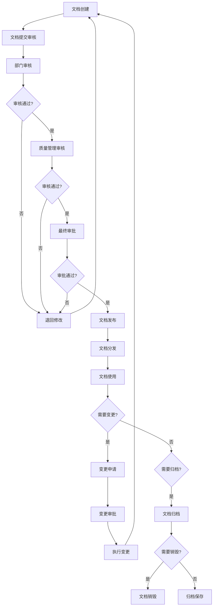
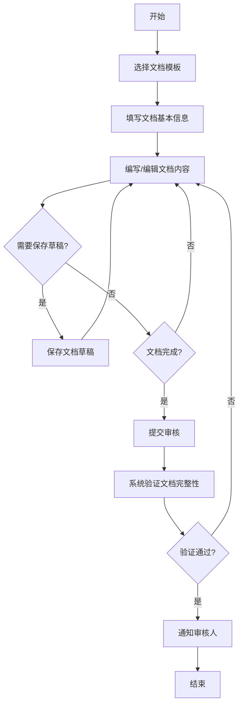
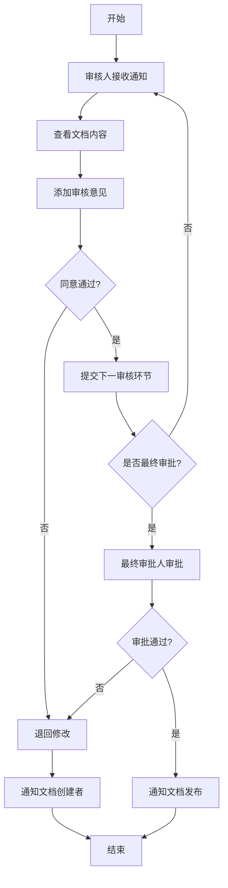
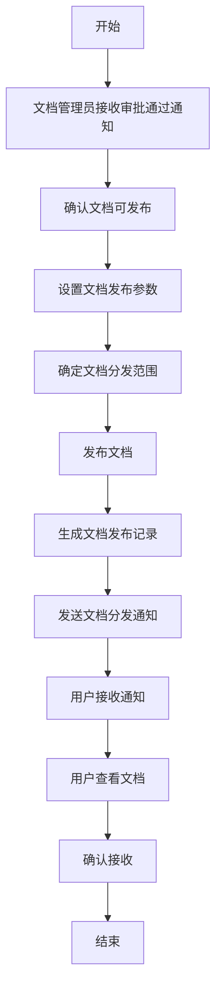
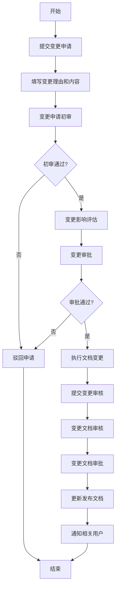
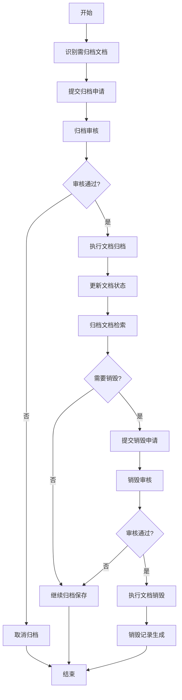

# EDMS 文档管理系统 - 业务流程描述

## 文档信息
- **文档名称**: EDMS 业务流程描述
- **版本**: V1.0
- **创建日期**: [当前日期]
- **更新日期**: [更新日期]
- **作者**: [作者姓名]
- **审核人**: [审核人姓名]

## 目录
- [文档信息](#文档信息)
- [概述](#概述)
  - [文档目的](#文档目的)
  - [术语定义](#术语定义)
- [业务流程图](#业务流程图)
  - [文档生命周期总览图](#文档生命周期总览图)
  - [文档创建与提交流程](#文档创建与提交流程)
  - [文档审核与审批流程](#文档审核与审批流程)
  - [文档发布与分发流程](#文档发布与分发流程)
  - [文档变更管理流程](#文档变更管理流程)
  - [文档归档与销毁流程](#文档归档与销毁流程)
- [流程详细描述](#流程详细描述)
  - [文档创建与提交流程](#文档创建与提交流程-1)
  - [文档审核与审批流程](#文档审核与审批流程-1)
  - [文档发布与分发流程](#文档发布与分发流程-1)
  - [文档变更管理流程](#文档变更管理流程-1)
  - [文档归档与销毁流程](#文档归档与销毁流程-1)
  - [文档查询与检索流程](#文档查询与检索流程)
  - [权限管理流程](#权限管理流程)
  - [系统管理流程](#系统管理流程)
- [流程规则和约束](#流程规则和约束)
  - [文档创建规则](#文档创建规则)
  - [审核与审批规则](#审核与审批规则)
  - [发布与分发规则](#发布与分发规则)
  - [变更管理规则](#变更管理规则)
  - [归档与销毁规则](#归档与销毁规则)
  - [权限与安全规则](#权限与安全规则)
- [相关系统集成](#相关系统集成)
- [附录](#附录)
  - [相关文档](#相关文档)
  - [术语表](#术语表)
  - [联系方式](#联系方式)

## 概述

### 文档目的
本文档详细描述了EDMS文档管理系统中的核心业务流程，包括文档从创建、审核、发布到归档的完整生命周期流程，以及相关的系统管理和权限管理流程。通过标准的流程定义，确保所有文档操作符合GMP要求，保证文档的完整性、准确性、可追溯性和安全性。

### 术语定义
- **EDMS**: 电子文档管理系统(Electronic Document Management System)，用于管理电子文档的创建、审核、发布、存储和检索
- **GMP**: 药品生产质量管理规范(Good Manufacturing Practice)，确保药品质量的一系列标准和规范
- **文档生命周期**: 文档从创建到归档或销毁的整个过程
- **工作流**: 定义文档处理步骤和规则的流程
- **审核**: 对文档内容进行检查和评估的过程
- **审批**: 对文档的正式批准，通常是文档发布前的最后一步
- **版本控制**: 管理文档的多个版本，记录变更历史
- **元数据**: 描述文档属性的数据，如标题、作者、创建日期等
- **审计追踪**: 记录系统中所有文档相关操作的过程

## 业务流程图

### 文档生命周期总览图

### 文档创建与提交流程

### 文档审核与审批流程

### 文档发布与分发流程

### 文档变更管理流程

### 文档归档与销毁流程

## 流程详细描述

### 文档创建与提交流程

1. **开始**: 文档创建者决定创建新文档或修改现有文档
2. **选择文档模板**: 创建者从系统提供的模板库中选择适合的文档模板
3. **填写文档基本信息**: 创建者填写文档标题、编号、版本等基本元数据
4. **编写/编辑文档内容**: 创建者使用在线编辑器编写或修改文档内容
5. **保存草稿**: 创建者可随时保存文档草稿，系统也会自动定期保存
6. **文档完成检查**: 创建者检查文档内容是否完整和准确
7. **提交审核**: 创建者提交文档进行正式审核
8. **系统验证**: 系统验证文档的完整性，确保所有必要信息已填写
9. **通知审核人**: 系统通知相关审核人员进行审核
10. **结束**: 文档进入审核阶段

**参与角色**: 文档创建者、系统管理员
**系统功能**: 模板选择、文档编辑、元数据管理、草稿保存、提交审核
**输入**: 文档内容、元数据
**输出**: 待审核文档、审核通知

### 文档审核与审批流程

1. **开始**: 审核人收到文档审核通知
2. **查看文档**: 审核人登录系统，查看待审核文档的内容和元数据
3. **添加审核意见**: 审核人添加详细的审核意见，指出问题或建议
4. **审核决策**: 审核人做出审核决策（通过、拒绝、要求修改）
5. **退回修改**: 如果审核未通过，文档退回给创建者进行修改
6. **通知创建者**: 系统通知文档创建者审核结果和修改意见
7. **提交下一环节**: 如果审核通过，文档提交给下一审核环节
8. **最终审批**: 最终审批人对文档进行最终审批
9. **审批决策**: 最终审批人做出审批决策（批准或拒绝）
10. **通知发布**: 如果审批通过，系统通知文档管理员准备发布
11. **结束**: 文档进入发布阶段或返回修改

**参与角色**: 部门审核员、质量管理审核员、最终审批人、文档创建者
**系统功能**: 审核通知、文档查看、意见添加、审核决策、流程控制
**输入**: 待审核文档、审核意见
**输出**: 审核结果、意见反馈、审批状态更新

### 文档发布与分发流程

1. **开始**: 文档管理员收到文档审批通过的通知
2. **确认发布**: 文档管理员确认文档可以发布
3. **设置发布参数**: 文档管理员设置文档的发布参数，如生效日期、有效期等
4. **确定分发范围**: 文档管理员确定文档的分发范围和接收人
5. **发布文档**: 文档管理员执行文档发布操作
6. **生成发布记录**: 系统自动生成文档发布记录，包含发布信息和时间戳
7. **发送分发通知**: 系统向所有文档接收人发送通知
8. **用户接收**: 用户收到文档分发通知
9. **查看文档**: 用户登录系统查看已发布的文档
10. **确认接收**: 用户确认已查看文档
11. **结束**: 文档发布与分发流程完成

**参与角色**: 文档管理员、文档接收人
**系统功能**: 文档发布、分发管理、通知发送、确认接收
**输入**: 审批通过的文档、分发范围
**输出**: 已发布文档、分发记录、接收确认

### 文档变更管理流程

1. **开始**: 文档所有者或相关人员识别需要变更的文档
2. **提交变更申请**: 申请人在系统中提交文档变更申请
3. **填写变更信息**: 申请人填写变更理由、变更内容和预期影响
4. **变更申请初审**: 相关责任人对变更申请进行初步审查
5. **变更影响评估**: 对变更可能带来的影响进行全面评估
6. **变更审批**: 变更申请提交给授权人员进行审批
7. **执行变更**: 变更申请批准后，文档所有者执行文档内容更新
8. **提交变更审核**: 更新后的文档提交审核流程
9. **变更文档审核**: 审核人员对变更后的文档进行审核
10. **变更文档审批**: 审批人员对变更后的文档进行最终审批
11. **更新发布**: 文档变更审批通过后，更新为最新版本并发布
12. **通知用户**: 系统通知相关用户文档已更新
13. **结束**: 文档变更流程完成

**参与角色**: 文档创建者、部门审核员、质量管理审核员、最终审批人、文档管理员
**系统功能**: 变更申请、影响评估、文档更新、变更审核、版本控制
**输入**: 变更申请、变更内容
**输出**: 更新后的文档、变更记录、版本历史

### 文档归档与销毁流程

1. **开始**: 文档管理员或系统识别需要归档的文档
2. **提交归档申请**: 文档管理员提交文档归档申请
3. **归档审核**: 授权人员审核归档申请
4. **执行归档**: 审核通过后，系统将文档从活跃状态转为归档状态
5. **更新状态**: 系统更新文档的存储位置和访问状态
6. **归档检索**: 用户可根据权限检索归档文档
7. **提交销毁申请**: 对于需要销毁的归档文档，提交销毁申请
8. **销毁审核**: 高级管理员审核销毁申请
9. **执行销毁**: 审核通过后，系统执行文档销毁操作
10. **生成记录**: 系统生成销毁记录，包含销毁时间、审批人和原因
11. **结束**: 文档归档或销毁流程完成

**参与角色**: 文档管理员、审计人员、高级管理员
**系统功能**: 归档管理、归档检索、销毁申请、销毁审核、记录生成
**输入**: 归档申请、销毁申请
**输出**: 归档文档、销毁记录

### 文档查询与检索流程

1. **开始**: 用户需要查找特定文档
2. **访问查询界面**: 用户登录系统，进入文档查询界面
3. **选择查询方式**: 用户选择基本查询或高级查询
4. **输入查询条件**: 用户输入关键词或选择筛选条件
5. **执行查询**: 用户提交查询请求
6. **显示结果**: 系统显示符合条件的文档列表
7. **查看详情**: 用户查看文档详细信息或预览内容
8. **查看版本历史**: 用户可选择查看文档的版本历史
9. **执行操作**: 用户根据权限执行下载、打印等操作
10. **结束**: 查询与检索流程完成

**参与角色**: 系统用户（根据权限）
**系统功能**: 基本查询、高级查询、全文检索、结果过滤、文档预览
**输入**: 查询条件、关键词
**输出**: 查询结果、文档内容

### 权限管理流程

1. **开始**: 系统管理员或文档管理员需要管理用户权限
2. **角色定义**: 系统管理员定义系统角色和权限集
3. **用户-角色分配**: 系统管理员将用户分配到相应角色
4. **文档级权限设置**: 文档管理员为特定文档设置访问权限
5. **权限申请**: 用户提交特定权限的申请
6. **权限审批**: 授权人员审批权限申请
7. **执行授权**: 系统管理员根据审批结果执行权限授予
8. **权限审查**: 定期审查系统权限配置
9. **权限调整**: 根据审查结果调整权限配置
10. **结束**: 权限管理流程完成

**参与角色**: 系统管理员、文档管理员、用户、授权审批人
**系统功能**: 角色管理、权限分配、权限申请、权限审批、权限审查
**输入**: 角色定义、权限申请、审查结果
**输出**: 权限配置、权限记录

### 系统管理流程

1. **开始**: 系统管理员需要进行系统管理操作
2. **用户管理**: 管理系统用户账户，包括创建、修改、启用/禁用
3. **配置管理**: 配置系统参数、文档类型、工作流等
4. **监控**: 监控系统性能和用户活动
5. **备份**: 定期备份系统数据和配置
6. **日志管理**: 查看和管理系统日志和审计记录
7. **维护**: 执行系统维护和更新
8. **问题处理**: 处理系统问题和用户反馈
9. **报告生成**: 生成系统使用和性能报告
10. **结束**: 系统管理流程完成

**参与角色**: 系统管理员、IT支持人员
**系统功能**: 用户管理、配置管理、系统监控、数据备份、日志管理
**输入**: 管理操作请求、监控数据
**输出**: 系统配置、监控报告、备份数据

## 流程规则和约束

### 文档创建规则
1. 所有文档必须使用系统提供的标准模板创建
2. 文档必须包含所有必要的元数据字段
3. 文档标题和编号必须唯一，符合命名规范
4. 文档创建者必须是系统注册用户并有相应权限
5. 文档内容必须符合公司政策和GMP要求
6. 草稿文档必须定期自动保存，防止数据丢失

### 审核与审批规则
1. 文档必须经过至少两级审核（部门审核和质量审核）
2. 最终发布前必须经过最终审批人的批准
3. 审核人必须记录详细的审核意见
4. 未通过审核的文档必须退回修改，并说明原因
5. 审核期限：部门审核不超过3个工作日，质量审核不超过5个工作日
6. 审批人必须审查完整的审核历史和文档内容

### 发布与分发规则
1. 只有经过最终审批的文档才能发布
2. 文档发布必须由文档管理员执行
3. 文档发布后必须通知所有相关用户
4. 重要文档的接收必须有用户确认记录
5. 文档发布后有30天的过渡期，过渡期内旧版本和新版本同时有效
6. 发布记录必须永久保存，确保可追溯性

### 变更管理规则
1. 已发布文档的修改必须通过正式的变更申请流程
2. 变更申请必须说明变更原因和预期影响
3. 重大变更必须进行影响评估
4. 变更后的文档必须重新经过完整的审核审批流程
5. 变更记录必须保存，包括变更原因、内容和审批信息
6. 文档版本号必须按照规定格式更新（主版本.次版本.修订版本）

### 归档与销毁规则
1. 文档使用完毕后必须进行归档，归档期限遵循公司规定
2. 归档文档必须保留完整的版本历史和元数据
3. 归档文档的访问必须有严格的权限控制
4. 文档销毁必须经过高级管理层批准
5. 销毁前必须确认没有法律或合规性要求继续保留
6. 销毁操作必须有详细记录，包括审批人、时间和原因

### 权限与安全规则
1. 严格遵循最小权限原则分配权限
2. 系统管理员权限必须严格控制，至少需要两人授权
3. 敏感操作（如删除、销毁）必须有二次确认
4. 所有系统操作必须记录审计日志
5. 定期（至少每季度）审查用户权限配置
6. 用户账户必须定期更新密码，密码策略符合安全要求

## 相关系统集成

### 与认证系统的集成
- **集成点**: 用户认证和授权
- **集成方式**: API接口调用
- **数据流**: 用户登录信息从EDMS系统传输到认证系统进行验证，认证结果返回EDMS
- **功能描述**: 实现单点登录，统一用户认证和权限管理
- **相关文档**: [认证系统集成规范]

### 与培训管理系统的集成
- **集成点**: 文档培训记录
- **集成方式**: 数据同步和API调用
- **数据流**: 重要文档信息同步到培训系统，培训完成记录同步回EDMS
- **功能描述**: 确保用户在访问关键文档前已完成相关培训
- **相关文档**: [培训管理系统集成规范]

### 与质量管理系统(QMS)的集成
- **集成点**: 文档与质量流程的关联
- **集成方式**: 双向数据同步和API调用
- **数据流**: QMS中的质量事件可关联相关文档，文档变更可触发质量审查
- **功能描述**: 确保文档管理与质量管理流程的一致性
- **相关文档**: [QMS系统集成规范]

### 与设备管理系统的集成
- **集成点**: 设备相关文档管理
- **集成方式**: 单向数据同步
- **数据流**: 设备相关文档信息同步到设备管理系统
- **功能描述**: 确保设备使用和维护时有相应文档支持
- **相关文档**: [设备管理系统集成规范]

### 与审计追踪系统的集成
- **集成点**: 操作日志记录
- **集成方式**: 实时数据推送
- **数据流**: EDMS的操作日志实时推送到审计追踪系统
- **功能描述**: 集中管理和分析所有系统的操作日志，支持合规审计
- **相关文档**: [审计追踪系统集成规范]

## 附录

### 相关文档
- [EDMS总体需求文档](总体需求.md)
- [EDMS架构设计文档](架构设计.md)
- [EDMS详细需求文档](详细需求.md)
- [EDMS用例与用户故事](用例与用户故事.md)
- [EDMS场景描述和验收标准](场景描述和验收标准.md)
- [EDMS角色权限矩阵](角色权限矩阵.md)

### 术语表
| 术语 | 解释 |
|------|------|
| EDMS | 电子文档管理系统，用于管理电子文档的创建、审核、发布、存储和检索 |
| GMP | 药品生产质量管理规范，确保药品质量的一系列标准和规范 |
| 文档生命周期 | 文档从创建到归档或销毁的整个过程 |
| 工作流 | 定义文档处理步骤和规则的流程 |
| 审核 | 对文档内容进行检查和评估的过程 |
| 审批 | 对文档的正式批准，通常是文档发布前的最后一步 |
| 版本控制 | 管理文档的多个版本，记录变更历史 |
| 元数据 | 描述文档属性的数据，如标题、作者、创建日期等 |
| 审计追踪 | 记录系统中所有文档相关操作的过程 |
| 最小权限原则 | 用户只应拥有完成其工作所需的最小权限集 |
| 归档 | 将不再活跃使用但需要保留的文档移至长期存储的过程 |

### 联系方式
- **产品负责人**: [姓名] - [联系方式]
- **业务流程负责人**: [姓名] - [联系方式]
- **开发负责人**: [姓名] - [联系方式]
- **质量管理负责人**: [姓名] - [联系方式]
- **合规负责人**: [姓名] - [联系方式]
