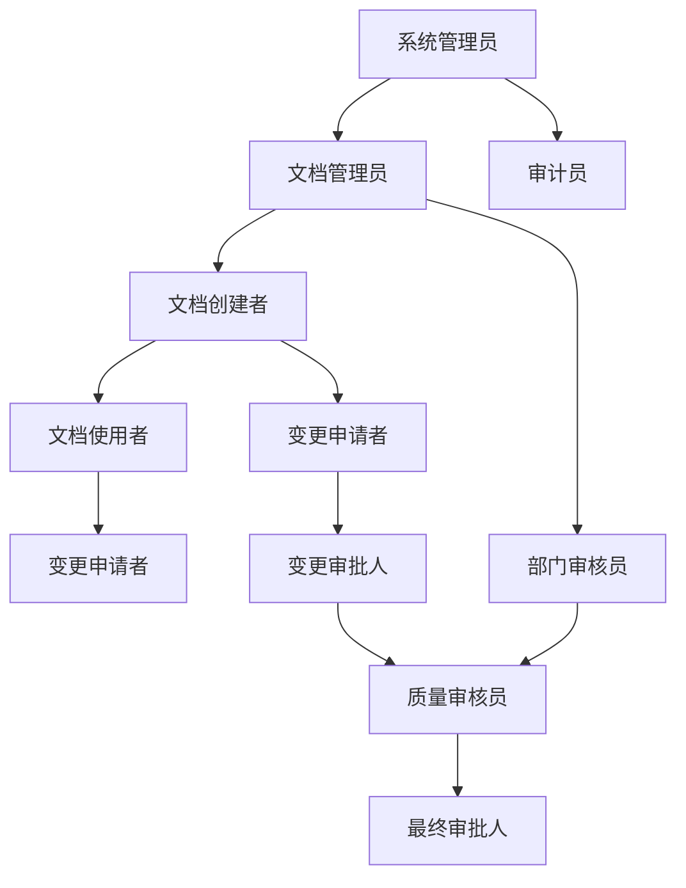
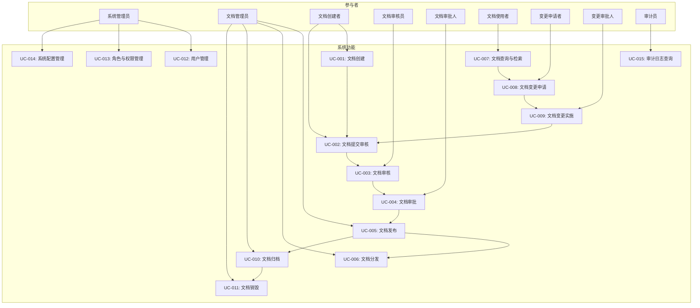
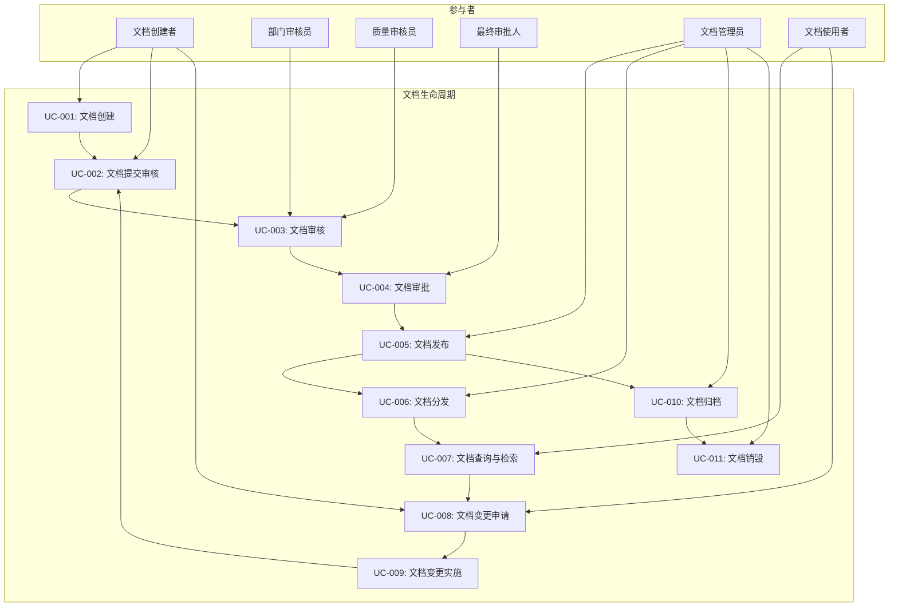
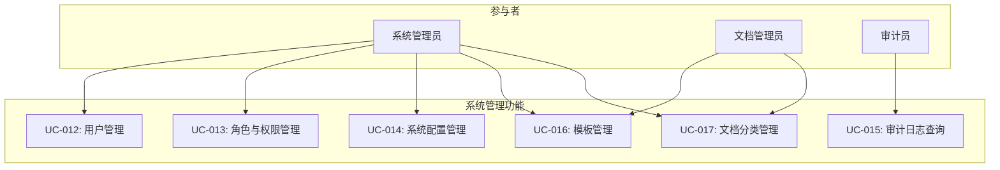

# EDMS 文档管理系统 - 用例图和用例描述

## 文档信息
- **文档名称**: EDMS 用例图和用例描述
- **版本**: V1.0
- **创建日期**: [当前日期]
- **更新日期**: [更新日期]
- **作者**: [作者姓名]
- **审核人**: [审核人姓名]

## 目录
- [文档信息](#文档信息)
- [概述](#概述)
  - [文档目的](#文档目的)
  - [术语定义](#术语定义)
- [用户角色定义](#用户角色定义)
  - [角色列表](#角色列表)
  - [角色关系图](#角色关系图)
- [系统用例图](#系统用例图)
  - [总体用例图](#总体用例图)
  - [文档生命周期用例图](#文档生命周期用例图)
  - [系统管理用例图](#系统管理用例图)
- [用例详细描述](#用例详细描述)
  - [UC-001: 文档创建](#uc-001-文档创建)
  - [UC-002: 文档提交审核](#uc-002-文档提交审核)
  - [UC-003: 文档审核](#uc-003-文档审核)
  - [UC-004: 文档审批](#uc-004-文档审批)
  - [UC-005: 文档发布](#uc-005-文档发布)
  - [UC-006: 文档分发](#uc-006-文档分发)
  - [UC-007: 文档查询与检索](#uc-007-文档查询与检索)
  - [UC-008: 文档变更申请](#uc-008-文档变更申请)
  - [UC-009: 文档变更实施](#uc-009-文档变更实施)
  - [UC-010: 文档归档](#uc-010-文档归档)
  - [UC-011: 文档销毁](#uc-011-文档销毁)
  - [UC-012: 用户管理](#uc-012-用户管理)
  - [UC-013: 角色与权限管理](#uc-013-角色与权限管理)
  - [UC-014: 系统配置管理](#uc-014-系统配置管理)
  - [UC-015: 审计日志查询](#uc-015-审计日志查询)
- [附录](#附录)
  - [相关文档](#相关文档)
  - [术语表](#术语表)
  - [联系方式](#联系方式)

## 概述

### 文档目的
本文档详细描述了EDMS文档管理系统的用例模型，包括系统的主要功能用例、参与者以及它们之间的交互关系。通过用例图和详细的用例描述，明确系统功能边界和用户操作流程，为系统开发和测试提供清晰的需求依据。

### 术语定义
- **EDMS**: 电子文档管理系统(Electronic Document Management System)
- **用例**: 描述系统执行的一系列动作，这些动作将产生对特定参与者有价值的可观察结果
- **参与者**: 与系统交互的外部实体，可以是用户、系统或其他组织
- **文档生命周期**: 文档从创建到归档或销毁的整个过程
- **GMP**: 药品生产质量管理规范(Good Manufacturing Practice)
- **工作流**: 定义文档处理步骤和规则的流程
- **审核**: 对文档内容进行检查和评估的过程
- **审批**: 对文档的正式批准，通常是文档发布前的最后一步
- **版本控制**: 管理文档的多个版本，记录变更历史

## 用户角色定义

### 角色列表

| 角色名称 | 职责描述 | 相关业务场景 |
|---------|---------|------------|
| **系统管理员** | 负责系统的用户管理、角色权限配置、系统参数设置、日志管理等 | 系统配置、权限管理、用户管理、审计监控 |
| **文档管理员** | 负责文档模板管理、文档分类管理、文档发布与分发、归档管理等 | 文档发布、文档分发、归档管理、模板管理 |
| **文档创建者** | 创建和编辑文档内容，提交文档进行审核 | 文档创建、文档提交、文档修改 |
| **部门审核员** | 对文档进行部门内审核，确保文档符合部门标准 | 部门审核、审核意见反馈 |
| **质量审核员** | 对文档进行质量管理层面的审核，确保文档符合GMP和质量标准 | 质量审核、合规性检查 |
| **最终审批人** | 对文档进行最终审批，决定文档是否可以发布 | 最终审批、发布决策 |
| **文档使用者** | 查看和使用已发布的文档 | 文档查询、文档检索、文档阅读 |
| **变更申请者** | 提交文档变更申请 | 变更申请、变更原因说明 |
| **变更审批人** | 审批文档变更申请 | 变更评估、变更审批 |
| **审计员** | 审查系统操作日志和审计记录 | 日志查询、合规审计、记录验证 |

### 角色关系图

## 系统用例图

### 总体用例图

### 文档生命周期用例图

### 系统管理用例图

## 用例详细描述

### UC-001: 文档创建

**用例编号**: UC-001  
**用例名称**: 文档创建  
**参与者**: 文档创建者  
**优先级**: 高  
**功能描述**: 系统允许文档创建者创建新文档或编辑现有文档草稿
**前置条件**: 
- 文档创建者已成功登录系统
- 文档创建者具有文档创建权限
- 系统中存在可用的文档模板

**基本流程**: 
1. 文档创建者访问文档创建页面
2. 系统显示可用的文档模板列表
3. 文档创建者选择一个适当的文档模板
4. 系统加载选定的模板，打开文档编辑器
5. 文档创建者填写文档元数据（标题、编号、版本等）
6. 文档创建者编写/编辑文档内容
7. 文档创建者保存文档草稿
8. 系统保存文档内容和元数据，返回保存成功提示

**扩展流程**: 
- **E1: 文档创建者需要修改已保存的草稿**
  1. 文档创建者访问已保存的草稿
  2. 系统打开文档编辑器，加载草稿内容
  3. 文档创建者编辑内容
  4. 文档创建者保存更新后的草稿
  5. 系统保存更改，返回保存成功提示

- **E2: 文档创建者创建新文档而不使用模板**
  1. 文档创建者选择"创建空白文档"
  2. 系统打开空白文档编辑器
  3. 文档创建者填写文档信息并编写内容
  4. 系统保存文档

**异常流程**: 
- **X1: 系统模板加载失败**
  1. 系统显示错误消息
  2. 文档创建者选择重试或联系管理员

- **X2: 保存失败**
  1. 系统显示保存失败消息
  2. 文档创建者尝试重试或联系管理员

**数据需求**: 
- 输入: 文档标题、文档编号、文档版本、文档内容、选择的模板
- 输出: 保存的文档草稿
- 存储: 文档内容、元数据、创建时间、创建者信息

**界面需求**: 
- 文档创建页面
- 模板选择界面
- 文档编辑器
- 元数据填写表单

### UC-002: 文档提交审核

**用例编号**: UC-002  
**用例名称**: 文档提交审核  
**参与者**: 文档创建者  
**优先级**: 高  
**功能描述**: 文档创建者完成文档编辑后，将文档提交给审核人进行审核
**前置条件**: 
- 文档创建者已成功登录系统
- 文档内容已完成并保存为草稿
- 文档创建者具有提交审核权限

**基本流程**: 
1. 文档创建者在文档编辑页面点击"提交审核"按钮
2. 系统验证文档完整性（必填字段是否填写、内容是否为空等）
3. 系统显示提交审核确认界面，包括审核人和审核流程
4. 文档创建者确认提交信息
5. 系统将文档状态更新为"待审核"
6. 系统通知相关审核人进行审核
7. 系统显示提交成功提示

**扩展流程**: 
- **E1: 文档创建者需要修改提交信息**
  1. 文档创建者在确认界面修改审核人或审核流程
  2. 系统更新提交信息
  3. 继续提交流程

- **E2: 文档修改后的重新提交**
  1. 文档被审核人退回修改
  2. 文档创建者修改文档内容
  3. 文档创建者重新提交审核
  4. 系统生成新的提交记录

**异常流程**: 
- **X1: 文档验证失败**
  1. 系统显示验证失败原因
  2. 文档创建者修改文档并重新提交

- **X2: 审核人设置无效**
  1. 系统提示审核人不存在或没有审核权限
  2. 文档创建者修改审核人信息

**数据需求**: 
- 输入: 提交确认信息、可选的审核人指定
- 输出: 待审核文档状态、审核通知
- 存储: 提交记录、审核流程信息、文档状态更新

**界面需求**: 
- 提交审核按钮
- 提交确认对话框
- 文档完整性验证提示
- 提交成功反馈

### UC-003: 文档审核

**用例编号**: UC-003  
**用例名称**: 文档审核  
**参与者**: 部门审核员、质量审核员  
**优先级**: 高  
**功能描述**: 审核人员对提交的文档进行内容审核和合规性检查
**前置条件**: 
- 审核人员已成功登录系统
- 有待审核的文档
- 审核人员具有文档审核权限

**基本流程**: 
1. 审核人员登录系统，查看待审核文档列表
2. 审核人员选择一个待审核文档
3. 系统显示文档内容、元数据和审核历史
4. 审核人员阅读文档内容，检查其准确性和合规性
5. 审核人员添加审核意见和建议
6. 审核人员做出审核决策（通过/拒绝）
7. 系统记录审核结果和意见
8. 系统更新文档状态并通知相关人员

**扩展流程**: 
- **E1: 审核人员需要提问或澄清**
  1. 审核人员选择"提问"选项
  2. 审核人员添加问题
  3. 系统通知文档创建者回答问题
  4. 文档创建者回答后，审核流程继续

- **E2: 多人审核流程**
  1. 第一个审核人完成审核并通过
  2. 文档自动流转到下一个审核人
  3. 所有审核人完成审核后，文档状态更新为"审核完成"

**异常流程**: 
- **X1: 文档访问权限不足**
  1. 系统显示访问拒绝提示
  2. 审核人员联系管理员申请权限

- **X2: 审核超期**
  1. 系统自动发送提醒给审核人员和文档创建者
  2. 必要时，文档可以分配给其他审核人

**数据需求**: 
- 输入: 审核意见、审核决策
- 输出: 审核结果、状态更新、通知
- 存储: 审核记录、审核意见、审核时间、审核人信息

**界面需求**: 
- 待审核文档列表
- 文档查看器
- 审核意见输入框
- 审核决策按钮（通过/拒绝）

### UC-004: 文档审批

**用例编号**: UC-004  
**用例名称**: 文档审批  
**参与者**: 最终审批人  
**优先级**: 高  
**功能描述**: 最终审批人对通过审核的文档进行最终批准，决定是否允许发布
**前置条件**: 
- 最终审批人已成功登录系统
- 文档已通过所有审核环节
- 最终审批人具有文档审批权限

**基本流程**: 
1. 最终审批人登录系统，查看待审批文档列表
2. 最终审批人选择一个待审批文档
3. 系统显示文档内容、审核历史和所有审核意见
4. 最终审批人审查文档内容和审核过程
5. 最终审批人做出审批决策（批准/拒绝）
6. 系统记录审批结果
7. 系统更新文档状态并通知相关人员

**扩展流程**: 
- **E1: 最终审批人需要附加条件批准**
  1. 最终审批人选择"条件批准"
  2. 最终审批人添加附加条件
  3. 系统通知文档创建者处理附加条件
  4. 条件满足后，文档进入发布准备状态

- **E2: 最终审批人需要查看相关文档**
  1. 最终审批人通过系统查看相关参考文档
  2. 最终审批人基于完整信息做出决策

**异常流程**: 
- **X1: 文档审批权限不足**
  1. 系统显示权限错误
  2. 最终审批人联系管理员

- **X2: 审批流程中断**
  1. 系统记录审批中断原因
  2. 文档状态更新为"审批中断"

**数据需求**: 
- 输入: 审批决策、附加条件（可选）
- 输出: 审批结果、状态更新、通知
- 存储: 审批记录、审批人信息、审批时间

**界面需求**: 
- 待审批文档列表
- 文档查看器
- 审批历史记录
- 审批决策按钮（批准/拒绝）

### UC-005: 文档发布

**用例编号**: UC-005  
**用例名称**: 文档发布  
**参与者**: 文档管理员  
**优先级**: 高  
**功能描述**: 文档管理员将审批通过的文档正式发布，使其可供用户访问和使用
**前置条件**: 
- 文档管理员已成功登录系统
- 文档已通过最终审批
- 文档管理员具有文档发布权限

**基本流程**: 
1. 文档管理员登录系统，查看待发布文档列表
2. 文档管理员选择一个待发布文档
3. 系统显示文档详细信息和审批历史
4. 文档管理员确认发布参数（生效日期、有效期等）
5. 文档管理员点击"发布"按钮
6. 系统验证发布参数的有效性
7. 系统将文档状态更新为"已发布"
8. 系统生成发布记录
9. 系统通知相关用户文档已发布

**扩展流程**: 
- **E1: 文档管理员需要设置发布范围**
  1. 文档管理员指定可访问文档的用户或角色
  2. 系统记录访问控制设置
  3. 只有指定用户可以查看已发布文档

- **E2: 计划发布**
  1. 文档管理员设置未来的发布日期
  2. 系统在指定日期自动发布文档

**异常流程**: 
- **X1: 发布参数无效**
  1. 系统显示参数错误提示
  2. 文档管理员修正参数

- **X2: 发布失败**
  1. 系统显示发布失败消息
  2. 文档管理员联系技术支持

**数据需求**: 
- 输入: 发布参数、访问控制设置
- 输出: 已发布文档、发布记录、通知
- 存储: 发布信息、发布时间、发布人、有效期

**界面需求**: 
- 待发布文档列表
- 发布参数设置界面
- 发布确认对话框
- 发布成功反馈

### UC-006: 文档分发

**用例编号**: UC-006  
**用例名称**: 文档分发  
**参与者**: 文档管理员  
**优先级**: 中  
**功能描述**: 文档管理员将已发布的文档分发给特定用户，并跟踪文档接收状态
**前置条件**: 
- 文档管理员已成功登录系统
- 文档已成功发布
- 文档管理员具有文档分发权限

**基本流程**: 
1. 文档管理员选择已发布的文档进行分发
2. 系统显示分发设置界面
3. 文档管理员选择文档接收人或角色
4. 文档管理员设置分发选项（是否需要确认接收、阅读期限等）
5. 文档管理员点击"分发"按钮
6. 系统发送文档分发通知给接收人
7. 系统记录分发信息
8. 系统跟踪文档接收状态

**扩展流程**: 
- **E1: 文档管理员需要提醒未接收用户**
  1. 文档管理员查看分发状态报告
  2. 文档管理员选择未接收用户发送提醒
  3. 系统发送提醒通知

- **E2: 文档管理员需要取消分发**
  1. 文档管理员选择已分发但未确认的文档
  2. 文档管理员点击"取消分发"
  3. 系统取消分发并通知相关用户

**异常流程**: 
- **X1: 分发接收人不存在**
  1. 系统显示错误提示
  2. 文档管理员修正接收人信息

- **X2: 通知发送失败**
  1. 系统记录失败信息
  2. 文档管理员可以手动重新发送

**数据需求**: 
- 输入: 分发接收人、分发选项
- 输出: 分发通知、分发记录
- 存储: 分发信息、接收状态、确认时间

**界面需求**: 
- 分发设置界面
- 接收人选择器
- 分发状态报告
- 提醒发送功能

### UC-007: 文档查询与检索

**用例编号**: UC-007  
**用例名称**: 文档查询与检索  
**参与者**: 文档使用者  
**优先级**: 高  
**功能描述**: 用户可以通过多种方式查询和检索系统中的文档
**前置条件**: 
- 用户已成功登录系统
- 用户具有文档查询权限

**基本流程**: 
1. 用户访问文档查询界面
2. 系统显示查询选项（基本查询、高级查询）
3. 用户输入查询条件（关键词、文档类型、日期范围等）
4. 用户点击"查询"按钮
5. 系统执行查询并显示匹配的文档列表
6. 用户可以对查询结果进行筛选和排序
7. 用户选择文档查看详细信息或内容

**扩展流程**: 
- **E1: 用户进行高级查询**
  1. 用户点击"高级查询"选项
  2. 系统显示更详细的查询条件
  3. 用户设置多个组合条件
  4. 系统执行精确查询

- **E2: 用户保存查询条件**
  1. 用户保存常用查询条件
  2. 系统记录保存的查询
  3. 用户可以快速应用保存的查询

**异常流程**: 
- **X1: 查询条件无效**
  1. 系统显示错误提示
  2. 用户修正查询条件

- **X2: 查询结果过多**
  1. 系统显示部分结果并建议使用更精确的条件
  2. 用户可以调整查询条件或使用分页查看更多结果

**数据需求**: 
- 输入: 查询条件、过滤条件
- 输出: 查询结果列表、文档详细信息
- 存储: 保存的查询条件

**界面需求**: 
- 查询界面
- 高级查询选项
- 结果列表显示
- 文档预览功能

### UC-008: 文档变更申请

**用例编号**: UC-008  
**用例名称**: 文档变更申请  
**参与者**: 变更申请者  
**优先级**: 中  
**功能描述**: 用户可以为已发布的文档提交变更申请，说明变更原因和内容
**前置条件**: 
- 变更申请者已成功登录系统
- 文档已处于发布状态
- 变更申请者具有变更申请权限

**基本流程**: 
1. 变更申请者访问需要变更的文档
2. 变更申请者点击"申请变更"按钮
3. 系统打开变更申请表单
4. 变更申请者填写变更理由、预期影响和详细说明
5. 变更申请者选择变更类型（修订、更新、替换）
6. 变更申请者提交变更申请
7. 系统记录变更申请信息
8. 系统通知相关审批人处理变更申请

**扩展流程**: 
- **E1: 变更申请者需要上传变更内容**
  1. 变更申请者上传变更后的文档内容或修改说明
  2. 系统附加文件到变更申请

- **E2: 变更申请者需要查看申请状态**
  1. 变更申请者访问"我的变更申请"列表
  2. 系统显示申请状态和处理进度

**异常流程**: 
- **X1: 申请权限不足**
  1. 系统显示权限错误
  2. 变更申请者联系文档管理员

- **X2: 申请信息不完整**
  1. 系统提示必填字段
  2. 变更申请者补充信息

**数据需求**: 
- 输入: 变更理由、变更内容、预期影响
- 输出: 变更申请记录、通知
- 存储: 变更申请详情、提交时间、申请人信息

**界面需求**: 
- 变更申请按钮
- 变更申请表单
- 变更申请状态查看

### UC-009: 文档变更实施

**用例编号**: UC-009  
**用例名称**: 文档变更实施  
**参与者**: 变更审批人、文档创建者  
**优先级**: 中  
**功能描述**: 变更申请获批后，执行文档变更并提交审核
**前置条件**: 
- 变更申请已获批准
- 文档创建者具有文档修改权限

**基本流程**: 
1. 文档创建者收到变更申请批准通知
2. 文档创建者访问原文档，开始变更编辑
3. 系统创建文档新版本的草稿
4. 文档创建者根据变更申请修改文档内容
5. 文档创建者提交修改后的文档进行审核
6. 系统将变更后的文档提交到审核流程
7. 系统更新变更状态为"实施中"
8. 文档经过完整审核流程后更新发布

**扩展流程**: 
- **E1: 变更范围扩大**
  1. 文档创建者发现需要额外变更
  2. 文档创建者提交变更申请补充
  3. 变更审批人审核补充申请
  4. 获批后继续实施

- **E2: 变更实施延期**
  1. 文档创建者申请延期
  2. 变更审批人批准延期
  3. 系统更新预期完成时间

**异常流程**: 
- **X1: 变更冲突**
  1. 系统检测到文档已被他人修改
  2. 文档创建者需要解决冲突

- **X2: 变更实施失败**
  1. 系统记录失败信息
  2. 通知相关人员处理

**数据需求**: 
- 输入: 修改后的文档内容
- 输出: 文档新版本、变更实施记录
- 存储: 版本历史、变更记录

**界面需求**: 
- 变更通知
- 文档编辑界面
- 变更状态跟踪

### UC-010: 文档归档

**用例编号**: UC-010  
**用例名称**: 文档归档  
**参与者**: 文档管理员  
**优先级**: 低  
**功能描述**: 文档管理员将不再活跃使用但需要保留的文档归档
**前置条件**: 
- 文档管理员已成功登录系统
- 文档已发布或处于非活跃状态
- 文档管理员具有文档归档权限

**基本流程**: 
1. 文档管理员访问文档归档功能
2. 系统显示可归档的文档列表
3. 文档管理员选择需要归档的文档
4. 系统显示归档确认界面，包括归档参数
5. 文档管理员确认归档信息
6. 系统执行归档操作
7. 系统将文档状态更新为"已归档"
8. 系统记录归档信息

**扩展流程**: 
- **E1: 批量归档**
  1. 文档管理员选择多个文档进行批量归档
  2. 系统批量处理归档操作

- **E2: 按条件自动归档**
  1. 文档管理员设置归档规则（如超过特定时间未更新）
  2. 系统定期自动执行归档

**异常流程**: 
- **X1: 归档失败**
  1. 系统显示错误信息
  2. 文档管理员重试或联系技术支持

- **X2: 文档锁定**
  1. 系统检测到文档被锁定
  2. 文档管理员需要先解锁文档

**数据需求**: 
- 输入: 归档文档选择、归档参数
- 输出: 归档文档、归档记录
- 存储: 归档信息、归档时间、归档位置

**界面需求**: 
- 归档管理界面
- 归档确认对话框
- 归档记录查询

### UC-011: 文档销毁

**用例编号**: UC-011  
**用例名称**: 文档销毁  
**参与者**: 文档管理员、高级管理员  
**优先级**: 低  
**功能描述**: 经授权后，对归档文档执行安全销毁
**前置条件**: 
- 文档管理员已成功登录系统
- 文档已处于归档状态
- 销毁申请已获高级管理员批准
- 文档管理员具有文档销毁权限

**基本流程**: 
1. 文档管理员访问文档销毁功能
2. 系统显示已获批准的待销毁文档列表
3. 文档管理员选择需要销毁的文档
4. 系统显示销毁确认界面，要求二次确认
5. 文档管理员确认销毁操作
6. 系统执行文档销毁
7. 系统记录销毁信息（永久保留）
8. 系统将文档标记为"已销毁"

**扩展流程**: 
- **E1: 销毁前验证**
  1. 文档管理员在销毁前再次验证文档无保留需求
  2. 系统记录验证信息
  3. 继续销毁流程

- **E2: 批量销毁**
  1. 文档管理员选择多个已批准文档批量销毁
  2. 系统批量处理销毁操作

**异常流程**: 
- **X1: 销毁权限不足**
  1. 系统显示权限错误
  2. 文档管理员需要获取高级授权

- **X2: 销毁申请未获批**
  1. 系统阻止销毁操作
  2. 提示申请审批

**数据需求**: 
- 输入: 销毁确认
- 输出: 销毁记录
- 存储: 销毁信息、销毁时间、审批人、执行人

**界面需求**: 
- 销毁管理界面
- 销毁确认对话框（二次确认）
- 销毁记录查询

### UC-012: 用户管理

**用例编号**: UC-012  
**用例名称**: 用户管理  
**参与者**: 系统管理员  
**优先级**: 高  
**功能描述**: 系统管理员对系统用户进行创建、修改、启用/禁用等操作
**前置条件**: 
- 系统管理员已成功登录系统
- 系统管理员具有用户管理权限

**基本流程**: 
1. 系统管理员访问用户管理功能
2. 系统显示用户列表和管理操作
3. 系统管理员选择一个操作（添加、编辑、启用/禁用）
4. 如果添加用户：系统管理员填写用户信息并设置初始密码
5. 如果编辑用户：系统管理员修改用户信息
6. 如果启用/禁用：系统管理员更改用户状态
7. 系统保存变更
8. 系统显示操作成功提示

**扩展流程**: 
- **E1: 重置用户密码**
  1. 系统管理员选择重置用户密码
  2. 系统生成临时密码并通知用户
  3. 用户首次登录时必须更改密码

- **E2: 批量用户导入**
  1. 系统管理员准备用户数据文件
  2. 系统导入用户数据
  3. 系统显示导入结果和错误报告

**异常流程**: 
- **X1: 用户信息验证失败**
  1. 系统显示验证错误
  2. 系统管理员修正信息

- **X2: 用户名已存在**
  1. 系统提示用户名冲突
  2. 系统管理员选择其他用户名

**数据需求**: 
- 输入: 用户信息（姓名、用户名、部门、联系方式等）
- 输出: 用户账户、状态更新
- 存储: 用户信息、账户状态、创建/修改时间

**界面需求**: 
- 用户管理界面
- 用户添加/编辑表单
- 用户状态切换控件
- 密码重置功能

### UC-013: 角色与权限管理

**用例编号**: UC-013  
**用例名称**: 角色与权限管理  
**参与者**: 系统管理员  
**优先级**: 高  
**功能描述**: 系统管理员创建和管理角色，分配权限给角色，并将角色分配给用户
**前置条件**: 
- 系统管理员已成功登录系统
- 系统管理员具有角色和权限管理权限

**基本流程**: 
1. 系统管理员访问角色管理功能
2. 系统显示现有角色列表
3. 系统管理员选择创建新角色或编辑现有角色
4. 系统管理员设置角色名称和描述
5. 系统管理员为角色分配权限
6. 系统管理员保存角色设置
7. 系统管理员访问用户-角色分配功能
8. 系统管理员将角色分配给用户
9. 系统保存分配信息

**扩展流程**: 
- **E1: 复制角色**
  1. 系统管理员基于现有角色创建新角色
  2. 系统复制原角色权限并允许修改

- **E2: 批量角色分配**
  1. 系统管理员选择多个用户批量分配角色
  2. 系统执行批量分配

**异常流程**: 
- **X1: 权限配置冲突**
  1. 系统检测到权限冲突
  2. 系统管理员需要修正权限设置

- **X2: 角色名称重复**
  1. 系统提示角色名称已存在
  2. 系统管理员选择其他角色名称

**数据需求**: 
- 输入: 角色信息、权限分配、用户-角色分配
- 输出: 角色定义、权限配置、用户权限
- 存储: 角色信息、权限关系、分配记录

**界面需求**: 
- 角色管理界面
- 角色创建/编辑表单
- 权限分配界面
- 用户-角色分配界面

### UC-014: 系统配置管理

**用例编号**: UC-014  
**用例名称**: 系统配置管理  
**参与者**: 系统管理员  
**优先级**: 中  
**功能描述**: 系统管理员配置系统参数、文档类型、工作流等
**前置条件**: 
- 系统管理员已成功登录系统
- 系统管理员具有系统配置权限

**基本流程**: 
1. 系统管理员访问系统配置功能
2. 系统显示配置分类（基本配置、文档类型、工作流等）
3. 系统管理员选择需要配置的项
4. 系统管理员修改配置参数
5. 系统验证配置有效性
6. 系统管理员保存配置
7. 系统应用新配置

**扩展流程**: 
- **E1: 导入/导出配置**
  1. 系统管理员导出当前配置
  2. 系统管理员可在另一环境导入配置

- **E2: 配置备份与恢复**
  1. 系统自动备份配置变更
  2. 系统管理员可恢复到之前的配置版本

**异常流程**: 
- **X1: 配置参数无效**
  1. 系统显示验证错误
  2. 系统管理员修正参数

- **X2: 配置更新失败**
  1. 系统显示更新失败消息
  2. 系统管理员重试或联系技术支持

**数据需求**: 
- 输入: 配置参数值
- 输出: 更新后的系统配置
- 存储: 配置参数、配置历史

**界面需求**: 
- 系统配置界面
- 配置分类导航
- 参数编辑表单
- 配置验证反馈

### UC-015: 审计日志查询

**用例编号**: UC-015  
**用例名称**: 审计日志查询  
**参与者**: 审计员、系统管理员  
**优先级**: 中  
**功能描述**: 审计员或系统管理员查询和分析系统操作日志，用于合规审计和问题排查
**前置条件**: 
- 用户已成功登录系统
- 用户具有审计日志查询权限

**基本流程**: 
1. 用户访问审计日志查询功能
2. 系统显示日志查询界面
3. 用户设置查询条件（时间范围、操作类型、用户、文档等）
4. 用户执行查询
5. 系统显示符合条件的日志记录列表
6. 用户可以查看日志详情或导出日志

**扩展流程**: 
- **E1: 高级过滤**
  1. 用户设置复杂的组合查询条件
  2. 系统执行精确查询

- **E2: 日志导出与报表**
  1. 用户选择导出格式（Excel、PDF等）
  2. 系统生成并提供导出文件
  3. 用户可以将日志数据用于合规报告

**异常流程**: 
- **X1: 查询结果过多**
  1. 系统显示部分结果并建议使用更精确条件
  2. 用户可以使用分页或调整查询条件

- **X2: 日志访问权限不足**
  1. 系统显示访问受限提示
  2. 用户联系管理员申请权限

**数据需求**: 
- 输入: 查询条件
- 输出: 日志记录列表、日志详情
- 存储: 系统操作日志（永久保留）

**界面需求**: 
- 日志查询界面
- 过滤条件设置
- 日志列表显示
- 日志详情查看
- 导出功能

## 附录

### 相关文档
- [EDMS总体需求文档](总体需求.md)
- [EDMS架构设计文档](架构设计.md)
- [EDMS详细需求文档](详细需求.md)
- [EDMS场景描述和验收标准](场景描述和验收标准.md)
- [EDMS用户故事](用户故事.md)
- [EDMS角色权限矩阵](角色权限矩阵.md)
- [EDMS业务流程描述](业务流程描述.md)

### 术语表
| 术语 | 解释 |
|------|------|
| EDMS | 电子文档管理系统，用于管理电子文档的创建、审核、发布、存储和检索 |
| GMP | 药品生产质量管理规范，确保药品质量的一系列标准和规范 |
| 用例 | 描述系统执行的一系列动作，这些动作将产生对特定参与者有价值的可观察结果 |
| 参与者 | 与系统交互的外部实体，可以是用户、系统或其他组织 |
| 文档生命周期 | 文档从创建到归档或销毁的整个过程 |
| 工作流 | 定义文档处理步骤和规则的流程 |
| 审核 | 对文档内容进行检查和评估的过程 |
| 审批 | 对文档的正式批准，通常是文档发布前的最后一步 |
| 版本控制 | 管理文档的多个版本，记录变更历史 |
| 元数据 | 描述文档属性的数据，如标题、作者、创建日期等 |
| 审计日志 | 记录系统中所有操作的详细日志，用于合规审计和问题排查 |

### 联系方式
- **产品负责人**: [姓名] - [联系方式]
- **业务流程负责人**: [姓名] - [联系方式]
- **开发负责人**: [姓名] - [联系方式]
- **质量管理负责人**: [姓名] - [联系方式]
- **合规负责人**: [姓名] - [联系方式]
