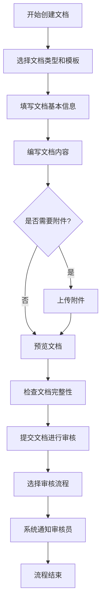
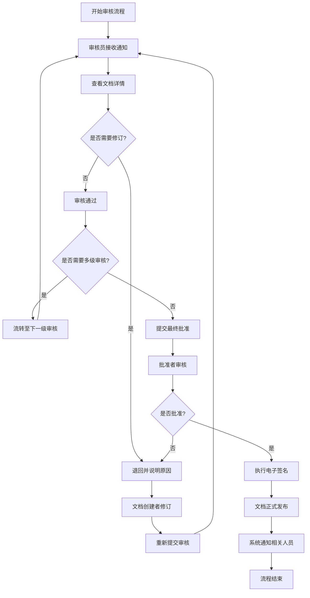
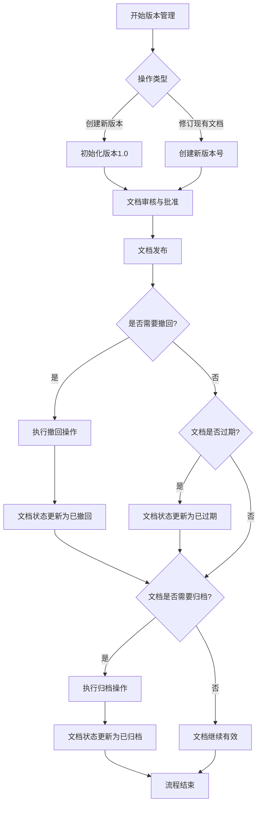
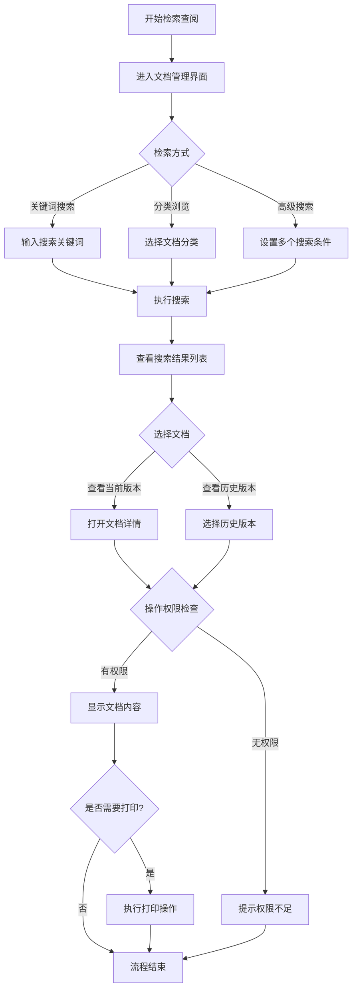
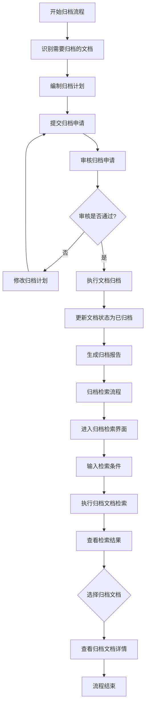

# GMP系统电子文档管理模块业务流程详细描述

## 文档信息
- **文档版本**: v1.0
- **创建日期**: 2025-11-21
- **最后更新**: 2025-11-21
- **作者**: 产品经理
- **审核人**: 技术经理、GMP合规专家

## 目录
1. [流程设计原则](#流程设计原则)
2. [流程通用要素](#流程通用要素)
3. [核心业务流程](#核心业务流程)
4. [异常处理流程](#异常处理流程)

---

## 流程设计原则

### 1.1 合规性原则
- 所有文档管理流程严格遵循FDA 21 CFR Part 11和GMP规范要求
- 确保电子记录的完整性、准确性、可追溯性和不可篡改性
- 电子签名流程符合法规要求，确保操作的责任人明确可查
- 文档生命周期管理满足法规对保留期限和归档的要求

### 1.2 安全性原则
- 严格的访问控制机制，确保只有授权人员才能访问相应文档
- 文档传输和存储过程中的数据加密，防止未授权访问
- 完整的操作审计日志，记录所有文档相关操作
- 文档版本控制，防止未授权修改和确保文档一致性

### 1.3 可靠性原则
- 文档数据存储的高可用性和数据备份恢复机制
- 系统操作的事务完整性，确保操作要么完全执行，要么完全不执行
- 关键操作的双重确认机制，防止误操作
- 系统故障自动恢复机制，最小化业务中断

### 1.4 可扩展性原则
- 模块化设计，支持未来业务需求的扩展
- 标准化的接口，便于与其他系统集成
- 灵活的文档分类和元数据管理，适应不同类型文档的需求
- 可配置的工作流引擎，支持自定义文档审批流程

## 流程通用要素

### 2.1 角色定义

| 角色名称 | 描述 | 主要职责 |
|---------|------|----------|
| 系统管理员 | 负责系统配置和用户管理 | 系统设置、用户和权限管理、系统维护 |
| 文档管理员 | 负责文档分类和权限管理 | 文档分类维护、权限分配、文档归档管理 |
| 文档创建者 | 创建和上传文档的用户 | 文档创建、初始内容编写、提交审核 |
| 文档审核员 | 审核文档内容的用户 | 文档内容审核、电子签名、批准或拒绝 |
| 文档批准者 | 最终批准文档的用户 | 最终审批、版本发布、生效确认 |
| 文档使用者 | 查阅和使用文档的用户 | 文档查询、查阅、使用（如打印） |
| 质量保证员 | 监督文档合规性的用户 | 合规性检查、审计、偏差管理 |

### 2.2 文档分类

| 文档类别 | 描述 | 示例 |
|---------|------|------|
| 标准操作规程(SOP) | 规定操作步骤的标准文档 | 设备操作SOP、清洁SOP、检验SOP |
| 质量标准 | 规定质量要求的文档 | 产品质量标准、原材料质量标准、包装材料标准 |
| 检验方法 | 规定检验流程和方法的文档 | 产品检验方法、原材料检验方法 |
| 批记录 | 记录批次生产过程的文档 | 批生产记录、批包装记录、批检验记录 |
| 验证文档 | 记录系统或设备验证的文档 | 安装验证(IQ)、运行验证(OQ)、性能验证(PV) |
| 变更控制文档 | 记录变更过程的文档 | 变更申请表、变更评估报告 |
| 偏差调查报告 | 记录和分析偏差的文档 | 偏差报告、根本原因分析报告 |
| 培训文档 | 用于培训的文档 | 培训材料、培训记录 |

### 2.3 通用流程步骤

#### 2.3.1 电子签名流程
1. 用户执行需要签名的操作
2. 系统提示进行电子签名
3. 用户输入用户名和密码
4. 系统验证用户身份和权限
5. 用户选择签名原因
6. 系统记录签名信息（签名者、时间、原因）
7. 操作完成，系统更新相关记录

#### 2.3.2 权限验证流程
1. 用户发起文档操作请求
2. 系统获取用户身份信息
3. 系统查询用户权限矩阵
4. 系统验证用户对该文档的操作权限
5. 如果有权限，允许操作继续；否则拒绝操作并记录审计日志

#### 2.3.3 审计日志记录流程
1. 系统检测到文档相关操作
2. 系统捕获操作详情（操作人、时间、操作类型、文档信息、结果）
3. 系统将操作记录写入不可篡改的审计日志
4. 日志记录包含足够信息以重现操作过程

## 核心业务流程

### 3.1 文档创建与提交流程

**描述**：文档创建者创建新文档并提交审核的完整流程。

**触发条件**：
- 需要创建新文档
- 现有文档需要修订
- 临时文档转正

**参与角色**：
- 文档创建者
- 文档管理员（可选）

**流程步骤**：

**详细说明**：
1. **开始创建文档**：文档创建者登录系统，点击"创建文档"功能。
2. **选择文档类型和模板**：从预设的文档类型列表中选择适当的类型，并选择对应的文档模板。
3. **填写文档基本信息**：包括文档标题、编号、版本号、起草部门、预期使用部门等。
4. **编写文档内容**：根据模板编写文档具体内容，可以使用在线编辑器或上传本地编辑的文档。
5. **上传附件**（可选）：如果文档需要附加其他文件，上传相关附件。
6. **预览文档**：检查文档格式和内容是否正确。
7. **检查文档完整性**：系统自动验证必填字段是否填写完整，文档内容是否符合规范。
8. **提交文档进行审核**：文档创建者确认无误后，提交文档进行审核。
9. **选择审核流程**：从预定义的审核流程模板中选择适用的流程，或自定义审核路径。
10. **系统通知审核员**：系统自动向相关审核人员发送审核通知。
11. **流程结束**：文档创建与提交流程完成，等待审核。

**关键控制点**：
- 文档编号的唯一性验证
- 文档内容的格式检查
- 必填字段的完整性验证
- 文档提交后的权限控制（创建者只能查看，不能修改）

### 3.2 文档审核与批准流程

**描述**：审核人员对文档进行审核，批准人员最终批准文档的流程。

**触发条件**：
- 收到新文档审核通知
- 收到文档修订审核通知
- 收到文档重审核通知

**参与角色**：
- 文档审核员
- 文档批准者
- 文档创建者（修订时）

**流程步骤**：

**详细说明**：
1. **开始审核流程**：系统将文档提交给指定的审核人员。
2. **审核员接收通知**：审核员收到系统通知，查看待审核文档。
3. **查看文档详情**：审核员查看文档内容、基本信息和历史记录。
4. **是否需要修订**：审核员评估文档是否需要修改。
5. **审核通过**：如果文档内容符合要求，审核员选择审核通过。
6. **退回并说明原因**：如果文档需要修改，审核员退回文档并详细说明原因。
7. **文档创建者修订**：文档创建者根据审核意见修订文档。
8. **重新提交审核**：修订完成后，文档创建者重新提交审核。
9. **是否需要多级审核**：根据文档类型和重要性，判断是否需要多级审核。
10. **流转至下一级审核**：如果需要多级审核，文档流转至下一级审核人员。
11. **提交最终批准**：所有审核通过后，提交给文档批准者进行最终批准。
12. **批准者审核**：批准者对文档进行最终审核。
13. **是否批准**：批准者决定是否批准文档发布。
14. **执行电子签名**：批准者执行电子签名，确认批准文档。
15. **文档正式发布**：系统将文档状态更新为"已批准"或"已发布"，使其对授权用户可见。
16. **系统通知相关人员**：系统自动通知文档创建者和相关使用部门。
17. **流程结束**：文档审核与批准流程完成。

**关键控制点**：
- 审核意见的完整性和明确性
- 电子签名的有效性验证
- 审核流程的时限控制
- 多级审核的正确流转

### 3.3 文档版本管理流程

**描述**：系统对文档进行版本控制，管理文档的创建、修订、发布和归档过程。

**触发条件**：
- 文档首次创建
- 文档内容需要修订
- 文档需要重新发布
- 文档需要归档

**参与角色**：
- 文档创建者
- 文档审核员
- 文档批准者
- 文档管理员

**流程步骤**：

**详细说明**：
1. **开始版本管理**：系统启动文档版本管理流程。
2. **操作类型判断**：根据用户操作选择相应的处理路径。
3. **初始化版本1.0**：新文档创建时，系统自动初始化版本为1.0。
4. **创建新版本号**：修订文档时，系统根据修订类型（小修订或大修订）自动创建新版本号（如1.1或2.0）。
5. **文档审核与批准**：新版本文档需要经过审核与批准流程。
6. **文档发布**：文档批准后正式发布，新版本生效。
7. **是否需要撤回**：判断文档是否需要撤回。
8. **执行撤回操作**：如果文档存在问题，执行撤回操作。
9. **文档状态更新为已撤回**：系统将文档状态更新为"已撤回"。
10. **文档是否过期**：根据文档的有效期限判断是否过期。
11. **文档状态更新为已过期**：系统将过期文档状态更新为"已过期"。
12. **文档是否需要归档**：判断文档是否达到归档条件。
13. **执行归档操作**：对需要归档的文档执行归档操作。
14. **文档状态更新为已归档**：系统将文档状态更新为"已归档"。
15. **文档继续有效**：未过期且不需要归档的文档继续保持有效状态。
16. **流程结束**：版本管理流程完成。

**关键控制点**：
- 版本号的自动递增和格式控制
- 文档状态的正确转换
- 历史版本的完整保存
- 版本之间的差异比较

### 3.4 文档检索与查阅流程

**描述**：用户根据权限检索和查阅文档的流程。

**触发条件**：
- 用户需要查阅特定文档
- 用户需要搜索特定类别的文档
- 用户需要查看文档历史版本

**参与角色**：
- 文档使用者
- 文档管理员（可选）

**流程步骤**：

**详细说明**：
1. **开始检索查阅**：用户进入系统准备查阅文档。
2. **进入文档管理界面**：用户导航至文档管理模块。
3. **检索方式选择**：用户选择适当的检索方式。
4. **输入搜索关键词**：用户输入关键词进行快速搜索。
5. **选择文档分类**：用户通过分类树浏览查找文档。
6. **设置多个搜索条件**：用户使用高级搜索功能设置多个条件组合搜索。
7. **执行搜索**：系统根据用户的搜索条件执行搜索。
8. **查看搜索结果列表**：系统显示符合条件的文档列表。
9. **选择文档**：用户从搜索结果中选择需要的文档。
10. **打开文档详情**：用户打开文档的当前版本。
11. **选择历史版本**：用户选择查看文档的历史版本。
12. **操作权限检查**：系统检查用户对该文档的操作权限。
13. **显示文档内容**：如果用户有权限，系统显示文档内容。
14. **提示权限不足**：如果用户无权限，系统提示权限不足。
15. **是否需要打印**：用户决定是否需要打印文档。
16. **执行打印操作**：用户执行打印操作，系统记录打印日志。
17. **流程结束**：文档检索与查阅流程完成。

**关键控制点**：
- 搜索结果的准确性和相关性
- 文档内容的安全显示（水印、禁止下载等）
- 打印操作的权限控制和日志记录
- 历史版本的完整性展示

### 3.5 文档归档与检索流程

**描述**：文档管理员对已过期或不再使用但需要保留的文档进行归档，并提供归档文档的检索功能。

**触发条件**：
- 文档达到归档期限
- 文档被新版本替代
- 项目结束需要归档相关文档

**参与角色**：
- 文档管理员
- 文档审核员（归档审核）
- 合规官（合规检查）

**流程步骤**：

**详细说明**：
1. **开始归档流程**：文档管理员启动文档归档流程。
2. **识别需要归档的文档**：根据文档的有效期限或使用状态，识别需要归档的文档。
3. **编制归档计划**：制定详细的归档计划，包括归档范围、时间、方式等。
4. **提交归档申请**：文档管理员提交归档申请给审核人员。
5. **审核归档申请**：审核人员对归档申请进行审核。
6. **审核是否通过**：判断归档申请是否获得批准。
7. **修改归档计划**：如果审核未通过，修改归档计划并重提交。
8. **执行文档归档**：审核通过后，系统执行文档归档操作，将文档移至归档存储。
9. **更新文档状态为已归档**：系统将文档状态更新为"已归档"。
10. **生成归档报告**：系统自动生成归档报告，记录归档详情。
11. **归档检索流程**：归档后的文档可通过专门的归档检索功能访问。
12. **进入归档检索界面**：用户进入归档文档检索界面。
13. **输入检索条件**：用户输入归档文档的检索条件。
14. **执行归档文档检索**：系统根据条件检索归档文档。
15. **查看检索结果**：系统显示符合条件的归档文档列表。
16. **选择归档文档**：用户从结果中选择需要查看的归档文档。
17. **查看归档文档详情**：用户查看归档文档的详细内容。
18. **流程结束**：归档与检索流程完成。

**关键控制点**：
- 归档文档的完整性和一致性
- 归档过程的权限控制
- 归档文档检索的效率和准确性
- 归档数据的长期保存和可恢复性

## 异常处理流程

### 4.1 文档变更失败处理

**描述**：当文档变更（创建、修改、删除）操作失败时的处理流程。

**触发条件**：
- 系统错误导致文档保存失败
- 数据库连接中断
- 文件存储问题
- 权限不足

**参与角色**：
- 文档操作者
- 系统管理员
- 文档管理员

**流程步骤**：
1. 系统检测到操作失败，显示错误信息
2. 用户记录错误信息，尝试重新操作
3. 如果问题仍然存在，联系系统管理员
4. 系统管理员检查系统日志，定位问题原因
5. 系统管理员解决技术问题
6. 恢复文档数据（如果需要）
7. 用户重新尝试操作
8. 记录事件到系统日志

### 4.2 文档审核流程中断处理

**描述**：当文档审核流程因各种原因中断时的处理流程。

**触发条件**：
- 审核人员离职或长期未登录
- 审核流程定义错误
- 系统故障导致流程中断

**参与角色**：
- 文档管理员
- 系统管理员
- 流程所有者

**流程步骤**：
1. 系统检测到流程长时间未进展，发送提醒
2. 文档管理员确认问题，判断是否需要干预
3. 如需要，系统管理员可执行以下操作：
   - 重新分配审核任务给其他审核员
   - 暂停当前流程并修改流程定义
   - 特殊情况下强制通过（需要高级权限和记录原因）
4. 流程继续执行
5. 记录所有干预操作到审计日志

### 4.3 文档版本冲突处理

**描述**：当多人同时编辑同一文档导致版本冲突时的处理流程。

**触发条件**：
- 多个用户同时编辑同一文档
- 离线编辑后同步导致冲突
- 不同分支合并导致冲突

**参与角色**：
- 文档编辑者
- 文档管理员

**流程步骤**：
1. 系统检测到版本冲突，显示冲突警告
2. 系统提供冲突详情和差异比较
3. 用户选择冲突解决方式：
   - 保留自己的更改（覆盖其他人的更改）
   - 接受其他人的更改（放弃自己的更改）
   - 手动合并冲突（逐行比较选择）
4. 用户执行冲突解决操作
5. 系统保存解决后的版本，并记录冲突解决过程
6. 通知相关用户冲突已解决

### 4.4 数据恢复流程

**描述**：当系统数据出现丢失或损坏时的恢复流程。

**触发条件**：
- 数据库故障
- 文件系统损坏
- 误删除操作
- 灾难事件

**参与角色**：
- 系统管理员
- 数据库管理员
- 文档管理员
- 业务负责人

**流程步骤**：
1. 检测到数据问题，启动恢复流程
2. 评估数据丢失范围和影响
3. 从最近的备份恢复数据
4. 应用事务日志，恢复到故障前的状态
5. 验证恢复数据的完整性和一致性
6. 通知相关人员恢复结果
7. 分析数据丢失原因，制定预防措施
8. 更新灾难恢复计划