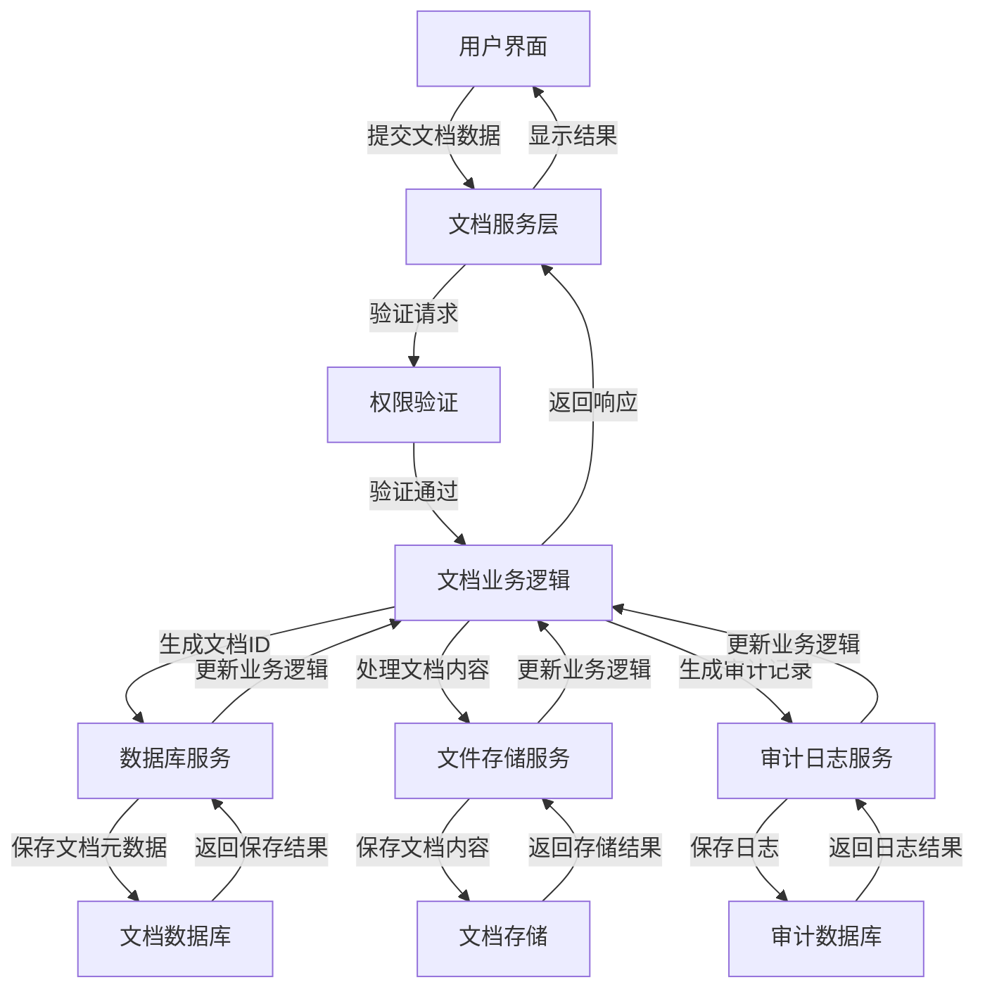
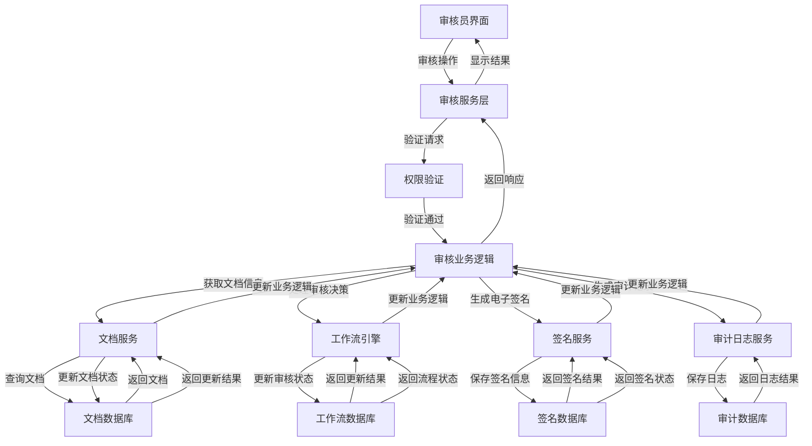
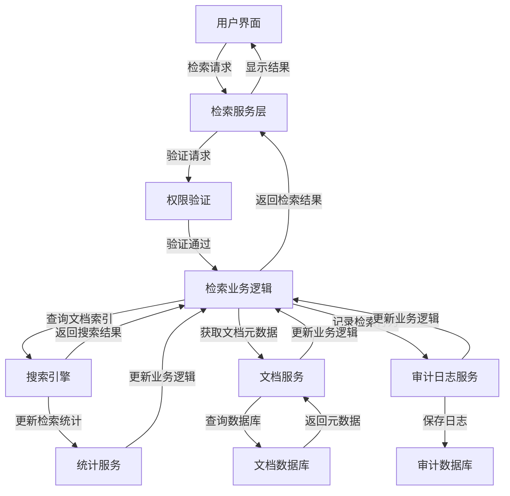
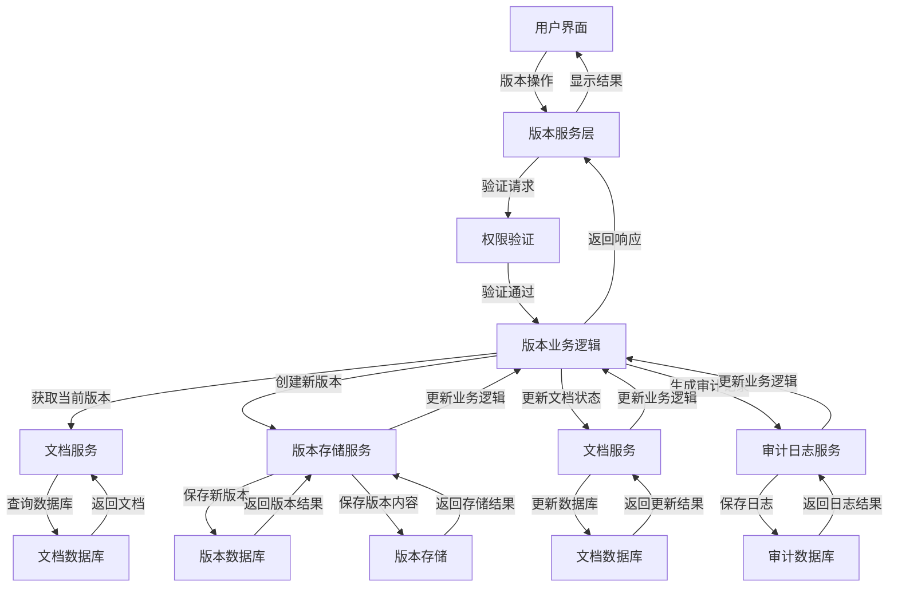
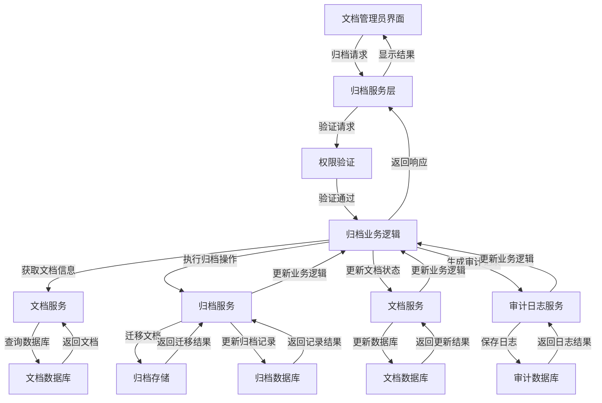

# GMP系统电子文档管理模块数据流和接口定义

## 文档信息
- **文档版本**: v1.0
- **创建日期**: 2025-11-21
- **最后更新**: 2025-11-21
- **作者**: 技术架构师
- **审核人**: 产品经理、开发团队负责人

## 目录
1. [设计原则](#设计原则)
2. [数据流类型](#数据流类型)
3. [接口分类](#接口分类)
4. [数据流架构](#数据流架构)
5. [外部系统集成](#外部系统集成)
6. [接口安全要求](#接口安全要求)
7. [数据格式定义](#数据格式定义)

---

## 设计原则

### 1.1 安全性原则
- 所有数据传输采用加密协议(HTTPS/TLS)
- 敏感数据在存储和传输过程中进行加密处理
- 严格的数据访问控制，基于角色和权限
- 完整的访问审计日志记录
- 防范SQL注入、XSS等常见安全威胁

### 1.2 可靠性原则
- 数据传输采用事务机制，确保操作的原子性
- 接口调用具备重试机制和错误处理
- 数据备份和恢复机制
- 系统故障时的数据一致性保障

### 1.3 可扩展性原则
- 采用RESTful API设计规范，便于扩展
- 接口设计遵循开闭原则，易于添加新功能
- 支持版本化管理，确保向后兼容
- 采用松耦合架构，便于系统集成

### 1.4 合规性原则
- 数据处理符合GMP和相关法规要求
- 电子记录和电子签名满足FDA 21 CFR Part 11要求
- 数据保留和归档符合法规规定的期限

## 数据流类型

### 2.1 内部数据流
- **用户界面数据流**: 用户通过UI进行的文档操作，如创建、编辑、查看等
- **业务逻辑数据流**: 业务处理过程中的数据流转，如文档状态变更、审核流程
- **数据存储数据流**: 数据持久化到数据库和文件存储的过程
- **审计日志数据流**: 系统操作记录的生成和存储

### 2.2 外部数据流
- **系统集成数据流**: 与其他GMP子系统的数据交换
- **文件导入导出数据流**: 文档的导入导出操作
- **报表生成数据流**: 报表数据的提取和生成

## 接口分类

### 3.1 用户接口
- **Web界面接口**: 用户通过浏览器访问的界面
- **移动应用接口**: 移动设备访问的界面（如有）
- **桌面客户端接口**: 桌面应用程序界面（如有）

### 3.2 API接口
- **内部API**: 系统内部模块之间的调用接口
- **外部API**: 提供给外部系统集成的接口
- **第三方服务接口**: 与第三方服务集成的接口

### 3.3 数据访问接口
- **数据库访问接口**: 与数据库交互的接口
- **文件存储访问接口**: 与文件存储系统交互的接口
- **缓存系统接口**: 与缓存系统交互的接口

## 数据流架构

### 4.1 核心数据流

#### 4.1.1 文档创建数据流



**数据流向说明**：
1. 用户通过界面提交文档创建请求，包含文档基本信息和内容
2. 文档服务层接收请求，进行权限验证
3. 文档业务逻辑处理创建请求，生成文档ID
4. 文档元数据保存到文档数据库
5. 文档内容保存到文档存储系统
6. 创建操作记录到审计日志
7. 处理完成后返回结果给用户界面

#### 4.1.2 文档审核数据流



**数据流向说明**：
1. 审核员通过界面执行审核操作
2. 审核服务层接收请求，进行权限验证
3. 审核业务逻辑获取文档信息，处理审核决策
4. 文档服务更新文档状态
5. 工作流引擎更新审核流程状态
6. 签名服务生成并保存电子签名
7. 审计日志服务记录审核操作
8. 处理完成后返回结果给审核员界面

#### 4.1.3 文档检索数据流



**数据流向说明**：
1. 用户通过界面提交文档检索请求
2. 检索服务层接收请求，进行权限验证
3. 检索业务逻辑查询文档索引，获取检索结果
4. 文档服务获取文档元数据
5. 审计日志服务记录检索行为
6. 统计服务更新检索统计信息
7. 处理完成后返回检索结果给用户界面

#### 4.1.4 文档版本管理数据流



**数据流向说明**：
1. 用户通过界面执行文档版本操作
2. 版本服务层接收请求，进行权限验证
3. 版本业务逻辑获取当前版本信息，创建新版本
4. 版本存储服务保存新版本元数据和内容
5. 文档服务更新文档状态
6. 审计日志服务记录版本操作
7. 处理完成后返回结果给用户界面

#### 4.1.5 文档归档数据流



**数据流向说明**：
1. 文档管理员通过界面提交归档请求
2. 归档服务层接收请求，进行权限验证
3. 归档业务逻辑获取文档信息，执行归档操作
4. 归档服务将文档迁移到归档存储，更新归档记录
5. 文档服务更新文档状态
6. 审计日志服务记录归档操作
7. 处理完成后返回结果给文档管理员界面

## 外部系统集成

### 5.1 与HR系统集成

**集成目的**：同步用户信息和组织结构，实现统一身份认证和权限管理

**数据流向**：
- HR系统向EDMS服务推送用户信息变更
- EDMS服务查询HR系统获取最新用户信息

**集成接口**：
- 用户同步API
- 组织结构同步API
- 用户状态变更通知API

**数据交换频率**：实时同步，定时全量同步（每日）

### 5.2 与审计系统集成

**集成目的**：将EDMS的审计日志同步到统一审计系统，实现集中审计管理

**数据流向**：
- EDMS服务向审计系统推送审计日志
- 审计系统查询EDMS获取特定操作的详细信息

**集成接口**：
- 审计日志推送API
- 审计详情查询API
- 合规报告生成API

**数据交换频率**：实时推送

### 5.3 与变更管理系统集成

**集成目的**：实现文档变更与变更控制流程的关联，确保变更的可追溯性

**数据流向**：
- 变更管理系统触发文档修订请求
- EDMS服务向变更管理系统反馈文档状态

**集成接口**：
- 变更请求创建API
- 文档状态更新通知API
- 变更关联查询API

**数据交换频率**：实时通知

### 5.4 与培训管理系统集成

**集成目的**：关联文档与培训需求，确保员工及时获取最新文档培训

**数据流向**：
- EDMS服务通知培训系统文档更新
- 培训系统查询EDMS获取文档内容用于培训

**集成接口**：
- 文档更新通知API
- 培训文档获取API
- 培训完成状态反馈API

**数据交换频率**：文档更新时触发

### 5.5 与质量事件管理系统集成

**集成目的**：在质量事件处理过程中引用和关联相关文档

**数据流向**：
- 质量事件系统查询EDMS获取相关文档
- EDMS服务提供文档引用功能

**集成接口**：
- 文档引用查询API
- 事件关联文档API
- 文档版本比较API

**数据交换频率**：按需查询

## 接口安全要求

### 6.1 认证与授权
- 采用OAuth 2.0或JWT进行身份认证
- 基于角色的访问控制(RBAC)
- 细粒度的权限控制，支持文档级权限
- 支持单点登录(SSO)集成
- 定期权限审计和验证

### 6.2 数据加密
- 传输层加密：使用HTTPS/TLS 1.2或更高版本
- 敏感数据存储加密：文档内容、用户凭证等敏感信息加密存储
- 密钥管理：使用安全的密钥管理机制
- 数据脱敏：在非必要场景下对敏感信息进行脱敏

### 6.3 请求限流与防攻击
- API请求频率限制
- 防止SQL注入、XSS、CSRF等常见攻击
- 异常访问检测和阻断
- 输入验证和过滤

### 6.4 审计与合规
- 完整记录所有API调用
- 记录调用者身份、时间、操作内容和结果
- 审计日志不可篡改
- 支持审计日志导出和查询

## 数据格式定义

### 7.1 文档元数据格式

```json
{
  "documentId": "SOP-2023-001",
  "title": "设备清洁标准操作规程",
  "type": "SOP",
  "version": "1.2",
  "status": "APPROVED",
  "category": "生产管理",
  "department": "生产部",
  "author": {
    "userId": "user001",
    "name": "张三",
    "email": "zhangsan@example.com"
  },
  "createdDate": "2023-05-10T08:30:00Z",
  "modifiedDate": "2023-06-15T14:45:00Z",
  "effectiveDate": "2023-06-20T00:00:00Z",
  "expiryDate": "2024-06-19T23:59:59Z",
  "keywords": ["清洁", "设备", "SOP"],
  "description": "本规程规定了生产设备的清洁方法和要求",
  "relatedDocuments": ["SOP-2023-002", "SOP-2023-003"],
  "accessControl": {
    "view": ["PRODUCTION", "QA", "MANAGEMENT"],
    "edit": ["DOC_ADMIN", "QA"],
    "approve": ["QA_MANAGER", "TECHNICAL_DIRECTOR"]
  }
}
```

### 7.2 文档审核记录格式

```json
{
  "auditId": "AUD-2023-0123",
  "documentId": "SOP-2023-001",
  "documentVersion": "1.2",
  "auditType": "APPROVAL",
  "auditor": {
    "userId": "user002",
    "name": "李四",
    "email": "lisi@example.com",
    "role": "QA_MANAGER"
  },
  "auditDate": "2023-06-15T14:45:00Z",
  "auditResult": "APPROVED",
  "comments": "审核通过，符合GMP要求",
  "electronicSignature": {
    "signatureId": "SIG-2023-456",
    "signatureMethod": "PASSWORD",
    "timestamp": "2023-06-15T14:45:00Z",
    "reason": "I have reviewed this document and approve it"
  },
  "workflowStep": "FINAL_APPROVAL",
  "previousStatus": "IN_REVIEW",
  "newStatus": "APPROVED"
}
```

### 7.3 文档版本信息格式

```json
{
  "versionId": "VER-2023-001-1.2",
  "documentId": "SOP-2023-001",
  "versionNumber": "1.2",
  "versionType": "MINOR",
  "createdBy": {
    "userId": "user003",
    "name": "王五",
    "email": "wangwu@example.com"
  },
  "createdDate": "2023-06-10T10:20:00Z",
  "approvedBy": {
    "userId": "user002",
    "name": "李四",
    "email": "lisi@example.com"
  },
  "approvedDate": "2023-06-15T14:45:00Z",
  "contentHash": "a1b2c3d4e5f6g7h8i9j0",
  "fileSize": 102400,
  "fileType": "application/pdf",
  "changeSummary": "更新了清洁验证方法部分",
  "relatedChangeControl": "CCR-2023-005",
  "previousVersion": "1.1",
  "status": "CURRENT"
}
```

### 7.4 文档检索请求格式

```json
{
  "query": {
    "keywords": ["清洁", "设备"],
    "documentType": "SOP",
    "category": "生产管理",
    "department": "生产部",
    "status": ["APPROVED", "EFFECTIVE"],
    "author": "张三",
    "dateRange": {
      "startDate": "2023-01-01T00:00:00Z",
      "endDate": "2023-12-31T23:59:59Z"
    }
  },
  "pagination": {
    "page": 1,
    "pageSize": 20
  },
  "sort": {
    "field": "modifiedDate",
    "direction": "DESC"
  },
  "includeContent": false
}
```

### 7.5 文档检索响应格式

```json
{
  "total": 15,
  "page": 1,
  "pageSize": 20,
  "documents": [
    {
      "documentId": "SOP-2023-001",
      "title": "设备清洁标准操作规程",
      "type": "SOP",
      "version": "1.2",
      "status": "APPROVED",
      "author": "张三",
      "modifiedDate": "2023-06-15T14:45:00Z",
      "effectiveDate": "2023-06-20T00:00:00Z",
      "keywords": ["清洁", "设备", "SOP"],
      "preview": "本规程规定了生产设备的清洁方法和要求..."
    },
    // 更多文档项...
  ],
  "facets": {
    "documentType": {"SOP": 10, "检验方法": 3, "批记录": 2},
    "status": {"APPROVED": 12, "IN_REVIEW": 3},
    "department": {"生产部": 8, "质量部": 7}
  }
}
```

### 7.6 电子签名请求格式

```json
{
  "signatureRequest": {
    "userId": "user002",
    "password": "encrypted_password",
    "operation": "APPROVE_DOCUMENT",
    "targetId": "SOP-2023-001",
    "reason": "I have reviewed this document and approve it",
    "timestamp": "2023-06-15T14:45:00Z"
  }
}
```

### 7.7 电子签名响应格式

```json
{
  "signatureResponse": {
    "signatureId": "SIG-2023-456",
    "userId": "user002",
    "status": "SUCCESS",
    "timestamp": "2023-06-15T14:45:00Z",
    "signatureHash": "h9i8g7f6e5d4c3b2a1",
    "operation": "APPROVE_DOCUMENT",
    "targetId": "SOP-2023-001"
  }
}
```

### 7.8 审计日志格式

```json
{
  "auditLog": {
    "logId": "LOG-2023-0615-12345",
    "timestamp": "2023-06-15T14:45:00Z",
    "userId": "user002",
    "userName": "李四",
    "ipAddress": "192.168.1.100",
    "action": "APPROVE",
    "targetType": "DOCUMENT",
    "targetId": "SOP-2023-001",
    "targetVersion": "1.2",
    "details": {
      "previousStatus": "IN_REVIEW",
      "newStatus": "APPROVED",
      "comments": "审核通过，符合GMP要求"
    },
    "result": "SUCCESS",
    "sessionId": "SES-2023-0615-67890",
    "relatedSignature": "SIG-2023-456"
  }
}
```