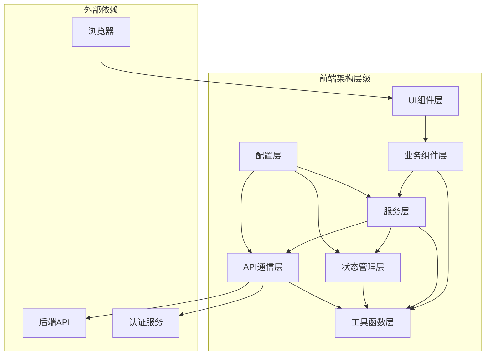

# EDMS系统前端设计文档

## 1. 概述

本文档详细描述了电子文档管理系统(EDMS)的前端设计方案，包括前端架构、技术栈选择、组件设计、用户界面规范、前端与后端的交互方式等内容。前端设计旨在提供一个直观、高效、安全且符合GMP环境要求的用户界面，确保用户能够便捷地完成文档管理相关操作。

## 2. 前端设计原则

### 2.1 用户体验原则

- **直观易用**: 界面设计简洁明了，操作流程符合用户习惯
- **高效操作**: 提供快捷键、批量操作等功能，提高用户工作效率
- **一致的体验**: 保持界面风格和交互模式的一致性
- **响应式设计**: 适配不同屏幕尺寸，提供良好的移动端体验
- **及时反馈**: 操作结果和系统状态的及时反馈

### 2.2 功能性原则

- **完整性**: 覆盖所有业务功能需求
- **安全性**: 实现前端安全机制，防止安全漏洞
- **可扩展性**: 模块化设计，支持功能扩展
- **可维护性**: 代码结构清晰，便于维护
- **性能优化**: 优化前端性能，提供流畅的用户体验

### 2.3 合规性原则

- **GMP合规**: 界面设计符合GMP环境下的使用要求
- **数据完整性**: 确保前端数据处理的完整性
- **审计追踪**: 支持前端操作的审计记录
- **权限控制**: 前端权限验证和控制
- **电子签名集成**: 电子签名界面和流程设计

## 3. 前端架构设计

### 3.1 整体架构

### 3.2 架构层级说明

#### 3.2.1 UI组件层

- **基础UI组件**: 按钮、输入框、下拉框、复选框、单选框等基础控件
- **布局组件**: 页面布局、卡片、面板、网格布局等
- **交互组件**: 对话框、模态框、抽屉、提示框等
- **数据展示组件**: 表格、列表、树形控件、图表等
- **表单组件**: 表单、表单验证、文件上传等

#### 3.2.2 业务组件层

- **文档管理组件**: 文档列表、文档详情、文档创建表单等
- **版本控制组件**: 版本历史、版本对比、版本回滚等
- **工作流组件**: 任务列表、审批流程、工作流设计器等
- **用户权限组件**: 用户管理、角色管理、权限配置等
- **电子签名组件**: 签名创建、签名验证、签名历史等
- **审计日志组件**: 日志查询、日志详情、日志导出等
- **搜索组件**: 搜索框、高级搜索、搜索结果展示等

#### 3.2.3 服务层

- **认证服务**: 处理用户登录、登出、会话管理等
- **权限服务**: 权限验证、角色管理等
- **文档服务**: 文档相关业务逻辑处理
- **工作流服务**: 工作流相关业务逻辑处理
- **通知服务**: 系统通知、消息提醒等
- **缓存服务**: 前端缓存管理

#### 3.2.4 状态管理层

- **全局状态管理**: 管理应用的全局状态
- **用户状态管理**: 管理用户相关状态
- **UI状态管理**: 管理界面相关状态
- **业务状态管理**: 管理业务相关状态

#### 3.2.5 API通信层

- **API请求封装**: 统一的API请求处理
- **认证处理**: API请求的认证信息处理
- **错误处理**: API错误的统一处理
- **请求拦截**: 请求的拦截和处理
- **响应拦截**: 响应的拦截和处理

#### 3.2.6 工具函数层

- **日期处理**: 日期格式化、计算等
- **验证工具**: 数据验证、格式验证等
- **加密工具**: 数据加密、解密等
- **文件处理**: 文件操作、格式转换等
- **导出工具**: 数据导出、报表生成等
- **辅助函数**: 其他通用辅助函数

#### 3.2.7 配置层

- **环境配置**: 不同环境的配置信息
- **API配置**: API端点配置
- **权限配置**: 权限相关配置
- **UI配置**: 界面相关配置
- **国际化配置**: 多语言配置

## 4. 技术栈选择

### 4.1 核心框架

- **前端框架**: React 18+
- **状态管理**: Redux Toolkit 或 Zustand
- **路由管理**: React Router 6+
- **UI组件库**: Ant Design 5+
- **CSS解决方案**: Styled-components 或 Tailwind CSS

### 4.2 开发工具

- **构建工具**: Vite 或 Webpack 5
- **包管理**: npm 或 Yarn
- **代码规范**: ESLint + Prettier
- **类型检查**: TypeScript
- **单元测试**: Jest + React Testing Library
- **集成测试**: Cypress

### 4.3 辅助库

- **日期处理**: Day.js 或 date-fns
- **HTTP客户端**: Axios
- **表单处理**: React Hook Form
- **表格处理**: React Table
- **图表库**: ECharts 或 Recharts
- **拖拽功能**: react-dnd
- **富文本编辑器**: Quill 或 TinyMCE
- **PDF预览**: react-pdf

### 4.4 安全相关

- **XSS防护**: DOMPurify
- **CSRF防护**: 自定义实现
- **加密库**: CryptoJS
- **安全存储**: Secure-Store

## 5. 页面与组件设计

### 5.1 页面结构

#### 5.1.1 整体布局

- **顶部导航栏**: 包含系统名称、用户信息、全局搜索、通知等
- **左侧菜单**: 系统功能菜单，支持展开/收起
- **主内容区**: 展示当前页面内容
- **右侧面板**: 可选的辅助信息面板
- **底部状态栏**: 显示系统状态、在线人数等

#### 5.1.2 响应式设计

- **桌面端**: 完整的布局显示
- **平板端**: 左侧菜单可折叠，右侧面板可隐藏
- **移动端**: 抽屉式菜单，单列布局

### 5.2 核心页面设计

#### 5.2.1 登录页面

- **登录表单**: 用户名/密码登录、多因素认证
- **忘记密码**: 密码重置流程入口
- **注册入口**: 新用户注册入口
- **系统公告**: 显示系统公告或维护信息

#### 5.2.2 仪表盘页面

- **待办任务**: 显示用户待处理的工作流任务
- **最近文档**: 显示最近访问的文档
- **系统统计**: 文档数量、用户数量等统计信息
- **快捷操作**: 常用功能的快捷入口
- **通知中心**: 系统通知和消息提醒

#### 5.2.3 文档管理页面

- **文档列表**: 表格展示文档，支持分页、排序、过滤
- **文档搜索**: 关键词搜索、高级搜索
- **批量操作**: 批量删除、批量移动、批量导出等
- **文档预览**: 在线预览文档内容
- **文档创建**: 创建新文档或从模板创建

#### 5.2.4 文档详情页面

- **文档信息**: 显示文档标题、创建者、创建时间等元数据
- **文档内容**: 文档内容展示和编辑
- **版本历史**: 显示文档的版本历史
- **工作流状态**: 显示当前文档的工作流状态
- **相关文档**: 显示相关联的文档
- **操作按钮**: 编辑、删除、移动、共享等操作

#### 5.2.5 工作流任务页面

- **任务列表**: 表格展示待处理任务
- **任务过滤**: 按状态、优先级等过滤任务
- **任务详情**: 显示任务的详细信息
- **审批操作**: 审批通过、驳回、转交等操作
- **审批历史**: 显示任务的审批历史

#### 5.2.6 用户权限管理页面

- **用户管理**: 用户列表、创建/编辑用户
- **角色管理**: 角色列表、创建/编辑角色
- **权限配置**: 权限矩阵配置
- **部门管理**: 组织结构管理
- **授权审计**: 权限变更审计记录

#### 5.2.7 电子签名页面

- **签名管理**: 签名列表、创建/编辑签名
- **签名使用**: 签名的应用和验证
- **签名策略**: 签名策略配置
- **签名审计**: 签名操作审计记录

#### 5.2.8 审计日志页面

- **日志查询**: 支持多条件组合查询
- **日志列表**: 表格展示审计日志
- **日志详情**: 显示日志的详细信息
- **日志导出**: 导出审计日志
- **日志统计**: 日志的统计和分析

### 5.3 核心组件设计

#### 5.3.1 文档上传组件

- **拖拽上传**: 支持文件拖拽上传
- **批量上传**: 支持多文件同时上传
- **进度显示**: 显示上传进度
- **格式校验**: 校验文件格式和大小
- **断点续传**: 支持大文件断点续传

#### 5.3.2 文档预览组件

- **多格式支持**: 支持Office、PDF、图片等格式预览
- **缩放功能**: 支持文档缩放
- **搜索功能**: 在预览文档中搜索关键词
- **页码导航**: 快速跳转到指定页码
- **打印功能**: 支持文档打印

#### 5.3.3 版本对比组件

- **差异高亮**: 高亮显示不同版本间的差异
- **行号显示**: 显示行号，便于定位
- **对比模式**: 支持并排对比和内联对比
- **版本选择**: 选择要对比的版本

#### 5.3.4 工作流设计器组件

- **可视化设计**: 拖拽式流程设计
- **节点配置**: 配置流程节点的属性和行为
- **连接线设置**: 设置节点间的连接关系
- **条件配置**: 配置分支条件和路由规则
- **预览功能**: 预览工作流设计效果

#### 5.3.5 电子签名组件

- **签名捕获**: 支持手写签名捕获
- **签名验证**: 验证签名的有效性
- **签名选择**: 选择已保存的签名
- **签名确认**: 签名前的确认提示
- **签名显示**: 签名的展示和样式控制

#### 5.3.6 高级搜索组件

- **多条件组合**: 支持多条件的组合查询
- **条件组**: 支持条件分组和逻辑运算
- **字段选择**: 选择要搜索的字段
- **操作符**: 不同数据类型的操作符选择
- **保存搜索**: 保存常用的搜索条件

## 6. 前端与后端交互设计

### 6.1 API通信规范

- **RESTful API**: 遵循RESTful API设计规范
- **HTTP方法**: 使用标准的HTTP方法（GET, POST, PUT, DELETE等）
- **请求格式**: JSON格式的请求数据
- **响应格式**: 统一的JSON响应格式，包含状态码、消息、数据
- **错误处理**: 统一的错误码和错误消息格式

### 6.2 认证与授权

- **JWT认证**: 使用JWT进行身份认证
- **令牌管理**: 令牌的获取、刷新、过期处理
- **权限验证**: 前端权限检查和API权限验证
- **会话管理**: 用户会话的创建、维护和销毁

### 6.3 请求拦截与响应处理

#### 6.3.1 请求拦截

- **添加认证信息**: 在请求头中添加认证令牌
- **请求数据处理**: 数据格式转换、序列化等
- **请求日志记录**: 记录请求信息
- **请求取消**: 支持取消正在进行的请求

#### 6.3.2 响应处理

- **统一响应解析**: 解析响应数据
- **错误处理**: 处理API错误，显示错误信息
- **认证失效处理**: 处理认证令牌失效的情况
- **响应缓存**: 可缓存的响应数据缓存处理

### 6.4 数据流管理

- **单向数据流**: 遵循单向数据流原则
- **状态更新**: 统一的状态更新机制
- **副作用处理**: 异步操作的副作用处理
- **状态持久化**: 关键状态的本地持久化存储

## 7. 用户界面规范

### 7.1 设计语言

- **设计风格**: 简洁、专业、易用
- **色彩方案**: 主色调（蓝色系）、辅助色、中性色
- **字体方案**: 无衬线字体，清晰易读
- **图标风格**: 扁平化或线性图标，保持一致性
- **间距规范**: 统一的间距标准，保持界面整洁

### 7.2 响应式设计规范

- **断点设置**: 根据设备尺寸设置响应式断点
- **布局适配**: 不同屏幕尺寸的布局调整策略
- **组件缩放**: 组件尺寸的自适应调整
- **内容优先级**: 内容显示的优先级排序

### 7.3 交互设计规范

- **操作反馈**: 即时的操作反馈机制
- **状态指示**: 清晰的状态指示（成功、失败、加载中等）
- **键盘导航**: 支持键盘导航和快捷键
- **拖放交互**: 直观的拖拽操作
- **焦点管理**: 合理的焦点管理

### 7.4 无障碍设计

- **WCAG合规**: 符合WCAG 2.1 AA级标准
- **屏幕阅读器支持**: 支持屏幕阅读器
- **键盘可访问性**: 所有功能可通过键盘访问
- **颜色对比度**: 符合可访问性标准的颜色对比度
- **文本替代**: 非文本内容的文本替代

## 8. 前端性能优化

### 8.1 资源优化

- **代码分割**: 按需加载代码，减小初始加载体积
- **代码压缩**: JavaScript、CSS、HTML的压缩
- **Tree Shaking**: 移除未使用的代码
- **资源缓存**: 合理的缓存策略
- **CDN加速**: 使用CDN分发静态资源

### 8.2 渲染优化

- **虚拟列表**: 长列表的虚拟渲染
- **懒加载**: 图片和组件的懒加载
- **减少重绘**: 避免不必要的DOM操作
- **防抖节流**: 优化高频事件处理
- **服务端渲染(SSR)**: 关键页面支持SSR

### 8.3 网络优化

- **请求合并**: 合并多个API请求
- **批量操作**: 支持批量数据处理
- **数据压缩**: 传输数据的压缩
- **预请求**: 预加载可能需要的数据
- **离线支持**: 关键功能的离线支持

### 8.4 性能监控

- **性能指标监控**: 监控关键性能指标（FCP, LCP, TTI等）
- **错误监控**: 前端错误的捕获和监控
- **用户体验监控**: 用户体验数据的收集和分析
- **性能报告**: 生成性能分析报告

## 9. 前端安全设计

### 9.1 常见安全威胁防护

- **XSS防护**: 输入验证、输出编码、使用安全库
- **CSRF防护**: CSRF Token、SameSite Cookie
- **点击劫持防护**: X-Frame-Options头设置
- **敏感数据保护**: 敏感数据的加密存储
- **安全头部**: 配置安全相关的HTTP响应头

### 9.2 输入验证

- **客户端验证**: 前端表单验证
- **类型检查**: TypeScript类型检查
- **数据格式验证**: 验证数据格式和范围
- **边界检查**: 防止缓冲区溢出等攻击

### 9.3 访问控制

- **路由守卫**: 路由级别的访问控制
- **组件权限**: 组件级别的权限控制
- **操作权限**: 功能操作的权限控制
- **数据权限**: 数据访问的权限控制

### 9.4 安全审计

- **操作日志**: 记录关键的前端操作
- **异常监控**: 监控和上报异常行为
- **安全扫描**: 定期进行前端代码安全扫描
- **安全更新**: 及时更新依赖库，修复安全漏洞

## 10. 开发与部署流程

### 10.1 开发规范

- **代码规范**: 统一的代码规范和风格
- **命名规范**: 变量、函数、组件的命名规范
- **注释规范**: 代码注释的格式和要求
- **Git工作流**: 统一的Git分支管理和提交规范

### 10.2 构建与部署

- **构建配置**: 不同环境的构建配置
- **自动化构建**: CI/CD流水线配置
- **静态资源部署**: 静态资源的部署策略
- **版本控制**: 前端版本的控制和管理
- **部署回滚**: 支持快速回滚到之前的版本

### 10.3 测试策略

- **单元测试**: 组件和函数的单元测试
- **集成测试**: 组件间交互的集成测试
- **端到端测试**: 完整业务流程的端到端测试
- **性能测试**: 前端性能测试
- **安全测试**: 前端安全测试

## 11. 总结

本文档详细描述了电子文档管理系统(EDMS)的前端设计方案，包括前端架构、技术栈选择、组件设计、用户界面规范、前端与后端的交互方式等内容。前端设计遵循直观易用、高效操作、一致体验、响应式设计等用户体验原则，确保系统的功能性、安全性和合规性。

前端架构采用分层设计，包括UI组件层、业务组件层、服务层、状态管理层、API通信层、工具函数层和配置层，各层职责清晰，耦合度低。技术栈选择了React生态系统的核心技术，确保系统的先进性和可维护性。

页面与组件设计覆盖了系统的核心功能，包括登录页面、仪表盘、文档管理、文档详情、工作流任务、用户权限管理、电子签名和审计日志等页面，以及文档上传、文档预览、版本对比、工作流设计器、电子签名和高级搜索等核心组件。

前端与后端交互设计遵循RESTful API规范，实现了认证与授权、请求拦截与响应处理、数据流管理等机制，确保系统的安全性和可靠性。用户界面规范定义了设计语言、响应式设计、交互设计和无障碍设计等内容，确保系统的易用性和可访问性。

前端性能优化和安全设计是系统设计的重要组成部分，通过资源优化、渲染优化、网络优化和安全威胁防护等措施，确保系统的高性能和安全性。开发与部署流程定义了开发规范、构建与部署、测试策略等内容，确保系统的质量和可维护性。

在系统实施过程中，应严格按照本文档的前端设计方案进行系统开发和部署，同时根据实际需求和用户反馈进行适当的调整和优化，确保系统的成功实施和用户满意度。