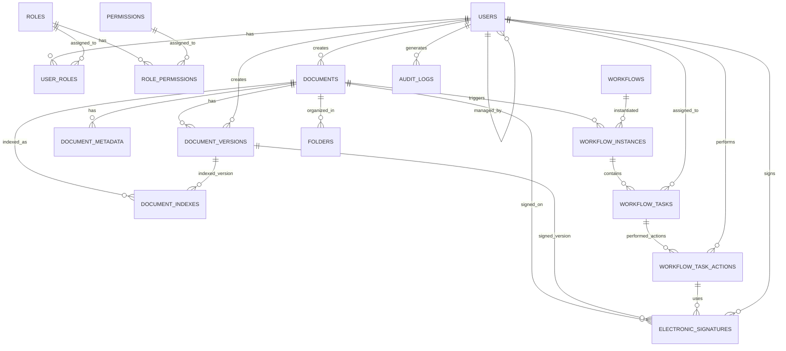

# EDMS数据模型设计文档

## 1. 概述

本文档详细描述了电子文档管理系统(EDMS)的数据模型设计，包括核心数据实体、实体间关系、数据约束和数据访问模式。数据模型设计遵循关系型数据库设计原则，同时考虑了文档管理系统的特殊需求，如版本控制、工作流管理、权限控制和审计追踪等。

## 2. 数据模型设计原则

### 2.1 设计原则

- **完整性**: 确保数据的准确性和一致性
- **规范性**: 遵循数据库规范化原则，减少数据冗余
- **可扩展性**: 支持系统未来的功能扩展和数据增长
- **安全性**: 确保数据的安全存储和访问控制
- **性能优化**: 优化查询性能，满足业务需求
- **合规性**: 满足GMP和21 CFR Part 11等法规要求

### 2.2 技术选型

- **主数据库**: PostgreSQL 13+
- **搜索引擎**: Elasticsearch 7+
- **缓存系统**: Redis 6+
- **文件存储**: MinIO/S3 兼容对象存储

## 3. 核心数据实体

### 3.1 用户与权限模块

#### 3.1.1 用户表(users)

| 字段名 | 数据类型 | 约束 | 描述 |
| :--- | :--- | :--- | :--- |
| id | UUID | PRIMARY KEY | 用户唯一标识 |
| username | VARCHAR(100) | UNIQUE NOT NULL | 用户名 |
| password_hash | VARCHAR(255) | NOT NULL | 密码哈希值 |
| full_name | VARCHAR(200) | NOT NULL | 用户全名 |
| email | VARCHAR(255) | UNIQUE NOT NULL | 电子邮箱 |
| phone | VARCHAR(50) | | 电话号码 |
| department | VARCHAR(100) | | 部门 |
| position | VARCHAR(100) | | 职位 |
| status | VARCHAR(20) | NOT NULL DEFAULT 'ACTIVE' | 状态(ACTIVE/INACTIVE/LOCKED) |
| last_login | TIMESTAMP | | 最后登录时间 |
| failed_login_attempts | INTEGER | DEFAULT 0 | 登录失败次数 |
| created_by | UUID | REFERENCES users(id) | 创建人 |
| created_at | TIMESTAMP | NOT NULL DEFAULT CURRENT_TIMESTAMP | 创建时间 |
| updated_by | UUID | REFERENCES users(id) | 更新人 |
| updated_at | TIMESTAMP | NOT NULL DEFAULT CURRENT_TIMESTAMP | 更新时间 |
| deleted_at | TIMESTAMP | | 软删除时间 |

#### 3.1.2 角色表(roles)

| 字段名 | 数据类型 | 约束 | 描述 |
| :--- | :--- | :--- | :--- |
| id | UUID | PRIMARY KEY | 角色唯一标识 |
| name | VARCHAR(100) | UNIQUE NOT NULL | 角色名称 |
| code | VARCHAR(50) | UNIQUE NOT NULL | 角色代码 |
| description | TEXT | | 角色描述 |
| created_by | UUID | REFERENCES users(id) | 创建人 |
| created_at | TIMESTAMP | NOT NULL DEFAULT CURRENT_TIMESTAMP | 创建时间 |
| updated_by | UUID | REFERENCES users(id) | 更新人 |
| updated_at | TIMESTAMP | NOT NULL DEFAULT CURRENT_TIMESTAMP | 更新时间 |

#### 3.1.3 用户角色关系表(user_roles)

| 字段名 | 数据类型 | 约束 | 描述 |
| :--- | :--- | :--- | :--- |
| user_id | UUID | REFERENCES users(id) | 用户ID |
| role_id | UUID | REFERENCES roles(id) | 角色ID |
| created_at | TIMESTAMP | NOT NULL DEFAULT CURRENT_TIMESTAMP | 创建时间 |
| PRIMARY KEY | (user_id, role_id) | | 复合主键 |

#### 3.1.4 权限表(permissions)

| 字段名 | 数据类型 | 约束 | 描述 |
| :--- | :--- | :--- | :--- |
| id | UUID | PRIMARY KEY | 权限唯一标识 |
| name | VARCHAR(100) | UNIQUE NOT NULL | 权限名称 |
| code | VARCHAR(50) | UNIQUE NOT NULL | 权限代码 |
| resource | VARCHAR(100) | NOT NULL | 资源类型 |
| action | VARCHAR(50) | NOT NULL | 操作类型 |
| description | TEXT | | 权限描述 |
| created_at | TIMESTAMP | NOT NULL DEFAULT CURRENT_TIMESTAMP | 创建时间 |
| updated_at | TIMESTAMP | NOT NULL DEFAULT CURRENT_TIMESTAMP | 更新时间 |

#### 3.1.5 角色权限关系表(role_permissions)

| 字段名 | 数据类型 | 约束 | 描述 |
| :--- | :--- | :--- | :--- |
| role_id | UUID | REFERENCES roles(id) | 角色ID |
| permission_id | UUID | REFERENCES permissions(id) | 权限ID |
| created_at | TIMESTAMP | NOT NULL DEFAULT CURRENT_TIMESTAMP | 创建时间 |
| PRIMARY KEY | (role_id, permission_id) | | 复合主键 |

### 3.2 文档管理模块

#### 3.2.1 文档表(documents)

| 字段名 | 数据类型 | 约束 | 描述 |
| :--- | :--- | :--- | :--- |
| id | UUID | PRIMARY KEY | 文档唯一标识 |
| title | VARCHAR(500) | NOT NULL | 文档标题 |
| description | TEXT | | 文档描述 |
| document_type | VARCHAR(50) | | 文档类型 |
| status | VARCHAR(20) | NOT NULL DEFAULT 'DRAFT' | 文档状态(DRAFT/IN_REVIEW/APPROVED/REJECTED/ARCHIVED) |
| current_version_id | UUID | REFERENCES document_versions(id) | 当前版本ID |
| current_version_number | INTEGER | NOT NULL DEFAULT 1 | 当前版本号 |
| template_id | UUID | REFERENCES document_templates(id) | 模板ID |
| folder_id | UUID | REFERENCES folders(id) | 所属文件夹ID |
| created_by | UUID | REFERENCES users(id) | 创建人 |
| created_at | TIMESTAMP | NOT NULL DEFAULT CURRENT_TIMESTAMP | 创建时间 |
| updated_by | UUID | REFERENCES users(id) | 更新人 |
| updated_at | TIMESTAMP | NOT NULL DEFAULT CURRENT_TIMESTAMP | 更新时间 |
| last_accessed_at | TIMESTAMP | | 最后访问时间 |
| deleted_at | TIMESTAMP | | 软删除时间 |

#### 3.2.2 文档版本表(document_versions)

| 字段名 | 数据类型 | 约束 | 描述 |
| :--- | :--- | :--- | :--- |
| id | UUID | PRIMARY KEY | 版本唯一标识 |
| document_id | UUID | REFERENCES documents(id) | 文档ID |
| version_number | INTEGER | NOT NULL | 版本号 |
| version_name | VARCHAR(100) | | 版本名称 |
| change_description | TEXT | | 变更说明 |
| file_path | VARCHAR(500) | NOT NULL | 文件存储路径 |
| file_size | BIGINT | NOT NULL | 文件大小(字节) |
| content_type | VARCHAR(100) | NOT NULL | 文件MIME类型 |
| checksum | VARCHAR(255) | NOT NULL | 文件校验和 |
| created_by | UUID | REFERENCES users(id) | 创建人 |
| created_at | TIMESTAMP | NOT NULL DEFAULT CURRENT_TIMESTAMP | 创建时间 |
| is_current | BOOLEAN | NOT NULL DEFAULT TRUE | 是否当前版本 |

#### 3.2.3 文档元数据表(document_metadata)

| 字段名 | 数据类型 | 约束 | 描述 |
| :--- | :--- | :--- | :--- |
| id | UUID | PRIMARY KEY | 元数据唯一标识 |
| document_id | UUID | REFERENCES documents(id) | 文档ID |
| key | VARCHAR(100) | NOT NULL | 元数据键 |
| value | TEXT | NOT NULL | 元数据值 |
| data_type | VARCHAR(20) | DEFAULT 'STRING' | 数据类型(STRING/NUMBER/BOOLEAN/DATE) |
| created_at | TIMESTAMP | NOT NULL DEFAULT CURRENT_TIMESTAMP | 创建时间 |
| updated_at | TIMESTAMP | NOT NULL DEFAULT CURRENT_TIMESTAMP | 更新时间 |
| UNIQUE | (document_id, key) | | 文档ID和键的唯一约束 |

#### 3.2.4 文件夹表(folders)

| 字段名 | 数据类型 | 约束 | 描述 |
| :--- | :--- | :--- | :--- |
| id | UUID | PRIMARY KEY | 文件夹唯一标识 |
| name | VARCHAR(200) | NOT NULL | 文件夹名称 |
| description | TEXT | | 文件夹描述 |
| parent_id | UUID | REFERENCES folders(id) | 父文件夹ID |
| created_by | UUID | REFERENCES users(id) | 创建人 |
| created_at | TIMESTAMP | NOT NULL DEFAULT CURRENT_TIMESTAMP | 创建时间 |
| updated_by | UUID | REFERENCES users(id) | 更新人 |
| updated_at | TIMESTAMP | NOT NULL DEFAULT CURRENT_TIMESTAMP | 更新时间 |
| deleted_at | TIMESTAMP | | 软删除时间 |

#### 3.2.5 文档模板表(document_templates)

| 字段名 | 数据类型 | 约束 | 描述 |
| :--- | :--- | :--- | :--- |
| id | UUID | PRIMARY KEY | 模板唯一标识 |
| name | VARCHAR(200) | NOT NULL | 模板名称 |
| description | TEXT | | 模板描述 |
| file_path | VARCHAR(500) | NOT NULL | 模板文件路径 |
| content_type | VARCHAR(100) | NOT NULL | 文件MIME类型 |
| metadata_schema | JSONB | | 元数据结构定义 |
| status | VARCHAR(20) | NOT NULL DEFAULT 'ACTIVE' | 状态(ACTIVE/INACTIVE) |
| created_by | UUID | REFERENCES users(id) | 创建人 |
| created_at | TIMESTAMP | NOT NULL DEFAULT CURRENT_TIMESTAMP | 创建时间 |
| updated_by | UUID | REFERENCES users(id) | 更新人 |
| updated_at | TIMESTAMP | NOT NULL DEFAULT CURRENT_TIMESTAMP | 更新时间 |

### 3.3 工作流管理模块

#### 3.3.1 工作流定义表(workflows)

| 字段名 | 数据类型 | 约束 | 描述 |
| :--- | :--- | :--- | :--- |
| id | UUID | PRIMARY KEY | 工作流唯一标识 |
| name | VARCHAR(200) | NOT NULL | 工作流名称 |
| code | VARCHAR(100) | UNIQUE NOT NULL | 工作流代码 |
| description | TEXT | | 工作流描述 |
| definition | JSONB | NOT NULL | 工作流定义(JSON格式) |
| status | VARCHAR(20) | NOT NULL DEFAULT 'DRAFT' | 状态(DRAFT/ACTIVE/INACTIVE) |
| created_by | UUID | REFERENCES users(id) | 创建人 |
| created_at | TIMESTAMP | NOT NULL DEFAULT CURRENT_TIMESTAMP | 创建时间 |
| updated_by | UUID | REFERENCES users(id) | 更新人 |
| updated_at | TIMESTAMP | NOT NULL DEFAULT CURRENT_TIMESTAMP | 更新时间 |

#### 3.3.2 工作流实例表(workflow_instances)

| 字段名 | 数据类型 | 约束 | 描述 |
| :--- | :--- | :--- | :--- |
| id | UUID | PRIMARY KEY | 实例唯一标识 |
| workflow_id | UUID | REFERENCES workflows(id) | 工作流ID |
| document_id | UUID | REFERENCES documents(id) | 相关文档ID |
| status | VARCHAR(20) | NOT NULL DEFAULT 'ACTIVE' | 状态(ACTIVE/COMPLETED/TERMINATED) |
| variables | JSONB | | 工作流变量 |
| started_by | UUID | REFERENCES users(id) | 启动人 |
| started_at | TIMESTAMP | NOT NULL DEFAULT CURRENT_TIMESTAMP | 启动时间 |
| completed_at | TIMESTAMP | | 完成时间 |
| updated_at | TIMESTAMP | NOT NULL DEFAULT CURRENT_TIMESTAMP | 更新时间 |

#### 3.3.3 工作流任务表(workflow_tasks)

| 字段名 | 数据类型 | 约束 | 描述 |
| :--- | :--- | :--- | :--- |
| id | UUID | PRIMARY KEY | 任务唯一标识 |
| instance_id | UUID | REFERENCES workflow_instances(id) | 工作流实例ID |
| name | VARCHAR(200) | NOT NULL | 任务名称 |
| description | TEXT | | 任务描述 |
| task_type | VARCHAR(50) | NOT NULL | 任务类型 |
| status | VARCHAR(20) | NOT NULL DEFAULT 'PENDING' | 状态(PENDING/ASSIGNED/IN_PROGRESS/COMPLETED/CANCELLED) |
| assignee_id | UUID | REFERENCES users(id) | 任务处理人 |
| assignee_role_id | UUID | REFERENCES roles(id) | 任务处理角色 |
| priority | INTEGER | DEFAULT 50 | 优先级(0-100) |
| due_date | TIMESTAMP | | 截止日期 |
| form_data | JSONB | | 表单数据 |
| created_at | TIMESTAMP | NOT NULL DEFAULT CURRENT_TIMESTAMP | 创建时间 |
| completed_at | TIMESTAMP | | 完成时间 |
| updated_at | TIMESTAMP | NOT NULL DEFAULT CURRENT_TIMESTAMP | 更新时间 |

#### 3.3.4 工作流任务操作表(workflow_task_actions)

| 字段名 | 数据类型 | 约束 | 描述 |
| :--- | :--- | :--- | :--- |
| id | UUID | PRIMARY KEY | 操作唯一标识 |
| task_id | UUID | REFERENCES workflow_tasks(id) | 任务ID |
| action | VARCHAR(50) | NOT NULL | 操作类型(APPROVE/REJECT/REASSIGN/DELEGATE) |
| comment | TEXT | | 操作注释 |
| performed_by | UUID | REFERENCES users(id) | 操作人 |
| performed_at | TIMESTAMP | NOT NULL DEFAULT CURRENT_TIMESTAMP | 操作时间 |
| signature_id | UUID | REFERENCES electronic_signatures(id) | 电子签名ID |

### 3.4 电子签名模块

#### 3.4.1 电子签名表(electronic_signatures)

| 字段名 | 数据类型 | 约束 | 描述 |
| :--- | :--- | :--- | :--- |
| id | UUID | PRIMARY KEY | 签名唯一标识 |
| document_id | UUID | REFERENCES documents(id) | 文档ID |
| version_id | UUID | REFERENCES document_versions(id) | 文档版本ID |
| user_id | UUID | REFERENCES users(id) | 签名人ID |
| signature_type | VARCHAR(50) | NOT NULL | 签名类型(APPROVAL/REVIEW/WITNESS) |
| signature_data | VARCHAR(500) | NOT NULL | 签名数据(哈希值) |
| reason | TEXT | NOT NULL | 签名原因 |
| timestamp | TIMESTAMP | NOT NULL DEFAULT CURRENT_TIMESTAMP | 签名时间 |
| ip_address | VARCHAR(50) | NOT NULL | IP地址 |
| client_info | TEXT | | 客户端信息 |
| is_verified | BOOLEAN | DEFAULT TRUE | 是否已验证 |

### 3.5 审计日志模块

#### 3.5.1 审计日志表(audit_logs)

| 字段名 | 数据类型 | 约束 | 描述 |
| :--- | :--- | :--- | :--- |
| id | UUID | PRIMARY KEY | 日志唯一标识 |
| user_id | UUID | REFERENCES users(id) | 用户ID |
| username | VARCHAR(100) | NOT NULL | 用户名 |
| action | VARCHAR(100) | NOT NULL | 操作类型 |
| resource_type | VARCHAR(100) | NOT NULL | 资源类型 |
| resource_id | VARCHAR(100) | NOT NULL | 资源ID |
| details | JSONB | | 详细信息 |
| status | VARCHAR(20) | NOT NULL | 操作状态(SUCCESS/FAILURE/PENDING) |
| error_message | TEXT | | 错误信息 |
| ip_address | VARCHAR(50) | NOT NULL | IP地址 |
| user_agent | TEXT | | 客户端信息 |
| timestamp | TIMESTAMP | NOT NULL DEFAULT CURRENT_TIMESTAMP | 操作时间 |

### 3.6 文档搜索与索引模块

#### 3.6.1 文档索引表(document_indexes)

| 字段名 | 数据类型 | 约束 | 描述 |
| :--- | :--- | :--- | :--- |
| id | UUID | PRIMARY KEY | 索引唯一标识 |
| document_id | UUID | REFERENCES documents(id) | 文档ID |
| version_id | UUID | REFERENCES document_versions(id) | 版本ID |
| indexed_content | TEXT | NOT NULL | 索引内容 |
| indexed_at | TIMESTAMP | NOT NULL DEFAULT CURRENT_TIMESTAMP | 索引时间 |
| index_status | VARCHAR(20) | NOT NULL DEFAULT 'PENDING' | 索引状态(PENDING/COMPLETED/FAILED) |
| error_message | TEXT | | 错误信息 |

## 4. 实体关系图

## 5. 数据约束

### 5.1 主键与外键约束

- 所有实体表都使用UUID作为主键，确保全局唯一性
- 建立适当的外键约束，维护实体间关系的完整性
- 使用复合主键避免重复数据和确保数据一致性

### 5.2 业务约束

- **文档版本控制**: 确保文档版本的连续性和唯一性
- **权限约束**: 基于角色和权限的访问控制
- **工作流约束**: 确保工作流状态转换的合法性
- **电子签名约束**: 确保电子签名的合法性和不可否认性
- **审计约束**: 确保所有关键操作都有审计记录

### 5.3 数据验证规则

- **用户名**: 唯一、非空，支持字母、数字、下划线
- **密码**: 符合安全策略，至少8位，包含大小写字母、数字和特殊字符
- **邮箱**: 符合邮箱格式规范，唯一
- **文档标题**: 非空，最大长度500字符
- **版本号**: 整数，递增
- **文件大小**: 基于配置的文件大小限制
- **日期格式**: 符合ISO 8601标准

## 6. 数据访问模式

### 6.1 数据查询模式

- **单文档查询**: 通过ID查询单个文档
- **文档列表查询**: 分页、排序、过滤查询文档列表
- **版本历史查询**: 查询文档的版本历史
- **工作流状态查询**: 查询文档的工作流状态和历史
- **权限检查查询**: 检查用户对资源的访问权限
- **审计日志查询**: 查询特定条件的审计日志

### 6.2 数据修改模式

- **文档创建**: 创建新文档
- **文档更新**: 更新文档元数据
- **版本创建**: 创建文档新版本
- **工作流操作**: 启动、完成、取消工作流
- **权限分配**: 分配用户角色和权限
- **电子签名**: 创建和验证电子签名

### 6.3 数据优化策略

- **索引优化**: 为常用查询字段创建适当的索引
- **查询优化**: 使用JOIN优化、分页优化等
- **缓存策略**: 缓存热点数据和查询结果
- **异步处理**: 使用异步处理大量数据操作
- **读写分离**: 实现数据库读写分离
- **数据分区**: 按时间或业务维度进行数据分区

## 7. 数据安全与保护

### 7.1 数据加密

- **传输加密**: 使用HTTPS协议加密数据传输
- **存储加密**: 敏感数据使用AES-256加密存储
- **密码加密**: 使用bcrypt或Argon2加密密码
- **备份加密**: 备份数据加密存储

### 7.2 访问控制

- **基于角色的访问控制(RBAC)**: 根据角色限制用户访问权限
- **基于属性的访问控制(ABAC)**: 根据属性动态控制访问权限
- **数据级权限**: 细粒度的数据访问控制
- **操作级权限**: 限制用户对数据的操作权限

### 7.3 数据完整性

- **事务管理**: 使用事务确保数据操作的原子性
- **数据验证**: 严格的数据输入验证
- **完整性约束**: 数据库级别的完整性约束
- **并发控制**: 使用乐观锁或悲观锁处理并发

### 7.4 数据备份与恢复

- **定期备份**: 定期进行全量和增量备份
- **备份验证**: 定期验证备份的可用性和完整性
- **灾难恢复**: 建立数据灾难恢复计划
- **恢复测试**: 定期进行恢复演练

## 8. 数据扩展性设计

### 8.1 水平扩展

- **数据库分片**: 按业务维度进行数据分片
- **读写分离**: 主库负责写操作，从库负责读操作
- **分布式缓存**: 使用Redis集群作为分布式缓存

### 8.2 垂直扩展

- **表分区**: 大表按时间或其他维度进行分区
- **索引优化**: 优化索引结构和查询性能
- **资源升级**: 数据库服务器资源升级

### 8.3 数据归档

- **热数据**: 近期访问频繁的数据保留在主数据库
- **冷数据**: 历史数据归档到归档数据库或数据仓库
- **归档策略**: 基于访问频率和时间的自动归档策略

## 9. 总结

本文档详细描述了电子文档管理系统(EDMS)的数据模型设计，包括核心数据实体、实体间关系、数据约束和数据访问模式。数据模型设计遵循关系型数据库设计原则，同时考虑了文档管理系统的特殊需求，如版本控制、工作流管理、权限控制和审计追踪等。

数据模型设计充分考虑了数据的完整性、安全性、可扩展性和性能优化，确保系统能够满足业务需求，并支持未来的功能扩展和数据增长。同时，数据模型设计也满足了GMP和21 CFR Part 11等法规要求，确保系统的合规性。

在系统实施过程中，应严格按照本文档的数据模型设计进行数据库设计和开发，确保数据的一致性和完整性。同时，应建立数据管理和维护机制，确保数据的安全存储和高效访问。
