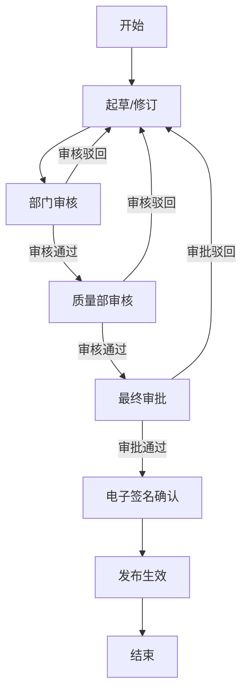
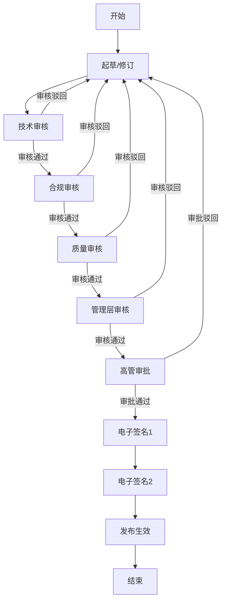
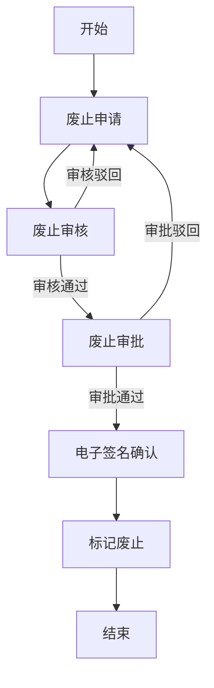
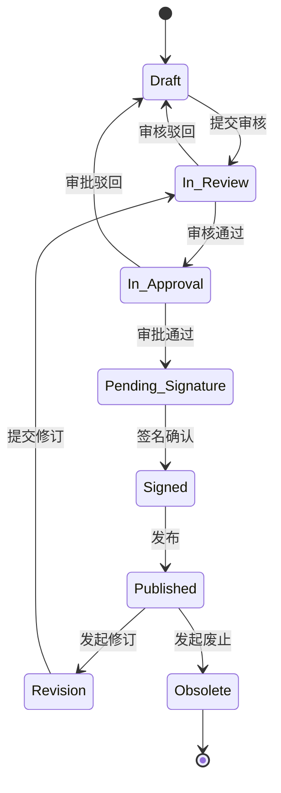
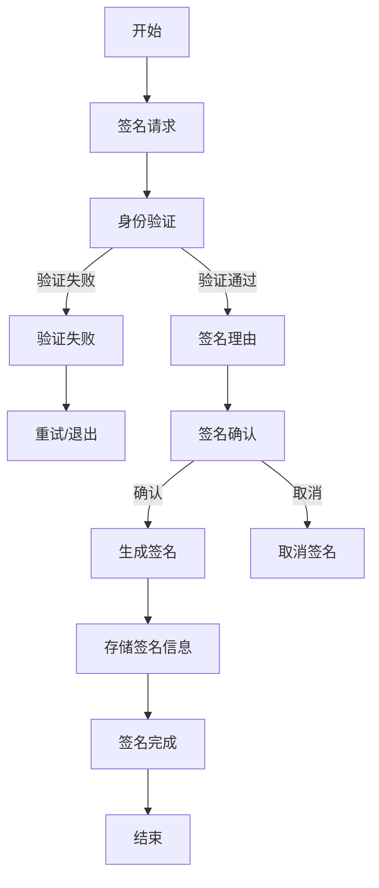
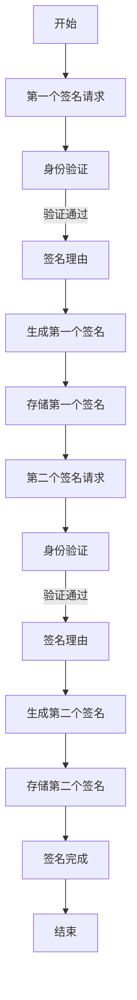

# EDMS系统文档审核与审批流程详细设计文档

## 1. 概述

本文档详细描述了电子文档管理系统(EDMS)中的文档审核与审批流程设计，包括流程定义、节点设计、规则配置、状态管理、电子签名集成、审计追踪、通知机制等内容。文档审核与审批流程是EDMS系统的核心功能之一，旨在确保文档的质量、合规性和完整性，符合GMP环境下的要求。

## 2. 流程设计原则

### 2.1 合规性原则

- **GMP合规**: 流程设计符合药品生产质量管理规范(GMP)要求
- **21 CFR Part 11合规**: 满足电子记录和电子签名法规要求
- **数据完整性**: 确保文档数据的完整性、可靠性和真实性
- **审计追踪**: 对所有流程操作进行完整的审计记录
- **可追溯性**: 支持流程历史和状态的完整追溯

### 2.2 灵活性原则

- **可配置性**: 支持灵活的流程定义和配置
- **可扩展性**: 支持流程的自定义扩展
- **适应性**: 适应不同类型文档的审核需求
- **可复用性**: 支持流程模板的创建和复用

### 2.3 安全性原则

- **权限控制**: 严格的权限控制，确保只有授权人员参与流程
- **电子签名**: 关键节点强制电子签名，确保操作的真实性
- **数据加密**: 流程数据的加密传输和存储
- **访问控制**: 基于角色的细粒度访问控制

### 2.4 可用性原则

- **用户友好**: 直观易用的流程界面和操作
- **及时通知**: 流程状态变更的及时通知
- **操作反馈**: 明确的操作结果和状态反馈
- **错误处理**: 完善的错误处理和恢复机制

## 3. 工作流引擎选择与配置

### 3.1 技术选型

- **工作流引擎**: Flowable 6.7+
  - 支持BPMN 2.0标准，提供强大的流程建模和执行能力
  - 丰富的Java API，便于与Spring Boot集成
  - 内置身份管理、历史记录和任务管理功能
  - 支持复杂的流程分支、条件路由和并行执行
  - 提供流程设计器和管理界面

### 3.2 核心组件配置

- **流程引擎配置**:
  - 数据库配置: PostgreSQL
  - 历史级别: FULL (记录完整的流程历史)
  - 异步执行器: 启用，处理异步任务和定时任务
  - 部署缓存: 配置适当的缓存大小
  - 事务管理: 与Spring事务集成

- **身份管理集成**:
  - 用户同步: 与EDMS用户系统集成
  - 权限映射: 工作流权限与EDMS权限映射
  - 组织结构: 支持部门和角色层级

- **历史数据管理**:
  - 历史记录保留策略: 长期保留关键流程数据
  - 性能优化: 定期归档和清理非关键历史数据
  - 数据查询优化: 为历史查询创建适当的索引

## 4. 文档流程类型设计

### 4.1 标准文档审批流程

标准文档审批流程适用于大多数常规文档的创建、修订和发布，包括SOP、质量手册、操作规程等。

#### 4.1.1 流程定义



#### 4.1.2 节点说明

- **起草/修订**: 文档创建者起草或修订文档内容
- **部门审核**: 部门负责人对文档进行审核
- **质量部审核**: 质量部门对文档进行合规性审核
- **最终审批**: 高级管理层或指定审批人进行最终审批
- **电子签名确认**: 文档生效前的电子签名确认
- **发布生效**: 文档正式发布并生效

### 4.2 快速审批流程

快速审批流程适用于紧急或低风险文档的审批，流程步骤简化，提高审批效率。

#### 4.2.1 流程定义


#### 4.2.2 节点说明

- **起草/修订**: 文档创建者起草或修订文档内容
- **快速审核**: 指定审核人进行审核
- **快速审批**: 指定审批人进行最终审批
- **电子签名确认**: 文档生效前的电子签名确认
- **发布生效**: 文档正式发布并生效

### 4.3 复杂审批流程

复杂审批流程适用于高风险或重要文档的审批，包括多轮审核、跨部门协作等。

#### 4.3.1 流程定义



#### 4.3.2 节点说明

- **起草/修订**: 文档创建者起草或修订文档内容
- **技术审核**: 技术专家对文档进行技术审核
- **合规审核**: 合规官对文档进行法规合规性审核
- **质量审核**: 质量部门对文档进行质量审核
- **管理层审核**: 部门管理层对文档进行审核
- **高管审批**: 高管进行最终审批
- **电子签名1**: 第一个电子签名确认
- **电子签名2**: 第二个电子签名确认（双人控制）
- **发布生效**: 文档正式发布并生效

### 4.4 文档废止流程

文档废止流程适用于需要废止的现有文档，确保文档的合规废止。

#### 4.4.1 流程定义



#### 4.4.2 节点说明

- **废止申请**: 提出文档废止申请
- **废止审核**: 审核文档废止的必要性和影响
- **废止审批**: 审批文档废止
- **电子签名确认**: 文档废止前的电子签名确认
- **标记废止**: 将文档标记为废止状态

## 5. 流程节点设计

### 5.1 任务节点类型

- **用户任务(User Task)**: 需要人工参与的任务，如审核、审批、电子签名等
- **服务任务(Service Task)**: 自动执行的任务，如发送通知、更新文档状态等
- **网关(Gateway)**: 控制流程的分支和合并，如排他网关、并行网关等
- **事件(Event)**: 触发流程或响应流程状态变更的事件，如开始事件、结束事件、定时事件等
- **子流程(Subprocess)**: 可复用的流程片段，嵌入到主流程中

### 5.2 任务节点详细设计

#### 5.2.1 文档起草任务

- **任务名称**: 文档起草
- **任务类型**: 用户任务
- **分配方式**: 固定分配给文档创建者
- **表单字段**: 文档标题、文档类型、文档内容、附件、相关文档等
- **任务期限**: 可配置，默认无限制
- **操作按钮**: 保存草稿、提交审核
- **前置条件**: 文档创建权限
- **后置操作**: 更新文档状态为"审核中"

#### 5.2.2 审核任务

- **任务名称**: 文档审核
- **任务类型**: 用户任务
- **分配方式**: 基于角色或组织结构分配
- **表单字段**: 审核意见、审核结论(通过/驳回)、修改建议
- **任务期限**: 可配置，默认为3个工作日
- **操作按钮**: 审核通过、审核驳回、转交他人
- **前置条件**: 审核权限、待审核任务
- **后置操作**: 更新文档状态、记录审核历史、触发下一个节点

#### 5.2.3 审批任务

- **任务名称**: 文档审批
- **任务类型**: 用户任务
- **分配方式**: 基于角色或组织结构分配
- **表单字段**: 审批意见、审批结论(通过/驳回)、最终决定
- **任务期限**: 可配置，默认为5个工作日
- **操作按钮**: 审批通过、审批驳回、转交他人
- **前置条件**: 审批权限、待审批任务
- **后置操作**: 更新文档状态、记录审批历史、触发电子签名节点

#### 5.2.4 电子签名任务

- **任务名称**: 电子签名确认
- **任务类型**: 用户任务
- **分配方式**: 固定分配给特定角色或用户
- **表单字段**: 签名原因、签名密码/验证方式、签名时间
- **任务期限**: 可配置，默认为2个工作日
- **操作按钮**: 签名确认、取消签名
- **前置条件**: 电子签名权限、有效的签名凭证
- **后置操作**: 记录签名信息、更新文档状态为"已签名"

#### 5.2.5 文档发布任务

- **任务名称**: 文档发布
- **任务类型**: 服务任务
- **执行方式**: 自动执行
- **执行内容**: 更新文档状态为"已发布"、生成发布版本、发送发布通知
- **前置条件**: 文档已完成所有审批和签名
- **后置操作**: 更新文档版本、记录发布历史

### 5.3 网关节点设计

#### 5.3.1 排他网关

- **网关类型**: 排他网关(XOR Gateway)
- **用途**: 根据条件选择流程分支
- **配置参数**: 条件表达式，如审核结论、文档类型等
- **示例场景**: 根据审核结论决定是继续审批还是返回修改

#### 5.3.2 并行网关

- **网关类型**: 并行网关(Parallel Gateway)
- **用途**: 同时启动多个流程分支
- **配置参数**: 无特定条件参数
- **示例场景**: 文档同时提交给多个部门进行审核

#### 5.3.3 包容网关

- **网关类型**: 包容网关(Inclusive Gateway)
- **用途**: 根据条件启动一个或多个流程分支
- **配置参数**: 每个分支的条件表达式
- **示例场景**: 根据文档类型和重要程度决定需要哪些审核

## 6. 流程规则配置

### 6.1 参与者分配规则

- **基于角色分配**: 根据用户在系统中的角色分配任务
  - 示例: 质量审核任务分配给质量部门负责人角色
- **基于组织结构分配**: 根据用户的组织层级分配任务
  - 示例: 部门审核任务分配给文档创建者的部门负责人
- **基于文档属性分配**: 根据文档的类型、重要程度等属性分配任务
  - 示例: 高风险文档的审批任务分配给高级管理层
- **固定人员分配**: 指定特定用户为任务参与者
  - 示例: 某些关键文档指定质量总监为审批人
- **自定义分配规则**: 支持自定义脚本或规则表达式进行任务分配
  - 示例: 根据文档内容关键词和用户专长进行任务分配

### 6.2 任务期限规则

- **默认期限**: 为不同类型的任务设置默认完成期限
  - 示例: 审核任务默认期限为3个工作日，审批任务默认期限为5个工作日
- **基于文档属性的期限**: 根据文档类型、优先级等属性设置不同的任务期限
  - 示例: 紧急文档的审批期限缩短为1个工作日
- **基于角色的期限**: 根据任务参与者的角色设置不同的任务期限
  - 示例: 高管审批任务期限延长为10个工作日
- **逾期提醒规则**: 设置任务逾期前的提醒时间和提醒方式
  - 示例: 任务到期前1天通过邮件和系统消息提醒

### 6.3 流程触发规则

- **手动触发**: 用户通过系统界面手动触发流程
  - 示例: 文档创建者点击"提交审核"按钮触发审核流程
- **自动触发**: 基于特定事件或条件自动触发流程
  - 示例: 文档修改后自动触发修订审批流程
- **定时触发**: 在预定时间触发流程
  - 示例: 定期对过期文档触发复查流程
- **API触发**: 通过系统API触发流程
  - 示例: 从其他系统通过API提交文档审批

### 6.4 条件路由规则

- **表达式条件**: 使用SpEL或JavaScript表达式定义路由条件
  - 示例: `#{document.type == 'SOP' && document.importance == 'high'}`
- **决策表条件**: 使用决策表定义复杂的条件规则
  - 示例: 根据文档类型、部门、修改范围等多个因素决定流程路径
- **动态条件**: 支持在运行时动态计算条件值
  - 示例: 根据当前审批人的反馈决定后续流程
- **嵌套条件**: 支持多层嵌套的条件表达式
  - 示例: 先判断文档类型，再判断修改范围，最后判断审批历史

## 7. 状态管理与转换

### 7.1 文档状态定义

- **草稿(Draft)**: 文档创建或修改后的初始状态，未提交审核
- **审核中(In_Review)**: 文档已提交审核，正在审核过程中
- **审批中(In_Approval)**: 文档审核通过，正在审批过程中
- **待签名(Pending_Signature)**: 文档审批通过，等待电子签名
- **已签名(Signed)**: 文档已完成电子签名
- **已发布(Published)**: 文档正式发布并生效
- **已废止(Obsolete)**: 文档已被废止，不再有效
- **修订中(Revision)**: 已发布文档进入修订状态
- **驳回(Rejected)**: 文档在审核或审批过程中被驳回

### 7.2 状态转换规则



### 7.3 状态转换权限控制

- **草稿 → 审核中**: 文档创建者、文档所有者
- **审核中 → 审批中/草稿**: 审核人
- **审批中 → 待签名/草稿**: 审批人
- **待签名 → 已签名**: 有权限的签名人
- **已签名 → 已发布**: 系统自动或发布管理员
- **已发布 → 修订中**: 文档所有者、管理员
- **修订中 → 审核中**: 文档所有者
- **已发布 → 已废止**: 文档所有者、管理员

### 7.4 状态转换通知

- **通知类型**: 系统消息、邮件通知、短信通知
- **通知触发点**: 状态变更、任务分配、任务逾期
- **通知内容**: 状态变更说明、任务详情、操作链接、截止时间
- **通知优先级**: 基于任务重要性和紧急程度设置通知优先级

## 8. 电子签名集成

### 8.1 签名需求与规则

- **强制签名节点**: 在关键节点强制要求电子签名
  - 示例: 最终审批后、文档发布前必须进行电子签名
- **签名授权**: 只有授权用户才能进行电子签名
  - 示例: 质量总监才能对SOP文档进行最终签名
- **签名理由**: 签名时必须提供签名理由
  - 示例: "确认文档内容符合GMP要求"
- **签名验证**: 签名时进行身份验证
  - 示例: 密码、多因素认证等
- **双人控制**: 某些关键文档需要双人签名
  - 示例: 关键工艺文件需要工艺负责人和质量负责人双人签名

### 8.2 签名流程设计

#### 8.2.1 单次签名流程



#### 8.2.2 双人签名流程



### 8.3 签名数据管理

- **签名存储**: 电子签名数据的安全存储
  - 包含: 签名人信息、签名时间、签名理由、签名值
- **签名验证**: 电子签名的验证机制
  - 使用加密算法验证签名的有效性和完整性
- **签名审计**: 签名操作的完整审计记录
  - 记录签名前的所有活动和操作
- **签名展示**: 文档中的签名可视化展示
  - 显示签名人、时间、理由等信息

### 8.4 签名合规性保障

- **唯一性验证**: 确保签名与特定个人唯一关联
- **不可否认性**: 确保签名人无法否认已进行的签名
- **时间戳**: 签名时添加可信时间戳
- **防篡改**: 签名数据的防篡改保护
- **定期验证**: 定期验证电子签名的有效性

## 9. 审计追踪设计

### 9.1 审计日志范围

- **流程实例日志**: 记录流程实例的创建、启动、完成、终止等状态变更
- **任务日志**: 记录任务的创建、分配、认领、完成、转交、逾期等操作
- **用户操作日志**: 记录用户在流程中的所有操作，如提交、审核、审批、签名等
- **数据变更日志**: 记录文档内容和元数据的变更
- **系统事件日志**: 记录系统相关事件，如流程部署、配置变更等

### 9.2 审计日志内容

审计日志应包含以下信息:
- **操作时间**: 操作发生的精确时间，包含时区信息
- **操作人**: 执行操作的用户标识和姓名
- **操作类型**: 执行的操作类型，如创建、更新、删除、审核、审批、签名等
- **操作对象**: 操作的对象标识和名称，如文档ID、流程实例ID、任务ID等
- **操作详情**: 操作的具体内容，如审核结论、审批意见、修改前后的值等
- **操作结果**: 操作的执行结果，如成功、失败、异常等
- **IP地址**: 执行操作的设备IP地址
- **会话信息**: 用户会话标识等信息

### 9.3 审计日志存储与安全

- **存储方式**: 独立的审计日志数据库，确保与业务数据隔离
- **数据加密**: 审计日志数据的加密存储
- **访问控制**: 严格的审计日志访问权限控制
- **完整性保护**: 使用密码学方法确保审计日志的完整性和不可篡改性
- **备份与归档**: 定期备份审计日志，并按规定保存归档
- **存储期限**: 根据合规要求确定审计日志的保留期限
  - 示例: GMP环境下通常要求至少保存5年

### 9.4 审计日志查询与分析

- **查询功能**: 支持多条件组合查询，如时间范围、操作人、操作类型、操作对象等
- **排序与过滤**: 支持结果排序和高级过滤
- **导出功能**: 支持将审计日志导出为PDF、Excel等格式
- **统计分析**: 提供审计日志的统计和分析功能，如操作频率、异常操作检测等
- **报告生成**: 支持生成审计报告，满足合规检查需求

## 10. 通知机制设计

### 10.1 通知类型

- **任务通知**: 分配新任务、任务逾期提醒
- **状态通知**: 流程状态变更通知
- **审批通知**: 审批结果通知
- **异常通知**: 流程异常或错误通知
- **系统通知**: 系统公告或维护通知

### 10.2 通知渠道

- **系统消息**: 系统内部的消息中心
- **邮件通知**: 通过电子邮件发送通知
- **短信通知**: 重要或紧急通知通过短信发送
- **移动推送**: 移动应用的推送通知
- **桌面通知**: 浏览器或桌面应用的通知

### 10.3 通知内容模板

- **任务通知模板**:
  ```
  主题: 【EDMS】新任务待处理
  内容: 尊敬的${userName}，您有一个新的${taskType}任务需要处理。
  任务名称: ${taskName}
  相关文档: ${documentTitle}
  分配时间: ${assignTime}
  截止时间: ${dueTime}
  请点击链接处理: ${taskUrl}
  ```

- **审批结果通知模板**:
  ```
  主题: 【EDMS】文档${documentTitle}审批结果
  内容: 尊敬的${userName}，您提交的文档"${documentTitle}"${result}。
  处理人: ${processorName}
  处理时间: ${processTime}
  意见: ${comments}
  请点击链接查看详情: ${documentUrl}
  ```

### 10.4 通知配置与管理

- **用户通知设置**: 用户可自定义通知偏好和渠道
- **通知优先级**: 基于任务重要性和紧急程度设置通知优先级
- **通知状态追踪**: 跟踪通知的发送状态、阅读状态
- **批量通知**: 支持批量发送通知
- **通知模板管理**: 支持通知模板的创建、编辑和管理

## 11. 流程监控与管理

### 11.1 流程监控功能

- **运行时监控**: 监控正在运行的流程实例和任务
- **统计分析**: 流程运行效率、完成率、逾期率等统计
- **异常检测**: 自动检测流程异常和瓶颈
- **仪表盘**: 提供直观的流程监控仪表盘
- **实时告警**: 对异常情况进行实时告警

### 11.2 流程管理功能

- **流程定义管理**: 创建、编辑、部署、激活、停用流程定义
- **流程实例管理**: 查看、暂停、恢复、终止流程实例
- **任务管理**: 查看、重新分配、委派、跳过任务
- **流程变量管理**: 查看和修改流程变量
- **历史查询**: 查询已完成流程的历史记录
- **权限控制**: 流程管理功能的权限控制

### 11.3 流程优化机制

- **性能分析**: 分析流程执行性能，识别瓶颈
- **流程改进**: 基于数据和反馈持续改进流程
- **模拟测试**: 新流程上线前的模拟测试
- **A/B测试**: 比较不同流程设计的效果
- **自动化建议**: 基于数据提供流程优化建议

## 12. 总结

本文档详细描述了电子文档管理系统(EDMS)中的文档审核与审批流程设计，包括流程定义、节点设计、规则配置、状态管理、电子签名集成、审计追踪、通知机制等内容。流程设计遵循合规性、灵活性、安全性和可用性原则，确保文档的质量、合规性和完整性，满足GMP环境下的要求。

系统采用Flowable作为工作流引擎，支持BPMN 2.0标准，提供强大的流程建模和执行能力。设计了多种流程类型，包括标准文档审批流程、快速审批流程、复杂审批流程和文档废止流程，以满足不同场景的需求。

流程节点设计涵盖了用户任务、服务任务、网关等多种类型，详细定义了各节点的属性、操作和规则。流程规则配置支持基于角色、组织结构、文档属性等多种参与者分配规则，以及灵活的任务期限、流程触发和条件路由规则。

状态管理定义了文档的完整生命周期状态和转换规则，确保文档状态的正确流转和权限控制。电子签名集成实现了符合21 CFR Part 11要求的电子签名功能，包括签名规则、流程设计、数据管理和合规性保障。

审计追踪设计确保了所有流程操作的完整记录和安全存储，支持查询和分析功能。通知机制提供了多渠道的通知功能，确保相关人员及时获取流程状态和任务信息。流程监控与管理功能支持流程的实时监控、统计分析和管理操作，为流程优化提供数据支持。

在系统实施过程中，应严格按照本文档的流程设计进行系统开发和配置，同时根据实际需求和业务变化进行适当的调整和优化，确保系统的成功实施和有效运行。