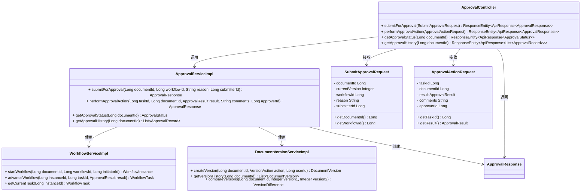

# 文档审核与审批流程详细设计文档

## 1. 概述

本文档详细描述GMP电子文档管理系统(EDMS)中的文档审核与审批流程设计，包括系统组件交互、数据流程、核心算法以及相关类的实现。该流程实现了基于工作流引擎的多级审核机制，支持文档从提交审核到最终发布的全生命周期管理。

## 2. 功能需求

根据EDMS系统的需求文档，文档审核与审批流程应满足以下功能需求：

- 支持多级审核流程配置和管理
- 支持文档提交审核功能
- 支持审核意见添加和管理
- 支持文档审批操作（通过/拒绝）
- 支持审核状态查询与通知
- 支持审核流程回溯与历史记录
- 支持文档版本管理与变更控制
- 支持文档发布与归档功能

## 3. 核心组件

### 3.1 控制器层

**ApprovalController**

主要负责接收和处理HTTP审核相关请求，包括：
- 接收文档提交审核请求
- 处理审核操作请求（通过/拒绝）
- 提供审核状态查询接口
- 返回审核历史记录

### 3.2 服务层

**ApprovalServiceImpl**

实现核心的审核业务逻辑，包括：
- 文档提交审核处理
- 审核流程启动与推进
- 审核操作执行
- 审核状态更新
- 审核通知发送

**WorkflowServiceImpl**

实现工作流引擎相关功能：
- 工作流定义管理
- 工作流实例创建与执行
- 工作流节点转换
- 工作流状态监控

**DocumentVersionServiceImpl**

实现文档版本管理功能：
- 文档版本创建
- 版本比较与差异展示
- 版本回滚
- 版本状态管理

### 3.3 工具类

**ApprovalUtils**

提供审核相关的工具方法，包括：
- 审核权限验证
- 流程路径计算
- 审核截止日期计算
- 审核历史格式化

**NotificationUtils**

提供通知发送相关的工具方法：
- 邮件通知生成
- 系统消息创建
- 通知优先级计算
- 通知状态管理

### 3.4 数据传输对象

**SubmitApprovalRequest**

封装提交审核请求参数：
- 文档ID
- 当前版本号
- 审核流程ID
- 审核理由
- 提交人ID

**ApprovalActionRequest**

封装审核操作请求参数：
- 审核任务ID
- 文档ID
- 审批结果（通过/拒绝）
- 审核意见
- 审核人ID

**ApprovalResponse**

封装审核响应数据：
- 审核任务ID
- 文档ID
- 当前流程阶段
- 审核状态
- 审核结果
- 审核历史

## 4. 类图



## 5. 顺序图


## 6. 状态图

```mermaid
stateDiagram-v2
    [*] --> 文档创建
    文档创建 --> 文档提交审核
    文档提交审核 --> 一级审核
    
    一级审核 -->|审核拒绝| 文档修订
    一级审核 -->|审核通过| 二级审核
    
    二级审核 -->|审核拒绝| 文档修订
    二级审核 -->|审核通过| 最终审批
    
    最终审批 -->|审批拒绝| 文档修订
    最终审批 -->|审批通过| 文档发布
    
    文档修订 --> 文档提交审核
    文档发布 --> 文档归档
    文档归档 --> [*]
    
    note right of 一级审核
        部门审核员进行审核
    end
    
    note right of 二级审核
        质量管理审核员进行审核
    end
    
    note right of 最终审批
        最终审批人进行审批
    end
```

## 7. 活动图


## 8. 核心算法

### 8.1 多级审核流程启动算法

多级审核流程启动算法负责初始化工作流实例并创建第一个审核任务：

1. 验证文档状态和提交权限
2. 创建文档新版本记录
3. 根据指定的工作流定义创建工作流实例
4. 获取工作流定义中的第一个审核节点
5. 根据审核节点配置确定首审人
6. 创建首个审核任务并分配给首审人
7. 更新文档状态为"审核中"
8. 发送审核通知给首审人

```java
public WorkflowInstance startApprovalWorkflow(Long documentId, Long workflowDefinitionId, Long submitterId) {
    // 1. 验证文档状态和权限
    Document document = documentRepository.findById(documentId)
        .orElseThrow(() -> new DocumentNotFoundException(documentId));
    
    validateSubmission(document, submitterId);
    
    // 2. 创建工作流实例
    WorkflowInstance instance = new WorkflowInstance();
    instance.setDocumentId(documentId);
    instance.setWorkflowDefinitionId(workflowDefinitionId);
    instance.setInitiatorId(submitterId);
    instance.setStatus(WorkflowStatus.ACTIVE);
    instance.setStartTime(LocalDateTime.now());
    
    // 3. 获取首个审核节点
    WorkflowNode firstNode = workflowDefinitionService.getFirstNode(workflowDefinitionId);
    
    // 4. 创建第一个任务
    WorkflowTask firstTask = createWorkflowTask(instance, firstNode, submitterId);
    
    // 5. 保存实例和任务
    instance.getTasks().add(firstTask);
    return workflowInstanceRepository.save(instance);
}
```

### 8.2 审核流程推进算法

审核流程推进算法负责处理审核操作并将流程推进到下一步：

1. 验证审核任务的有效性和审核权限
2. 更新当前审核任务状态
3. 记录审核操作历史
4. 根据审核结果执行不同逻辑：
   - 审核拒绝：更新工作流状态为拒绝，结束流程
   - 审核通过：获取下一个审核节点
5. 若有下一个节点，创建新的审核任务并通知新审核人
6. 若无下一个节点，更新工作流状态为完成，结束流程

```java
public WorkflowTask advanceApprovalProcess(Long taskId, ApprovalResult result, String comments, Long approverId) {
    // 1. 获取当前任务
    WorkflowTask currentTask = workflowTaskRepository.findById(taskId)
        .orElseThrow(() -> new TaskNotFoundException(taskId));
    
    // 2. 验证权限
    validateApprovalPermission(currentTask, approverId);
    
    // 3. 更新任务状态
    currentTask.setStatus(TaskStatus.COMPLETED);
    currentTask.setResult(result);
    currentTask.setComments(comments);
    currentTask.setCompletedBy(approverId);
    currentTask.setCompletedTime(LocalDateTime.now());
    
    workflowTaskRepository.save(currentTask);
    
    WorkflowInstance instance = currentTask.getWorkflowInstance();
    
    // 4. 处理不同审核结果
    if (result == ApprovalResult.REJECTED) {
        // 审核拒绝，结束流程
        instance.setStatus(WorkflowStatus.REJECTED);
        instance.setEndTime(LocalDateTime.now());
        workflowInstanceRepository.save(instance);
        
        // 更新文档状态
        updateDocumentStatus(instance.getDocumentId(), DocumentStatus.REJECTED);
        return null;
    } else {
        // 审核通过，获取下一个节点
        WorkflowNode nextNode = workflowDefinitionService.getNextNode(
            instance.getWorkflowDefinitionId(), currentTask.getNodeId());
        
        if (nextNode == null) {
            // 无下一节点，流程完成
            instance.setStatus(WorkflowStatus.COMPLETED);
            instance.setEndTime(LocalDateTime.now());
            workflowInstanceRepository.save(instance);
            
            // 更新文档状态为已发布
            updateDocumentStatus(instance.getDocumentId(), DocumentStatus.PUBLISHED);
            return null;
        } else {
            // 创建下一个任务
            WorkflowTask nextTask = createWorkflowTask(instance, nextNode, approverId);
            instance.getTasks().add(nextTask);
            workflowInstanceRepository.save(instance);
            
            // 发送通知给下一个审核人
            notificationService.sendApprovalNotification(nextTask);
            return nextTask;
        }
    }
}
```

### 8.3 审核通知算法

审核通知算法负责根据任务状态生成并发送不同类型的通知：

1. 确定通知接收者（下一审核人、提交人等）
2. 根据通知类型（待审核、已通过、已拒绝、已完成）生成通知内容
3. 根据用户偏好选择通知渠道（系统消息、邮件、短信等）
4. 发送通知并记录发送状态
5. 更新通知状态为已发送

## 9. 数据结构

### 9.1 提交审核请求数据结构

| 字段名 | 数据类型 | 必填 | 描述 |
|-------|---------|------|------|
| documentId | Long | 是 | 文档ID |
| currentVersion | Integer | 是 | 当前文档版本号 |
| workflowId | Long | 是 | 审核流程ID |
| reason | String | 否 | 提交审核理由 |
| submitterId | Long | 是 | 提交人ID |

### 9.2 审核操作请求数据结构

| 字段名 | 数据类型 | 必填 | 描述 |
|-------|---------|------|------|
| taskId | Long | 是 | 审核任务ID |
| documentId | Long | 是 | 文档ID |
| result | String | 是 | 审核结果（APPROVED/REJECTED） |
| comments | String | 否 | 审核意见 |
| approverId | Long | 是 | 审核人ID |

### 9.3 审核响应数据结构

| 字段名 | 数据类型 | 描述 |
|-------|---------|------|
| taskId | Long | 审核任务ID |
| documentId | Long | 文档ID |
| workflowInstanceId | Long | 工作流实例ID |
| currentStage | String | 当前审核阶段 |
| status | String | 审核状态 |
| nextApprover | Object | 下一审核人信息 |
| history | Array | 审核历史记录 |

### 9.4 工作流节点配置数据结构

| 字段名 | 数据类型 | 描述 |
|-------|---------|------|
| nodeId | Long | 节点ID |
| nodeName | String | 节点名称 |
| nodeType | String | 节点类型（START/APPROVAL/END） |
| approverType | String | 审核人类型（ROLE/USER/DEPT_HEAD） |
| approverId | Long | 审核人ID/角色ID/部门ID |
| approvalRule | String | 审批规则（ALL_MUST_APPROVE/ANY_CAN_APPROVE） |
| timeLimit | Integer | 审核时限（小时） |
| nextNodeId | Long | 下一节点ID |

## 10. 异常处理

审核流程中的异常处理主要包括：

1. **文档不存在**：返回文档不存在错误信息
2. **文档状态不允许提交**：返回当前状态不允许提交审核错误
3. **权限不足**：返回无权限操作错误
4. **工作流定义不存在**：返回工作流定义不存在错误
5. **审核任务不存在**：返回审核任务不存在错误
6. **审核人非当前任务指定审核人**：返回无权审核当前任务错误
7. **数据验证失败**：返回数据验证失败错误及具体原因
8. **系统异常**：记录异常日志并返回通用错误信息

## 11. 安全考虑

1. 严格的权限控制，确保只有授权用户才能提交、审核文档
2. 审核操作记录完整的审计日志，包括操作人、操作时间、操作内容
3. 敏感操作（如审核通过/拒绝）需要二次确认机制
4. 定期自动备份文档版本和审核历史数据
5. 防止SQL注入、XSS攻击等常见安全问题
6. 审核过程中的数据传输采用加密协议
7. 实现防重复提交机制，避免重复操作

## 12. 性能优化

1. 使用缓存机制缓存频繁访问的文档信息和审核任务
2. 审核历史记录采用分页查询，提高查询效率
3. 异步处理通知发送，避免阻塞主流程
4. 工作流状态转换采用事件驱动模式，提高系统响应速度
5. 数据库查询使用索引优化，特别是文档ID、工作流实例ID等常用查询字段
6. 批量操作支持，如批量提交审核、批量处理通知
7. 定期清理过期的审核任务和通知数据

## 13. 相关接口

| API路径 | 方法 | 功能描述 |
|--------|------|--------|
| /api/approval/submit | POST | 提交文档审核 |
| /api/approval/action | POST | 执行审核操作 |
| /api/approval/status/{documentId} | GET | 获取文档审核状态 |
| /api/approval/history/{documentId} | GET | 获取文档审核历史 |
| /api/approval/tasks | GET | 获取待处理审核任务列表 |
| /api/approval/workflows | GET | 获取可用审核流程列表 |
| /api/approval/workflow/{id}/definition | GET | 获取审核流程定义详情 |

## 14. 数据库与缓存交互设计

### 14.1 PostgreSQL数据库交互

#### 14.1.1 配置信息

EDMS系统使用PostgreSQL作为主数据库，存储文档信息、工作流定义和审核历史等数据。配置信息如下：

```yaml
spring:
  datasource:
    url: jdbc:postgresql://localhost:5432/edms_db
    username: edms_user
    password: edms123456
    driver-class-name: org.postgresql.Driver
    hikari:
      maximum-pool-size: 15
      minimum-idle: 5
      connection-timeout: 30000
      max-lifetime: 1800000
  jpa:
    hibernate:
      ddl-auto: update
    show-sql: false
    properties:
      hibernate:
        dialect: org.hibernate.dialect.PostgreSQLDialect
        jdbc.lob.non_contextual_creation: true
```

#### 14.1.2 数据模型

系统通过JPA实体映射管理以下核心数据：
- 文档信息（Document）
- 文档版本（DocumentVersion）
- 工作流定义（WorkflowDefinition）
- 工作流实例（WorkflowInstance）
- 工作流任务（WorkflowTask）
- 审核历史（ApprovalHistory）
- 通知记录（Notification）

#### 14.1.3 交互方式

EDMS系统通过Spring Data JPA与PostgreSQL进行交互：

1. **文档提交审核流程**：
   - 通过`documentRepository.findById(documentId)`查询文档信息
   - 验证文档状态和提交权限
   - 创建新的文档版本记录
   - 创建工作流实例和第一个审核任务
   - 保存所有实体对象

2. **审核操作流程**：
   - 通过`workflowTaskRepository.findById(taskId)`获取审核任务
   - 验证审核权限
   - 更新任务状态和结果
   - 根据审核结果创建新任务或结束流程
   - 记录审核历史
   - 更新文档状态

3. **数据持久化策略**：
   - 使用事务确保数据一致性
   - 审核操作执行后立即保存，不缓存
   - 文档版本采用乐观锁机制避免并发冲突

### 14.2 Redis缓存交互

#### 14.2.1 配置信息

EDMS系统使用Redis作为缓存存储，配置信息如下：

```yaml
spring:
  redis:
    host: localhost
    port: 6379
    password: ''
    timeout: 10000
    database: 1
```

#### 14.2.2 Redis配置实现

Redis配置通过`RedisConfig`和`CacheConfig`类实现：

1. **RedisTemplate配置**：
   - 使用`StringRedisSerializer`作为key序列化器
   - 使用`Jackson2JsonRedisSerializer`作为value序列化器
   - 支持复杂对象的序列化和反序列化

2. **缓存配置**：
   - 默认缓存过期时间：2小时
   - `documentCache`缓存过期时间：30分钟
   - `workflowTasks`缓存过期时间：10分钟
   - `approvalHistory`缓存过期时间：1小时

#### 14.2.3 文档状态和审核任务缓存

为提高系统性能，文档状态和审核任务信息通过Redis缓存：

1. **缓存键格式**：
   - 文档状态缓存：`document:status:{documentId}`
   - 用户待处理审核任务：`approval:tasks:{userId}`
   - 文档审核历史：`approval:history:{documentId}`

2. **缓存更新策略**：
   - 文档状态变更时更新缓存
   - 审核任务创建/更新时更新缓存
   - 缓存自动过期，保证数据的最终一致性

#### 14.2.4 分布式锁实现

为防止对同一文档的并发审核操作，使用Redis分布式锁：

1. **锁键格式**：`lock:approval:document:{documentId}`
2. **锁实现**：使用Redis的SETNX命令实现分布式锁
3. **锁超时**：设置合理的超时时间（如60秒），避免死锁

### 14.3 数据流向

#### 14.3.1 文档提交审核数据流向


#### 14.3.2 审核操作数据流向


#### 14.3.3 审核状态查询数据流向


### 14.4 性能优化策略

1. **缓存策略**：
   - 热点数据（文档状态、审核任务）优先缓存
   - 针对不同数据设置合理的缓存过期时间
   - 采用缓存预热机制，提前加载常用数据

2. **数据库优化**：
   - 合理设计表结构，避免冗余字段
   - 为常用查询条件创建索引
   - 使用分页查询避免一次性加载大量数据
   - 优化复杂查询，减少关联查询

3. **并发控制**：
   - 使用分布式锁避免并发冲突
   - 对文档状态更新使用乐观锁机制
   - 批量操作采用异步处理

## 15. 总结

文档审核与审批流程是GMP电子文档管理系统的核心功能之一，通过工作流引擎结合PostgreSQL和Redis实现了高效的文档审核管理。本设计文档详细描述了审核流程的各个组件、交互关系、数据流程以及与数据库和缓存的交互设计，为系统实现提供了详细的技术指导。流程支持多级审核、灵活配置、完整的审核历史记录和通知机制，满足GMP环境下对文档审核的严格要求。