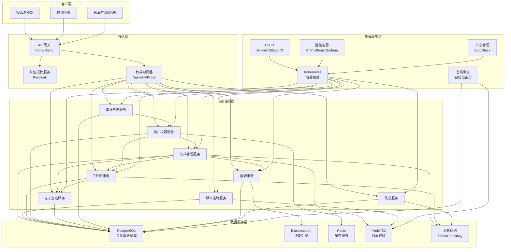

# EDMS系统架构设计文档

## 1. 概述

本文档详细描述了电子文档管理系统(EDMS)的系统架构设计，包括架构风格、组件划分、技术栈选择、系统交互方式、安全架构和部署架构等内容。架构设计旨在提供一个可扩展、高性能、安全可靠的系统，满足GMP环境下的文档管理需求，并支持与企业其他系统的无缝集成。

## 2. 架构设计原则

### 2.1 核心设计原则

- **微服务架构**: 采用微服务架构，提高系统的可扩展性和可维护性
- **高内聚低耦合**: 各组件职责清晰，接口明确，耦合度低
- **服务自治**: 每个微服务独立部署、独立扩展、独立管理
- **数据隔离**: 各服务数据独立管理，避免直接依赖其他服务的数据
- **API优先**: 所有服务通过API进行通信，确保接口的一致性和标准性
- **可观测性**: 完善的日志、监控和告警机制，确保系统可观测性
- **容错设计**: 设计容错机制，确保系统在部分组件故障时仍能正常运行

### 2.2 合规性原则

- **GMP合规**: 符合药品生产质量管理规范(GMP)要求
- **21 CFR Part 11合规**: 满足电子记录和电子签名法规要求
- **数据完整性**: 确保数据的完整性、可靠性和真实性
- **审计追踪**: 对所有关键操作进行完整的审计记录
- **安全访问**: 严格的身份认证和授权机制

## 3. 系统架构概览

### 3.1 整体架构图

### 3.2 架构层级说明

#### 3.2.1 客户层

客户层是用户与系统交互的入口，包括：
- **Web浏览器**: 提供桌面端用户界面
- **移动应用**: 提供移动端用户界面，支持移动办公场景
- **第三方系统API**: 支持与企业其他系统的集成

#### 3.2.2 接入层

接入层负责系统的统一入口和安全访问控制：
- **API网关**: 提供统一的API入口，负责路由、认证、限流、日志等
- **认证授权服务**: 集中管理用户身份认证和权限授权
- **负载均衡器**: 实现服务的负载均衡和高可用

#### 3.2.3 应用服务层

应用服务层是系统的核心业务逻辑层，包含多个微服务：
- **文档管理服务**: 负责文档的创建、查询、更新和删除等核心功能
- **版本控制服务**: 负责文档版本的创建、管理和对比
- **工作流服务**: 负责文档审核工作流的定义、执行和管理
- **用户权限服务**: 负责用户、角色和权限的管理
- **电子签名服务**: 负责电子签名的创建、验证和管理
- **审计日志服务**: 负责系统操作的审计记录和查询
- **搜索服务**: 负责文档的全文搜索和检索
- **集成服务**: 负责与外部系统的集成和数据交换

#### 3.2.4 数据服务层

数据服务层负责数据的存储、缓存和消息传递：
- **PostgreSQL**: 关系型数据库，存储结构化业务数据
- **Elasticsearch**: 搜索引擎，提供文档的全文检索功能
- **Redis**: 缓存服务，提高系统性能
- **MinIO/S3**: 对象存储，存储文档内容和附件
- **消息队列**: 实现服务间的异步通信和事件驱动

#### 3.2.5 基础设施层

基础设施层提供系统运行的基础环境：
- **Kubernetes**: 容器编排平台，实现服务的自动化部署和管理
- **CI/CD**: 持续集成和持续部署，实现代码的自动化构建和部署
- **监控告警**: 监控系统运行状态，及时发现和处理问题
- **日志管理**: 集中管理系统日志，支持日志分析和故障排查
- **备份恢复**: 实现数据的定期备份和恢复

## 4. 微服务组件设计

### 4.1 文档管理服务

#### 4.1.1 功能概述

- **文档CRUD**: 文档的创建、查询、更新和删除
- **文档元数据管理**: 文档元数据的添加、更新和查询
- **文档分类**: 文档的分类管理和导航
- **文档模板**: 文档模板的管理和应用
- **文档预览**: 文档的在线预览功能

#### 4.1.2 技术栈

- **后端框架**: Spring Boot 2.7+
- **ORM框架**: Spring Data JPA/Hibernate
- **缓存**: Redis
- **消息队列**: Kafka
- **文件处理**: Apache POI, PDFBox

#### 4.1.3 API设计

- RESTful API，支持文档的CRUD操作
- 支持分页、排序、过滤查询
- 支持批量操作
- 支持文件上传和下载

### 4.2 版本控制服务

#### 4.2.1 功能概述

- **版本创建**: 创建文档新版本
- **版本管理**: 版本的查询、对比和管理
- **版本回滚**: 回滚到指定版本
- **版本锁定**: 防止版本被意外修改
- **版本比较**: 不同版本间的内容比较

#### 4.2.2 技术栈

- **后端框架**: Spring Boot 2.7+
- **ORM框架**: Spring Data JPA
- **文件存储**: MinIO/S3
- **版本比较**: DiffUtils

#### 4.2.3 API设计

- RESTful API，支持版本的CRUD操作
- 支持版本历史查询
- 支持版本比较接口
- 支持版本回滚接口

### 4.3 工作流服务

#### 4.3.1 功能概述

- **工作流定义**: 工作流模板的创建、编辑和管理
- **工作流实例**: 工作流实例的创建、执行和管理
- **任务管理**: 工作流任务的分配、执行和跟踪
- **状态转换**: 工作流状态的转换和管理
- **通知提醒**: 任务通知和提醒

#### 4.3.2 技术栈

- **后端框架**: Spring Boot 2.7+
- **工作流引擎**: Flowable/Camunda
- **ORM框架**: Spring Data JPA
- **消息队列**: Kafka/RabbitMQ

#### 4.3.3 API设计

- RESTful API，支持工作流定义和实例管理
- 支持任务查询和操作接口
- 支持工作流状态查询接口
- 支持事件通知接口

### 4.4 用户权限服务

#### 4.4.1 功能概述

- **用户管理**: 用户的创建、查询、更新和删除
- **角色管理**: 角色的创建、查询、更新和删除
- **权限管理**: 权限的创建、查询、更新和删除
- **用户角色分配**: 为用户分配角色
- **角色权限分配**: 为角色分配权限
- **访问控制**: 基于RBAC和ABAC的访问控制

#### 4.4.2 技术栈

- **后端框架**: Spring Boot 2.7+
- **安全框架**: Spring Security
- **ORM框架**: Spring Data JPA
- **缓存**: Redis
- **认证集成**: OAuth2/OIDC

#### 4.4.3 API设计

- RESTful API，支持用户、角色和权限管理
- 支持权限验证接口
- 支持令牌管理接口
- 支持密码重置和账号管理接口

### 4.5 电子签名服务

#### 4.5.1 功能概述

- **签名创建**: 创建电子签名
- **签名验证**: 验证电子签名的有效性
- **签名管理**: 签名记录的查询和管理
- **签名策略**: 签名策略的定义和应用
- **签名审计**: 签名操作的审计记录

#### 4.5.2 技术栈

- **后端框架**: Spring Boot 2.7+
- **加密库**: Bouncy Castle
- **ORM框架**: Spring Data JPA
- **哈希算法**: SHA-256

#### 4.5.3 API设计

- RESTful API，支持签名的创建和验证
- 支持签名查询接口
- 支持签名策略管理接口
- 支持签名审计查询接口

### 4.6 审计日志服务

#### 4.6.1 功能概述

- **日志记录**: 记录系统操作日志
- **日志查询**: 查询和过滤审计日志
- **日志分析**: 日志的统计和分析
- **日志导出**: 导出审计日志
- **日志归档**: 日志的归档和清理

#### 4.6.2 技术栈

- **后端框架**: Spring Boot 2.7+
- **ORM框架**: Spring Data JPA
- **消息队列**: Kafka
- **日志收集**: Logstash

#### 4.6.3 API设计

- RESTful API，支持日志的查询和导出
- 支持日志统计接口
- 支持日志归档接口
- 支持日志配置接口

### 4.7 搜索服务

#### 4.7.1 功能概述

- **全文索引**: 文档内容和元数据的索引
- **全文搜索**: 支持关键词搜索
- **高级搜索**: 支持多条件组合搜索
- **搜索建议**: 提供搜索建议和自动完成
- **搜索结果排序**: 搜索结果的排序和优化

#### 4.7.2 技术栈

- **后端框架**: Spring Boot 2.7+
- **搜索引擎**: Elasticsearch
- **索引工具**: Logstash/自定义索引器
- **文本处理**: NLP处理库

#### 4.7.3 API设计

- RESTful API，支持搜索查询
- 支持索引管理接口
- 支持搜索建议接口
- 支持搜索统计接口

### 4.8 集成服务

#### 4.8.1 功能概述

- **认证系统集成**: 与企业认证系统集成
- **QMS系统集成**: 与质量管理系统集成
- **MES系统集成**: 与制造执行系统集成
- **ERP系统集成**: 与企业资源计划系统集成
- **外部审计集成**: 支持外部审计系统接入
- **数据同步**: 确保系统间数据同步

#### 4.8.2 技术栈

- **后端框架**: Spring Boot 2.7+
- **集成框架**: Spring Integration
- **消息队列**: Kafka/RabbitMQ
- **API网关**: Spring Cloud Gateway
- **序列化**: JSON/XML

#### 4.8.3 API设计

- RESTful API，支持系统间数据交换
- 支持Webhook接口
- 支持数据同步接口
- 支持集成状态查询接口

## 5. 数据架构设计

### 5.1 数据库设计

#### 5.1.1 PostgreSQL数据库

- **核心业务数据**: 用户、角色、权限、文档元数据、版本信息、工作流定义、工作流实例、任务信息、电子签名记录、审计日志等
- **数据库集群**: 采用主从复制架构，确保数据高可用
- **分区策略**: 按时间或业务维度进行表分区
- **备份策略**: 定期全量备份和增量备份

#### 5.1.2 Elasticsearch

- **文档内容索引**: 文档全文内容索引
- **文档元数据索引**: 文档元数据索引
- **搜索优化**: 分词、同义词、相关性排序等
- **索引生命周期**: 索引的创建、更新、优化和归档

#### 5.1.3 Redis缓存

- **会话缓存**: 用户会话信息
- **权限缓存**: 用户权限信息
- **热点数据缓存**: 频繁访问的数据
- **分布式锁**: 实现分布式环境下的并发控制

#### 5.1.4 MinIO/S3对象存储

- **文档内容存储**: 文档文件内容
- **版本存储**: 文档各版本的文件内容
- **附件存储**: 文档附件和图片等
- **生命周期管理**: 文件的生命周期管理和归档

### 5.2 数据同步与集成

- **消息驱动**: 基于事件的异步数据同步
- **定时同步**: 定期执行的数据同步任务
- **变更捕获**: 捕获数据变更并同步到相关系统
- **数据验证**: 确保同步数据的一致性和准确性

## 6. 安全架构设计

### 6.1 安全模型

- **分层安全模型**: 网络层、应用层、数据层的多层次安全防护
- **深度防御策略**: 采用深度防御策略，多种安全措施协同工作
- **最小权限原则**: 用户只能访问完成工作所需的最小权限集
- **零信任架构**: 不自动信任任何网络或用户，持续验证和授权

### 6.2 身份认证与授权

- **单点登录(SSO)**: 支持OAuth2/OIDC协议的单点登录
- **多因素认证(MFA)**: 支持短信、邮件、认证器等多因素认证
- **会话管理**: 安全的会话创建、验证和销毁
- **令牌管理**: JWT令牌的生成、验证和刷新
- **权限验证**: 细粒度的权限验证和访问控制

### 6.3 数据安全

- **传输加密**: 使用TLS/SSL加密数据传输
- **存储加密**: 敏感数据加密存储
- **数据脱敏**: 敏感数据脱敏显示
- **访问控制**: 基于角色和属性的细粒度访问控制
- **数据备份与恢复**: 安全的数据备份和恢复机制

### 6.4 应用安全

- **输入验证**: 严格的输入验证，防止注入攻击
- **输出编码**: 输出数据的安全编码，防止XSS攻击
- **CSRF防护**: 跨站请求伪造防护
- **安全头**: HTTP安全响应头设置
- **依赖检查**: 定期检查和更新依赖，修复安全漏洞

### 6.5 安全审计

- **全面审计**: 对所有关键操作进行完整审计记录
- **不可篡改**: 审计日志的不可篡改设计
- **安全存储**: 审计日志的安全存储和备份
- **审计分析**: 审计日志的分析和告警

## 7. 部署架构设计

### 7.1 容器化部署

- **Docker容器**: 所有服务容器化，确保环境一致性
- **Kubernetes编排**: 使用Kubernetes进行容器编排和管理
- **容器镜像仓库**: 私有容器镜像仓库，管理应用镜像
- **CI/CD流水线**: 自动化的持续集成和持续部署

### 7.2 高可用设计

- **服务冗余**: 核心服务多实例部署
- **负载均衡**: 服务负载均衡，分发请求
- **故障转移**: 自动故障检测和转移
- **数据复制**: 数据多副本复制，确保数据可用性
- **灾备方案**: 异地灾备，确保业务连续性

### 7.3 可扩展性设计

- **水平扩展**: 支持服务的水平扩展，应对流量增长
- **自动扩缩容**: 基于负载的自动扩缩容
- **资源隔离**: 服务间资源隔离，避免相互影响
- **独立部署**: 服务独立部署，支持灵活升级

### 7.4 环境分离

- **开发环境**: 开发人员使用的开发环境
- **测试环境**: 系统测试和集成测试环境
- **预生产环境**: 生产环境前的验证环境
- **生产环境**: 正式的生产环境
- **环境一致性**: 确保各环境配置的一致性

## 8. 性能优化设计

### 8.1 应用性能优化

- **缓存策略**: 多级缓存策略，减少数据库访问
- **异步处理**: 非实时操作异步处理
- **连接池优化**: 数据库连接池和HTTP连接池优化
- **代码优化**: 高效的算法和数据结构
- **JVM调优**: JVM参数优化，提高运行效率

### 8.2 数据库性能优化

- **索引优化**: 合理的索引设计和优化
- **查询优化**: SQL查询优化
- **数据分区**: 表分区提高查询性能
- **读写分离**: 数据库读写分离
- **缓存机制**: 数据库缓存机制

### 8.3 网络性能优化

- **CDN加速**: 静态资源CDN加速
- **压缩传输**: 数据压缩传输
- **API网关优化**: API网关性能优化
- **网络拓扑**: 优化网络拓扑，减少延迟

### 8.4 监控与告警

- **性能监控**: 系统性能指标监控
- **资源监控**: 服务器资源使用监控
- **应用监控**: 应用运行状态监控
- **告警机制**: 基于阈值的告警机制
- **性能分析**: 定期性能分析和优化

## 9. 总结

本文档详细描述了电子文档管理系统(EDMS)的系统架构设计，包括架构风格、组件划分、技术栈选择、系统交互方式、安全架构和部署架构等内容。架构设计遵循微服务架构原则，确保系统的可扩展性、高性能、安全可靠，并满足GMP环境下的合规性要求。

系统采用分层架构，包括客户层、接入层、应用服务层、数据服务层和基础设施层，各层职责清晰，耦合度低。应用服务层划分为多个微服务，每个服务独立部署、独立扩展，支持系统的灵活演进和持续集成。

数据架构采用多种数据存储技术，满足不同类型数据的存储需求，确保数据的安全性、完整性和可用性。安全架构采用多层次安全防护，包括身份认证、授权、数据加密、访问控制等，确保系统和数据的安全。

部署架构采用容器化和云原生技术，支持系统的高可用、可扩展和自动化部署，提高系统的可靠性和运维效率。性能优化设计涵盖应用、数据库、网络等多个层面，确保系统的高性能和良好的用户体验。

在系统实施过程中，应严格按照本文档的架构设计进行系统开发和部署，同时根据实际需求和环境进行适当的调整和优化，确保系统的成功实施和稳定运行。
