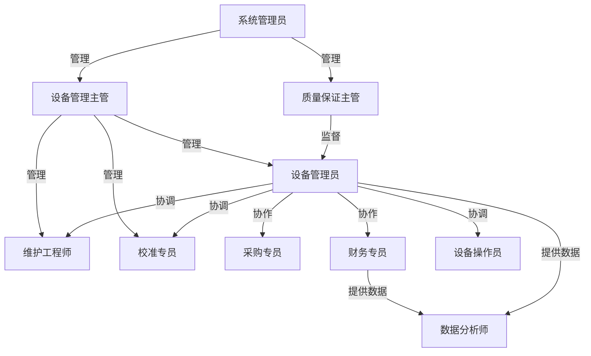
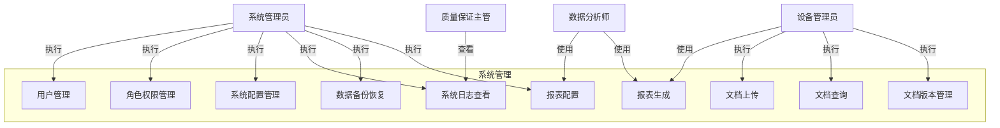

# 设备管理系统 - 用例图和用例描述

## 文档信息
- **文档名称**: 设备管理系统用例图和用例描述
- **版本**: V1.0
- **创建日期**: [当前日期]
- **更新日期**: [更新日期]
- **作者**: [作者姓名]
- **审核人**: [审核人姓名]
- **生效日期**: [生效日期]

## 目录
- [文档信息](#文档信息)
- [概述](#概述)
  - [文档目的](#文档目的)
  - [术语定义](#术语定义)
- [用户角色定义](#用户角色定义)
- [系统用例图](#系统用例图)
  - [总体用例图](#总体用例图)
  - [设备生命周期管理用例图](#设备生命周期管理用例图)
  - [系统管理用例图](#系统管理用例图)
- [用例详细描述](#用例详细描述)
- [附录](#附录)

## 概述

### 文档目的
本文档通过用例图和用例描述的形式，详细展示了设备管理系统的功能需求和用户交互。用例模型是从用户角度描述系统功能的工具，它定义了系统的外部行为和使用场景，为系统设计、开发和测试提供了重要依据。本文档旨在确保系统开发团队和业务部门对系统功能有共同的理解，明确系统的边界和用户角色的职责。

### 术语定义
- **用例(Use Case)**: 描述系统如何与外部交互以实现特定目标的行为序列
- **参与者(Actor)**: 与系统交互的外部实体，可以是用户、其他系统或硬件设备
- **用例图(Use Case Diagram)**: 展示用例、参与者及其关系的图形表示
- **系统边界(System Boundary)**: 定义系统范围的边界线，区分系统内部和外部
- **关联关系(Association)**: 表示参与者与用例之间的交互关系
- **包含关系(Include)**: 表示一个用例包含另一个用例的功能
- **扩展关系(Extend)**: 表示一个用例可以扩展另一个用例的功能
- **设备**: 用于药品生产、检验、包装等活动的仪器、设备、设施等
- **GMP**: 药品生产质量管理规范(Good Manufacturing Practice)
- **维护**: 为保持设备正常运行而进行的各类活动
- **校准**: 确定测量设备与可追溯到国际或国家标准的测量标准之间的关系的一系列操作

## 用户角色定义

| 角色名称 | 角色ID | 角色描述 | 主要职责 |
|---------|--------|---------|--------|
| 系统管理员 | SYS-ADM | 负责系统整体配置和管理，拥有系统最高权限 | 系统初始化、用户管理、权限分配、系统维护 |
| 质量保证主管 | QA-SUP | 负责质量管理体系的维护和监督，确保系统符合GMP要求 | 质量政策制定、审核、合规检查、质量报告审批 |
| 设备管理主管 | EQ-SUP | 负责设备管理部门的整体工作，监督设备全生命周期管理 | 设备政策制定、资源分配、人员管理、审批决策 |
| 设备管理员 | EQ-ADM | 负责设备日常管理和维护，包括设备信息维护、状态管理等 | 设备信息管理、状态更新、报表生成、协调维护 |
| 维护工程师 | EQ-MNT | 负责设备的维护保养和故障维修 | 维护计划执行、故障维修、备件管理、设备调试 |
| 校准专员 | EQ-CAL | 负责设备的校准和验证工作 | 校准计划执行、校准记录维护、证书管理、偏差处理 |
| 设备操作员 | EQ-OPR | 负责设备的日常操作和基本维护 | 设备操作、使用记录、简单维护、异常报告 |
| 采购专员 | PUR-SPC | 负责设备采购和供应商管理 | 采购申请处理、订单管理、到货验收、供应商评估 |
| 财务专员 | FIN-SPC | 负责设备资产和财务相关管理 | 资产核算、成本分析、预算管理 |
| 数据分析师 | DAT-ANA | 负责系统数据分析和报表生成 | 数据挖掘、报表定制、趋势分析 |

### 角色关系图

## 系统用例图

### 总体用例图

```mermaid
flowchart TD
    subgraph "设备管理系统"
        UC1[设备基础信息管理]
        UC2[设备采购与验收管理]
        UC3[设备维护管理]
        UC4[设备校准管理]
        UC5[设备故障管理]
        UC6[设备状态管理]
        UC7[设备备件管理]
        UC8[设备报废管理]
        UC9[系统管理]
        UC10[报表管理]
        UC11[文档管理]
    end
    SYS_ADM[系统管理员] -->|执行| UC9
    QA_SUP[质量保证主管] -->|监督| UC3
    QA_SUP -->|监督| UC4
    QA_SUP -->|审核| UC8
    EQ_SUP[设备管理主管] -->|管理| UC1
    EQ_SUP -->|审批| UC2
    EQ_SUP -->|审批| UC6
    EQ_SUP -->|审批| UC8
    EQ_SUP -->|查看| UC10
    EQ_ADM[设备管理员] -->|执行| UC1
    EQ_ADM -->|执行| UC2
    EQ_ADM -->|协调| UC3
    EQ_ADM -->|协调| UC4
    EQ_ADM -->|处理| UC5
    EQ_ADM -->|执行| UC6
    EQ_ADM -->|管理| UC7
    EQ_ADM -->|执行| UC8
    EQ_ADM -->|生成| UC10
    EQ_ADM -->|管理| UC11
    EQ_MNT[维护工程师] -->|执行| UC3
    EQ_MNT -->|处理| UC5
    EQ_MNT -->|使用| UC7
    EQ_CAL[校准专员] -->|执行| UC4
    EQ_OPR[设备操作员] -->|报告| UC5
    EQ_OPR -->|使用| UC1
    PUR_SPC[采购专员] -->|执行| UC2
    FIN_SPC[财务专员] -->|参与| UC2
    FIN_SPC -->|参与| UC8
    FIN_SPC -->|参与| UC10
    DAT_ANA[数据分析师] -->|分析| UC10
```

### 设备生命周期管理用例图

```mermaid
flowchart TD
    subgraph "设备生命周期管理"
        UC2_1[采购申请管理]
        UC2_2[采购订单管理]
        UC2_3[到货验收管理]
        UC1_1[设备信息录入]
        UC1_2[设备信息查询]
        UC3_1[维护计划管理]
        UC3_2[维护任务执行]
        UC4_1[校准计划管理]
        UC4_2[校准任务执行]
        UC5_1[故障报修]
        UC5_2[故障处理]
        UC6_1[设备启用]
        UC6_2[设备停用]
        UC8_1[报废申请管理]
        UC8_2[报废执行]
    end
    EQ_SUP[设备管理主管] -->|审批| UC2_1
    EQ_SUP -->|审批| UC6_1
    EQ_SUP -->|审批| UC6_2
    EQ_SUP -->|审批| UC8_1
    EQ_ADM[设备管理员] -->|创建| UC2_1
    EQ_ADM -->|执行| UC1_1
    EQ_ADM -->|执行| UC1_2
    EQ_ADM -->|创建| UC3_1
    EQ_ADM -->|创建| UC4_1
    EQ_ADM -->|处理| UC5_1
    EQ_ADM -->|执行| UC6_1
    EQ_ADM -->|执行| UC6_2
    EQ_ADM -->|创建| UC8_1
    PUR_SPC[采购专员] -->|执行| UC2_2
    PUR_SPC -->|执行| UC2_3
    EQ_MNT[维护工程师] -->|执行| UC3_2
    EQ_MNT -->|执行| UC5_2
    EQ_CAL[校准专员] -->|执行| UC4_2
    EQ_OPR[设备操作员] -->|提交| UC5_1
    FIN_SPC[财务专员] -->|参与| UC8_2
```

### 系统管理用例图

## 用例详细描述

### 用例1: 设备基础信息管理

**用例ID**: EQ-UC-001

**用例名称**: 设备基础信息管理

**参与者**: 设备管理员, 设备管理主管, 设备操作员

**用例描述**: 该用例允许设备管理员录入、查询、修改和维护设备的基础信息，包括设备编号、名称、型号、制造商、供应商、采购日期、价格等。设备管理主管可以审核设备信息，设备操作员可以查询设备基本信息。

**前置条件**: 参与者已成功登录系统，拥有相应的操作权限。

**后置条件**: 设备信息被成功录入、查询、修改或维护，且数据准确完整。

**基本事件流**:
1. 设备管理员登录系统，进入设备管理模块。
2. 选择"设备基础信息管理"功能。
3. 系统显示设备列表和操作选项（添加、查询、修改、删除等）。
4. 根据需要选择相应操作：
   a. 添加设备：填写设备基础信息，上传相关文档，提交审核。
   b. 查询设备：输入查询条件，查看符合条件的设备信息。
   c. 修改设备：选择要修改的设备，修改相应信息，提交审核。
   d. 删除设备：选择要删除的设备（仅未投入使用的设备），确认删除。
5. 系统保存操作结果，更新设备信息。
6. 设备管理主管审核设备信息的变更。
7. 设备操作员可以查询设备基本信息。

**扩展事件流**:
- **E1: 设备信息不完整**
  1. 当设备管理员提交的设备信息不完整时，系统提示缺少的必要信息。
  2. 设备管理员补充完整信息后重新提交。

- **E2: 设备编号重复**
  1. 当系统检测到设备编号重复时，提示设备编号已存在。
  2. 设备管理员修改设备编号后重新提交。

- **E3: 审核不通过**
  1. 当设备管理主管审核设备信息不通过时，系统通知设备管理员。
  2. 设备管理员修改设备信息后重新提交审核。

**数据需求**:
- 设备编号、名称、型号、制造商、供应商、采购日期、价格
- 设备类别、重要程度、所在部门、所在位置
- 设备文档（说明书、合格证、技术参数表等）
- 设备关键联系人信息

**业务规则**:
- 设备编号必须唯一
- 关键设备必须上传完整的技术文档
- 设备信息修改需要经过审核
- 已投入使用的设备不能删除，只能停用

### 用例2: 设备采购与验收管理

**用例ID**: EQ-UC-002

**用例名称**: 设备采购与验收管理

**参与者**: 设备管理员, 设备管理主管, 采购专员

**用例描述**: 该用例允许设备管理员提交采购申请，设备管理主管审批采购申请，采购专员执行采购和到货验收，确保设备采购和验收流程规范有序。

**前置条件**: 参与者已成功登录系统，拥有相应的操作权限。

**后置条件**: 采购申请被审批，设备被成功采购和验收，相关信息被记录。

**基本事件流**:
1. 设备管理员登录系统，进入设备管理模块。
2. 选择"设备采购与验收管理"功能中的"采购申请"。
3. 填写采购申请表，包括设备名称、型号、预算、技术要求等。
4. 提交采购申请。
5. 设备管理主管接收到采购申请审核通知。
6. 设备管理主管审核采购申请，决定批准或拒绝。
7. 采购申请批准后，采购专员接收到执行采购的通知。
8. 采购专员根据采购申请执行采购，记录采购订单信息。
9. 设备到货后，采购专员、设备管理员和质量部门共同进行验收。
10. 采购专员在系统中记录验收结果。
11. 验收合格的设备进入安装和调试阶段。

**扩展事件流**:
- **E1: 采购申请被拒绝**
  1. 当设备管理主管拒绝采购申请时，系统通知设备管理员。
  2. 设备管理员可以修改采购申请后重新提交，或取消采购申请。

- **E2: 验收不合格**
  1. 当设备验收不合格时，采购专员记录不合格原因。
  2. 采购专员联系供应商进行退货或换货处理。
  3. 处理完成后，更新验收记录。

**数据需求**:
- 采购申请表（设备名称、型号、数量、预算、技术要求、申请部门等）
- 采购订单信息（订单编号、供应商、金额、交货日期等）
- 到货验收记录（验收日期、验收人员、验收结果、问题描述等）

**业务规则**:
- 采购申请必须包含明确的设备需求和预算
- 超过一定金额的采购申请需要多级审批
- 设备验收必须有多方参与（采购、设备管理、质量部门）
- 验收记录必须完整保存

### 用例3: 设备维护管理

**用例ID**: EQ-UC-003

**用例名称**: 设备维护管理

**参与者**: 设备管理员, 维护工程师, 设备管理主管

**用例描述**: 该用例允许设备管理员制定维护计划，系统根据计划自动生成维护任务，维护工程师执行维护任务并记录结果，设备管理主管监督维护工作，确保设备得到定期维护保养。

**前置条件**: 参与者已成功登录系统，拥有相应的操作权限。设备信息已在系统中录入。

**后置条件**: 维护计划被制定，维护任务被执行，维护记录被保存，设备状态被更新。

**基本事件流**:
1. 设备管理员登录系统，进入设备管理模块。
2. 选择"设备维护管理"功能中的"维护计划制定"。
3. 为设备或设备组创建维护计划，设置维护周期、内容、责任人等。
4. 保存维护计划。
5. 系统根据维护计划自动生成维护任务。
6. 维护工程师接收到维护任务通知。
7. 维护工程师执行维护任务，记录维护过程和结果。
8. 设备管理员审核维护记录。
9. 系统更新设备状态和下次维护日期。

**扩展事件流**:
- **E1: 维护任务延期**
  1. 当维护工程师无法按时完成维护任务时，可以申请延期。
  2. 设备管理员审批延期申请。
  3. 维护任务延期执行。

- **E2: 维护中发现问题**
  1. 当维护工程师在维护过程中发现设备问题时，记录问题详情。
  2. 根据问题严重程度，创建故障工单或通知设备管理员。
  3. 问题解决后，继续完成维护任务。

**数据需求**:
- 维护计划（设备ID、维护周期、维护内容、责任人、开始日期等）
- 维护任务（任务ID、设备ID、任务内容、执行人员、计划执行日期等）
- 维护记录（任务ID、执行日期、执行结果、问题描述、使用备件等）

**业务规则**:
- 关键设备必须制定预防性维护计划
- 维护计划必须符合设备制造商的建议
- 维护记录必须详细完整
- 维护后设备状态必须更新

### 用例4: 设备校准管理

**用例ID**: EQ-UC-004

**用例名称**: 设备校准管理

**参与者**: 校准专员, 设备管理员, 质量保证主管

**用例描述**: 该用例允许校准专员制定校准计划，系统根据计划自动生成校准任务，校准专员执行校准并记录结果，质量保证主管监督校准工作，确保设备测量结果的准确性和可靠性。

**前置条件**: 参与者已成功登录系统，拥有相应的操作权限。设备信息已在系统中录入。

**后置条件**: 校准计划被制定，校准任务被执行，校准记录被保存，校准证书被签发，设备校准状态被更新。

**基本事件流**:
1. 校准专员登录系统，进入设备管理模块。
2. 选择"设备校准管理"功能中的"校准计划制定"。
3. 为设备创建校准计划，设置校准周期、方法、标准等。
4. 保存校准计划。
5. 系统根据校准计划自动生成校准任务。
6. 校准专员接收到校准任务通知。
7. 校准专员准备校准所需的标准器具和环境。
8. 校准专员执行校准，记录校准过程和数据。
9. 校准专员评估校准结果，决定设备是否合格。
10. 对于校准合格的设备，签发校准证书。
11. 系统更新设备校准状态和下次校准日期。

**扩展事件流**:
- **E1: 校准不合格**
  1. 当设备校准不合格时，校准专员记录不合格原因和偏差值。
  2. 根据偏差程度，决定是否需要调整设备或停用设备。
  3. 对于可调整的设备，调整后重新校准；对于不可调整的设备，设置为停用状态。
  4. 记录处理结果和调整数据。

- **E2: 标准器具失效**
  1. 当发现使用的标准器具失效时，立即停止校准工作。
  2. 更换合格的标准器具后重新开始校准。
  3. 记录事件并通知质量保证主管。

**数据需求**:
- 校准计划（设备ID、校准周期、校准方法、校准标准、责任人等）
- 校准任务（任务ID、设备ID、任务内容、执行人员、计划执行日期等）
- 校准记录（任务ID、执行日期、校准数据、偏差值、结果判定等）
- 校准证书（证书编号、设备ID、校准日期、有效期、校准机构、校准人员等）

**业务规则**:
- 用于关键测量的设备必须定期校准
- 校准周期必须符合法规和质量标准要求
- 校准必须由有资质的人员执行
- 校准标准器必须可追溯到国际或国家标准
- 校准不合格的设备不得使用，需进行维修或停用
- 校准记录和证书必须保存至少5年

### 用例5: 设备故障管理

**用例ID**: EQ-UC-005

**用例名称**: 设备故障管理

**参与者**: 设备操作员, 设备管理员, 维护工程师, 设备管理主管

**用例描述**: 该用例允许设备操作员报告设备故障，设备管理员处理故障报修并分配维修任务，维护工程师执行维修并记录结果，设备管理主管监督重要故障的处理，确保设备故障得到及时处理，减少对生产的影响。

**前置条件**: 参与者已成功登录系统，拥有相应的操作权限。设备信息已在系统中录入。

**后置条件**: 故障被报告、诊断和修复，相关记录被保存，设备状态被更新。

**基本事件流**:
1. 设备操作员发现设备故障，停止使用设备。
2. 设备操作员登录系统，选择"设备故障管理"功能中的"故障报修"。
3. 填写故障报修单，描述故障现象、发生时间等。
4. 提交故障报修单。
5. 设备管理员接收到故障报修通知。
6. 设备管理员审核故障信息，创建故障工单，分配给维护工程师。
7. 维护工程师接收到故障工单通知。
8. 维护工程师到现场检查设备，分析故障原因。
9. 维护工程师制定维修方案，执行维修。
10. 维护工程师测试设备，验证维修效果。
11. 维护工程师记录维修过程和结果，关闭故障工单。
12. 设备管理员审核维修结果，更新设备状态。

**扩展事件流**:
- **E1: 故障无法现场修复**
  1. 当维护工程师无法在现场修复设备时，记录详细情况。
  2. 维护工程师制定详细维修计划，可能需要外部技术支持或更换备件。
  3. 按计划执行维修，定期更新维修进度。

- **E2: 维修后仍有问题**
  1. 当设备维修后测试仍有问题时，维护工程师重新分析故障原因。
  2. 调整维修方案，重新执行维修。
  3. 再次测试验证，直到问题解决。

**数据需求**:
- 故障报修单（设备ID、报修人、故障描述、发生时间、紧急程度等）
- 故障工单（工单ID、设备ID、故障描述、维修人员、分配时间等）
- 维修记录（工单ID、故障原因、维修方法、使用备件、维修结果等）

**业务规则**:
- 关键设备故障必须在2小时内响应
- 故障处理过程必须详细记录
- 修复后的设备必须经过验证才能投入使用
- 重大故障必须进行根本原因分析

### 用例6: 设备状态管理

**用例ID**: EQ-UC-006

**用例名称**: 设备状态管理

**参与者**: 设备管理员, 设备管理主管, 质量保证主管

**用例描述**: 该用例允许设备管理员申请设备状态变更，设备管理主管和质量保证主管审核状态变更申请，设备管理员执行状态变更，确保设备状态准确反映设备实际情况，控制设备使用权限。

**前置条件**: 参与者已成功登录系统，拥有相应的操作权限。设备信息已在系统中录入。

**后置条件**: 设备状态被成功变更，相关记录被保存，通知相关人员。

**基本事件流**:
1. 设备管理员登录系统，进入设备管理模块。
2. 选择"设备状态管理"功能中的"状态变更申请"。
3. 选择要变更状态的设备，填写状态变更申请表，说明变更原因和预计时间。
4. 提交状态变更申请。
5. 设备管理主管接收到状态变更申请审核通知。
6. 设备管理主管审核状态变更申请。
7. 对于关键设备或重大变更，质量保证主管进行二次审核。
8. 审核通过后，设备管理员在系统中执行状态变更。
9. 系统更新设备状态，记录变更原因和时间。
10. 系统通知相关人员设备状态变更信息。

**扩展事件流**:
- **E1: 审核不通过**
  1. 当状态变更申请审核不通过时，系统通知设备管理员。
  2. 设备管理员可以修改申请后重新提交，或取消申请。

- **E2: 紧急状态变更**
  1. 当设备出现紧急情况需要立即变更状态时，设备管理员可以提交紧急状态变更申请。
  2. 系统立即通知审核人进行快速审核。
  3. 在特殊情况下，可以先执行变更，后补审核流程。

**数据需求**:
- 设备状态变更申请表（设备ID、当前状态、目标状态、变更原因、预计时间等）
- 设备状态记录（设备ID、状态、变更时间、变更原因、操作人等）

**业务规则**:
- 设备状态变更必须有合理的原因
- 关键设备的状态变更需要多级审批
- 设备停用必须挂标识并锁定操作权限
- 设备状态变更记录必须完整保存

### 用例7: 设备备件管理

**用例ID**: EQ-UC-007

**用例名称**: 设备备件管理

**参与者**: 设备管理员, 维护工程师, 采购专员

**用例描述**: 该用例允许设备管理员管理备件库存，维护工程师申请和领取备件，采购专员执行备件采购，确保设备维修和维护所需的备件及时供应。

**前置条件**: 参与者已成功登录系统，拥有相应的操作权限。

**后置条件**: 备件库存被管理，备件被及时采购、入库和领用，相关记录被保存。

**基本事件流**:
1. 设备管理员登录系统，进入设备管理模块。
2. 选择"设备备件管理"功能。
3. 管理备件信息，包括添加新备件、更新库存、设置预警值等。
4. 当备件库存低于预警值时，系统自动提示。
5. 设备管理员根据提示提出备件采购申请。
6. 采购专员根据申请执行采购。
7. 备件到货后，设备管理员进行验收和入库。
8. 维护工程师需要使用备件时，提交备件领用申请。
9. 设备管理员审核领用申请，发放备件。
10. 系统更新备件库存信息和使用记录。
11. 设备管理员定期对备件库存进行盘点。

**扩展事件流**:
- **E1: 备件库存不足**
  1. 当维护工程师申请领用备件但库存不足时，系统提示库存不足。
  2. 设备管理员紧急安排采购或寻找替代方案。

- **E2: 备件质量问题**
  1. 当发现入库备件有质量问题时，设备管理员记录问题并联系供应商处理。
  2. 系统更新备件状态为"不合格"，不允许领用。

**数据需求**:
- 备件信息（备件编号、名称、型号、规格、制造商、供应商等）
- 库存信息（备件ID、当前库存、安全库存、预警值、存放位置等）
- 采购申请（备件ID、数量、预算、申请日期等）
- 领用记录（备件ID、领用人、领用数量、领用日期、用途等）

**业务规则**:
- 备件库存必须设置预警值
- 关键备件必须保持足够的安全库存
- 备件领用必须经过审核
- 备件使用必须记录详细信息

### 用例8: 设备报废管理

**用例ID**: EQ-UC-008

**用例名称**: 设备报废管理

**参与者**: 设备管理员, 设备管理主管, 质量保证主管, 财务专员

**用例描述**: 该用例允许设备管理员提交设备报废申请，设备管理主管、质量保证主管和管理层进行审批，财务专员参与财务评估和资产注销，确保报废设备符合报废条件，报废过程符合法规要求。

**前置条件**: 参与者已成功登录系统，拥有相应的操作权限。设备信息已在系统中录入。

**后置条件**: 设备报废申请被审批，设备被成功报废，资产被注销，相关记录被保存。

**基本事件流**:
1. 设备管理员登录系统，进入设备管理模块。
2. 选择"设备报废管理"功能中的"报废申请"。
3. 选择要报废的设备，填写报废申请表，说明报废原因。
4. 提交报废申请。
5. 设备管理部门组织技术人员对设备进行技术评估。
6. 财务专员进行财务评估，确定剩余价值和报废损失。
7. 设备管理主管审核报废申请。
8. 质量保证主管审核报废过程，确保符合GMP要求。
9. 管理层根据设备价值进行最终审批。
10. 审批通过后，设备管理员执行设备报废。
11. 财务专员办理资产注销手续。
12. 设备管理员更新设备状态为"已报废"，归档相关记录。

**扩展事件流**:
- **E1: 审批不通过**
  1. 当报废申请审批不通过时，系统通知设备管理员。
  2. 设备管理员可以修改申请后重新提交，或取消申请。

- **E2: 特殊设备报废**
  1. 对于危险设备或有特殊要求的设备，报废过程需要额外的安全措施或特殊处理。
  2. 设备管理员联系专业机构进行处理，并记录详细过程。

**数据需求**:
- 报废申请表（设备ID、报废原因、预计报废时间、申请人等）
- 技术评估报告（设备状况、报废原因、评估结论等）
- 财务评估报告（剩余价值、报废损失、处理建议等）
- 报废记录（设备ID、报废日期、处理方式、经办人等）
- 资产注销记录（设备ID、注销日期、处理结果等）

**业务规则**:
- 设备报废必须有充分的理由和评估依据
- 关键设备或高价值设备的报废需要多级审批
- 报废过程必须符合环保和安全要求
- 报废记录必须完整保存

### 用例9: 系统管理

**用例ID**: EQ-UC-009

**用例名称**: 系统管理

**参与者**: 系统管理员, 质量保证主管

**用例描述**: 该用例允许系统管理员管理用户账户、角色权限、系统配置、日志查看和数据备份恢复，质量保证主管可以查看系统日志进行审计，确保系统安全、稳定运行。

**前置条件**: 参与者已成功登录系统，拥有系统管理权限。

**后置条件**: 用户和权限被正确管理，系统配置被优化，日志被记录和查看，数据被备份和恢复。

**基本事件流**:
1. 系统管理员登录系统，进入系统管理模块。
2. 选择相应的管理功能：
   a. 用户管理：创建、编辑、启用、禁用用户账户。
   b. 角色权限管理：创建角色，分配权限，管理用户角色。
   c. 系统配置管理：设置系统参数，优化系统性能。
   d. 系统日志查看：查看操作日志，审计系统使用情况。
   e. 数据备份恢复：定期备份系统数据，在需要时恢复数据。
3. 执行相应的管理操作。
4. 系统保存操作结果。
5. 质量保证主管可以查看系统日志进行审计。

**扩展事件流**:
- **E1: 紧急系统维护**
  1. 当系统出现问题需要紧急维护时，系统管理员可以执行紧急维护操作。
  2. 系统管理员通知相关用户系统维护信息。
  3. 维护完成后，系统管理员验证系统功能。

- **E2: 数据恢复**
  1. 当系统数据损坏或丢失时，系统管理员使用备份数据进行恢复。
  2. 恢复后，系统管理员验证数据完整性和系统功能。

**数据需求**:
- 用户信息（用户名、密码、邮箱、部门、状态等）
- 角色信息（角色名称、描述、权限列表等）
- 系统配置参数
- 系统操作日志
- 数据备份文件

**业务规则**:
- 系统管理员账户必须有至少两人拥有
- 用户权限必须遵循最小权限原则
- 系统日志必须完整记录所有关键操作
- 数据备份必须定期执行，并存储在安全位置

### 用例10: 报表管理

**用例ID**: EQ-UC-010

**用例名称**: 报表管理

**参与者**: 设备管理员, 设备管理主管, 数据分析师, 财务专员

**用例描述**: 该用例允许设备管理员、数据分析师配置和生成各种设备管理相关报表，设备管理主管和财务专员查看报表，分析设备管理情况，为决策提供支持。

**前置条件**: 参与者已成功登录系统，拥有相应的操作权限。系统中有足够的数据生成报表。

**后置条件**: 报表被正确配置和生成，数据被分析和应用于决策。

**基本事件流**:
1. 设备管理员或数据分析师登录系统，进入报表管理模块。
2. 选择"报表配置"功能，设置报表类型、数据字段、筛选条件等。
3. 保存报表配置。
4. 选择"报表生成"功能，选择已配置的报表模板或创建临时报表。
5. 设置报表生成参数（时间范围、设备范围等）。
6. 执行报表生成。
7. 系统生成报表并显示。
8. 设备管理员、设备管理主管或财务专员查看报表。
9. 根据需要导出报表为Excel、PDF等格式。
10. 数据分析师进行深度数据分析，生成分析报告。

**扩展事件流**:
- **E1: 报表数据异常**
  1. 当报表数据显示异常时，设备管理员检查数据来源和配置。
  2. 修正数据错误或调整报表配置。
  3. 重新生成报表。

- **E2: 自定义复杂报表**
  1. 当需要生成复杂报表时，数据分析师可以使用高级报表配置功能。
  2. 设置复杂的数据关联和计算公式。
  3. 预览和测试报表，确保数据准确性。

**数据需求**:
- 报表配置（报表名称、类型、数据字段、筛选条件、排序规则等）
- 设备信息数据
- 维护记录数据
- 校准记录数据
- 故障记录数据
- 备件库存数据
- 成本数据

**业务规则**:
- 报表配置必须保存，便于重复使用
- 报表数据必须准确、及时
- 报表生成时间不应过长，影响系统性能
- 敏感报表数据必须有权限控制

### 用例11: 文档管理

**用例ID**: EQ-UC-011

**用例名称**: 文档管理

**参与者**: 设备管理员, 维护工程师, 校准专员

**用例描述**: 该用例允许设备管理员上传、管理设备相关文档，维护工程师和校准专员查看和使用文档，确保设备相关文档集中存储、版本受控、便于访问。

**前置条件**: 参与者已成功登录系统，拥有相应的操作权限。

**后置条件**: 文档被上传、管理和查看，版本被控制，确保文档的准确性和有效性。

**基本事件流**:
1. 设备管理员登录系统，进入文档管理模块。
2. 选择"文档上传"功能，上传设备相关文档（说明书、合格证、校准证书等）。
3. 填写文档信息（文档名称、类型、版本、关联设备等）。
4. 提交文档。
5. 系统保存文档并记录信息。
6. 当文档有新版本时，设备管理员上传新版本，系统自动处理版本控制。
7. 维护工程师、校准专员或其他用户登录系统，选择"文档查询"功能。
8. 根据条件查询所需文档。
9. 查看或下载文档。
10. 设备管理员定期审核文档，确保文档的有效性。

**扩展事件流**:
- **E1: 文档访问权限控制**
  1. 当用户尝试访问无权限的文档时，系统拒绝访问并提示权限不足。
  2. 用户可以向设备管理员申请访问权限。

- **E2: 文档过期或失效**
  1. 当文档过期或失效时，系统自动标记文档状态。
  2. 设备管理员上传新版本或更新文档状态。

**数据需求**:
- 文档信息（文档ID、名称、类型、版本、上传日期、上传人等）
- 文档内容（存储为文件）
- 文档访问权限设置
- 文档版本历史

**业务规则**:
- 文档必须与设备正确关联
- 文档必须有版本控制
- 重要文档必须设置访问权限
- 文档必须定期审核更新

### 用例12: 设备安装与调试管理

**用例ID**: EQ-UC-012

**用例名称**: 设备安装与调试管理

**参与者**: 设备管理员, 维护工程师, 质量保证主管

**用例描述**: 该用例允许设备管理员和维护工程师管理设备的安装和调试过程，记录安装调试数据，质量保证主管监督安装调试活动，确保设备正确安装并能正常运行。

**前置条件**: 参与者已成功登录系统，拥有相应的操作权限。设备已到货验收合格。

**后置条件**: 设备被正确安装和调试，相关记录被保存，设备准备进入验证阶段。

**基本事件流**:
1. 设备管理员登录系统，进入设备管理模块。
2. 选择"设备安装与调试管理"功能。
3. 为已验收的设备创建安装调试计划，包括安装位置、调试内容、责任人等。
4. 保存安装调试计划。
5. 维护工程师根据计划执行设备安装和调试。
6. 维护工程师记录安装调试过程和数据，包括安装位置、连接情况、调试参数等。
7. 设备管理员和质量保证主管监督安装调试过程。
8. 安装调试完成后，维护工程师提交安装调试报告。
9. 设备管理员审核安装调试报告。
10. 审核通过后，设备状态更新为"已安装调试"，准备进入验证阶段。

**扩展事件流**:
- **E1: 安装调试异常**
  1. 当安装调试过程中出现异常时，维护工程师记录异常情况。
  2. 分析异常原因，采取相应措施解决问题。
  3. 问题解决后，继续安装调试过程。

- **E2: 设备调整**
  1. 当设备需要调整以适应现场条件时，维护工程师记录调整内容。
  2. 调整后重新测试，确保设备性能符合要求。

**数据需求**:
- 安装调试计划（设备ID、安装位置、计划日期、责任人等）
- 安装调试记录（设备ID、安装日期、调试参数、测试结果等）
- 安装调试报告（设备ID、安装情况、调试结果、问题及解决方法等）

**业务规则**:
- 设备安装必须符合制造商的安装要求
- 安装调试过程必须有详细记录
- 安装调试完成后必须经过审核才能进入验证阶段

### 用例13: 设备运行记录管理

**用例ID**: EQ-UC-013

**用例名称**: 设备运行记录管理

**参与者**: 设备操作员, 设备管理员

**用例描述**: 该用例允许设备操作员记录设备的运行情况，设备管理员查看和分析运行记录，监控设备性能，为设备维护提供依据。

**前置条件**: 参与者已成功登录系统，拥有相应的操作权限。设备已启用。

**后置条件**: 设备运行记录被保存，运行数据被分析和应用于设备管理。

**基本事件流**:
1. 设备操作员开始使用设备前，登录系统，进入设备运行记录模块。
2. 选择要使用的设备，记录设备启动时间和初始状态。
3. 设备使用过程中，记录关键运行参数和异常情况。
4. 设备使用结束后，记录设备关闭时间和结束状态。
5. 提交运行记录。
6. 设备管理员登录系统，查询和查看设备运行记录。
7. 分析运行数据，识别设备性能趋势和潜在问题。
8. 根据分析结果，优化设备维护计划和使用方式。

**扩展事件流**:
- **E1: 运行异常**
  1. 当设备运行过程中出现异常时，设备操作员立即记录异常情况。
  2. 根据异常严重程度，决定是否继续使用设备或停机报修。

- **E2: 自动数据采集**
  1. 对于支持自动数据采集的设备，系统自动记录设备运行数据。
  2. 设备操作员只需确认数据并补充必要的手动记录。

**数据需求**:
- 设备运行记录（设备ID、操作员、启动时间、关闭时间、运行参数、异常情况等）
- 运行数据分析结果

**业务规则**:
- 设备使用必须记录运行数据
- 异常情况必须及时记录
- 运行记录必须真实准确

### 用例14: 设备验证管理

**用例ID**: EQ-UC-014

**用例名称**: 设备验证管理

**参与者**: 设备管理员, 校准专员, 质量保证主管

**用例描述**: 该用例允许设备管理员、校准专员和质量保证主管管理设备的验证过程，包括IQ（安装确认）、OQ（运行确认）和PQ（性能确认），确保设备符合GMP要求和使用需求。

**前置条件**: 参与者已成功登录系统，拥有相应的操作权限。设备已安装调试完成。

**后置条件**: 设备验证计划被制定和执行，验证记录被保存，验证报告被生成和审批，设备被确认可用。

**基本事件流**:
1. 设备管理员和质量保证主管制定设备验证计划，包括IQ、OQ和PQ的内容、方法和责任人。
2. 保存验证计划。
3. 校准专员和维护工程师执行IQ，确认设备安装符合设计要求。
4. 记录IQ过程和结果。
5. 校准专员和维护工程师执行OQ，确认设备在预期的操作范围内能够正常运行。
6. 记录OQ过程和结果。
7. 校准专员和维护工程师执行PQ，确认设备在常规使用条件下能够持续符合规定的要求。
8. 记录PQ过程和结果。
9. 设备管理员生成验证报告，汇总IQ、OQ和PQ的结果。
10. 质量保证主管审核验证报告。
11. 审核通过后，设备状态更新为"已验证可用"，可以正式投入使用。

**扩展事件流**:
- **E1: 验证失败**
  1. 当验证过程中某项测试失败时，记录失败原因和数据。
  2. 分析原因，采取纠正措施。
  3. 重新执行失败的测试，直到通过。

- **E2: 验证偏差处理**
  1. 当验证过程中出现偏差时，执行偏差处理程序。
  2. 评估偏差对设备性能和产品质量的影响。
  3. 采取相应的纠正和预防措施。

**数据需求**:
- 验证计划（设备ID、验证类型、验证内容、责任人、计划日期等）
- 验证记录（设备ID、验证类型、测试项目、测试数据、结果判定等）
- 验证报告（设备ID、验证结果、结论、偏差及处理、审批意见等）

**业务规则**:
- 关键设备必须进行完整的IQ/OQ/PQ验证
- 验证过程必须有详细记录
- 验证报告必须经过质量部门审核批准
- 验证记录和报告必须保存至少5年

### 用例15: 设备供应商管理

**用例ID**: EQ-UC-015

**用例名称**: 设备供应商管理

**参与者**: 采购专员, 设备管理员, 设备管理主管

**用例描述**: 该用例允许采购专员和设备管理员管理设备供应商信息，包括供应商资质、联系方式、产品目录等，设备管理主管审核供应商信息，确保选择合格的设备供应商。

**前置条件**: 参与者已成功登录系统，拥有相应的操作权限。

**后置条件**: 供应商信息被管理，合格供应商名单被维护，采购决策有依据。

**基本事件流**:
1. 采购专员登录系统，进入供应商管理模块。
2. 选择"供应商信息管理"功能。
3. 添加新供应商信息，包括供应商名称、联系方式、资质证书、产品目录等。
4. 保存供应商信息。
5. 设备管理主管审核供应商信息和资质。
6. 审核通过后，供应商状态更新为"合格"。
7. 采购专员和设备管理员可以查询合格供应商列表。
8. 采购专员在采购设备时，从合格供应商列表中选择供应商。
9. 设备管理员和采购专员定期评估供应商表现，更新供应商信息。

**扩展事件流**:
- **E1: 供应商资质过期**
  1. 当供应商资质即将过期时，系统自动提示。
  2. 采购专员联系供应商更新资质。
  3. 资质更新后，重新审核供应商。

- **E2: 供应商评估不合格**
  1. 当供应商评估不合格时，设备管理员记录评估结果和原因。
  2. 根据评估情况，暂停或取消供应商的合格资格。

**数据需求**:
- 供应商信息（供应商ID、名称、地址、联系方式、联系人等）
- 供应商资质（资质证书、有效期、认证范围等）
- 供应商产品目录
- 供应商评估记录

**业务规则**:
- 供应商必须经过审核才能成为合格供应商
- 供应商资质必须在有效期内
- 定期对供应商进行评估
- 重要设备采购必须从合格供应商处采购

## 附录

### 参考文档
- [设备管理系统总体需求文档](总体需求.md)
- [设备管理系统架构设计文档](架构设计.md)
- [设备管理系统详细需求文档](详细需求.md)
- [设备管理系统角色权限矩阵](角色权限矩阵.md)
- [设备管理系统场景描述和验收标准](场景描述和验收标准.md)
- [设备管理系统用户故事](用户故事.md)
- [设备管理系统业务流程描述](业务流程描述.md)

### 术语表
| 术语 | 解释 |
|------|------|
| 用例 | 描述系统如何与外部交互以实现特定目标的行为序列 |
| 参与者 | 与系统交互的外部实体，可以是用户、其他系统或硬件设备 |
| 用例图 | 展示用例、参与者及其关系的图形表示 |
| 系统边界 | 定义系统范围的边界线，区分系统内部和外部 |
| 关联关系 | 表示参与者与用例之间的交互关系 |
| 包含关系 | 表示一个用例包含另一个用例的功能 |
| 扩展关系 | 表示一个用例可以扩展另一个用例的功能 |
| 设备 | 用于药品生产、检验、包装等活动的仪器、设备、设施等 |
| GMP | 药品生产质量管理规范，确保药品质量的一系列标准和规范 |
| 维护 | 为保持设备正常运行而进行的各类活动 |
| 校准 | 确定测量设备与可追溯到国际或国家标准的测量标准之间的关系的一系列操作 |
| IQ | 安装确认(Installation Qualification)，确认设备已按照设计要求正确安装 |
| OQ | 运行确认(Operational Qualification)，确认设备在预期的操作范围内能够正常运行 |
| PQ | 性能确认(Performance Qualification)，确认设备在常规使用条件下能够持续符合规定的要求 |

### 联系方式
- **产品负责人**: [姓名] - [联系方式]
- **业务流程负责人**: [姓名] - [联系方式]
- **开发负责人**: [姓名] - [联系方式]
- **质量管理负责人**: [姓名] - [联系方式]
- **合规负责人**: [姓名] - [联系方式]
