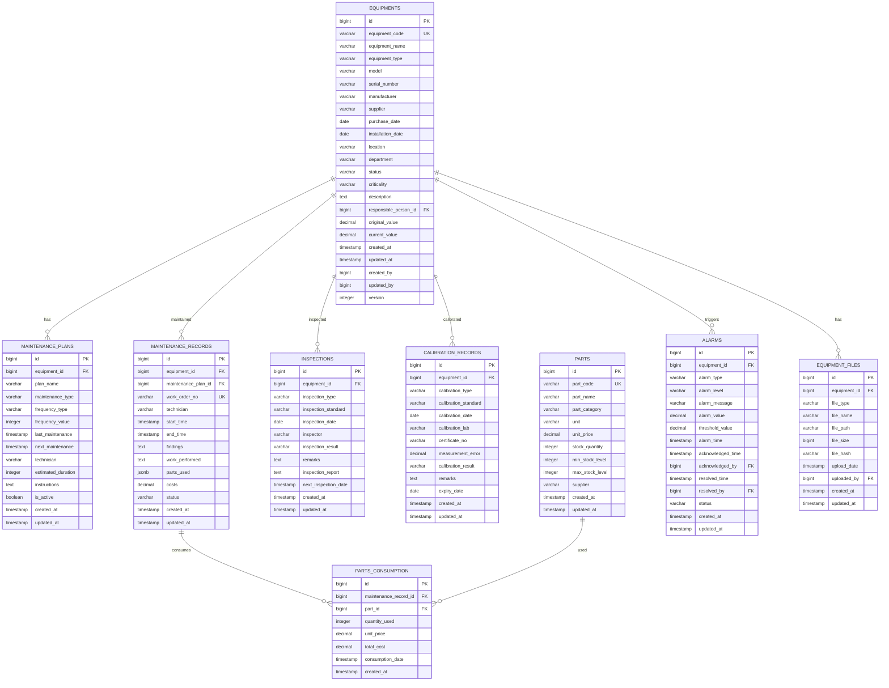

# 设备管理子系统架构设计

## 1. 概述

设备管理子系统采用微服务架构，基于领域驱动设计（DDD）理念，遵循GMP合规要求，提供企业级的设备台账管理、维护管理、状态监控、预防性维护、设备档案管理等功能。系统设计遵循高可用、易扩展、合规可追溯的原则，确保GMP系统的规范性和设备管理的高效性。

设备管理子系统与认证子系统（auth-sys）紧密集成，共享用户身份认证和权限管理机制，确保系统安全性和访问控制的一致性。

设备管理子系统采用微服务架构，基于领域驱动设计（DDD）理念，遵循GMP合规要求，提供企业级的设备台账管理、维护管理、状态监控、预防性维护、设备档案管理等功能。系统设计遵循高可用、易扩展、合规可追溯的原则，确保GMP系统的规范性和设备管理的高效性。

## 2. 系统总体架构

### 2.1 分层架构设计

```
┌────────────────────────────────────────────────────┐
│            表现层 (Presentation Layer)             │
│   ┌─────────────────────────────────────────────┐   │
│   │        REST控制器 (Controllers)            │   │
│   │ - EquipmentController                      │   │
│   │ - MaintenanceController                    │   │
│   │ - InspectionController                     │   │
│   │ - PartsController                          │   │
│   │ - ReportController                         │   │
│   │ - AlarmController                          │   │
│   │ - ArchiveController                        │   │
│   └─────────────────────────────────────────────┘   │
└────────────────────────────────────────────────────┘
                                ▼
┌────────────────────────────────────────────────────┐
│           业务逻辑层 (Business Layer)               │
│   ┌─────────────────────────────────────────────┐   │
│   │       业务服务 (Services)                    │   │
│   │ - EquipmentService                          │   │
│   │ - MaintenanceService                        │   │
│   │ - InspectionService                         │   │
│   │ - PartsService                              │   │
│   │ - ReportService                             │   │
│   │ - AlarmService                              │   │
│   │ - ArchiveService                            │   │
│   │ - AuditLogService                           │   │
│   │                                             │   │
│   │ - 维护计划引擎                              │   │
│   │ - 状态监控引擎                              │   │
│   │ - 预警分析引擎                              │   │
│   │ - 合规检查引擎                              │   │
│   └─────────────────────────────────────────────┘   │
└────────────────────────────────────────────────────┘
                                ▼
┌────────────────────────────────────────────────────┐
│           数据访问层 (Data Access Layer)            │
│   ┌─────────────────────────────────────────────┐   │
│   │       数据仓库 (Repositories)               │   │
│   │ - EquipmentRepository                       │   │
│   │ - MaintenancePlanRepository                 │   │
│   │ - MaintenanceRecordRepository               │   │
│   │ - InspectionRepository                      │   │
│   │ - PartsRepository                           │   │
│   │ - AlarmLogRepository                        │   │
│   │ - EquipmentFileRepository                   │   │
│   │ - CalibrationRepository                     │   │
│   └─────────────────────────────────────────────┘   │
└────────────────────────────────────────────────────┘
                                ▼
┌────────────────────────────────────────────────────┐
│           数据存储层 (Data Storage)                │
└────────────────────────────────────────────────────┘
```

### 2.2 微服务架构图

```
┌─────────────────────────────────────────────────────────────┐
│                  设备管理微服务 (equipment-service:8083)     │
│                                                             │
│  ┌─────────────┬─────────────┬─────────────┬─────────────┐   │
│  │  设备台账   │  维护管理   │  检验校准   │  备件管理   │   │
│  │ Equipment  │ Maintenance │ Inspection  │ Parts       │   │
│  │ Management │ Management  │ Calibration │ Management  │   │
│  └─────────────┴─────────────┴─────────────┴─────────────┘   │
│                                                             │
│  ┌─────────────┬─────────────┬─────────────┬─────────────┐   │
│  │  设备档案   │  报警监控   │  报表分析   │  设备归档   │   │
│  │ Equipment  │ Alarm       │ Reporting   │ Archive     │   │
│  │ Archive    │ Monitoring  │ Service     │ Management  │   │
│  └─────────────┴─────────────┴─────────────┴─────────────┘   │
│                                                             │
│  ┌─────────────┬─────────────┬─────────────┬─────────────┐   │
│  │    审批     │    通知     │    审计     │    集成     │   │
│  │ Workflow    │ Notification│ Audit       │ Integration │   │
│  │ Engine      │ Service     │ Service     │ Service     │   │
│  └─────────────┴─────────────┴─────────────┴─────────────┘   │
└─────────────────────────────────────────────────────────────┘
                                ▼
┌─────────────────────────────────────────────────────────────┐
│                    数据存储与消息服务                       │
│                                                             │
│  PostgreSQL equipment_db    Redis Cache     RabbitMQ        │
│  - equipment                                                  │
│  - maintenance_plans              设备信息缓存               │
│  - maintenance_records             维护记录缓存              │
│  - inspections                     检验记录缓存              │
│  - parts                          备件库存缓存               │
│  - alarms                         报警数据缓存               │
│  - calibration_records                                             │
│                                                             │
│  InfluxDB Time Series                                        │
│  - 设备运行状态时间序列                                       │
│  - 报警事件时间序列                                           │
│  - 性能指标时间序列                                           │
│                                                             │
│  MinIO File Storage                                          │
│  - 设备图片文件                                               │
│  - 设备证书文件                                               │
│  - 维护记录附件                                               │
│  - 检验报告文件                                               │
└─────────────────────────────────────────────────────────────┘
```

## 3. 核心业务域设计

### 3.1 设备台账管理域 (Equipment Master Management Domain)

```
设备台账管理域 (Equipment Master Domain)
├── 设备基础信息管理 (@Post /api/equipment)
│   ├── 创建设备档案 (@Post /api/equipment)
│   ├── 更新设备信息 (@Put /api/equipment/{id})
│   ├── 查询设备档案 (@Get /api/equipment/{id})
│   └── 批量导入设备 (@Post /api/equipment/batch-import)
├── 设备分类管理 (@Post /api/equipment/categories)
│   ├── 设备类型定义 (@Post /api/equipment/types)
│   ├── 设备等级设置 (@Post /api/equipment/levels)
│   └── 设备状态管理 (@Put /api/equipment/{id}/status)
├── 设备位置管理 (@Post /api/equipment/locations)
│   ├── 位置信息管理 (@Post /api/equipment/locations)
│   ├── 设备搬迁记录 (@Post /api/equipment/{id}/move)
│   └── 位置变更历史 (@Get /api/equipment/{id}/location-history)
└── 设备负责人管理 (@Post /api/equipment/responsibilities)
    ├── 设备负责人分配 (@Post /api/equipment/{id}/assign)
    ├── 负责人变更记录 (@Get /api/equipment/{id}/responsibility-history)
    └── 责任人通知 (@Post /api/equipment/{id}/notify)
```

### 3.2 维护管理域 (Maintenance Management Domain)

```
维护管理域 (Maintenance Domain)
├── 预防性维护计划 (@Post /api/maintenance/plans)
│   ├── 维护计划制定 (@Post /api/maintenance/plans)
│   ├── 维护周期设置 (@Put /api/maintenance/plans/{id}/cycle)
│   ├── 维护标准定义 (@Post /api/maintenance/standards)
│   └── 自动提醒设置 (@Put /api/maintenance/plans/{id}/reminder)
├── 故障维修管理 (@Post /api/maintenance/workorders)
│   ├── 故障报告提交 (@Post /api/maintenance/workorders)
│   ├── 维修任务分配 (@Put /api/maintenance/workorders/{id}/assign)
│   ├── 维修进度跟踪 (@Put /api/maintenance/workorders/{id}/progress)
│   └── 维修完成确认 (@Put /api/maintenance/workorders/{id}/complete)
├── 维修记录管理 (@Post /api/maintenance/records)
│   ├── 维修记录录入 (@Post /api/maintenance/records)
│   ├── 维修费用统计 (@Get /api/maintenance/costs)
│   ├── 维修效果评估 (@Post /api/maintenance/effects)
│   └── 维修历史查询 (@Get /api/maintenance/history/{equipmentId}")
├── 备件管理 (@Post /api/maintenance/parts)
│   ├── 备件库存管理 (@Post /api/parts/inventory)
│   ├── 备件消耗记录 (@Post /api/maintenance/parts/consumption)
│   ├── 备件采购申请 (@Post /api/parts/purchase)
│   └── 备件成本分析 (@Get /api/parts/costs)
└── 维护绩效分析 (@Post /api/maintenance/analytics)
    ├── 维护效率分析 (@Get /api/maintenance/efficiency")
    ├── 设备可靠性分析 (@Get /api/maintenance/reliability")
    └── 维护成本分析 (@Get /api/maintenance/cost-analysis")
```

### 3.3 检验校准域 (Inspection Calibration Domain)

```
检验校准域 (Inspection Calibration Domain)
├── 检验计划管理 (@Post /api/inspection/plans)
│   ├── 检验计划制定 (@Post /api/inspection/plans)
│   ├── 检验周期设置 (@Put /api/inspection/plans/{id}/cycle)
│   ├── 检验标准定义 (@Post /api/inspection/standards)
│   └── 自动提醒设置 (@Put /api/inspection/plans/{id}/reminder)
├── 检验记录管理 (@Post /api/inspection/records)
│   ├── 检验记录录入 (@Post /api/inspection/records)
│   ├── 检验结果评价 (@Put /api/inspection/records/{id}/evaluate")
│   ├── 检验报告生成 (@Get /api/inspection/records/{id}/report")
│   └── 检验历史查询 (@Get /api/inspection/history/{equipmentId}")
├── 校准管理 (@Post /api/calibration)
│   ├── 校准计划制定 (@Post /api/calibration/plans)
│   ├── 校准执行记录 (@Post /api/calibration/records)
│   ├── 校准证书管理 (@Post /api/calibration/certificates")
│   └── 校准结果跟踪 (@Get /api/calibration/results/{equipmentId}")
├── 合规性检查 (@Post /api/compliance/inspection)
│   ├── GMP检验要求 (@Post /api/compliance/gmp/inspection")
│   ├── 法定检验记录 (@Post /api/compliance/statutory/inspection")
│   ├── 检验合规性验证 (@Get /api/compliance/{equipmentId}/compliance")
│   └── 违规处理 (@Post /api/compliance/violations")
└── 检验数据分析 (@Post /api/inspection/analytics)
    ├── 检验趋势分析 (@Get /api/inspection/trends")
    ├── 检验合格率统计 (@Get /api/inspection/quality-rate")
    └── 检验费用分析 (@Get /api/inspection/cost-analysis")
```

### 3.4 设备档案域 (Equipment Archive Domain)

```
设备档案域 (Equipment Archive Domain)
├── 设备文档管理 (@Post /api/archive/documents)
│   ├── 技术文档上传 (@Post /api/archive/technical-documents")
│   ├── 证书文件管理 (@Post /api/archive/certificates")
│   ├── 维修记录存档 (@Post /api/archive/maintenance-records")
│   └── 检验报告存档 (@Post /api/archive/inspection-reports")
├── 文档版本控制 (@Post /api/archive/version-control")
│   ├── 文档版本管理 (@Post /api/archive/documents/{id}/versions")
│   ├── 文档变更记录 (@Get /api/archive/documents/{id}/change-log")
│   └── 文档审核流程 (@Post /api/archive/documents/{id}/approval")
├── 文档检索查询 (@Post /api/archive/search")
│   ├── 按设备查询 (@Get /api/archive/equipment/{equipmentId}")
│   ├── 按文档类型查询 (@Get /api/archive/type/{type}")
│   ├── 按时间范围查询 (@Get /api/archive/date-range")
│   └── 全文检索 (@Post /api/archive/full-text-search")
└── 文档生命周期管理 (@Post /api/archive/lifecycle")
    ├── 文档到期提醒 (@Get /api/archive/expiring")
    ├── 文档有效性验证 (@Post /api/archive/validate")
    ├── 文档归档处理 (@Post /api/archive/archive")
    └── 文档销毁处理 (@Post /api/archive/destroy")
```

### 3.5 报警监控域 (Alarm Monitoring Domain)

```
报警监控域 (Alarm Monitoring Domain)
├── 报警规则管理 (@Post /api/alarm/rules)
│   ├── 报警条件设置 (@Post /api/alarm/rules/conditions")
│   ├── 报警级别定义 (@Post /api/alarm/levels")
│   ├── 报警阈值配置 (@Put /api/alarm/rules/{id}/threshold")
│   └── 报警抑制规则 (@Post /api/alarm/suppression")
├── 实时监控 (@Post /api/alarm/monitoring)
│   ├── 设备状态监控 (@Get /api/alarm/monitoring/{equipmentId}")
│   ├── 关键参数监控 (@Get /api/alarm/parameters/{equipmentId}")
│   ├── 运行趋势监控 (@Get /api/alarm/trends/{equipmentId}")
│   └── 异常行为检测 (@Post /api/alarm/detection")
├── 报警处理 (@Post /api/alarm/handle")
│   ├── 报警生成 (@Post /api/alarm/generate")
│   ├── 报警确认 (@Put /api/alarm/{alarmId}/acknowledge")
│   ├── 报警处理 (@Put /api/alarm/{alarmId}/handle")
│   └── 报警关闭 (@Put /api/alarm/{alarmId}/close")
├── 报警通知 (@Post /api/alarm/notification")
│   ├── 短信通知 (@Post /api/alarm/sms")
│   ├── 邮件通知 (@Post /api/alarm/email")
│   ├── 系统通知 (@Post /api/alarm/system")
│   └── 移动端推送 (@Post /api/alarm/mobile")
└── 报警分析 (@Post /api/alarm/analytics")
    ├── 报警频率分析 (@Get /api/alarm/frequency")
    ├── 报警趋势分析 (@Get /api/alarm/trends")
    ├── 报警影响分析 (@Get /api/alarm/impact")
    └── 报警处理效率分析 (@Get /api/alarm/efficiency")
```

### 3.6 报表分析域 (Reporting Analytics Domain)

```
报表分析域 (Reporting Analytics Domain)
├── 标准报表生成 (@Post /api/reports/standard")
│   ├── 设备台账报表 (@Get /api/reports/equipment-inventory")
│   ├── 维护统计报表 (@Get /api/reports/maintenance-stats")
│   ├── 检验校准报表 (@Get /api/reports/inspection-calibration")
│   └── 设备运行报表 (@Get /api/reports/equipment-operation")
├── 自定义报表 (@Post /api/reports/custom")
│   ├── 报表模板管理 (@Post /api/reports/templates")
│   ├── 自定义查询 (@Post /api/reports/custom-query")
│   ├── 报表布局设计 (@Post /api/reports/layout")
│   └── 报表定时生成 (@Post /api/reports/scheduled")
├── 性能分析 (@Post /api/analytics/performance")
│   ├── 设备效率分析 (@Get /api/analytics/equipment-efficiency")
│   ├── 维护成本分析 (@Get /api/analytics/maintenance-cost")
│   ├── 设备可靠性分析 (@Get /api/analytics/equipment-reliability")
│   └── 总体效率分析 (@Get /api/analytics/oee")
├── 预测分析 (@Post /api/analytics/predictive")
│   ├── 故障预测模型 (@Post /api/analytics/failure-prediction")
│   ├── 维护需求预测 (@Get /api/analytics/maintenance-prediction")
│   ├── 设备寿命预测 (@Get /api/analytics/lifespan-prediction")
│   └── 成本预测分析 (@Get /api/analytics/cost-prediction")
└── 数据可视化 (@Post /api/analytics/visualization")
    ├── 仪表板设计 (@Post /api/analytics/dashboards")
    ├── 图表配置 (@Post /api/analytics/charts")
    ├── 实时数据展示 (@Get /api/analytics/realtime")
    └── 交互式分析 (@Post /api/analytics/interactive")
```

### 3.7 合规审计域 (Compliance Audit Domain)

```
合规审计域 (Compliance Audit Domain)
├── GMP合规管理 (@Post /api/compliance/gmp")
│   ├── GMP设备要求管理 (@Post /api/compliance/gmp/equipment")
│   ├── 维护合规检查 (@Post /api/compliance/gmp/maintenance")
│   ├── 检验合规验证 (@Post /api/compliance/gmp/inspection")
│   └── 文档合规审核 (@Post /api/compliance/gmp/documents")
├── 法定合规管理 (@Post /api/compliance/statutory")
│   ├── 特种设备管理 (@Post /api/compliance/special-equipment")
│   ├── 法定检验记录 (@Post /api/compliance/statutory/inspection")
│   ├── 安全设备管理 (@Post /api/compliance/safety-equipment")
│   └── 环保设备管理 (@Post /api/compliance/environmental")
├── 审计日志管理 (@Post /api/compliance/audit-logs")
│   ├── 关键操作记录 (@Post /api/compliance/key-operations")
│   ├── 数据变更追踪 (@Post /api/compliance/data-changes")
│   ├── 合规检查记录 (@Post /api/compliance/compliance-checks")
│   └── 违规事件记录 (@Post /api/compliance/violations")
└── 报告与预警 (@Post /api/compliance/reports")
    ├── 合规报告生成 (@Post /api/compliance/compliance-reports")
    ├── 风险预警提醒 (@Post /api/compliance/risk-alerts")
    └── 审计追踪报告 (@Post /api/compliance/audit-reports")
```

## 4. 数据架构设计

### 4.1 核心实体关系模型



### 4.2 时间序列数据模型

```java
// 设备运行状态时间序列表设计
@Entity
@Table(name = "equipment_operational_timeseries")
public class EquipmentOperationalTimeseries {
    
    @Id
    @GeneratedValue(strategy = GenerationType.IDENTITY)
    private Long id;
    
    @Column(name = "equipment_id", nullable = false)
    private Long equipmentId;
    
    @Column(name = "timestamp", nullable = false)
    private LocalDateTime timestamp;
    
    @Column(name = "operational_status", nullable = false)
    private String operationalStatus; // RUNNING, IDLE, MAINTENANCE, DOWN, ERROR
    
    @Column(name = "running_hours", nullable = false)
    private BigDecimal runningHours;
    
    @Column(name = "output_quantity", nullable = true)
    private BigDecimal outputQuantity;
    
    @Column(name = "energy_consumption", nullable = true)
    private BigDecimal energyConsumption;
    
    @Column(name = "temperature", nullable = true)
    private BigDecimal temperature;
    
    @Column(name = "pressure", nullable = true)
    private BigDecimal pressure;
    
    @Column(name = "vibration", nullable = true)
    private BigDecimal vibration;
    
    @Column(name = "location", nullable = true)
    private String location;
    
    @Column(name = "maintenance_mode", nullable = false)
    private Boolean maintenanceMode;
    
    @Column(name = "created_at", nullable = false)
    private LocalDateTime createdAt;
}

// 报警事件时间序列表设计
@Entity
@Table(name = "alarm_events_timeseries")
public class AlarmEventsTimeseries {
    
    @Id
    @GeneratedValue(strategy = GenerationType.IDENTITY)
    private Long id;
    
    @Column(name = "equipment_id", nullable = false)
    private Long equipmentId;
    
    @Column(name = "alarm_type", nullable = false)
    private String alarmType;
    
    @Column(name = "alarm_level", nullable = false)
    private String alarmLevel; // CRITICAL, HIGH, MEDIUM, LOW
    
    @Column(name = "alarm_timestamp", nullable = false)
    private LocalDateTime alarmTimestamp;
    
    @Column(name = "alarm_value", nullable = true)
    private BigDecimal alarmValue;
    
    @Column(name = "threshold_value", nullable = true)
    private BigDecimal thresholdValue;
    
    @Column(name = "acknowledged_timestamp", nullable = true)
    private LocalDateTime acknowledgedTimestamp;
    
    @Column(name = "resolved_timestamp", nullable = true)
    private LocalDateTime resolvedTimestamp;
    
    @Column(name = "duration_seconds", nullable = true)
    private Long durationSeconds;
    
    @Column(name = "notification_sent", nullable = false)
    private Boolean notificationSent;
    
    @Column(name = "created_at", nullable = false)
    private LocalDateTime createdAt;
}
```

### 4.3 数据存储策略

```yaml
# 数据存储配置
data_storage:
  primary_database:
    type: PostgreSQL
    database: equipment_db
    tables:
      - equipment
      - maintenance_plans
      - maintenance_records
      - inspections
      - calibrations
      - parts
      - parts_consumption
      - alarms
      - equipment_files
      - audit_logs
  
  timeseries_database:
    type: InfluxDB
    database: equipment_metrics
    measurements:
      - equipment_operational_status
      - alarm_events
      - performance_metrics
      - maintenance_costs
  
  cache_layer:
    type: Redis
    databases:
      0: equipment_cache
      1: maintenance_cache
      2: parts_cache
      3: alarm_cache
  
  file_storage:
    type: MinIO
    buckets:
      - equipment-documents
      - maintenance-records
      - inspection-reports
      - calibration-certificates
      - alarm-evidence
```

## 5. 技术架构设计

### 5.1 微服务技术栈

```yaml
# 技术栈配置
technology_stack:
  framework:
    core: Spring Boot 3.2.5
    web: Spring Web MVC
    data_access: Spring Data JPA
    security: Spring Security
    cache: Spring Cache
  
  database:
    primary: PostgreSQL 15
    timeseries: InfluxDB 2.7
    cache: Redis 7.0
    search: Elasticsearch 8.8
  
  messaging:
    message_broker: RabbitMQ 3.12
    event_store: Apache Kafka 3.4
  
  file_storage:
    object_storage: MinIO
    document_db: MongoDB 6.0
  
  monitoring:
    metrics: Micrometer + Prometheus
    tracing: Jaeger
    logging: ELK Stack
  
  security:
    authentication: JWT + OAuth2
    encryption: AES-256
    audit: Apache Shiro
  
  equipment_integration:
    iot_protocols: MQTT, Modbus, OPC-UA
    data_collection: Apache NiFi
    real_time_processing: Apache Storm
```

### 5.2 API网关配置

```yaml
# API网关配置
api_gateway:
  routes:
    equipment-service:
      path: /api/equipment/**
      service: equipment-service:8083
      load_balancer: round_robin
      timeout: 30s
      retry: 3
  
  filters:
    - authentication
    - authorization
    - rate_limiting
    - request_logging
    - response_compression
    - equipment_access_control
  
  rate_limiting:
    default: 1000/minute
    equipment-admin: 5000/minute
    equipment-operator: 2000/minute
    equipment-viewer: 500/minute
```

### 5.3 缓存架构设计

```java
// 设备管理缓存配置
@Configuration
@EnableCaching
public class EquipmentCacheConfiguration {

    @Bean
    public CacheManager equipmentCacheManager(RedisConnectionFactory connectionFactory) {
        RedisCacheManager.Builder builder = RedisCacheManager
            .RedisCacheManagerBuilder
            .fromConnectionFactory(connectionFactory);

        // 配置缓存过期时间
        Map<String, RedisCacheConfiguration> cacheConfigurations = new HashMap<>();
        
        // 设备信息缓存 30分钟
        cacheConfigurations.put("equipmentCache", 
            RedisCacheConfiguration.defaultCacheConfig()
                .entryTtl(Duration.ofMinutes(30)));
        
        // 维护计划缓存 60分钟
        cacheConfigurations.put("maintenancePlanCache",
            RedisCacheConfiguration.defaultCacheConfig()
                .entryTtl(Duration.ofMinutes(60)));
        
        // 备件库存缓存 15分钟
        cacheConfigurations.put("partsCache",
            RedisCacheConfiguration.defaultCacheConfig()
                .entryTtl(Duration.ofMinutes(15)));
        
        // 报警数据缓存 10分钟
        cacheConfigurations.put("alarmCache",
            RedisCacheConfiguration.defaultCacheConfig()
                .entryTtl(Duration.ofMinutes(10)));
        
        return builder.withInitialCacheConfigurations(cacheConfigurations).build();
    }
}

// 缓存键设计规范
public class EquipmentCacheKeys {
    // 设备相关缓存
    public static final String EQUIPMENT_INFO = "equipment:info:{}";
    public static final String EQUIPMENT_STATUS = "equipment:status:{}";
    public static final String EQUIPMENT_MAINTENANCE = "equipment:maintenance:{}";
    
    // 维护相关缓存
    public static final String MAINTENANCE_PLANS = "equipment:maintenance:plans:{}";
    public static final String MAINTENANCE_RECORDS = "equipment:maintenance:records:{}";
    
    // 备件相关缓存
    public static final String PARTS_INVENTORY = "equipment:parts:inventory:{}";
    public static final String PARTS_USAGE = "equipment:parts:usage:{}";
    
    // 报警相关缓存
    public static final String ACTIVE_ALARMS = "equipment:alarms:active:{}";
    public static final String ALARM_HISTORY = "equipment:alarms:history:{}";
    
    // 设备档案缓存
    public static final String EQUIPMENT_DOCUMENTS = "equipment:documents:{}";
    public static final String EQUIPMENT_FILES = "equipment:files:{}";
}
```

## 6. 消息架构设计

### 6.1 事件驱动架构

```java
// 设备管理事件定义
public enum EquipmentEventType {
    EQUIPMENT_CREATED("equipment.created"),
    EQUIPMENT_UPDATED("equipment.updated"),
    EQUIPMENT_STATUS_CHANGED("equipment.status.changed"),
    MAINTENANCE_PLAN_CREATED("maintenance.plan.created"),
    MAINTENANCE_PLAN_TRIGGERED("maintenance.plan.triggered"),
    MAINTENANCE_COMPLETED("maintenance.completed"),
    INSPECTION_DUE("inspection.due"),
    INSPECTION_COMPLETED("inspection.completed"),
    CALIBRATION_DUE("calibration.due"),
    CALIBRATION_COMPLETED("calibration.completed"),
    ALARM_GENERATED("alarm.generated"),
    ALARM_ACKNOWLEDGED("alarm.acknowledged"),
    ALARM_RESOLVED("alarm.resolved");

    private final String eventType;

    EquipmentEventType(String eventType) {
        this.eventType = eventType;
    }

    public String getEventType() {
        return eventType;
    }
}

// 设备事件发布器
@Component
public class EquipmentEventPublisher {

    @Autowired
    private RabbitTemplate rabbitTemplate;

    public void publishEquipmentCreated(Equipment equipment) {
        EquipmentEvent event = EquipmentEvent.builder()
            .eventType(EquipmentEventType.EQUIPMENT_CREATED)
            .equipmentId(equipment.getId())
            .timestamp(LocalDateTime.now())
            .data(equipment)
            .build();
            
        rabbitTemplate.convertAndSend("equipment.events", event.getEventType(), event);
    }

    public void publishAlarmGenerated(Long equipmentId, String alarmType, String message) {
        EquipmentEvent event = EquipmentEvent.builder()
            .eventType(EquipmentEventType.ALARM_GENERATED)
            .equipmentId(equipmentId)
            .timestamp(LocalDateTime.now())
            .data(Map.of("alarmType", alarmType, "message", message))
            .build();
            
        rabbitTemplate.convertAndSend("equipment.events", event.getEventType(), event);
    }
}
```

### 6.2 消息路由配置

```yaml
# RabbitMQ配置
rabbitmq:
  host: localhost
  port: 5672
  username: equipment_user
  password: equipment_password
  
  exchanges:
    equipment_events:
      type: topic
      durable: true
    equipment_commands:
      type: direct
      durable: true
  
  queues:
    equipment_sync_queue:
      exchange: equipment_events
      routing_key: equipment.*
      durable: true
    
    maintenance_queue:
      exchange: equipment_events
      routing_key: maintenance.*
      durable: true
      
    alarm_queue:
      exchange: equipment_events
      routing_key: alarm.*
      durable: true
      
    notification_queue:
      exchange: equipment_events
      routing_key: notification.*
      durable: true
  
  bindings:
    - queue: equipment_sync_queue
      exchange: equipment_events
      routing_key: equipment.*
    
    - queue: maintenance_queue
      exchange: equipment_events
      routing_key: maintenance.*
      
    - queue: alarm_queue
      exchange: equipment_events
      routing_key: alarm.*
```

## 7. 安全架构设计

### 7.1 认证与授权

设备管理子系统采用JWT（JSON Web Token）作为主要认证机制，并与认证子系统（auth-sys）进行无缝集成。系统遵循RBAC（基于角色的访问控制）模型，实现细粒度的权限管理。

#### 与认证子系统集成设计

设备管理子系统通过调用认证子系统的API进行身份验证和授权：
1. 登录流程：用户通过认证子系统进行身份验证，获取JWT令牌
2. 请求授权：设备管理API网关验证JWT令牌的有效性
3. 权限检查：基于令牌中的用户角色和权限信息进行访问控制

```java
// 设备管理系统认证拦截器
@Component
public class EquipmentAuthInterceptor implements HandlerInterceptor {

    @Autowired
    private AuthClient authClient;
    
    @Override
    public boolean preHandle(HttpServletRequest request, HttpServletResponse response, Object handler) throws Exception {
        // 从请求头获取JWT令牌
        String token = request.getHeader("Authorization");
        if (token != null && token.startsWith("Bearer ")) {
            token = token.substring(7);
            
            // 调用认证子系统验证令牌
            TokenValidationResult result = authClient.validateToken(token);
            
            if (result.isValid()) {
                // 将用户信息和权限设置到请求上下文
                request.setAttribute("userId", result.getUserId());
                request.setAttribute("roles", result.getRoles());
                request.setAttribute("permissions", result.getPermissions());
                return true;
            }
        }
        
        response.setStatus(HttpServletResponse.SC_UNAUTHORIZED);
        return false;
    }
}

```java
// 设备管理权限定义
public enum EquipmentPermission {
    // 设备管理权限
    EQUIPMENT_READ("equipment:read"),
    EQUIPMENT_WRITE("equipment:write"),
    EQUIPMENT_DELETE("equipment:delete"),
    EQUIPMENT_IMPORT("equipment:import"),
    
    // 维护管理权限
    MAINTENANCE_READ("maintenance:read"),
    MAINTENANCE_WRITE("maintenance:write"),
    MAINTENANCE_APPROVE("maintenance:approve"),
    MAINTENANCE_PLAN("maintenance:plan"),
    
    // 检验校准权限
    INSPECTION_READ("inspection:read"),
    INSPECTION_WRITE("inspection:write"),
    INSPECTION_APPROVE("inspection:approve"),
    CALIBRATION_READ("calibration:read"),
    CALIBRATION_WRITE("calibration:write"),
    
    // 备件管理权限
    PARTS_READ("parts:read"),
    PARTS_WRITE("parts:write"),
    PARTS_PURCHASE("parts:purchase"),
    
    // 报警管理权限
    ALARM_READ("alarm:read"),
    ALARM_WRITE("alarm:write"),
    ALARM_ACKNOWLEDGE("alarm:acknowledge"),
    
    // 报表分析权限
    REPORT_READ("report:read"),
    REPORT_WRITE("report:write"),
    ANALYTICS_READ("analytics:read"),
    
    // GMP合规权限
    COMPLIANCE_AUDIT("compliance:audit"),
    COMPLIANCE_REPORT("compliance:report"),
    ARCHIVE_MANAGE("archive:manage");

    private final String permission;

    EquipmentPermission(String permission) {
        this.permission = permission;
    }

    public String getPermission() {
        return permission;
    }
}

// 设备管理权限检查服务
@Service
public class EquipmentPermissionService {

    @Autowired
    private PermissionEvaluationService permissionService;

    // 检查设备管理权限
    public boolean hasEquipmentPermission(Long userId, String permission, Long targetEquipmentId) {
        // 首先检查基本权限
        if (!permissionService.hasPermission(userId, permission)) {
            return false;
        }
        
        // 检查是否有访问特定设备数据的权限
        if (targetEquipmentId != null) {
            Equipment targetEquipment = equipmentRepository.findById(targetEquipmentId);
            EquipmentOperator currentUser = equipmentOperatorRepository.findByUserId(userId);
            
            // 系统管理员可以访问所有数据
            if (isEquipmentAdmin(userId)) {
                return true;
            }
            
            // 设备操作员可以访问负责的设备
            if (isEquipmentOperator(userId) && 
                currentUser.getEquipmentIds().contains(targetEquipmentId)) {
                return true;
            }
            
            // 部门主管可以访问本部门设备
            if (isDepartmentManager(userId) && 
                currentUser.getDepartmentId().equals(targetEquipment.getDepartmentId())) {
                return true;
            }
        }
        
        return false;
    }

    // 检查维护管理权限
    public boolean hasMaintenancePermission(Long userId, String permission, Long equipmentId) {
        if (!permissionService.hasPermission(userId, permission)) {
            return false;
        }
        
        EquipmentOperator currentUser = equipmentOperatorRepository.findByUserId(userId);
        
        // 维护管理员和技师可以处理所有维护任务
        if (isMaintenanceAdmin(userId) || isMaintenanceTechnician(userId)) {
            return true;
        }
        
        // 设备操作员只能处理自己负责设备的维护
        if (isEquipmentOperator(userId) && equipmentId != null) {
            return currentUser.getEquipmentIds().contains(equipmentId);
        }
        
        return false;
    }
}
```

### 7.2 数据安全与加密

```java
// 敏感数据加密服务
@Service
public class EquipmentDataEncryptionService {

    @Value("${equipment.security.encryption.key}")
    private String encryptionKey;

    // 加密设备敏感信息
    public Equipment encryptSensitiveData(Equipment equipment) {
        Equipment encrypted = new Equipment();
        BeanUtils.copyProperties(equipment, encrypted);
        
        // 加密设备序列号
        if (equipment.getSerialNumber() != null) {
            encrypted.setSerialNumber(encrypt(equipment.getSerialNumber()));
        }
        
        // 加密供应商信息
        if (equipment.getSupplier() != null) {
            encrypted.setSupplier(encrypt(equipment.getSupplier()));
        }
        
        // 加密原始价值信息
        if (equipment.getOriginalValue() != null) {
            encrypted.setOriginalValue(encrypt(equipment.getOriginalValue().toString()));
        }
        
        return encrypted;
    }

    // 解密设备敏感信息
    public Equipment decryptSensitiveData(Equipment equipment) {
        Equipment decrypted = new Equipment();
        BeanUtils.copyProperties(equipment, decrypted);
        
        // 解密设备序列号
        if (equipment.getSerialNumber() != null) {
            decrypted.setSerialNumber(decrypt(equipment.getSerialNumber()));
        }
        
        // 解密供应商信息
        if (equipment.getSupplier() != null) {
            decrypted.setSupplier(decrypt(equipment.getSupplier()));
        }
        
        // 解密原始价值信息
        if (equipment.getOriginalValue() != null) {
            decrypted.setOriginalValue(new BigDecimal(decrypt(equipment.getOriginalValue())));
        }
        
        return decrypted;
    }

    private String encrypt(String plainText) {
        // 实现AES加密逻辑
        return AES.encrypt(plainText, encryptionKey);
    }

    private String decrypt(String cipherText) {
        // 实现AES解密逻辑
        return AES.decrypt(cipherText, encryptionKey);
    }
}

// 设备管理审计日志拦截器
@Component
public class EquipmentAuditInterceptor implements HandlerInterceptor {

    @Autowired
    private AuditLogService auditLogService;

    @Override
    public void afterCompletion(HttpServletRequest request, 
                              HttpServletResponse response, 
                              Object handler, 
                              Exception ex) throws Exception {
        
        String method = request.getMethod();
        String uri = request.getRequestURI();
        String userId = getCurrentUserId(request);
        
        // 记录设备管理系统关键操作
        if (isEquipmentOperation(uri)) {
            AuditLog auditLog = AuditLog.builder()
                .userId(userId)
                .operation(getEquipmentOperationName(uri))
                .resourceType("EQUIPMENT_DATA")
                .resourceId(getEquipmentResourceId(request))
                .requestData(getRequestData(request))
                .responseStatus(response.getStatus())
                .clientIp(getClientIp(request))
                .userAgent(request.getHeader("User-Agent"))
                .timestamp(LocalDateTime.now())
                .build();
                
            auditLogService.recordAuditLog(auditLog);
        }
    }
}
```

## 8. 部署架构设计

### 8.1 容器化部署

```yaml
# Docker Compose配置
version: '3.8'

services:
  equipment-service:
    build: 
      context: ./services/equipment-service
      dockerfile: Dockerfile
    ports:
      - "8083:8083"
    environment:
      - SPRING_PROFILES_ACTIVE=docker
      - DATABASE_URL=jdbc:postgresql://postgres:5432/equipment_db
      - REDIS_URL=redis://redis:6379
      - INFLUXDB_URL=http://influxdb:8086
    depends_on:
      - postgres
      - redis
      - rabbitmq
      - influxdb
    networks:
      - equipment-network
    volumes:
      - equipment-documents:/app/documents

  postgres:
    image: postgres:15
    environment:
      - POSTGRES_DB=equipment_db
      - POSTGRES_USER=equipment_user
      - POSTGRES_PASSWORD=equipment_password
    volumes:
      - postgres_data:/var/lib/postgresql/data
      - ./init:/docker-entrypoint-initdb.d
    networks:
      - equipment-network

  redis:
    image: redis:7.0
    command: redis-server --appendonly yes
    volumes:
      - redis_data:/data
    networks:
      - equipment-network

  rabbitmq:
    image: rabbitmq:3.12-management
    environment:
      - RABBITMQ_DEFAULT_USER=equipment_user
      - RABBITMQ_DEFAULT_PASS=equipment_password
    volumes:
      - rabbitmq_data:/var/lib/rabbitmq
    networks:
      - equipment-network

  influxdb:
    image: influxdb:2.7
    environment:
      - INFLUXDB_DB=equipment_metrics
      - INFLUXDB_ADMIN_USER=equipment_admin
      - INFLUXDB_ADMIN_PASSWORD=equipment_password
    volumes:
      - influxdb_data:/var/lib/influxdb2
    networks:
      - equipment-network

  minio:
    image: minio/minio
    command: server /data --console-address ":9001"
    ports:
      - "9000:9000"
      - "9001:9001"
    environment:
      - MINIO_ROOT_USER=equipment_admin
      - MINIO_ROOT_PASSWORD=equipment_password
    volumes:
      - minio_data:/data
    networks:
      - equipment-network

networks:
  equipment-network:
    driver: bridge

volumes:
  postgres_data:
  redis_data:
  rabbitmq_data:
  influxdb_data:
  minio_data:
  equipment-documents:
```

### 8.2 Kubernetes部署配置

```yaml
# equipment-service-deployment.yaml
apiVersion: apps/v1
kind: Deployment
metadata:
  name: equipment-service
  namespace: gmp-system
spec:
  replicas: 3
  selector:
    matchLabels:
      app: equipment-service
  template:
    metadata:
      labels:
        app: equipment-service
    spec:
      containers:
      - name: equipment-service
        image: gmp/equipment-service:1.0.0
        ports:
        - containerPort: 8083
        env:
        - name: SPRING_PROFILES_ACTIVE
          value: "k8s"
        - name: DATABASE_URL
          valueFrom:
            secretKeyRef:
              name: equipment-secrets
              key: database-url
        - name: REDIS_URL
          valueFrom:
            configMapKeyRef:
              name: equipment-config
              key: redis-url
        - name: INFLUXDB_URL
          valueFrom:
            configMapKeyRef:
              name: equipment-config
              key: influxdb-url
        resources:
          requests:
            memory: "512Mi"
            cpu: "250m"
          limits:
            memory: "1Gi"
            cpu: "500m"
        livenessProbe:
          httpGet:
            path: /actuator/health
            port: 8083
          initialDelaySeconds: 90
          periodSeconds: 30
        readinessProbe:
          httpGet:
            path: /actuator/health/readiness
            port: 8083
          initialDelaySeconds: 30
          periodSeconds: 10
---
apiVersion: v1
kind: Service
metadata:
  name: equipment-service
  namespace: gmp-system
spec:
  selector:
    app: equipment-service
  ports:
  - port: 8083
    targetPort: 8083
  type: ClusterIP
```

## 9. 监控与运维

### 9.1 监控指标定义

```yaml
# Prometheus监控指标
metrics:
  business_metrics:
    equipment_metrics:
      - name: equipment_total_count
        description: 设备总数
        type: gauge
      
      - name: equipment_active_count
        description: 活跃设备数量
        type: gauge
      
      - name: equipment_mtbf_hours
        description: 平均故障间隔时间(小时)
        type: gauge
      
      - name: equipment_availability_rate
        description: 设备可用率
        type: gauge
    
    maintenance_metrics:
      - name: maintenance_plans_total
        description: 维护计划总数
        type: gauge
      
      - name: maintenance_workorders_completed
        description: 完成的维修工单数量
        type: counter
      
      - name: maintenance_costs_total
        description: 维护总成本
        type: counter
      
      - name: maintenance_response_time_hours
        description: 维护响应时间(小时)
        type: histogram
    
    inspection_metrics:
      - name: inspections_completed_total
        description: 完成的检验数量
        type: counter
      
      - name: inspection_pass_rate
        description: 检验合格率
        type: gauge
      
      - name: calibrations_due_count
        description: 即将到期的校准数量
        type: gauge
    
    alarm_metrics:
      - name: alarms_generated_total
        description: 生成的报警数量
        type: counter
      
      - name: alarms_active_count
        description: 活跃报警数量
        type: gauge
      
      - name: alarms_mtta_hours
        description: 平均报警响应时间(小时)
        type: gauge
  
  technical_metrics:
    - name: equipment_api_request_duration
      description: 设备API请求响应时间
      type: histogram
    
    - name: database_connections
      description: 数据库连接数
      type: gauge
    
    - name: cache_hit_rate
      description: 缓存命中率
      type: gauge
    
    - name: timeseries_write_operations
      description: 时序数据写入操作数
      type: counter
    
    - name: file_storage_usage_bytes
      description: 文件存储使用量
      type: gauge
```

### 9.2 日志配置

```yaml
# 设备管理日志配置
logging:
  level:
    com.gmp.equipment: DEBUG
    org.springframework.security: DEBUG
    org.hibernate.SQL: DEBUG
  
  pattern:
    console: "%d{yyyy-MM-dd HH:mm:ss} [%thread] %-5level %logger{36} - %msg%n"
    file: "%d{yyyy-MM-dd HH:mm:ss} [%thread] %-5level %logger{36} - %msg%n"
  
  file:
    name: /var/log/equipment-service/application.log
    max-size: 100MB
    max-history: 30
  
  logback:
    rollingPolicy:
      maxFileSize: 100MB
      maxHistory: 30
      totalSizeCap: 3GB

# 结构化日志字段定义
log_fields:
  request_id: 请求唯一标识
  user_id: 用户ID
  equipment_id: 设备ID
  operation: 操作类型
  resource_type: 资源类型
  resource_id: 资源ID
  maintenance_workorder: 维修工单号
  alarm_id: 报警ID
  inspection_id: 检验ID
  result: 操作结果
  duration_ms: 操作耗时
  equipment_status: 设备状态
  maintenance_type: 维护类型
  alarm_level: 报警级别
  client_ip: 客户端IP
  user_agent: 用户代理
```

## 10. 性能优化策略

### 10.1 数据库优化

```sql
-- 设备表索引优化
CREATE INDEX idx_equipment_code ON equipment(equipment_code);
CREATE INDEX idx_equipment_type_status ON equipment(equipment_type, status);
CREATE INDEX idx_equipment_location ON equipment(location);
CREATE INDEX idx_equipment_department ON equipment(department);
CREATE INDEX idx_equipment_criticality ON equipment(criticality);

-- 维护记录表索引优化
CREATE INDEX idx_maintenance_records_equipment_date ON maintenance_records(equipment_id, start_time);
CREATE INDEX idx_maintenance_records_status ON maintenance_records(status, created_at);
CREATE INDEX idx_maintenance_records_technician ON maintenance_records(technician, created_at);

-- 报警表索引优化
CREATE INDEX idx_alarms_equipment_status ON alarms(equipment_id, status, alarm_time);
CREATE INDEX idx_alarms_level_time ON alarms(alarm_level, alarm_time);

-- 检验记录表索引优化
CREATE INDEX idx_inspections_equipment_date ON inspections(equipment_id, inspection_date);
CREATE INDEX idx_inspections_type_date ON inspections(inspection_type, inspection_date);

-- 分区表设计（按年分区）
CREATE TABLE equipment_2025 PARTITION OF equipment
FOR VALUES FROM ('2025-01-01') TO ('2026-01-01');

-- 物化视图（定期刷新）
CREATE MATERIALIZED VIEW equipment_maintenance_summary AS
SELECT 
    e.id as equipment_id,
    e.equipment_code,
    e.equipment_name,
    e.equipment_type,
    e.location,
    COUNT(mr.id) as maintenance_count,
    SUM(mr.costs) as total_maintenance_cost,
    AVG(mr.costs) as avg_maintenance_cost,
    MAX(mr.end_time) as last_maintenance_date
FROM equipment e
LEFT JOIN maintenance_records mr ON e.id = mr.equipment_id
GROUP BY e.id, e.equipment_code, e.equipment_name, e.equipment_type, e.location;

-- 定期刷新物化视图
REFRESH MATERIALIZED VIEW CONCURRENTLY equipment_maintenance_summary;
```

### 10.2 缓存优化策略

```java
// 多级缓存配置
@Configuration
public class EquipmentMultiLevelCacheConfiguration {

    @Bean
    public CacheManager equipmentMultiLevelCacheManager() {
        CompositeCacheManager cacheManager = new CompositeCacheManager();
        
        List<CacheManager> cacheManagers = new ArrayList<>();
        
        // 一级缓存：内存缓存（短时间）
        cacheManagers.add(CaffeineCacheManager.builder()
            .cacheBuilder(Caffeine.newBuilder()
                .maximumSize(2000)
                .expireAfterAccess(Duration.ofMinutes(5))
                .recordStats())
            .cacheName("l1-equipment-cache")
            .build());
        
        // 二级缓存：Redis缓存（中等时间）
        RedisCacheManager.Builder redisBuilder = RedisCacheManager
            .RedisCacheManagerBuilder
            .fromConnectionFactory(redisConnectionFactory);
        
        Map<String, RedisCacheConfiguration> redisConfigs = new HashMap<>();
        redisConfigs.put("l2-equipment-cache", RedisCacheConfiguration.defaultCacheConfig()
            .entryTtl(Duration.ofMinutes(60)));
        
        cacheManagers.add(redisBuilder.withInitialCacheConfigurations(redisConfigs).build());
        
        cacheManager.setCacheManagers(cacheManagers);
        cacheManager.setFallbackToNoOpCache(true);
        
        return cacheManager;
    }
}

// 设备管理缓存预热策略
@Component
public class EquipmentCacheWarmupService implements InitializingBean {

    @Autowired
    private EquipmentRepository equipmentRepository;
    
    @Autowired
    private CacheManager cacheManager;

    @Override
    public void afterPropertiesSet() throws Exception {
        warmupEquipmentCache();
        warmupMaintenanceCache();
        warmupAlarmCache();
    }

    private void warmupEquipmentCache() {
        log.info("开始预热设备缓存...");
        
        // 预热活跃设备信息
        List<Equipment> activeEquipment = equipmentRepository.findByStatus("ACTIVE");
        activeEquipment.forEach(equipment -> {
            cacheManager.getCache("equipmentCache").put(
                "equipment:" + equipment.getId(), 
                equipment
            );
            
            // 预热设备状态缓存
            cacheManager.getCache("equipmentCache").put(
                "equipment:status:" + equipment.getId(),
                equipment.getStatus()
            );
        });
        
        log.info("设备缓存预热完成，共预热 {} 条记录", activeEquipment.size());
    }

    private void warmupMaintenanceCache() {
        log.info("开始预热维护缓存...");
        
        // 预热维护计划
        List<MaintenancePlan> activePlans = maintenancePlanRepository.findByIsActiveTrue();
        activePlans.forEach(plan -> {
            cacheManager.getCache("maintenancePlanCache").put(
                "maintenance:plan:" + plan.getEquipmentId(),
                plan
            );
        });
        
        log.info("维护缓存预热完成，共预热 {} 个维护计划", activePlans.size());
    }

    private void warmupAlarmCache() {
        log.info("开始预热报警缓存...");
        
        // 预热活跃报警
        List<Alarm> activeAlarms = alarmRepository.findByStatus("ACTIVE");
        activeAlarms.forEach(alarm -> {
            cacheManager.getCache("alarmCache").put(
                "alarm:active:" + alarm.getEquipmentId(),
                alarm
            );
        });
        
        log.info("报警缓存预热完成，共预热 {} 个活跃报警", activeAlarms.size());
    }
}
```

---

**文档信息：**
- 版本：v1.0
- 更新日期：2024年11月21日
- 编制人员：设备管理架构设计团队
- 状态：Completed
- 审核状态：已审核
- 基于认证子系统架构设计规范进行修订
