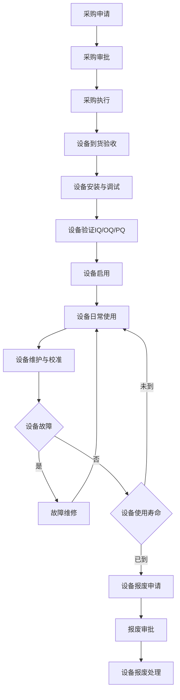
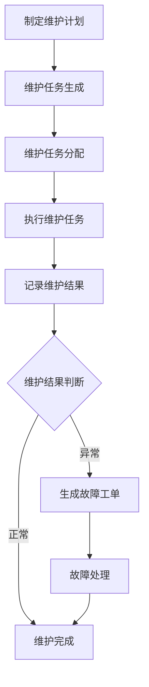
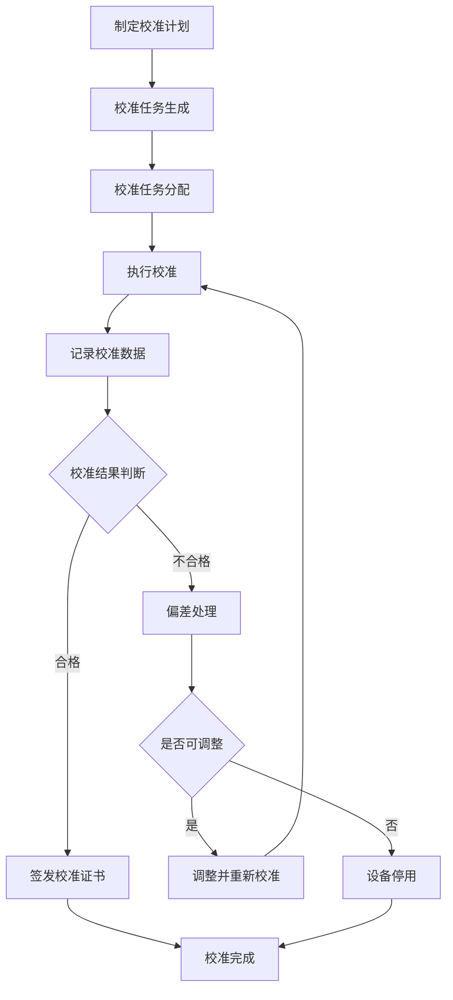
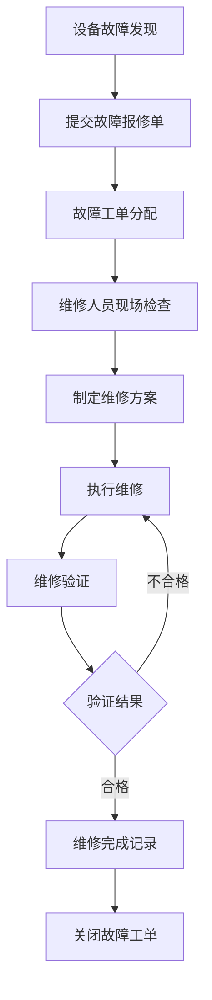
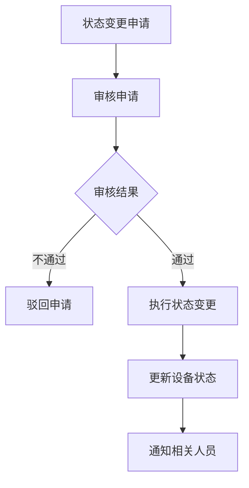
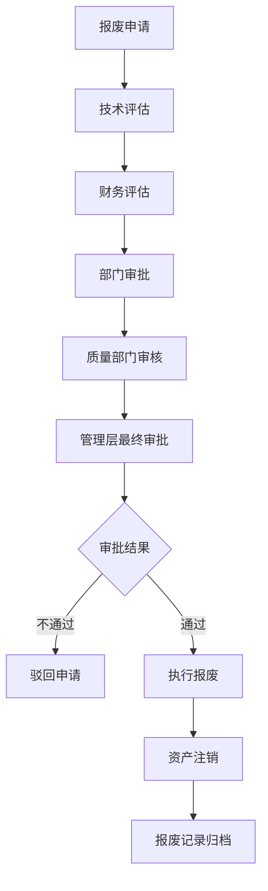

# 设备管理系统 - 业务流程描述

## 文档信息
- **文档名称**: 设备管理系统业务流程描述
- **版本**: V1.0
- **创建日期**: [当前日期]
- **更新日期**: [更新日期]
- **作者**: [作者姓名]
- **审核人**: [审核人姓名]
- **生效日期**: [生效日期]

## 目录
- [文档信息](#文档信息)
- [概述](#概述)
  - [文档目的](#文档目的)
  - [术语定义](#术语定义)
- [业务流程图](#业务流程图)
- [流程详细描述](#流程详细描述)
  - [设备创建与基础信息管理流程](#设备创建与基础信息管理流程)
  - [设备采购与验收流程](#设备采购与验收流程)
  - [设备维护管理流程](#设备维护管理流程)
  - [设备校准管理流程](#设备校准管理流程)
  - [设备故障报修与处理流程](#设备故障报修与处理流程)
  - [设备状态变更流程](#设备状态变更流程)
  - [设备备件管理流程](#设备备件管理流程)
  - [设备报废管理流程](#设备报废管理流程)
- [流程规则和约束](#流程规则和约束)
- [相关系统集成](#相关系统集成)
- [附录](#附录)

## 概述

### 文档目的
本文档详细描述了设备管理系统中的各项业务流程，旨在规范设备从采购、安装、使用、维护到报废的全生命周期管理流程。通过清晰的业务流程定义，确保设备管理活动符合GMP规范要求，保障设备稳定运行，提高生产效率，降低设备故障率，延长设备使用寿命。同时，本文档也为系统设计、开发和测试提供了重要依据。

### 术语定义
- **设备**: 用于药品生产、检验、包装等活动的仪器、设备、设施等
- **GMP**: 药品生产质量管理规范(Good Manufacturing Practice)
- **设备生命周期**: 设备从采购、安装、使用、维护到报废的完整过程
- **预防性维护**: 定期对设备进行检查、清洁、润滑等，以预防故障发生的维护活动
- **校准**: 确定测量设备与可追溯到国际或国家标准的测量标准之间的关系的一系列操作
- **验证**: 证明任何程序、生产过程、设备、物料、活动或系统确实能达到预期结果的有文件证明的一系列活动
- **IQ**: 安装确认(Installation Qualification)，确认设备已按照设计要求正确安装
- **OQ**: 运行确认(Operational Qualification)，确认设备在预期的操作范围内能够正常运行
- **PQ**: 性能确认(Performance Qualification)，确认设备在常规使用条件下能够持续符合规定的要求

## 业务流程图

### 设备生命周期管理总览流程

### 设备维护管理流程

### 设备校准管理流程

### 设备故障报修与处理流程

### 设备状态变更流程

### 设备报废管理流程

## 流程详细描述

### 设备创建与基础信息管理流程

**流程目的**: 确保所有设备在系统中都有完整准确的记录，为后续的设备管理活动提供基础数据支持。

**流程触发**: 
- 新设备采购到货验收后
- 现有设备需要录入系统

**流程步骤**:
1. **登录认证系统**:
   - 设备管理员通过认证子系统登录设备管理系统
   - 系统验证用户身份和权限
   - 认证通过后，系统记录登录日志

2. **设备信息收集**:
   - 设备管理员收集设备基础信息，包括设备名称、型号、制造商、供应商、采购日期、价格等
   - 收集设备相关文档，如设备说明书、合格证、技术参数表等

3. **系统录入**:
   - 设备管理员进入"设备管理"模块
   - 点击"添加设备"，进入设备信息录入界面
   - 填写设备基础信息，上传相关文档
   - 提交设备信息
   - 系统自动生成数据录入审计日志

4. **信息审核**:
   - 设备管理主管通过认证子系统登录系统并验证身份和权限
   - 接收到设备信息审核通知
   - 审核设备信息的完整性和准确性
   - 审核通过或驳回（如有错误），并生成相应的审计日志
   - 审核通过后，主管进行电子签名确认

5. **信息激活**:
   - 审核通过后，设备信息在系统中正式激活
   - 系统自动生成设备编号
   - 设备状态默认为"待验收"
   - 系统生成信息激活审计日志

6. **信息更新**:
   - 设备管理员通过认证子系统登录后，可以根据设备实际情况更新设备信息
   - 关键信息更新需经过审核和电子签名确认
   - 系统自动生成信息更新审计日志

**流程输出**:
- 设备基础信息记录
- 设备文档库
- 设备编号
- 电子签名确认记录
- 认证登录日志
- 操作审计日志

**流程参与角色**:
- 设备管理员: 通过认证子系统登录，录入设备信息，管理设备文档
- 设备管理主管: 通过认证子系统登录，审核设备信息并进行电子签名

### 设备采购与验收流程

**流程目的**: 规范设备采购和验收流程，确保采购的设备符合需求，质量可靠，验收工作符合GMP要求。

**流程触发**:
- 生产/检验需要新设备
- 现有设备需要更新或替代

**流程步骤**:
1. **登录认证系统**:
   - 所有参与流程的角色通过认证子系统登录设备管理系统
   - 系统验证用户身份和权限
   - 认证通过后，系统记录登录日志

2. **采购申请**:
   - 设备使用部门提出设备需求
   - 设备管理员通过认证子系统登录后，根据需求填写采购申请表，包括设备用途、技术要求、预算等
   - 通过系统提交采购申请表
   - 系统自动生成采购申请审计日志

3. **采购审批**:
   - 部门主管通过认证子系统登录后审核采购申请
   - 根据采购金额确定审批流程（部门审批、管理层审批等）
   - 各级审批人员在审批过程中进行电子签名确认
   - 系统记录每级审批的电子签名和审计日志
   - 审批通过后转采购部门执行

4. **采购执行**:
   - 采购部门通过认证子系统登录后，根据审批后的采购申请，寻找合适的供应商
   - 与供应商谈判，确定合同条款
   - 签署采购合同，生成采购订单
   - 采购部门在系统中记录采购订单信息并进行电子签名确认
   - 系统自动生成采购执行审计日志

5. **到货通知**:
   - 供应商发货前通知采购部门
   - 采购部门通知设备管理部门做好验收准备

6. **到货验收**:
   - 设备到货后，采购部门、设备管理部门、质量部门人员通过认证子系统登录后共同进行验收
   - 检查设备外观、数量、附件等
   - 核对设备技术参数与合同要求
   - 验收人员在系统中填写到货验收记录并进行电子签名确认
   - 系统自动生成验收审计日志

7. **安装准备**:
   - 验收合格后，设备管理员安排设备安装地点
   - 准备安装所需的基础设施和条件
   - 系统自动更新设备状态为"已验收"并生成状态变更审计日志

**流程输出**:
- 采购申请表
- 采购订单
- 到货验收记录
- 设备基础信息记录（更新状态为"已验收"）
- 电子签名确认记录
- 认证登录日志
- 操作审计日志

**流程参与角色**:
- 设备使用部门: 提出设备需求
- 设备管理员: 通过认证子系统登录，填写采购申请，参与验收，记录信息
- 设备管理主管: 通过认证子系统登录，审批采购申请，进行电子签名
- 采购部门: 通过认证子系统登录，执行采购，管理采购订单，进行电子签名
- 质量部门: 通过认证子系统登录，参与验收，确保质量合规，进行电子签名

### 设备维护管理流程

**流程目的**: 通过定期维护，保持设备的良好状态，减少故障发生，延长设备使用寿命，确保生产安全和产品质量。

**流程触发**:
- 根据设备维护计划自动触发
- 设备出现异常需要维护

**流程步骤**:
1. **登录认证系统**:
   - 所有参与流程的角色通过认证子系统登录设备管理系统
   - 系统验证用户身份和权限
   - 认证通过后，系统记录登录日志

2. **维护计划制定**:
   - 设备管理员通过认证子系统登录后，根据设备特性、使用频率、制造商建议等，制定设备维护计划
   - 设置维护周期、维护内容、维护责任人等
   - 在系统中创建维护计划并进行电子签名确认
   - 系统自动生成维护计划创建审计日志

3. **维护任务生成**:
   - 系统根据维护计划自动生成维护任务
   - 通过认证子系统通知维护责任人
   - 系统记录任务生成审计日志

4. **维护任务执行**:
   - 维护工程师通过认证子系统登录，接收维护任务
   - 准备维护所需工具和材料
   - 执行维护任务，包括清洁、润滑、检查、调整等
   - 在系统中实时记录维护过程和结果
   - 拍摄维护过程照片（如有必要）并上传至系统
   - 系统自动生成维护执行过程的审计日志

5. **维护结果审核**:
   - 设备管理员通过认证子系统登录后，审核维护记录
   - 确认维护工作完成情况
   - 进行电子签名确认审核结果
   - 对于发现的问题，提出处理建议并记录在系统中
   - 系统生成维护结果审核审计日志

6. **设备状态更新**:
   - 维护完成后，设备管理员在系统中更新设备状态为"正常"或"需维修"
   - 进行电子签名确认状态更新
   - 记录下次维护日期
   - 系统生成设备状态更新审计日志

7. **维护报告生成**:
   - 系统定期生成维护报告
   - 分析维护数据，优化维护计划
   - 报告生成后需经过电子签名确认
   - 系统生成报告生成审计日志

**流程输出**:
- 维护计划
- 维护任务单
- 维护记录
- 设备状态更新
- 维护报告
- 电子签名确认记录
- 认证登录日志
- 操作审计日志

**流程参与角色**:
- 设备管理员: 通过认证子系统登录，制定维护计划，审核维护记录，生成报告，进行电子签名
- 维护工程师: 通过认证子系统登录，执行维护任务，记录维护过程和结果
- 设备操作员: 协助维护，反馈设备使用情况

### 设备校准管理流程

**流程目的**: 确保设备测量结果的准确性和可靠性，符合法规和质量标准要求，保证产品质量和生产安全。

**流程触发**:
- 根据校准计划自动触发
- 设备维修后需要重新校准
- 设备出现测量偏差

**流程步骤**:
1. **登录认证系统**:
   - 所有参与流程的角色通过认证子系统登录设备管理系统
   - 系统验证用户身份和权限
   - 认证通过后，系统记录登录日志

2. **校准计划制定**:
   - 校准专员通过认证子系统登录后，根据设备类型、使用频率、法规要求等，制定校准计划
   - 设置校准周期、校准方法、校准标准等
   - 在系统中创建校准计划
   - 进行电子签名确认计划内容
   - 系统自动生成校准计划创建审计日志

3. **校准任务生成**:
   - 系统根据校准计划自动生成校准任务
   - 通过认证子系统通知校准责任人
   - 系统记录任务生成审计日志

4. **校准前准备**:
   - 校准专员通过认证子系统登录后，准备校准所需的标准器具和环境
   - 确认标准器具在有效期内且已校准
   - 通过系统通知设备使用部门暂停使用设备
   - 系统生成校准准备审计日志

5. **校准执行**:
   - 校准专员通过认证子系统登录后，按照校准计划执行校准
   - 在系统中实时记录校准过程和数据
   - 计算测量误差和修正值（如有必要）
   - 校准完成后进行电子签名确认
   - 系统自动生成校准执行审计日志

6. **校准结果评估**:
   - 校准专员通过认证子系统登录后，评估校准结果是否符合要求
   - 根据评估结果，决定设备是否可以继续使用
   - 对于校准不合格的设备，提出处理建议并记录在系统中
   - 进行电子签名确认评估结果
   - 系统生成校准结果评估审计日志

7. **校准证书签发**:
   - 校准合格的设备，签发校准证书
   - 在校准证书中注明校准日期、有效期、测量误差等信息
   - 在设备上粘贴校准标签
   - 通过认证子系统在系统中记录证书信息并进行电子签名确认
   - 系统生成证书签发审计日志

8. **设备状态更新**:
   - 校准专员通过认证子系统登录后，更新设备校准状态和下次校准日期
   - 对于校准不合格的设备，设置为"停用"状态
   - 进行电子签名确认状态更新
   - 系统生成设备状态更新审计日志

9. **校准报告生成**:
   - 系统定期生成校准报告
   - 分析校准数据，优化校准计划
   - 报告生成后需经过电子签名确认
   - 系统生成报告生成审计日志

**流程输出**:
- 校准计划
- 校准任务单
- 校准记录
- 校准证书
- 设备校准状态更新
- 校准报告
- 电子签名确认记录
- 认证登录日志
- 操作审计日志

**流程参与角色**:
- 校准专员: 通过认证子系统登录，制定校准计划，执行校准，签发证书，生成报告，进行电子签名
- 设备管理员: 通过认证子系统登录，协调校准工作，更新设备状态，进行电子签名
- 质量部门: 通过认证子系统登录，审核校准计划和结果，确保合规，进行电子签名

### 设备故障报修与处理流程

**流程目的**: 及时发现和处理设备故障，减少故障对生产的影响，确保设备正常运行。

**流程触发**:
- 设备操作员发现设备故障
- 设备自动监测系统报警
- 维护工程师巡检发现问题

**流程步骤**:
1. **登录认证系统**:
   - 所有参与流程的角色通过认证子系统登录设备管理系统
   - 系统验证用户身份和权限
   - 认证通过后，系统记录登录日志

2. **故障发现与报告**:
   - 设备操作员通过认证子系统登录后，发现设备故障时立即停止使用设备
   - 通过系统提交故障报修单，描述故障现象、发生时间等
   - 提交报修单时进行电子签名确认
   - 系统自动生成故障报修审计日志
   - 通知设备管理员和相关负责人

3. **故障工单生成**:
   - 设备管理员通过认证子系统登录，接收故障报修单
   - 审核故障信息，创建故障工单
   - 确定故障优先级，分配给维护工程师
   - 在系统中进行电子签名确认工单分配
   - 系统生成工单创建审计日志

4. **故障诊断**:
   - 维护工程师通过认证子系统登录，接收故障工单
   - 到达现场检查设备，分析故障原因
   - 在系统中实时记录故障诊断过程和结果
   - 进行电子签名确认诊断结果
   - 系统生成故障诊断审计日志

5. **维修方案制定**:
   - 维护工程师根据故障诊断结果，制定维修方案
   - 对于复杂故障，组织技术讨论
   - 确定维修所需备件和资源
   - 在系统中记录维修方案并进行电子签名确认
   - 系统生成方案制定审计日志

6. **维修执行**:
   - 维护工程师按照维修方案执行维修
   - 在系统中实时记录维修过程和使用的备件
   - 对于关键设备，质量部门通过认证子系统登录参与监督
   - 系统自动生成维修执行审计日志

7. **维修验证**:
   - 维修完成后，维护工程师进行设备测试，验证维修效果
   - 确认设备是否恢复正常功能
   - 在系统中记录验证结果并进行电子签名确认
   - 系统生成维修验证审计日志

8. **故障总结**:
   - 维护工程师通过认证子系统登录，填写故障处理报告
   - 分析故障原因，提出预防措施
   - 更新设备维护计划（如有必要）
   - 进行电子签名确认报告内容
   - 系统生成报告提交审计日志

9. **工单关闭**:
   - 设备管理员通过认证子系统登录，审核维修结果
   - 确认设备可以正常使用后，关闭故障工单
   - 更新设备状态并进行电子签名确认
   - 系统生成工单关闭和状态更新审计日志

**流程输出**:
- 故障报修单
- 故障工单
- 故障诊断记录
- 维修记录
- 故障处理报告
- 设备状态更新
- 电子签名确认记录
- 认证登录日志
- 操作审计日志

**流程参与角色**:
- 设备操作员: 通过认证子系统登录，发现故障，提交报修单，进行电子签名
- 设备管理员: 通过认证子系统登录，处理报修单，创建工单，审核维修结果，进行电子签名
- 维护工程师: 通过认证子系统登录，诊断故障，执行维修，填写报告，进行电子签名
- 设备管理主管: 通过认证子系统登录，审核复杂故障处理方案，进行电子签名
- 质量部门: 通过认证子系统登录，监督关键设备维修，进行电子签名

### 设备状态变更流程

**流程目的**: 规范设备状态变更管理，确保设备状态准确反映设备实际情况，控制设备使用权限，保障生产安全。

**流程触发**:
- 设备需要停用
- 设备需要重新启用
- 设备需要报废
- 设备需要进行维护或校准

**流程步骤**:
1. **登录认证系统**:
   - 所有参与流程的角色通过认证子系统登录设备管理系统
   - 系统验证用户身份和权限
   - 认证通过后，系统记录登录日志

2. **状态变更申请**:
   - 设备管理员或相关人员通过认证子系统登录后，填写设备状态变更申请表
   - 说明状态变更的原因、预计时间等
   - 提交状态变更申请并进行电子签名确认
   - 系统自动生成状态变更申请审计日志

3. **申请审核**:
   - 设备管理主管通过认证子系统登录后，审核状态变更申请
   - 根据设备重要程度和变更类型，确定是否需要其他部门审核
   - 对于关键设备或重大变更，质量部门通过认证子系统登录后进行审核
   - 审核人员进行电子签名确认审核结果
   - 系统生成申请审核审计日志

4. **状态变更执行**:
   - 审核通过后，设备管理员通过认证子系统登录，在系统中执行状态变更
   - 更新设备状态信息，记录变更原因和时间
   - 根据状态变更类型，执行相应操作（如设备贴标签、锁定操作权限等）
   - 进行电子签名确认变更执行
   - 系统生成状态变更执行审计日志

5. **通知相关人员**:
   - 系统自动通过认证子系统通知相关人员设备状态变更信息
   - 对于设备停用或报废，通知设备使用部门和相关人员
   - 系统生成通知审计日志

6. **状态变更记录**:
   - 系统记录设备状态变更历史
   - 保存状态变更申请和审批记录
   - 系统生成记录保存审计日志

**流程输出**:
- 设备状态变更申请表
- 设备状态更新
- 状态变更记录
- 电子签名确认记录
- 认证登录日志
- 操作审计日志

**流程参与角色**:
- 设备管理员: 通过认证子系统登录，提交状态变更申请，执行状态变更，进行电子签名
- 设备管理主管: 通过认证子系统登录，审核状态变更申请，进行电子签名
- 质量部门: 通过认证子系统登录，审核关键设备或重大变更，进行电子签名
- 设备使用部门: 通过认证子系统登录，了解设备状态变更情况

### 设备备件管理流程

**流程目的**: 确保设备维修和维护所需的备件及时供应，减少设备停机时间，提高设备利用率。

**流程触发**:
- 备件库存低于预警值
- 设备维修需要新备件
- 定期盘点发现备件不足

**流程步骤**:
1. **登录认证系统**:
   - 所有参与流程的角色通过认证子系统登录设备管理系统
   - 系统验证用户身份和权限
   - 认证通过后，系统记录登录日志

2. **备件需求分析**:
   - 设备管理员通过认证子系统登录后，分析设备维护和维修所需的备件
   - 根据设备数量、使用频率、故障率等，确定备件需求
   - 设置备件库存预警值并在系统中记录
   - 进行电子签名确认需求分析结果
   - 系统自动生成备件需求分析审计日志

3. **备件采购**:
   - 当备件库存低于预警值时，设备管理员通过认证子系统登录后，提出备件采购申请
   - 采购部门人员通过认证子系统登录后，根据申请执行采购
   - 采购完成后，在系统中更新备件库存信息并进行电子签名确认
   - 系统生成备件采购审计日志

4. **备件入库**:
   - 备件到货后，设备管理员通过认证子系统登录后进行验收
   - 验收合格的备件办理入库手续
   - 在系统中记录备件信息，包括名称、型号、数量、供应商等
   - 进行电子签名确认入库操作
   - 系统生成备件入库审计日志

5. **备件保管**:
   - 按规定的条件保管备件，确保备件质量
   - 设备管理员通过认证子系统登录后，定期检查备件库存状态，防止备件损坏或过期
   - 对重要备件进行特殊保管，并在系统中记录
   - 系统生成备件保管审计日志

6. **备件领用**:
   - 维护工程师通过认证子系统登录后，需要使用备件时，填写备件领用申请
   - 设备管理员通过认证子系统登录后，审核领用申请
   - 审核通过后，发放备件
   - 在系统中更新备件库存信息和使用记录并进行电子签名确认
   - 系统生成备件领用审计日志

7. **备件盘点**:
   - 设备管理员通过认证子系统登录后，定期对备件库存进行盘点
   - 核对系统记录与实际库存
   - 处理盘盈盘亏情况并在系统中记录
   - 进行电子签名确认盘点结果
   - 系统生成备件盘点审计日志

8. **备件报废**:
   - 对于损坏或过期的备件，设备管理员通过认证子系统登录后，填写报废申请
   - 经过审核后，办理报废手续
   - 在系统中更新备件状态并进行电子签名确认
   - 系统生成备件报废审计日志

**流程输出**:
- 备件需求分析报告
- 备件采购申请
- 备件入库记录
- 备件领用记录
- 备件库存盘点报告
- 电子签名确认记录
- 认证登录日志
- 操作审计日志

**流程参与角色**:
- 设备管理员: 通过认证子系统登录，分析备件需求，管理备件库存，审核领用申请，进行电子签名
- 维护工程师: 通过认证子系统登录，提交备件领用申请，使用备件，进行电子签名
- 采购部门: 通过认证子系统登录，执行备件采购，进行电子签名
- 仓库管理员: 通过认证子系统登录，协助备件入库、保管和盘点，进行电子签名

### 设备报废管理流程

**流程目的**: 规范设备报废管理，确保报废设备符合报废条件，报废过程符合法规要求，实现资产的合理处置。

**流程触发**:
- 设备达到使用寿命
- 设备损坏无法修复
- 设备技术落后，无法满足生产需求
- 设备更新换代

**流程步骤**:
1. **登录认证系统**:
   - 所有参与流程的角色通过认证子系统登录设备管理系统
   - 系统验证用户身份和权限
   - 认证通过后，系统记录登录日志

2. **报废申请**:
   - 设备管理员通过认证子系统登录后，填写设备报废申请表
   - 说明报废原因、预计报废时间等
   - 提交报废申请并进行电子签名确认
   - 系统自动生成报废申请审计日志

3. **技术评估**:
   - 设备管理部门人员通过认证子系统登录，组织技术人员对设备进行评估
   - 评估人员通过认证子系统登录后，确认设备是否达到报废条件
   - 提供技术评估报告并进行电子签名确认
   - 系统生成技术评估审计日志

4. **财务评估**:
   - 财务部门人员通过认证子系统登录，评估设备的剩余价值和报废损失
   - 办理相关财务手续并进行电子签名确认
   - 系统生成财务评估审计日志

5. **审批流程**:
   - 设备管理部门人员通过认证子系统登录后进行审批
   - 质量部门人员通过认证子系统登录后审核，确保符合GMP要求
   - 管理层人员通过认证子系统登录后进行最终审批（根据设备价值确定审批级别）
   - 各级审批人员进行电子签名确认
   - 系统生成审批流程审计日志

6. **执行报废**:
   - 审批通过后，设备管理员通过认证子系统登录，执行设备报废
   - 拆除设备，清理现场
   - 对于危险设备，采取安全防护措施
   - 回收或处置设备
   - 进行电子签名确认报废执行
   - 系统生成报废执行审计日志

7. **资产注销**:
   - 财务部门人员通过认证子系统登录，办理资产注销手续
   - 更新资产台账并进行电子签名确认
   - 系统生成资产注销审计日志

8. **记录归档**:
   - 设备管理员通过认证子系统登录，整理报废相关记录和文件
   - 在系统中更新设备状态为"已报废"并进行电子签名确认
   - 归档相关记录
   - 系统生成记录归档审计日志

**流程输出**:
- 设备报废申请表
- 技术评估报告
- 财务评估报告
- 设备报废记录
- 资产注销记录
- 电子签名确认记录
- 认证登录日志
- 操作审计日志

**流程参与角色**:
- 设备管理员: 通过认证子系统登录，提交报废申请，执行报废，记录归档，进行电子签名
- 设备管理部门: 通过认证子系统登录，进行技术评估，审批报废申请，进行电子签名
- 质量部门: 通过认证子系统登录，审核报废过程，确保合规，进行电子签名
- 财务部门: 通过认证子系统登录，进行财务评估，办理资产注销，进行电子签名
- 管理层: 通过认证子系统登录，最终审批报废申请，进行电子签名

## 流程规则和约束

### 认证与登录规则
- 所有用户必须通过认证子系统进行身份验证后，才能访问设备管理系统
- 用户认证采用多因素认证机制，包括用户名密码和动态验证码
- 系统定期强制用户修改密码，密码复杂度需满足公司安全规定
- 登录失败次数超过限制后，账户将被临时锁定，需管理员解锁
- 所有登录活动必须在审计日志中记录，包括登录时间、IP地址、用户信息等

### 权限管理规则
- 系统采用基于角色的访问控制，用户权限必须与工作职责相符
- 权限分配必须遵循最小权限原则，仅授予完成工作所需的最小权限
- 敏感操作（如数据修改、设备状态变更等）必须有相应权限才能执行
- 权限变更必须经过审批，并在审计日志中记录

### 电子签名规则
- 所有关键操作必须进行电子签名确认，包括但不限于：设备基础信息创建与修改、维护计划制定、校准执行、故障处理、备件采购审批等
- 电子签名必须包含签名人身份、签名时间和签名目的
- 电子签名必须使用密码或生物识别等方式验证签名人身份
- 电子签名记录必须保存完整，不可篡改，可追溯

### 审计日志规则
- 系统必须记录所有关键操作的审计日志，包括操作人、操作时间、操作内容、操作结果等
- 审计日志必须真实、完整、准确，不可篡改
- 审计日志必须定期备份，保存时间符合法规要求
- 审计日志查询必须有权限控制，仅授权人员可访问

### 设备创建规则
- 设备编号必须唯一，遵循公司设备编号标准
- 所有设备必须录入系统，建立完整的设备档案
- 关键设备必须上传完整的技术文档
- 设备信息录入后需要经过审核并进行电子签名确认才能生效
- 所有设备创建活动必须通过认证子系统登录执行，并生成完整的审计日志

### 设备维护规则
- 关键设备必须制定预防性维护计划
- 维护计划必须符合设备制造商的建议
- 维护计划制定必须经过审核和电子签名确认
- 维护过程必须记录详细的维护内容和结果
- 维护人员必须通过认证子系统登录后执行维护任务，并在系统中记录维护过程和结果
- 维护中发现的问题必须及时处理并记录，必要时生成故障工单
- 维护记录必须保存至少5年
- 所有维护活动必须生成完整的审计日志

### 设备校准规则
- 用于关键测量的设备必须定期校准
- 校准周期必须符合法规和质量标准要求
- 校准计划必须在系统中制定并进行电子签名确认
- 校准必须由有资质的人员执行，相关人员通过认证子系统登录
- 校准标准器必须可追溯到国际或国家标准
- 校准过程和结果必须在系统中记录并进行电子签名确认
- 校准不合格的设备不得使用，需进行维修或停用
- 校准记录和证书必须保存至少5年
- 所有校准活动必须生成完整的审计日志

### 设备故障处理规则
- 关键设备故障必须在2小时内响应
- 故障报告必须通过认证子系统提交并进行电子签名确认
- 故障处理过程必须详细记录
- 修复后的设备必须经过验证才能投入使用
- 重大故障必须进行根本原因分析
- 所有故障处理活动必须生成完整的审计日志

### 设备状态变更规则
- 设备状态变更必须有合理的原因
- 关键设备的状态变更需要多级审批
- 状态变更申请和审批必须通过认证子系统进行，并进行电子签名确认
- 设备停用必须挂标识并锁定操作权限
- 设备状态变更记录必须完整保存
- 所有状态变更活动必须生成完整的审计日志

### 备件管理规则
- 备件库存必须设置预警值
- 关键备件必须保持足够的安全库存
- 备件需求分析和采购计划制定必须通过认证子系统进行，并进行电子签名确认
- 备件领用必须经过审核和电子签名确认
- 备件使用必须记录详细信息
- 所有备件管理活动必须通过认证子系统登录执行，并生成完整的审计日志

### 设备报废规则
- 设备报废申请必须通过认证子系统提交并进行电子签名确认
- 设备报废必须经过技术评估和财务评估，评估结果需电子签名确认
- 设备报废必须经过多级审批，高价值设备必须高层审批
- 所有报废相关活动必须通过认证子系统执行，并生成完整的审计日志

### GMP合规规则
- 所有设备管理活动必须符合GMP等相关法规要求
- 关键设备的操作必须有标准操作规程(SOP)
- 设备状态必须清晰标识，防止误用
- 设备变更必须经过验证，确保不影响产品质量
- 设备相关记录必须保存完整，满足追溯性要求
- 所有与GMP相关的活动必须通过认证子系统执行，并保留完整的电子签名和审计日志

### 数据安全规则
- 所有设备相关数据必须妥善保护，防止未授权访问、篡改或泄露
- 数据传输必须加密，确保传输过程安全
- 数据备份和恢复机制必须完善，确保数据可用性
- 敏感数据必须进行特殊保护，符合数据保护法规要求

## 相关系统集成

### 与认证子系统集成
- **集成目的**: 实现统一身份认证和授权管理，确保设备管理系统的安全访问和操作追踪，满足GMP合规要求
- **集成方式**: API接口
- **主要功能**:
  - 用户认证和授权
  - 角色权限同步
  - 登录日志记录
  - 电子签名管理：在关键操作点实现符合21 CFR Part 11要求的电子签名功能
  - 会话管理：管理用户登录会话，实现自动注销和会话超时控制
- **数据交互**:
  - 认证请求与响应：设备管理系统向认证子系统发送认证请求，接收认证结果
  - 授权信息同步：定期同步用户角色和权限信息
  - 电子签名数据传输：记录和验证电子签名数据
  - 审计日志传输：实时传输审计日志到中央审计系统
- **安全要求**:
  - 所有集成接口必须采用加密通信
  - 严格的API访问控制和密钥管理
  - 数据传输完整性验证
  - 接口访问审计记录

### 与ERP系统集成
- **集成目的**: 实现设备资产信息和采购信息的共享
- **集成方式**: 数据接口
- **主要功能**:
  - 设备资产信息同步
  - 采购订单数据共享
  - 备件库存信息同步
  - 财务数据交换
- **安全要求**:
  - 通过认证子系统验证集成接口访问权限
  - 所有数据交换必须经过审计日志记录
  - 敏感财务数据传输必须加密

### 与生产管理系统集成
- **集成目的**: 实现设备使用情况和生产计划的协调
- **集成方式**: API接口
- **主要功能**:
  - 设备可用性状态共享
  - 设备维护计划与生产计划协调
  - 设备故障对生产影响分析
- **安全要求**:
  - 集成接口访问需通过认证子系统验证
  - 计划调整操作必须记录审计日志
  - 关键决策操作需电子签名确认

### 与质量管理系统集成
- **集成目的**: 确保设备管理符合质量标准要求
- **集成方式**: 数据接口和文档共享
- **主要功能**:
  - 设备验证数据共享
  - 设备相关偏差和变更管理
  - 设备相关质量事件记录
  - 审计追踪数据共享
- **安全要求**:
  - 所有数据交互操作必须通过认证子系统验证用户身份
  - 质量相关操作必须进行电子签名确认
  - 完整的操作审计跟踪

### 与文件管理系统集成
- **集成目的**: 实现设备相关文档的统一管理
- **集成方式**: 文档链接和共享
- **主要功能**:
  - 设备文档集中存储
  - 文档版本控制
  - 文档访问权限管理
  - 文档检索和共享
- **安全要求**:
  - 文档访问需通过认证子系统验证权限
  - 文档操作必须记录审计日志
  - 敏感文档传输和存储必须加密

## 附录

### 参考文档
- [设备管理系统总体需求文档](总体需求.md)
- [设备管理系统架构设计文档](架构设计.md)
- [设备管理系统详细需求文档](详细需求.md)
- [设备管理系统角色权限矩阵](角色权限矩阵.md)
- [设备管理系统场景描述和验收标准](场景描述和验收标准.md)
- [设备管理系统用户故事](用户故事.md)
- [设备管理系统用例图和用例描述](用例图和用例描述.md)
- 21 CFR Part 11电子记录和电子签名法规
- 认证子系统接口规范

### 术语表
| 术语 | 解释 |
|------|------|
| 设备 | 用于药品生产、检验、包装等活动的仪器、设备、设施等 |
| GMP | 药品生产质量管理规范，确保药品质量的一系列标准和规范 |
| 预防性维护 | 定期对设备进行检查、清洁、润滑等，以预防故障发生的维护活动 |
| 校准 | 确定测量设备与可追溯到国际或国家标准的测量标准之间的关系的一系列操作 |
| 验证 | 证明任何程序、生产过程、设备、物料、活动或系统确实能达到预期结果的有文件证明的一系列活动 |
| IQ | 安装确认(Installation Qualification)，确认设备已按照设计要求正确安装 |
| OQ | 运行确认(Operational Qualification)，确认设备在预期的操作范围内能够正常运行 |
| PQ | 性能确认(Performance Qualification)，确认设备在常规使用条件下能够持续符合规定的要求 |
| 认证子系统 | 负责用户身份验证、授权管理和电子签名的专用系统，满足GMP合规要求 |
| 电子签名 | 基于密码学技术，用于识别用户身份并表明用户对某一操作或记录的认可，符合21 CFR Part 11要求 |
| 审计日志 | 记录系统中所有关键操作的详细日志，包括操作人、时间、内容、IP地址等信息，用于追溯和合规检查 |
| 单点登录(SSO) | 用户只需进行一次身份认证，即可访问多个相关系统的认证机制 |
| 会话管理 | 控制用户与系统之间交互过程的管理机制，包括会话创建、维护和终止 |
| 基于角色的访问控制(RBAC) | 根据用户角色分配系统访问权限的安全管理方法 |

### 联系方式
- **产品负责人**: [姓名] - [联系方式]
- **业务流程负责人**: [姓名] - [联系方式]
- **开发负责人**: [姓名] - [联系方式]
- **质量管理负责人**: [姓名] - [联系方式]
- **合规负责人**: [姓名] - [联系方式]
- **认证子系统管理员**: [认证系统管理员邮箱/电话]
