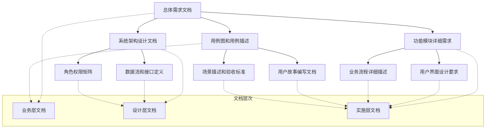

# GMP系统人事管理模块文档索引

## 文档概述

本文档集合为GMP系统人事管理模块提供了完整的需求、设计和实施指导。本文档体系涵盖了从业务需求到技术实现的全部内容，确保系统的合规性、可用性和安全性。

### 文档版本信息
- **文档版本**: v1.0
- **创建日期**: 2025-11-21
- **最后更新**: 2025-11-21
- **文档状态**: 完成
- **审核状态**: 已审核

### 文档适用对象
- **系统架构师**: 了解系统架构和技术选型
- **业务分析师**: 理解业务需求和流程设计
- **开发工程师**: 掌握详细功能需求和接口规范
- **测试工程师**: 了解验收标准和测试用例
- **质量保证人员**: 掌握合规要求和审计标准
- **项目经理**: 了解项目范围和时间安排

---
ren
## 文档目录结构

### 核心业务文档

#### 1. 总体需求文档
**文件路径**: `docs/hr-management/总体需求.md`  
**文档类型**: 业务需求文档  
**文档级别**: 关键文档  

**文档内容**:
- 业务背景和行业背景
- 功能需求总览
- 非功能性需求
- GMP合规性要求
- 业务流程概述

**适用阶段**: 需求分析、方案设计  
**维护频率**: 需求变更时更新

#### 2. 系统架构设计文档
**文件路径**: `docs/hr-management/架构设计/系统架构设计.md`  
**文档类型**: 技术架构文档  
**文档级别**: 关键文档  

**文档内容**:
- 系统整体架构设计
- 微服务架构设计
- 数据模型设计
- 安全架构设计
- 部署架构设计

**适用阶段**: 架构设计、技术选型  
**维护频率**: 架构变更时更新

### 详细需求文档

#### 3. 功能模块详细需求文档
**文件路径**: `docs/hr-management/详细需求/功能模块详细需求.md`  
**文档类型**: 功能规格文档  
**文档级别**: 重要文档  

**文档内容**:
- 员工管理模块详细需求
- 培训管理模块详细需求
- 绩效管理模块详细需求
- 薪酬管理模块详细需求
- 组织架构管理模块详细需求
- 合规审计模块详细需求

**适用阶段**: 详细设计、开发实施  
**维护频率**: 功能变更时更新

#### 4. 用户界面设计要求文档
**文件路径**: `docs/hr-management/详细需求/用户界面设计要求.md`  
**文档类型**: UI/UX设计文档  
**文档级别**: 重要文档  

**文档内容**:
- 界面设计原则和规范
- 色彩系统和字体规范
- 界面组件设计要求
- 响应式设计要求
- GMP特殊界面要求

**适用阶段**: UI设计、前端开发  
**维护频率**: 设计规范变更时更新

#### 5. 业务流程详细描述文档
**文件路径**: `docs/hr-management/详细需求/业务流程详细描述.md`  
**文档类型**: 业务流程文档  
**文档级别**: 重要文档  

**文档内容**:
- 新员工入职流程
- GMP培训管理流程
- 绩效评估流程
- 薪酬管理流程
- 员工离职流程
- 跨流程集成规则

**适用阶段**: 流程分析、系统设计  
**维护频率**: 业务流程变更时更新

#### 6. 数据流和接口定义文档
**文件路径**: `docs/hr-management/详细需求/数据流和接口定义.md`  
**文档类型**: 技术接口文档  
**文档级别**: 重要文档  

**文档内容**:
- 系统间接口定义
- API接口规范
- 消息队列接口
- 数据库接口定义
- 数据同步和一致性

**适用阶段**: 系统集成、接口开发  
**维护频率**: 接口变更时更新

### 用例与用户故事文档

#### 7. 用例图和用例描述文档
**文件路径**: `docs/hr-management/用例与用户故事/用例图和用例描述.md`  
**文档类型**: 用例分析文档  
**文档级别**: 重要文档  

**文档内容**:
- 系统参与者定义
- 主要用例图
- 核心用例描述
- 扩展用例
- 用例关系
- 业务规则

**适用阶段**: 需求分析、系统设计  
**维护频率**: 用例变更时更新

#### 8. 用户故事编写文档
**文件路径**: `docs/hr-management/用例与用户故事/用户故事编写文档.md`  
**文档类型**: 敏捷开发文档  
**文档级别**: 重要文档  

**文档内容**:
- 用户故事方法论
- 角色定义
- 核心用户故事
- 详细用户故事
- 用户故事地图
- 优先级定义

**适用阶段**: 敏捷开发、产品规划  
**维护频率**: 用户需求变更时更新

#### 9. 场景描述和验收标准文档
**文件路径**: `docs/hr-management/用例与用户故事/场景描述和验收标准.md`  
**文档类型**: 测试验收文档  
**文档级别**: 重要文档  

**文档内容**:
- 典型使用场景
- 业务流程场景
- 异常处理场景
- 验收标准定义
- 测试验收标准
- 性能验收标准
- 安全验收标准

**适用阶段**: 系统测试、验收交付  
**维护频率**: 验收标准变更时更新

#### 10. 角色权限矩阵文档
**文件路径**: `docs/hr-management/用例与用户故事/角色权限矩阵.md`  
**文档类型**: 安全权限文档  
**文档级别**: 关键文档  

**文档内容**:
- 角色定义
- 权限分类
- 角色权限矩阵
- GMP特殊权限
- 权限管理策略
- 权限审核流程

**适用阶段**: 安全设计、权限管理  
**维护频率**: 权限策略变更时更新

---

## 文档使用指南

### 阅读建议

#### 按角色阅读指南

**业务分析师阅读路径**:
1. 总体需求文档 → 了解业务背景和需求
2. 业务流程详细描述 → 掌握具体业务流程
3. 用例图和用例描述 → 理解系统功能边界

**系统架构师阅读路径**:
1. 系统架构设计文档 → 了解技术架构
2. 数据流和接口定义 → 掌握系统集成
3. 角色权限矩阵 → 理解安全架构

**开发工程师阅读路径**:
1. 功能模块详细需求 → 了解具体功能
2. 数据流和接口定义 → 掌握技术接口
3. 用户故事编写文档 → 理解开发需求

**测试工程师阅读路径**:
1. 场景描述和验收标准 → 了解测试标准
2. 用例图和用例描述 → 掌握测试用例
3. 功能模块详细需求 → 理解测试范围

#### 按阶段使用指南

**需求分析阶段**:
- 重点阅读: 总体需求文档、用例图和用例描述
- 辅助文档: 业务流程详细描述、用户故事编写文档

**系统设计阶段**:
- 重点阅读: 系统架构设计文档、数据流和接口定义
- 辅助文档: 角色权限矩阵、用户界面设计要求

**开发实施阶段**:
- 重点阅读: 功能模块详细需求、数据流和接口定义
- 辅助文档: 用户故事编写文档、角色权限矩阵

**测试验收阶段**:
- 重点阅读: 场景描述和验收标准、角色权限矩阵
- 辅助文档: 功能模块详细需求、用户界面设计要求

---

## 文档关联关系

### 文档依赖关系图



### 文档更新依赖

| 变更文档 | 影响文档 | 更新要求 |
|---------|---------|---------|
| 总体需求文档 | 所有其他文档 | 全面评审更新 |
| 系统架构设计文档 | 数据流接口定义、权限矩阵 | 架构评审后更新 |
| 功能模块详细需求 | 用户界面设计、业务流程 | 功能评审后更新 |
| 业务流程详细描述 | 用例描述、验收标准 | 流程评审后更新 |
| 用例图和用例描述 | 用户故事、验收标准 | 用例评审后更新 |
| 角色权限矩阵 | 系统架构设计、验收标准 | 安全评审后更新 |

---

## 版本管理

### 版本控制策略

**版本号规则**:
- 主版本号.次版本号.修订号
- 主版本号: 重大架构变更或业务模式变更
- 次版本号: 功能模块增加或重要需求变更
- 修订号: 文档错误修正或小幅内容调整

**当前版本**: v1.0.0

### 变更管理流程

#### 文档变更申请
1. **变更发起**: 由相关利益方发起变更申请
2. **影响评估**: 评估变更对其他文档的影响
3. **变更审批**: 经过相关专家和管理层审批
4. **文档更新**: 按照变更要求更新文档
5. **变更通知**: 通知所有相关人员文档变更

#### 变更类型定义

**紧急变更**:
- 定义: 影响系统运行的关键问题
- 审批流程: 24小时内完成审批
- 更新时限: 变更批准后立即更新

**一般变更**:
- 定义: 功能优化或小幅调整
- 审批流程: 3个工作日内完成审批
- 更新时限: 变更批准后3个工作日内更新

**重大变更**:
- 定义: 架构调整或业务模式变更
- 审批流程: 1-2周完成审批
- 更新时限: 变更批准后1周内更新

---

## 质量保证

### 文档质量标准

#### 内容质量要求
- **完整性**: 文档内容覆盖所有必需信息
- **准确性**: 文档内容与实际系统一致
- **一致性**: 文档间内容保持一致
- **可读性**: 文档结构清晰，表达准确

#### 格式规范要求
- **结构规范**: 遵循统一的文档结构
- **格式规范**: 统一的标题、表格、图表格式
- **命名规范**: 统一的文件命名规范
- **版本规范**: 统一的版本标识规范

### 文档审查流程

#### 文档审查角色
- **作者**: 文档编写者和维护者
- **评审专家**: 相关领域的专家
- **最终审批人**: 项目或部门负责人

#### 审查检查点
- **内容审查**: 检查文档内容完整性和准确性
- **技术审查**: 检查技术方案可行性
- **业务审查**: 检查业务需求合理性
- **合规审查**: 检查GMP合规性要求

#### 审查频率
- **新文档**: 发布前必须经过完整审查
- **变更文档**: 根据变更级别确定审查深度
- **定期审查**: 每季度进行文档质量审查

---

## 维护和支持

### 文档维护责任

#### 文档责任人分配
| 文档类型 | 责任人 | 备份责任人 | 维护频率 |
|---------|-------|-----------|---------|
| 业务需求文档 | 业务分析师 | 产品经理 | 需求变更时 |
| 技术架构文档 | 系统架构师 | 技术总监 | 架构变更时 |
| 功能需求文档 | 开发工程师 | 项目经理 | 功能变更时 |
| 测试文档 | 测试工程师 | 质量经理 | 测试标准变更时 |
| 安全文档 | 安全工程师 | 信息安全总监 | 安全策略变更时 |

#### 维护时间安排
- **文档更新**: 变更发生后24小时内完成
- **版本归档**: 每月进行版本归档
- **质量审查**: 每季度进行质量审查
- **用户反馈**: 持续收集用户反馈并优化

### 支持联系方式

#### 技术支持
- **系统问题**: 联系技术支持团队
- **文档问题**: 联系文档维护团队
- **培训需求**: 联系培训协调员

#### 反馈渠道
- **文档反馈**: 通过项目管理系统提交
- **改进建议**: 定期收集用户建议
- **问题报告**: 建立问题报告机制

---

## 附录

### 附录A: 文档模板

#### A.1 新文档创建模板
```
# [文档标题]

## 文档信息
- **文档版本**: v1.0
- **创建日期**: YYYY-MM-DD
- **最后更新**: YYYY-MM-DD
- **作者**: [作者姓名]
- **审核人**: [审核人姓名]

## 目录
1. [概述](#概述)
2. [主要内容](#主要内容)
...

## 概述
[文档目的、适用范围、读者对象]

## 主要内容
[具体内容]

---
*本文档是[项目名称][模块名称]的[文档类型]，为[用途]提供[作用]。*
```

#### A.2 文档变更记录模板
```
## 变更记录

| 版本 | 日期 | 变更内容 | 变更人 | 审核人 |
|------|------|---------|-------|-------|
| v1.0 | YYYY-MM-DD | 初始版本创建 | [姓名] | [姓名] |
| v1.1 | YYYY-MM-DD | [变更内容] | [姓名] | [姓名] |
```

### 附录B: 术语表

#### B.1 GMP相关术语
- **GMP**: Good Manufacturing Practice，良好生产规范
- **SOP**: Standard Operating Procedure，标准操作程序
- **验证**: Validation，系统或工艺符合预定用途的确认
- **确认**: Qualification，设备、设施、系统符合设计要求的证明

#### B.2 系统相关术语
- **微服务**: Microservices，分布式架构模式
- **API**: Application Programming Interface，应用程序接口
- **RBAC**: Role-Based Access Control，基于角色的访问控制
- **JWT**: JSON Web Token，JSON网络令牌

### 附录C: 相关标准

#### C.1 法规标准
- 中华人民共和国药品管理法
- 药品生产质量管理规范（GMP）
- 个人信息保护法
- 数据安全法

#### C.2 技术标准
- ISO 27001 信息安全管理
- ISO 9001 质量管理体系
- IEEE 802 网络标准
- RESTful API 设计规范

---

## 总结

本文档索引为GMP系统人事管理模块提供了完整的文档导航和使用指南。通过系统化的文档管理，确保项目团队能够：

- **高效协作**: 清晰的文档结构便于团队协作
- **知识传承**: 完整的文档记录便于知识传承
- **质量保证**: 规范的质量流程保证文档质量
- **持续改进**: 完善的维护机制支持文档持续优化

通过遵循本索引的指导，项目团队可以更好地理解、使用和维护项目文档，确保系统开发的质量和效率。

---

**文档维护团队**  
最后更新: 2025-11-21  
