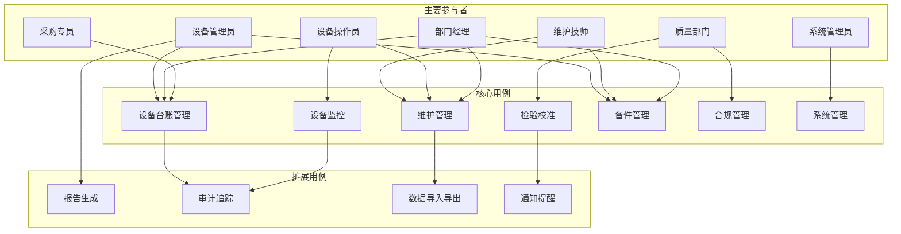
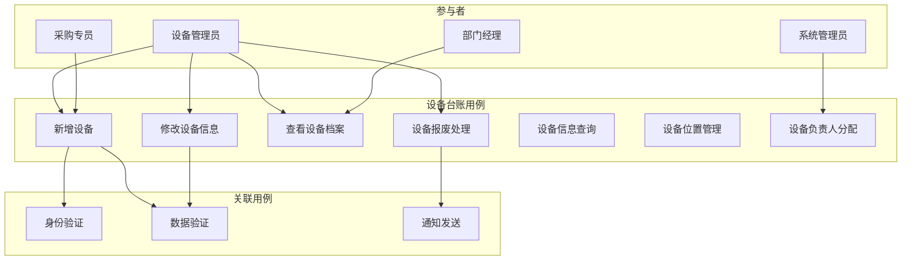

# GMP系统设备管理模块用例图和用例描述

## 文档信息
- **文档版本**: v1.0
- **创建日期**: 2025-11-21
- **最后更新**: 2025-11-21
- **作者**: 业务分析师
- **审核人**: 系统架构师

## 目录
1. [概述](#概述)
2. [系统参与者](#系统参与者)
3. [主要用例图](#主要用例图)
4. [核心用例描述](#核心用例描述)
5. [扩展用例](#扩展用例)
6. [用例关系](#用例关系)
7. [业务规则](#业务规则)

---

## 概述

### 文档目的
本文档定义了GMP系统设备管理模块的用例图和详细用例描述，为系统设计和开发提供业务需求基础。

### 用例方法论
- **UML标准**: 采用UML 2.5标准绘制用例图
- **场景驱动**: 基于真实业务场景描述用例
- **角色导向**: 从用户角色出发设计用例
- **功能完整**: 覆盖所有核心业务功能

### 用例分类
1. **管理类用例**: 设备管理员执行的用例
2. **维护类用例**: 维护人员执行的核心用例
3. **检验类用例**: 检验校准相关用例
4. **监控类用例**: 设备监控和报警用例

---

## 系统参与者

### 主要参与者

#### 1. 设备管理员 (Equipment Administrator)
- **角色描述**: 负责设备台账和设备管理工作的专业人员
- **主要职责**:
  - 设备档案管理
  - 设备分类维护
  - 设备状态监控
  - 设备档案归档
- **权限范围**: 设备数据管理、设备配置管理、全局查询
- **使用频率**: 高频使用，每天多次

#### 2. 维护技师 (Maintenance Technician)
- **角色描述**: 负责设备维护和维修工作的技术人员
- **主要职责**:
  - 预防性维护执行
  - 故障维修处理
  - 维护记录录入
  - 备件管理
- **权限范围**: 维护计划执行、维修工单处理、备件使用
- **使用频率**: 高频使用，按维护计划执行

#### 3. 设备操作员 (Equipment Operator)
- **角色描述**: 负责设备日常操作的操作人员
- **主要职责**:
  - 设备日常操作
  - 设备状态检查
  - 异常情况报告
  - 设备清洁保养
- **权限范围**: 设备状态查看、异常报告、操作记录
- **使用频率**: 高频使用，每个班次使用

#### 4. 质量部门 (Quality Department)
- **角色描述**: 负责GMP合规性监督的部门
- **主要职责**:
  - 设备检验校准
  - 合规性检查
  - 审计追踪
  - 违规处理
- **权限范围**: 检验校准管理、合规性管理、审计查询
- **使用频率**: 中频使用，按检验计划使用

#### 5. 部门经理 (Department Manager)
- **角色描述**: 各业务部门的管理者
- **主要职责**:
  - 设备使用审批
  - 维护预算审批
  - 设备采购申请
  - 部门设备管理
- **权限范围**: 部门设备管理、预算审批、采购审批
- **使用频率**: 中频使用，每周多次

#### 6. 系统管理员 (System Administrator)
- **角色描述**: 负责系统维护和配置的技术人员
- **主要职责**:
  - 系统配置管理
  - 用户权限设置
  - 数据备份恢复
  - 系统监控
- **权限范围**: 系统配置、权限管理、技术维护
- **使用频率**: 低频使用，按需使用

### 次要参与者

#### 7. 采购专员 (Procurement Specialist)
- **角色描述**: 负责设备采购和供应商管理的人员
- **主要职责**:
  - 设备采购执行
  - 供应商管理
  - 合同管理
  - 设备验收
- **权限范围**: 采购流程管理、供应商信息管理
- **使用频率**: 中频使用，按采购需求使用

#### 8. 外部检验机构 (External Inspection Agency)
- **角色描述**: 负责法定检验和校准的外部机构
- **主要职责**:
  - 法定设备检验
  - 计量器具校准
  - 检验报告出具
  - 证书管理
- **权限范围**: 检验数据录入、证书信息查看
- **使用频率**: 低频使用，按检验周期使用

---

## 主要用例图

### 整体系统用例图

### 详细用例图 - 设备台账管理模块

---

## 核心用例描述

### 用例1: 设备台账管理

#### 用例概述
- **用例编号**: UC-EQ-001
- **用例名称**: 设备台账管理
- **主要参与者**: 设备管理员
- **次要参与者**: 部门经理、采购专员、系统管理员
- **优先级**: 高
- **业务价值**: 确保设备信息的完整性和准确性，支持设备全生命周期管理

#### 前置条件
1. 用户已登录系统并获得相应权限
2. 设备采购已完成并需要建档
3. 系统正常运行，网络连接正常

#### 后置条件
1. 设备信息成功保存到数据库
2. 相关通知已发送给相关部门
3. 系统日志记录了操作过程

#### 主成功场景
1. 设备管理员登录系统
2. 选择"设备台账管理"功能
3. 点击"新增设备"按钮
4. 系统显示设备信息录入表单
5. 填写设备基本信息（设备编号、名称、型号、制造商等）
6. 填写设备技术参数（功率、容量、精度等）
7. 填写设备采购信息（供应商、采购日期、价格等）
8. 填写设备位置信息（安装位置、部门、负责人等）
9. 上传设备技术文档和图片
10. 系统验证数据完整性和格式
11. 保存设备信息并生成设备编码
12. 自动创建设备档案
13. 发送通知给部门经理和设备负责人
14. 记录操作日志

#### 扩展场景
**2a. 批量导入设备信息**
- 2a1. 选择Excel模板导入功能
- 2a2. 上传包含设备信息的Excel文件
- 2a3. 系统验证数据格式
- 2a4. 确认导入信息
- 2a5. 批量创建设备记录

#### 异常处理
1. **设备编号重复**: 检测到重复设备编号时提示用户检查
2. **数据验证失败**: 显示错误信息并标红错误字段
3. **文件上传失败**: 提示用户重新上传或跳过

#### 业务规则
1. 设备编号必须唯一，由系统自动生成
2. 关键设备必须有完整的技术文档
3. 设备位置信息必须准确
4. 必填字段不能为空
5. GMP关键设备必须有合规标识

---

### 用例2: 维护计划制定

#### 用例概述
- **用例编号**: UC-EQ-002
- **用例名称**: 维护计划制定
- **主要参与者**: 设备管理员
- **次要参与者**: 维护技师、部门经理
- **优先级**: 高
- **业务价值**: 确保设备得到及时有效的维护，延长设备使用寿命

#### 前置条件
1. 设备已完成建档并投入使用
2. 设备维护标准已制定
3. 维护资源和人员已确认

#### 后置条件
1. 维护计划已生成并保存
2. 维护提醒已设置
3. 维护资源已预留

#### 主成功场景
1. 设备管理员登录维护管理模块
2. 选择"维护计划制定"功能
3. 选择需要制定计划的设备
4. 设置维护类型（预防性维护、校正性维护、预测性维护）
5. 设定维护周期（按时间、按使用小时、按生产批次）
6. 定义维护内容和标准
7. 指定维护人员和所需备件
8. 估算维护时间和成本
9. 设置维护提醒规则
10. 提交维护计划审批
11. 审批通过后自动生成维护任务
12. 发送维护计划通知给相关人员

#### 扩展场景
**4a. 智能维护计划**
- 4a1. 选择"智能推荐"功能
- 4a2. 系统分析设备运行数据
- 4a3. 基于历史故障模式推荐维护策略
- 4a4. 用户确认推荐结果
- 4a5. 生成维护计划

#### 异常处理
1. **维护标准缺失**: 提示用户先制定设备维护标准
2. **资源冲突**: 检测到维护资源冲突时提示重新安排

#### 业务规则
1. 关键设备维护周期不能超过规定时间
2. 维护计划必须经过部门经理审批
3. 维护成本必须在预算范围内
4. GMP关键设备维护必须符合法规要求

---

### 用例3: 故障维修处理

#### 用例概述
- **用例编号**: UC-EQ-003
- **用例名称**: 故障维修处理
- **主要参与者**: 维护技师
- **次要参与者**: 设备操作员、设备管理员
- **优先级**: 高
- **业务价值**: 快速响应设备故障，最小化生产影响

#### 前置条件
1. 设备发生故障或异常
2. 故障信息已报告
3. 维修人员和工具已准备

#### 后置条件
1. 故障已修复并测试通过
2. 维修记录已保存
3. 设备恢复正常运行

#### 主成功场景
1. 维护技师接收到故障报警或维修工单
2. 赶到现场确认故障情况
3. 分析故障原因并制定维修方案
4. 申请必要的备件和工具
5. 执行维修作业
6. 记录维修过程和使用的备件
7. 维修完成后进行功能测试
8. 确认设备恢复正常
9. 填写维修报告
10. 关闭维修工单
11. 记录维修数据和经验

#### 扩展场景
**3a. 远程故障诊断**
- 3a1. 通过系统远程连接设备
- 3a2. 查看设备运行参数和日志
- 3a3. 进行远程诊断
- 3a4. 确定维修方案

#### 异常处理
1. **无法修复**: 启动设备报废或更换流程
2. **备件缺失**: 申请紧急采购或替代方案

#### 业务规则
1. 关键设备故障必须在2小时内响应
2. 维修过程必须详细记录
3. 更换的备件必须有合格证明
4. 重大故障必须上报管理层

---

### 用例4: 设备检验校准

#### 用例概述
- **用例编号**: UC-EQ-004
- **用例名称**: 设备检验校准
- **主要参与者**: 质量部门
- **次要参与者**: 设备管理员、外部检验机构
- **优先级**: 高
- **业务价值**: 确保设备精度符合GMP要求，保证产品质量

#### 前置条件
1. 设备已达到检验周期
2. 检验标准和程序已制定
3. 检验设备和人员已准备

#### 后置条件
1. 检验报告已生成
2. 设备精度状态已确认
3. 不合格设备已处理

#### 主成功场景
1. 质量部门人员登录检验管理模块
2. 查看待检验设备列表
3. 选择需要检验的设备
4. 查看设备检验历史和标准
5. 执行设备检验作业
6. 记录检验数据和结果
7. 对不合格项目发出整改通知
8. 生成检验报告
9. 更新设备精度状态
10. 安排下次检验时间

#### 扩展场景
**5a. 外部检验机构检验**
- 5a1. 联系外部检验机构
- 5a2. 安排现场检验时间
- 5a3. 配合外部检验
- 5a4. 获取检验报告

#### 异常处理
1. **检验不合格**: 立即停用设备并安排维修
2. **检验设备故障**: 使用备用检验设备

#### 业务规则
1. 计量器具必须按周期检验
2. 检验记录必须保存完整
3. 不合格设备必须立即停用
4. 检验证书必须有效期内

---

### 用例5: 设备状态监控

#### 用例概述
- **用例编号**: UC-EQ-005
- **用例名称**: 设备状态监控
- **主要参与者**: 设备操作员
- **次要参与者**: 维护技师、设备管理员
- **优先级**: 高
- **业务价值**: 实时掌握设备运行状态，预防设备故障

#### 前置条件
1. 设备已安装监控传感器
2. 监控系统正常运行
3. 报警阈值已设定

#### 后置条件
1. 设备状态信息已更新
2. 异常情况已处理
3. 监控数据已记录

#### 主成功场景
1. 设备操作员登录监控界面
2. 查看设备实时运行状态
3. 检查关键参数是否正常
4. 确认无异常报警
5. 记录设备运行数据
6. 定期巡检设备外观
7. 报告发现的异常情况

#### 扩展场景
**2a. 远程监控**
- 2a1. 通过移动设备远程查看
- 2a2. 接收实时报警推送
- 2a3. 远程执行紧急停机

#### 异常处理
1. **参数超限**: 自动报警并通知相关人员
2. **通信中断**: 切换到手动监控模式

#### 业务规则
1. 关键参数必须实时监控
2. 异常情况必须在5分钟内响应
3. 监控数据必须保存至少1年
4. 报警设置必须合理有效

---

## 扩展用例

### 用例6: 报告生成

#### 用例概述
- **用例编号**: UC-EQ-006
- **用例名称**: 报告生成
- **主要参与者**: 设备管理员
- **次要参与者**: 部门经理、高级管理层
- **优先级**: 中
- **业务价值**: 提供设备管理报表，支持决策分析

#### 功能描述
1. 设备台账报表
2. 维护统计报表
3. 设备效率分析报表
4. 维修成本分析报表
5. 检验校准报表

### 用例7: 审计追踪

#### 用例概述
- **用例编号**: UC-EQ-007
- **用例名称**: 审计追踪
- **主要参与者**: 质量部门
- **次要参与者**: 系统管理员、外部审计员
- **优先级**: 高
- **业务价值**: 提供完整的操作审计记录，满足GMP审计要求

#### 功能描述
1. 设备操作日志查询
2. 数据变更历史追踪
3. 维护记录审计
4. 权限变更记录
5. 审计报告导出

---

## 用例关系

### 包含关系 (Include)
1. **设备台账管理** 包含 **数据验证**
2. **维护计划制定** 包含 **资源可用性检查**
3. **故障维修处理** 包含 **备件库存检查**
4. **设备状态监控** 包含 **报警处理**

### 扩展关系 (Extend)
1. **设备台账管理** 可扩展为 **批量导入**
2. **故障维修处理** 可扩展为 **远程诊断**
3. **设备检验校准** 可扩展为 **外部检验**
4. **设备状态监控** 可扩展为 **远程监控**

---

## 业务规则

### 通用业务规则
1. 所有用户操作必须记录审计日志
2. 敏感信息必须加密存储
3. 数据变更必须经过权限验证
4. 系统必须支持中文界面
5. 关键操作必须支持回滚

### GMP特殊规则
1. 关键设备必须有完整的维护记录
2. 检验校准必须符合法定要求
3. 设备故障必须及时报告和处理
4. 维护人员必须具备相应资质
5. 设备档案必须保存完整

### 系统性能规则
1. 页面响应时间不超过3秒
2. 支持500+并发用户
3. 数据查询响应时间不超过2秒
4. 系统可用性达到99.9%
5. 数据备份每日自动执行

---

*本文档是GMP系统设备管理模块用例图和用例描述的完整定义，为系统设计和开发提供详细的业务需求基础。*
