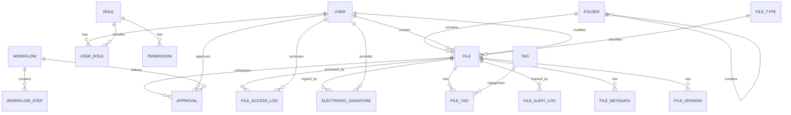
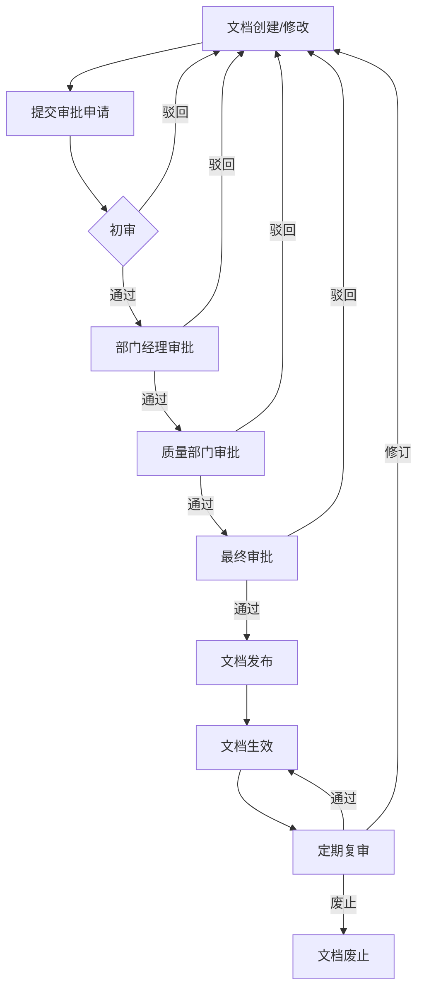
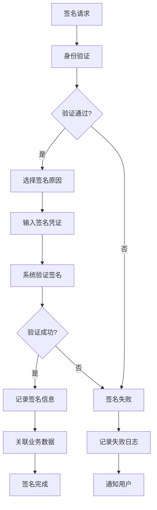
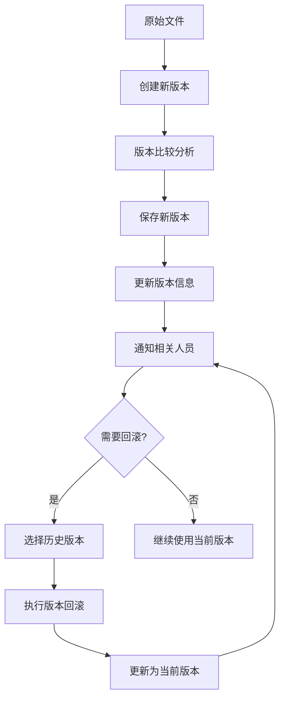

# 文件服务子系统详细需求文档

## 1. 文档概述

### 1.1 文档目的
本文档详细描述GMP医药企业文件服务子系统的功能需求、非功能需求、数据需求、集成需求、验收标准和风险评估，作为系统设计、开发和测试的依据，确保系统满足GMP合规性要求和业务需求。

### 1.2 术语定义

| 术语 | 解释 |
|------|------|
| GMP | 药品生产质量管理规范(Good Manufacturing Practice)，确保药品质量的法规要求 |
| 电子记录 | 由计算机系统生成、修改、维护、归档、检索或分发的文本、图表、数据、声音、图像等数字形式的信息 |
| 电子签名 | 用于确认操作执行者身份并表明其对操作内容的认可的电子数据 |
| 审计跟踪 | 系统自动记录的所有关键操作的详细日志，用于合规审计 |
| 文件生命周期 | 文件从创建到归档或销毁的整个过程，包括创建、审批、发布、使用、归档、检索、销毁等阶段 |
| 元数据 | 描述文件特征的数据，如文件名称、大小、类型、创建日期、修改日期、版本等 |
| 版本控制 | 跟踪文件的所有修改历史，支持不同版本的查看、比较和恢复 |
| 权限控制 | 基于角色和用户的文件访问和操作权限管理 |
| 文档模板 | 预定义格式的文档结构，用于确保文档格式和内容的一致性 |
| 工作流 | 定义文件处理的一系列步骤和规则，如审批流程 |
| 灾难恢复 | 在系统故障或灾难发生后，恢复数据和系统功能的过程 |

## 2. 功能需求

### 2.1 文件存储与管理模块

#### 2.1.1 文件上传与下载

| 功能点 | 用户故事/缘由说明 | 输入/输出/流程 | 详细说明 | 验收标准 | 优先级 |
|--------|-------------------|----------------|----------|----------|--------|
| **文件上传** | 作为文档管理员，我希望能够上传各种类型的文件，以便集中存储和管理 | 输入：文件数据、文件信息（名称、类型、描述、分类等） 输出：上传成功确认、文件ID 流程：选择文件→填写元数据→上传→验证→存储→返回文件ID | 1. 支持多种文件格式（PDF、Word、Excel、图片、视频等） 2. 大文件分片上传（>1GB） 3. 断点续传功能 4. 文件格式和大小验证 5. 上传进度显示 6. 自动生成文件唯一标识符 | 1. 所有支持的文件格式均可成功上传 2. 大文件上传稳定且有进度提示 3. 断点续传功能正常 4. 验证规则有效 5. 文件ID生成唯一 | 高 |
| **文件下载** | 作为授权用户，我希望能够下载文件，以便查看和使用 | 输入：文件ID或路径 输出：文件内容 流程：请求下载→权限验证→获取文件→传输→完成 | 1. 支持单个文件下载 2. 支持批量文件打包下载 3. 下载权限控制 4. 下载日志记录 5. 支持版本下载 | 1. 单个和批量下载功能正常 2. 无权限用户无法下载 3. 下载记录完整 4. 可下载指定版本 | 高 |
| **文件预览** | 作为用户，我希望能够在线预览文件内容，无需下载 | 输入：文件ID 输出：文件预览视图 流程：请求预览→权限验证→文件转换→生成预览→显示 | 1. 支持常见格式在线预览（PDF、Word、Excel、图片等） 2. 预览权限控制 3. 预览操作日志记录 4. 缩放、搜索、翻页等功能 | 1. 支持的文件格式均可正确预览 2. 无权限用户无法预览 3. 预览功能稳定流畅 | 高 |
| **文件分享** | 作为用户，我希望能够分享文件给其他用户或外部人员，以便协作和沟通 | 输入：文件ID、分享对象、权限、有效期 输出：分享链接或通知 流程：选择文件→设置分享参数→生成分享→发送通知 | 1. 内部用户分享（基于用户/角色） 2. 外部用户分享（生成临时链接） 3. 设置分享权限（只读/编辑/下载） 4. 设置分享有效期 5. 分享密码保护 6. 分享日志记录 | 1. 分享功能正常且安全 2. 权限和有效期设置生效 3. 分享记录完整 4. 外部分享安全可控 | 高 |

#### 2.1.2 文件组织与分类

| 功能点 | 用户故事/缘由说明 | 输入/输出/流程 | 详细说明 | 验收标准 | 优先级 |
|--------|-------------------|----------------|----------|----------|--------|
| **文件夹管理** | 作为文档管理员，我希望能够创建和管理文件夹结构，以便分类存储文件 | 输入：文件夹名称、父文件夹、描述、权限 输出：文件夹创建/更新确认 流程：创建/修改文件夹→设置权限→保存 | 1. 支持多级文件夹结构 2. 文件夹重命名、移动、删除 3. 文件夹权限继承和覆盖 4. 文件夹描述和元数据 5. 文件夹共享功能 | 1. 文件夹结构创建和管理正常 2. 权限设置正确 3. 描述和元数据保存成功 | 高 |
| **文件分类标签** | 作为用户，我希望能够为文件添加分类标签，以便快速查找和管理 | 输入：文件ID、标签信息 输出：标签设置确认 流程：选择文件→添加/修改标签→保存 | 1. 自定义标签体系 2. 多标签支持 3. 标签继承 4. 基于标签的文件检索 5. 标签统计功能 | 1. 标签添加和管理功能正常 2. 多标签支持有效 3. 基于标签的检索准确 | 高 |
| **文件版本控制** | 作为文档管理员，我希望能够管理文件的版本，以便跟踪变更历史和恢复旧版本 | 输入：文件内容、版本说明、版本类型 输出：新版本确认 流程：上传新版本→版本比对→保存→通知相关人员 | 1. 自动版本递增 2. 版本备注和说明 3. 版本差异比较 4. 版本回滚和恢复 5. 版本权限控制 6. 版本历史查询 | 1. 版本创建和管理功能正常 2. 版本比对准确 3. 回滚功能有效 4. 历史记录完整 | 高 |
| **文档模板管理** | 作为文档管理员，我希望能够管理标准文档模板，以确保文档格式和内容一致性 | 输入：模板文件、模板信息（名称、描述、适用范围等） 输出：模板创建/更新确认 流程：上传模板→设置参数→保存→应用 | 1. 支持多种模板格式 2. 模板分类管理 3. 模板版本控制 4. 基于模板创建新文档 5. 模板权限管理 | 1. 模板上传和管理功能正常 2. 基于模板创建文档正确 3. 权限控制有效 | 中 |

### 2.2 文件检索与发现模块

#### 2.2.1 文件搜索

| 功能点 | 用户故事/缘由说明 | 输入/输出/流程 | 详细说明 | 验收标准 | 优先级 |
|--------|-------------------|----------------|----------|----------|--------|
| **全文搜索** | 作为用户，我希望能够通过关键词搜索文件内容，以便快速找到所需信息 | 输入：搜索关键词、搜索范围、搜索选项 输出：搜索结果列表 流程：输入关键词→设置参数→执行搜索→展示结果→排序筛选 | 1. 文件名和内容全文搜索 2. 支持通配符和模糊搜索 3. 搜索结果高亮显示 4. 多条件组合搜索 5. 搜索历史记录 6. 搜索结果排序（相关性/时间/名称） | 1. 搜索结果准确 2. 高亮显示正常 3. 组合搜索功能有效 4. 排序功能正确 | 高 |
| **高级搜索** | 作为用户，我希望能够通过多个条件精确搜索文件，以便更精准地查找 | 输入：多维度搜索条件（文件类型、日期、创建者、标签等） 输出：符合条件的文件列表 流程：设置多个搜索条件→执行搜索→展示结果→进一步筛选 | 1. 多条件组合查询 2. 日期范围搜索 3. 文件类型过滤 4. 创建者/修改者过滤 5. 标签/分类过滤 6. 保存搜索条件 | 1. 所有搜索条件正常工作 2. 组合查询结果准确 3. 搜索条件保存功能有效 | 高 |
| **搜索建议与自动完成** | 作为用户，我希望在搜索时获得建议和自动完成功能，以提高搜索效率 | 输入：部分搜索关键词 输出：搜索建议列表 流程：输入关键词→系统提示建议→用户选择→执行搜索 | 1. 基于历史搜索的建议 2. 基于热门搜索的建议 3. 基于当前输入的自动完成 4. 建议结果高亮显示 | 1. 搜索建议准确且及时 2. 自动完成功能有效 3. 高亮显示正常 | 中 |
| **搜索结果导出** | 作为用户，我希望能够导出搜索结果，以便离线分析和报告 | 输入：导出格式、选择的结果 输出：导出文件 流程：执行搜索→选择结果→设置导出格式→导出 | 1. 支持Excel、CSV格式导出 2. 可选择导出字段 3. 支持批量导出 4. 导出权限控制 | 1. 导出功能正常 2. 导出文件格式正确 3. 权限控制有效 | 中 |

#### 2.2.2 文件推荐与发现

| 功能点 | 用户故事/缘由说明 | 输入/输出/流程 | 详细说明 | 验收标准 | 优先级 |
|--------|-------------------|----------------|----------|----------|--------|
| **热门文档推荐** | 作为用户，我希望看到热门和推荐的文档，以便发现重要信息 | 输入：用户信息、访问历史 输出：推荐文档列表 流程：分析用户行为→计算推荐结果→展示推荐列表 | 1. 基于访问量的热门文档 2. 基于部门/角色的推荐 3. 基于用户历史行为的个性化推荐 4. 最近更新的文档推荐 | 1. 推荐结果合理 2. 个性化推荐有效 3. 更新及时 | 中 |
| **相关文档关联** | 作为用户，我希望在查看文档时看到相关的其他文档，以便获取更全面的信息 | 输入：当前文档ID 输出：相关文档列表 流程：分析文档内容和关系→计算相关度→展示相关文档 | 1. 基于内容相似度的关联 2. 基于文件夹和标签的关联 3. 基于引用关系的关联 4. 用户可管理关联关系 | 1. 相关文档推荐准确 2. 关联关系有效 3. 管理功能正常 | 中 |
| **最近访问文档** | 作为用户，我希望快速访问最近查看过的文档，以提高工作效率 | 输入：用户ID 输出：最近访问文档列表 流程：记录用户访问→按时间排序→展示最近访问 | 1. 记录最近访问的文档列表 2. 支持清除访问历史 3. 支持将常用文档标记为收藏 4. 快速访问快捷方式 | 1. 最近访问记录准确 2. 清除历史功能正常 3. 收藏功能有效 | 高 |
| **文档收藏管理** | 作为用户，我希望能够收藏常用文档，以便快速访问 | 输入：文件ID、收藏操作 输出：收藏状态更新 流程：选择文档→执行收藏/取消收藏→更新收藏列表 | 1. 添加/取消收藏 2. 收藏文档分类管理 3. 收藏夹权限控制 4. 收藏文档快速检索 | 1. 收藏功能正常 2. 分类管理有效 3. 权限控制正确 | 高 |

### 2.3 GMP合规管理模块

#### 2.3.1 电子记录管理

| 功能点 | 用户故事/缘由说明 | 输入/输出/流程 | 详细说明 | 验收标准 | 优先级 |
|--------|-------------------|----------------|----------|----------|--------|
| **电子记录创建** | 作为文档编制人，我希望创建符合GMP要求的电子记录，以确保数据的合规性 | 输入：记录内容、元数据、关联信息 输出：电子记录创建确认 流程：填写记录内容→添加元数据→电子签名→保存 | 1. 基于模板创建记录 2. 必填字段验证 3. 数据格式验证 4. 创建时电子签名 5. 自动生成记录ID和时间戳 | 1. 记录创建成功 2. 验证规则有效 3. 电子签名功能正常 4. ID和时间戳生成正确 | 高 |
| **电子记录修改** | 作为授权用户，我希望能够修改电子记录，同时保留修改痕迹 | 输入：修改内容、修改原因、电子签名 输出：记录更新确认 流程：查看记录→申请修改→填写原因→执行修改→电子签名→保存 | 1. 修改权限控制 2. 修改原因记录 3. 修改前后内容对比 4. 修改时电子签名 5. 修改历史完整记录 | 1. 只有授权用户可修改 2. 原因记录完整 3. 电子签名有效 4. 修改历史可追溯 | 高 |
| **电子记录归档** | 作为文档管理员，我希望能够归档电子记录，以便长期保存和合规管理 | 输入：归档操作、归档参数 输出：归档确认 流程：选择记录→执行归档→设置归档参数→完成归档 | 1. 归档权限控制 2. 归档前完整性检查 3. 归档元数据记录 4. 归档后只读保护 5. 归档记录检索功能 | 1. 归档功能正常 2. 归档后记录只读 3. 检索功能有效 | 高 |
| **电子记录销毁** | 作为文档管理员，我希望能够按规定销毁电子记录，以符合数据生命周期管理 | 输入：销毁操作、销毁原因、审批信息 输出：销毁确认 流程：申请销毁→审批→执行销毁→记录销毁过程 | 1. 销毁审批流程 2. 销毁原因记录 3. 销毁前备份选项 4. 销毁操作审计 5. 销毁历史记录 | 1. 销毁流程严格执行 2. 审批记录完整 3. 审计跟踪有效 | 中 |

#### 2.3.2 电子签名管理

| 功能点 | 用户故事/缘由说明 | 输入/输出/流程 | 详细说明 | 验收标准 | 优先级 |
|--------|-------------------|----------------|----------|----------|--------|
| **电子签名配置** | 作为系统管理员，我希望配置电子签名参数，以符合GMP和21 CFR Part 11要求 | 输入：签名算法、验证方式、安全参数 输出：配置确认 流程：设置签名参数→保存配置→应用生效 | 1. 支持多种签名算法 2. 签名验证机制配置 3. 签名时效性设置 4. 签名失败处理策略 5. 签名日志记录设置 | 1. 配置生效正确 2. 符合法规要求 3. 安全参数设置有效 | 高 |
| **电子签名执行** | 作为用户，我希望能够进行电子签名操作，以确认文档的真实性和完整性 | 输入：用户凭证、签名原因、操作信息 输出：签名确认 流程：身份验证→选择签名操作→填写原因→执行签名→验证保存 | 1. 签名前身份强验证 2. 签名原因记录 3. 签名时间戳 4. 签名内容关联 5. 签名结果反馈 | 1. 身份验证有效 2. 签名信息完整记录 3. 签名关联正确 | 高 |
| **电子签名验证** | 作为合规审计员，我希望能够验证电子签名的有效性，以确保签名的真实性 | 输入：签名数据、文档信息 输出：验证结果 流程：提交签名→系统验证→返回验证结果 | 1. 签名完整性验证 2. 签名者身份验证 3. 签名时间验证 4. 签名算法验证 5. 验证结果详细报告 | 1. 验证功能准确 2. 报告内容完整 3. 异常情况识别 | 高 |
| **电子签名审计** | 作为合规管理员，我希望能够查看电子签名的审计记录，以支持合规审计 | 输入：查询条件（签名者、时间、操作类型等） 输出：签名审计报告 流程：设置查询条件→执行查询→生成报告→查看/导出 | 1. 签名操作详细记录 2. 多条件组合查询 3. 报告生成与导出 4. 审计数据完整性保护 | 1. 审计记录完整 2. 查询功能有效 3. 报告格式正确 | 高 |

#### 2.3.3 审计跟踪管理

| 功能点 | 用户故事/缘由说明 | 输入/输出/流程 | 详细说明 | 验收标准 | 优先级 |
|--------|-------------------|----------------|----------|----------|--------|
| **审计日志记录** | 作为系统管理员，我希望系统自动记录所有关键操作的审计日志，以满足合规要求 | 输入：系统捕获的操作信息 输出：审计日志记录 流程：执行操作→系统捕获→格式化日志→加密存储→防篡改保护 | 1. 记录所有关键操作（创建、修改、删除、审批等） 2. 记录详细信息（用户、时间、IP、操作内容、结果等） 3. 日志加密存储 4. 日志防篡改保护 5. 日志完整性校验 | 1. 所有关键操作均有日志 2. 日志内容完整 3. 加密和防篡改有效 | 高 |
| **审计日志查询** | 作为审计员，我希望能够查询和过滤审计日志，以便进行合规审计和问题追溯 | 输入：查询条件（用户、时间、操作类型、对象等） 输出：日志查询结果 流程：设置查询条件→执行查询→展示结果→进一步筛选/排序 | 1. 多维度条件查询 2. 时间范围筛选 3. 结果排序和分页 4. 复杂查询组合 5. 查询历史保存 | 1. 查询功能正常 2. 结果准确 3. 筛选排序有效 | 高 |
| **审计报告生成** | 作为合规管理员，我希望能够生成审计报告，以便支持内部和外部审计 | 输入：报告参数（时间范围、操作类型等） 输出：审计报告 流程：设置报告参数→执行统计→生成报告→审核→导出 | 1. 多类型审计报告模板 2. 自定义报告内容 3. 报告数据可视化 4. 报告导出（PDF、Excel等） 5. 报告电子签名 | 1. 报告生成正常 2. 数据准确 3. 格式正确 4. 导出功能有效 | 高 |
| **异常操作监控** | 作为安全管理员，我希望系统能够监控和告警异常操作，以及时发现潜在风险 | 输入：监控规则、告警阈值 输出：异常操作告警 流程：实时监控操作→检测异常→触发告警→通知相关人员 | 1. 自定义异常操作规则 2. 实时监控和告警 3. 多渠道通知（邮件、短信、系统消息） 4. 告警级别设置 5. 告警处理跟踪 | 1. 异常操作检测准确 2. 告警及时触发 3. 通知功能正常 | 高 |

### 2.4 工作流与审批模块

#### 2.4.1 文档审批工作流

| 功能点 | 用户故事/缘由说明 | 输入/输出/流程 | 详细说明 | 验收标准 | 优先级 |
|--------|-------------------|----------------|----------|----------|--------|
| **工作流定义** | 作为系统管理员，我希望能够定义和配置文档审批工作流，以满足不同文档类型的审批需求 | 输入：工作流名称、步骤、审批人、条件、规则 输出：工作流配置确认 流程：设计工作流→设置步骤和规则→保存配置→启用 | 1. 可视化工作流设计器 2. 多步骤审批流程 3. 基于规则的审批路径 4. 并行和串行审批 5. 条件分支设置 6. 工作流版本控制 | 1. 工作流设计和配置功能正常 2. 规则设置生效 3. 版本控制有效 | 高 |
| **文档提交审批** | 作为文档编制人，我希望能够提交文档进行审批，以便正式发布和使用 | 输入：文档ID、审批类型、审批说明 输出：审批启动确认 流程：选择文档→填写说明→选择工作流→提交审批→通知审批人 | 1. 支持单个和批量提交 2. 提交前检查和验证 3. 审批历史关联 4. 自动通知审批人 5. 提交状态跟踪 | 1. 提交功能正常 2. 检查验证有效 3. 通知及时发送 | 高 |
| **审批处理** | 作为审批人，我希望能够处理待审批文档，以便控制文档质量和合规性 | 输入：审批决策（同意/驳回）、意见、电子签名 输出：审批结果 流程：查看待审批→审核文档→填写意见→执行审批→电子签名→通知相关方 | 1. 待办任务提醒 2. 文档在线审核 3. 审批意见记录 4. 审批电子签名 5. 审批结果通知 6. 审批超时自动处理 | 1. 审批流程正常 2. 签名功能有效 3. 通知及时 4. 超时处理正确 | 高 |
| **审批跟踪与监控** | 作为文档管理员，我希望能够跟踪和监控审批进度，以便及时处理异常情况 | 输入：查询条件（文档ID、申请人、状态等） 输出：审批进度和状态 流程：设置查询条件→查询审批→查看进度→必要时干预 | 1. 实时审批状态更新 2. 审批流程图展示 3. 审批历史记录 4. 审批超时提醒 5. 审批干预功能（催办、转交等） | 1. 状态跟踪准确 2. 图表展示清晰 3. 干预功能有效 | 高 |

#### 2.4.2 文档发布与变更管理

| 功能点 | 用户故事/缘由说明 | 输入/输出/流程 | 详细说明 | 验收标准 | 优先级 |
|--------|-------------------|----------------|----------|----------|--------|
| **文档发布** | 作为文档管理员，我希望能够正式发布文档，使其对授权用户可见和可用 | 输入：发布操作、发布参数（生效日期、访问权限等） 输出：发布确认 流程：文档审批通过→设置发布参数→执行发布→通知相关人员 | 1. 发布前权限检查 2. 设置发布范围 3. 发布时间控制 4. 发布后版本锁定 5. 发布通知 6. 发布记录审计 | 1. 发布功能正常 2. 权限控制有效 3. 通知及时 4. 审计记录完整 | 高 |
| **文档变更申请** | 作为用户，我希望能够申请变更已发布的文档，以更新内容或修正错误 | 输入：变更申请（文档ID、变更原因、影响分析等） 输出：变更申请确认 流程：选择文档→填写变更信息→提交申请→审核→执行变更 | 1. 变更申请表单 2. 变更影响分析 3. 变更审批流程 4. 变更历史记录 5. 变更通知 | 1. 申请功能正常 2. 审批流程有效 3. 历史记录完整 | 高 |
| **文档有效性管理** | 作为文档管理员，我希望能够管理文档的有效期限，以确保文档的时效性 | 输入：有效期设置、过期提醒参数 输出：有效期设置确认 流程：设置文档有效期→配置提醒→监控状态→到期处理 | 1. 文档有效期设置 2. 过期前自动提醒 3. 过期文档状态变更 4. 文档复审流程 5. 有效期报告 | 1. 有效期设置生效 2. 提醒功能正常 3. 状态变更准确 | 高 |
| **文档撤回与废止** | 作为文档管理员，我希望能够撤回或废止不再有效的文档，以避免误用 | 输入：撤回/废止操作、原因、审批信息 输出：操作确认 流程：申请撤回/废止→审批→执行→通知相关人员 | 1. 撤回/废止审批流程 2. 原因记录 3. 废止后的文档状态管理 4. 通知相关用户 5. 历史版本保留 | 1. 操作流程正常 2. 审批记录完整 3. 通知及时 4. 版本保留有效 | 高 |

### 2.5 系统管理与安全模块

#### 2.5.1 用户与权限管理

| 功能点 | 用户故事/缘由说明 | 输入/输出/流程 | 详细说明 | 验收标准 | 优先级 |
|--------|-------------------|----------------|----------|----------|--------|
| **用户管理** | 作为系统管理员，我希望能够管理系统用户，以确保只有授权人员可以访问系统 | 输入：用户信息（姓名、账号、角色、部门等） 输出：用户创建/更新确认 流程：创建/编辑用户→设置权限→保存→通知用户 | 1. 用户创建、编辑、删除 2. 用户状态管理（启用/禁用） 3. 用户信息完整记录 4. 密码策略和重置 5. 用户认证方式配置 | 1. 用户管理功能正常 2. 状态变更生效 3. 密码策略有效 | 高 |
| **角色管理** | 作为系统管理员，我希望能够管理系统角色和权限，以便基于角色分配访问权限 | 输入：角色信息、权限集合 输出：角色创建/更新确认 流程：创建/编辑角色→分配权限→保存→应用 | 1. 自定义角色创建 2. 细粒度权限控制 3. 权限继承和覆盖 4. 角色分配给用户/部门 5. 角色模板管理 | 1. 角色管理功能正常 2. 权限分配准确 3. 继承关系正确 | 高 |
| **文件访问权限** | 作为文档管理员，我希望能够控制文件和文件夹的访问权限，以保障数据安全 | 输入：权限设置（用户/角色、操作类型、范围） 输出：权限设置确认 流程：选择文件/文件夹→设置权限→保存→应用 | 1. 基于用户/角色的权限设置 2. 细粒度操作权限（读取/写入/删除/审批等） 3. 权限继承和覆盖 4. 临时权限授予 5. 权限审计日志 | 1. 权限设置有效 2. 无权限用户访问被拒绝 3. 审计记录完整 | 高 |
| **部门与组织结构** | 作为系统管理员，我希望能够管理组织架构，以便基于组织分配权限和资源 | 输入：部门信息、层级关系 输出：组织架构设置确认 流程：创建/编辑部门→设置层级关系→关联用户→保存 | 1. 多级部门结构 2. 部门负责人设置 3. 用户部门关联 4. 基于部门的权限继承 5. 组织架构可视化 | 1. 部门管理功能正常 2. 层级关系正确 3. 权限继承有效 | 高 |

#### 2.5.2 系统配置与监控

| 功能点 | 用户故事/缘由说明 | 输入/输出/流程 | 详细说明 | 验收标准 | 优先级 |
|--------|-------------------|----------------|----------|----------|--------|
| **系统参数配置** | 作为系统管理员，我希望能够配置系统参数，以优化系统性能和功能 | 输入：参数名称、值、描述 输出：配置确认 流程：设置参数→验证→保存→应用 | 1. 基础参数配置（存储路径、缓存大小等） 2. 安全参数配置 3. 性能参数配置 4. 日志级别配置 5. 参数变更记录 | 1. 配置生效正确 2. 变更记录完整 3. 验证机制有效 | 高 |
| **存储管理** | 作为系统管理员，我希望能够管理存储资源，以确保系统正常运行和数据安全 | 输入：存储配置、监控参数 输出：存储状态和管理确认 流程：配置存储→监控使用情况→必要时扩容/清理 | 1. 存储容量监控 2. 存储空间预警 3. 存储策略配置（备份、归档） 4. 存储扩容管理 5. 存储健康检查 | 1. 监控功能正常 2. 预警及时 3. 扩容功能有效 | 高 |
| **系统监控** | 作为系统管理员，我希望能够监控系统运行状态，以便及时发现和解决问题 | 输入：监控参数、告警阈值 输出：监控数据和告警 流程：收集系统指标→分析→展示→异常告警 | 1. 实时系统状态监控 2. 性能指标采集（响应时间、吞吐量等） 3. 资源使用监控（CPU、内存、磁盘等） 4. 异常告警和通知 5. 监控报表和趋势分析 | 1. 监控数据准确 2. 告警及时触发 3. 报表生成正常 | 高 |
| **备份与恢复** | 作为系统管理员，我希望能够进行系统备份和恢复，以保障数据安全和业务连续性 | 输入：备份/恢复操作、参数设置 输出：操作确认 流程：设置备份计划→执行备份→验证备份→必要时恢复 | 1. 全量和增量备份 2. 定时自动备份 3. 备份数据验证 4. 快速恢复功能 5. 备份历史管理 6. 异地备份选项 | 1. 备份功能正常 2. 恢复操作有效 3. 数据完整性验证通过 | 高 |

## 3. 非功能需求

### 3.1 性能需求

| 需求点 | 详细说明 | 验收标准 | 优先级 |
|--------|----------|----------|--------|
| **响应时间** | 系统在正常负载下的响应时间需满足： 1. 页面加载时间 < 3秒 2. 简单文件操作（上传、下载、预览）响应时间 < 5秒 3. 全文搜索响应时间 < 3秒 4. 复杂报表生成时间 < 10秒 5. 大文件操作（>1GB）应提供进度反馈 | 1. 负载测试验证响应时间 2. 95%请求在规定时间内完成 3. 大文件操作有进度显示 | 高 |
| **并发处理** | 系统需支持的并发用户数： 1. 正常情况下：300用户 2. 峰值情况下：600用户 3. 支持的每秒事务数(TPS)：200 4. 同时上传下载文件数：50 | 1. 并发测试验证用户承载 2. 峰值负载下系统稳定 3. 无明显性能下降 | 高 |
| **数据处理** | 系统需支持的数据处理能力： 1. 文件总量：100万+ 2. 总存储容量：10TB+ 3. 单文件大小上限：5GB 4. 每日新增文件：1000+ 5. 支持批量导入/导出：单次1000条元数据 | 1. 大数据量测试通过 2. 批量操作性能符合要求 3. 查询性能稳定 | 高 |
| **搜索性能** | 全文搜索性能要求： 1. 建立索引时间：新文件<5分钟内 2. 搜索响应时间：<3秒（100万文档） 3. 搜索准确率：>95% 4. 支持实时索引更新 | 1. 索引建立及时 2. 搜索响应时间达标 3. 搜索结果准确 | 高 |

### 3.2 可用性需求

| 需求点 | 详细说明 | 验收标准 | 优先级 |
|--------|----------|----------|--------|
| **系统可用性** | 系统整体可用性要求： 1. 正常运行时间(Uptime)：≥ 99.95% 2. 计划内维护时间：每月不超过4小时，且在非工作时间 3. 故障恢复时间(RTO)：≤ 30分钟 4. 数据恢复点目标(RPO)：≤ 5分钟 | 1. 长期运行监控 2. 故障演练测试 3. 维护窗口记录 | 高 |
| **容错性** | 系统需具备的容错能力： 1. 单点故障不影响整体系统 2. 数据备份和恢复机制 3. 错误处理和友好提示 4. 事务完整性保障 | 1. 故障注入测试 2. 恢复机制验证 3. 错误处理测试 | 高 |
| **数据可用性** | 数据访问的可用性要求： 1. 数据备份频率：每日全量备份，每小时增量备份 2. 数据冗余存储 3. 数据一致性保障 4. 归档数据快速检索 | 1. 备份恢复测试 2. 数据一致性验证 3. 恢复时间测试 | 高 |
| **扩展性** | 系统扩展能力要求： 1. 支持水平扩展（增加服务器节点） 2. 支持垂直扩展（增加硬件资源） 3. 模块化设计，支持功能插件 4. API接口扩展支持 | 1. 扩展测试 2. 性能影响评估 3. 功能插件验证 | 高 |

### 3.3 安全性需求

| 需求点 | 详细说明 | 验收标准 | 优先级 |
|--------|----------|----------|--------|
| **身份认证** | 用户身份认证要求： 1. 支持多因素认证 2. 密码策略符合安全要求(复杂度、定期更换) 3. 会话超时管理 4. 登录失败限制和锁定机制 5. 支持与企业SSO集成 | 1. 认证功能测试 2. 安全策略验证 3. 异常登录测试 | 高 |
| **授权控制** | 系统访问授权要求： 1. 基于角色的访问控制(RBAC) 2. 细粒度权限控制 3. 数据访问权限分离 4. 权限变更审计 5. 临时权限授予 | 1. 权限测试用例覆盖 2. 越权测试 3. 审计记录验证 | 高 |
| **数据安全** | 数据安全保护要求： 1. 敏感数据加密存储和传输 2. 数据脱敏展示 3. 数据访问审计 4. 防止SQL注入、XSS等攻击 5. 文件内容加密选项 | 1. 安全测试 2. 渗透测试 3. 加密验证 | 高 |
| **合规性安全** | 满足GMP合规的安全要求： 1. 电子签名功能符合21 CFR Part 11 2. 审计跟踪不可篡改 3. 数据完整性保护 4. 合规性报告生成 5. 定期安全评估 | 1. 合规性验证 2. 签名功能测试 3. 审计记录验证 | 高 |

### 3.4 易用性需求

| 需求点 | 详细说明 | 验收标准 | 优先级 |
|--------|----------|----------|--------|
| **用户界面设计** | 界面设计要求： 1. 符合现代UI/UX设计标准 2. 响应式设计，支持多设备 3. 直观的导航和操作流程 4. 一致的设计语言 5. 支持主题切换（明/暗模式） | 1. UI评审 2. 用户测试 3. 易用性评估 | 高 |
| **交互体验** | 用户交互体验要求： 1. 操作反馈及时 2. 批量操作支持 3. 快捷键支持 4. 错误提示友好清晰 5. 拖拽操作支持 | 1. 交互测试 2. 用户体验评估 3. 错误处理测试 | 高 |
| **多语言支持** | 系统语言支持： 1. 支持中英文界面切换 2. 支持多语言文档内容 3. 国际化字符集支持 4. 本地化日期、时间、数字格式 | 1. 语言切换测试 2. 字符集支持测试 3. 本地化格式验证 | 中 |
| **帮助与支持** | 系统帮助功能： 1. 上下文相关帮助 2. 详细的用户手册 3. 在线教程和视频 4. 常见问题解答(FAQ) 5. 问题反馈机制 | 1. 帮助内容完整 2. 反馈机制有效 3. 搜索帮助功能正常 | 高 |

## 4. 数据需求

### 4.1 数据实体关系

#### 4.1.1 核心实体关系图

#### 4.1.2 主要实体描述

| 实体名称 | 描述 | 关键字段 | 关联实体 |
|----------|------|----------|----------|
| **文件(FILE)** | 系统中的核心数据对象，包括电子文档、图片、视频等 | 文件ID、文件名称、路径、大小、类型、状态、创建时间、修改时间、创建人、最后修改人、存储位置、哈希值 | 文件版本、文件元数据、文件标签、审核记录、审计日志、电子签名 |
| **文件版本(FILE_VERSION)** | 文件的不同版本信息 | 版本ID、文件ID、版本号、版本说明、文件大小、创建时间、创建人、文件存储位置、哈希值、是否当前版本 | 文件 |
| **文件元数据(FILE_METADATA)** | 文件的附加描述信息 | 元数据ID、文件ID、元数据键、元数据值、数据类型、创建时间、修改时间 | 文件 |
| **文件夹(FOLDER)** | 文件组织的目录结构 | 文件夹ID、文件夹名称、父文件夹ID、路径、描述、创建时间、修改时间、创建人、状态 | 文件、文件夹 |
| **用户(USER)** | 系统使用者 | 用户ID、用户名、密码、姓名、邮箱、电话、部门、状态、创建时间、最后登录时间、角色 | 文件、访问日志、电子签名、审核记录 |
| **角色(ROLE)** | 权限集合的分组 | 角色ID、角色名称、描述、创建时间、修改时间、权限列表 | 用户角色、权限 |
| **权限(PERMISSION)** | 操作权限定义 | 权限ID、权限名称、权限代码、描述、模块、操作类型 | 角色 |
| **工作流(WORKFLOW)** | 文件处理流程定义 | 工作流ID、名称、描述、类型、创建时间、修改时间、步骤列表、触发条件 | 审核记录、工作流步骤 |
| **审核记录(APPROVAL)** | 文件审批历史 | 审核ID、文件ID、工作流ID、当前步骤、状态、提交人、提交时间、审批人、审批时间、审批意见、电子签名ID | 文件、工作流、用户、电子签名 |
| **审计日志(AUDIT_LOG)** | 系统操作审计记录 | 日志ID、用户ID、操作类型、操作对象、操作时间、IP地址、操作详情、结果 | 文件、用户 |
| **电子签名(ELECTRONIC_SIGNATURE)** | 电子签名数据 | 签名ID、用户ID、文件ID、操作类型、签名时间、签名方式、签名原因、签名数据、验证状态 | 文件、用户 |
| **标签(TAG)** | 文件分类标签 | 标签ID、标签名称、描述、创建时间、修改时间 | 文件标签 |
| **文件标签(FILE_TAG)** | 文件与标签的关联 | 文件标签ID、文件ID、标签ID、创建时间、创建人 | 文件、标签 |

### 4.2 数据字典

#### 4.2.1 文件相关数据字典

| 字段名 | 数据类型 | 长度 | 是否为空 | 描述 | 示例值 |
|--------|----------|------|----------|------|--------|
| file_id | BIGINT | 20 | 否 | 文件唯一标识 | 10001 |
| file_name | VARCHAR | 500 | 否 | 文件名称 | SOP-001-药品生产标准操作程序.pdf |
| file_path | VARCHAR | 1000 | 否 | 文件在系统中的路径 | /GMP文档/SOP/生产管理/ |
| folder_id | BIGINT | 20 | 否 | 所属文件夹ID | 5001 |
| file_size | BIGINT | 20 | 否 | 文件大小（字节） | 2048000 |
| file_type | VARCHAR | 100 | 否 | 文件类型/扩展名 | pdf |
| content_type | VARCHAR | 100 | 是 | MIME类型 | application/pdf |
| storage_path | VARCHAR | 1000 | 否 | 实际存储路径 | /storage/data/2023/10/15/ |
| file_hash | VARCHAR | 256 | 是 | 文件哈希值（用于完整性验证） | SHA256:1a2b3c... |
| current_version | VARCHAR | 50 | 否 | 当前版本号 | 1.2 |
| status | VARCHAR | 50 | 否 | 文件状态（草稿/审核中/已发布/已归档/已废止） | 已发布 |
| created_by | BIGINT | 20 | 否 | 创建人ID | 101 |
| created_time | DATETIME | - | 否 | 创建时间 | 2023-10-15 10:00:00 |
| updated_by | BIGINT | 20 | 否 | 最后修改人ID | 102 |
| updated_time | DATETIME | - | 否 | 最后修改时间 | 2023-10-20 15:30:00 |
| published_by | BIGINT | 20 | 是 | 发布人ID | 103 |
| published_time | DATETIME | - | 是 | 发布时间 | 2023-10-25 09:00:00 |
| expiry_date | DATE | - | 是 | 有效期至 | 2024-10-15 |
| description | TEXT | - | 是 | 文件描述 | GMP标准操作程序，适用于口服固体制剂生产 |
| is_confidential | BOOLEAN | - | 否 | 是否机密文件 | 0 |

#### 4.2.2 电子签名数据字典

| 字段名 | 数据类型 | 长度 | 是否为空 | 描述 | 示例值 |
|--------|----------|------|----------|------|--------|
| signature_id | BIGINT | 20 | 否 | 签名唯一标识 | 80001 |
| user_id | BIGINT | 20 | 否 | 签名用户ID | 101 |
| file_id | BIGINT | 20 | 是 | 关联文件ID | 10001 |
| approval_id | BIGINT | 20 | 是 | 关联审核记录ID | 70001 |
| operation_type | VARCHAR | 100 | 否 | 签名操作类型（创建/修改/审批/发布） | 审批 |
| signature_time | DATETIME | - | 否 | 签名时间 | 2023-10-20 11:00:00 |
| signature_method | VARCHAR | 100 | 否 | 签名方式（密码/证书/生物特征） | 密码+短信验证码 |
| signature_reason | VARCHAR | 500 | 否 | 签名原因 | 确认文件内容符合GMP要求 |
| signature_data | TEXT | - | 否 | 签名数据（加密后的签名值） | Base64编码的签名数据 |
| signature_algorithm | VARCHAR | 100 | 否 | 签名算法 | SHA256withRSA |
| verification_status | VARCHAR | 50 | 否 | 验证状态（待验证/已验证/验证失败） | 已验证 |
| verification_time | DATETIME | - | 是 | 验证时间 | 2023-10-20 11:00:05 |
| client_ip | VARCHAR | 50 | 是 | 客户端IP地址 | 192.168.1.100 |
| client_info | VARCHAR | 500 | 是 | 客户端信息（浏览器、设备等） | Chrome 118.0.5993.117 / Windows 10 |

#### 4.2.3 审计日志数据字典

| 字段名 | 数据类型 | 长度 | 是否为空 | 描述 | 示例值 |
|--------|----------|------|----------|------|--------|
| audit_id | BIGINT | 20 | 否 | 审计记录唯一标识 | 90001 |
| user_id | BIGINT | 20 | 否 | 操作用户ID | 101 |
| user_name | VARCHAR | 100 | 否 | 操作用户名 | 张三 |
| operation_type | VARCHAR | 100 | 否 | 操作类型（登录/登出/创建/修改/删除/上传/下载/预览/审批） | 上传 |
| entity_type | VARCHAR | 100 | 否 | 操作实体类型（文件/文件夹/用户/角色/工作流） | 文件 |
| entity_id | VARCHAR | 200 | 否 | 操作实体ID | 10001 |
| entity_name | VARCHAR | 500 | 是 | 操作实体名称 | SOP-001-药品生产标准操作程序.pdf |
| operation_time | DATETIME | - | 否 | 操作时间 | 2023-10-15 10:00:00 |
| ip_address | VARCHAR | 50 | 否 | 操作IP地址 | 192.168.1.100 |
| operation_details | TEXT | - | 是 | 操作详细内容 | 上传新版本文件，版本号由1.1更新至1.2 |
| old_value | TEXT | - | 是 | 变更前值（JSON格式） | {"version":"1.1","status":"草稿"} |
| new_value | TEXT | - | 是 | 变更后值（JSON格式） | {"version":"1.2","status":"审核中"} |
| result | VARCHAR | 20 | 否 | 操作结果（成功/失败/部分成功） | 成功 |
| error_message | TEXT | - | 是 | 错误信息 | 文件上传失败：存储空间不足 |
| client_info | VARCHAR | 500 | 是 | 客户端信息 | Chrome 118.0.5993.117 / Windows 10 |
| signature_id | BIGINT | 20 | 是 | 关联电子签名ID | 80001 |

## 5. 集成需求

### 5.1 内部系统集成

| 集成点 | 集成系统 | 集成方式 | 数据流向 | 主要功能 | 优先级 |
|--------|----------|----------|----------|----------|--------|
| **认证授权集成** | 认证授权系统 | OAuth2/OIDC | 单向调用 | 用户认证、权限验证、单点登录 | 高 |
| **主数据管理集成** | 主数据管理系统 | REST API | 双向同步 | 组织结构、用户、客户等主数据共享 | 高 |
| **质量管理系统集成** | QMS系统 | REST API | 双向同步 | 质量文档、偏差、CAPA等文档关联和共享 | 高 |
| **生产管理系统集成** | MES系统 | REST API | 双向同步 | 生产文档、SOP、批记录等文档关联和共享 | 高 |
| **设备管理系统集成** | 设备管理系统 | REST API | 双向同步 | 设备文档、维护记录、校准证书等文档关联和共享 | 高 |
| **培训管理系统集成** | 培训管理系统 | REST API | 双向同步 | 培训材料、课程文档、培训记录等文档共享 | 高 |
| **采购管理系统集成** | 采购管理系统 | REST API | 双向同步 | 采购合同、供应商资质、验收文档等文档共享 | 高 |
| **消息通知集成** | 消息服务系统 | 事件驱动/API | 单向调用 | 文件操作通知、审批提醒、文档发布通知 | 高 |
| **移动应用集成** | 移动应用 | REST API | 双向同步 | 移动端文件访问、预览、审批等功能 | 高 |

### 5.2 外部系统集成

| 集成点 | 集成系统 | 集成方式 | 数据流向 | 主要功能 | 优先级 |
|--------|----------|----------|----------|----------|--------|
| **电子签名服务** | 第三方电子签名平台 | API/WebService | 双向同步 | 高级电子签名、数字证书管理 | 中 |
| **内容安全服务** | 防病毒/DLP服务 | API | 单向调用 | 文件病毒扫描、敏感信息检测 | 高 |
| **文档转换服务** | 文档转换引擎 | API | 单向调用 | 多格式文档转换、预览生成 | 高 |
| **OCR识别服务** | 光学字符识别服务 | API | 单向调用 | 扫描文档文字识别、内容索引 | 中 |
| **审计系统集成** | 外部审计系统 | API/数据导出 | 单向提供 | 审计数据提供、合规性报告导出 | 高 |
| **云存储服务** | 云存储平台 | API/SDK | 双向同步 | 扩展存储容量、数据备份与归档 | 中 |

### 5.3 API接口需求

#### 5.3.1 文件管理API

| API路径 | 方法 | 功能描述 | 请求体(示例) | 响应体(示例) | 权限要求 |
|---------|------|----------|--------------|--------------|----------|
| `/api/files` | GET | 获取文件列表 | 查询参数: folderId, name, type, status, page, size | `{"data": [{"id": 10001, "name": "...", "type": "pdf"}], "total": 100, "page": 1}` | 文件查看权限 |
| `/api/files` | POST | 上传新文件 | 表单数据: file, name, folderId, description, metadata | `{"id": 10001, "name": "...", "path": "...", "status": "created"}` | 文件上传权限 |
| `/api/files/{id}` | GET | 获取文件详情 | N/A | `{"id": 10001, "name": "...", "size": 2048000, "versions": [...]}` | 文件查看权限 |
| `/api/files/{id}` | PUT | 更新文件信息 | `{"name": "...", "description": "...", "metadata": {...}}` | `{"id": 10001, "name": "...", "updatedTime": "..."}` | 文件编辑权限 |
| `/api/files/{id}` | DELETE | 删除文件 | N/A | `{"success": true, "message": "File deleted successfully"}` | 文件删除权限 |
| `/api/files/{id}/download` | GET | 下载文件 | 查询参数: version | 文件流 | 文件下载权限 |
| `/api/files/{id}/preview` | GET | 预览文件 | N/A | 预览数据或URL | 文件查看权限 |
| `/api/files/{id}/versions` | GET | 获取文件版本列表 | N/A | `[{"versionId": 20001, "version": "1.2", "createdTime": "...", "createdBy": "..."}]` | 文件查看权限 |
| `/api/files/{id}/versions` | POST | 上传新版本 | 表单数据: file, versionDescription | `{"versionId": 20001, "version": "1.3", "status": "created"}` | 文件编辑权限 |

#### 5.3.2 工作流与审批API

| API路径 | 方法 | 功能描述 | 请求体(示例) | 响应体(示例) | 权限要求 |
|---------|------|----------|--------------|--------------|----------|
| `/api/workflows` | GET | 获取工作流列表 | 查询参数: name, type, status, page, size | `{"data": [{"id": 30001, "name": "文档审批", "type": "approval"}], "total": 10, "page": 1}` | 工作流管理权限 |
| `/api/workflows` | POST | 创建新工作流 | `{"name": "...", "description": "...", "steps": [...], "conditions": [...]}` | `{"id": 30001, "name": "...", "status": "draft"}` | 工作流管理权限 |
| `/api/files/{id}/approve` | POST | 提交文件审批 | `{"workflowId": 30001, "submitterId": 101, "description": "..."}` | `{"approvalId": 40001, "fileId": 10001, "status": "pending"}` | 文件提交审批权限 |
| `/api/approvals/{id}/process` | POST | 处理审批任务 | `{"approverId": 102, "decision": "approve", "comment": "...", "signature": {...}}` | `{"approvalId": 40001, "status": "approved", "nextStep": {...}}` | 审批权限 |
| `/api/approvals/my-tasks` | GET | 获取我的审批任务 | 查询参数: status, page, size | `{"data": [{"id": 40001, "fileId": 10001, "fileName": "...", "status": "pending"}], "total": 5, "page": 1}` | 所有用户 |
| `/api/approvals/{id}/history` | GET | 获取审批历史 | N/A | `[{"step": 1, "action": "submit", "user": "...", "time": "...", "comment": "..."}]` | 文件查看权限 |

#### 5.3.3 审计与合规API

| API路径 | 方法 | 功能描述 | 请求体(示例) | 响应体(示例) | 权限要求 |
|---------|------|----------|--------------|--------------|----------|
| `/api/audit-logs` | GET | 查询审计日志 | 查询参数: userId, operationType, entityType, startTime, endTime, page, size | `{"data": [{"id": 90001, "userId": 101, "operation": "upload", "entityName": "..."}], "total": 1000, "page": 1}` | 审计权限 |
| `/api/audit-logs/reports` | POST | 生成审计报告 | `{"reportType": "daily", "startTime": "...", "endTime": "...", "format": "pdf"}` | `{"reportId": 50001, "status": "generating", "downloadUrl": "..."}` | 审计权限 |
| `/api/signatures/{id}/verify` | POST | 验证电子签名 | `{"signatureData": "...", "documentHash": "..."}` | `{"valid": true, "signatureInfo": {...}}` | 审计权限 |
| `/api/compliance/checks` | POST | 执行合规检查 | `{"fileId": 10001, "checkType": "gmp"}` | `{"passed": true, "issues": [], "reportUrl": "..."}` | 合规检查权限 |

## 6. 验收标准

### 6.1 功能验收标准

| 功能模块 | 验收要点 | 测试方法 | 验收标准 |
|----------|----------|----------|----------|
| **文件存储与管理** | 1. 文件上传下载功能 2. 文件预览与分享 3. 文件夹与分类管理 4. 文件版本控制 | 功能测试、性能测试 | 1. 所有文件操作功能正常 2. 版本控制准确有效 3. 预览功能稳定 4. 分享安全可控 |
| **文件检索与发现** | 1. 全文搜索准确性 2. 高级搜索功能 3. 搜索性能 4. 推荐与关联功能 | 功能测试、性能测试 | 1. 搜索结果准确 2. 响应时间符合要求 3. 推荐功能有效 4. 关联文档准确 |
| **GMP合规管理** | 1. 电子记录管理 2. 电子签名功能 3. 审计跟踪完整性 4. 合规报告生成 | 合规测试、功能测试 | 1. 电子记录符合法规要求 2. 电子签名有效可验证 3. 审计日志完整 4. 报告生成正常 |
| **工作流与审批** | 1. 工作流定义与执行 2. 审批流程处理 3. 发布与变更管理 | 流程测试、功能测试 | 1. 工作流配置正确 2. 审批流程完整 3. 发布变更流程有效 |
| **系统管理与安全** | 1. 用户权限管理 2. 系统配置功能 3. 监控与告警 4. 备份与恢复 | 安全测试、功能测试 | 1. 权限控制有效 2. 监控告警正常 3. 备份恢复可靠 |

### 6.2 非功能验收标准

| 验收维度 | 验收要点 | 测试方法 | 验收标准 |
|----------|----------|----------|----------|
| **性能** | 1. 响应时间 2. 并发处理能力 3. 大数据量处理 4. 搜索性能 | 性能测试、负载测试 | 1. 响应时间符合要求 2. 支持规定的并发用户数 3. 大数据量下性能稳定 4. 搜索速度满足要求 |
| **可用性** | 1. 系统可用性 2. 故障恢复能力 3. 容错性 4. 扩展性 | 稳定性测试、故障注入测试 | 1. 系统可用性≥99.95% 2. 故障恢复时间≤30分钟 3. 容错机制有效 4. 扩展能力验证通过 |
| **安全性** | 1. 身份认证与授权 2. 数据加密与保护 3. 防攻击能力 4. 合规性 | 安全测试、渗透测试 | 1. 认证授权有效 2. 数据加密符合标准 3. 无高危安全漏洞 4. 符合GMP合规要求 |
| **易用性** | 1. 用户界面友好性 2. 操作流程合理性 3. 多语言支持 4. 帮助功能 | 用户测试、UI/UX评审 | 1. 界面设计符合标准 2. 操作流程简洁明了 3. 多语言切换正常 4. 帮助文档完整 |

### 6.3 集成验收标准

| 集成点 | 验收要点 | 测试方法 | 验收标准 |
|--------|----------|----------|----------|
| **内部系统集成** | 1. 与认证系统集成 2. 与业务系统集成 3. 与消息系统集成 | 集成测试、端到端测试 | 1. 数据同步准确及时 2. 接口调用成功率≥99.5% 3. 错误处理机制有效 |
| **外部系统集成** | 1. 与内容安全服务集成 2. 与文档转换服务集成 3. 与审计系统集成 | 集成测试、场景测试 | 1. 安全扫描有效 2. 文档转换正确 3. 审计数据提供完整 |
| **API接口** | 1. API功能完整性 2. API性能 3. API安全性 4. API文档完整性 | API测试、性能测试、安全测试 | 1. 所有API功能正常 2. API响应时间符合要求 3. API安全控制有效 4. 文档完整准确 |

## 7. 风险评估与缓解措施

### 7.1 功能风险

| 风险点 | 风险描述 | 影响程度 | 可能性 | 缓解措施 |
|--------|----------|----------|----------|----------|
| **大文件处理** | 超大文件上传下载可能导致系统性能下降或超时 | 高 | 中 | 1. 实现分片上传下载 2. 优化存储读写性能 3. 配置合理的超时时间 4. 增加专用的文件处理服务器 |
| **全文搜索准确性** | 特殊格式或加密文档的搜索结果可能不准确 | 高 | 中 | 1. 支持多格式文档解析 2. 优化搜索引擎配置 3. 建立搜索结果反馈机制 4. 定期搜索质量评估和优化 |
| **工作流复杂性** | 复杂审批流程可能导致系统配置困难和用户困惑 | 中 | 高 | 1. 提供可视化工作流设计器 2. 预设常用工作流模板 3. 详细的配置向导和帮助文档 4. 工作流模拟和验证功能 |
| **合规要求变更** | GMP等法规要求更新可能导致系统不合规 | 高 | 低 | 1. 模块化设计，易于调整 2. 关注法规动态 3. 定期合规性审查 4. 灵活的配置参数 |

### 7.2 技术风险

| 风险点 | 风险描述 | 影响程度 | 可能性 | 缓解措施 |
|--------|----------|----------|----------|----------|
| **数据存储扩展性** | 数据量增长可能导致存储容量不足和性能下降 | 高 | 高 | 1. 分布式存储架构 2. 自动存储扩展机制 3. 数据分层存储策略 4. 历史数据归档机制 |
| **系统性能瓶颈** | 高并发访问或复杂操作可能导致性能瓶颈 | 高 | 中 | 1. 缓存机制优化 2. 数据库索引优化 3. 负载均衡和集群部署 4. 性能监控和预警 |
| **数据安全风险** | 文件数据泄露或篡改可能导致严重后果 | 高 | 低 | 1. 端到端数据加密 2. 严格的访问控制 3. 定期安全审计 4. 数据备份和恢复机制 |
| **集成复杂性** | 多系统集成可能导致接口复杂和维护困难 | 高 | 中 | 1. 服务网关统一管理 2. API版本控制 3. 集成测试自动化 4. 完善的接口文档 |

### 7.3 实施风险

| 风险点 | 风险描述 | 影响程度 | 可能性 | 缓解措施 |
|--------|----------|----------|----------|----------|
| **数据迁移挑战** | 历史文件数据迁移不完整或不准确 | 高 | 中 | 1. 详细的数据迁移计划 2. 分阶段迁移策略 3. 数据验证和清洗 4. 回滚机制准备 |
| **用户接受度** | 用户对新系统不熟悉可能导致使用率低和效率下降 | 高 | 中 | 1. 充分的用户参与需求分析 2. 分阶段培训和上线 3. 提供用户支持和帮助 4. 上线后持续优化 |
| **项目进度延误** | 功能复杂和集成需求多可能导致开发周期延长 | 高 | 中 | 1. 敏捷开发方法 2. 功能优先级明确 3. 资源合理分配和监控 4. 定期进度审核和调整 |
| **维护复杂度** | 系统复杂度高可能导致维护困难和成本增加 | 中 | 高 | 1. 模块化和组件化设计 2. 完善的文档和注释 3. 自动化测试和监控 4. 定期系统健康检查 |

## 8. 依赖与限制

### 8.1 技术依赖

| 依赖项 | 版本/规格 | 用途 | 优先级 |
|--------|----------|------|--------|
| **Java** | JDK 11+ | 后端开发语言 | 高 |
| **Spring Boot** | 2.7.x | 后端框架 | 高 |
| **Spring Cloud** | 2021.x | 微服务架构支持 | 高 |
| **Elasticsearch** | 7.x | 全文搜索引擎 | 高 |
| **MySQL/PostgreSQL** | 8.x/13.x | 关系型数据库 | 高 |
| **MongoDB** | 4.x | 文档型数据库（存储元数据） | 中 |
| **Redis** | 6.x | 缓存和会话管理 | 高 |
| **MinIO/S3** | 最新版 | 对象存储服务 | 高 |
| **RabbitMQ/Kafka** | 最新版 | 消息队列 | 高 |
| **Vue.js/React** | 3.x | 前端框架 | 高 |
| **Ant Design/Element UI** | 最新版 | UI组件库 | 高 |
| **Docker/Kubernetes** | 最新版 | 容器化和编排 | 高 |
| **Prometheus/Grafana** | 最新版 | 监控和告警 | 高 |

### 8.2 环境限制

| 限制项 | 详细说明 | 影响 | 缓解措施 |
|--------|----------|------|----------|
| **浏览器兼容性** | 支持Chrome 90+、Firefox 88+、Safari 14+、Edge 90+ | 用户体验 | 明确浏览器要求，提供兼容性提示 |
| **移动设备支持** | 支持iOS 14+、Android 10+的移动设备 | 移动访问 | 优化移动端响应式设计，提供移动应用 |
| **文件格式限制** | 支持常见格式，特殊格式可能需要转换 | 文件操作 | 提供格式转换功能，明确支持的格式列表 |
| **单文件大小** | 上传文件大小限制5GB，超出需特殊处理 | 文件处理 | 提供大文件分片上传，明确大小限制 |
| **网络带宽** | 建议客户端网络带宽≥10Mbps | 系统性能 | 优化传输协议，提供离线操作选项 |

### 8.3 合规限制

| 限制项 | 详细说明 | 影响 | 缓解措施 |
|--------|----------|------|----------|
| **数据存储位置** | 敏感数据必须存储在指定区域，符合数据本地化要求 | 部署架构 | 明确数据分类，配置区域化存储策略 |
| **数据保留期限** | 不同类型文件需遵循不同的保留期限要求 | 数据管理 | 配置数据生命周期策略，自动归档和清理 |
| **电子签名法规** | 电子签名必须符合21 CFR Part 11等法规要求 | 合规性 | 实现符合法规的电子签名功能，定期合规审查 |
| **审计跟踪要求** | 审计日志必须完整、不可篡改、可追溯 | 安全合规 | 实现防篡改审计机制，定期备份审计数据 |

## 9. 范围限定

### 9.1 包含功能

- 文件上传、下载、预览、分享等核心操作
- 基于角色的访问控制和权限管理
- 文件版本控制和历史记录管理
- 完整的电子记录和电子签名功能
- 全面的审计跟踪和日志记录
- 可视化工作流设计和审批流程管理
- 强大的全文搜索和高级检索功能
- 与企业内部系统的标准集成接口
- 系统管理、监控和备份恢复功能

### 9.2 不包含功能

- 文档内容自动生成和智能分析
- 高级文档协作编辑（仅支持版本控制）
- 多媒体内容的高级处理和编辑
- 第三方云存储服务的直接集成（需通过API）
- 跨语言内容翻译功能
- 高级数据挖掘和商业智能分析
- 移动应用的离线工作模式

## 10. 验收与交付

### 10.1 交付物清单

| 交付物 | 描述 | 验收标准 |
|--------|------|----------|
| **系统代码** | 完整的前后端源代码，包括配置文件和部署脚本 | 代码质量符合标准，可编译构建 |
| **数据库脚本** | 数据库设计、建表脚本和初始化数据 | 数据库结构完整，初始化数据正确 |
| **API文档** | 详细的API接口文档，包括参数、响应示例 | 文档完整准确，与实际实现一致 |
| **用户手册** | 系统使用指南，包括功能说明和操作流程 | 内容全面，易于理解和操作 |
| **管理员手册** | 系统管理和维护指南，包括配置和监控 | 覆盖所有管理功能，操作步骤清晰 |
| **安装部署指南** | 系统安装、配置和部署文档 | 按文档可成功部署系统 |
| **测试报告** | 功能测试、性能测试、安全测试报告 | 测试覆盖全面，问题已修复 |
| **数据迁移方案** | 历史数据迁移计划和工具 | 可成功迁移历史数据，保持完整性 |
| **培训材料** | 用户培训PPT、视频教程等 | 内容清晰，覆盖主要功能操作 |
| **运维手册** | 系统运维、监控和故障处理指南 | 包含常见问题处理和最佳实践 |

### 10.2 验收流程

1. **准备阶段**
   - 制定详细的验收计划和测试用例
   - 准备测试环境和测试数据
   - 培训验收人员

2. **功能验收**
   - 执行功能测试用例
   - 验证所有功能点是否符合需求
   - 记录和解决发现的问题

3. **非功能验收**
   - 执行性能测试
   - 执行安全测试
   - 执行可用性和易用性测试
   - 验证系统是否满足非功能需求

4. **集成验收**
   - 验证与其他系统的集成
   - 执行端到端业务流程测试
   - 确认数据交换的准确性

5. **文档验收**
   - 审查所有交付文档
   - 确认文档的完整性和准确性
   - 验证文档是否符合公司标准

6. **最终验收**
   - 综合评估系统表现
   - 签署验收报告
   - 完成系统交付

## 11. 附录

### 11.1 术语表

| 术语 | 解释说明 |
|------|----------|
| GMP | 药品生产质量管理规范(Good Manufacturing Practice)，确保药品质量的法规要求 |
| 21 CFR Part 11 | 美国FDA关于电子记录和电子签名的法规要求 |
| ALCOA+ | 数据完整性原则：Attributable（可追溯）、Legible（清晰）、Contemporaneous（及时）、Original（原始）、Accurate（准确）、Complete（完整）、Consistent（一致）、Enduring（持久）、Available（可用） |
| 电子记录 | 由计算机系统生成、修改、维护、归档、检索或分发的文本、图表、数据、声音、图像等数字形式的信息 |
| 电子签名 | 用于确认操作执行者身份并表明其对操作内容的认可的电子数据 |
| 审计跟踪 | 系统自动记录的所有关键操作的详细日志，用于合规审计 |
| RBAC | 基于角色的访问控制(Role-Based Access Control)，根据用户角色分配系统权限的安全机制 |
| SOP | 标准操作程序(Standard Operating Procedure)，规定特定操作步骤和标准的文档 |
| 批记录 | 记录药品生产全过程的文档，包括生产条件、操作步骤、检验结果等 |
| 偏差 | 与已批准的程序、指令或既定标准的偏离 |
| CAPA | 纠正和预防措施(Corrective and Preventive Action)，用于解决问题并防止再次发生的系统性方法 |
| 元数据 | 描述文件特征的数据，如文件名称、大小、类型、创建日期、修改日期、版本等 |
| 对象存储 | 以对象形式存储数据的存储架构，适合大规模非结构化数据存储 |
| 全文搜索 | 对文件内容进行索引和检索的技术，可搜索文件中的任意文本内容 |

### 11.2 参考文档

1. GMP药品生产质量管理规范（2010年修订）
2. 21 CFR Part 11 - Electronic Records; Electronic Signatures
3. ISO/IEC 27001:2022 信息安全管理体系
4. ISO 13485:2016 医疗器械质量管理体系
5. 计算机化系统验证指南（GMP附录）
6. 数据完整性管理规范
7. API设计与开发最佳实践
8. 企业信息系统安全等级保护要求

### 11.3 业务流程图示例

#### 文件审批流程示例

#### 电子签名流程示例

#### 文件版本控制流程示例

