# 文件服务子系统 - 系统架构文档

## 1. 架构概述

文件服务子系统是GMP系统的核心组成部分，负责管理企业内所有电子文档的全生命周期，包括创建、存储、检索、审批、归档等功能。该子系统采用微服务架构，确保系统的高可用性、可扩展性和安全性，同时满足GMP法规对电子记录和电子签名的合规要求。

### 1.1 架构设计原则

- **高内聚低耦合**：各服务模块职责明确，通过标准化接口通信
- **可扩展性**：支持水平扩展以应对业务增长和负载变化
- **高可用性**：采用冗余设计和故障转移机制，确保系统持续可用
- **安全性优先**：全面实施访问控制、数据加密和审计跟踪机制
- **合规性保障**：架构设计符合21 CFR Part 11和GMP等法规要求
- **技术先进性**：采用业界成熟的技术栈和最佳实践
- **可维护性**：模块化设计，完善的日志和监控机制

### 1.2 架构风格

文件服务子系统采用微服务架构风格，主要特点如下：

- **服务化**：核心功能拆分为独立的微服务，每个服务负责特定业务领域
- **容器化**：服务通过Docker容器化部署，实现环境一致性和快速部署
- **编排化**：使用Kubernetes进行容器编排，实现自动扩展和故障恢复
- **API网关**：所有外部请求通过API网关统一入口，实现路由、认证和限流
- **服务注册与发现**：使用服务注册中心实现服务间的动态发现和负载均衡
- **事件驱动**：通过消息队列实现服务间的松耦合通信
- **分布式存储**：采用分布式文件存储系统确保数据的可靠性和可扩展性

## 2. 技术栈选择

| 类别 | 技术/框架 | 版本 | 用途 | 选型理由 |
|------|----------|------|------|----------|
| **前端框架** | Vue.js | 3.x | 前端开发框架 | 轻量级、高性能、易于集成、丰富的生态系统 |
| **UI组件库** | Element Plus | 最新版 | UI组件 | 美观、易用、响应式设计、完善的文档 |
| **后端语言** | Java | JDK 11+ | 后端开发语言 | 成熟稳定、生态丰富、企业级应用首选 |
| **后端框架** | Spring Boot | 2.7.x | 微服务基础框架 | 快速开发、内嵌容器、自动配置、便于测试 |
| **微服务框架** | Spring Cloud | 2021.x | 微服务治理 | 服务注册发现、配置管理、负载均衡、断路器 |
| **API文档** | Swagger/OpenAPI | 3.x | API接口文档 | 自动生成、实时更新、交互式测试 |
| **关系型数据库** | PostgreSQL | 14.x | 结构化数据存储 | 开源、强大的事务支持、JSON数据类型、全文搜索 |
| **NoSQL数据库** | MongoDB | 5.x | 文件元数据存储 | 灵活的文档结构、高性能查询、适合存储元数据 |
| **缓存系统** | Redis | 6.x | 缓存、会话管理 | 高性能、支持多种数据结构、原子操作 |
| **搜索引擎** | Elasticsearch | 7.x | 全文搜索、日志分析 | 强大的搜索能力、分布式架构、实时分析 |
| **消息队列** | RabbitMQ | 3.10.x | 异步通信、事件驱动 | 可靠的消息传递、支持多种协议、丰富的交换机类型 |
| **对象存储** | MinIO | 最新版 | 文件内容存储 | 兼容S3、高可用、分布式、企业级功能 |
| **身份认证** | Keycloak | 19.x | 认证和授权 | 开源、功能完整、支持多协议、易于集成 |
| **容器化** | Docker | 最新版 | 应用容器化 | 标准化部署、环境一致性、资源隔离 |
| **编排工具** | Kubernetes | 1.23+ | 容器编排 | 自动扩展、负载均衡、自我修复、滚动更新 |
| **持续集成** | Jenkins | 2.x | CI/CD | 自动化构建、测试、部署、强大的插件生态 |
| **监控系统** | Prometheus + Grafana | 最新版 | 系统监控和告警 | 开源、强大的监控能力、可视化仪表板 |
| **日志管理** | ELK Stack | 最新版 | 日志收集和分析 | 集中式日志管理、实时分析、可视化 |
| **API网关** | Spring Cloud Gateway | 最新版 | API路由和管理 | 轻量级、高性能、支持响应式编程 |
| **服务注册发现** | Eureka/Consul | 最新版 | 服务注册与发现 | 高可用、支持健康检查、动态配置 |
| **配置管理** | Spring Cloud Config | 最新版 | 集中配置管理 | 动态配置、环境隔离、版本控制 |
| **断路器** | Resilience4j | 最新版 | 服务容错 | 轻量级、函数式API、与Spring Boot集成良好 |

## 3. 系统架构图

### 3.1 整体架构图

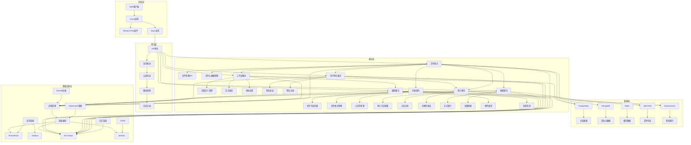

### 3.2 服务间依赖关系

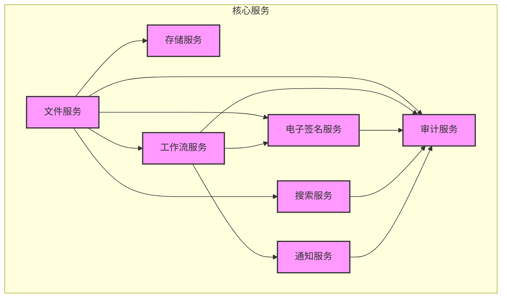

## 4. 模块架构设计

### 4.1 文件核心服务

文件核心服务是系统的核心组件，负责文件的基本操作和元数据管理。

#### 4.1.1 模块职责

- 提供文件的上传、下载、预览、删除等基本操作
- 管理文件的元数据信息
- 实现文件的版本控制
- 处理文件的访问权限控制
- 协调其他服务完成复杂业务流程

#### 4.1.2 子模块设计

| 子模块 | 职责描述 | 核心类/接口 | 关键方法 |
|--------|----------|-------------|----------|
| **文件API接口** | 提供REST API接口 | FileController | upload, download, preview, delete, updateMetadata |
| **文件服务** | 实现文件业务逻辑 | FileService | processUpload, getFileContent, manageVersions, checkPermissions |
| **元数据管理** | 管理文件元数据 | MetadataService | createMetadata, updateMetadata, getMetadata, searchMetadata |
| **版本控制** | 实现文件版本管理 | VersionControlService | createVersion, getVersionHistory, rollbackToVersion, compareVersions |
| **权限管理** | 管理文件访问权限 | PermissionService | checkPermission, grantPermission, revokePermission, listPermissions |

#### 4.1.3 类图

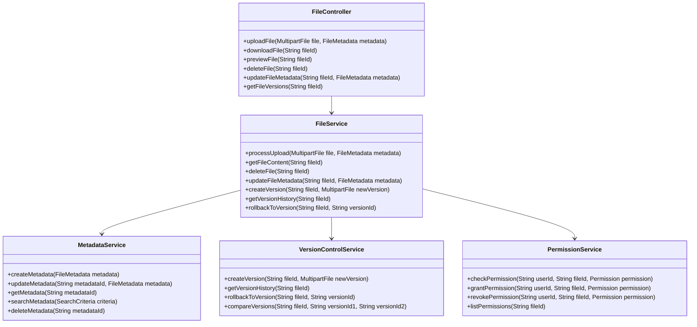

### 4.2 存储服务

存储服务负责文件内容的实际存储和检索，支持多种存储后端。

#### 4.2.1 模块职责

- 提供统一的文件存储接口
- 支持多种存储后端（本地文件系统、对象存储等）
- 实现文件的分块上传和断点续传
- 处理文件格式转换
- 优化存储性能和成本

#### 4.2.2 子模块设计

| 子模块 | 职责描述 | 核心类/接口 | 关键方法 |
|--------|----------|-------------|----------|
| **存储接口** | 定义存储服务接口 | StorageService | store, retrieve, delete, exists, getInfo |
| **对象存储实现** | 实现基于S3/MinIO的存储 | ObjectStorageService | storeObject, retrieveObject, deleteObject, listObjects |
| **本地存储实现** | 实现基于本地文件系统的存储 | LocalStorageService | storeLocal, retrieveLocal, deleteLocal, listLocal |
| **文件分片处理** | 处理大文件的分片上传 | ChunkedUploadService | uploadChunk, mergeChunks, getChunkInfo |
| **文件格式转换** | 实现文件格式的转换 | FormatConversionService | convertFormat, getSupportedFormats, checkConversionSupport |

#### 4.2.3 类图

```mermaid
classDiagram
    interface StorageService {
        +store(String fileId, InputStream content, String mimeType)
        +retrieve(String fileId)
        +delete(String fileId)
        +exists(String fileId)
        +getInfo(String fileId)
    }

    class ObjectStorageService implements StorageService {
        +store(String fileId, InputStream content, String mimeType)
        +retrieve(String fileId)
        +delete(String fileId)
        +exists(String fileId)
        +getInfo(String fileId)
        +storeObject(String objectId, InputStream content, String mimeType)
        +retrieveObject(String objectId)
        +deleteObject(String objectId)
        +listObjects(String prefix)
    }

    class LocalStorageService implements StorageService {
        +store(String fileId, InputStream content, String mimeType)
        +retrieve(String fileId)
        +delete(String fileId)
        +exists(String fileId)
        +getInfo(String fileId)
        +storeLocal(String filePath, InputStream content)
        +retrieveLocal(String filePath)
        +deleteLocal(String filePath)
        +listLocal(String directory)
    }

    class ChunkedUploadService {
        +initiateUpload(String fileId, long totalSize, String mimeType)
        +uploadChunk(String uploadId, int chunkIndex, InputStream chunkContent)
        +mergeChunks(String uploadId)
        +getUploadStatus(String uploadId)
        +cancelUpload(String uploadId)
    }

    class FormatConversionService {
        +convertFormat(String sourceFileId, String targetFormat)
        +getSupportedFormats()
        +checkConversionSupport(String sourceFormat, String targetFormat)
    }

    ObjectStorageService --> ChunkedUploadService
    LocalStorageService --> ChunkedUploadService
    FormatConversionService --> StorageService
```

### 4.3 工作流服务

工作流服务负责管理文件相关的业务流程，如审批流程、发布流程等。

#### 4.3.1 模块职责

- 提供工作流定义和配置能力
- 实现工作流实例的创建和执行
- 管理工作流任务和任务分配
- 支持工作流的暂停、恢复和终止
- 实现复杂的条件分支和并行流程

#### 4.3.2 子模块设计

| 子模块 | 职责描述 | 核心类/接口 | 关键方法 |
|--------|----------|-------------|----------|
| **流程定义管理** | 管理工作流定义 | WorkflowDefinitionService | createDefinition, updateDefinition, getDefinition, listDefinitions |
| **流程实例管理** | 管理工作流实例 | WorkflowInstanceService | createInstance, getInstance, updateInstance, completeTask, cancelInstance |
| **任务管理** | 管理工作流任务 | TaskService | createTask, assignTask, completeTask, getTasks, claimTask |
| **条件评估** | 评估工作流条件 | ConditionEvaluator | evaluateCondition, parseExpression, validateExpression |
| **流程监听器** | 监听工作流事件 | WorkflowListener | onTaskCreated, onTaskCompleted, onWorkflowStarted, onWorkflowEnded |

#### 4.3.3 类图

```mermaid
classDiagram
    class WorkflowDefinition {
        +String id
        +String name
        +String description
        +String definitionJson
        +Date createdAt
        +Date updatedAt
        +boolean active
    }

    class WorkflowInstance {
        +String id
        +String definitionId
        +String businessKey
        +WorkflowStatus status
        +Date startedAt
        +Date completedAt
        +Map<String, Object> variables
    }

    class Task {
        +String id
        +String instanceId
        +String taskDefinitionKey
        +String name
        +String assignee
        +TaskStatus status
        +Date createdAt
        +Date dueDate
        +Map<String, Object> variables
    }

    class WorkflowDefinitionService {
        +createDefinition(WorkflowDefinition definition)
        +updateDefinition(WorkflowDefinition definition)
        +getDefinition(String id)
        +listDefinitions(WorkflowDefinitionCriteria criteria)
        +activateDefinition(String id)
        +deactivateDefinition(String id)
    }

    class WorkflowInstanceService {
        +createInstance(String definitionId, String businessKey, Map<String, Object> variables)
        +getInstance(String id)
        +listInstances(WorkflowInstanceCriteria criteria)
        +updateInstance(String id, Map<String, Object> variables)
        +suspendInstance(String id)
        +resumeInstance(String id)
        +cancelInstance(String id)
        +completeTask(String taskId, Map<String, Object> variables)
    }

    class TaskService {
        +createTask(Task task)
        +getTask(String id)
        +listTasks(TaskCriteria criteria)
        +assignTask(String taskId, String assignee)
        +claimTask(String taskId, String userId)
        +completeTask(String taskId, Map<String, Object> variables)
        +delegateTask(String taskId, String delegatee)
    }

    class ConditionEvaluator {
        +boolean evaluateCondition(String expression, Map<String, Object> variables)
        +Expression parseExpression(String expression)
        +void validateExpression(String expression)
    }

    interface WorkflowListener {
        +void onTaskCreated(Task task)
        +void onTaskCompleted(Task task)
        +void onWorkflowStarted(WorkflowInstance instance)
        +void onWorkflowEnded(WorkflowInstance instance)
    }

    WorkflowInstance --> WorkflowDefinition
    Task --> WorkflowInstance
    WorkflowInstanceService --> WorkflowDefinition
    WorkflowInstanceService --> WorkflowInstance
    WorkflowInstanceService --> Task
    TaskService --> Task
    WorkflowInstanceService --> ConditionEvaluator
    WorkflowInstanceService --> WorkflowListener
```

### 4.4 电子签名服务

电子签名服务负责实现符合法规要求的电子签名功能，确保操作的可追溯性和不可否认性。

#### 4.4.1 模块职责

- 提供电子签名的创建和验证
- 管理签名证书和凭证
- 记录签名的详细信息
- 确保签名符合21 CFR Part 11等法规要求
- 支持多种签名方式和强度

#### 4.4.2 子模块设计

| 子模块 | 职责描述 | 核心类/接口 | 关键方法 |
|--------|----------|-------------|----------|
| **签名管理** | 管理电子签名操作 | SignatureService | createSignature, verifySignature, getSignature, validateSignature |
| **凭证管理** | 管理签名凭证 | CredentialService | issueCredential, revokeCredential, validateCredential, refreshCredential |
| **签名策略** | 定义签名策略 | SignaturePolicyService | getPolicy, applyPolicy, checkPolicyCompliance |
| **生物识别** | 提供生物识别支持 | BiometricService | enrollBiometric, verifyBiometric, getBiometricInfo |
| **签名审计** | 记录签名审计信息 | SignatureAuditService | logSignature, getSignatureAudit, validateAuditTrail |

#### 4.4.3 类图

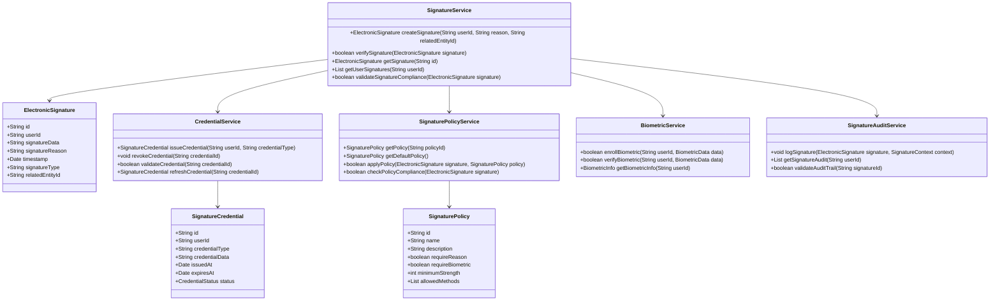

### 4.5 审计服务

审计服务负责记录和管理系统的审计日志，确保系统操作的可追溯性和合规性。

#### 4.5.1 模块职责

- 收集系统各组件的审计日志
- 存储和索引审计日志数据
- 提供审计日志的查询和分析功能
- 生成审计报表
- 确保审计日志的完整性和不可篡改性

#### 4.5.2 子模块设计

| 子模块 | 职责描述 | 核心类/接口 | 关键方法 |
|--------|----------|-------------|----------|
| **日志收集** | 收集审计日志 | AuditLogCollector | collectLog, batchCollectLogs, processLogEvent |
| **日志存储** | 存储审计日志 | AuditLogStorage | storeLog, getLog, deleteLog, existsLog |
| **日志查询** | 查询审计日志 | AuditLogQueryService | queryLogs, getLogById, countLogs, aggregateLogs |
| **报表生成** | 生成审计报表 | AuditReportService | generateReport, exportReport, scheduleReport |
| **日志安全** | 确保日志安全 | AuditLogSecurity | encryptLog, verifyLogIntegrity, secureLogAccess |

#### 4.5.3 类图

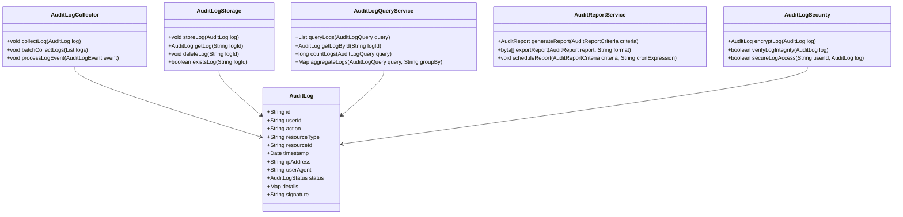

### 4.6 搜索服务

搜索服务提供强大的文件和元数据搜索功能，支持全文检索和高级查询。

#### 4.6.1 模块职责

- 索引文件内容和元数据
- 提供全文搜索和高级检索功能
- 支持搜索结果的过滤、排序和分页
- 优化搜索性能和相关性
- 支持多语言搜索

#### 4.6.2 子模块设计

| 子模块 | 职责描述 | 核心类/接口 | 关键方法 |
|--------|----------|-------------|----------|
| **索引管理** | 管理搜索索引 | IndexService | createIndex, updateIndex, deleteIndex, rebuildIndex |
| **文档索引** | 索引文档内容 | DocumentIndexer | indexDocument, updateDocument, deleteDocument, batchIndexDocuments |
| **搜索查询** | 执行搜索查询 | SearchService | search, advancedSearch, suggest, getSearchStats |
| **搜索优化** | 优化搜索结果 | SearchOptimizer | optimizeQuery, improveRelevance, cacheResults |
| **搜索分析** | 分析搜索数据 | SearchAnalytics | trackSearch, analyzeSearchPatterns, generateSearchReport |

#### 4.6.3 类图

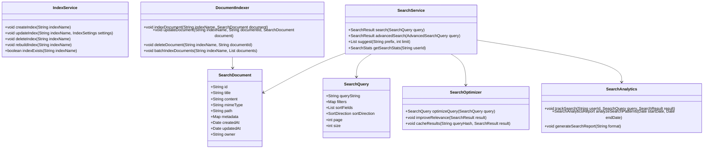

## 5. 集成架构设计

### 5.1 内部系统集成

文件服务子系统需要与GMP系统内的其他子系统进行集成，形成完整的业务流程。

#### 5.1.1 与认证授权子系统集成

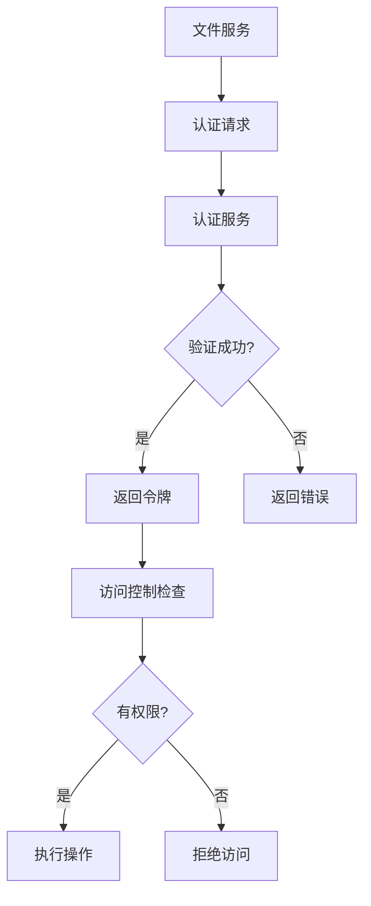

集成方式：通过OAuth 2.0/OpenID Connect协议集成，使用JWT令牌进行身份验证和授权。

数据交换：用户身份信息、权限信息、访问令牌。

#### 5.1.2 与质量管理子系统集成

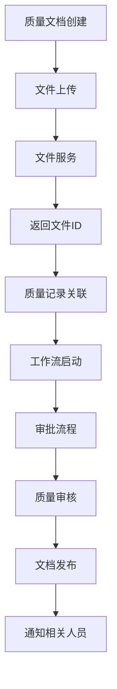

集成方式：通过REST API集成，文件服务提供文档存储和版本管理，质量管理子系统提供业务流程和质量控制。

数据交换：文档内容、元数据、审批状态、质量控制信息。

#### 5.1.3 与生产管理子系统集成

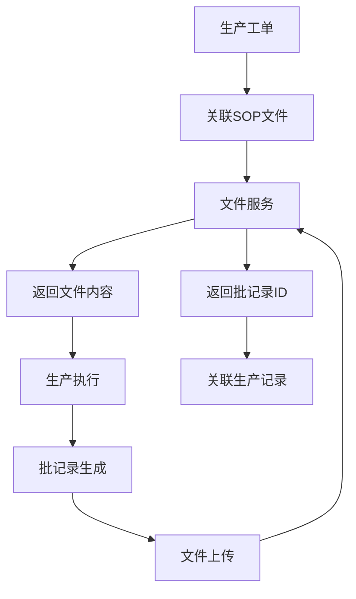

集成方式：通过事件驱动架构集成，使用消息队列实现异步通信。

数据交换：SOP文档、批记录、生产数据、质量检验结果。

### 5.2 外部系统集成

文件服务子系统需要与企业外部系统进行集成，实现数据共享和业务协同。

#### 5.2.1 与外部供应商系统集成

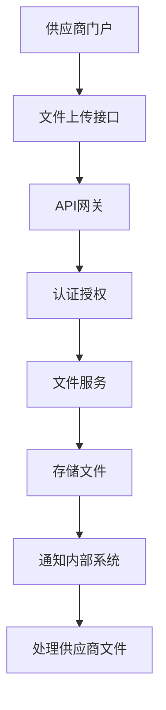

集成方式：通过API网关集成，提供安全的文件上传和下载接口。

数据交换：供应商提供的文档、产品规格、质量证明等。

#### 5.2.2 与监管机构系统集成

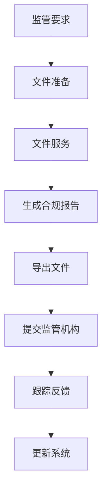

集成方式：通过标准化接口集成，支持常见的监管数据交换格式。

数据交换：合规报告、电子记录摘要、审计日志等。

### 5.3 API设计规范

#### 5.3.1 REST API设计原则

- 使用标准的HTTP方法：GET、POST、PUT、DELETE、PATCH
- 使用RESTful URL设计：资源导向，层次清晰
- 使用合适的HTTP状态码：2xx成功、4xx客户端错误、5xx服务器错误
- 使用JSON作为数据交换格式
- 实现HATEOAS（超媒体作为应用状态的引擎）
- 提供完整的API文档（Swagger/OpenAPI）
- 实现API版本控制

#### 5.3.2 API安全设计

- 实施HTTPS加密传输
- 使用OAuth 2.0或JWT进行身份认证
- 实现细粒度的权限控制
- 实施API请求限流和熔断
- 记录API访问审计日志
- 验证输入参数和防止注入攻击
- 实现API网关统一安全策略

#### 5.3.3 典型API接口示例

```
# 文件上传
POST /api/v1/files
Content-Type: multipart/form-data
Authorization: Bearer {token}

# 文件下载
GET /api/v1/files/{fileId}/content
Authorization: Bearer {token}

# 文件元数据查询
GET /api/v1/files/{fileId}
Authorization: Bearer {token}

# 文件版本列表
GET /api/v1/files/{fileId}/versions
Authorization: Bearer {token}

# 工作流启动
POST /api/v1/workflows/{definitionId}/instances
Content-Type: application/json
Authorization: Bearer {token}

# 任务完成
POST /api/v1/tasks/{taskId}/complete
Content-Type: application/json
Authorization: Bearer {token}

# 电子签名
POST /api/v1/signatures
Content-Type: application/json
Authorization: Bearer {token}

# 审计日志查询
GET /api/v1/audit-logs
Authorization: Bearer {token}

# 全文搜索
GET /api/v1/search?q={query}&filter={filter}
Authorization: Bearer {token}
```

## 6. 数据流设计

### 6.1 文件上传数据流

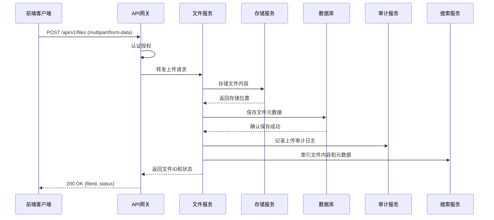

### 6.2 文件审批数据流

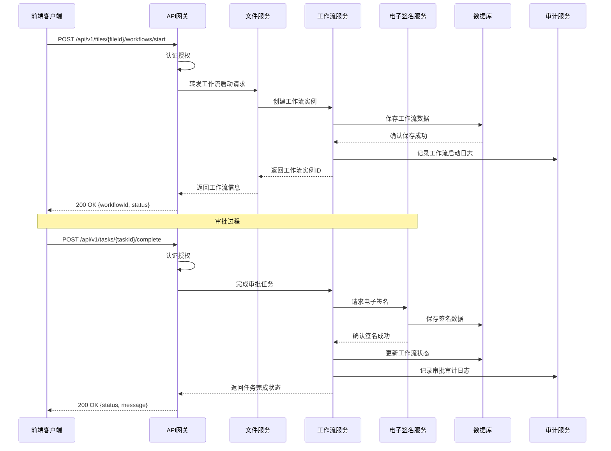

### 6.3 文件搜索数据流

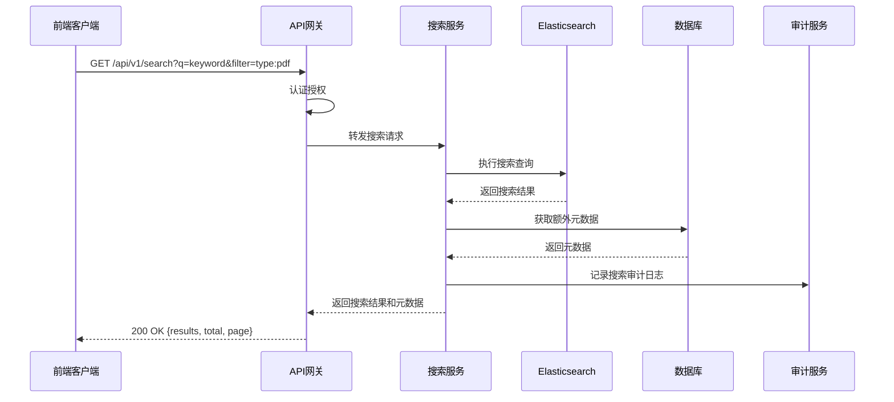

## 7. 安全架构设计

### 7.1 安全模型

文件服务子系统采用多层安全架构，确保系统和数据的安全性和合规性。

#### 7.1.1 认证与授权

- **认证机制**：基于OAuth 2.0和JWT实现身份认证
- **授权机制**：基于RBAC（基于角色的访问控制）模型实现权限管理
- **多因素认证**：对敏感操作支持多因素认证
- **会话管理**：安全的会话创建、验证和终止
- **密码策略**：强密码策略，定期密码更新，密码加密存储

#### 7.1.2 数据安全

- **传输安全**：全链路HTTPS/TLS加密
- **存储安全**：敏感数据加密存储，支持静态数据加密
- **访问控制**：细粒度的文件访问权限控制
- **数据隔离**：租户数据隔离，多租户安全架构
- **数据备份**：定期数据备份和恢复机制

#### 7.1.3 合规审计

- **审计日志**：全面记录所有关键操作的审计日志
- **日志保护**：审计日志防篡改、防删除机制
- **合规报告**：自动生成符合法规要求的合规报告
- **定期审计**：定期安全审计和漏洞扫描

### 7.2 安全控制点

| 控制点 | 安全措施 | 实现方式 | 合规要求 |
|--------|----------|----------|----------|
| **API安全** | HTTPS加密、身份认证、权限控制、输入验证 | API网关、JWT、RBAC、参数校验 | 21 CFR Part 11 |
| **数据传输** | TLS 1.3加密、防中间人攻击 | 证书管理、安全通信协议 | ISO 27001 |
| **数据存储** | AES-256加密、权限控制、数据脱敏 | 加密算法、访问控制列表、数据屏蔽 | GMP数据完整性 |
| **身份验证** | 多因素认证、生物识别、单点登录 | Keycloak、生物识别服务、SSO集成 | 等保2.0 |
| **授权控制** | 基于角色、属性和上下文的访问控制 | Spring Security、自定义授权服务 | 21 CFR Part 11 |
| **审计跟踪** | 不可篡改日志、集中式日志管理、实时监控 | ELK Stack、区块链日志（可选）、日志分析服务 | GMP附录11 |
| **漏洞管理** | 定期扫描、补丁管理、安全测试 | 自动化扫描工具、CI/CD安全集成 | ISO 27001 |
| **事件响应** | 安全告警、自动响应、应急处理 | 监控系统、告警服务、事件响应流程 | 等保2.0 |

### 7.3 安全架构图

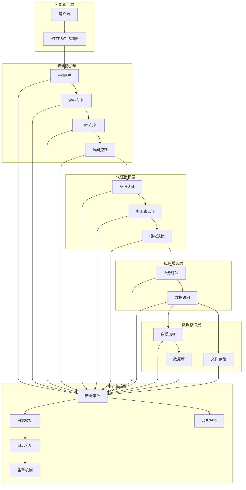

## 8. 部署架构设计

### 8.1 基础设施架构

文件服务子系统采用容器化部署，基于Kubernetes进行编排管理，确保系统的高可用性、可扩展性和可维护性。

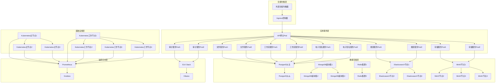

### 8.2 容器化部署

所有服务组件采用Docker容器化部署，确保环境一致性和快速部署。

#### 8.2.1 Docker镜像设计

- 基于官方基础镜像，如`openjdk:11-jre-slim`
- 多阶段构建减少镜像大小
- 最小化依赖，只包含运行时必要组件
- 安全扫描和漏洞修复
- 遵循Docker最佳实践

#### 8.2.2 Kubernetes部署配置

- **Deployment**: 管理Pod的创建和副本数
- **Service**: 提供服务发现和负载均衡
- **Ingress**: 管理外部访问
- **ConfigMap**: 管理配置信息
- **Secret**: 管理敏感信息
- **PersistentVolume**: 持久化存储
- **HorizontalPodAutoscaler**: 自动扩缩容
- **PodDisruptionBudget**: 确保服务可用性

### 8.3 高可用性设计

- **服务冗余**: 所有服务至少部署两个副本
- **数据冗余**: 数据库和存储采用副本集或集群
- **故障转移**: 自动故障检测和转移
- **分区容错**: 支持网络分区和恢复
- **无单点故障**: 所有关键组件都有冗余

### 8.4 扩展性设计

- **水平扩展**: 支持通过增加Pod数量进行水平扩展
- **垂直扩展**: 支持通过增加资源进行垂直扩展
- **自动扩缩容**: 基于负载自动调整资源
- **弹性伸缩**: 根据业务需求动态调整容量
- **资源隔离**: 通过命名空间和资源配额隔离租户资源

## 9. 扩展性设计

### 9.1 微服务扩展

- **服务发现**: 基于Eureka或Consul实现动态服务发现
- **配置管理**: 基于Spring Cloud Config实现集中配置管理
- **服务网格**: 可选集成Istio实现服务网格功能
- **API网关**: 支持动态路由和服务注册

### 9.2 存储扩展

- **对象存储**: 支持MinIO、AWS S3、Azure Blob等多种对象存储
- **文件系统**: 支持本地文件系统、NFS、Ceph等
- **存储分层**: 基于访问频率和重要性的存储分层策略
- **自动扩展**: 存储容量自动扩展

### 9.3 功能扩展

- **插件架构**: 支持通过插件扩展系统功能
- **事件驱动**: 基于消息队列的事件驱动架构
- **API扩展**: 标准化的API扩展机制
- **集成框架**: 支持与第三方系统集成

### 9.4 性能扩展

- **缓存策略**: 多级缓存策略，包括内存缓存、分布式缓存
- **索引优化**: 搜索引擎索引优化和分片
- **数据库优化**: 数据库分区、索引优化、读写分离
- **异步处理**: 耗时操作异步处理

## 10. 灾难恢复设计

### 10.1 备份策略

- **全量备份**: 定期全量数据备份
- **增量备份**: 每日增量数据备份
- **事务日志备份**: 实时事务日志备份
- **备份验证**: 定期备份验证和恢复测试

### 10.2 恢复策略

- **RTO(恢复时间目标)**: 关键系统<4小时，非关键系统<24小时
- **RPO(恢复点目标)**: 关键数据<15分钟，非关键数据<24小时
- **恢复流程**: 标准化的恢复流程和操作手册
- **恢复演练**: 定期灾难恢复演练

### 10.3 高可用设计

- **多活部署**: 可选的多区域多活部署架构
- **故障转移**: 自动故障检测和转移机制
- **数据同步**: 跨区域数据同步和复制
- **流量切换**: 基于健康检查的流量自动切换

## 11. 文档版本控制

| 版本 | 日期 | 修改人 | 修改内容 | 审核人 |
|------|------|--------|----------|--------|
| V1.0 | 2023-12-20 | 系统架构师 | 初始版本 | 技术总监 |
| V1.1 | 2024-01-15 | 系统架构师 | 更新微服务设计和技术选型 | 技术总监 |
| V1.2 | 2024-02-10 | 安全架构师 | 完善安全架构设计 | 信息安全官 |
| V1.3 | 2024-03-01 | 系统架构师 | 补充部署架构和扩展性设计 | 技术总监 |

## 12. 审批信息

| 审批人 | 职位 | 审批日期 | 审批意见 | 电子签名 |
|--------|------|----------|----------|----------|
| 张三 | 技术总监 | 2024-03-10 | 同意发布 | 数字签名 |
| 李四 | 信息安全官 | 2024-03-12 | 安全合规，同意发布 | 数字签名 |
| 王五 | 项目经理 | 2024-03-15 | 符合项目要求，同意发布 | 数字签名 |

本文档包含电子记录，已通过电子签名确认其有效性和完整性。