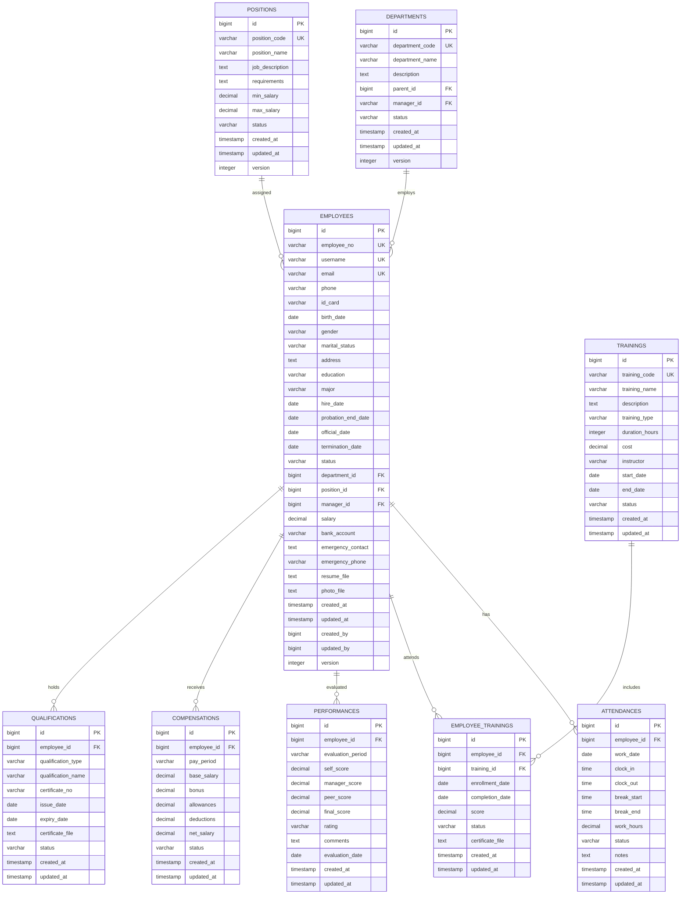

# 人力资源管理子系统架构设计

## 1. 概述

人力资源管理子系统采用微服务架构，基于领域驱动设计（DDD）理念，遵循GMP合规要求，提供企业级的人事管理、员工档案、考勤管理、培训管理、薪酬管理和绩效管理等功能。系统设计遵循高可用、易扩展、合规可审计的原则，确保GMP系统的规范性和追溯性。

## 2. 系统总体架构

### 2.1 分层架构设计

```
┌────────────────────────────────────────────────────┐
│            表现层 (Presentation Layer)             │
│   ┌─────────────────────────────────────────────┐   │
│   │        REST控制器 (Controllers)            │   │
│   │ - EmployeeController                       │   │
│   │ - AttendanceController                     │   │
│   │ - TrainingController                       │   │
│   │ - PerformanceController                    │   │
│   │ - CompensationController                   │   │
│   │ - OrganizationController                   │   │
│   │ - ComplianceController                     │   │
│   └─────────────────────────────────────────────┘   │
└────────────────────────────────────────────────────┘
                                ▼
┌────────────────────────────────────────────────────┐
│           业务逻辑层 (Business Layer)               │
│   ┌─────────────────────────────────────────────┐   │
│   │       业务服务 (Services)                    │   │
│   │ - EmployeeService                           │   │
│   │ - AttendanceService                         │   │
│   │ - TrainingService                           │   │
│   │ - PerformanceService                        │   │
│   │ - CompensationService                       │   │
│   │ - OrganizationService                       │   │
│   │ - ComplianceService                         │   │
│   │ - AuditLogService                           │   │
│   │                                             │   │
│   │ - 考勤计算引擎                              │   │
│   │ - 绩效评估引擎                              │   │
│   │ - 薪酬计算引擎                              │   │
│   │ - 合规检查引擎                              │   │
│   └─────────────────────────────────────────────┘   │
└────────────────────────────────────────────────────┘
                                ▼
┌────────────────────────────────────────────────────┐
│           数据访问层 (Data Access Layer)            │
│   ┌─────────────────────────────────────────────┐   │
│   │       数据仓库 (Repositories)               │   │
│   │ - EmployeeRepository                        │   │
│   │ - AttendanceRepository                      │   │
│   │ - TrainingRepository                        │   │
│   │ - PerformanceRepository                     │   │
│   │ - CompensationRepository                    │   │
│   │ - OrganizationRepository                    │   │
│   │ - ComplianceRepository                      │   │
│   │ - QualificationRepository                   │   │
│   └─────────────────────────────────────────────┘   │
└────────────────────────────────────────────────────┘
                                ▼
┌────────────────────────────────────────────────────┐
│           数据存储层 (Data Storage)                │
└────────────────────────────────────────────────────┘
```

### 2.2 微服务架构图

```
┌─────────────────────────────────────────────────────────────┐
│                    HR微服务 (hr-service:8082)               │
│                                                             │
│  ┌─────────────┬─────────────┬─────────────┬─────────────┐   │
│  │  员工管理   │  考勤管理   │  培训管理   │  绩效管理   │   │
│  │ Employee    │ Attendance  │ Training    │ Performance │   │
│  │ Management  │ Management  │ Management  │ Management  │   │
│  └─────────────┴─────────────┴─────────────┴─────────────┘   │
│                                                             │
│  ┌─────────────┬─────────────┬─────────────┬─────────────┐   │
│  │  薪酬管理   │  组织架构   │  合规审计   │  资质认证   │   │
│  │ Compensation│ Organization│ Compliance  │ Qualification│   │
│  │ Management  │ Management  │ Audit       │ Management  │   │
│  └─────────────┴─────────────┴─────────────┴─────────────┘   │
│                                                             │
│  ┌─────────────┬─────────────┬─────────────┬─────────────┐   │
│  │    审批     │    报表     │    通知     │    档案     │   │
│  │ Workflow    │ Reporting   │ Notification│ File        │   │
│  │ Engine      │ Service     │ Service     │ Management  │   │
│  └─────────────┴─────────────┴─────────────┴─────────────┘   │
└─────────────────────────────────────────────────────────────┘
                                ▼
┌─────────────────────────────────────────────────────────────┐
│                    数据存储与消息服务                       │
│                                                             │
│  PostgreSQL hr_db        Redis Cache     RabbitMQ        │
│  - employees                                                  │
│  - attendances            员工信息缓存                      │
│  - trainings              考勤数据缓存                      │
│  - performances           组织架构缓存                      │
│  - compensations                                             │
│  - organizations                                               │
│  - qualifications                                             │
│                                                             │
│  MinIO File Storage                                          │
│  - 员工头像文件                                              │
│  - 资质证书扫描件                                            │
│  - 培训材料文件                                              │
└─────────────────────────────────────────────────────────────┘
```

## 3. 核心业务域设计

### 3.1 员工管理域 (Employee Management Domain)

```
员工管理域 (Employee Domain)
├── 员工基础信息管理 (@Post /api/employees)
│   ├── 创建员工档案 (@Post /api/employees)
│   ├── 更新员工信息 (@Put /api/employees/{id})
│   ├── 查询员工档案 (@Get /api/employees/{id})
│   └── 批量导入员工 (@Post /api/employees/batch-import)
├── 合同管理 (@Post /api/employees/contracts)
│   ├── 合同签订 (@Post /api/employees/{id}/contracts)
│   ├── 合同变更 (@Put /api/employees/{id}/contracts/{contractId})
│   └── 合同到期提醒 (@Get /api/employees/contracts/expired)
├── 员工状态管理 (@Put /api/employees/{id}/status)
│   ├── 入职激活 (@Put /api/employees/{id}/activate)
│   ├── 离职处理 (@Put /api/employees/{id}/terminate)
│   └── 状态变更历史 (@Get /api/employees/{id}/status-history)
└── 员工自助服务 (@Get /api/employees/profile)
    ├── 查看个人档案 (@Get /api/employees/me)
    └── 更新个人信息 (@Put /api/employees/me)
```

### 3.2 考勤管理域 (Attendance Management Domain)

```
考勤管理域 (Attendance Domain)
├── 考勤数据采集 (@Post /api/attendance/records)
│   ├── 打卡记录提交 (@Post /api/attendance/clock-in)
│   ├── 批量导入考勤 (@Post /api/attendance/batch-import)
│   └── 移动端考勤打卡 (@Post /api/attendance/mobile-clock)
├── 考勤规则管理 (@Post /api/attendance/rules)
│   ├── 考勤规则配置 (@Post /api/attendance/rules)
│   ├── 节假日管理 (@Post /api/attendance/holidays)
│   └── 加班规则设置 (@Post /api/attendance/overtime-rules)
├── 考勤计算处理 (@Post /api/attendance/calculate)
│   ├── 月度考勤统计 (@Get /api/attendance/monthly-stats)
│   ├── 考勤异常处理 (@Put /api/attendance/exceptions)
│   └── 考勤报表生成 (@Get /api/attendance/reports)
└── 考勤审批流程 (@Post /api/attendance/approvals)
    ├── 请假申请 (@Post /api/attendance/leave-request)
    ├── 加班申请 (@Post /api/attendance/overtime-request)
    └── 考勤修正申请 (@Post /api/attendance/correction-request)
```

### 3.3 培训管理域 (Training Management Domain)

```
培训管理域 (Training Domain)
├── 培训需求管理 (@Post /api/training/requirements)
│   ├── GMP培训需求识别 (@Post /api/training/gmp-requirements)
│   ├── 岗位技能评估 (@Post /api/training/skill-assessment)
│   └── 培训计划制定 (@Post /api/training/plan)
├── 培训课程管理 (@Post /api/training/courses)
│   ├── 课程内容设计 (@Post /api/training/courses)
│   ├── 培训资料上传 (@Post /api/training/courses/{id}/materials)
│   └── 培训师资管理 (@Post /api/training/instructors)
├── 培训实施管理 (@Post /api/training/sessions)
│   ├── 培训安排 (@Post /api/training/sessions)
│   ├── 在线培训支持 (@Post /api/training/online-sessions)
│   └── 培训签到管理 (@Post /api/training/attendance)
├── 培训考核评估 (@Post /api/training/assessments)
│   ├── 考核题库管理 (@Post /api/training/question-bank)
│   ├── 在线考试系统 (@Post /api/training/exams)
│   └── 培训效果评估 (@Post /api/training/evaluation)
└── GMP特殊管理 (@Post /api/training/gmp-compliance)
    ├── 资质认证记录 (@Post /api/training/certifications)
    ├── 证书到期提醒 (@Get /api/training/certifications/expiring)
    └── 强制再培训 (@Post /api/training/compulsory-training)
```

### 3.4 绩效管理域 (Performance Management Domain)

```
绩效管理域 (Performance Domain)
├── 绩效目标管理 (@Post /api/performance/goals)
│   ├── 目标设定 (@Post /api/performance/goals)
│   ├── 目标分解 (@Post /api/performance/goals/{id}/decompose)
│   └── 目标进度跟踪 (@Put /api/performance/goals/{id}/progress)
├── 绩效评估流程 (@Post /api/performance/evaluations)
│   ├── 员工自评 (@Post /api/performance/self-evaluation)
│   ├── 主管评价 (@Post /api/performance/manager-evaluation)
│   ├── 同级互评 (@Post /api/performance/peer-evaluation)
│   └── 360度评估 (@Post /api/performance/360-evaluation)
├── 绩效面谈管理 (@Post /api/performance/meetings)
│   ├── 面谈安排 (@Post /api/performance/meetings)
│   ├── 面谈记录 (@Post /api/performance/meetings/{id}/notes)
│   └── 改进计划 (@Post /api/performance/meetings/{id}/action-plan)
└── 绩效结果应用 (@Post /api/performance/results)
    ├── 绩效等级评定 (@Post /api/performance/ratings)
    ├── 绩效改进计划 (@Post /api/performance/improvement-plans)
    └── 绩效与薪酬关联 (@Post /api/performance/compensation-linkage)
```

### 3.5 薪酬管理域 (Compensation Management Domain)

```
薪酬管理域 (Compensation Domain)
├── 薪酬结构管理 (@Post /api/compensation/structure)
│   ├── 薪酬级别定义 (@Post /api/compensation/grades)
│   ├── 薪资标准设定 (@Post /api/compensation/standards)
│   └── 津贴补贴管理 (@Post /api/compensation/allowances)
├── 薪资计算处理 (@Post /api/compensation/calculate)
│   ├── 月度薪资计算 (@Post /api/compensation/monthly-calculation)
│   ├── 绩效奖金计算 (@Post /api/compensation/bonus-calculation)
│   └── 个税计算 (@Post /api/compensation/tax-calculation)
├── 薪资发放管理 (@Post /api/compensation/payroll)
│   ├── 薪资单生成 (@Post /api/compensation/payslips)
│   ├── 银行代发处理 (@Post /api/compensation/bank-transfer)
│   └── 薪资发放确认 (@Post /api/compensation/confirm-payment)
└── 薪酬调整管理 (@Post /api/compensation/adjustments)
    ├── 调薪申请 (@Post /api/compensation/adjustment-request)
    ├── 调薪审批流程 (@Post /api/compensation/approval-workflow)
    └── 调薪生效处理 (@Post /api/compensation/apply-adjustment)
```

### 3.6 组织架构域 (Organization Management Domain)

```
组织架构域 (Organization Domain)
├── 组织结构管理 (@Post /api/organization/structure)
│   ├── 部门定义 (@Post /api/organization/departments)
│   ├── 岗位管理 (@Post /api/organization/positions)
│   └── 层级关系维护 (@Post /api/organization/hierarchies)
├── 岗位职责管理 (@Post /api/organization/job-descriptions)
│   ├── 岗位说明书 (@Post /api/organization/job-descriptions)
│   ├── 任职资格要求 (@Post /api/organization/qualifications)
│   └── 工作流程定义 (@Post /api/organization/workflows)
├── 组织变革管理 (@Post /api/organization/changes)
│   ├── 组织架构调整 (@Post /api/organization/restructuring)
│   ├── 岗位变动处理 (@Post /api/organization/position-changes)
│   └── 人员调动管理 (@Post /api/organization/employee-transfers)
└── 胜任力模型 (@Post /api/organization/competency-models)
    ├── 能力素质定义 (@Post /api/organization/competencies)
    ├── 岗位能力要求 (@Post /api/organization/position-requirements)
    └── 能力评估标准 (@Post /api/organization/assessment-criteria)
```

### 3.7 合规审计域 (Compliance Audit Domain)

```
合规审计域 (Compliance Domain)
├── GMP合规管理 (@Post /api/compliance/gmp)
│   ├── 资质证照管理 (@Post /api/compliance/certificates)
│   ├── 培训合规检查 (@Post /api/compliance/training-compliance)
│   └── 操作授权验证 (@Post /api/compliance/operation-authorization)
├── 劳动法规合规 (@Post /api/compliance/labor-law)
│   ├── 劳动合同合规 (@Post /api/compliance/labor-contracts)
│   ├── 工时管理合规 (@Post /api/compliance/working-hours)
│   └── 薪酬合规检查 (@Post /api/compliance/compensation-compliance)
├── 审计日志管理 (@Post /api/compliance/audit-logs)
│   ├── 关键操作记录 (@Post /api/compliance/key-operations)
│   ├── 数据变更追踪 (@Post /api/compliance/data-changes)
│   └── 合规检查记录 (@Post /api/compliance/compliance-checks)
└── 报告与预警 (@Post /api/compliance/reports)
    ├── 合规报告生成 (@Post /api/compliance/compliance-reports)
    ├── 风险预警提醒 (@Post /api/compliance/risk-alerts)
    └── 审计追踪报告 (@Post /api/compliance/audit-reports)
```

## 4. 数据架构设计

### 4.1 核心实体关系模型



### 4.2 时间序列数据模型

```java
// 考勤时间序列表设计
@Entity
@Table(name = "attendance_timeseries")
public class AttendanceTimeseries {
    
    @Id
    @GeneratedValue(strategy = GenerationType.IDENTITY)
    private Long id;
    
    @Column(name = "employee_id", nullable = false)
    private Long employeeId;
    
    @Column(name = "work_date", nullable = false)
    private LocalDate workDate;
    
    @Column(name = "hour_slot", nullable = false)
    private Integer hourSlot; // 0-23
    
    @Column(name = "attendance_status", nullable = false)
    private String attendanceStatus; // PRESENT, ABSENT, LATE, EARLY_LEAVE
    
    @Column(name = "work_type", nullable = false)
    private String workType; // NORMAL, OVERTIME, HOLIDAY
    
    @Column(name = "location", nullable = true)
    private String location;
    
    @Column(name = "device_id", nullable = true)
    private String deviceId;
    
    @Column(name = "created_at", nullable = false)
    private LocalDateTime createdAt;
    
    @Column(name = "updated_at", nullable = false)
    private LocalDateTime updatedAt;
}

// 培训记录时间序列表设计
@Entity
@Table(name = "training_timeseries")
public class TrainingTimeseries {
    
    @Id
    @GeneratedValue(strategy = GenerationType.IDENTITY)
    private Long id;
    
    @Column(name = "employee_id", nullable = false)
    private Long employeeId;
    
    @Column(name = "training_id", nullable = false)
    private Long trainingId;
    
    @Column(name = "training_date", nullable = false)
    private LocalDate trainingDate;
    
    @Column(name = "completion_rate", nullable = false)
    private BigDecimal completionRate;
    
    @Column(name = "score", nullable = true)
    private BigDecimal score;
    
    @Column(name = "certificate_status", nullable = false)
    private String certificateStatus;
    
    @Column(name = "gmp_compliance", nullable = false)
    private Boolean gmpCompliance;
    
    @Column(name = "created_at", nullable = false)
    private LocalDateTime createdAt;
}
```

### 4.3 数据存储策略

```yaml
# 数据存储配置
data_storage:
  primary_database:
    type: PostgreSQL
    database: hr_db
    tables:
      - employees
      - departments  
      - positions
      - attendances
      - trainings
      - performances
      - compensations
      - qualifications
      - audit_logs
  
  timeseries_database:
    type: TimescaleDB
    database: hr_timeseries_db
    tables:
      - attendance_timeseries
      - training_timeseries
      - performance_timeseries
      - compensation_timeseries
  
  cache_layer:
    type: Redis
    databases:
      0: employee_cache
      1: organization_cache
      2: permission_cache
      3: session_cache
  
  file_storage:
    type: MinIO
    buckets:
      - employee-documents
      - training-materials
      - certificates
      - audit-evidence
```

## 5. 技术架构设计

### 5.1 微服务技术栈

```yaml
# 技术栈配置
technology_stack:
  framework:
    core: Spring Boot 3.2.5
    web: Spring Web MVC
    data_access: Spring Data JPA
    security: Spring Security
    cache: Spring Cache
  
  database:
    primary: PostgreSQL 15
    timeseries: TimescaleDB 2.13
    cache: Redis 7.0
    search: Elasticsearch 8.8
  
  messaging:
    message_broker: RabbitMQ 3.12
    event_store: Apache Kafka 3.4
  
  file_storage:
    object_storage: MinIO
    document_db: MongoDB 6.0
  
  monitoring:
    metrics: Micrometer + Prometheus
    tracing: Jaeger
    logging: ELK Stack
  
  security:
    authentication: JWT + OAuth2
    encryption: AES-256
    audit: Apache Shiro
```

### 5.2 API网关配置

```yaml
# API网关配置
api_gateway:
  routes:
    hr-service:
      path: /api/hr/**
      service: hr-service:8082
      load_balancer: round_robin
      timeout: 30s
      retry: 3
  
  filters:
    - authentication
    - authorization  
    - rate_limiting
    - request_logging
    - response_compression
  
  rate_limiting:
    default: 1000/minute
    hr-admin: 5000/minute
    employee-self: 500/minute
```

### 5.3 缓存架构设计

```java
// 缓存配置
@Configuration
@EnableCaching
public class HrCacheConfiguration {

    @Bean
    public CacheManager cacheManager(RedisConnectionFactory connectionFactory) {
        RedisCacheManager.Builder builder = RedisCacheManager
            .RedisCacheManagerBuilder
            .fromConnectionFactory(connectionFactory);

        // 配置缓存过期时间
        Map<String, RedisCacheConfiguration> cacheConfigurations = new HashMap<>();
        
        // 员工信息缓存 15分钟
        cacheConfigurations.put("employeeCache", 
            RedisCacheConfiguration.defaultCacheConfig()
                .entryTtl(Duration.ofMinutes(15)));
        
        // 组织架构缓存 30分钟
        cacheConfigurations.put("organizationCache",
            RedisCacheConfiguration.defaultCacheConfig()
                .entryTtl(Duration.ofMinutes(30)));
        
        // 权限信息缓存 20分钟
        cacheConfigurations.put("permissionCache",
            RedisCacheConfiguration.defaultCacheConfig()
                .entryTtl(Duration.ofMinutes(20)));
        
        // 考勤数据缓存 60分钟
        cacheConfigurations.put("attendanceCache",
            RedisCacheConfiguration.defaultCacheConfig()
                .entryTtl(Duration.ofMinutes(60)));
        
        return builder.withInitialCacheConfigurations(cacheConfigurations).build();
    }
}

// 缓存键设计规范
public class CacheKeys {
    // 员工相关缓存
    public static final String EMPLOYEE_INFO = "hr:employee:info:{}";
    public static final String EMPLOYEE_PERMISSIONS = "hr:employee:permissions:{}";
    public static final String EMPLOYEE_ATTENDANCE = "hr:employee:attendance:{}:{}";
    
    // 组织架构缓存
    public static final String DEPARTMENT_TREE = "hr:organization:department:tree";
    public static final String POSITION_INFO = "hr:organization:position:{}";
    
    // 考勤相关缓存
    public static final String ATTENDANCE_RULES = "hr:attendance:rules:{}";
    public static final String HOLIDAY_CALENDAR = "hr:attendance:holiday:{}";
    
    // 培训相关缓存
    public static final String TRAINING_COURSES = "hr:training:courses:{}";
    public static final String EMPLOYEE_TRAININGS = "hr:training:employee:{}";
}
```

## 6. 消息架构设计

### 6.1 事件驱动架构

```java
// HR事件定义
public enum HrEventType {
    EMPLOYEE_CREATED("employee.created"),
    EMPLOYEE_UPDATED("employee.updated"),
    EMPLOYEE_TERMINATED("employee.terminated"),
    ATTENDANCE_RECORDED("attendance.recorded"),
    TRAINING_COMPLETED("training.completed"),
    PERFORMANCE_EVALUATED("performance.evaluated"),
    COMPENSATION_PROCESSED("compensation.processed"),
    QUALIFICATION_EXPIRED("qualification.expired");

    private final String eventType;

    HrEventType(String eventType) {
        this.eventType = eventType;
    }

    public String getEventType() {
        return eventType;
    }
}

// HR事件发布器
@Component
public class HrEventPublisher {

    @Autowired
    private RabbitTemplate rabbitTemplate;

    public void publishEmployeeCreated(Employee employee) {
        HrEvent event = HrEvent.builder()
            .eventType(HrEventType.EMPLOYEE_CREATED)
            .employeeId(employee.getId())
            .timestamp(LocalDateTime.now())
            .data(employee)
            .build();
            
        rabbitTemplate.convertAndSend("hr.events", event.getEventType(), event);
    }

    public void publishQualificationExpired(Long employeeId, String qualificationType) {
        HrEvent event = HrEvent.builder()
            .eventType(HrEventType.QUALIFICATION_EXPIRED)
            .employeeId(employeeId)
            .timestamp(LocalDateTime.now())
            .data(Map.of("qualificationType", qualificationType))
            .build();
            
        rabbitTemplate.convertAndSend("hr.events", event.getEventType(), event);
    }
}
```

### 6.2 消息路由配置

```yaml
# RabbitMQ配置
rabbitmq:
  host: localhost
  port: 5672
  username: hr_user
  password: hr_password
  
  exchanges:
    hr_events:
      type: topic
      durable: true
    hr_commands:
      type: direct
      durable: true
  
  queues:
    employee_sync_queue:
      exchange: hr_events
      routing_key: employee.*
      durable: true
    
    compliance_alert_queue:
      exchange: hr_events
      routing_key: compliance.*
      durable: true
      
    notification_queue:
      exchange: hr_events
      routing_key: notification.*
      durable: true
  
  bindings:
    - queue: employee_sync_queue
      exchange: hr_events
      routing_key: employee.*
    
    - queue: compliance_alert_queue
      exchange: hr_events
      routing_key: compliance.*
```

## 7. 安全架构设计

### 7.1 认证与授权

```java
// HR权限定义
public enum HrPermission {
    // 员工管理权限
    EMPLOYEE_READ("employee:read"),
    EMPLOYEE_WRITE("employee:write"),
    EMPLOYEE_DELETE("employee:delete"),
    EMPLOYEE_IMPORT("employee:import"),
    
    // 考勤管理权限
    ATTENDANCE_READ("attendance:read"),
    ATTENDANCE_WRITE("attendance:write"),
    ATTENDANCE_APPROVE("attendance:approve"),
    ATTENDANCE_REPORT("attendance:report"),
    
    // 培训管理权限
    TRAINING_READ("training:read"),
    TRAINING_WRITE("training:write"),
    TRAINING_APPROVE("training:approve"),
    TRAINING_CERTIFICATE("training:certificate"),
    
    // 绩效管理权限
    PERFORMANCE_READ("performance:read"),
    PERFORMANCE_WRITE("performance:write"),
    PERFORMANCE_EVALUATE("performance:evaluate"),
    
    // 薪酬管理权限
    COMPENSATION_READ("compensation:read"),
    COMPENSATION_WRITE("compensation:write"),
    COMPENSATION_APPROVE("compensation:approve"),
    
    // GMP合规权限
    COMPLIANCE_AUDIT("compliance:audit"),
    COMPLIANCE_REPORT("compliance:report"),
    QUALIFICATION_MANAGE("qualification:manage");

    private final String permission;

    HrPermission(String permission) {
        this.permission = permission;
    }

    public String getPermission() {
        return permission;
    }
}

// HR权限检查服务
@Service
public class HrPermissionService {

    @Autowired
    private PermissionEvaluationService permissionService;

    // 检查员工管理权限
    public boolean hasEmployeePermission(Long userId, String permission, Long targetEmployeeId) {
        // 首先检查基本权限
        if (!permissionService.hasPermission(userId, permission)) {
            return false;
        }
        
        // 检查是否有访问特定员工数据的权限
        if (targetEmployeeId != null) {
            Employee targetEmployee = employeeRepository.findById(targetEmployeeId);
            Employee currentUser = employeeRepository.findByUserId(userId);
            
            // 管理员可以访问所有数据
            if (isHrAdmin(userId)) {
                return true;
            }
            
            // 部门主管可以访问本部门员工数据
            if (isDepartmentManager(userId) && 
                currentUser.getDepartmentId().equals(targetEmployee.getDepartmentId())) {
                return true;
            }
            
            // 员工只能访问自己的数据
            if (currentUser.getId().equals(targetEmployeeId)) {
                return true;
            }
        }
        
        return false;
    }

    // 检查考勤管理权限
    public boolean hasAttendancePermission(Long userId, String permission, LocalDate targetDate) {
        if (!permissionService.hasPermission(userId, permission)) {
            return false;
        }
        
        Employee currentUser = employeeRepository.findByUserId(userId);
        
        // 管理员和HR可以查看所有考勤数据
        if (isHrAdmin(userId) || isAttendanceManager(userId)) {
            return true;
        }
        
        // 部门主管可以查看本部门考勤数据
        if (isDepartmentManager(userId)) {
            return true;
        }
        
        // 员工只能查看自己的考勤数据
        return currentUser != null;
    }
}
```

### 7.2 数据安全与加密

```java
// 敏感数据加密服务
@Service
public class DataEncryptionService {

    @Value("${hr.security.encryption.key}")
    private String encryptionKey;

    // 加密员工敏感信息
    public Employee encryptSensitiveData(Employee employee) {
        Employee encrypted = new Employee();
        BeanUtils.copyProperties(employee, encrypted);
        
        // 加密身份证号
        if (employee.getIdCard() != null) {
            encrypted.setIdCard(encrypt(employee.getIdCard()));
        }
        
        // 加密银行账号
        if (employee.getBankAccount() != null) {
            encrypted.setBankAccount(encrypt(employee.getBankAccount()));
        }
        
        // 加密紧急联系人电话
        if (employee.getEmergencyPhone() != null) {
            encrypted.setEmergencyPhone(encrypt(employee.getEmergencyPhone()));
        }
        
        return encrypted;
    }

    // 解密员工敏感信息
    public Employee decryptSensitiveData(Employee employee) {
        Employee decrypted = new Employee();
        BeanUtils.copyProperties(employee, decrypted);
        
        // 解密身份证号
        if (employee.getIdCard() != null) {
            decrypted.setIdCard(decrypt(employee.getIdCard()));
        }
        
        // 解密银行账号
        if (employee.getBankAccount() != null) {
            decrypted.setBankAccount(decrypt(employee.getBankAccount()));
        }
        
        // 解密紧急联系人电话
        if (employee.getEmergencyPhone() != null) {
            decrypted.setEmergencyPhone(decrypt(employee.getEmergencyPhone()));
        }
        
        return decrypted;
    }

    private String encrypt(String plainText) {
        // 实现AES加密逻辑
        return AES.encrypt(plainText, encryptionKey);
    }

    private String decrypt(String cipherText) {
        // 实现AES解密逻辑
        return AES.decrypt(cipherText, encryptionKey);
    }
}

// 审计日志拦截器
@Component
public class HrAuditInterceptor implements HandlerInterceptor {

    @Autowired
    private AuditLogService auditLogService;

    @Override
    public void afterCompletion(HttpServletRequest request, 
                              HttpServletResponse response, 
                              Object handler, 
                              Exception ex) throws Exception {
        
        String method = request.getMethod();
        String uri = request.getRequestURI();
        String userId = getCurrentUserId(request);
        
        // 记录HR系统关键操作
        if (isHrOperation(uri)) {
            AuditLog auditLog = AuditLog.builder()
                .userId(userId)
                .operation(getOperationName(uri))
                .resourceType("HR_DATA")
                .resourceId(getResourceId(request))
                .requestData(getRequestData(request))
                .responseStatus(response.getStatus())
                .clientIp(getClientIp(request))
                .userAgent(request.getHeader("User-Agent"))
                .timestamp(LocalDateTime.now())
                .build();
                
            auditLogService.recordAuditLog(auditLog);
        }
    }
}
```

## 8. 部署架构设计

### 8.1 容器化部署

```yaml
# Docker Compose配置
version: '3.8'

services:
  hr-service:
    build: 
      context: ./services/hr-service
      dockerfile: Dockerfile
    ports:
      - "8082:8082"
    environment:
      - SPRING_PROFILES_ACTIVE=docker
      - DATABASE_URL=jdbc:postgresql://postgres:5432/hr_db
      - REDIS_URL=redis://redis:6379
    depends_on:
      - postgres
      - redis
      - rabbitmq
    networks:
      - hr-network
    volumes:
      - hr-documents:/app/documents

  postgres:
    image: postgres:15
    environment:
      - POSTGRES_DB=hr_db
      - POSTGRES_USER=hr_user
      - POSTGRES_PASSWORD=hr_password
    volumes:
      - postgres_data:/var/lib/postgresql/data
      - ./init:/docker-entrypoint-initdb.d
    networks:
      - hr-network

  redis:
    image: redis:7.0
    command: redis-server --appendonly yes
    volumes:
      - redis_data:/data
    networks:
      - hr-network

  rabbitmq:
    image: rabbitmq:3.12-management
    environment:
      - RABBITMQ_DEFAULT_USER=hr_user
      - RABBITMQ_DEFAULT_PASS=hr_password
    volumes:
      - rabbitmq_data:/var/lib/rabbitmq
    networks:
      - hr-network

  minio:
    image: minio/minio
    command: server /data --console-address ":9001"
    ports:
      - "9000:9000"
      - "9001:9001"
    environment:
      - MINIO_ROOT_USER=hr_admin
      - MINIO_ROOT_PASSWORD=hr_password
    volumes:
      - minio_data:/data
    networks:
      - hr-network

networks:
  hr-network:
    driver: bridge

volumes:
  postgres_data:
  redis_data:
  rabbitmq_data:
  minio_data:
  hr-documents:
```

### 8.2 Kubernetes部署配置

```yaml
# hr-service-deployment.yaml
apiVersion: apps/v1
kind: Deployment
metadata:
  name: hr-service
  namespace: gmp-system
spec:
  replicas: 3
  selector:
    matchLabels:
      app: hr-service
  template:
    metadata:
      labels:
        app: hr-service
    spec:
      containers:
      - name: hr-service
        image: gmp/hr-service:1.0.0
        ports:
        - containerPort: 8082
        env:
        - name: SPRING_PROFILES_ACTIVE
          value: "k8s"
        - name: DATABASE_URL
          valueFrom:
            secretKeyRef:
              name: hr-secrets
              key: database-url
        - name: REDIS_URL
          valueFrom:
            configMapKeyRef:
              name: hr-config
              key: redis-url
        resources:
          requests:
            memory: "512Mi"
            cpu: "250m"
          limits:
            memory: "1Gi"
            cpu: "500m"
        livenessProbe:
          httpGet:
            path: /actuator/health
            port: 8082
          initialDelaySeconds: 90
          periodSeconds: 30
        readinessProbe:
          httpGet:
            path: /actuator/health/readiness
            port: 8082
          initialDelaySeconds: 30
          periodSeconds: 10
---
apiVersion: v1
kind: Service
metadata:
  name: hr-service
  namespace: gmp-system
spec:
  selector:
    app: hr-service
  ports:
  - port: 8082
    targetPort: 8082
  type: ClusterIP
```

## 9. 监控与运维

### 9.1 监控指标定义

```yaml
# Prometheus监控指标
metrics:
  business_metrics:
    employee_metrics:
      - name: hr_employees_total
        description: 员工总数
        type: gauge
      
      - name: hr_employees_created_total
        description: 新增员工数量
        type: counter
      
      - name: hr_employees_terminated_total
        description: 离职员工数量
        type: counter
    
    attendance_metrics:
      - name: hr_attendance_rate
        description: 考勤率
        type: gauge
      
      - name: hr_overtime_hours_total
        description: 总加班时长
        type: counter
      
      - name: hr_leave_requests_total
        description: 请假申请数量
        type: counter
    
    training_metrics:
      - name: hr_trainings_completed_total
        description: 完成的培训数量
        type: counter
      
      - name: hr_gmp_compliance_rate
        description: GMP培训合规率
        type: gauge
      
      - name: hr_certificates_expiring
        description: 即将到期的证书数量
        type: gauge
    
    performance_metrics:
      - name: hr_performance_evaluations_total
        description: 绩效评估数量
        type: counter
      
      - name: hr_average_performance_score
        description: 平均绩效得分
        type: gauge
  
  technical_metrics:
    - name: hr_api_request_duration
      description: API请求响应时间
      type: histogram
    
    - name: hr_database_connections
      description: 数据库连接数
      type: gauge
    
    - name: hr_cache_hit_rate
      description: 缓存命中率
      type: gauge
    
    - name: hr_message_queue_size
      description: 消息队列大小
      type: gauge
```

### 9.2 日志配置

```yaml
# 日志配置
logging:
  level:
    com.gmp.hr: DEBUG
    org.springframework.security: DEBUG
    org.hibernate.SQL: DEBUG
  
  pattern:
    console: "%d{yyyy-MM-dd HH:mm:ss} [%thread] %-5level %logger{36} - %msg%n"
    file: "%d{yyyy-MM-dd HH:mm:ss} [%thread] %-5level %logger{36} - %msg%n"
  
  file:
    name: /var/log/hr-service/application.log
    max-size: 100MB
    max-history: 30
  
  logback:
    rollingPolicy:
      maxFileSize: 100MB
      maxHistory: 30
      totalSizeCap: 3GB

# 结构化日志字段定义
log_fields:
  request_id: 请求唯一标识
  user_id: 用户ID
  employee_id: 员工ID
  operation: 操作类型
  resource_type: 资源类型
  resource_id: 资源ID
  result: 操作结果
  duration_ms: 操作耗时
  client_ip: 客户端IP
  user_agent: 用户代理
```

## 10. 性能优化策略

### 10.1 数据库优化

```sql
-- 员工表索引优化
CREATE INDEX idx_employees_department_status ON employees(department_id, status);
CREATE INDEX idx_employees_hire_date ON employees(hire_date);
CREATE INDEX idx_employees_email ON employees(email);
CREATE INDEX idx_employees_phone ON employees(phone);

-- 考勤表索引优化
CREATE INDEX idx_attendances_employee_date ON attendances(employee_id, work_date);
CREATE INDEX idx_attendances_status ON attendances(status, work_date);

-- 培训记录索引优化
CREATE INDEX idx_employee_trainings_employee ON employee_trainings(employee_id, status);
CREATE INDEX idx_employee_trainings_training ON employee_trainings(training_id, completion_date);

-- 分区表设计（按年分区）
CREATE TABLE employees_2025 PARTITION OF employees
FOR VALUES FROM ('2025-01-01') TO ('2026-01-01');

-- 物化视图（定期刷新）
CREATE MATERIALIZED VIEW employee_department_stats AS
SELECT 
    d.id as department_id,
    d.department_name,
    COUNT(e.id) as employee_count,
    AVG(e.salary) as avg_salary,
    COUNT(CASE WHEN e.status = 'ACTIVE' THEN 1 END) as active_count
FROM departments d
LEFT JOIN employees e ON d.id = e.department_id
GROUP BY d.id, d.department_name;

-- 定期刷新物化视图
REFRESH MATERIALIZED VIEW CONCURRENTLY employee_department_stats;
```

### 10.2 缓存优化策略

```java
// 多级缓存配置
@Configuration
public class MultiLevelCacheConfiguration {

    @Bean
    public CacheManager multiLevelCacheManager() {
        CompositeCacheManager cacheManager = new CompositeCacheManager();
        
        List<CacheManager> cacheManagers = new ArrayList<>();
        
        // 一级缓存：内存缓存（短时间）
        cacheManagers.add( CaffeineCacheManager.builder()
            .cacheBuilder(Caffeine.newBuilder()
                .maximumSize(1000)
                .expireAfterAccess(Duration.ofMinutes(5))
                .recordStats())
            .cacheName("l1-cache")
            .build());
        
        // 二级缓存：Redis缓存（中等时间）
        RedisCacheManager.Builder redisBuilder = RedisCacheManager
            .RedisCacheManagerBuilder
            .fromConnectionFactory(redisConnectionFactory);
        
        Map<String, RedisCacheConfiguration> redisConfigs = new HashMap<>();
        redisConfigs.put("l2-cache", RedisCacheConfiguration.defaultCacheConfig()
            .entryTtl(Duration.ofMinutes(30)));
        
        cacheManagers.add(redisBuilder.withInitialCacheConfigurations(redisConfigs).build());
        
        cacheManager.setCacheManagers(cacheManagers);
        cacheManager.setFallbackToNoOpCache(true);
        
        return cacheManager;
    }
}

// 缓存预热策略
@Component
public class CacheWarmupService implements InitializingBean {

    @Autowired
    private EmployeeRepository employeeRepository;
    
    @Autowired
    private CacheManager cacheManager;

    @Override
    public void afterPropertiesSet() throws Exception {
        warmupEmployeeCache();
        warmupOrganizationCache();
        warmupPermissionCache();
    }

    private void warmupEmployeeCache() {
        log.info("开始预热员工缓存...");
        
        // 预热活跃员工基本信息
        List<Employee> activeEmployees = employeeRepository.findByStatus("ACTIVE");
        activeEmployees.forEach(employee -> {
            cacheManager.getCache("employeeCache").put(
                "employee:" + employee.getId(), 
                employee
            );
        });
        
        log.info("员工缓存预热完成，共预热 {} 条记录", activeEmployees.size());
    }

    private void warmupOrganizationCache() {
        log.info("开始预热组织架构缓存...");
        
        // 预热部门树结构
        List<Department> departments = departmentRepository.findAll();
        departments.forEach(dept -> {
            cacheManager.getCache("organizationCache").put(
                "department:" + dept.getId(),
                dept
            );
        });
        
        // 构建部门树缓存
        Map<Long, List<Department>> deptTree = buildDepartmentTree(departments);
        cacheManager.getCache("organizationCache").put("departmentTree", deptTree);
        
        log.info("组织架构缓存预热完成");
    }
}
```

---

**文档信息：**
- 版本：v1.0
- 更新日期：2025年11月21日
- 编制人员：架构设计团队
- 状态：Draft
- 审核状态：待审核
