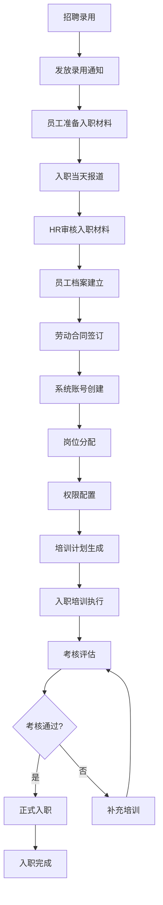
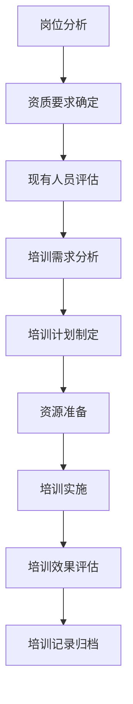

# 人力资源管理子系统详细需求规格说明书

## 1. 概述

### 1.1 文档目的
本文档详细描述人力资源管理子系统的功能需求、业务规则、用户界面要求、接口规范和验收标准，为系统开发、测试和部署提供具体指导。

### 1.2 文档范围
涵盖员工管理、考勤管理、培训管理、绩效管理、薪酬管理、组织架构、合规审计等七大核心业务域的详细功能需求。

### 1.3 术语定义
- **GMP**: Good Manufacturing Practice，药品生产质量管理规范
- **HR**: Human Resources，人力资源
- **ESS**: Employee Self Service，员工自助服务
- **MSS**: Manager Self Service，管理者自助服务

## 2. 功能模块详细需求

### 2.1 员工管理模块 (Employee Management)

#### 2.1.1 员工档案管理

**功能描述**: 维护员工基础信息、合同信息、资质证书等完整档案数据。

**详细功能需求**:

**2.1.1.1 员工信息管理**
```
用例: 员工档案CRUD操作
输入: 员工基本信息表单
处理: 
  1. 表单验证（格式、完整性、业务规则）
  2. 数据加密存储敏感信息
  3. 触发审计日志记录
  4. 同步到认证系统
输出: 操作结果、员工ID、审计日志ID

字段要求:
- 员工编号: 格式 EMP_YYYYMM_XXXX（年_月_序号），唯一性验证
- 姓名: 2-50字符，不含特殊字符
- 身份证: 18位数字+1位校验，格式验证
- 邮箱: RFC标准格式，唯一性验证
- 手机号: 11位数字，格式验证
- 出生日期: 不得晚于当前日期
- 入职日期: 不得晚于当前日期
- 所属部门: 必须在现有部门列表中
- 岗位: 必须在该部门可用岗位中
- 直接上级: 必须在组织架构中存在
```

**2.1.1.2 合同管理**
```
用例: 劳动合同管理
输入: 合同类型、期限、薪资条款
处理:
  1. 合同模板验证
  2. 薪资条款合规检查
  3. 到期时间计算和提醒设置
  4. 变更历史记录
输出: 合同ID、到期提醒设置、变更记录

合同类型:
- 固定期限合同: 3个月-3年
- 无固定期限合同: 试用期满后符合条件可签
- 实习合同: 6个月内
- 劳务合同: 特殊项目用工

合同到期提醒:
- 到期前30天: 邮件+系统消息提醒HR
- 到期前7天: 邮件+短信提醒员工和HR
- 到期前1天: 系统强制提醒
```

**2.1.1.3 资质证书管理**
```
用例: 资质证照管理
输入: 证书类型、编号、有效期、扫描件
处理:
  1. 证书类型有效性验证
  2. 到期时间检查和预警
  3. 证书文件存储和加密
  4. GMP合规性检查
输出: 证书状态、到期预警、文件链接

证书类型:
- 生产许可证
- GMP认证证书
- 职业技能证书
- 专业资格证书
- 岗位上岗证

预警规则:
- 到期前60天: 黄色预警
- 到期前30天: 橙色预警  
- 到期前7天: 红色预警
- 已到期: 红色警告，限制相关操作
```

#### 2.1.2 员工自助服务

**功能描述**: 员工可通过系统查看和更新个人信息、查看薪资条、申请假期等。

**详细功能需求**:

**2.1.2.1 个人信息管理**
```
用例: 员工自助信息维护
输入: 可编辑的个人信息字段
处理:
  1. 权限检查（只能编辑允许的字段）
  2. 数据格式验证
  3. 变更历史记录
  4. 审核流程（敏感信息变更需审核）
输出: 更新结果、审核状态

可编辑字段:
- 个人联系方式: 手机、邮箱、紧急联系人
- 银行信息: 薪资发放账户
- 个人偏好: 通知设置、语言偏好

不可编辑字段（需HR审核）:
- 身份信息: 姓名、身份证号
- 职位信息: 部门、岗位、直接上级
- 薪资信息: 基本工资、津贴
```

**2.1.2.2 薪资信息查询**
```
用例: 薪资信息查询
输入: 查询时间段
处理:
  1. 用户身份验证
  2. 数据权限检查
  3. 薪资数据解密显示
  4. 操作日志记录
输出: 薪资明细、扣除项目、银行流水

薪资明细包含:
- 基本工资
- 绩效奖金
- 各类津贴
- 社会保险扣除
- 个人所得税
- 其他扣除

数据安全:
- 敏感数据加密存储
- 显示时解密验证
- 禁止截图和下载
- 操作行为审计
```

### 2.2 考勤管理模块 (Attendance Management)

#### 2.2.1 考勤数据采集

**功能描述**: 支持多种考勤方式的数据采集和统一管理。

**详细功能需求**:

**2.2.1.1 打卡记录管理**
```
用例: 员工打卡操作
输入: 员工ID、时间戳、位置信息、设备ID
处理:
  1. 员工身份验证
  2. 考勤规则检查
  3. 位置有效性验证（防作弊）
  4. 打卡记录存储
  5. 异常情况标记
输出: 打卡结果、异常提示、当日状态

打卡方式:
- 指纹识别: 设备ID+指纹特征值
- 刷卡打卡: 员工卡号+时间
- 人脸识别: 员工ID+人脸特征
- 手机定位: GPS坐标+时间戳
- 二维码扫描: 动态二维码+时间

防作弊机制:
- 位置范围检查（100米内）
- 设备绑定验证
- 重复打卡过滤
- 异常时间检测
```

**2.2.1.2 考勤规则配置**
```
用例: 考勤规则设置
输入: 部门、岗位、班次规则
处理:
  1. 规则有效性验证
  2. 冲突检查
  3. 生效时间设置
  4. 历史版本保存
输出: 规则ID、生效状态、版本号

考勤规则参数:
- 标准工作时间: 8小时/天，40小时/周
- 弹性时间: 允许±1小时浮动
- 迟到容忍: 15分钟内不记迟到
- 早退标准: 下班时间前30分钟内
- 加班认定: 标准时间外工作
- 假期类型: 年假、病假、事假、婚假等

特殊规则:
- GMP生产岗位: 严格按时打卡
- 销售人员: 灵活工作制
- 管理层: 弹性工作时间
- 夜班人员: 夜班津贴计算
```

#### 2.2.2 考勤计算处理

**功能描述**: 基于打卡记录和考勤规则，自动计算考勤结果。

**详细功能需求**:

**2.2.2.1 月度考勤统计**
```
用例: 月度考勤数据计算
输入: 月份、员工范围
处理:
  1. 打卡数据汇总
  2. 考勤规则应用
  3. 异常情况标记
  4. 统计数据生成
  5. 薪资系统数据同步
输出: 考勤统计表、异常记录、薪资计算基础数据

统计项目:
- 出勤天数: 实际工作天数
- 迟到次数: 超过容忍时间的次数
- 早退次数: 提前下班的次数  
- 请假天数: 各类型假期天数
- 加班小时: 加班时长统计
- 旷工天数: 无故缺勤天数

计算公式:
- 出勤率 = 出勤天数 / 应出勤天数 × 100%
- 迟到率 = 迟到次数 / 出勤天数 × 100%
- 加班时长 = (实际工作时长 - 标准时长) 
- 考勤得分 = 100 - 迟到扣分 - 早退扣分 - 旷工扣分
```

### 2.3 培训管理模块 (Training Management)

#### 2.3.1 GMP培训管理

**功能描述**: 满足GMP法规要求的强制性培训管理。

**详细功能需求**:

**2.3.1.1 GMP培训计划**
```
用例: GMP培训需求分析
输入: 员工岗位、资质要求、合规周期
处理:
  1. 岗位培训需求匹配
  2. 合规周期计算
  3. 培训计划生成
  4. 强制培训标记
  5. 截止时间设置
输出: 培训计划、培训截止时间、强制状态

GMP培训类型:
- 入职培训: 新员工必须完成的基础培训
- 年度培训: 必须每年完成的复训
- 岗位培训: 针对特定岗位的专业培训
- 变更培训: 工艺、设备变更时的培训
- 偏差培训: 发生偏差后的专项培训

合规周期:
- 基础GMP: 每年复训一次
- 无菌操作: 每半年复训一次
- 验证培训: 每2年复训一次
- 特殊岗位: 根据岗位要求确定周期
```

**2.3.1.2 培训实施管理**
```
用例: 培训课程执行
输入: 培训计划、参训人员、培训师
处理:
  1. 培训资源分配
  2. 培训安排通知
  3. 培训签到管理
  4. 培训过程监控
  5. 考核成绩记录
输出: 培训状态、考核结果、证书状态

培训实施方式:
- 现场培训: 面对面授课，互动讨论
- 在线培训: 网络视频学习，自主进度
- 实操培训: 现场操作演示和练习
- 混合培训: 线上理论+线下实操

考核方式:
- 理论考试: 闭卷笔试或在线测试
- 实操考核: 现场操作演示
- 案例分析: 场景化问题解答
- 问卷调查: 培训效果反馈

GMP特殊要求:
- 培训记录完整保存
- 培训师资格验证
- 培训材料版本控制
- 培训效果评估记录
```

#### 2.3.2 资质认证管理

**功能描述**: 管理员工各类资质证书的申请、审核、发证等流程。

**详细功能需求**:

**2.3.2.1 资质证书申请**
```
用例: 资质证书申请流程
输入: 证书类型、申请材料、工作经历
处理:
  1. 申请条件验证
  2. 材料完整性检查
  3. 工作经历核实
  4. 审批流程启动
  5. 审核状态跟踪
输出: 申请状态、审核意见、证书编号

申请流程:
1. 员工提交申请和材料
2. 直接主管审核
3. HR部门初审
4. 专业部门复审
5. 管理层终审
6. 证书制作和发放

证书申请条件:
- 工作经验要求: 相关工作年限
- 培训完成证明: 必须完成的培训课程
- 考核成绩要求: 相关考试合格
- 健康状况证明: 体检报告
- 推荐人评价: 直接主管推荐

审核要点:
- 材料真实性验证
- 工作经验匹配度
- 培训记录完整性
- 考核成绩有效性
- 推荐意见合理性
```

### 2.4 绩效管理模块 (Performance Management)

#### 2.4.1 绩效目标管理

**功能描述**: 建立自上而下的绩效目标体系，确保个人目标与组织目标一致。

**详细功能需求**:

**2.4.1.1 目标设定与分解**
```
用例: 绩效目标制定
输入: 部门目标、个人职责、KPI指标
处理:
  1. 目标SMART原则验证
  2. 目标权重分配
  3. 里程碑设置
  4. 评估标准定义
  5. 目标批准流程
输出: 绩效目标、权重分配、评估标准

SMART原则:
- Specific: 目标具体明确
- Measurable: 可量化测量
- Achievable: 可实现达成
- Relevant: 与岗位职责相关
- Time-bound: 有明确时间限制

目标类型:
- 业务目标: 销售额、客户满意度等
- 管理目标: 团队建设、流程优化等
- 学习目标: 技能提升、知识更新等
- 合规目标: 质量指标、安全要求等

权重分配原则:
- 业务目标: 40-60%
- 管理目标: 20-30%
- 学习目标: 10-20%
- 合规目标: 必须完成，不占权重
```

#### 2.4.2 绩效评估流程

**功能描述**: 多维度、多角色的绩效评估体系。

**详细功能需求**:

**2.4.2.1 多维度评估**
```
用例: 360度绩效评估
输入: 自评结果、上级评价、同事互评、下属评价
处理:
  1. 评估维度定义
  2. 权重分配设置
  3. 评估数据汇总
  4. 评分标准化处理
  5. 绩效等级计算
输出: 综合评分、绩效等级、改进建议

评估维度:
- 工作业绩: 目标完成情况、工作质量
- 能力素质: 专业技能、学习能力
- 工作态度: 积极性、责任心、团队合作
- 领导力: （适用于管理者）团队管理、决策能力

评估流程:
1. 员工自评（占20%权重）
2. 直接主管评价（占40%权重）
3. 同事互评（占20%权重）
4. 下属评价（占20%权重，适用于管理者）

绩效等级定义:
- A级（优秀）: 90-100分，超额完成目标
- B级（良好）: 80-89分，较好完成目标
- C级（合格）: 70-79分，基本完成目标
- D级（需改进）: 60-69分，部分完成目标
- E级（不合格）: 60分以下，未完成目标
```

### 2.5 薪酬管理模块 (Compensation Management)

#### 2.5.1 薪资计算处理

**功能描述**: 基于考勤、绩效数据自动计算员工薪资。

**详细功能需求**:

**2.5.1.1 月度薪资计算**
```
用例: 月度薪资自动计算
输入: 基本工资、考勤数据、绩效结果、扣除项目
处理:
  1. 基本工资计算
  2. 考勤扣款计算
  3. 绩效奖金计算
  4. 各类津贴计算
  5. 社保个税扣除
  6. 净工资计算
输出: 工资单、银行代发数据、税务申报数据

薪资构成:
- 基本工资: 月标准工资
- 绩效奖金: 基于绩效等级的浮动工资
- 加班费: 按国家标准计算
- 夜班津贴: 夜班工作补贴
- 岗位津贴: 特殊岗位补贴
- 交通补贴: 通勤费用补贴
- 餐补: 工作餐补贴

计算公式:
- 基本日薪 = 基本月薪 / 21.75天
- 基本时薪 = 基本日薪 / 8小时
- 加班费 = 基本时薪 × 加班小时 × 加班倍数
- 绩效奖金 = 基本工资 × 绩效系数
- 夜班津贴 = 夜班天数 × 夜班标准

扣除项目:
- 社会保险: 养老、医疗、失业、工伤、生育保险
- 住房公积金: 按当地政策比例
- 个人所得税: 按国家税法计算
- 其他扣除: 借款、罚款等
```

#### 2.5.2 薪酬调整管理

**功能描述**: 管理员工薪资调整的申请、审批、生效流程。

**详细功能需求**:

**2.5.2.1 调薪申请流程**
```
用例: 薪资调整申请
输入: 调薪类型、调薪幅度、调薪原因
处理:
  1. 调薪资格检查
  2. 预算影响分析
  3. 审批流程启动
  4. 生效时间设置
  5. 调薪历史记录
输出: 调薪状态、审批意见、生效日期

调薪类型:
- 晋升调薪: 职位晋升相应的薪资调整
- 绩效调薪: 基于良好绩效的奖励性调薪
- 市场化调薪: 跟随市场水平的调整
- 特殊贡献调薪: 重大贡献的奖励性调薪
- 试用期满调薪: 转正后的薪资调整

审批流程:
1. 直属主管申请
2. 部门负责人审批
3. HR部门审核
4. 财务部门预算确认
5. 总经理终审（超过一定幅度）

调薪原则:
- 调薪幅度限制: 一般不超过20%
- 调薪频率限制: 每年最多2次
- 预算控制: 部门调薪总额控制
- 公平性原则: 同岗同酬，差异合理
```

### 2.6 组织架构管理模块 (Organization Management)

#### 2.6.1 组织结构维护

**功能描述**: 管理企业的组织架构，包括部门、岗位、层级关系。

**详细功能需求**:

**2.6.1.1 部门结构管理**
```
用例: 组织架构维护
输入: 部门名称、上级部门、部门职能
处理:
  1. 部门代码生成
  2. 层级关系验证
  3. 职能描述检查
  4. 生效时间设置
  5. 组织变更日志
输出: 部门ID、层级路径、变更记录

部门层级:
- 一级部门: 公司层面的大部门
- 二级部门: 一级部门下的子部门
- 三级部门: 具体的执行部门

部门管理规则:
- 部门代码唯一性: 全公司唯一标识
- 层级深度限制: 最多4级组织结构
- 人员配置标准: 各层级最少和最多人员数
- 职责明确性: 部门职能不重叠

组织变更流程:
1. 组织变更申请
2. 组织架构分析
3. 影响评估（人员、流程、系统）
4. 变更审批
5. 变更执行
6. 变更效果评估
```

#### 2.6.2 岗位职责管理

**功能描述**: 定义和维护各岗位的职责、任职要求、胜任力模型。

**详细功能需求**:

**2.6.2.1 岗位说明书管理**
```
用例: 岗位说明书维护
输入: 岗位名称、职责描述、任职资格
处理:
  1. 岗位模板验证
  2. 职责完整性检查
  3. 任职要求核实
  4. 版本控制管理
  5. 变更历史记录
输出: 岗位说明书、版本号、变更记录

岗位说明书结构:
1. 岗位基本信息: 岗位名称、所属部门、级别
2. 岗位职责: 主要工作职责和任务
3. 任职要求: 学历、专业、经验、技能要求
4. 工作环境: 工作条件、环境要求
5. 考核指标: 关键绩效指标(KPI)
6. 发展路径: 晋升通道、发展方向

GMP岗位特殊要求:
- 关键岗位资格要求
- GMP培训完成要求
- 健康状况要求
- 背景调查要求
- 专业技能认证要求

版本控制:
- 岗位说明书变更需要版本控制
- 保留历史版本用于对比分析
- 变更需要审批流程
- 变更生效时间控制
```

### 2.7 合规审计模块 (Compliance Audit)

#### 2.7.1 GMP合规管理

**功能描述**: 确保人事管理符合GMP法规要求。

**详细功能需求**:

**2.7.1.1 资质合规检查**
```
用例: GMP资质合规验证
输入: 员工ID、岗位要求、资质证书
处理:
  1. 岗位资质要求匹配
  2. 证书有效性验证
  3. 到期时间检查
  4. 培训记录核查
  5. 合规状态评估
输出: 合规状态、风险等级、整改建议

合规检查项目:
- 资质证书有效性: 证书未过期、在有效期内
- 培训记录完整性: 必须完成的培训都已完成
- 考核成绩合格性: 相关考核成绩达到要求
- 健康证有效性: 从事食品/药品相关工作需要
- 背景调查完成性: 关键岗位需要完成背景调查

合规风险等级:
- 绿色: 完全合规
- 黄色: 轻微不合规，需要关注
- 橙色: 中度不合规，需要整改
- 红色: 严重不合规，立即整改

整改要求:
- 黄色预警: 30天内整改完成
- 橙色预警: 15天内整改完成
- 红色预警: 立即整改，限制相关操作
- 整改逾期: 自动升级风险等级
```

#### 2.7.2 审计日志管理

**功能描述**: 记录所有关键人事操作的审计日志，确保数据追溯性。

**详细功能需求**:

**2.7.2.1 审计日志记录**
```
用例: 人事操作审计
输入: 操作类型、操作人、操作对象、变更内容
处理:
  1. 操作类型识别
  2. 敏感度级别评估
  3. 审计日志写入
  4. 日志完整性验证
  5. 长期存储安排
输出: 审计日志ID、存储位置、保存期限

审计日志内容:
- 操作人信息: 用户ID、姓名、部门
- 操作对象: 员工ID、变更的资源
- 操作类型: CREATE、UPDATE、DELETE、VIEW
- 变更内容: 变更前后数据对比
- 操作时间: 精确到毫秒的时间戳
- 操作结果: SUCCESS、FAILURE
- 异常信息: 错误码、错误描述

审计日志分类:
- 数据访问: 查看敏感信息的操作
- 数据变更: 修改员工数据的操作
- 权限变更: 用户权限修改操作
- 系统配置: 系统参数配置变更
- 登录操作: 用户登录、登出记录

保存期限:
- 审计日志: 7年保存
- 登录日志: 3年保存
- 系统日志: 1年保存
- 业务日志: 根据业务需要确定
```

## 3. 用户界面设计要求

### 3.1 界面设计原则

**3.1.1 设计标准**
```
设计要求:
- 风格统一: 符合GMP企业视觉识别系统
- 操作简单: 减少用户学习成本
- 响应快速: 页面加载时间<3秒
- 兼容性好: 支持主流浏览器和设备
- 可访问性: 符合WCAG 2.1 AA标准

色彩方案:
- 主色调: 企业标准色
- 辅助色: 用于状态提示
- 中性色: 用于文本和背景
- 警示色: 用于警告和错误信息

字体要求:
- 中文: 微软雅黑、苹方
- 英文: Arial、Helvetica
- 大小: 正文14px，标题16-24px
- 行高: 1.5倍字体大小
```

**3.1.2 导航设计**
```
主导航结构:
- 员工管理: 员工档案、合同管理、资质管理
- 考勤管理: 打卡记录、考勤统计、请假申请
- 培训管理: 培训计划、课程管理、考核评估
- 绩效管理: 目标设定、绩效评估、结果应用
- 薪酬管理: 薪资计算、工资发放、个税申报
- 组织架构: 部门管理、岗位管理、层级关系
- 系统管理: 用户管理、权限配置、系统设置

面包屑导航:
- 位置: 页面顶部，主导航下方
- 格式: 首页 > 模块 > 功能 > 子功能
- 功能: 支持快速返回上级页面
```

### 3.2 关键页面设计

**3.2.1 员工档案页面**
```
页面布局:
- 顶部操作区: 新增、编辑、删除、导入、导出按钮
- 搜索筛选区: 姓名、部门、状态、岗位等筛选条件
- 列表数据区: 表格展示员工基本信息
- 分页控制: 支持分页和每页显示数量设置

数据列设计:
- 员工编号: EMP_202411_0001
- 姓名: 员工真实姓名
- 部门: 所属部门全称
- 岗位: 当前担任岗位
- 状态: 在职/离职/试用
- 入职日期: YYYY-MM-DD格式
- 操作: 查看、编辑、删除操作按钮

操作功能:
- 新增员工: 打开新增员工表单
- 批量导入: 支持Excel文件批量导入
- 高级搜索: 支持多条件组合搜索
- 数据导出: 支持Excel格式导出
```

**3.2.2 考勤管理页面**
```
页面布局:
- 时间选择器: 支持选择查询时间段
- 考勤统计区: 出勤率、迟到率等关键指标
- 打卡记录列表: 详细打卡记录
- 异常处理区: 异常打卡记录处理

统计指标:
- 应出勤天数: 本月应出勤的工作日
- 实际出勤天数: 实际打卡的天数
- 出勤率: 实际出勤天数/应出勤天数×100%
- 迟到次数: 超过规定时间的次数
- 早退次数: 提前下班的次数
- 加班时长: 总加班小时数

异常处理:
- 漏打卡申请: 员工申请补签
- 请假申请: 各类假期申请
- 加班申请: 加班时间申请
- 调休申请: 调休时间申请
```

### 3.3 移动端适配

**3.3.1 响应式设计**
```
断点设置:
- 手机: 320px - 767px
- 平板: 768px - 1023px  
- 桌面: 1024px及以上

适配策略:
- 移动优先: 优先考虑移动端体验
- 渐进增强: 在移动端基础上增加桌面端功能
- 弹性布局: 使用Flexbox和Grid布局
- 媒体查询: 针对不同屏幕尺寸优化

移动端功能:
- 考勤打卡: 地理位置+人脸识别
- 个人信息: 查看和更新基本信息
- 请假申请: 移动端请假流程
- 工资查询: 查看工资单和明细
- 培训学习: 在线培训课程学习
```

## 4. 业务流程详细描述

### 4.1 新员工入职流程

**4.1.1 入职流程图**


**4.1.2 详细步骤说明**
```
步骤1: 招聘录用
- 业务规则: 岗位空缺，招聘需求审批通过
- 责任角色: 用人部门、HR部门
- 输入材料: 简历、面试评价、体检报告
- 输出结果: 录用决定

步骤2: 发放录用通知
- 业务规则: 录用决定确认后3个工作日内
- 责任角色: HR部门
- 输入材料: 录用决定、薪资待遇
- 输出结果: 录用通知书、入职清单

步骤3: 员工准备入职材料
- 业务规则: 按照入职清单准备相关材料
- 责任角色: 候选人
- 输入材料: 身份证、学历证书、工作经历证明等
- 输出结果: 完整的入职材料包

步骤4: 入职当天报道
- 业务规则: 按约定时间到公司报到
- 责任角色: 新员工、HR
- 输入材料: 入职材料包、公司制度文件
- 输出结果: 报道确认

步骤5: HR审核入职材料
- 业务规则: 材料真实性、完整性检查
- 责任角色: HR专员
- 输入材料: 入职材料包
- 输出结果: 审核意见、材料清单

步骤6: 员工档案建立
- 业务规则: 录入HR系统，建立电子档案
- 责任角色: HR专员
- 输入材料: 审核通过的入职材料
- 输出结果: 员工档案号、系统记录

步骤7: 劳动合同签订
- 业务规则: 符合劳动法规定，合同条款清晰
- 责任角色: HR专员、新员工
- 输入材料: 劳动合同模板、员工信息
- 输出结果: 签署的劳动合同

步骤8: 系统账号创建
- 业务规则: 账号信息安全，权限最小化
- 责任角色: IT部门、HR部门
- 输入材料: 员工信息、权限要求
- 输出结果: 各类系统账号、初始密码

步骤9: 岗位分配
- 业务规则: 根据招聘岗位和面试结果确定
- 责任角色: 用人部门、HR部门
- 输入材料: 组织架构、岗位需求
- 输出结果: 岗位分配通知

步骤10: 权限配置
- 业务规则: 基于岗位职责配置最小权限
- 责任角色: IT部门、HR部门
- 输入材料: 岗位信息、权限矩阵
- 输出结果: 权限配置清单

步骤11: 培训计划生成
- 业务规则: 基于岗位要求制定个性化培训计划
- 责任角色: 培训部门、HR部门
- 输入材料: 岗位要求、培训需求分析
- 输出结果: 个人培训计划

步骤12: 入职培训执行
- 业务规则: 培训内容全面，覆盖公司各个方面
- 责任角色: 培训师、各部门负责人
- 输入材料: 培训计划、培训材料
- 输出结果: 培训记录、考核结果

步骤13: 考核评估
- 业务规则: 考核标准明确，评估客观公正
- 责任角色: 培训师、部门负责人
- 输入材料: 培训计划、培训记录
- 输出结果: 考核成绩、评估意见

步骤14: 正式入职
- 业务规则: 考核通过后可正式入职
- 责任角色: HR部门、用人部门
- 输入材料: 考核结果、评估意见
- 输出结果: 正式入职通知、系统状态变更

步骤15: 入职完成
- 业务规则: 录入HR系统，建立完整档案
- 责任角色: HR部门
- 输入材料: 所有入职相关材料
- 输出结果: 完整的员工档案
```

### 4.2 GMP培训管理流程

**4.2.1 培训需求识别流程**


**4.2.2 GMP培训特殊要求**
```
GMP培训频次要求:
- 基础GMP培训: 新员工入职必须，完成后每年复训
- 专业技能培训: 根据岗位要求确定频次
- 法规更新培训: 相关法规更新时必须参加
- 偏差培训: 发生质量偏差时立即进行

培训记录要求:
- 培训日期和时长
- 培训内容和方式
- 培训师资格
- 参训人员名单
- 考核成绩记录
- 培训效果评估

培训效果评估:
- 理论考试: 闭卷笔试，满分100分，80分及格
- 实操考核: 现场操作演示
- 案例分析: 场景化问题解答
- 长期跟踪: 工作表现和改进情况
```

## 5. 数据流和接口定义

### 5.1 外部系统集成接口

**5.1.1 认证系统集成**
```
接口名称: 用户同步接口
接口地址: POST /api/auth/sync-user
接口描述: HR系统向认证系统同步用户信息

请求参数:
{
  "userId": "HR用户ID",
  "username": "用户名",
  "email": "邮箱地址", 
  "fullName": "真实姓名",
  "departmentId": "部门ID",
  "positionId": "岗位ID",
  "status": "用户状态",
  "permissions": ["权限列表"],
  "roles": ["角色列表"]
}

响应参数:
{
  "success": true/false,
  "message": "操作结果描述",
  "data": {
    "authUserId": "认证系统用户ID",
    "syncStatus": "同步状态"
  }
}
```

**5.1.2 财务系统集成**
```
接口名称: 薪资数据同步
接口地址: POST /api/finance/sync-payroll
接口描述: HR系统向财务系统同步薪资计算结果

请求参数:
{
  "payrollPeriod": "薪资周期 YYYY-MM",
  "employees": [
    {
      "employeeId": "员工ID",
      "basicSalary": "基本工资",
      "bonus": "奖金",
      "allowances": "津贴",
      "deductions": "扣除",
      "netSalary": "净工资",
      "taxAmount": "个税",
      "socialSecurity": "社保"
    }
  ]
}

响应参数:
{
  "success": true/false,
  "message": "同步结果",
  "data": {
    "totalEmployees": "总员工数",
    "totalAmount": "总金额",
    "syncErrors": ["同步错误列表"]
  }
}
```

### 5.2 内部服务接口

**5.2.1 员工服务接口**
```
接口名称: 员工信息查询
接口地址: GET /api/hr/employees/{id}
接口描述: 根据员工ID查询详细信息

请求参数:
- Path Variable: id - 员工ID

响应参数:
{
  "success": true/false,
  "message": "查询结果描述",
  "data": {
    "id": "员工ID",
    "employeeNo": "员工编号",
    "fullName": "姓名",
    "email": "邮箱",
    "phone": "电话",
    "department": {
      "id": "部门ID",
      "name": "部门名称"
    },
    "position": {
      "id": "岗位ID", 
      "name": "岗位名称"
    },
    "hireDate": "入职日期",
    "status": "状态",
    "qualifications": ["资质证书列表"]
  }
}
```

**5.2.2 考勤服务接口**
```
接口名称: 考勤记录提交
接口地址: POST /api/hr/attendance/clock
接口描述: 员工打卡记录提交

请求参数:
{
  "employeeId": "员工ID",
  "clockType": "CLOCK_IN/CLOCK_OUT",
  "timestamp": "时间戳",
  "location": {
    "latitude": "纬度",
    "longitude": "经度",
    "address": "地址描述"
  },
  "deviceInfo": {
    "deviceId": "设备ID",
    "deviceType": "设备类型"
  }
}

响应参数:
{
  "success": true/false,
  "message": "打卡结果",
  "data": {
    "attendanceId": "考勤记录ID",
    "clockTime": "实际打卡时间",
    "workStatus": "工作状态",
    "dailyStatus": "当日状态"
  }
}
```

## 6. 验收标准

### 6.1 功能性验收标准

**6.1.1 员工管理模块验收**
```
验收项目: 员工档案管理
验收标准:
1. 支持员工信息的增加、修改、删除、查询操作
2. 员工编号自动生成，格式符合规范
3. 身份证号格式验证，重复性检查
4. 邮箱格式验证，唯一性检查
5. 部门、岗位信息必须从基础数据中选择
6. 敏感信息加密存储
7. 操作日志完整记录
8. 批量导入支持Excel格式，错误数据提示明确

验收方法:
- 功能测试: 每个功能点进行操作验证
- 数据验证: 输入各种类型数据测试验证规则
- 性能测试: 大批量数据操作测试响应时间
- 安全测试: 验证权限控制和加密存储
```

**6.1.2 考勤管理模块验收**
```
验收项目: 考勤打卡功能
验收标准:
1. 支持多种打卡方式（指纹、刷卡、人脸、手机）
2. 位置验证功能正常（100米范围内）
3. 防作弊机制有效（重复打卡过滤）
4. 异常打卡标记准确
5. 考勤规则配置灵活
6. 月度考勤统计准确
7. 考勤数据与薪资系统同步正常

验收方法:
- 功能测试: 各种打卡方式测试
- 边界测试: 边界位置、异常时间测试
- 性能测试: 高并发打卡测试
- 集成测试: 与薪资系统数据同步测试
```

**6.1.3 培训管理模块验收**
```
验收项目: GMP培训管理
验收标准:
1. 培训计划自动生成
2. 培训记录完整保存
3. 培训到期提醒准确
4. 资质证书管理规范
5. 合规检查自动执行
6. 培训效果评估跟踪
7. 证书到期预警及时

验收方法:
- 业务流程测试: 完整的培训流程测试
- 规则验证测试: 各种合规规则验证
- 提醒功能测试: 各种提醒设置测试
- 报表功能测试: 培训统计报表准确性
```

### 6.2 非功能性验收标准

**6.2.1 性能要求**
```
性能指标:
- 响应时间: 页面加载时间 < 3秒
- 并发用户: 支持500并发用户同时在线
- 数据处理: 月度考勤计算 < 5分钟
- 系统可用性: 99.9%以上
- 数据恢复: 故障恢复时间 < 4小时

验收方法:
- 压力测试: 使用工具模拟高并发场景
- 性能监控: 使用APM工具监控系统性能
- 容量规划: 根据业务增长预测进行容量测试
```

**6.2.2 安全要求**
```
安全指标:
- 数据加密: 敏感数据采用AES-256加密
- 权限控制: 基于RBAC的细粒度权限控制
- 审计日志: 关键操作完整记录
- 数据备份: 每日自动备份，异地存储
- 访问控制: IP白名单、访问频率限制

验收方法:
- 安全测试: 使用专业安全测试工具
- 渗透测试: 模拟攻击测试系统安全性
- 代码审查: 检查安全编码规范执行情况
- 备份恢复测试: 验证备份数据完整性
```

### 6.3 兼容性验收标准

**6.3.1 浏览器兼容性**
```
支持浏览器:
- Chrome: 最新版本及前两个版本
- Firefox: 最新版本及前两个版本  
- Safari: 最新版本及前两个版本
- Edge: 最新版本及前两个版本

验收方法:
- 跨浏览器测试: 在各主流浏览器中测试主要功能
- 兼容性测试: 使用自动化工具进行兼容性测试
```

**6.3.2 设备兼容性**
```
支持设备:
- 桌面电脑: Windows 10+, macOS 10.15+
- 平板电脑: iPad, Android平板
- 手机设备: iOS 12+, Android 8+

验收方法:
- 设备测试: 在各类设备上测试关键功能
- 响应式测试: 验证不同屏幕尺寸的适配效果
- 触摸操作测试: 验证移动设备触摸操作体验
```

---

**文档信息：**
- 版本：v1.0
- 更新日期：2025年11月21日
- 编制人员：需求分析团队
- 审核状态：待审核
- 保密级别：内部使用
