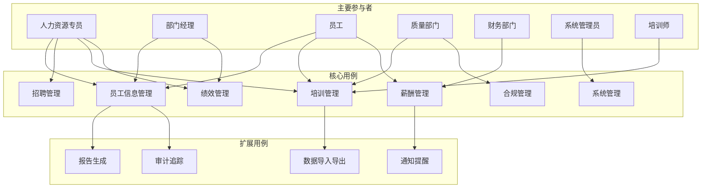
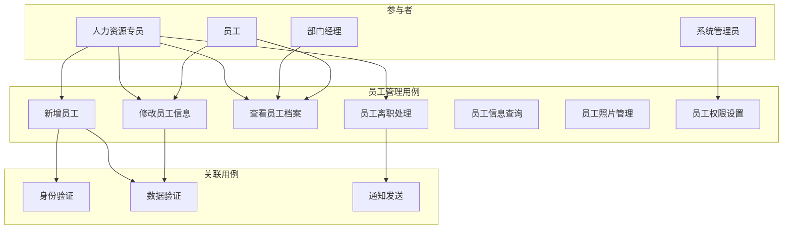
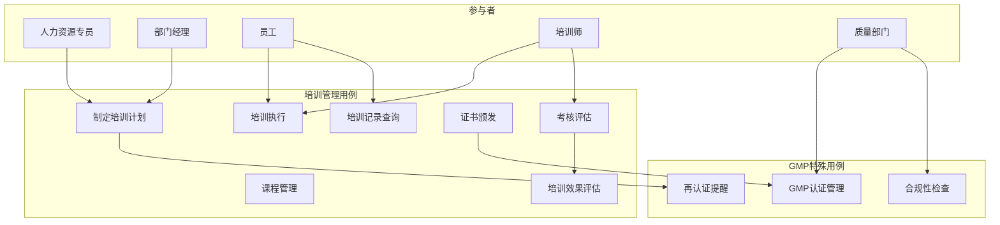

# GMP系统人事管理模块用例图和用例描述

## 文档信息
- **文档版本**: v1.0
- **创建日期**: 2025-11-21
- **最后更新**: 2025-11-21
- **作者**: 业务分析师
- **审核人**: 系统架构师

## 目录
1. [概述](#概述)
2. [系统参与者](#系统参与者)
3. [主要用例图](#主要用例图)
4. [核心用例描述](#核心用例描述)
5. [扩展用例](#扩展用例)
6. [用例关系](#用例关系)
7. [业务规则](#业务规则)

---

## 概述

### 文档目的
本文档定义了GMP系统人事管理模块的用例图和详细用例描述，为系统设计和开发提供业务需求基础。

### 用例方法论
- **UML标准**: 采用UML 2.5标准绘制用例图
- **场景驱动**: 基于真实业务场景描述用例
- **角色导向**: 从用户角色出发设计用例
- **功能完整**: 覆盖所有核心业务功能

### 用例分类
1. **管理类用例**: 系统管理员执行的用例
2. **业务类用例**: 业务人员执行的核心用例
3. **审批类用例**: 流程审批相关用例
4. **查询类用例**: 数据查询和报告用例

---

## 系统参与者

### 主要参与者

#### 1. 人力资源专员 (HR Specialist)
- **角色描述**: 负责人事日常管理工作的专业人员
- **主要职责**:
  - 员工信息维护
  - 招聘管理
  - 培训计划制定
  - 绩效管理协助
- **权限范围**: 人事数据管理、培训管理、基础审批
- **使用频率**: 高频使用，每天多次

#### 2. 部门经理 (Department Manager)
- **角色描述**: 各业务部门的管理者
- **主要职责**:
  - 团队人员管理
  - 绩效评估
  - 招聘需求提出
  - 培训需求确认
- **权限范围**: 部门人员管理、绩效评估、部分审批
- **使用频率**: 中频使用，每周多次

#### 3. 员工 (Employee)
- **角色描述**: 系统的最终用户，包括所有在职员工
- **主要职责**:
  - 查看个人信息
  - 参与培训学习
  - 提交绩效自评
  - 查看薪酬信息
- **权限范围**: 个人数据查看、部分信息更新
- **使用频率**: 中频使用，每周多次

#### 4. 质量部门 (Quality Department)
- **角色描述**: 负责GMP合规性监督的部门
- **主要职责**:
  - GMP培训认证
  - 合规性检查
  - 审计追踪
  - 违规处理
- **权限范围**: 合规性管理、培训认证、审计查询
- **使用频率**: 低频使用，按需使用

#### 5. 财务部门 (Finance Department)
- **角色描述**: 负责薪酬计算和发放的部门
- **主要职责**:
  - 薪酬计算
  - 工资发放
  - 税务申报
  - 成本分析
- **权限范围**: 薪酬管理、财务数据查询
- **使用频率**: 中频使用，每月使用

#### 6. 系统管理员 (System Administrator)
- **角色描述**: 负责系统维护和配置的技术人员
- **主要职责**:
  - 系统配置管理
  - 用户权限设置
  - 数据备份恢复
  - 系统监控
- **权限范围**: 系统配置、权限管理、技术维护
- **使用频率**: 低频使用，按需使用

### 次要参与者

#### 7. 培训师 (Training Instructor)
- **角色描述**: 负责GMP培训和技能提升的专业人员
- **主要职责**:
  - 培训课程实施
  - 学员考核评估
  - 培训效果跟踪
- **权限范围**: 培训管理、学员评估
- **使用频率**: 中频使用，按培训计划使用

#### 8. 外部审计员 (External Auditor)
- **角色描述**: GMP认证和合规性审计的外部专家
- **主要职责**:
  - 合规性审计
  - 培训记录审查
  - 人员资质验证
- **权限范围**: 审计数据查看、报告生成
- **使用频率**: 非常低频，年度或认证时使用

---

## 主要用例图

### 整体系统用例图

### 详细用例图 - 员工管理模块

### 详细用例图 - 培训管理模块

---

## 核心用例描述

### 用例1: 员工信息管理

#### 用例概述
- **用例编号**: UC-HR-001
- **用例名称**: 员工信息管理
- **主要参与者**: 人力资源专员
- **次要参与者**: 部门经理、员工、系统管理员
- **优先级**: 高
- **业务价值**: 确保员工信息的完整性和准确性

#### 前置条件
1. 用户已登录系统并获得相应权限
2. 员工基本信息已收集完整
3. 系统正常运行，网络连接正常

#### 后置条件
1. 员工信息成功保存到数据库
2. 相关通知已发送给相关部门
3. 系统日志记录了操作过程

#### 主成功场景
1. 人力资源专员登录系统
2. 选择"员工信息管理"功能
3. 点击"新增员工"按钮
4. 系统显示员工信息录入表单
5. 填写员工基本信息（姓名、身份证、联系方式等）
6. 填写工作信息（部门、岗位、入职时间等）
7. 填写GMP合规信息（健康证、培训要求等）
8. 上传员工照片和证件扫描件
9. 系统验证数据完整性和格式
10. 保存员工信息并生成员工编号
11. 系统自动创建用户账户
12. 发送通知邮件给部门经理和新员工
13. 记录操作日志

#### 扩展场景
**2a. 数据验证失败**
- 2a1. 系统发现必填字段缺失
- 2a2. 显示错误信息并标红错误字段
- 2a3. 用户修正数据后重新提交

**4a. 批量导入员工信息**
- 4a1. 选择Excel模板导入功能
- 4a2. 上传包含员工信息的Excel文件
- 4a3. 系统验证数据格式
- 4a4. 确认导入信息
- 4a5. 批量创建员工记录

**6a. 照片上传失败**
- 6a1. 系统检测到照片文件过大或格式不正确
- 6a2. 提示用户重新选择文件
- 6a3. 继续后续流程或跳过照片上传

#### 异常处理
1. **网络异常**: 保存失败时自动重试，重试3次后提示用户
2. **数据冲突**: 检测到重复员工信息时提示用户检查
3. **权限不足**: 提示用户联系管理员获取权限
4. **系统维护**: 提示用户在维护时间外进行操作

#### 业务规则
1. 员工编号必须唯一，由系统自动生成
2. 身份证号码必须符合国家标准格式
3. 邮箱地址必须唯一且符合标准格式
4. 必填字段不能为空
5. 照片大小不超过2MB，格式为JPG或PNG
6. GMP相关岗位必须上传健康证

---

### 用例2: 培训计划制定

#### 用例概述
- **用例编号**: UC-HR-002
- **用例名称**: 培训计划制定
- **主要参与者**: 人力资源专员
- **次要参与者**: 部门经理、培训师、质量部门
- **优先级**: 高
- **业务价值**: 确保员工获得必要的GMP培训，保持合规状态

#### 前置条件
1. 已确定培训需求和目标
2. 培训师资和场地已确认可用
3. 相关培训课程内容已准备

#### 后置条件
1. 培训计划已生成并保存
2. 相关部门已收到培训通知
3. 培训资源已预留

#### 主成功场景
1. 人力资源专员登录培训管理模块
2. 选择"制定培训计划"功能
3. 选择培训类型（新员工培训、在职培训、专项培训等）
4. 输入培训计划基本信息（计划名称、时间、预算等）
5. 选择参训人员（个人、部门、特定岗位等）
6. 添加培训课程内容
7. 设置培训方式和地点
8. 指定培训师和考核方式
9. 系统计算培训成本和时长
10. 提交培训计划审批
11. 审批通过后自动发送培训通知
12. 记录培训计划创建日志

#### 扩展场景
**6a. 自动生成培训计划**
- 6a1. 选择"智能推荐"功能
- 6a2. 输入员工基本信息
- 6a3. 系统基于岗位要求自动推荐培训课程
- 6a4. 用户调整推荐结果
- 6a5. 生成培训计划

**8a. 外部培训师安排**
- 8a1. 需要安排外部培训师
- 8a2. 搜索外部培训师资源
- 8a3. 联系并确认培训师档期
- 8a4. 签订培训服务合同
- 8a5. 安排培训时间

#### 异常处理
1. **培训师冲突**: 检测到培训师时间冲突时提示重新安排
2. **场地冲突**: 培训场地不可用时推荐其他场地
3. **预算超限**: 培训成本超出预算时提示调整计划

#### 业务规则
1. 新员工必须在入职后30天内完成基础GMP培训
2. GMP关键岗位员工每年必须接受再培训
3. 培训计划必须经过部门经理审批
4. 培训成本必须在预算范围内
5. 培训时间不能与正常工作安排冲突

---

### 用例3: 绩效评估管理

#### 用例概述
- **用例编号**: UC-HR-003
- **用例名称**: 绩效评估管理
- **主要参与者**: 部门经理
- **次要参与者**: 人力资源专员、员工
- **优先级**: 高
- **业务价值**: 客观公正地评估员工绩效，促进持续改进

#### 前置条件
1. 绩效评估周期已启动
2. 员工在评估期内有实际工作记录
3. KPI指标已设定并可量化

#### 后置条件
1. 绩效评估结果已记录并保存
2. 改进计划已制定
3. 评估结果已通知相关人员

#### 主成功场景
1. 部门经理登录绩效管理模块
2. 选择"绩效评估"功能
3. 选择评估周期和被评估员工
4. 查看员工工作数据和KPI完成情况
5. 评估员工工作质量（优秀、良好、合格、需改进）
6. 评估员工合规表现（GMP执行、安全规范等）
7. 评估员工团队合作和沟通能力
8. 与员工进行绩效面谈
9. 制定绩效改进计划
10. 提交评估结果
11. 系统计算绩效等级和薪酬调整建议
12. 发送评估结果通知给员工和HR

#### 扩展场景
**5a. 360度评估**
- 5a1. 选择360度评估模式
- 5a2. 系统邀请同事、下属参与评估
- 5a3. 收集多方评估意见
- 5a4. 汇总评估结果
- 5a5. 综合分析给出最终评估

**7a. 自动绩效计算**
- 7a1. 启用自动计算功能
- 7a2. 系统自动提取工作数据
- 7a3. 基于预设规则计算绩效分数
- 7a4. 经理确认计算结果
- 7a5. 生成绩效报告

#### 异常处理
1. **数据缺失**: 工作数据不完整时提示补充或标注
2. **评估争议**: 员工对评估结果有异议时启动申诉流程
3. **超时评估**: 超过评估截止时间时提醒并限制提交

#### 业务规则
1. 绩效评估必须涵盖工作质量、合规性、团队协作等方面
2. 评估过程必须与员工进行沟通确认
3. 绩效等级与薪酬调整挂钩
4. 连续两次"需改进"评估需要制定改进计划
5. 评估结果必须经过HR部门审核

---

### 用例4: 薪酬管理

#### 用例概述
- **用例编号**: UC-HR-004
- **用例名称**: 薪酬管理
- **主要参与者**: 财务部门
- **次要参与者**: 人力资源专员、部门经理
- **优先级**: 高
- **业务价值**: 准确计算和及时发放员工薪酬

#### 前置条件
1. 薪酬计算周期开始
2. 员工考勤数据已汇总
3. 绩效评估结果已确认
4. 薪酬政策已确定

#### 后置条件
1. 薪酬计算完成并确认
2. 工资单已生成并发送给员工
3. 税务和社保申报已完成

#### 主成功场景
1. 财务人员登录薪酬管理模块
2. 选择"薪酬计算"功能
3. 选择计算周期（月度/季度/年度）
4. 系统自动获取考勤数据
5. 获取绩效评估结果
6. 计算基本工资、绩效奖金、加班费等
7. 扣除个人所得税、社保等费用
8. 生成个人薪酬明细
9. 部门经理确认薪酬结果
10. 提交薪酬审批流程
11. 审批通过后执行银行转账
12. 发送工资单给员工
13. 生成薪酬报表

#### 扩展场景
**6a. 批量薪酬计算**
- 6a1. 选择"批量计算"功能
- 6a2. 选择计算范围（部门/岗位/全体员工）
- 6a3. 系统自动批量处理
- 6a4. 显示计算结果摘要
- 6a5. 确认后执行转账

**8a. 薪酬调整处理**
- 8a1. 处理年度薪酬调整
- 8a2. 应用新的薪酬政策
- 8a3. 计算调整差额
- 8a4. 更新员工薪酬档案
- 8a5. 通知员工调整结果

#### 异常处理
1. **考勤异常**: 考勤数据异常时人工核实处理
2. **银行转账失败**: 自动重试，失败后通知相关人员
3. **税务计算错误**: 重新计算并修正工资单

#### 业务规则
1. 薪酬计算必须基于准确的考勤和绩效数据
2. 工资发放时间固定，不能延迟
3. 税务计算符合国家税法规定
4. 薪酬调整必须经过正式审批流程
5. 员工有权查询自己的薪酬明细

---

### 用例5: GMP合规管理

#### 用例概述
- **用例编号**: UC-HR-005
- **用例名称**: GMP合规管理
- **主要参与者**: 质量部门
- **次要参与者**: 人力资源专员、部门经理
- **优先级**: 高
- **业务价值**: 确保所有员工符合GMP合规要求

#### 前置条件
1. 员工已入职并开始工作
2. 相关GMP法规要求已明确
3. 培训课程和认证标准已设定

#### 后置条件
1. 员工合规状态已更新
2. 不合规情况已处理
3. 合规报告已生成

#### 主成功场景
1. 质量部门人员登录合规管理模块
2. 查询员工合规状态列表
3. 检查员工GMP培训记录
4. 验证员工健康证有效性
5. 检查员工资质证书
6. 对不合规员工发出整改通知
7. 跟踪整改进度
8. 更新合规状态
9. 生成合规报告
10. 向管理层汇报合规情况

#### 扩展场景
**4a. 健康证到期提醒**
- 4a1. 系统检测到健康证即将到期
- 4a2. 自动发送提醒给员工和HR
- 4a3. 安排健康检查
- 4a4. 更新健康证信息

**6a. 重大违规处理**
- 6a1. 发现严重GMP违规行为
- 6a2. 立即暂停相关工作权限
- 6a3. 启动违规调查流程
- 6a4. 根据调查结果处理
- 6a5. 更新合规档案

#### 异常处理
1. **健康证过期**: 立即停止相关工作并安排体检
2. **培训记录缺失**: 安排补训并记录
3. **证书造假**: 启动调查并按公司政策处理

#### 业务规则
1. 所有GMP相关岗位员工必须持有效健康证
2. 关键岗位员工必须通过GMP认证
3. 合规状态每月必须复核一次
4. 违规行为必须记录在案
5. 合规培训每年必须更新

---

## 扩展用例

### 用例6: 报告生成

#### 用例概述
- **用例编号**: UC-HR-006
- **用例名称**: 报告生成
- **主要参与者**: 人力资源专员
- **次要参与者**: 部门经理、高级管理层
- **优先级**: 中
- **业务价值**: 提供各类人事管理报表，支持决策分析

#### 功能描述
1. 员工统计报表
2. 培训完成情况报表
3. 绩效分析报表
4. 薪酬成本分析报表
5. 合规状态报表

### 用例7: 审计追踪

#### 用例概述
- **用例编号**: UC-HR-007
- **用例名称**: 审计追踪
- **主要参与者**: 质量部门
- **次要参与者**: 系统管理员、外部审计员
- **优先级**: 高
- **业务价值**: 提供完整的操作审计记录，满足GMP审计要求

#### 功能描述
1. 用户操作日志查询
2. 数据变更历史追踪
3. 权限变更记录
4. 系统访问审计
5. 审计报告导出

### 用例8: 数据导入导出

#### 用例概述
- **用例编号**: UC-HR-008
- **用例名称**: 数据导入导出
- **主要参与者**: 人力资源专员
- **次要参与者**: 系统管理员
- **优先级**: 中
- **业务价值**: 支持批量数据处理和第三方系统集成

#### 功能描述
1. Excel格式数据导入
2. 批量员工信息更新
3. 培训记录导出
4. 薪酬数据导出
5. 第三方系统数据同步

---

## 用例关系

### 包含关系 (Include)
1. **员工信息管理** 包含 **数据验证**
2. **培训计划制定** 包含 **资源可用性检查**
3. **绩效评估管理** 包含 **数据收集**
4. **薪酬管理** 包含 **考勤数据同步**

### 扩展关系 (Extend)
1. **员工信息管理** 可扩展为 **批量导入**
2. **绩效评估管理** 可扩展为 **360度评估**
3. **培训计划制定** 可扩展为 **外部培训师安排**
4. **薪酬管理** 可扩展为 **薪酬调整**

### 泛化关系 (Generalization)
1. **员工信息管理** 是 **人员管理** 的特例
2. **GMP合规管理** 是 **合规管理** 的特例
3. **培训管理** 是 **能力发展** 的特例

---

## 业务规则

### 通用业务规则
1. 所有用户操作必须记录审计日志
2. 敏感信息必须加密存储
3. 数据变更必须经过权限验证
4. 系统必须支持中文界面
5. 关键操作必须支持回滚

### GMP特殊规则
1. 关键岗位员工必须有GMP认证
2. 健康证必须每年更新
3. 培训记录必须保存至少5年
4. 违规行为必须记录并跟踪
5. 合规检查必须定期执行

### 系统性能规则
1. 页面响应时间不超过3秒
2. 支持1000+并发用户
3. 数据查询响应时间不超过2秒
4. 系统可用性达到99.9%
5. 数据备份每日自动执行

---

## 附录

### 附录A: 用例模板
- [ ] 用例概述模板
- [ ] 用例详细描述模板
- [ ] 异常处理模板

### 附录B: 术语表
- **GMP**: Good Manufacturing Practice，良好生产规范
- **KPI**: Key Performance Indicator，关键绩效指标
- **UC**: Use Case，用例
- **SOP**: Standard Operating Procedure，标准操作程序

### 附录C: 参考标准
- [ ] GMP规范要求
- [ ] 劳动法规要求
- [ ] 数据保护法规
- [ ] 审计标准

---

*本文档是GMP系统人事管理模块用例图和用例描述的完整定义，为系统设计和开发提供详细的业务需求基础。*
