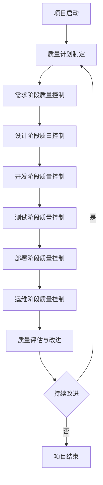
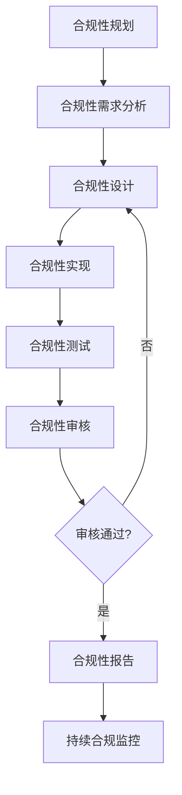
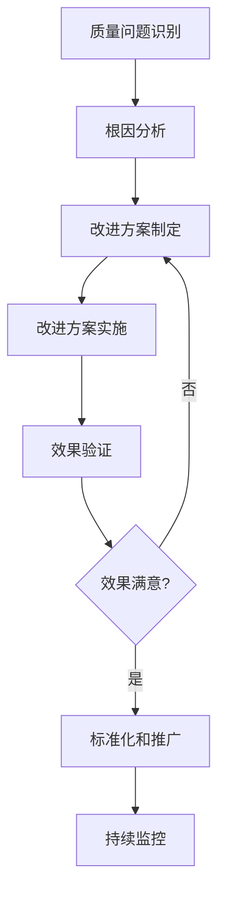

# 人事子系统质量控制流程

## 📋 文档信息

| 属性 | 值 |
|------|---|
| 文档标题 | 人事子系统质量控制流程 |
| 版本号 | v1.0.0 |
| 发布日期 | 2025年11月 |
| 编制人 | 质量经理：刘芳 |
| 审核人 | 项目经理：张明、测试经理：陈亮 |
| 文档状态 | 正式版 |

## 1️⃣ 引言

### 1.1 文档目的

本文档定义了GMP环境下人事管理子系统项目的质量控制流程，明确了质量控制的目标、职责、流程和方法，旨在确保系统开发全过程的质量控制，交付符合GMP标准和用户要求的高质量软件产品。本流程适用于项目生命周期的各个阶段，为质量管理提供统一的指导。

### 1.2 术语定义

| 术语 | 解释 |
|------|------|
| 质量控制 | 为达到质量要求所采取的作业技术和活动 |
| 质量保证 | 为使人们确信产品或服务能满足质量要求而在质量管理体系中实施并根据需要进行证实的全部有计划和有系统的活动 |
| 质量管理 | 在质量方面指挥和控制组织的协调的活动 |
| GMP | 良好生产规范(Good Manufacturing Practice)，药品生产质量管理规范 |
| 质量计划 | 对特定的项目、产品、过程或合同，规定由谁及何时应使用哪些程序和相关资源的文件 |
| 质量标准 | 衡量产品或服务质量的尺度 |
| 质量审核 | 确定质量活动及其有关结果是否符合计划的安排，以及这些安排是否有效实施并适合于达到预定目标的、有系统的、独立的检查 |
| 质量度量 | 用于评估质量特性的可量化的指标 |
| 缺陷 | 未满足与预期或规定用途有关的要求 |
| 测试 | 对产品或服务的一种或多种特性进行测量、检查、试验和度量，并将结果与规定要求进行比较，以确定每项特性合格情况的活动 |
| 审计跟踪 | 记录系统中所有关键操作的日志记录机制 |
| 电子签名 | 用于验证用户身份和操作授权的电子认证机制 |
| 变更控制 | 对变更进行识别、评估、批准、实施和验证的过程 |
| 配置管理 | 为确保产品配置的完整性、一致性和可追溯性而进行的管理活动 |
| 风险评估 | 评估风险对项目目标的影响程度和可能性的过程 |

## 2️⃣ 质量控制原则

### 2.1 核心质量原则

| 原则 | 描述 | 应用场景 |
|------|------|----------|
| **以客户为中心** | 所有质量活动以满足客户需求为核心 | 需求分析、用户验收测试 |
| **预防为主** | 注重预防而非检测，通过过程控制确保质量 | 开发过程、设计评审 |
| **全员参与** | 质量是所有团队成员的共同责任 | 全项目生命周期 |
| **过程方法** | 系统地识别和管理组织所应用的过程 | 项目管理、开发流程 |
| **持续改进** | 不断优化过程和产品质量 | 项目回顾、质量改进会议 |
| **基于事实的决策** | 基于数据分析和事实进行决策 | 质量评估、风险管理 |
| **互利的合作关系** | 与相关方建立互利的合作关系 | 供应商管理、团队协作 |
| **GMP合规性** | 所有活动必须符合GMP法规要求 | 全项目生命周期 |

### 2.2 GMP相关质量原则

1. **数据完整性**：确保所有数据的准确性、完整性、一致性和可追溯性
2. **审计跟踪**：记录所有关键操作，确保操作的可追溯性和不可否认性
3. **权限控制**：严格的访问控制和权限管理，防止未授权操作
4. **验证和确认**：通过验证和确认活动确保系统符合预定用途
5. **变更控制**：对所有变更进行严格的控制和管理
6. **文档管理**：完整、准确、及时的文档管理
7. **培训和资质**：确保所有参与人员具备必要的培训和资质

## 3️⃣ 质量控制组织与职责

### 3.1 质量控制组织架构

```
项目指导委员会
        ↓
项目经理 ────── 质量经理
  ↓              ↓
开发团队       测试团队
  ↓              ↓
开发工程师   测试工程师
```

### 3.2 关键角色与职责

| 角色 | 职责描述 | 具体工作内容 |
|------|----------|------------|
| **项目经理** | 1. 对项目质量负总体责任<br>2. 确保质量计划的实施<br>3. 协调资源支持质量控制活动<br>4. 批准质量相关决策 | 1. 主持质量评审会议<br>2. 审批质量计划和质量报告<br>3. 协调解决重大质量问题<br>4. 确保质量资源的合理配置 |
| **质量经理** | 1. 制定质量控制流程和标准<br>2. 监督质量控制活动的执行<br>3. 组织质量审核和评估<br>4. 推动质量改进 | 1. 制定质量计划和质量标准<br>2. 组织质量审核和检查<br>3. 分析质量数据并提出改进建议<br>4. 管理质量控制团队 |
| **开发团队负责人** | 1. 确保开发过程符合质量标准<br>2. 组织代码审查和单元测试<br>3. 管理开发阶段的质量控制活动<br>4. 负责缺陷修复的质量 | 1. 制定开发阶段的质量目标<br>2. 组织代码审查和单元测试<br>3. 监控开发过程的质量指标<br>4. 协调解决开发阶段的质量问题 |
| **测试团队负责人** | 1. 设计和执行测试计划<br>2. 组织各类测试活动<br>3. 管理缺陷的跟踪和验证<br>4. 提供测试报告和质量评估 | 1. 制定测试策略和测试计划<br>2. 组织执行各类测试<br>3. 管理缺陷报告和跟踪<br>4. 提供测试报告和质量建议 |
| **开发工程师** | 1. 按照质量标准进行开发<br>2. 执行单元测试<br>3. 参与代码审查<br>4. 修复缺陷 | 1. 编写高质量的代码<br>2. 执行单元测试并提交报告<br>3. 参与代码审查并解决问题<br>4. 修复缺陷并确保修复质量 |
| **测试工程师** | 1. 执行测试用例<br>2. 报告和跟踪缺陷<br>3. 验证缺陷修复<br>4. 提供测试报告 | 1. 执行各类测试用例<br>2. 记录和报告缺陷<br>3. 验证缺陷修复的有效性<br>4. 生成测试报告和质量度量数据 |
| **业务分析师** | 1. 确保需求的质量<br>2. 参与需求评审<br>3. 澄清需求问题<br>4. 参与验收测试 | 1. 编写高质量的需求文档<br>2. 参与需求评审并解决问题<br>3. 澄清测试过程中的需求疑问<br>4. 参与用户验收测试 |
| **合规专家** | 1. 确保系统符合GMP要求<br>2. 参与合规性审查<br>3. 提供合规性指导<br>4. 审核质量文档 | 1. 提供GMP合规性要求和指导<br>2. 参与合规性审查和测试<br>3. 审核质量文档的合规性<br>4. 提供合规性改进建议 |

## 4️⃣ 质量控制流程概述

### 4.1 质量控制总体流程



### 4.2 质量控制关键阶段

| 阶段 | 主要活动 | 关键交付物 | 质量控制重点 |
|------|----------|------------|------------|
| **需求阶段** | 1. 需求收集和分析<br>2. 需求评审<br>3. 需求变更控制 | 1. 需求规格说明书<br>2. 需求评审报告<br>3. 需求变更记录 | 需求的完整性、一致性、可测试性、GMP合规性 |
| **设计阶段** | 1. 系统设计<br>2. 架构设计<br>3. 设计评审<br>4. 设计变更控制 | 1. 系统设计文档<br>2. 架构设计文档<br>3. 设计评审报告<br>4. 设计变更记录 | 设计的合理性、可维护性、安全性、GMP合规性 |
| **开发阶段** | 1. 代码开发<br>2. 代码审查<br>3. 单元测试<br>4. 构建管理 | 1. 源代码<br>2. 代码审查报告<br>3. 单元测试报告<br>4. 构建记录 | 代码质量、单元测试覆盖率、构建稳定性 |
| **测试阶段** | 1. 测试计划执行<br>2. 缺陷报告和跟踪<br>3. 缺陷修复验证<br>4. 测试报告生成 | 1. 测试用例执行记录<br>2. 缺陷报告<br>3. 测试报告 | 测试覆盖率、缺陷管理、质量度量 |
| **部署阶段** | 1. 部署准备<br>2. 系统部署<br>3. 部署验证<br>4. 用户培训 | 1. 部署计划<br>2. 部署日志<br>3. 部署验证报告<br>4. 培训记录 | 部署的准确性、完整性、验证结果 |
| **运维阶段** | 1. 系统监控<br>2. 问题处理<br>3. 变更管理<br>4. 性能优化 | 1. 监控报告<br>2. 问题处理记录<br>3. 变更记录<br>4. 优化报告 | 系统稳定性、问题解决效率、变更控制 |

## 5️⃣ 各阶段质量控制详细流程

### 5.1 需求阶段质量控制

#### 5.1.1 需求质量控制目标

1. 确保需求的完整性、准确性和一致性
2. 确保需求符合GMP合规性要求
3. 确保需求可测试、可追踪
4. 减少需求变更对项目的影响

#### 5.1.2 需求质量控制活动

| 活动 | 描述 | 责任人 | 质量标准 |
|------|------|--------|----------|
| **需求收集与分析** | 收集和分析用户需求，确保需求的全面性和准确性 | 业务分析师 | 需求文档完整、准确、无歧义 |
| **需求内部评审** | 开发团队和测试团队对需求进行内部评审 | 业务分析师、开发团队、测试团队 | 需求可理解、可实现、可测试 |
| **需求外部评审** | 与用户和相关方进行需求评审，确保需求符合用户期望 | 项目经理、业务分析师、用户代表 | 需求获得用户认可 |
| **需求验证** | 验证需求的完整性、一致性和合规性 | 质量经理、合规专家 | 需求符合质量标准和GMP要求 |
| **需求基线化** | 建立需求基线，作为后续开发和测试的依据 | 项目经理 | 需求文档版本控制、变更受控 |
| **需求变更控制** | 管理需求变更，评估变更影响，控制变更过程 | 项目经理、业务分析师 | 变更经过评估、批准和记录 |

#### 5.1.3 需求质量检查清单

| 检查项 | 检查标准 | 符合/不符合 | 备注 |
|--------|----------|------------|------|
| **完整性** | 所有必要的需求都已包含，无缺失 |  |  |
| **准确性** | 需求描述准确，无歧义 |  |  |
| **一致性** | 不同需求之间无冲突 |  |  |
| **可测试性** | 需求可以被测试验证 |  |  |
| **可追踪性** | 需求之间有明确的关系和依赖 |  |  |
| **GMP合规性** | 需求符合GMP法规要求 |  |  |
| **优先级** | 需求已明确优先级 |  |  |
| **可接受标准** | 已定义需求的可接受标准 |  |  |
| **文档质量** | 需求文档格式规范，内容清晰 |  |  |
| **版本控制** | 需求文档已进行版本控制 |  |  |

### 5.2 设计阶段质量控制

#### 5.2.1 设计质量控制目标

1. 确保设计符合需求规格和质量标准
2. 确保设计满足GMP合规性要求
3. 确保设计的可维护性、可扩展性和安全性
4. 减少设计缺陷对后续开发的影响

#### 5.2.2 设计质量控制活动

| 活动 | 描述 | 责任人 | 质量标准 |
|------|------|--------|----------|
| **系统架构设计** | 设计系统总体架构，包括组件划分、接口定义等 | 系统架构师 | 架构合理、可扩展、可维护 |
| **详细设计** | 进行详细设计，包括类图、流程图、数据库设计等 | 开发团队负责人 | 设计详细、准确、可实现 |
| **设计内部评审** | 开发团队内部对设计进行评审 | 开发团队负责人、开发工程师 | 设计可理解、可实现 |
| **设计外部评审** | 测试团队和质量团队对设计进行评审 | 质量经理、测试团队负责人 | 设计可测试、符合质量标准 |
| **合规性审查** | 合规专家对设计进行GMP合规性审查 | 合规专家 | 设计符合GMP要求 |
| **设计验证** | 验证设计是否满足需求和质量要求 | 质量经理 | 设计符合需求和质量标准 |
| **设计基线化** | 建立设计基线，作为后续开发的依据 | 项目经理 | 设计文档版本控制、变更受控 |
| **设计变更控制** | 管理设计变更，评估变更影响，控制变更过程 | 项目经理、开发团队负责人 | 变更经过评估、批准和记录 |

#### 5.2.3 设计质量检查清单

| 检查项 | 检查标准 | 符合/不符合 | 备注 |
|--------|----------|------------|------|
| **需求符合性** | 设计满足所有需求规格 |  |  |
| **架构合理性** | 系统架构合理，组件划分清晰 |  |  |
| **接口定义** | 接口定义清晰、完整、一致 |  |  |
| **数据模型** | 数据模型设计合理，关系明确 |  |  |
| **安全性设计** | 包含必要的安全控制措施 |  |  |
| **GMP合规性** | 设计考虑了GMP合规性要求 |  |  |
| **性能设计** | 考虑了系统性能要求 |  |  |
| **可维护性** | 设计便于后续维护和升级 |  |  |
| **可扩展性** | 设计支持未来功能扩展 |  |  |
| **文档质量** | 设计文档完整、清晰、准确 |  |  |
| **版本控制** | 设计文档已进行版本控制 |  |  |

### 5.3 开发阶段质量控制

#### 5.3.1 开发质量控制目标

1. 确保代码质量符合标准和规范
2. 确保代码实现符合设计要求
3. 减少代码缺陷，提高代码可维护性
4. 确保单元测试覆盖率达到目标

#### 5.3.2 开发质量控制活动

| 活动 | 描述 | 责任人 | 质量标准 |
|------|------|--------|----------|
| **编码规范制定** | 制定代码编写规范和标准 | 开发团队负责人 | 规范明确、可执行 |
| **代码编写** | 按照设计和规范编写代码 | 开发工程师 | 代码符合规范、实现正确 |
| **代码自检** | 开发人员对自己的代码进行检查 | 开发工程师 | 代码无明显错误、符合规范 |
| **代码审查** | 团队成员之间进行代码审查 | 开发团队负责人、开发工程师 | 代码质量高、实现正确 |
| **单元测试** | 编写和执行单元测试 | 开发工程师 | 测试覆盖率≥80%，通过率100% |
| **代码静态分析** | 使用静态分析工具检查代码质量 | 开发团队负责人 | 无高危警告、低中危警告≤5个 |
| **构建管理** | 管理代码构建过程，确保构建稳定 | 开发团队负责人 | 构建成功率≥98% |
| **代码集成** | 将代码集成到主干分支 | 开发工程师 | 集成过程顺利、无冲突 |
| **持续集成** | 自动执行构建、测试和分析 | DevOps工程师 | CI流水线稳定、自动测试通过 |

#### 5.3.3 代码质量检查清单

| 检查项 | 检查标准 | 符合/不符合 | 备注 |
|--------|----------|------------|------|
| **编码规范** | 代码符合编码规范和标准 |  |  |
| **功能实现** | 代码正确实现了设计要求 |  |  |
| **代码可读性** | 代码结构清晰，注释完整 |  |  |
| **错误处理** | 包含适当的错误处理机制 |  |  |
| **安全性** | 代码无安全漏洞 |  |  |
| **性能** | 代码执行效率高，无明显性能问题 |  |  |
| **单元测试** | 单元测试覆盖率≥80%，通过率100% |  |  |
| **静态分析** | 静态分析无高危警告，低中危警告≤5个 |  |  |
| **依赖管理** | 依赖版本明确，无冲突 |  |  |
| **版本控制** | 代码提交规范，提交信息清晰 |  |  |

### 5.4 测试阶段质量控制

#### 5.4.1 测试质量控制目标

1. 确保测试覆盖率达到目标要求
2. 确保所有缺陷被正确识别、报告和跟踪
3. 确保缺陷修复得到验证
4. 提供准确的质量评估报告

#### 5.4.2 测试质量控制活动

| 活动 | 描述 | 责任人 | 质量标准 |
|------|------|--------|----------|
| **测试计划制定** | 制定详细的测试计划和策略 | 测试团队负责人 | 计划完整、可执行 |
| **测试用例设计** | 设计全面的测试用例 | 测试工程师 | 测试用例覆盖率≥98% |
| **测试用例评审** | 对测试用例进行评审 | 测试团队负责人、开发团队代表 | 测试用例质量高、覆盖全面 |
| **测试环境准备** | 准备符合要求的测试环境 | DevOps工程师 | 环境配置正确、稳定 |
| **测试数据准备** | 准备充分的测试数据 | 测试工程师 | 数据完整、准确、多样 |
| **测试执行** | 执行测试用例，记录测试结果 | 测试工程师 | 测试执行完整、记录详细 |
| **缺陷报告** | 及时报告发现的缺陷 | 测试工程师 | 缺陷报告完整、准确、可重现 |
| **缺陷跟踪** | 跟踪缺陷的修复过程 | 测试工程师 | 缺陷状态更新及时 |
| **缺陷修复验证** | 验证缺陷修复的有效性 | 测试工程师 | 修复验证彻底、无回归问题 |
| **回归测试** | 执行回归测试，确保无新问题 | 测试工程师 | 回归测试通过率≥98% |
| **测试报告生成** | 生成详细的测试报告 | 测试团队负责人 | 报告完整、数据准确、分析深入 |

#### 5.4.3 测试质量检查清单

| 检查项 | 检查标准 | 符合/不符合 | 备注 |
|--------|----------|------------|------|
| **测试计划** | 测试计划完整、可执行 |  |  |
| **测试用例** | 测试用例覆盖率≥98%，质量高 |  |  |
| **测试环境** | 测试环境配置正确、稳定 |  |  |
| **测试数据** | 测试数据完整、准确、多样 |  |  |
| **测试执行** | 所有计划测试用例都已执行 |  |  |
| **缺陷报告** | 缺陷报告完整、准确、可重现 |  |  |
| **缺陷修复** | 关键缺陷修复率100%，主要缺陷修复率≥95% |  |  |
| **回归测试** | 回归测试通过率≥98% |  |  |
| **测试报告** | 测试报告完整、数据准确、分析深入 |  |  |
| **测试覆盖率** | 需求覆盖率≥98%，代码覆盖率≥80% |  |  |

### 5.5 部署阶段质量控制

#### 5.5.1 部署质量控制目标

1. 确保系统正确部署到目标环境
2. 确保部署过程可控、可追溯
3. 确保部署后系统功能正常
4. 确保数据迁移的完整性和准确性

#### 5.5.2 部署质量控制活动

| 活动 | 描述 | 责任人 | 质量标准 |
|------|------|--------|----------|
| **部署计划制定** | 制定详细的部署计划和回滚方案 | 运维经理、开发团队负责人 | 计划完整、可执行、有回滚机制 |
| **部署前检查** | 部署前对环境和准备工作进行检查 | 运维工程师、开发团队代表 | 所有检查项通过 |
| **数据备份** | 部署前备份相关数据 | 运维工程师 | 备份完成、可恢复 |
| **系统部署** | 按照部署计划执行系统部署 | 运维工程师 | 部署过程顺利、无错误 |
| **部署验证** | 部署后验证系统功能和性能 | 测试工程师、运维工程师 | 所有验证项通过 |
| **用户培训** | 对用户进行系统使用培训 | 业务分析师、开发工程师 | 培训完成、用户理解 |
| **问题处理** | 及时处理部署过程中的问题 | 运维工程师、开发团队 | 问题解决及时、记录完整 |
| **部署报告** | 生成部署报告，记录部署过程和结果 | 运维经理 | 报告完整、数据准确 |

#### 5.5.3 部署质量检查清单

| 检查项 | 检查标准 | 符合/不符合 | 备注 |
|--------|----------|------------|------|
| **部署计划** | 部署计划完整、可执行、有回滚机制 |  |  |
| **环境准备** | 部署环境配置正确、满足要求 |  |  |
| **数据备份** | 数据已成功备份，可恢复 |  |  |
| **部署过程** | 部署过程按计划执行，无错误 |  |  |
| **功能验证** | 系统功能正常，符合预期 |  |  |
| **性能验证** | 系统性能满足要求 |  |  |
| **数据完整性** | 数据迁移完整、准确 |  |  |
| **用户可访问性** | 用户可以正常访问和使用系统 |  |  |
| **文档更新** | 部署相关文档已更新 |  |  |
| **问题记录** | 部署过程中的问题已记录和解决 |  |  |

### 5.6 运维阶段质量控制

#### 5.6.1 运维质量控制目标

1. 确保系统稳定运行，满足可用性要求
2. 及时发现和解决系统问题
3. 有效管理系统变更，确保变更可控
4. 持续优化系统性能和用户体验

#### 5.6.2 运维质量控制活动

| 活动 | 描述 | 责任人 | 质量标准 |
|------|------|--------|----------|
| **系统监控** | 建立系统监控机制，监控系统运行状态 | 运维工程师 | 监控全面、告警及时 |
| **问题管理** | 建立问题管理流程，及时处理系统问题 | 运维工程师、支持团队 | 问题解决及时、记录完整 |
| **变更管理** | 管理系统变更，评估变更影响，控制变更过程 | 运维经理、开发团队 | 变更经过评估、批准和记录 |
| **性能优化** | 定期评估系统性能，进行必要的优化 | 运维工程师、开发团队 | 性能指标符合要求 |
| **安全管理** | 定期进行安全检查和更新，确保系统安全 | 安全工程师 | 无安全漏洞、合规性检查通过 |
| **数据管理** | 管理系统数据，包括备份、清理和归档 | 数据库管理员 | 数据安全、可恢复 |
| **用户支持** | 提供用户支持，解决用户使用问题 | 支持团队 | 用户满意、问题解决及时 |
| **运维报告** | 定期生成运维报告，总结运维情况 | 运维经理 | 报告完整、数据准确 |

#### 5.6.3 运维质量检查清单

| 检查项 | 检查标准 | 符合/不符合 | 备注 |
|--------|----------|------------|------|
| **系统可用性** | 系统可用性≥99.9% |  |  |
| **性能指标** | 系统性能满足要求 |  |  |
| **问题解决** | 问题平均解决时间≤8小时 |  |  |
| **变更控制** | 变更成功率≥98% |  |  |
| **安全合规** | 安全检查通过，无高危漏洞 |  |  |
| **数据备份** | 备份计划执行率100%，恢复测试通过 |  |  |
| **监控告警** | 监控覆盖率100%，告警及时处理率≥99% |  |  |
| **用户满意度** | 用户满意度≥90% |  |  |
| **文档更新** | 运维文档及时更新 |  |  |
| **知识管理** | 问题解决方案和经验已记录 |  |  |

## 6️⃣ GMP合规性质量控制

### 6.1 GMP合规性要求

| 合规性要求 | 具体内容 | 质量控制措施 |
|------------|----------|--------------|
| **审计跟踪** | 记录所有关键操作，包括操作人、时间、内容、结果等 | 1. 设计完善的审计跟踪机制<br>2. 验证审计日志的完整性和准确性<br>3. 确保审计日志不可篡改 |
| **电子签名** | 实现符合21 CFR Part 11等法规要求的电子签名机制 | 1. 电子签名设计评审<br>2. 签名流程验证<br>3. 签名记录审核 |
| **权限控制** | 实施严格的基于角色的访问控制 | 1. 权限矩阵设计评审<br>2. 权限测试和验证<br>3. 权限变更控制 |
| **数据完整性** | 确保数据的准确性、完整性、一致性和可追溯性 | 1. 数据完整性设计评审<br>2. 数据验证测试<br>3. 数据备份和恢复测试 |
| **验证与确认** | 系统验证和确认过程 | 1. 验证计划制定<br>2. 验证测试执行<br>3. 验证报告生成 |
| **文档管理** | 完整、准确、及时的文档管理 | 1. 文档控制流程<br>2. 文档审核和批准<br>3. 文档版本控制 |
| **培训与资质** | 确保所有参与人员具备必要的培训和资质 | 1. 培训计划制定<br>2. 培训执行和记录<br>3. 培训效果评估 |

### 6.2 GMP合规性质量控制流程



### 6.3 GMP合规性质量检查清单

| 检查项 | 检查标准 | 符合/不符合 | 备注 |
|--------|----------|------------|------|
| **审计跟踪功能** | 所有关键操作都有审计记录 |  |  |
| **审计日志完整性** | 审计日志包含必要信息，无缺失 |  |  |
| **审计日志不可篡改性** | 审计日志不能被未授权修改 |  |  |
| **电子签名功能** | 实现了符合法规要求的电子签名 |  |  |
| **签名验证机制** | 签名验证机制有效 |  |  |
| **签名记录完整性** | 签名记录完整、可追溯 |  |  |
| **权限控制有效性** | 权限控制机制有效，无越权访问 |  |  |
| **权限矩阵完整性** | 权限矩阵完整、准确 |  |  |
| **数据完整性控制** | 实施了必要的数据完整性控制措施 |  |  |
| **数据验证机制** | 数据验证机制有效 |  |  |
| **系统验证文档** | 系统验证文档完整、准确 |  |  |
| **文档控制有效性** | 文档控制流程有效 |  |  |
| **培训记录完整性** | 培训记录完整、可追溯 |  |  |

## 7️⃣ 质量度量与分析

### 7.1 关键质量指标

| 指标类别 | 指标名称 | 定义 | 目标值 | 测量频率 |
|----------|----------|------|--------|----------|
| **需求质量** | 需求变更率 | 需求变更次数/总需求数×100% | ≤10% | 每周 |
|  | 需求缺陷密度 | 需求阶段发现的缺陷数/需求文档页数 | ≤0.5个/页 | 每个需求版本 |
| **设计质量** | 设计缺陷密度 | 设计阶段发现的缺陷数/设计文档页数 | ≤1个/页 | 每个设计版本 |
|  | 设计评审通过率 | 一次评审通过的设计项/总设计项×100% | ≥80% | 每次设计评审 |
| **代码质量** | 代码缺陷密度 | 代码缺陷数/KLOC（千行代码） | ≤5个/KLOC | 每周 |
|  | 代码覆盖率 | 已测试代码行/总代码行×100% | ≥80% | 每次构建 |
|  | 静态分析警告数 | 静态分析工具发现的警告数 | 高危=0，中危≤3 | 每次构建 |
| **测试质量** | 测试覆盖率 | 已测试需求数/总需求数×100% | ≥98% | 每周 |
|  | 缺陷发现率 | 每周发现的缺陷数 | 根据项目阶段调整 | 每周 |
|  | 缺陷修复率 | 已修复缺陷数/已发现缺陷数×100% | ≥95% | 每周 |
|  | 测试通过率 | 通过的测试用例数/执行的测试用例数×100% | ≥98% | 每次测试执行 |
| **系统质量** | 系统可用性 | 系统正常运行时间/总时间×100% | ≥99.9% | 每月 |
|  | 平均响应时间 | 系统平均响应时间 | ≤3秒 | 每周 |
|  | 平均故障间隔时间(MTBF) | 两次故障之间的平均时间 | ≥1000小时 | 每月 |
|  | 平均故障修复时间(MTTR) | 故障修复的平均时间 | ≤4小时 | 每月 |
| **过程质量** | 计划完成率 | 按时完成的任务数/计划任务数×100% | ≥90% | 每周 |
|  | 质量评审覆盖率 | 已评审的工作产品数/应评审的工作产品数×100% | 100% | 每月 |
|  | 变更成功率 | 成功实施的变更数/总变更数×100% | ≥98% | 每月 |

### 7.2 质量数据收集方法

| 数据类型 | 收集方式 | 责任人 | 收集频率 |
|----------|----------|--------|----------|
| **需求数据** | 需求管理工具、需求评审记录 | 业务分析师 | 每周 |
| **设计数据** | 设计文档、设计评审记录 | 开发团队负责人 | 每周 |
| **代码数据** | 代码审查工具、静态分析工具、单元测试工具 | 开发工程师 | 每次构建 |
| **测试数据** | 测试管理工具、缺陷管理工具 | 测试工程师 | 每次测试执行 |
| **系统数据** | 监控系统、日志分析工具 | 运维工程师 | 实时/每日 |
| **过程数据** | 项目管理工具、会议记录 | 项目经理 | 每周 |

### 7.3 质量数据分析与报告

1. **质量数据分析流程**：
   - 收集质量数据
   - 数据清洗和整理
   - 数据分析和趋势识别
   - 生成质量报告
   - 提出改进建议

2. **质量报告类型**：
   - 周质量报告：每周生成，总结一周的质量状况
   - 阶段质量报告：每个阶段结束生成，总结阶段质量状况
   - 项目质量报告：项目结束生成，总结项目整体质量状况

3. **质量报告内容**：
   - 质量指标完成情况
   - 质量趋势分析
   - 主要质量问题和风险
   - 改进建议

## 8️⃣ 质量改进机制

### 8.1 质量改进流程



### 8.2 质量改进方法

| 改进方法 | 适用场景 | 实施步骤 |
|----------|----------|----------|
| **PDCA循环** | 持续质量改进 | 1. 计划(Plan)<br>2. 执行(Do)<br>3. 检查(Check)<br>4. 处理(Act) |
| **根因分析** | 分析质量问题根源 | 1. 收集数据<br>2. 识别可能的原因<br>3. 确定根本原因<br>4. 验证根本原因 |
| **8D方法** | 复杂问题解决 | 1. 组建团队<br>2. 描述问题<br>3. 实施临时措施<br>4. 确定根本原因<br>5. 选择永久纠正措施<br>6. 实施永久纠正措施<br>7. 防止再发生<br>8. 表彰团队 |
| **鱼骨图分析** | 分析问题原因 | 1. 明确问题<br>2. 绘制鱼骨图<br>3. 头脑风暴分析原因<br>4. 确定主要原因 |
| **5Why分析** | 深入挖掘问题根源 | 连续问"为什么"，直到找到根本原因 |
| **质量回顾会议** | 阶段性质量总结 | 1. 回顾质量状况<br>2. 分析成功和失败的原因<br>3. 制定改进计划 |

### 8.3 质量改进激励机制

1. **质量奖励**：
   - 设立质量优秀团队和个人奖项
   - 对提出有效质量改进建议的人员进行奖励
   - 将质量指标纳入绩效考核

2. **能力提升**：
   - 为质量改进表现突出的人员提供培训机会
   - 组织质量相关的学习和分享活动
   - 建立质量专家认证机制

3. **文化建设**：
   - 营造重视质量的团队文化
   - 定期宣传质量成功案例
   - 鼓励团队成员积极参与质量改进活动

## 9️⃣ 质量控制工具与模板

### 9.1 质量控制工具

| 工具类型 | 工具名称 | 用途 | 推荐版本 |
|----------|----------|------|----------|
| **需求管理** | Jira Align | 需求管理和跟踪 | 最新版 |
| **设计工具** | Enterprise Architect | 系统设计和建模 | 16.x |
| **代码审查** | Gerrit | 代码审查和管理 | 3.x |
| **静态分析** | SonarQube | 代码质量分析 | 最新版 |
| **测试管理** | TestRail | 测试用例管理和执行 | 最新版 |
| **缺陷管理** | Jira | 缺陷跟踪和管理 | 最新版 |
| **持续集成** | Jenkins | 自动化构建和测试 | 最新版 |
| **监控工具** | Prometheus + Grafana | 系统监控和可视化 | 最新版 |
| **文档管理** | Confluence | 文档管理和协作 | 最新版 |
| **质量度量** | Quality Gate | 质量指标监控 | 最新版 |

### 9.2 质量控制模板

#### 9.2.1 质量计划模板

```
# [项目名称]质量计划

## 1. 项目概述
- 项目背景
- 项目目标
- 项目范围
- 关键利益相关方

## 2. 质量目标
- 功能质量目标
- 性能质量目标
- 安全质量目标
- 合规性目标

## 3. 质量标准与规范
- 技术标准
- 编码规范
- 文档标准
- GMP合规性要求

## 4. 质量控制流程
- 各阶段质量控制活动
- 质量控制责任人
- 质量控制工具和方法

## 5. 质量度量与报告
- 关键质量指标
- 数据收集方法
- 报告频率和格式

## 6. 质量风险与应对
- 质量风险识别
- 风险应对策略
- 风险监控机制

## 7. 资源需求
- 人力资源
- 工具资源
- 培训需求

## 8. 时间计划
- 质量控制活动时间线
- 关键质量里程碑

## 9. 附录
- 质量检查清单
- 模板和表单
- 参考文档
```

#### 9.2.2 质量评审报告模板

```
# [工作产品]质量评审报告

## 1. 评审基本信息
- 工作产品名称：
- 工作产品版本：
- 评审日期：
- 评审人员：
- 评审地点：

## 2. 评审范围
- 评审的工作产品内容
- 重点关注的方面

## 3. 评审发现
### 3.1 主要问题
| 问题ID | 问题描述 | 严重程度 | 建议解决方案 | 责任人 | 计划完成时间 |
|--------|----------|----------|--------------|--------|--------------|
|  |  |  |  |  |  |

### 3.2 次要问题
| 问题ID | 问题描述 | 建议解决方案 | 责任人 | 计划完成时间 |
|--------|----------|--------------|--------|--------------|
|  |  |  |  |  |

### 3.3 优点和亮点
- 

## 4. 评审结论
- 评审结果（通过/有条件通过/不通过）
- 必要的修改和补充
- 重新评审的要求（如有）

## 5. 附录
- 评审会议记录
- 相关文档引用
```

#### 9.2.3 缺陷报告模板

```
# 缺陷报告

## 1. 缺陷基本信息
- 缺陷ID：
- 缺陷标题：
- 发现日期：
- 报告人：
- 严重程度：[阻断/严重/主要/次要/提示]
- 优先级：[高/中/低]
- 状态：[新建/已分配/进行中/已解决/已关闭/已拒绝]
- 指派给：
- 影响版本：

## 2. 缺陷描述
- 缺陷详细描述
- 预期结果
- 实际结果
- 复现步骤

## 3. 环境信息
- 操作系统：
- 浏览器：
- 设备类型：
- 其他相关环境信息：

## 4. 附件
- 截图
- 日志文件
- 其他相关文件

## 5. 缺陷历史
| 日期 | 操作 | 操作人 | 备注 |
|------|------|--------|------|
|  |  |  |  |
```

## 🔟 总结与建议

### 10.1 质量控制流程总结

本文档详细定义了GMP环境下人事管理子系统项目的质量控制流程，涵盖了项目生命周期各个阶段的质量控制活动、方法和标准。通过实施本流程，我们将确保系统开发全过程的质量控制，交付符合GMP标准和用户要求的高质量软件产品。

### 10.2 关键成功因素

1. **高层支持**：管理层对质量控制的重视和支持
2. **全员参与**：所有团队成员共同承担质量责任
3. **过程执行**：严格执行质量控制流程和标准
4. **持续改进**：不断优化质量控制流程和方法
5. **工具支持**：有效利用质量控制工具提高效率
6. **培训赋能**：确保团队成员具备必要的质量意识和技能
7. **沟通协作**：建立良好的沟通机制，促进团队协作

### 10.3 实施建议

1. **分阶段实施**：根据项目实际情况，分阶段实施质量控制流程
2. **灵活调整**：根据项目进展和反馈，及时调整质量控制策略和方法
3. **重点关注**：重点关注GMP合规性和关键质量指标
4. **知识积累**：建立质量知识库，积累和分享质量经验
5. **工具优化**：选择和优化适合项目的质量控制工具
6. **定期评估**：定期评估质量控制流程的有效性和适用性

通过科学的质量控制流程和有效的执行，我们将确保GMP环境下人事管理子系统的质量和合规性，为用户提供稳定、安全、高效的人事管理解决方案。

---

*本质量控制流程由GMP环境下人事管理子系统项目组编制，版权所有 © 2025 GMP-HR系统*

*文档生成日期：2025年11月*

*下次更新计划日期：2025年12月*