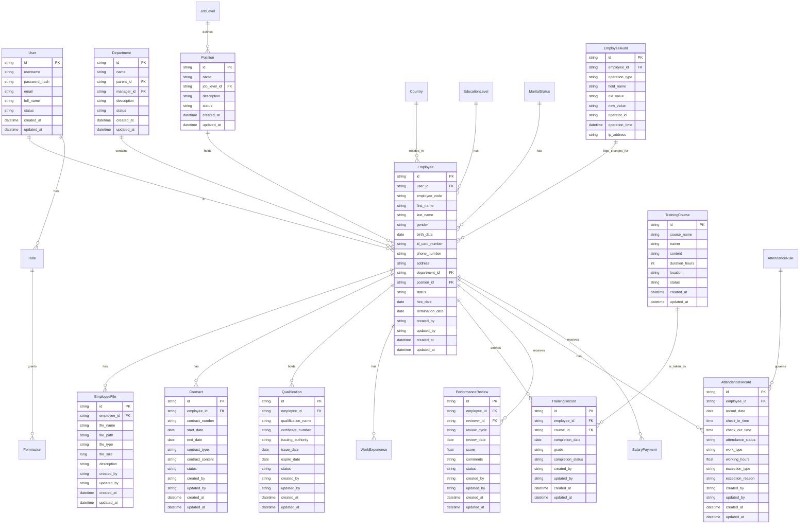

# 人事管理系统数据库设计报告

## 1. 概述

本数据库设计报告基于人事子系统(HR-Service)的需求分析，设计了满足GMP合规要求的人事管理系统数据库结构。设计遵循了微服务架构和领域驱动设计(DDD)理念，确保数据模型清晰、关系合理，并与认证子系统无缝集成。

## 2. 数据库设计原则

- **符合GMP要求**：所有关键操作都支持审计跟踪，确保数据可追溯性
- **数据完整性**：通过外键约束、唯一索引等机制保证数据的准确性和一致性
- **安全性**：敏感数据加密存储，严格控制数据访问权限
- **可扩展性**：模块化设计，支持系统未来功能扩展
- **性能优化**：合理设计索引，优化查询性能
- **与认证子系统兼容**：与认证授权系统保持一致的用户标识和权限控制

## 3. 总体ER图

## 4. 详细数据表设计

### 4.1 员工基本信息表 (hr_employees)

| 字段名 | 数据类型 | 约束 | 描述 |
| :--- | :--- | :--- | :--- |
| id | VARCHAR(36) | PRIMARY KEY | 员工ID (UUID) |
| user_id | VARCHAR(36) | FOREIGN KEY, UNIQUE | 关联认证系统用户ID |
| employee_code | VARCHAR(50) | UNIQUE, NOT NULL | 员工工号 |
| first_name | VARCHAR(100) | NOT NULL | 名 |
| last_name | VARCHAR(100) | NOT NULL | 姓 |
| gender | VARCHAR(10) | | 性别(M/F/OTHER) |
| birth_date | DATE | | 出生日期 |
| id_card_number | VARCHAR(20) | UNIQUE | 身份证号码 |
| phone_number | VARCHAR(20) | | 电话号码 |
| email | VARCHAR(100) | | 邮箱地址 |
| address | TEXT | | 地址 |
| department_id | VARCHAR(36) | FOREIGN KEY | 部门ID |
| position_id | VARCHAR(36) | FOREIGN KEY | 职位ID |
| country_id | VARCHAR(36) | FOREIGN KEY | 国家/地区ID |
| education_level_id | VARCHAR(36) | FOREIGN KEY | 教育程度ID |
| marital_status_id | VARCHAR(36) | FOREIGN KEY | 婚姻状况ID |
| status | VARCHAR(20) | NOT NULL | 员工状态(ACTIVE/INACTIVE/PENDING/TERMINATED) |
| hire_date | DATE | | 入职日期 |
| termination_date | DATE | | 离职日期 |
| created_by | VARCHAR(36) | NOT NULL | 创建人ID |
| updated_by | VARCHAR(36) | | 更新人ID |
| created_at | TIMESTAMP | NOT NULL | 创建时间 |
| updated_at | TIMESTAMP | | 更新时间 |

### 4.2 部门表 (hr_departments)

| 字段名 | 数据类型 | 约束 | 描述 |
| :--- | :--- | :--- | :--- |
| id | VARCHAR(36) | PRIMARY KEY | 部门ID (UUID) |
| name | VARCHAR(100) | NOT NULL | 部门名称 |
| code | VARCHAR(50) | UNIQUE | 部门编码 |
| parent_id | VARCHAR(36) | FOREIGN KEY | 上级部门ID |
| manager_id | VARCHAR(36) | FOREIGN KEY | 部门经理ID |
| description | TEXT | | 部门描述 |
| status | VARCHAR(20) | NOT NULL | 状态(ACTIVE/INACTIVE) |
| created_at | TIMESTAMP | NOT NULL | 创建时间 |
| updated_at | TIMESTAMP | | 更新时间 |

### 4.3 职位表 (hr_positions)

| 字段名 | 数据类型 | 约束 | 描述 |
| :--- | :--- | :--- | :--- |
| id | VARCHAR(36) | PRIMARY KEY | 职位ID (UUID) |
| name | VARCHAR(100) | NOT NULL | 职位名称 |
| code | VARCHAR(50) | UNIQUE | 职位编码 |
| job_level_id | VARCHAR(36) | FOREIGN KEY | 职级ID |
| description | TEXT | | 职位描述 |
| responsibilities | TEXT | | 职责描述 |
| requirements | TEXT | | 任职要求 |
| status | VARCHAR(20) | NOT NULL | 状态(ACTIVE/INACTIVE) |
| created_at | TIMESTAMP | NOT NULL | 创建时间 |
| updated_at | TIMESTAMP | | 更新时间 |

### 4.4 员工档案表 (hr_employee_files)

| 字段名 | 数据类型 | 约束 | 描述 |
| :--- | :--- | :--- | :--- |
| id | VARCHAR(36) | PRIMARY KEY | 档案ID (UUID) |
| employee_id | VARCHAR(36) | FOREIGN KEY, NOT NULL | 员工ID |
| file_name | VARCHAR(255) | NOT NULL | 文件名 |
| file_path | VARCHAR(500) | NOT NULL | 文件路径 |
| file_type | VARCHAR(50) | | 文件类型 |
| file_size | BIGINT | | 文件大小(字节) |
| description | TEXT | | 文件描述 |
| created_by | VARCHAR(36) | NOT NULL | 创建人ID |
| updated_by | VARCHAR(36) | | 更新人ID |
| created_at | TIMESTAMP | NOT NULL | 创建时间 |
| updated_at | TIMESTAMP | | 更新时间 |

### 4.5 合同表 (hr_contracts)

| 字段名 | 数据类型 | 约束 | 描述 |
| :--- | :--- | :--- | :--- |
| id | VARCHAR(36) | PRIMARY KEY | 合同ID (UUID) |
| employee_id | VARCHAR(36) | FOREIGN KEY, NOT NULL | 员工ID |
| contract_number | VARCHAR(100) | UNIQUE, NOT NULL | 合同编号 |
| start_date | DATE | NOT NULL | 合同开始日期 |
| end_date | DATE | | 合同结束日期 |
| contract_type | VARCHAR(50) | NOT NULL | 合同类型 |
| contract_content | TEXT | | 合同内容 |
| status | VARCHAR(20) | NOT NULL | 状态(ACTIVE/EXPIRED/TERMINATED) |
| created_by | VARCHAR(36) | NOT NULL | 创建人ID |
| updated_by | VARCHAR(36) | | 更新人ID |
| created_at | TIMESTAMP | NOT NULL | 创建时间 |
| updated_at | TIMESTAMP | | 更新时间 |

### 4.6 资质证书表 (hr_qualifications)

| 字段名 | 数据类型 | 约束 | 描述 |
| :--- | :--- | :--- | :--- |
| id | VARCHAR(36) | PRIMARY KEY | 资质证书ID (UUID) |
| employee_id | VARCHAR(36) | FOREIGN KEY, NOT NULL | 员工ID |
| qualification_name | VARCHAR(200) | NOT NULL | 资质证书名称 |
| certificate_number | VARCHAR(100) | | 证书编号 |
| issuing_authority | VARCHAR(200) | | 发证机构 |
| issue_date | DATE | | 发证日期 |
| expire_date | DATE | | 过期日期 |
| status | VARCHAR(20) | NOT NULL | 状态(VALID/EXPIRED/PENDING) |
| created_by | VARCHAR(36) | NOT NULL | 创建人ID |
| updated_by | VARCHAR(36) | | 更新人ID |
| created_at | TIMESTAMP | NOT NULL | 创建时间 |
| updated_at | TIMESTAMP | | 更新时间 |

### 4.7 考勤记录表 (hr_attendance_records)

| 字段名 | 数据类型 | 约束 | 描述 |
| :--- | :--- | :--- | :--- |
| id | VARCHAR(36) | PRIMARY KEY | 考勤记录ID (UUID) |
| employee_id | VARCHAR(36) | FOREIGN KEY, NOT NULL | 员工ID |
| record_date | DATE | NOT NULL | 记录日期 |
| check_in_time | TIME | | 签到时间 |
| check_out_time | TIME | | 签退时间 |
| attendance_status | VARCHAR(20) | NOT NULL | 考勤状态(PRESENT/ABSENT/LATE/EARLY_LEAVE/OVERTIME) |
| work_type | VARCHAR(20) | | 工作类型(REGULAR/HOLIDAY/SICK/ANNUAL_LEAVE) |
| working_hours | DECIMAL(5,2) | | 工作时长 |
| exception_type | VARCHAR(50) | | 异常类型 |
| exception_reason | TEXT | | 异常原因 |
| created_by | VARCHAR(36) | NOT NULL | 创建人ID |
| updated_by | VARCHAR(36) | | 更新人ID |
| created_at | TIMESTAMP | NOT NULL | 创建时间 |
| updated_at | TIMESTAMP | | 更新时间 |

### 4.8 培训课程表 (hr_training_courses)

| 字段名 | 数据类型 | 约束 | 描述 |
| :--- | :--- | :--- | :--- |
| id | VARCHAR(36) | PRIMARY KEY | 培训课程ID (UUID) |
| course_name | VARCHAR(200) | NOT NULL | 课程名称 |
| code | VARCHAR(50) | UNIQUE | 课程编码 |
| trainer | VARCHAR(100) | | 培训师 |
| content | TEXT | | 培训内容 |
| duration_hours | INT | | 培训时长(小时) |
| location | VARCHAR(200) | | 培训地点 |
| status | VARCHAR(20) | NOT NULL | 状态(PLANNED/IN_PROGRESS/COMPLETED) |
| created_at | TIMESTAMP | NOT NULL | 创建时间 |
| updated_at | TIMESTAMP | | 更新时间 |

### 4.9 培训记录表 (hr_training_records)

| 字段名 | 数据类型 | 约束 | 描述 |
| :--- | :--- | :--- | :--- |
| id | VARCHAR(36) | PRIMARY KEY | 培训记录ID (UUID) |
| employee_id | VARCHAR(36) | FOREIGN KEY, NOT NULL | 员工ID |
| course_id | VARCHAR(36) | FOREIGN KEY, NOT NULL | 课程ID |
| completion_date | DATE | | 完成日期 |
| grade | VARCHAR(20) | | 成绩/评级 |
| completion_status | VARCHAR(20) | NOT NULL | 完成状态(PENDING/IN_PROGRESS/COMPLETED) |
| created_by | VARCHAR(36) | NOT NULL | 创建人ID |
| updated_by | VARCHAR(36) | | 更新人ID |
| created_at | TIMESTAMP | NOT NULL | 创建时间 |
| updated_at | TIMESTAMP | | 更新时间 |

### 4.10 绩效评估表 (hr_performance_reviews)

| 字段名 | 数据类型 | 约束 | 描述 |
| :--- | :--- | :--- | :--- |
| id | VARCHAR(36) | PRIMARY KEY | 绩效评估ID (UUID) |
| employee_id | VARCHAR(36) | FOREIGN KEY, NOT NULL | 员工ID |
| reviewer_id | VARCHAR(36) | FOREIGN KEY | 评估人ID |
| review_cycle | VARCHAR(50) | NOT NULL | 评估周期 |
| review_date | DATE | NOT NULL | 评估日期 |
| score | DECIMAL(5,2) | | 评分 |
| comments | TEXT | | 评语 |
| status | VARCHAR(20) | NOT NULL | 状态(PENDING/COMPLETED) |
| created_by | VARCHAR(36) | NOT NULL | 创建人ID |
| updated_by | VARCHAR(36) | | 更新人ID |
| created_at | TIMESTAMP | NOT NULL | 创建时间 |
| updated_at | TIMESTAMP | | 更新时间 |

### 4.11 员工审计日志表 (hr_employee_audits)

| 字段名 | 数据类型 | 约束 | 描述 |
| :--- | :--- | :--- | :--- |
| id | VARCHAR(36) | PRIMARY KEY | 审计日志ID (UUID) |
| employee_id | VARCHAR(36) | FOREIGN KEY | 员工ID |
| operation_type | VARCHAR(50) | NOT NULL | 操作类型(CREATE/UPDATE/DELETE/LOGIN/LOGOUT) |
| field_name | VARCHAR(100) | | 修改字段名 |
| old_value | TEXT | | 旧值 |
| new_value | TEXT | | 新值 |
| operator_id | VARCHAR(36) | NOT NULL | 操作人ID |
| operation_time | TIMESTAMP | NOT NULL | 操作时间 |
| ip_address | VARCHAR(50) | | 操作IP地址 |

## 5. 数据集成与安全设计

### 5.1 与认证子系统集成

- 人事系统中的员工(Employee)与认证系统中的用户(User)通过user_id字段关联
- 所有用户操作都通过认证系统进行身份验证和授权
- 使用JWT令牌在系统间安全传递用户身份信息

### 5.2 安全设计

- **数据访问控制**：基于角色的访问控制(RBAC)，与认证子系统保持一致
- **数据加密**：敏感信息如身份证号、联系方式等加密存储
- **审计跟踪**：所有关键操作都记录在审计日志中
- **数据隔离**：支持多租户数据隔离

### 5.3 性能优化

- **索引优化**：在常用查询字段上建立索引
- **缓存机制**：使用Redis缓存频繁访问的数据
- **读写分离**：考虑使用数据库读写分离提高性能

## 6. 数据库管理与维护

### 6.1 备份策略
- 每日全量备份
- 每小时增量备份
- 每周异地备份

### 6.2 数据归档
- 离职员工数据定期归档
- 历史数据定期清理

### 6.3 监控与告警
- 数据库性能监控
- 存储空间监控
- 异常访问告警

## 7. 总结

本数据库设计充分考虑了GMP系统的合规要求，设计了完整的人事管理数据模型，支持员工管理、考勤管理、培训管理、绩效管理等核心功能。数据库结构清晰，关系合理，并与认证子系统无缝集成，确保了系统的安全性、可靠性和可扩展性。