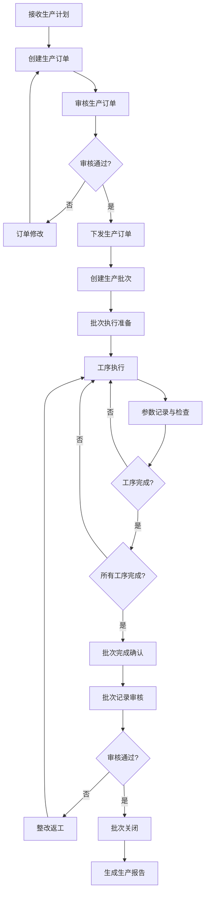
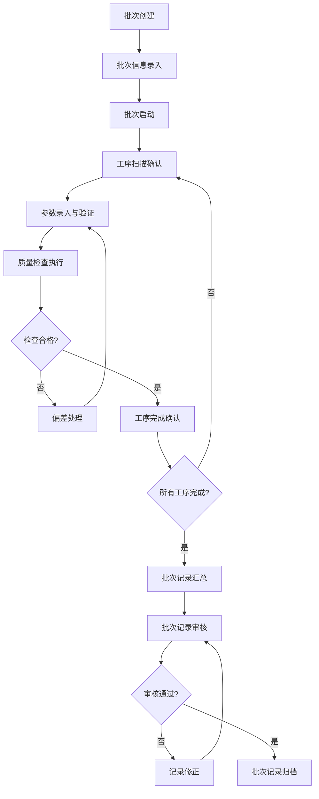
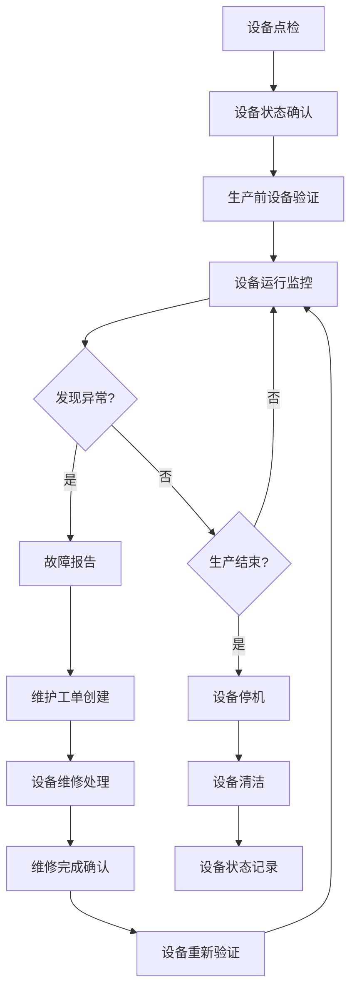
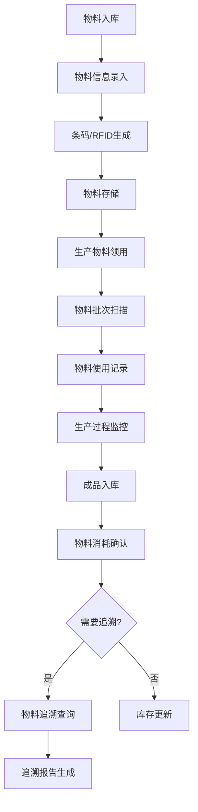
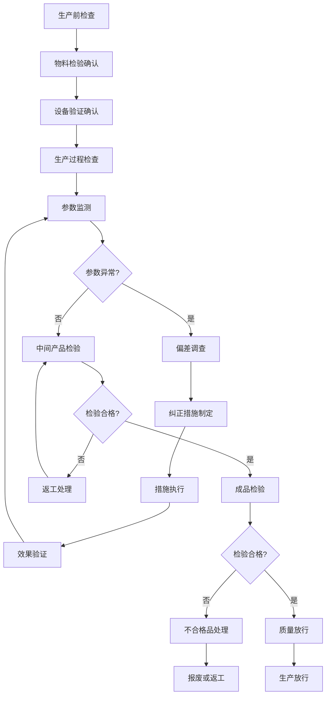
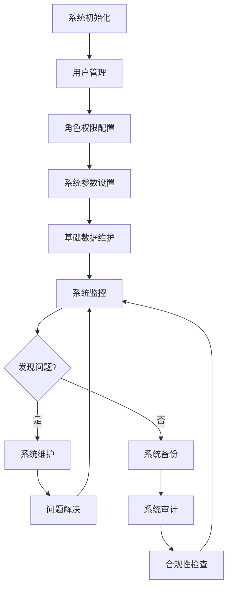

# MES子系统（生产执行系统）业务流程描述

## 文档信息
- **版本号**: v1.0.0-draft
- **创建日期**: 2024年
- **审核状态**: 待审核
- **保密级别**: 内部使用

## 目录
- [文档信息](#文档信息)
- [概述](#概述)
  - [文档目的](#文档目的)
  - [术语定义](#术语定义)
- [业务流程图](#业务流程图)
  - [生产订单执行流程](#生产订单执行流程)
  - [批次记录管理流程](#批次记录管理流程)
  - [设备状态监控流程](#设备状态监控流程)
  - [物料追溯管理流程](#物料追溯管理流程)
  - [质量控制流程](#质量控制流程)
  - [系统管理流程](#系统管理流程)
- [流程详细描述](#流程详细描述)
  - [生产订单执行流程](#生产订单执行流程-1)
  - [批次记录管理流程](#批次记录管理流程-1)
  - [设备状态监控流程](#设备状态监控流程-1)
  - [物料追溯管理流程](#物料追溯管理流程-1)
  - [质量控制流程](#质量控制流程-1)
  - [生产报告生成流程](#生产报告生成流程)
  - [系统配置流程](#系统配置流程)
  - [审计追踪流程](#审计追踪流程)
- [流程规则和约束](#流程规则和约束)
  - [生产订单规则](#生产订单规则)
  - [批次管理规则](#批次管理规则)
  - [设备管理规则](#设备管理规则)
  - [物料管理规则](#物料管理规则)
  - [质量控制规则](#质量控制规则)
  - [数据安全规则](#数据安全规则)
- [相关系统集成](#相关系统集成)
- [附录](#附录)
  - [术语定义](#术语定义-1)
  - [参考文档](#参考文档)
  - [联系方式](#联系方式)

## 概述

### 文档目的
本文档详细描述了MES子系统中的核心业务流程，包括从生产订单下发到最终产品交付的完整生产生命周期，以及设备管理、物料追溯和质量控制等关键业务流程。通过标准的流程定义，确保所有生产操作符合GMP要求，保证产品质量的一致性、生产过程的可追溯性和数据的完整性。

### 术语定义
- **MES**: 生产执行系统(Manufacturing Execution System)，用于管理药品生产的全生命周期
- **GMP**: 药品生产质量管理规范(Good Manufacturing Practice)，确保药品质量的一系列标准和规范
- **批次**: 指在规定条件下，制造或加工的一定数量的产品
- **工序**: 生产过程中一个独立的操作步骤
- **追溯性**: 能够追踪产品、物料或过程的历史、应用情况或位置的能力
- **审计追踪**: 记录系统中所有操作的过程，用于合规性和安全管理
- **偏差**: 与预期标准或规定程序的任何偏离
- **工单**: 生产任务的基本单位，包含具体的生产要求和参数
- **验证**: 证明某一系统、流程或设备能够持续产生符合预期结果的过程

## 业务流程图

### 生产订单执行流程

### 批次记录管理流程

### 设备状态监控流程

### 物料追溯管理流程

### 质量控制流程

### 系统管理流程

## 流程详细描述

### 生产订单执行流程

#### 1. 流程目标
确保生产订单从创建到执行的全过程受控，符合GMP要求，并实现生产任务的有效管理和跟踪。

#### 2. 流程步骤
1. **接收生产计划**: 生产计划员从ERP系统接收生产计划，包含产品、数量、交货日期等信息。
2. **创建生产订单**: 生产计划员在MES系统中创建生产订单，录入详细信息，包括产品代码、计划数量、计划开始/结束日期、生产线等。
3. **审核生产订单**: 生产主管对生产订单进行审核，确认资源可用性、生产可行性等。
4. **订单修改**: 如审核不通过，返回修改生产订单。
5. **下发生产订单**: 审核通过后，生产订单正式下发到生产车间。
6. **创建生产批次**: 生产主管根据生产订单创建生产批次，分配批次号和操作员。
7. **批次执行准备**: 操作员进行生产前准备，包括设备检查、物料准备等。
8. **工序执行**: 操作员按照工序顺序执行生产操作。
9. **参数记录与检查**: 记录生产过程参数，进行在线质量检查。
10. **工序完成确认**: 每道工序完成后进行确认。
11. **批次完成确认**: 所有工序完成后，进行批次完成确认。
12. **批次记录审核**: 质量控制员审核完整的批次记录。
13. **整改返工**: 如审核不通过，返回进行整改或返工。
14. **批次关闭**: 审核通过后，关闭生产批次。
15. **生成生产报告**: 系统自动生成生产报告，包含产量、质量、效率等信息。

#### 3. 角色与职责
- **生产计划员**: 创建生产订单，跟踪生产进度
- **生产主管**: 审核和下发生产订单，创建生产批次
- **操作员**: 执行生产工序，记录生产参数
- **质量控制员**: 进行质量检查，审核批次记录

#### 4. 关键规则
- 生产订单必须经过审核才能下发
- 生产参数必须在规定范围内
- 批次记录必须完整且可追溯

### 批次记录管理流程

#### 1. 流程目标
确保每个生产批次都有完整、准确的记录，符合GMP要求，能够追溯生产全过程。

#### 2. 流程步骤
1. **批次创建**: 基于生产订单创建唯一的生产批次。
2. **批次信息录入**: 录入批次基本信息，包括产品、规格、数量、生产日期等。
3. **批次启动**: 生产主管启动生产批次，系统生成电子批次记录。
4. **工序扫描确认**: 操作员扫描工序条码，系统显示该工序的操作指导。
5. **参数录入与验证**: 录入关键生产参数，系统自动验证是否在允许范围内。
6. **质量检查执行**: 执行在线质量检查，记录检查结果。
7. **偏差处理**: 如发现偏差，启动偏差处理流程。
8. **工序完成确认**: 工序完成后，操作员确认并签名。
9. **批次记录汇总**: 所有工序完成后，系统自动汇总完整的批次记录。
10. **批次记录审核**: 质量控制员审核批次记录的完整性和准确性。
11. **记录修正**: 如审核发现问题，进行记录修正（需保留审计追踪）。
12. **批次记录归档**: 审核通过后，批次记录正式归档，确保不可篡改。

#### 3. 角色与职责
- **生产主管**: 创建和启动生产批次
- **操作员**: 执行工序操作，录入生产参数
- **质量控制员**: 执行质量检查，审核批次记录

#### 4. 关键规则
- 批次记录必须实时、准确、完整
- 参数录入必须真实反映生产过程
- 记录修改必须有审计追踪
- 批次记录保存期限至少5年

### 设备状态监控流程

#### 1. 流程目标
确保生产设备的正常运行，及时发现和处理设备故障，保证生产的连续性和产品质量。

#### 2. 流程步骤
1. **设备点检**: 操作员或设备维护员按照检查表进行日常点检。
2. **设备状态确认**: 确认设备状态是否正常，记录点检结果。
3. **生产前设备验证**: 生产前进行设备的功能验证和清洁验证。
4. **设备运行监控**: 实时监控设备的运行状态和关键参数。
5. **故障报告**: 如发现设备异常，立即提交故障报告。
6. **维护工单创建**: 系统自动或手动创建设备维护工单。
7. **设备维修处理**: 设备维护员进行故障排除和维修。
8. **维修完成确认**: 维修完成后，记录维修内容和更换的部件。
9. **设备重新验证**: 维修后对设备进行重新验证，确保满足生产要求。
10. **设备停机**: 生产结束后，执行设备停机程序。
11. **设备清洁**: 按照清洁规程对设备进行清洁。
12. **设备状态记录**: 更新设备状态，记录完整的设备使用历史。

#### 3. 角色与职责
- **操作员**: 进行日常点检，监控设备运行，报告故障
- **设备维护员**: 执行设备维护和维修，记录维护历史
- **生产主管**: 监督设备管理流程的执行

#### 4. 关键规则
- 设备必须定期进行维护和校准
- 设备故障必须及时报告和处理
- 设备状态变更必须记录
- 设备必须经验证合格才能用于生产

### 物料追溯管理流程

#### 1. 流程目标
实现物料从入库到成品的全流程追溯，确保产品质量的可追溯性，满足GMP要求。

#### 2. 流程步骤
1. **物料入库**: 物料到达仓库后，进行入库验收。
2. **物料信息录入**: 在系统中录入物料的基本信息，包括物料代码、名称、规格、批次号、供应商、有效期等。
3. **条码/RFID生成**: 为每个物料批次生成唯一的条码或RFID标签。
4. **物料存储**: 按照规定条件存储物料。
5. **生产物料领用**: 生产车间根据生产计划领用物料。
6. **物料批次扫描**: 领用物料时，扫描物料条码，确认物料信息。
7. **物料使用记录**: 生产过程中，记录物料的使用情况，包括使用数量、位置等。
8. **生产过程监控**: 监控物料在生产过程中的使用，确保物料平衡。
9. **成品入库**: 生产完成后，成品入库。
10. **物料消耗确认**: 确认物料的实际消耗数量与理论消耗的差异。
11. **物料追溯查询**: 如需要，进行物料正向或反向追溯查询。
12. **追溯报告生成**: 生成物料追溯报告，记录物料的完整流转路径。
13. **库存更新**: 根据物料使用情况，更新库存信息。

#### 3. 角色与职责
- **仓库管理员**: 物料入库，物料信息录入，库存管理
- **操作员**: 物料领用和使用记录
- **质量控制员**: 物料追溯查询
- **生产主管**: 监督物料使用过程

#### 4. 关键规则
- 所有物料必须有唯一标识
- 物料流转必须实时记录
- 物料使用必须与生产批次关联
- 必须保持物料平衡

### 质量控制流程

#### 1. 流程目标
确保产品质量符合标准要求，及时发现和处理质量问题，防止不合格品流入市场。

#### 2. 流程步骤
1. **生产前检查**: 生产前进行全面检查，确保满足生产条件。
2. **物料检验确认**: 确认所用物料已经检验合格。
3. **设备验证确认**: 确认设备已经验证合格。
4. **生产过程检查**: 在生产过程中进行定期或连续的质量检查。
5. **参数监测**: 监测关键工艺参数，确保在规定范围内。
6. **偏差调查**: 如发现参数异常，启动偏差调查。
7. **纠正措施制定**: 制定纠正和预防措施。
8. **措施执行**: 执行纠正和预防措施。
9. **效果验证**: 验证措施的有效性。
10. **中间产品检验**: 对中间产品进行检验。
11. **返工处理**: 如中间产品不合格，进行返工处理。
12. **成品检验**: 对成品进行全面检验。
13. **不合格品处理**: 对不合格成品进行处理。
14. **报废或返工**: 决定不合格品是报废还是返工。
15. **质量放行**: 质量控制员对合格产品进行质量放行。
16. **生产放行**: 生产主管对产品进行生产放行。

#### 3. 角色与职责
- **质量控制员**: 执行质量检查，进行偏差调查，负责质量放行
- **操作员**: 进行在线检查，报告质量问题
- **质量经理**: 审核重大质量问题的处理方案
- **生产主管**: 进行生产放行

#### 4. 关键规则
- 所有检验必须有记录
- 不合格品必须有明确标识和处理记录
- 偏差必须进行调查和处理
- 产品必须经过质量放行才能入库或发货

### 生产报告生成流程

#### 1. 流程目标
生成准确、全面的生产报告，为管理层提供决策依据。

#### 2. 流程步骤
1. **数据收集**: 系统自动收集生产数据，包括产量、质量、效率等。
2. **报告生成**: 数据分析师或生产计划员选择报告类型和时间范围，系统生成生产报告。
3. **数据审核**: 审核报告中的数据准确性。
4. **报告分发**: 将报告分发给相关管理人员。
5. **数据分析**: 管理层分析报告，发现问题和改进机会。
6. **改进措施制定**: 根据分析结果，制定改进措施。

#### 3. 角色与职责
- **数据分析师**: 生成和分析生产报告
- **生产计划员**: 跟踪生产进度和计划执行情况
- **生产主管**: 审核报告，制定改进措施

#### 4. 关键规则
- 报告数据必须准确可靠
- 报告必须定期生成
- 报告必须包含关键绩效指标

### 系统配置流程

#### 1. 流程目标
确保系统配置正确，满足业务需求，并保持配置的一致性和完整性。

#### 2. 流程步骤
1. **配置需求收集**: 收集业务部门对系统配置的需求。
2. **配置分析**: 分析配置需求的可行性和影响。
3. **配置实施**: 系统管理员在系统中进行配置。
4. **配置测试**: 测试配置是否满足需求，是否有副作用。
5. **配置发布**: 配置通过测试后，正式发布。
6. **配置文档**: 更新系统配置文档。
7. **配置监控**: 监控配置的使用情况和效果。

#### 3. 角色与职责
- **系统管理员**: 执行系统配置
- **业务部门**: 提出配置需求，测试配置效果
- **IT部门**: 审核配置变更

#### 4. 关键规则
- 配置变更必须经过审批
- 配置变更必须有记录
- 配置必须定期审查

### 审计追踪流程

#### 1. 流程目标
确保系统操作的可追溯性，满足GMP合规要求。

#### 2. 流程步骤
1. **操作记录**: 系统自动记录所有用户操作，包括登录、数据修改、审批等。
2. **日志存储**: 操作日志安全存储，确保不可篡改。
3. **日志查询**: 审计人员可以根据需要查询操作日志。
4. **日志分析**: 分析日志，发现异常操作或潜在问题。
5. **合规性检查**: 根据日志进行GMP合规性检查。
6. **问题处理**: 对发现的问题进行调查和处理。

#### 3. 角色与职责
- **系统**: 自动记录操作日志
- **审计人员**: 查询和分析日志，进行合规性检查
- **系统管理员**: 维护日志系统

#### 4. 关键规则
- 日志必须包含足够的详细信息
- 日志必须安全存储，不可篡改
- 日志必须保存至少5年
- 日志访问必须受控制

## 流程规则和约束

### 生产订单规则
1. 生产订单必须经过审核才能下发
2. 生产订单变更必须有审批记录
3. 生产订单必须关联产品工艺路线
4. 生产订单必须指定所需资源（设备、人员等）

### 批次管理规则
1. 每个生产批次必须有唯一标识符
2. 批次记录必须实时、准确、完整
3. 批次状态变更必须有记录
4. 批次记录必须保存至少5年
5. 批次记录修改必须有审计追踪

### 设备管理规则
1. 设备必须定期进行维护和校准
2. 设备状态必须实时监控
3. 设备故障必须及时报告和处理
4. 设备必须经验证合格才能用于生产
5. 设备操作必须记录在案

### 物料管理规则
1. 物料必须有唯一标识
2. 物料流转必须实时记录
3. 物料必须满足质量标准才能使用
4. 物料有效期必须严格控制
5. 物料必须保持平衡

### 质量控制规则
1. 所有质量检查必须有记录
2. 不合格品必须有明确标识和处理记录
3. 偏差必须进行调查和处理
4. 产品必须经过质量放行才能入库或发货
5. 质量记录必须保存至少5年

### 数据安全规则
1. 用户必须通过身份验证才能访问系统
2. 用户只能访问其权限范围内的数据
3. 敏感操作必须有额外的授权
4. 数据修改必须有审计追踪
5. 数据必须定期备份

## 相关系统集成

### 1. 与ERP系统集成
- **集成点**: 生产计划、物料需求、库存信息
- **数据流向**: ERP → MES（生产计划、物料需求），MES → ERP（生产完成、物料消耗）
- **集成方式**: API接口或中间件

### 2. 与QMS系统集成
- **集成点**: 质量检验、偏差管理、CAPA管理
- **数据流向**: MES → QMS（质量事件、偏差报告），QMS → MES（质量决策、CAPA措施）
- **集成方式**: API接口

### 3. 与设备管理系统集成
- **集成点**: 设备状态、维护记录、校准计划
- **数据流向**: 设备管理系统 → MES（设备状态、维护计划），MES → 设备管理系统（设备使用记录、故障报告）
- **集成方式**: OPC UA或MQTT协议

### 4. 与仓库管理系统集成
- **集成点**: 物料收发、库存查询、物料批次信息
- **数据流向**: 仓库管理系统 → MES（物料信息、库存状态），MES → 仓库管理系统（物料需求、消耗确认）
- **集成方式**: API接口

### 5. 与LIMS系统集成
- **集成点**: 检验结果、质量标准
- **数据流向**: LIMS → MES（检验结果、质量标准），MES → LIMS（检验请求、样品信息）
- **集成方式**: API接口

## 附录

### 术语定义
- **MES**: 生产执行系统(Manufacturing Execution System)，用于管理药品生产的全生命周期
- **GMP**: 药品生产质量管理规范(Good Manufacturing Practice)，确保药品质量的一系列标准和规范
- **批次**: 指在规定条件下，制造或加工的一定数量的产品
- **工序**: 生产过程中一个独立的操作步骤
- **追溯性**: 能够追踪产品、物料或过程的历史、应用情况或位置的能力
- **审计追踪**: 记录系统中所有操作的过程，用于合规性和安全管理
- **偏差**: 与预期标准或规定程序的任何偏离
- **工单**: 生产任务的基本单位，包含具体的生产要求和参数
- **验证**: 证明某一系统、流程或设备能够持续产生符合预期结果的过程
- **质量放行**: 确认产品符合质量标准，可以进入下一阶段或放行的过程
- **工艺参数**: 生产过程中需要控制的关键变量，如温度、压力、时间等
- **OEE**: 设备综合效率(Overall Equipment Effectiveness)，衡量设备利用效率的指标
- **物料平衡**: 生产过程中投入物料与产出物料之间的数量平衡

### 参考文档
- 《药品生产质量管理规范》(GMP)
- 《数据安全管理规范》
- 《MES系统功能规范》
- [MES总体需求文档](总体需求.md)
- [MES架构设计文档](架构设计.md)
- [MES详细需求文档](详细需求.md)

### 联系方式
- **系统管理员**: [系统管理员姓名] - [邮箱]
- **生产管理部门**: [生产主管姓名] - [邮箱]
- **质量保证部门**: [质量主管姓名] - [邮箱]
- **IT支持**: [IT支持联系人] - [邮箱]