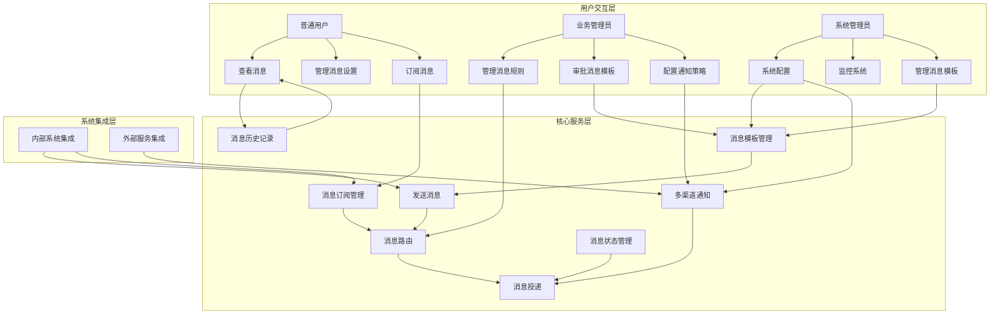

# 消息服务子系统 - 用例与用户故事文档

## 1. 简介

### 1.1 文档目的
本文档旨在通过用例模型和用户故事的形式，全面描述GMP系统中消息服务子系统的用户交互场景和功能需求。通过这些描述，开发团队能够更好地理解用户需求和业务流程，确保系统实现符合用户期望和业务目标。

### 1.2 术语定义
| 术语 | 解释 |
| --- | --- |
| GMP | 良好制造规范(Good Manufacturing Practice)，药品生产质量管理的基本准则 |
| 消息服务 | 负责系统内外部通信、通知、预警等消息的发送、接收、存储和管理的核心子系统 |
| 消息队列 | 用于存储和传递消息的缓冲区，实现异步通信和服务解耦 |
| 消息模板 | 预定义的消息格式，可包含变量，用于快速生成标准化消息 |
| WebSocket | 提供全双工通信通道的网络协议，用于实时消息推送 |
| 订阅者 | 注册接收特定类型消息的用户或系统 |
| 通知渠道 | 发送消息的媒介，如站内信、邮件、短信等 |
| 消息优先级 | 指示消息重要程度和处理顺序的属性 |
| 死信队列 | 存储处理失败且无法重试的消息的特殊队列 |

## 2. 参与者识别

| 参与者 | 描述 | 主要职责 |
| --- | --- | --- |
| 普通用户 | GMP系统的一般操作人员和员工 | 查看消息、管理个人消息设置、接收通知 |
| 系统管理员 | 负责系统配置和维护的IT人员 | 配置消息参数、管理消息模板、监控系统状态 |
| 业务管理员 | 负责业务流程和规则的管理人员 | 管理消息规则、审批模板、配置通知策略 |
| 高级管理层 | 公司的各级管理人员 | 查看统计报表、接收关键通知、监控业务指标 |
| 系统集成方 | 与消息服务集成的其他子系统 | 发送系统事件、接收系统通知、处理集成消息 |
| 外部服务 | 提供外部通知服务的第三方系统 | 邮件发送、短信推送、移动推送等 |

## 3. 用例图

### 3.1 整体用例图

## 4. 详细用例描述

### 4.1 用例：发送文本消息

**用例ID**: UC-MSG-001  
**名称**: 发送文本消息  
**参与者**: 系统集成方、业务管理员、普通用户  
**描述**: 允许用户或系统向指定接收者发送文本格式的消息。  
**前置条件**:  
- 发送者已登录系统  
- 发送者具有发送消息的权限  
- 接收者在系统中存在  
**后置条件**:  
- 消息被成功创建并发送给接收者  
- 发送历史被记录  
- 接收者接收到消息通知  
**流程**:  
1. 发送者选择发送消息功能  
2. 系统展示消息发送界面  
3. 发送者输入消息内容、选择接收者、设置消息类型和优先级  
4. 发送者点击发送按钮  
5. 系统验证消息内容和权限  
6. 系统创建消息记录  
7. 系统将消息发送给指定接收者  
8. 系统返回发送结果  
**异常流程**:  
- 如果接收者不存在，系统返回错误提示  
- 如果消息内容超长，系统提示并要求修改  
- 如果发送权限不足，系统拒绝请求并提示  
**扩展点**:  
- 支持附件上传  
- 支持选择消息模板  
- 支持定时发送设置

### 4.2 用例：系统事件通知

**用例ID**: UC-MSG-002  
**名称**: 系统事件通知  
**参与者**: 系统集成方、普通用户  
**描述**: 当系统中发生特定事件时，自动触发并向相关用户发送通知。  
**前置条件**:  
- 已配置事件通知规则  
- 相关用户已订阅该类型通知  
- 触发事件的系统集成正常  
**后置条件**:  
- 通知消息被自动创建  
- 符合条件的用户接收到通知  
- 事件和通知历史被记录  
**流程**:  
1. 系统中发生触发事件  
2. 集成系统捕获事件并发送到消息服务  
3. 消息服务根据事件类型匹配通知规则  
4. 消息服务确定目标接收者列表  
5. 消息服务生成通知内容  
6. 消息服务将通知发送给目标接收者  
7. 消息服务记录事件和通知历史  
**异常流程**:  
- 如果通知规则不存在，系统记录警告日志  
- 如果消息生成失败，系统尝试重试或记录错误  
- 如果目标用户不存在，系统跳过该用户并记录  
**扩展点**:  
- 支持根据事件严重程度调整通知优先级  
- 支持通知内容的模板化生成  
- 支持通知升级机制

### 4.3 用例：预警消息管理

**用例ID**: UC-MSG-003  
**名称**: 预警消息管理  
**参与者**: 业务管理员、系统集成方  
**描述**: 配置和管理预警消息的生成规则、级别和处理流程。  
**前置条件**:  
- 业务管理员已登录系统  
- 业务管理员具有预警管理权限  
- 预警数据源已配置并正常工作  
**后置条件**:  
- 预警规则被成功保存  
- 系统按照规则监控数据并生成预警  
- 预警消息被发送给相关责任人  
**流程**:  
1. 业务管理员进入预警管理界面  
2. 业务管理员选择创建或编辑预警规则  
3. 系统展示预警规则配置界面  
4. 业务管理员配置预警条件、级别、通知方式和责任人  
5. 业务管理员保存配置  
6. 系统验证规则有效性并激活规则  
7. 系统开始按照规则监控数据  
8. 当触发条件满足时，系统生成预警并发送通知  
**异常流程**:  
- 如果规则配置无效，系统返回错误并提示修正  
- 如果责任人不存在，系统提示并要求重新指定  
- 如果数据源连接失败，系统记录错误并尝试重连  
**扩展点**:  
- 支持预警规则的导入导出  
- 支持预警规则的版本管理  
- 支持预警效果分析和规则优化建议

### 4.4 用例：消息订阅管理

**用例ID**: UC-MSG-004  
**名称**: 消息订阅管理  
**参与者**: 普通用户、业务管理员  
**描述**: 允许用户管理个人消息订阅设置，接收感兴趣的消息类型。  
**前置条件**:  
- 用户已登录系统  
- 系统中已定义可用的消息类型  
**后置条件**:  
- 订阅设置被成功保存  
- 用户只接收已订阅类型的消息  
- 订阅历史被记录  
**流程**:  
1. 用户进入消息订阅设置界面  
2. 系统展示可用的消息类型列表和当前订阅状态  
3. 用户选择要订阅或取消订阅的消息类型  
4. 用户可以设置订阅条件和通知方式  
5. 用户保存订阅设置  
6. 系统更新用户的订阅配置  
7. 系统根据新的订阅设置过滤消息发送  
**异常流程**:  
- 如果订阅设置无效，系统返回错误并提示修正  
- 如果用户无权限订阅某些类型，系统隐藏或禁用相关选项  
**扩展点**:  
- 支持基于关键词的高级过滤  
- 支持订阅优先级设置  
- 支持订阅模板的保存和应用

### 4.5 用例：多渠道消息发送

**用例ID**: UC-MSG-005  
**名称**: 多渠道消息发送  
**参与者**: 系统集成方、业务管理员  
**描述**: 通过多种通信渠道（如站内信、邮件、短信等）发送消息通知。  
**前置条件**:  
- 各通知渠道已配置并正常工作  
- 接收者的联系方式已在系统中正确维护  
- 消息内容符合各渠道的格式要求  
**后置条件**:  
- 消息通过指定渠道发送给接收者  
- 发送状态和结果被记录  
- 失败的发送被适当处理  
**流程**:  
1. 消息生成后，系统确定需要使用的通知渠道  
2. 系统根据渠道类型格式化消息内容  
3. 系统将格式化后的消息发送到各渠道  
4. 系统等待各渠道的发送结果  
5. 系统记录发送状态和结果  
6. 对于发送失败的渠道，系统根据配置执行重试或错误处理  
**异常流程**:  
- 如果渠道服务不可用，系统切换到备用渠道或记录错误  
- 如果接收者联系方式无效，系统记录错误并通知管理员  
- 如果消息格式不符合渠道要求，系统尝试转换或报错  
**扩展点**:  
- 支持根据消息重要性选择不同的渠道组合  
- 支持渠道的优先级设置  
- 支持渠道发送状态的实时监控和告警

### 4.6 用例：消息模板管理

**用例ID**: UC-MSG-006  
**名称**: 消息模板管理  
**参与者**: 系统管理员、业务管理员  
**描述**: 创建、编辑、审批和管理消息模板，用于标准化消息生成。  
**前置条件**:  
- 管理员已登录系统  
- 管理员具有模板管理权限  
**后置条件**:  
- 模板被成功创建或更新  
- 模板通过审批并可用于消息生成  
- 模板版本历史被记录  
**流程**:  
1. 管理员进入消息模板管理界面  
2. 管理员选择创建或编辑模板  
3. 系统展示模板编辑界面  
4. 管理员输入模板名称、内容，定义变量占位符  
5. 管理员保存模板  
6. 如果启用了审批流程，模板进入审批队列  
7. 审批人审核模板内容  
8. 审批通过后，模板状态变为可用  
9. 模板可被用于消息生成  
**异常流程**:  
- 如果模板内容无效，系统返回错误并提示修正  
- 如果审批被拒绝，系统通知创建者并提供修改建议  
- 如果变量定义不完整，系统提示并要求补充  
**扩展点**:  
- 支持模板的预览功能  
- 支持模板的导入导出  
- 支持模板使用情况统计

### 4.7 用例：消息历史查询与检索

**用例ID**: UC-MSG-007  
**名称**: 消息历史查询与检索  
**参与者**: 普通用户、业务管理员、系统管理员  
**描述**: 提供灵活的消息历史查询和检索功能，支持多条件过滤和高级搜索。  
**前置条件**:  
- 用户已登录系统  
- 用户具有查询相应消息的权限  
- 系统中存在消息历史记录  
**后置条件**:  
- 用户获取符合条件的消息列表  
- 搜索结果准确且响应及时  
**流程**:  
1. 用户进入消息历史查询界面  
2. 系统展示查询条件表单和历史记录列表  
3. 用户输入查询条件（如时间范围、发送者、类型等）  
4. 用户可以使用高级搜索功能（如全文搜索）  
5. 用户执行查询  
6. 系统根据条件检索消息历史  
7. 系统展示查询结果并支持分页浏览  
8. 用户可以对结果进行排序和进一步筛选  
**异常流程**:  
- 如果查询条件无效，系统返回错误提示  
- 如果查询结果过多，系统提示用户缩小范围  
- 如果无权限访问某些消息，系统过滤掉相关结果  
**扩展点**:  
- 支持查询条件的保存和复用  
- 支持查询结果的导出  
- 支持历史数据的可视化展示

### 4.8 用例：消息状态跟踪与管理

**用例ID**: UC-MSG-008  
**名称**: 消息状态跟踪与管理  
**参与者**: 业务管理员、系统管理员  
**描述**: 跟踪和管理消息的完整生命周期状态，包括发送、接收、阅读、处理等。  
**前置条件**:  
- 管理员已登录系统  
- 管理员具有状态管理权限  
- 系统中存在待跟踪的消息  
**后置条件**:  
- 消息状态被准确更新和记录  
- 异常状态得到适当处理  
- 状态变更历史被完整记录  
**流程**:  
1. 管理员进入消息状态管理界面  
2. 系统展示消息列表及其当前状态  
3. 管理员可以按状态筛选和监控消息  
4. 对于异常状态的消息，管理员可以手动干预  
5. 管理员可以更新消息状态或触发处理动作  
6. 系统记录状态变更和操作历史  
7. 系统根据配置执行相应的后续操作  
**异常流程**:  
- 如果状态更新失败，系统返回错误并记录  
- 如果操作权限不足，系统拒绝请求  
**扩展点**:  
- 支持状态变更的批量操作  
- 支持状态监控仪表板  
- 支持状态异常的自动告警

### 4.9 用例：消息数据分析与统计

**用例ID**: UC-MSG-009  
**名称**: 消息数据分析与统计  
**参与者**: 高级管理层、业务管理员  
**描述**: 对系统中的消息数据进行统计分析，生成报表和可视化图表。  
**前置条件**:  
- 用户已登录系统  
- 用户具有数据分析权限  
- 系统中存在可分析的消息数据  
**后置条件**:  
- 用户获取统计分析结果和报表  
- 分析结果准确且有业务价值  
- 报表可导出和分享  
**流程**:  
1. 用户进入消息数据分析界面  
2. 系统展示可用的统计维度和报表模板  
3. 用户选择分析维度、时间范围和过滤条件  
4. 用户可以选择生成自定义报表或使用预设模板  
5. 用户执行分析操作  
6. 系统处理数据并生成分析结果  
7. 系统以图表和表格形式展示分析结果  
8. 用户可以导出或分享分析结果  
**异常流程**:  
- 如果数据量过大导致分析超时，系统提示并建议优化条件  
- 如果分析维度无效，系统返回错误提示  
**扩展点**:  
- 支持数据异常模式检测  
- 支持趋势预测和模拟  
- 支持报表的自动定时生成和分发

### 4.10 用例：系统集成接口管理

**用例ID**: UC-MSG-010  
**名称**: 系统集成接口管理  
**参与者**: 系统管理员、系统集成方  
**描述**: 配置和管理与其他系统的集成接口，确保消息服务与外部系统的顺畅交互。  
**前置条件**:  
- 系统管理员已登录系统  
- 系统管理员具有集成管理权限  
- 集成系统的基础信息已提供  
**后置条件**:  
- 集成配置被成功保存和应用  
- 系统与外部系统能够正常交互  
- 集成状态和日志被记录  
**流程**:  
1. 系统管理员进入集成接口管理界面  
2. 系统展示当前集成配置和状态  
3. 管理员选择添加或编辑集成配置  
4. 系统展示集成配置表单  
5. 管理员输入接口地址、认证信息、数据格式等配置  
6. 管理员保存配置  
7. 系统验证配置并尝试连接  
8. 连接成功后，集成状态更新为可用  
9. 系统与外部系统开始正常交互  
**异常流程**:  
- 如果配置无效，系统返回错误并提示修正  
- 如果连接测试失败，系统记录错误详情并提供诊断信息  
- 如果认证信息过期或错误，系统提示并要求更新  
**扩展点**:  
- 支持集成接口的健康检查和监控  
- 支持集成日志的查询和分析  
- 支持接口版本管理和兼容性控制

## 5. 用户故事

### 5.1 普通用户相关用户故事

#### 5.1.1 接收重要通知
**作为**: 普通员工  
**希望**: 及时接收到与我相关的重要通知  
**以便**: 快速响应工作事项，不错过关键信息  
**详细说明**: 当有与我相关的任务分配、系统公告或工作提醒时，我希望能立即收到通知，并能根据通知的紧急程度采取相应行动。  
**验收标准**:  
- 重要通知能在产生后1分钟内推送到我的消息中心  
- 通知显示明确的优先级标识  
- 我可以一键查看通知详情  

#### 5.1.2 管理个人消息设置
**作为**: 系统用户  
**希望**: 自定义我的消息接收偏好和通知方式  
**以便**: 避免信息过载，只接收我关心的信息  
**详细说明**: 我希望能设置哪些类型的消息会通知我，以及通过什么方式（站内信、邮件、短信）通知我，这样我可以控制信息接收量，保持工作效率。  
**验收标准**:  
- 我可以订阅/取消订阅不同类型的消息  
- 我可以为不同类型的消息设置不同的通知渠道  
- 设置更改后立即生效  

#### 5.1.3 高效查看和处理消息
**作为**: 系统用户  
**希望**: 能够方便地查看、筛选和管理我的消息  
**以便**: 快速找到重要信息并及时处理  
**详细说明**: 我希望消息中心界面友好，可以方便地按类型、时间、状态等筛选消息，标记已读/未读，归档重要消息，这样可以提高我处理信息的效率。  
**验收标准**:  
- 消息中心提供多种筛选和排序选项  
- 支持批量操作（标记已读、删除等）  
- 支持消息搜索功能  

#### 5.1.4 查看消息历史记录
**作为**: 系统用户  
**希望**: 能够方便地查看历史消息记录  
**以便**: 回顾过去的工作安排和重要通知  
**详细说明**: 我希望能够通过时间范围、关键词等条件搜索历史消息，并能方便地回顾过去的通知内容，这样在需要的时候可以快速找到历史信息。  
**验收标准**:  
- 历史消息保留至少12个月  
- 提供按时间、内容等多维度搜索  
- 搜索结果准确且响应迅速  

#### 5.1.5 接收系统预警通知
**作为**: 生产操作人员  
**希望**: 当生产出现异常时，能立即收到预警通知  
**以便**: 及时响应和处理异常情况，减少损失  
**详细说明**: 当我负责的生产线或设备出现异常情况时，我希望能立即收到详细的预警信息，包括异常类型、位置和严重程度，这样我可以迅速采取应对措施。  
**验收标准**:  
- 异常发生后30秒内收到预警通知  
- 预警信息包含完整的异常详情  
- 提供快速响应的操作入口  

### 5.2 业务管理员相关用户故事

#### 5.2.1 配置消息通知规则
**作为**: 业务流程管理员  
**希望**: 能够灵活配置各种业务场景的消息通知规则  
**以便**: 确保关键业务事件能及时通知到相关人员  
**详细说明**: 我希望能设置当特定业务事件发生时（如审批通过、任务到期），系统自动发送通知给哪些人，通过什么方式，以及通知的优先级，这样可以确保信息传达的准确性和及时性。  
**验收标准**:  
- 支持基于事件类型、条件的规则配置  
- 支持灵活的接收者选择和优先级设置  
- 规则配置界面直观易用  

#### 5.2.2 管理消息模板
**作为**: 内容管理员  
**希望**: 创建和管理标准化的消息模板  
**以便**: 确保消息内容的一致性和专业性  
**详细说明**: 我希望能创建包含变量的消息模板，这些模板可以在不同场景中重复使用，只需替换变量内容，这样可以保证消息格式和内容的标准化，提高工作效率。  
**验收标准**:  
- 支持富文本编辑和变量定义  
- 提供模板预览功能  
- 支持模板版本管理  

#### 5.2.3 监控消息发送状态
**作为**: 业务监控人员  
**希望**: 能够实时监控消息的发送状态和成功率  
**以便**: 及时发现并解决发送问题  
**详细说明**: 我希望能看到消息的发送数量、成功率、失败原因等统计数据，以及实时的发送状态监控，这样可以快速发现问题并采取措施确保消息系统正常运行。  
**验收标准**:  
- 提供消息发送统计仪表板  
- 实时显示发送成功/失败状态  
- 提供失败消息的重试和处理机制  

#### 5.2.4 审批消息模板
**作为**: 合规审核员  
**希望**: 审核和批准重要的消息模板  
**以便**: 确保消息内容符合法规和公司政策要求  
**详细说明**: 对于用于合规通知、正式公告等重要场景的消息模板，我希望能够进行审核，确保其内容准确、合规，并且符合公司的沟通标准。  
**验收标准**:  
- 支持多级审批流程  
- 提供审批意见和修改建议功能  
- 记录完整的审批历史  

#### 5.2.5 分析消息数据
**作为**: 业务分析师  
**希望**: 分析消息发送和接收的数据  
**以便**: 优化通知策略和改进工作流程  
**详细说明**: 我希望能查看消息类型分布、发送趋势、阅读率等数据，并通过图表直观展示，这样可以了解消息系统的使用情况，发现需要优化的地方。  
**验收标准**:  
- 提供多维度的数据统计和分析  
- 支持数据可视化展示  
- 允许自定义报表和导出数据  

### 5.3 系统管理员相关用户故事

#### 5.3.1 系统配置和维护
**作为**: 系统管理员  
**希望**: 方便地配置和维护消息服务的各项参数  
**以便**: 确保系统稳定运行并满足业务需求  
**详细说明**: 我希望能够配置消息队列、连接池、缓存等系统参数，监控系统资源使用情况，进行日志分析和问题诊断，这样可以保证系统的稳定性和性能。  
**验收标准**:  
- 提供全面的系统配置界面  
- 支持参数的动态调整  
- 提供系统健康状态监控  

#### 5.3.2 管理通知渠道
**作为**: 系统管理员  
**希望**: 配置和管理各种消息通知渠道  
**以便**: 确保多渠道通知的可靠性和效率  
**详细说明**: 我希望能配置邮件服务器、短信网关、推送服务等外部渠道的连接参数，测试渠道连接状态，监控渠道使用情况，这样可以确保各种通知渠道的正常运行。  
**验收标准**:  
- 支持多种通知渠道的配置  
- 提供渠道连接测试功能  
- 监控渠道的可用性和性能  

#### 5.3.3 处理系统异常
**作为**: 系统运维人员  
**希望**: 及时发现并处理系统异常和故障  
**以便**: 最小化服务中断和数据丢失  
**详细说明**: 我希望能收到系统异常告警，查看详细的错误日志，执行故障诊断和恢复操作，这样可以快速解决问题，确保系统的高可用性。  
**验收标准**:  
- 支持多级别告警和通知机制  
- 提供详细的系统日志和错误信息  
- 支持常见故障的自动恢复  

#### 5.3.4 系统集成配置
**作为**: 系统集成工程师  
**希望**: 配置与其他系统的集成接口  
**以便**: 实现系统间的无缝数据交换和协作  
**详细说明**: 我希望能配置API接口、事件订阅、消息格式转换等集成参数，测试集成连接和数据交换，这样可以确保消息服务与其他系统的顺畅交互。  
**验收标准**:  
- 提供完整的集成配置界面  
- 支持多种集成协议和格式  
- 提供集成测试和调试工具  

#### 5.3.5 性能优化和扩展
**作为**: 系统架构师  
**希望**: 优化系统性能并支持业务扩展  
**以便**: 应对不断增长的消息量和用户需求  
**详细说明**: 我希望能分析系统性能瓶颈，调整资源分配，配置负载均衡和扩展策略，这样可以确保系统在高负载下仍能保持良好的性能和可靠性。  
**验收标准**:  
- 提供性能监控和分析工具  
- 支持系统的水平和垂直扩展  
- 具备负载均衡和故障转移能力  

### 5.4 高级管理层相关用户故事

#### 5.4.1 查看系统运行报表
**作为**: 高级管理员  
**希望**: 查看消息系统的运行状态和性能报表  
**以便**: 了解系统整体运行情况，做出决策  
**详细说明**: 我希望能通过仪表盘直观地看到系统的关键指标，如消息吞吐量、成功率、系统可用性等，这样可以全面了解系统运行状况，及时发现潜在问题。  
**验收标准**:  
- 提供实时更新的系统运行仪表盘  
- 显示关键性能指标和趋势  
- 支持报表导出和分享  

#### 5.4.2 接收关键业务告警
**作为**: 部门主管  
**希望**: 接收与业务相关的重要告警和通知  
**以便**: 及时了解业务异常并协调解决  
**详细说明**: 我希望能接收经过筛选的高优先级业务告警和重要通知，包括系统异常、业务指标异常等，这样我可以在第一时间了解重要情况，协调资源进行处理。  
**验收标准**:  
- 高优先级告警能立即通知到管理层  
- 告警信息包含问题摘要和影响范围  
- 提供快速查看详情和处理的入口  

#### 5.4.3 审批重要系统变更
**作为**: 高级管理层  
**希望**: 审批涉及系统架构或关键功能的重要变更  
**以便**: 确保变更符合业务战略和合规要求  
**详细说明**: 当有涉及消息服务架构调整、关键功能变更等重大变更时，我希望能收到审批请求，了解变更的业务影响和风险，做出审批决策。  
**验收标准**:  
- 重要变更需要管理层审批才能执行  
- 审批流程清晰，提供充分的变更信息  
- 记录完整的审批历史和决策理由  

## 6. 特殊场景描述

### 6.1 高并发消息处理场景

**场景描述**: 在系统进行全公司范围的紧急通知、年度培训计划发布等场景下，可能出现短时间内大量消息需要处理的情况。  

**业务流程**:  
1. 管理员创建批量通知消息  
2. 系统识别需要发送的用户列表（可能包含数千用户）  
3. 系统启动异步处理机制，分批处理消息发送  
4. 消息通过多种渠道发送给用户  
5. 系统监控发送状态，对失败消息进行重试  

**系统要求**:  
- 支持至少5000条/小时的消息处理能力  
- 提供任务进度监控和状态反馈  
- 具备自动节流机制，防止系统资源耗尽  
- 保证消息处理的事务性和一致性  

### 6.2 多级审批消息流程

**场景描述**: 对于需要多级审批的重要通知或合规相关消息，系统需要支持完整的审批工作流。  

**业务流程**:  
1. 内容创建者提交消息草稿  
2. 系统根据预设规则确定审批流程和审批人  
3. 第一级审批人收到审批通知并进行审核  
4. 如审批通过，消息进入下一级审批  
5. 所有级别审批通过后，消息正式发布并发送给目标用户  
6. 如任一环节审批拒绝，通知创建者并提供修改建议  

**系统要求**:  
- 支持可配置的多级审批流程  
- 提供审批任务提醒和超时处理  
- 记录完整的审批历史和意见  
- 支持审批过程中的消息内容版本管理  

### 6.3 灾难恢复与消息重发

**场景描述**: 当系统发生故障或网络中断后，需要确保未成功发送的消息能够在系统恢复后正确处理。  

**业务流程**:  
1. 系统检测到故障或网络中断  
2. 系统自动保存未发送的消息到持久存储  
3. 系统恢复正常后，自动启动消息重发机制  
4. 系统按照优先级顺序重新发送积压的消息  
5. 对于重发失败的消息，系统记录并采取适当措施  

**系统要求**:  
- 消息内容和状态具备持久化存储能力  
- 提供故障自动检测和恢复机制  
- 支持按优先级的消息重发策略  
- 提供重发过程的监控和日志记录  

### 6.4 敏感信息安全传输

**场景描述**: 当需要发送包含敏感信息（如个人数据、财务信息等）的消息时，系统需要确保信息传输和存储的安全性。  

**业务流程**:  
1. 发送者创建包含敏感信息的消息  
2. 系统自动检测消息中的敏感内容  
3. 系统对敏感信息进行加密处理  
4. 消息通过安全通道传输  
5. 接收者在安全环境下查看和处理消息  
6. 系统记录完整的访问日志和操作记录  

**系统要求**:  
- 支持敏感信息的自动检测和识别  
- 实现端到端的加密传输机制  
- 提供访问控制和权限验证  
- 记录详细的安全审计日志  

### 6.5 合规审计支持场景

**场景描述**: 在GMP合规审计过程中，需要提供完整的消息操作历史和审计记录，以证明系统操作的合规性。  

**业务流程**:  
1. 审计人员请求访问消息服务的审计日志  
2. 系统管理员为审计人员创建临时访问权限  
3. 审计人员查询特定时间段或操作类型的日志  
4. 系统提供不可篡改的完整审计记录  
5. 审计人员可以验证日志的完整性和准确性  
6. 审计结束后，临时权限自动失效  

**系统要求**:  
- 审计日志需保留至少5年  
- 实现日志的防篡改保护机制  
- 提供多维度的日志查询和筛选  
- 支持日志导出和电子签名验证  

## 7. 文档版本信息

| 版本 | 日期 | 作者 | 描述 |
| --- | --- | --- | --- |
| V1.0 | 2024-01-15 | 系统分析师 | 初始版本 |
| V1.1 | 2024-02-10 | 用户体验设计师 | 更新用户故事和交互流程 |
| V1.2 | 2024-03-01 | 业务专家 | 补充特殊场景和验收标准 |

## 8. 审批信息

| 审批角色 | 姓名 | 审批日期 | 审批意见 |
| --- | --- | --- | --- |
| 业务负责人 | 待填写 | 待填写 | 待填写 |
| 技术负责人 | 待填写 | 待填写 | 待填写 |
| 质量负责人 | 待填写 | 待填写 | 待填写 |

*本文档包含电子记录，已通过电子签名确认其有效性和完整性。*