# 消息服务子系统 - 系统架构文档

## 1. 架构概述

### 1.1 架构设计原则
消息服务子系统采用高内聚、低耦合的微服务架构设计，基于事件驱动模型实现系统间的松耦合通信。系统设计遵循以下核心原则：

1. **可靠性优先**：确保消息的可靠投递，支持失败重试、死信处理和事务性保证
2. **可扩展性**：采用无状态设计，支持水平扩展，满足高并发场景需求
3. **松耦合**：基于消息队列的异步通信模式，降低系统间依赖
4. **可观测性**：全面的监控、日志和追踪机制，确保系统运行透明
5. **安全性**：端到端的消息加密、身份认证和访问控制
6. **GMP合规性**：满足制药行业监管要求的审计追踪和数据完整性保障

### 1.2 系统定位与边界
消息服务子系统是GMP系统的核心通信基础设施，负责各类消息的产生、传输、分发和管理。系统边界包括：

- 提供统一的消息接口，对接内部各业务子系统
- 管理消息队列、订阅关系和通知渠道
- 实现多渠道消息投递（站内信、邮件、短信等）
- 提供消息历史记录、查询和分析功能
- 支持系统集成和外部接口调用

## 2. 技术栈选择

### 2.1 核心技术组件

| 技术/框架 | 版本 | 用途 | 选型理由 |
| --- | --- | --- | --- |
| Java | 17 | 核心开发语言 | 成熟稳定，生态丰富，性能优异，适合高并发企业应用 |
| Spring Boot | 3.2.x | 应用框架 | 简化配置，自动装配，内嵌容器，快速开发微服务 |
| Spring Cloud | 2023.x | 微服务框架 | 提供服务注册发现、配置管理、负载均衡等功能 |
| RabbitMQ | 3.12.x | 消息队列 | 成熟稳定，支持多种交换类型，可靠性高，适合GMP环境 |
| Redis | 7.2.x | 缓存与状态存储 | 高性能内存数据库，用于消息状态、会话管理和缓存 |
| PostgreSQL | 15.x | 持久化存储 | 功能强大，支持JSON数据类型，事务完整性好，适合GMP数据存储 |
| Elasticsearch | 8.x | 消息搜索与分析 | 高性能全文搜索引擎，支持复杂查询和数据分析 |
| Kafka | 3.5.x | 高吞吐量消息流处理 | 用于日志聚合和大规模事件流处理场景 |

### 2.2 前端技术

| 技术/框架 | 版本 | 用途 | 选型理由 |
| --- | --- | --- | --- |
| Vue.js | 3.x | 前端框架 | 轻量级，组件化，响应式，适合构建复杂的消息管理界面 |
| Element Plus | 2.x | UI组件库 | 丰富的组件，易用性高，与Vue 3兼容良好 |
| Axios | 1.x | HTTP客户端 | 拦截请求/响应，错误处理，与后端API交互 |
| WebSocket | - | 实时消息推送 | 支持服务器向客户端实时推送消息，提升用户体验 |

### 2.3 安全与认证

| 技术/框架 | 版本 | 用途 | 选型理由 |
| --- | --- | --- | --- |
| Spring Security | 6.x | 安全框架 | 完善的认证授权机制，与Spring生态无缝集成 |
| OAuth 2.0/OIDC | - | 身份认证 | 行业标准的认证授权协议，支持单点登录和权限管理 |
| JWT | - | 令牌验证 | 无状态认证，便于水平扩展，适合微服务架构 |
| Bouncy Castle | 1.77 | 加密工具 | 提供强大的加密算法，支持消息加密和签名验证 |

## 3. 系统架构图

### 3.1 整体架构图

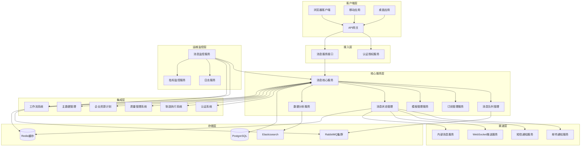

### 3.2 服务依赖关系图

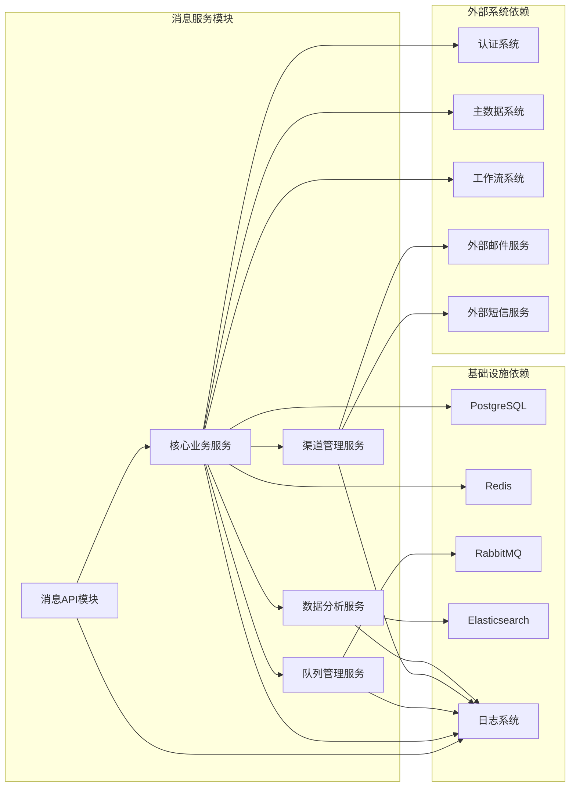

## 4. 模块架构设计

### 4.1 消息核心服务模块

#### 4.1.1 模块概述
消息核心服务是整个子系统的中枢，负责消息的创建、处理、路由和状态管理。该模块实现了消息的完整生命周期管理，包括消息的生成、验证、路由、分发、状态跟踪等核心功能。

#### 4.1.2 子模块设计

| 子模块 | 主要职责 | 关键类/接口 | 依赖模块 |
| --- | --- | --- | --- |
| 消息创建服务 | 负责接收和验证消息请求，创建标准消息对象 | MessageCreatorService MessageValidator | 消息模板服务 认证授权服务 |
| 消息路由服务 | 根据消息类型、接收者和订阅规则进行消息路由 | MessageRouterService RouteRuleEngine | 订阅管理服务 用户数据服务 |
| 消息分发服务 | 管理消息分发策略，调度不同渠道进行消息投递 | MessageDispatcherService DeliveryStrategy | 消息队列服务 渠道管理服务 |
| 消息状态服务 | 跟踪和管理消息的处理状态和生命周期 | MessageStatusService StatusTracker | 数据存储服务 缓存服务 |
| 消息重试服务 | 处理失败消息的重试逻辑和死信处理 | RetryService DeadLetterProcessor | 消息队列服务 告警服务 |

#### 4.1.3 类图

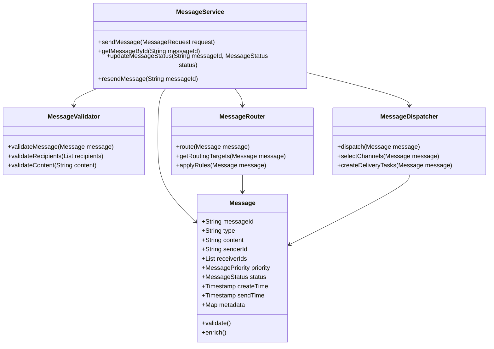

### 4.2 消息队列管理模块

#### 4.2.1 模块概述
消息队列管理模块基于RabbitMQ实现，负责消息的可靠存储、异步处理和系统解耦。该模块实现了消息队列的创建、管理、监控和维护，确保消息的可靠传递和处理。

#### 4.2.2 子模块设计

| 子模块 | 主要职责 | 关键类/接口 | 依赖模块 |
| --- | --- | --- | --- |
| 队列配置服务 | 管理队列、交换机、绑定关系的创建和配置 | QueueConfigService ExchangeManager | 系统配置服务 |
| 消息生产者服务 | 负责消息的发布和确认机制 | MessageProducerService PublisherConfirmHandler | 消息核心服务 |
| 消息消费者服务 | 实现消息的消费、处理和确认 | MessageConsumerService ConsumerErrorHandler | 消息核心服务 |
| 队列监控服务 | 监控队列状态、消息积压、处理速率等指标 | QueueMonitorService MetricsCollector | 监控告警服务 |
| 死信处理服务 | 管理死信队列和失败消息的处理策略 | DeadLetterService RetryPolicy | 重试服务 |

#### 4.2.3 类图

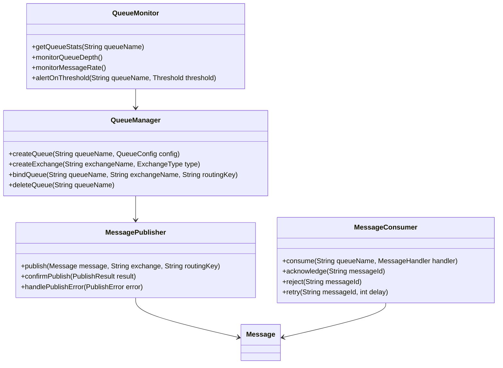

### 4.3 订阅管理服务模块

#### 4.3.1 模块概述
订阅管理服务负责管理用户对各类消息的订阅关系，实现消息的精准推送和个性化配置。该模块支持灵活的订阅规则配置、动态订阅更新和优先级管理。

#### 4.3.2 子模块设计

| 子模块 | 主要职责 | 关键类/接口 | 依赖模块 |
| --- | --- | --- | --- |
| 订阅配置服务 | 管理用户订阅设置和偏好配置 | SubscriptionConfigService PreferenceManager | 用户数据服务 |
| 订阅规则引擎 | 根据业务规则和用户配置确定消息接收者 | SubscriptionRuleEngine RuleEvaluator | 规则配置服务 |
| 订阅生命周期管理 | 处理订阅的创建、更新、过期和删除 | SubscriptionLifeCycleService ExpirationHandler | 数据存储服务 |
| 订阅分析服务 | 分析用户订阅行为和偏好，优化推送策略 | SubscriptionAnalyticsService PreferenceAnalyzer | 数据分析服务 |

#### 4.3.3 类图

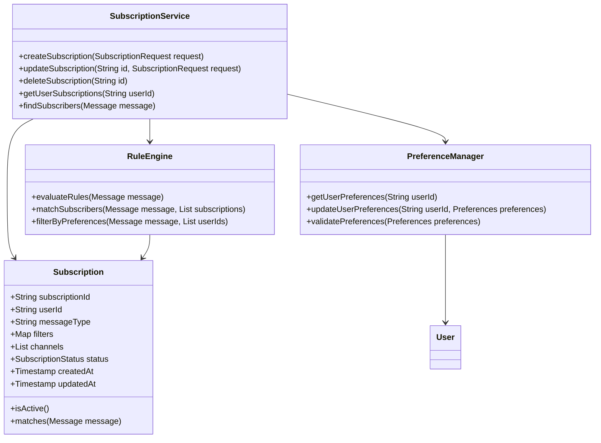

### 4.4 模板管理服务模块

#### 4.4.1 模块概述
模板管理服务负责消息模板的创建、维护、审批和使用，确保消息内容的标准化和一致性。该模块支持富文本模板、变量替换、版本管理和多级审批流程。

#### 4.4.2 子模块设计

| 子模块 | 主要职责 | 关键类/接口 | 依赖模块 |
| --- | --- | --- | --- |
| 模板内容服务 | 管理模板的内容编辑、格式化和验证 | TemplateContentService ContentValidator | 存储服务 |
| 模板审批服务 | 实现模板的多级审批流程和状态管理 | TemplateApprovalService ApprovalWorkflow | 工作流服务 |
| 模板版本服务 | 管理模板的版本历史和变更追踪 | TemplateVersionService VersionControl | 历史记录服务 |
| 模板渲染服务 | 根据模板和参数生成最终消息内容 | TemplateRenderService VariableResolver | 消息核心服务 |

#### 4.4.3 类图

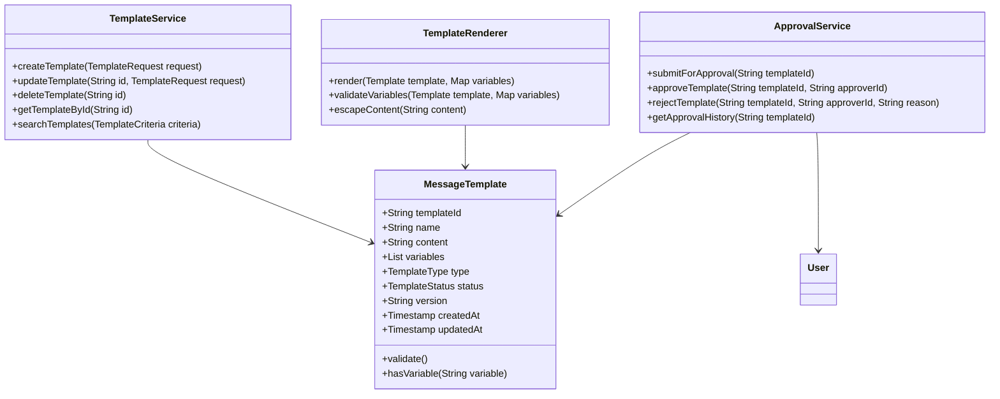

### 4.5 通知渠道管理模块

#### 4.5.1 模块概述
通知渠道管理模块负责管理多种消息通知渠道，如站内信、邮件、短信等，实现消息的多渠道投递和状态追踪。该模块支持渠道配置、连接管理、消息格式化和发送状态监控。

#### 4.5.2 子模块设计

| 子模块 | 主要职责 | 关键类/接口 | 依赖模块 |
| --- | --- | --- | --- |
| 渠道配置服务 | 管理各类通知渠道的配置参数和连接信息 | ChannelConfigService ConnectionManager | 系统配置服务 |
| 站内信服务 | 实现系统内消息的存储和展示 | InternalMessageService NotificationRepository | 用户中心服务 |
| 邮件服务 | 负责邮件消息的格式化和发送 | EmailService EmailTemplateEngine | 外部邮件网关 |
| 短信服务 | 负责短信消息的格式化和发送 | SmsService SmsTemplateEngine | 外部短信网关 |
| WebSocket服务 | 实现实时消息推送和状态同步 | WebSocketService ConnectionHandler | 消息核心服务 |

#### 4.5.3 类图

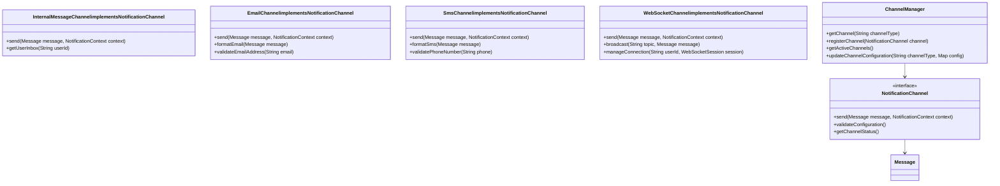

### 4.6 消息监控与告警模块

#### 4.6.1 模块概述
消息监控与告警模块负责监控系统运行状态、消息处理性能和异常情况，及时发现并报告潜在问题。该模块实现了关键指标监控、阈值告警、日志分析和系统健康检查。

#### 4.6.2 子模块设计

| 子模块 | 主要职责 | 关键类/接口 | 依赖模块 |
| --- | --- | --- | --- |
| 指标收集服务 | 收集系统运行指标和消息处理数据 | MetricsCollectorService DataGatherer | 监控框架 |
| 告警规则服务 | 定义和管理告警规则和阈值 | AlertRuleService ThresholdManager | 配置服务 |
| 告警分发服务 | 根据告警级别和类型分发告警通知 | AlertDispatcherService NotificationHandler | 通知渠道服务 |
| 日志分析服务 | 分析系统日志，发现潜在问题 | LogAnalyticsService LogParser | 日志系统 |
| 健康检查服务 | 定期检查系统组件健康状态 | HealthCheckService ComponentMonitor | 监控框架 |

#### 4.6.3 类图

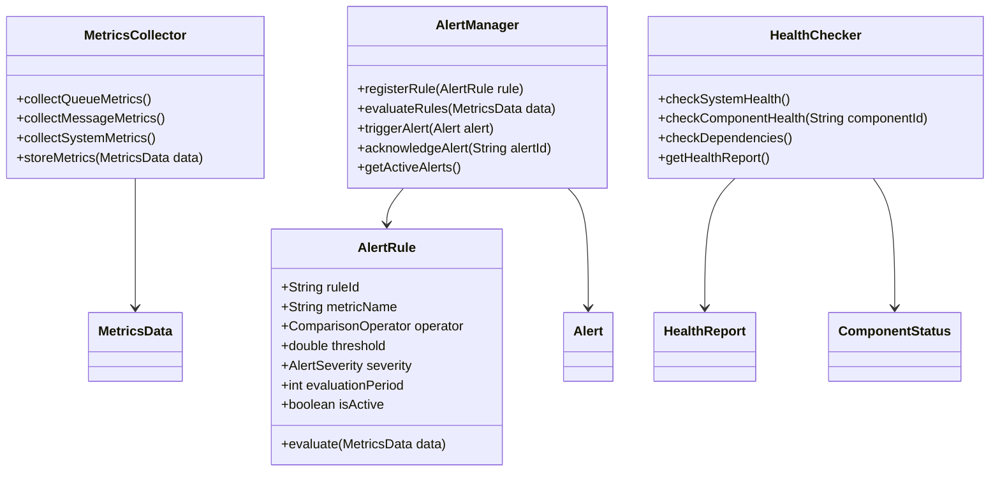

## 5. 集成架构设计

### 5.1 内部系统集成

#### 5.1.1 认证系统集成
- **集成方式**: REST API + OAuth 2.0
- **主要功能**:
  - 用户身份验证和授权
  - 角色和权限管理
  - 访问令牌验证
- **接口规范**:
  - 认证接口: `/api/auth/token`
  - 权限校验接口: `/api/auth/check`
  - 用户信息接口: `/api/auth/userinfo`

#### 5.1.2 制造执行系统(MES)集成
- **集成方式**: 消息队列 + WebSocket
- **主要功能**:
  - 生产事件通知
  - 设备状态预警
  - 质量异常提醒
- **接口规范**:
  - 事件发布主题: `mes.events.#`
  - 指令接收主题: `message.service.instructions.mes`

#### 5.1.3 质量管理系统(QMS)集成
- **集成方式**: REST API + 事件驱动
- **主要功能**:
  - 质量审核通知
  - 偏差管理消息
  - 变更控制提醒
- **接口规范**:
  - 审核通知接口: `/api/qms/audit-notifications`
  - 偏差事件主题: `qms.events.deviation`

#### 5.1.4 企业资源计划(ERP)集成
- **集成方式**: REST API + 批量同步
- **主要功能**:
  - 工单状态通知
  - 库存预警消息
  - 供应商协作通知
- **接口规范**:
  - 工单通知接口: `/api/erp/workorder-notifications`
  - 数据同步接口: `/api/erp/sync`

#### 5.1.5 主数据管理(MDM)集成
- **集成方式**: REST API + 变更推送
- **主要功能**:
  - 用户数据同步
  - 组织架构更新
  - 基础数据变更通知
- **接口规范**:
  - 用户数据接口: `/api/mdm/users`
  - 组织数据接口: `/api/mdm/organizations`

#### 5.1.6 工作流系统集成
- **集成方式**: 事件驱动 + Webhook
- **主要功能**:
  - 工作流任务通知
  - 审批提醒
  - 流程状态更新
- **接口规范**:
  - 任务通知主题: `workflow.events.tasks`
  - 回调接口: `/api/message/workflow-callback`

### 5.2 外部系统集成

#### 5.2.1 邮件服务集成
- **集成方式**: SMTP/API
- **主要功能**:
  - 批量邮件发送
  - 邮件状态跟踪
  - 模板化邮件支持
- **配置参数**:
  - 服务器地址和端口
  - 认证信息
  - 发送速率限制
  - 重试策略

#### 5.2.2 短信服务集成
- **集成方式**: REST API/SMS Gateway
- **主要功能**:
  - 短信发送
  - 状态查询
  - 模板管理
- **配置参数**:
  - API密钥和访问凭证
  - 发送频率限制
  - 签名配置
  - 模板审核状态

#### 5.2.3 移动推送服务集成
- **集成方式**: 第三方推送SDK/API
- **主要功能**:
  - 移动应用消息推送
  - 设备注册和管理
  - 推送效果分析
- **配置参数**:
  - 推送平台凭证
  - 推送策略
  - 设备标签管理

### 5.3 API接口规范

#### 5.3.1 REST API设计原则
- 遵循RESTful设计规范
- 使用标准HTTP方法(GET, POST, PUT, DELETE)
- 统一的错误处理和状态码
- 支持内容协商(JSON, XML)
- 实现版本控制和向后兼容
- 提供完整的API文档(Swagger)

#### 5.3.2 主要API接口

| API路径 | 方法 | 功能描述 | 请求体(JSON) | 成功响应(200 OK) |
| --- | --- | --- | --- | --- |
| `/api/messages` | POST | 发送消息 | `{"type": "text", "content": "...", "recipients": [...], "priority": "high"}` | `{"messageId": "...", "status": "created"}` |
| `/api/messages/{id}` | GET | 获取消息详情 | N/A | `{"messageId": "...", "content": "...", "status": "sent", ...}` |
| `/api/messages` | GET | 查询消息列表 | N/A (查询参数) | `[{"messageId": "...", "type": "...", ...}]` |
| `/api/messages/{id}/status` | PUT | 更新消息状态 | `{"status": "read", "timestamp": "..."}` | `{"status": "success"}` |
| `/api/subscriptions` | POST | 创建订阅 | `{"messageType": "...", "filters": {...}, "channels": [...]}` | `{"subscriptionId": "...", "status": "active"}` |
| `/api/subscriptions` | GET | 获取订阅列表 | N/A (查询参数) | `[{"subscriptionId": "...", "messageType": "...", ...}]` |
| `/api/subscriptions/{id}` | PUT | 更新订阅 | `{"filters": {...}, "channels": [...]}` | `{"status": "success"}` |
| `/api/templates` | POST | 创建模板 | `{"name": "...", "content": "...", "variables": [...]}` | `{"templateId": "...", "status": "draft"}` |
| `/api/templates` | GET | 获取模板列表 | N/A (查询参数) | `[{"templateId": "...", "name": "...", ...}]` |
| `/api/templates/{id}/render` | POST | 渲染模板 | `{"variables": {...}}` | `{"content": "...", "renderedAt": "..."}` |

## 6. 数据流设计

### 6.1 消息发送流程

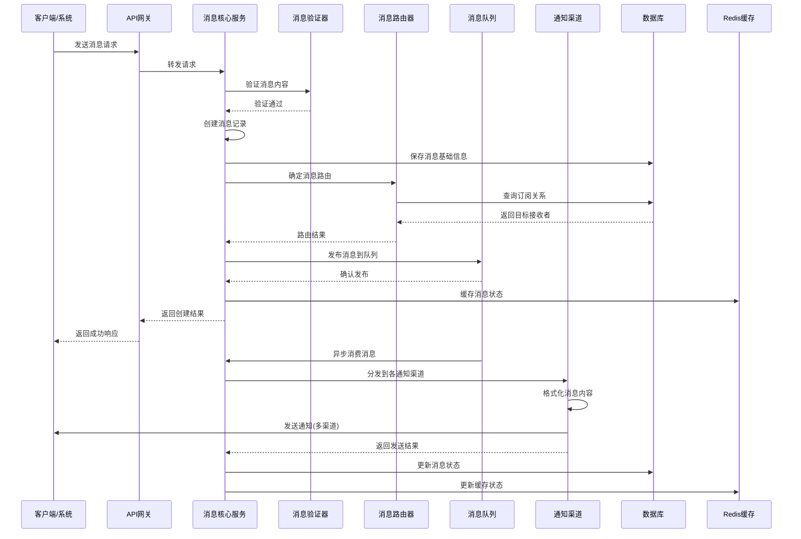

### 6.2 消息订阅与路由流程

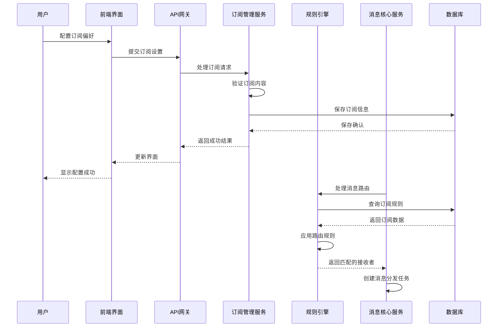

### 6.3 消息查询与统计流程

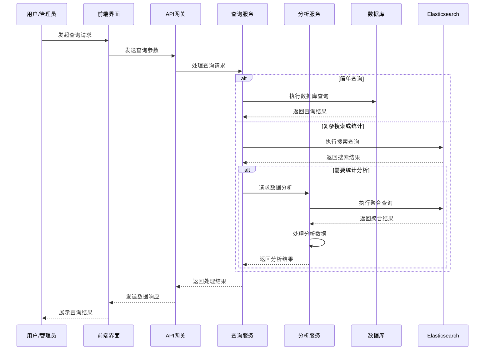

## 7. 安全架构设计

### 7.1 安全原则
- **深度防御**：多层次安全防护机制
- **最小权限**：仅授予必要的访问权限
- **完整性保护**：确保消息内容不被篡改
- **不可否认性**：提供消息发送和接收的证据
- **审计追踪**：完整记录所有操作和访问

### 7.2 身份认证与授权
- 基于OAuth 2.0和JWT的认证机制
- 细粒度的基于角色的访问控制(RBAC)
- 多因素认证(MFA)用于敏感操作
- 会话管理和超时控制

### 7.3 数据安全
- 传输层安全(TLS 1.3)保护API通信
- 消息内容加密存储
- 敏感信息脱敏处理
- 数据备份和恢复机制

### 7.4 审计与合规
- 全面的操作日志记录
- 审计日志不可篡改和防删除
- 符合GMP要求的电子签名
- 定期安全审计和漏洞扫描

## 8. 部署架构设计

### 8.1 部署拓扑

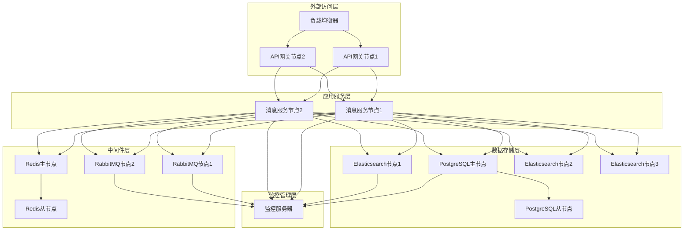

### 8.2 高可用性设计
- 服务多实例部署，负载均衡
- 数据库主从复制，自动故障转移
- 消息队列集群，镜像队列
- 缓存集群，哨兵模式
- 定期健康检查和自动恢复

### 8.3 扩展性设计
- 服务无状态设计，支持水平扩展
- 数据库读写分离，支持分库分表
- 消息队列分区和分片
- 缓存集群动态扩容
- 服务网格技术支持

## 9. 扩展性设计

### 9.1 模块化扩展
- 基于SPI机制的插件系统
- 通知渠道的可插拔架构
- 自定义消息处理器接口
- 规则引擎的规则扩展机制

### 9.2 业务扩展
- 自定义消息类型支持
- 动态模板变量解析
- 业务规则引擎集成
- 自定义事件触发机制

### 9.3 技术扩展
- 支持新技术栈的集成
- 容器化部署和编排
- 微服务网格集成
- API网关的动态路由

## 10. 灾难恢复设计

### 10.1 数据备份策略
- 定期全量备份
- 实时增量备份
- 跨区域备份复制
- 备份数据验证

### 10.2 故障恢复机制
- 自动故障检测和报警
- 自动服务重启和恢复
- 数据一致性恢复
- 业务连续性保障

### 10.3 灾难演练
- 定期灾难恢复演练
- 故障注入测试
- 恢复时间目标(RTO)和恢复点目标(RPO)验证

## 11. 文档版本控制

| 版本 | 日期 | 作者 | 描述 |
| --- | --- | --- | --- |
| V1.0 | 2024-01-15 | 系统架构师 | 初始版本 |
| V1.1 | 2024-02-10 | 高级开发工程师 | 细化模块设计和API规范 |
| V1.2 | 2024-03-01 | DevOps工程师 | 更新部署架构和扩展性设计 |

## 12. 审批信息

| 审批角色 | 姓名 | 审批日期 | 审批意见 |
| --- | --- | --- | --- |
| 技术总监 | 待填写 | 待填写 | 待填写 |
| 业务负责人 | 待填写 | 待填写 | 待填写 |
| 质量保证经理 | 待填写 | 待填写 | 待填写 |

*本文档包含电子记录，已通过电子签名确认其有效性和完整性。*