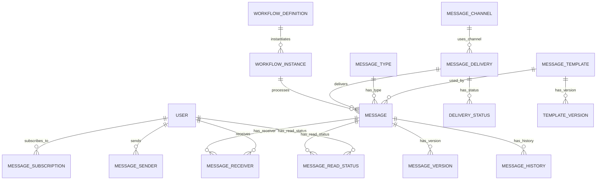
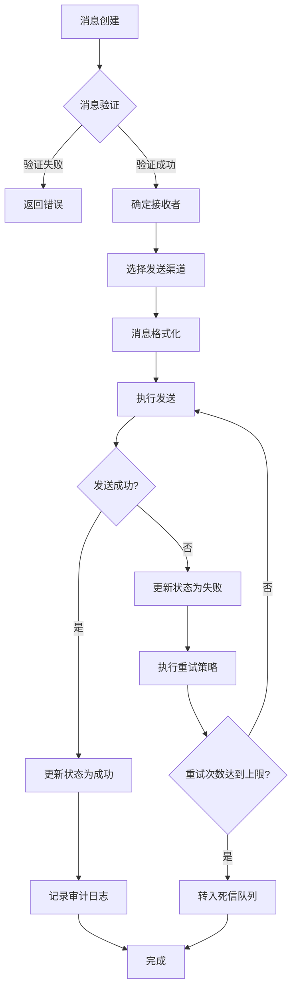
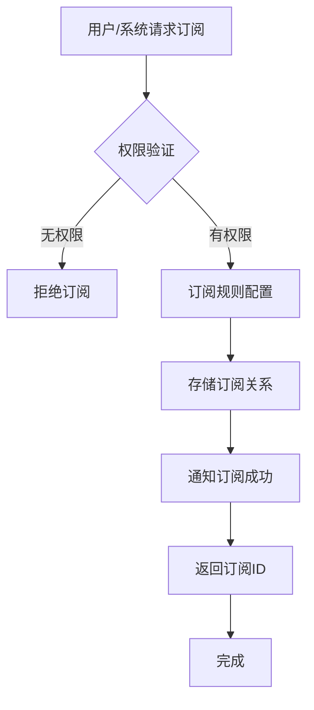
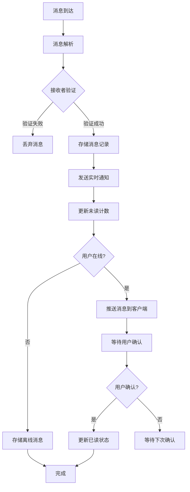

# 消息服务子系统 - 详细需求文档

## 1. 简介

### 1.1 文档目的
本文档详细描述GMP系统中消息服务子系统的功能需求、非功能需求、数据需求、集成需求、验收标准和风险评估，作为系统设计、开发和测试的基础依据。文档旨在确保开发团队、测试团队和业务方对系统需求有一致的理解，指导后续的系统实现和验证。

### 1.2 术语定义
| 术语 | 解释 |
| --- | --- |
| GMP | 良好制造规范(Good Manufacturing Practice)，药品生产质量管理的基本准则 |
| 消息 | 在系统中传递的信息单元，包含消息头、消息体和元数据 |
| 消息队列 | 用于存储消息的缓冲区，实现异步通信和服务解耦 |
| 消息模板 | 预定义的消息格式，可包含变量，用于快速生成标准化消息 |
| 死信队列 | 存储处理失败且无法重试的消息的特殊队列 |
| WebSocket | 提供全双工通信通道的网络协议，用于实时消息推送 |
| 消息优先级 | 指示消息处理顺序和重要程度的属性 |
| 消息状态 | 描述消息生命周期各阶段的状态标识（如已创建、已发送、已接收、已读等） |
| 消息订阅 | 用户或系统注册接收特定类型消息的行为 |
| 消息路由 | 根据规则将消息从源转发到目标的过程 |

## 2. 功能需求（Functional Requirements）

### 2.1 消息发送服务

#### 2.1.1 文本消息发送
- **描述**：系统应支持发送纯文本格式的消息，包括普通通知、重要提醒等
- **输入**：消息内容、接收者信息、消息类型、优先级等
- **输出**：消息发送状态、消息ID
- **详细要求**：
  - 支持消息长度限制检查（最大支持10000字符）
  - 支持发送状态实时反馈
  - 支持消息内容格式检查
  - 支持消息发送前验证

#### 2.1.2 系统通知推送
- **描述**：系统应支持根据业务事件自动触发并推送系统通知
- **输入**：事件类型、事件数据、相关用户信息
- **输出**：通知发送状态、通知ID
- **详细要求**：
  - 支持基于事件的自动触发机制
  - 支持系统通知的优先级设置
  - 支持通知内容的模板化生成
  - 支持按用户角色和权限过滤接收者

#### 2.1.3 预警消息生成
- **描述**：系统应支持基于规则自动生成预警消息
- **输入**：监控数据、预警规则、相关责任人员信息
- **输出**：预警消息、消息状态、消息ID
- **详细要求**：
  - 支持多级预警（信息、警告、严重、紧急）
  - 支持预警规则配置和管理
  - 支持预警消息的自动升级机制
  - 支持预警消息的确认和处理状态跟踪

#### 2.1.4 批量消息处理
- **描述**：系统应支持批量消息的高效处理
- **输入**：批量消息数据、接收者列表、处理参数
- **输出**：批量处理结果、各消息处理状态
- **详细要求**：
  - 支持单次批量处理最大1000条消息
  - 支持批量消息的事务性处理
  - 支持批量处理进度监控
  - 支持批量处理结果统计和导出

#### 2.1.5 定时消息调度
- **描述**：系统应支持定时发送消息的调度功能
- **输入**：消息内容、接收者信息、发送时间、重复规则
- **输出**：调度任务ID、调度状态
- **详细要求**：
  - 支持基于Cron表达式的灵活调度配置
  - 支持定时任务的暂停、恢复、修改和删除
  - 支持调度任务的执行历史查询
  - 支持调度任务的优先级设置

### 2.2 消息接收管理

#### 2.2.1 消息订阅管理
- **描述**：系统应支持用户或系统订阅特定类型的消息
- **输入**：订阅者信息、消息类型、订阅规则、订阅有效期
- **输出**：订阅ID、订阅状态
- **详细要求**：
  - 支持基于消息类型、来源、关键词等的订阅规则
  - 支持订阅的有效期设置
  - 支持订阅的自动续期和手动更新
  - 支持订阅关系的批量管理

#### 2.2.2 消息路由分发
- **描述**：系统应根据消息属性和路由规则将消息分发给目标接收者
- **输入**：消息、路由规则、接收者列表
- **输出**：分发结果、各接收者消息状态
- **详细要求**：
  - 支持基于内容的动态路由
  - 支持优先级路由策略
  - 支持路由规则的可视化配置
  - 支持路由失败的错误处理机制

#### 2.2.3 消息过滤机制
- **描述**：系统应支持基于规则对消息进行过滤处理
- **输入**：消息、过滤规则
- **输出**：过滤结果、处理动作
- **详细要求**：
  - 支持黑名单过滤
  - 支持关键词过滤
  - 支持基于时间、频率的过滤
  - 支持复杂组合条件的过滤规则

#### 2.2.4 接收确认机制
- **描述**：系统应支持消息接收和处理的确认机制
- **输入**：消息ID、确认状态、处理结果
- **输出**：确认记录、状态更新
- **详细要求**：
  - 支持多级确认机制（已接收、已阅读、已处理）
  - 支持确认状态的实时更新和查询
  - 支持批量确认操作
  - 支持确认超时的自动处理

#### 2.2.5 失败重试策略
- **描述**：系统应支持消息发送失败时的智能重试机制
- **输入**：失败消息、重试参数、重试策略
- **输出**：重试结果、最终处理状态
- **详细要求**：
  - 支持可配置的重试间隔（指数退避、固定间隔等）
  - 支持最大重试次数限制
  - 支持重试条件判断（如网络恢复后重试）
  - 支持重试失败后的死信队列处理

### 2.3 消息存储与检索

#### 2.3.1 消息历史记录
- **描述**：系统应完整记录消息的历史数据和状态变化
- **输入**：消息数据、状态更新
- **输出**：历史记录、状态变更日志
- **详细要求**：
  - 支持消息全生命周期状态记录
  - 支持消息历史的不可篡改存储
  - 支持历史记录的完整性校验
  - 支持历史数据的高效查询

#### 2.3.2 消息索引与检索
- **描述**：系统应提供高效的消息搜索和检索功能
- **输入**：搜索条件、过滤参数、排序选项
- **输出**：符合条件的消息列表、搜索统计
- **详细要求**：
  - 支持多条件组合搜索
  - 支持全文检索功能
  - 支持搜索结果的高亮显示
  - 支持搜索历史记录和常用搜索保存

#### 2.3.3 消息归档管理
- **描述**：系统应支持消息的归档和清理策略
- **输入**：归档规则、消息选择条件
- **输出**：归档结果、存储空间节省报告
- **详细要求**：
  - 支持基于时间的自动归档
  - 支持归档数据的压缩存储
  - 支持归档数据的快速恢复和查询
  - 支持归档策略的配置和监控

#### 2.3.4 消息统计分析
- **描述**：系统应提供消息相关的统计和分析功能
- **输入**：统计维度、时间范围、过滤条件
- **输出**：统计报表、趋势图表、异常分析
- **详细要求**：
  - 支持多维度统计（按类型、渠道、时间等）
  - 支持实时统计和历史统计
  - 支持统计结果的可视化展示
  - 支持异常模式检测和预警

#### 2.3.5 消息导出功能
- **描述**：系统应支持消息数据的导出功能
- **输入**：导出条件、数据范围、导出格式
- **输出**：导出文件、导出状态
- **详细要求**：
  - 支持多种导出格式（Excel、CSV、PDF）
  - 支持批量导出和增量导出
  - 支持导出任务的后台执行
  - 支持导出结果的通知和下载

### 2.4 多渠道通知

#### 2.4.1 站内信通知
- **描述**：系统应支持在系统内部发送和接收消息通知
- **输入**：消息内容、接收者ID、消息类型、优先级
- **输出**：消息ID、发送状态
- **详细要求**：
  - 支持实时推送和在线接收
  - 支持消息状态实时更新
  - 支持消息互动（回复、转发等）
  - 支持消息提醒设置（声音、弹窗等）

#### 2.4.2 邮件通知
- **描述**：系统应支持通过电子邮件发送通知
- **输入**：邮件内容、收件人邮箱、邮件主题、附件
- **输出**：发送状态、邮件ID
- **详细要求**：
  - 支持SMTP协议
  - 支持HTML格式邮件
  - 支持邮件模板管理
  - 支持邮件发送状态跟踪

#### 2.4.3 短信通知
- **描述**：系统应支持通过短信发送通知
- **输入**：短信内容、手机号码、短信签名
- **输出**：发送状态、短信ID
- **详细要求**：
  - 支持多短信服务商接口
  - 支持短信内容长度限制检查
  - 支持短信发送频率控制
  - 支持短信状态回调和查询

#### 2.4.4 移动推送
- **描述**：系统应支持向移动设备推送通知
- **输入**：推送内容、设备标识、应用信息、推送选项
- **输出**：推送状态、推送ID
- **详细要求**：
  - 支持Android和iOS平台
  - 支持推送证书管理
  - 支持推送内容定制
  - 支持推送效果分析

#### 2.4.5 第三方消息平台集成
- **描述**：系统应支持与企业微信、钉钉等第三方消息平台集成
- **输入**：消息内容、接收者信息、平台标识、消息格式
- **输出**：发送状态、消息ID
- **详细要求**：
  - 支持多平台配置管理
  - 支持平台消息格式转换
  - 支持平台特殊功能调用
  - 支持集成状态监控和告警

### 2.5 消息模板管理

#### 2.5.1 消息模板创建与编辑
- **描述**：系统应支持消息模板的创建、编辑和管理
- **输入**：模板名称、内容、变量定义、适用场景
- **输出**：模板ID、保存状态
- **详细要求**：
  - 支持富文本编辑
  - 支持变量占位符定义
  - 支持模板预览
  - 支持模板有效性验证

#### 2.5.2 变量替换与格式化
- **描述**：系统应支持在消息生成时进行变量替换和内容格式化
- **输入**：模板ID、变量数据、格式化选项
- **输出**：格式化后的消息内容
- **详细要求**：
  - 支持动态变量替换
  - 支持条件格式化
  - 支持日期、数字等特殊格式处理
  - 支持变量缺失的默认值处理

#### 2.5.3 模板版本控制
- **描述**：系统应支持消息模板的版本管理
- **输入**：模板修改内容、版本备注
- **输出**：新版本号、版本历史
- **详细要求**：
  - 支持版本历史查询
  - 支持版本回滚
  - 支持版本比较
  - 支持版本有效期设置

#### 2.5.4 多语言模板支持
- **描述**：系统应支持多语言消息模板
- **输入**：模板内容、语言标识、翻译数据
- **输出**：多语言模板、支持语言列表
- **详细要求**：
  - 支持语言包管理
  - 支持动态语言切换
  - 支持语言完整性检查
  - 支持语言模板的批量导入导出

#### 2.5.5 模板审批流程
- **描述**：系统应支持模板的审批流程管理
- **输入**：模板提交信息、审批人信息、审批规则
- **输出**：审批状态、审批历史
- **详细要求**：
  - 支持多级审批流程
  - 支持审批通知
  - 支持审批历史记录
  - 支持审批结果反馈

### 2.6 用户消息中心

#### 2.6.1 个人消息箱
- **描述**：系统应为每个用户提供个人消息箱功能
- **输入**：用户ID、查询条件、分页参数
- **输出**：个人消息列表、统计信息
- **详细要求**：
  - 支持消息列表的分页展示
  - 支持消息的快速预览
  - 支持消息的标记已读/未读
  - 支持消息的删除和归档

#### 2.6.2 消息分类与标签
- **描述**：系统应支持消息的分类和标签管理
- **输入**：消息ID、分类信息、标签数据
- **输出**：更新后的消息属性
- **详细要求**：
  - 支持自定义分类和标签
  - 支持多标签关联
  - 支持按分类和标签筛选
  - 支持标签的批量管理

#### 2.6.3 消息已读/未读状态
- **描述**：系统应准确跟踪和更新消息的已读/未读状态
- **输入**：消息ID、用户ID、状态更新
- **输出**：状态更新结果、统计数据
- **详细要求**：
  - 支持单条和批量状态更新
  - 支持阅读时间记录
  - 支持未读消息数量实时统计
  - 支持状态变更历史记录

#### 2.6.4 消息优先级显示
- **描述**：系统应根据消息优先级进行差异化显示
- **输入**：消息数据、优先级设置
- **输出**：优先级标识、排序结果
- **详细要求**：
  - 支持多级别优先级设置
  - 支持优先级的视觉差异化展示
  - 支持按优先级排序
  - 支持优先级筛选

#### 2.6.5 消息标记与收藏
- **描述**：系统应支持用户对重要消息进行标记和收藏
- **输入**：消息ID、用户ID、标记类型
- **输出**：操作结果、标记状态
- **详细要求**：
  - 支持多种标记类型（重要、待办、参考等）
  - 支持按标记筛选消息
  - 支持标记的自定义配置
  - 支持标记统计和管理

### 2.7 消息配置与管理

#### 2.7.1 消息类型配置
- **描述**：系统应支持消息类型的灵活配置和管理
- **输入**：消息类型定义、属性配置、关联规则
- **输出**：消息类型ID、配置状态
- **详细要求**：
  - 支持消息类型的层级结构
  - 支持类型属性自定义
  - 支持类型权限控制
  - 支持类型的启用/禁用管理

#### 2.7.2 通知规则设置
- **描述**：系统应支持消息通知规则的配置和管理
- **输入**：规则名称、触发条件、处理动作、生效范围
- **输出**：规则ID、启用状态
- **详细要求**：
  - 支持基于事件的规则触发
  - 支持规则优先级设置
  - 支持规则的条件组合
  - 支持规则测试和模拟

#### 2.7.3 消息发送频率限制
- **描述**：系统应支持消息发送频率的限制配置
- **输入**：限制规则、适用对象、时间窗口
- **输出**：限制策略、生效状态
- **详细要求**：
  - 支持按用户、类型、渠道的频率限制
  - 支持可配置的限制阈值
  - 支持限制超限的处理策略
  - 支持频率监控和告警

#### 2.7.4 紧急程度管理
- **描述**：系统应支持消息紧急程度的配置和管理
- **输入**：紧急程度定义、处理策略、通知方式
- **输出**：紧急程度配置、优先级设置
- **详细要求**：
  - 支持多级紧急程度（普通、重要、紧急、特别紧急）
  - 支持不同紧急程度的差异化处理
  - 支持紧急程度的升级机制
  - 支持紧急消息的特殊显示和提醒

#### 2.7.5 消息模板配置
- **描述**：系统应支持消息模板的全局配置
- **输入**：模板参数、默认设置、验证规则
- **输出**：配置状态、模板属性
- **详细要求**：
  - 支持模板变量配置
  - 支持模板默认值设置
  - 支持模板验证规则配置
  - 支持模板使用统计

### 2.8 系统集成接口

#### 2.8.1 RESTful API服务
- **描述**：系统应提供完整的RESTful API接口
- **输入**：API请求参数、认证信息
- **输出**：API响应结果、状态码
- **详细要求**：
  - 遵循REST设计规范
  - 支持完整的CRUD操作
  - 提供标准的错误处理
  - 支持API版本控制

#### 2.8.2 WebSocket实时通知
- **描述**：系统应支持WebSocket协议的实时消息推送
- **输入**：连接参数、订阅信息、消息数据
- **输出**：实时消息推送、连接状态
- **详细要求**：
  - 支持双向实时通信
  - 支持连接管理和重连
  - 支持消息订阅和取消
  - 支持连接状态监控

#### 2.8.3 事件驱动接口
- **描述**：系统应支持基于事件的系统间通信
- **输入**：事件数据、订阅关系、处理回调
- **输出**：事件处理结果、状态更新
- **详细要求**：
  - 支持事件发布和订阅
  - 支持事件数据序列化
  - 支持事件处理确认
  - 支持事件历史记录

#### 2.8.4 消息状态回调
- **描述**：系统应支持消息状态变更的回调通知
- **输入**：消息ID、状态变更、回调地址
- **输出**：回调执行结果、确认信息
- **详细要求**：
  - 支持多种回调触发条件
  - 支持回调失败重试
  - 支持回调日志记录
  - 支持回调超时处理

#### 2.8.5 集成配置管理
- **描述**：系统应提供集成配置的管理功能
- **输入**：配置参数、认证信息、连接设置
- **输出**：配置状态、连接测试结果
- **详细要求**：
  - 支持安全的配置存储
  - 支持配置的版本管理
  - 支持配置的测试验证
  - 支持配置的导入导出

## 3. 非功能需求（Non-Functional Requirements）

### 3.1 性能需求

#### 3.1.1 响应时间
- **描述**：系统应在规定时间内响应用户请求
- **详细要求**：
  - 普通消息发送响应时间：< 1秒
  - 消息查询响应时间：< 2秒（基于标准查询条件）
  - 批量消息处理速率：> 1000条/分钟
  - 实时消息推送延迟：< 0.5秒

#### 3.1.2 吞吐量
- **描述**：系统应支持高吞吐量的消息处理
- **详细要求**：
  - 峰值消息处理能力：> 10000条/小时
  - 并发用户支持：> 1000用户同时在线
  - 并发消息处理：> 500条/秒
  - WebSocket并发连接：> 5000个

#### 3.1.3 资源利用率
- **描述**：系统应高效利用硬件资源
- **详细要求**：
  - CPU利用率峰值：< 70%
  - 内存使用效率：< 80%的可用内存
  - 数据库连接池利用率：< 80%
  - 存储空间优化：支持数据压缩存储

### 3.2 可用性需求

#### 3.2.1 系统可用性
- **描述**：系统应保持高可用性，最小化停机时间
- **详细要求**：
  - 系统整体可用性：> 99.9%
  - 计划内维护窗口：每月不超过4小时
  - 故障恢复时间(RTO)：< 1小时
  - 数据恢复点目标(RPO)：< 5分钟

#### 3.2.2 容错能力
- **描述**：系统应具备良好的容错和自我恢复能力
- **详细要求**：
  - 支持组件级故障隔离
  - 支持自动故障检测和告警
  - 支持自动服务恢复机制
  - 支持消息队列的持久化和故障恢复

#### 3.2.3 扩展性
- **描述**：系统应具备良好的水平和垂直扩展能力
- **详细要求**：
  - 支持无状态服务的水平扩展
  - 支持数据库的读写分离和分片
  - 支持消息队列的集群扩展
  - 支持弹性伸缩，根据负载自动调整资源

### 3.3 安全需求

#### 3.3.1 身份认证
- **描述**：系统应实现严格的身份认证机制
- **详细要求**：
  - 支持多因素认证
  - 支持密码复杂度策略
  - 支持会话管理和超时控制
  - 支持单点登录集成

#### 3.3.2 授权控制
- **描述**：系统应实现细粒度的访问控制和权限管理
- **详细要求**：
  - 基于角色的访问控制(RBAC)
  - 支持权限的动态分配和撤销
  - 支持资源级别的权限控制
  - 支持操作审计和权限变更记录

#### 3.3.3 数据安全
- **描述**：系统应保护消息数据的机密性和完整性
- **详细要求**：
  - 传输层加密(TLS 1.2+)
  - 敏感数据存储加密
  - 数据完整性校验
  - 敏感信息脱敏处理

#### 3.3.4 审计日志
- **描述**：系统应记录详细的操作审计日志
- **详细要求**：
  - 记录所有关键操作的详细日志
  - 日志不可篡改，支持完整性验证
  - 支持日志查询和分析
  - 符合GMP和21 CFR Part 11的合规要求

### 3.4 合规性需求

#### 3.4.1 GMP合规
- **描述**：系统应符合GMP(良好制造规范)的要求
- **详细要求**：
  - 支持电子记录和电子签名
  - 支持数据完整性保护
  - 支持审计跟踪和记录
  - 支持权限控制和用户管理

#### 3.4.2 数据完整性
- **描述**：系统应确保数据的完整性、准确性和可靠性
- **详细要求**：
  - 支持数据校验和验证
  - 支持数据一致性检查
  - 支持数据备份和恢复
  - 支持数据变更审计

#### 3.4.3 电子记录与签名
- **描述**：系统应支持符合法规要求的电子记录和电子签名
- **详细要求**：
  - 支持电子签名的唯一性验证
  - 支持签名目的和时间戳记录
  - 支持签名的不可否认性
  - 支持签名历史查询

## 4. 数据需求

### 4.1 实体关系

#### 4.1.1 核心实体关系图

#### 4.1.2 实体定义

| 实体名称 | 描述 | 关键字段 | 关系 |
| --- | --- | --- | --- |
| USER | 系统用户 | user_id, username, email, phone | 1:N with MESSAGE_SENDER, MESSAGE_RECEIVER, MESSAGE_READ_STATUS |
| MESSAGE | 消息主表 | message_id, title, content, type_id, priority, status | 1:N with MESSAGE_RECEIVER, MESSAGE_VERSION, MESSAGE_HISTORY |
| MESSAGE_SUBSCRIPTION | 消息订阅 | subscription_id, user_id, message_type, filter_criteria | N:1 with USER, MESSAGE_TYPE |
| MESSAGE_RECEIVER | 消息接收关系 | receiver_id, message_id, user_id, received_time | N:1 with MESSAGE, USER |
| MESSAGE_SENDER | 消息发送关系 | sender_id, message_id, user_id, sent_time | N:1 with MESSAGE, USER |
| MESSAGE_READ_STATUS | 消息阅读状态 | status_id, message_id, user_id, read_time, read_status | N:1 with MESSAGE, USER |
| MESSAGE_VERSION | 消息版本 | version_id, message_id, version_number, content, created_at | N:1 with MESSAGE |
| MESSAGE_HISTORY | 消息历史 | history_id, message_id, event_type, event_data, timestamp | N:1 with MESSAGE |
| MESSAGE_TEMPLATE | 消息模板 | template_id, name, content, variables, status | 1:N with MESSAGE |
| MESSAGE_TYPE | 消息类型 | type_id, name, description, parent_type | 1:N with MESSAGE |
| MESSAGE_CHANNEL | 消息渠道 | channel_id, name, type, configuration | 1:N with MESSAGE_DELIVERY |
| MESSAGE_DELIVERY | 消息投递记录 | delivery_id, message_id, channel_id, status, delivered_time | N:1 with MESSAGE, MESSAGE_CHANNEL |
| DELIVERY_STATUS | 投递状态 | status_id, delivery_id, status_code, status_message, timestamp | N:1 with MESSAGE_DELIVERY |
| TEMPLATE_VERSION | 模板版本 | version_id, template_id, version_number, content, created_at | N:1 with MESSAGE_TEMPLATE |
| WORKFLOW_DEFINITION | 工作流定义 | workflow_id, name, definition, status | 1:N with WORKFLOW_INSTANCE |
| WORKFLOW_INSTANCE | 工作流实例 | instance_id, workflow_id, message_id, status, created_at | N:1 with WORKFLOW_DEFINITION, MESSAGE |

### 4.2 数据字典

#### 4.2.1 MESSAGE表
| 字段名 | 数据类型 | 长度 | 约束 | 描述 |
| --- | --- | --- | --- | --- |
| message_id | UUID | 36 | PRIMARY KEY | 消息唯一标识 |
| title | VARCHAR | 255 | NOT NULL | 消息标题 |
| content | TEXT | - | NOT NULL | 消息内容 |
| type_id | UUID | 36 | FOREIGN KEY | 消息类型ID |
| priority | INTEGER | 1 | NOT NULL DEFAULT 0 | 消息优先级(0-4) |
| status | VARCHAR | 50 | NOT NULL | 消息状态 |
| sender_id | UUID | 36 | FOREIGN KEY | 发送者ID |
| template_id | UUID | 36 | FOREIGN KEY | 使用的模板ID |
| created_at | TIMESTAMP | - | NOT NULL | 创建时间 |
| updated_at | TIMESTAMP | - | NOT NULL | 更新时间 |
| expiry_time | TIMESTAMP | - | - | 过期时间 |

#### 4.2.2 MESSAGE_RECEIVER表
| 字段名 | 数据类型 | 长度 | 约束 | 描述 |
| --- | --- | --- | --- | --- |
| receiver_id | UUID | 36 | PRIMARY KEY | 接收记录ID |
| message_id | UUID | 36 | FOREIGN KEY | 消息ID |
| user_id | UUID | 36 | FOREIGN KEY | 接收用户ID |
| received_time | TIMESTAMP | - | NOT NULL | 接收时间 |
| is_read | BOOLEAN | - | NOT NULL DEFAULT FALSE | 是否已读 |
| read_time | TIMESTAMP | - | - | 阅读时间 |
| is_archived | BOOLEAN | - | NOT NULL DEFAULT FALSE | 是否已归档 |
| archive_time | TIMESTAMP | - | - | 归档时间 |

#### 4.2.3 MESSAGE_DELIVERY表
| 字段名 | 数据类型 | 长度 | 约束 | 描述 |
| --- | --- | --- | --- | --- |
| delivery_id | UUID | 36 | PRIMARY KEY | 投递记录ID |
| message_id | UUID | 36 | FOREIGN KEY | 消息ID |
| channel_id | UUID | 36 | FOREIGN KEY | 投递渠道ID |
| receiver_address | VARCHAR | 255 | NOT NULL | 接收地址(邮箱/手机号等) |
| status | VARCHAR | 50 | NOT NULL | 投递状态 |
| attempt_count | INTEGER | 3 | NOT NULL DEFAULT 0 | 尝试次数 |
| last_attempt_time | TIMESTAMP | - | - | 最后尝试时间 |
| delivered_time | TIMESTAMP | - | - | 成功投递时间 |
| failure_reason | TEXT | - | - | 失败原因 |
| created_at | TIMESTAMP | - | NOT NULL | 创建时间 |
| updated_at | TIMESTAMP | - | NOT NULL | 更新时间 |

#### 4.2.4 MESSAGE_TEMPLATE表
| 字段名 | 数据类型 | 长度 | 约束 | 描述 |
| --- | --- | --- | --- | --- |
| template_id | UUID | 36 | PRIMARY KEY | 模板ID |
| name | VARCHAR | 255 | NOT NULL | 模板名称 |
| description | TEXT | - | - | 模板描述 |
| content | TEXT | - | NOT NULL | 模板内容 |
| variables | JSONB | - | - | 模板变量定义 |
| channel_type | VARCHAR | 50 | NOT NULL | 适用渠道类型 |
| status | VARCHAR | 50 | NOT NULL | 模板状态 |
| created_by | UUID | 36 | FOREIGN KEY | 创建者ID |
| created_at | TIMESTAMP | - | NOT NULL | 创建时间 |
| updated_at | TIMESTAMP | - | NOT NULL | 更新时间 |
| language | VARCHAR | 10 | NOT NULL DEFAULT 'zh-CN' | 语言代码 |

## 5. 集成需求

### 5.1 内部系统集成

#### 5.1.1 与认证授权子系统(AUTH-SYS)集成
- **目的**：实现用户身份认证和权限管理
- **集成方式**：RESTful API + JWT令牌
- **主要功能点**：
  - 用户身份验证
  - 权限校验
  - 角色信息获取
  - 用户信息同步
- **数据交换**：
  - 输入：用户凭证、权限请求
  - 输出：认证结果、JWT令牌、用户权限信息

#### 5.1.2 与质量管理子系统(QMS)集成
- **目的**：接收和处理质量相关通知
- **集成方式**：事件驱动 + RESTful API
- **主要功能点**：
  - 质量事件通知发送
  - 审核任务提醒
  - 偏差处理通知
  - 变更控制通知
- **数据交换**：
  - 输入：质量事件数据、审核任务信息、偏差信息
  - 输出：通知状态、消息ID

#### 5.1.3 与生产执行系统(MES)集成
- **目的**：处理生产相关消息和通知
- **集成方式**：WebSocket + 消息队列
- **主要功能点**：
  - 生产计划提醒
  - 设备状态变更通知
  - 生产异常告警
  - 批记录相关通知
- **数据交换**：
  - 输入：生产事件、设备状态、异常数据
  - 输出：实时通知、确认状态

#### 5.1.4 与实验室信息系统(LIMS)集成
- **目的**：处理实验室检测相关消息
- **集成方式**：RESTful API + 事件驱动
- **主要功能点**：
  - 检测任务提醒
  - 检测结果通知
  - 样品过期提醒
  - 异常数据预警
- **数据交换**：
  - 输入：检测任务、结果数据、样品信息
  - 输出：通知状态、消息ID

#### 5.1.5 与人力资源管理系统(HR-MANAGEMENT)集成
- **目的**：处理员工相关通知
- **集成方式**：RESTful API
- **主要功能点**：
  - 培训计划通知
  - 考核结果通知
  - 入职/离职相关消息
  - 内部公告发布
- **数据交换**：
  - 输入：员工信息、培训数据、公告内容
  - 输出：通知状态、接收确认

#### 5.1.6 与文件管理系统(FILE-SERVICE)集成
- **目的**：实现文档相关消息通知
- **集成方式**：事件驱动 + WebHook
- **主要功能点**：
  - 文档审批通知
  - 新版本发布提醒
  - 文档访问通知
  - 文档过期提醒
- **数据交换**：
  - 输入：文档事件、审批状态、版本信息
  - 输出：通知状态、用户反馈

### 5.2 外部系统集成

#### 5.2.1 邮件服务器集成
- **目的**：支持电子邮件发送功能
- **集成方式**：SMTP协议
- **主要功能点**：
  - 邮件发送
  - 邮件状态跟踪
  - 附件支持
  - 邮件模板
- **数据交换**：
  - 输入：邮件内容、收件人、主题、附件
  - 输出：发送状态、邮件ID

#### 5.2.2 短信网关集成
- **目的**：支持短信发送功能
- **集成方式**：HTTP API
- **主要功能点**：
  - 短信发送
  - 短信状态查询
  - 短信模板管理
  - 发送频率控制
- **数据交换**：
  - 输入：短信内容、手机号码、签名
  - 输出：发送状态、短信ID

#### 5.2.3 移动推送服务集成
- **目的**：支持移动应用推送功能
- **集成方式**：推送服务API
- **主要功能点**：
  - Android推送
  - iOS推送
  - 推送证书管理
  - 推送效果分析
- **数据交换**：
  - 输入：推送内容、设备标识、应用信息
  - 输出：推送状态、推送ID

#### 5.2.4 企业微信/钉钉集成
- **目的**：支持企业即时通讯工具通知
- **集成方式**：官方API
- **主要功能点**：
  - 消息推送
  - 应用消息
  - 群消息
  - 卡片消息
- **数据交换**：
  - 输入：消息内容、接收人、消息类型
  - 输出：发送状态、消息ID

## 6. 验收标准（Acceptance Criteria）

### 6.1 功能验收

#### 6.1.1 消息发送功能验收
- **验收标准**：
  - 所有消息类型（文本、系统通知、预警等）能够正确发送
  - 批量消息处理成功率>99.9%
  - 定时消息能够在指定时间准确发送
  - 发送失败消息能够按配置进行重试
- **测试方法**：
  - 功能测试：逐一测试各类型消息发送
  - 性能测试：测试批量消息处理能力
  - 边界测试：测试最大消息长度、批量处理上限

#### 6.1.2 消息接收与处理验收
- **验收标准**：
  - 消息能够正确投递到所有目标接收者
  - 消息订阅机制正确过滤目标用户
  - 消息接收状态实时更新
  - 失败重试机制有效恢复大部分发送失败
- **测试方法**：
  - 功能测试：测试各种接收场景
  - 集成测试：测试与其他系统的消息交互
  - 故障注入测试：模拟发送失败场景

#### 6.1.3 多渠道通知验收
- **验收标准**：
  - 所有支持的通知渠道（站内信、邮件、短信等）能够正常工作
  - 同一消息能够同时通过多个渠道发送
  - 各渠道消息格式正确，内容一致
  - 渠道发送状态能够正确反馈
- **测试方法**：
  - 功能测试：测试各通知渠道
  - 兼容性测试：测试不同邮件客户端、手机型号
  - 集成测试：测试与外部服务商接口

#### 6.1.4 消息管理功能验收
- **验收标准**：
  - 消息查询、筛选、排序功能正确
  - 消息归档和清理策略有效执行
  - 消息模板能够正确生成消息
  - 消息统计数据准确
- **测试方法**：
  - 功能测试：测试管理功能
  - 数据验证：验证统计结果准确性
  - 性能测试：测试大数据量下的查询性能

### 6.2 非功能验收

#### 6.2.1 性能验收
- **验收标准**：
  - 响应时间满足需求（<1秒）
  - 吞吐量满足设计要求（>10000条/小时）
  - 资源利用率在合理范围（CPU<70%，内存<80%）
  - 并发用户支持>1000用户
- **测试方法**：
  - 负载测试：模拟多用户并发访问
  - 压力测试：测试系统极限承载能力
  - 性能监控：收集关键性能指标

#### 6.2.2 可用性验收
- **验收标准**：
  - 系统可用性达到99.9%
  - 故障恢复时间<1小时
  - 数据恢复点目标<5分钟
  - 自动恢复机制有效
- **测试方法**：
  - 长时间稳定性测试
  - 故障恢复测试：模拟组件故障
  - 灾难恢复演练

#### 6.2.3 安全验收
- **验收标准**：
  - 身份认证和授权机制有效
  - 敏感数据加密存储和传输
  - 审计日志完整记录关键操作
  - 通过安全漏洞扫描
- **测试方法**：
  - 安全渗透测试
  - 权限测试：验证访问控制有效性
  - 加密测试：验证加密算法实现

#### 6.2.4 合规性验收
- **验收标准**：
  - 符合GMP数据完整性要求
  - 支持符合21 CFR Part 11的电子签名
  - 审计跟踪完整、准确、不可篡改
  - 通过合规性审核
- **测试方法**：
  - 合规性检查：对照法规要求逐项检查
  - 审计日志验证：验证日志完整性和准确性
  - 电子签名测试：测试签名功能和合规性

## 7. 风险评估

### 7.1 技术风险

| 风险ID | 风险描述 | 可能性 | 影响程度 | 风险等级 | 缓解措施 |
| --- | --- | --- | --- | --- | --- |
| R-T-01 | 消息队列系统性能瓶颈 | 高 | 高 | 高 | 实施消息队列集群、消息分片、性能监控和预警 |
| R-T-02 | 高并发场景下系统响应延迟 | 高 | 中 | 高 | 优化数据库查询、实现缓存策略、异步处理非核心操作 |
| R-T-03 | 外部邮件/短信服务不可用 | 中 | 高 | 高 | 多服务商备份、本地消息队列缓冲、故障转移机制 |
| R-T-04 | 数据存储容量问题 | 中 | 高 | 中 | 数据分片、自动扩容、数据归档策略、存储监控 |
| R-T-05 | WebSocket连接管理复杂 | 中 | 中 | 中 | 连接池优化、心跳检测、异常处理、资源限制 |

### 7.2 业务风险

| 风险ID | 风险描述 | 可能性 | 影响程度 | 风险等级 | 缓解措施 |
| --- | --- | --- | --- | --- | --- |
| R-B-01 | 消息发送失败导致关键信息未传达 | 高 | 高 | 高 | 完善重试机制、死信队列处理、失败通知、监控告警 |
| R-B-02 | 消息模板管理不当导致信息错误 | 中 | 高 | 中 | 模板版本控制、审批流程、模板测试、使用日志 |
| R-B-03 | 用户消息过多导致重要信息被忽略 | 中 | 中 | 中 | 智能分类、优先级设置、通知策略优化、用户偏好设置 |
| R-B-04 | 系统集成不完整导致功能缺失 | 中 | 高 | 中 | 详细的集成测试、接口文档完善、版本兼容性管理 |
| R-B-05 | 业务需求频繁变更导致系统调整困难 | 高 | 中 | 高 | 模块化设计、接口标准化、灵活配置机制、敏捷开发 |

### 7.3 合规风险

| 风险ID | 风险描述 | 可能性 | 影响程度 | 风险等级 | 缓解措施 |
| --- | --- | --- | --- | --- | --- |
| R-C-01 | 审计日志不完整或可篡改 | 高 | 高 | 高 | 日志加密存储、防篡改机制、第三方审计、定期备份 |
| R-C-02 | 电子签名不合规 | 高 | 高 | 高 | 严格遵循21 CFR Part 11、定期合规检查、专业顾问审核 |
| R-C-03 | 敏感数据保护不足 | 中 | 高 | 高 | 数据加密、访问控制、脱敏处理、定期安全评估 |
| R-C-04 | 系统访问控制不当 | 中 | 高 | 中 | RBAC权限模型、多因素认证、权限审计、最小权限原则 |
| R-C-05 | 数据恢复机制不可靠 | 中 | 高 | 中 | 定期备份、恢复演练、异地备份、灾难恢复计划 |

### 7.4 实施风险

| 风险ID | 风险描述 | 可能性 | 影响程度 | 风险等级 | 缓解措施 |
| --- | --- | --- | --- | --- | --- |
| R-I-01 | 开发进度延迟 | 高 | 中 | 高 | 详细的项目计划、里程碑管理、敏捷方法、资源预留 |
| R-I-02 | 测试覆盖不充分 | 高 | 高 | 高 | 全面测试计划、自动化测试、代码审查、性能测试 |
| R-I-03 | 外部依赖服务变更 | 中 | 中 | 中 | 依赖管理、接口适配层、版本锁定、变更通知机制 |
| R-I-04 | 用户培训不足 | 中 | 中 | 中 | 全面培训计划、用户手册、在线帮助、技术支持 |
| R-I-05 | 维护复杂度高 | 高 | 中 | 高 | 模块化设计、代码规范、文档完善、监控告警、知识传承 |

## 8. 依赖与限制

### 8.1 技术依赖

| 依赖项 | 版本 | 用途 | 备注 |
| --- | --- | --- | --- |
| Java | 17+ | 后端开发语言 | 必须JDK 17或更高版本 |
| Spring Boot | 3.x | 应用框架 | 核心应用框架 |
| Spring Cloud | 2022.x | 微服务框架 | 服务治理、配置管理等 |
| RabbitMQ | 3.10+ | 消息队列 | 核心消息处理引擎 |
| PostgreSQL | 14+ | 关系数据库 | 存储结构化数据 |
| MongoDB | 5.x | NoSQL数据库 | 存储非结构化数据和日志 |
| Redis | 6.x | 缓存系统 | 缓存热点数据、会话管理 |
| Elasticsearch | 7.x | 搜索引擎 | 消息搜索和日志分析 |
| Spring WebSocket | 6.x | WebSocket支持 | 实时消息推送 |
| Keycloak | 20.x | 身份认证 | 用户认证和授权 |
| Docker | 20.x+ | 容器化 | 应用容器化部署 |
| Kubernetes | 1.24+ | 容器编排 | 容器管理和编排 |

### 8.2 环境限制

| 限制项 | 描述 | 影响 | 解决方案 |
| --- | --- | --- | --- |
| 硬件资源 | 生产环境最低要求：8核CPU、32GB内存、1TB存储 | 系统性能 | 根据负载进行资源扩展 |
| 网络带宽 | 最低要求100Mbps，建议千兆网络 | 消息传输速度 | 优化网络配置，实现网络冗余 |
| 数据库连接数 | 默认限制为500，可配置 | 并发处理能力 | 根据需要调整连接池配置 |
| 消息大小 | 单条消息最大支持10MB | 消息内容限制 | 大文件通过附件方式处理 |
| WebSocket连接数 | 受服务器资源和网络限制 | 实时推送能力 | 实现连接管理和资源限制 |

### 8.3 合规限制

| 限制项 | 描述 | 影响 | 解决方案 |
| --- | --- | --- | --- |
| GMP数据完整性要求 | 所有电子记录必须完整、准确、可追溯 | 系统设计和实现 | 严格的数据管理和审计机制 |
| 21 CFR Part 11要求 | 电子签名必须唯一、可验证、带时间戳 | 签名功能实现 | 符合法规的签名实现和验证 |
| 数据保留期 | 消息和审计日志需保留至少5年 | 存储和归档 | 数据归档和长期存储策略 |
| 访问控制 | 严格的权限管理和审计 | 系统安全性 | 细粒度的RBAC权限模型 |
| 变更控制 | 系统变更需经过验证和审批 | 系统维护 | 变更管理流程和文档 |

## 9. 范围限定

### 9.1 包含功能

- 消息发送、接收和管理的完整生命周期
- 支持多种消息类型和通知渠道
- 消息模板管理和版本控制
- 用户消息中心和个性化设置
- 完整的审计日志和合规支持
- 与内部和外部系统的标准集成接口

### 9.2 不包含功能

- 即时通讯聊天功能（仅支持单向通知）
- 视频/音频消息传输（仅支持文本、图片和简单附件）
- 复杂的消息内容编辑（如富媒体编辑）
- 第三方社交媒体集成（除企业微信/钉钉外）
- 消息内容的语义分析和智能处理
- 离线消息推送和存储（依赖外部推送服务）

## 10. 验收与交付

### 10.1 交付物清单

| 交付物 | 类型 | 描述 | 交付形式 |
| --- | --- | --- | --- |
| 系统源代码 | 代码 | 完整的系统源代码 | 代码仓库 |
| 数据库设计文档 | 文档 | 详细的数据库设计 | PDF文档 |
| API接口文档 | 文档 | 完整的API接口说明 | Swagger页面 + PDF |
| 系统部署手册 | 文档 | 详细的部署指南 | PDF文档 |
| 用户操作手册 | 文档 | 系统使用指南 | PDF文档 + 在线帮助 |
| 测试报告 | 文档 | 系统测试结果报告 | PDF文档 |
| 系统架构图 | 文档 | 系统架构和组件说明 | Visio + PDF |
| 环境配置脚本 | 脚本 | 自动化部署和配置脚本 | 脚本文件 |
| 性能测试数据 | 数据 | 系统性能测试结果 | Excel + PDF |
| 安全评估报告 | 文档 | 系统安全评估结果 | PDF文档 |

### 10.2 验收流程

1. **验收准备**
   - 开发方提供完整的交付物
   - 准备测试环境和测试数据
   - 确认验收标准和测试用例

2. **功能验收测试**
   - 按功能模块进行测试
   - 验证功能需求的实现情况
   - 记录测试结果和问题

3. **非功能验收测试**
   - 性能测试：验证系统性能指标
   - 可用性测试：验证系统稳定性
   - 安全测试：验证系统安全性
   - 合规测试：验证法规符合度

4. **集成测试**
   - 验证与其他子系统的集成
   - 验证端到端业务流程
   - 测试系统边界条件

5. **验收评审**
   - 召开验收评审会议
   - 讨论测试结果和发现的问题
   - 确认是否通过验收或需要修复

6. **验收通过**
   - 签署验收报告
   - 系统正式交付使用
   - 进入维护阶段

## 11. 附录

### 11.1 术语表

| 术语 | 解释 |
| --- | --- |
| 消息队列 | 用于存储和传递消息的缓冲区，实现异步通信 |
| 消息优先级 | 指示消息重要程度和处理顺序的属性 |
| 死信队列 | 存储处理失败且无法重试的消息的队列 |
| 消息模板 | 预定义的消息格式，可包含变量占位符 |
| WebSocket | 提供全双工通信通道的网络协议 |
| 消息订阅 | 用户注册接收特定类型消息的行为 |
| 消息路由 | 根据规则将消息从源转发到目标的过程 |
| 幂等性 | 多次操作产生相同结果，不会重复处理 |
| 事件驱动 | 基于事件触发和响应的系统架构模式 |
| 异步处理 | 不需要等待操作完成就继续执行后续任务的处理方式 |

### 11.2 参考文档

- 《GMP指南》
- 《21 CFR Part 11》
- 《EU GMP Annex 11》
- 《Spring Boot官方文档》
- 《RabbitMQ官方文档》
- 《PostgreSQL官方文档》
- 《MongoDB官方文档》
- 《Elasticsearch官方文档》
- 《WebSocket协议规范》
- 《OAuth 2.0协议规范》

### 11.3 业务流程图示例

#### 11.3.1 消息发送流程

#### 11.3.2 消息订阅流程

#### 11.3.3 消息接收处理流程

## 文档版本信息

| 版本 | 日期 | 作者 | 描述 |
| --- | --- | --- | --- |
| V1.0 | 2024-01-15 | 系统分析师 | 初始版本 |
| V1.1 | 2024-02-10 | 系统架构师 | 更新技术架构和集成需求 |
| V1.2 | 2024-03-01 | 开发团队 | 补充功能细节和验收标准 |

## 审批信息

| 审批角色 | 姓名 | 审批日期 | 审批意见 |
| --- | --- | --- | --- |
| 业务负责人 | 待填写 | 待填写 | 待填写 |
| 技术负责人 | 待填写 | 待填写 | 待填写 |
| 质量负责人 | 待填写 | 待填写 | 待填写 |

*本文档包含电子记录，已通过电子签名确认其有效性和完整性。*