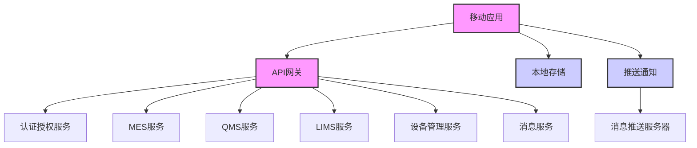

# 移动应用子系统架构设计

## 1. 概述

本文档详细描述GMP系统中移动应用子系统的架构设计。移动应用子系统旨在为GMP系统提供移动端访问能力，支持核心业务流程的现场操作、数据采集、审批和监控功能，确保生产与质量活动的移动化管理。

## 2. 系统架构

### 2.1 分层架构设计

移动应用子系统采用典型的移动应用架构，结合后端微服务进行交互：

| 层级 | 组件 | 职责 | 技术栈 |
|-----|------|-----|-------|
| 表示层 | UI组件库 | 用户界面渲染与交互 | React Native |
| 业务逻辑层 | 业务服务 | 处理业务规则与流程 | TypeScript |
| 数据层 | 本地存储 | 离线数据缓存与同步 | AsyncStorage, SQLite |
| 通信层 | API网关 | 与后端服务安全通信 | Axios |
| 安全层 | 安全模块 | 身份验证与数据加密 | JWT, AES |

### 2.2 微服务架构图



## 3. 服务设计

### 3.1 微服务边界

移动应用作为客户端应用，主要与以下后端微服务交互：

| 微服务 | 主要职责 | 交互方式 |
|-------|---------|--------|
| 认证授权服务 | 用户认证与会话管理 | REST API |
| MES服务 | 生产执行相关操作 | REST API |
| QMS服务 | 质量管理相关操作 | REST API |
| LIMS服务 | 实验室信息管理 | REST API |
| 设备管理服务 | 设备状态监控与操作 | REST API |
| 消息服务 | 消息推送与通知 | WebSocket, 推送通知 |

### 3.2 服务接口设计

#### 3.2.1 REST API接口

| 接口名 | URL | 方法 | 功能描述 | 请求体 (JSON) | 成功响应 (200 OK) |
|-------|-----|-----|---------|--------------|----------------|
| 用户登录 | /api/auth/login | POST | 用户身份认证 | `{"username": "...", "password": "..."}` | `{"token": "...", "userInfo": {...}}` |
| 数据同步 | /api/sync/data | POST | 离线数据同步 | `{"lastSyncTime": "...", "data": [...]}` | `{"synced": true, "serverData": [...]}` |
| 获取生产任务 | /api/mes/tasks | GET | 获取待执行任务列表 | N/A | `[{"taskId": "...", "description": "..."}]` |
| 提交质量检查 | /api/qms/inspections | POST | 提交质量检查结果 | `{"inspectionId": "...", "results": {...}}` | `{"status": "success", "id": "..."}` |
| 获取通知 | /api/message/notifications | GET | 获取用户通知列表 | N/A | `[{"notificationId": "...", "content": "..."}]` |

#### 3.2.2 MCP协议接口

移动应用通过MCP协议与后端服务进行高级交互：

| 接口名 | 功能描述 | 参数 | 返回值 | 错误码 |
|-------|---------|-----|-------|-------|
| Authenticate | 用户认证 | username, password | auth_token | INVALID_CREDENTIALS |
| GetCachedData | 获取缓存数据 | dataType, timestamp | cachedData | DATA_NOT_FOUND |
| UploadFile | 上传文件/图片 | fileData, metadata | fileId | UPLOAD_FAILED |
| SubscribeEvents | 订阅事件通知 | eventTypes, filters | subscriptionId | INVALID_SUBSCRIPTION |
| ExecuteAction | 执行远程操作 | actionType, parameters | executionResult | ACTION_FAILED |

## 4. 数据架构设计

### 4.1 核心数据模型

| 实体 | 字段 | 类型 | 说明 |
|-----|------|-----|------|
| 用户 | userId, username, role, permissions | String, String, String, Array | 移动用户信息 |
| 任务 | taskId, type, status, priority, dueDate | String, String, String, String, Date | 工作任务 |
| 检查项 | checkId, type, description, standardValue | String, String, String, String | 质量检查项 |
| 检查结果 | resultId, checkId, value, passed, timestamp | String, String, String, Boolean, Date | 检查结果记录 |
| 设备状态 | deviceId, status, parameters, timestamp | String, String, Object, Date | 设备运行状态 |
| 消息通知 | notificationId, title, content, read, timestamp | String, String, String, Boolean, Date | 系统通知 |

### 4.2 Repository层设计

移动应用采用本地存储策略，实现离线操作能力：

```typescript
// 本地数据仓库接口示例
interface LocalRepository<T> {
  save(entity: T): Promise<boolean>;
  saveAll(entities: T[]): Promise<boolean>;
  findById(id: string): Promise<T | null>;
  findAll(filters?: any): Promise<T[]>;
  update(entity: T): Promise<boolean>;
  delete(id: string): Promise<boolean>;
  clear(): Promise<boolean>;
}

// 实现示例
class SQLiteRepository<T> implements LocalRepository<T> {
  // 实现SQLite数据库操作
}

class AsyncStorageRepository<T> implements LocalRepository<T> {
  // 实现AsyncStorage操作
}
```

## 5. MCP协议实现

### 5.1 MCP客户端配置

移动应用中的MCP客户端配置：

```typescript
// MCP客户端配置示例
const mcpClientConfig = {
  serverUrl: 'https://api.gmp-system.com/mcp',
  authProvider: new JwtAuthProvider(),
  connectionPool: {
    maxConnections: 5,
    keepAlive: true,
    timeout: 30000
  },
  retryPolicy: {
    maxRetries: 3,
    initialDelay: 1000,
    maxDelay: 5000
  },
  encryption: {
    enabled: true,
    algorithm: 'AES-256-GCM'
  }
};
```

### 5.2 MCP工具注册

移动应用注册的MCP工具：

| 工具名 | 功能描述 | 参数定义 | 实现类 |
|-------|---------|---------|-------|
| FileUploader | 文件上传工具 | fileData, metadata | FileUploaderTool |
| CameraCapture | 相机捕获工具 | options | CameraCaptureTool |
| LocationTracker | 位置追踪工具 | accuracy, interval | LocationTrackerTool |
| BarcodeScanner | 条形码扫描工具 | format | BarcodeScannerTool |
| SignatureCapture | 签名捕获工具 | options | SignatureCaptureTool |

### 5.3 消息序列化与传输

移动应用使用优化的序列化策略，减少带宽消耗：

```typescript
// MCP消息序列化示例
class McpMessageSerializer {
  serialize(message: McpMessage): Uint8Array {
    // 实现高效的消息序列化，支持增量更新
    // 使用Protocol Buffers或MessagePack等高效格式
  }
  
  deserialize(data: Uint8Array): McpMessage {
    // 反序列化消息
  }
}
```

## 6. 集成设计

### 6.1 外部系统集成

移动应用与以下系统集成：

| 系统 | 集成点 | 集成方式 | 数据流向 |
|-----|-------|---------|--------|
| MES系统 | 生产任务、工艺参数 | REST API | 双向 |
| QMS系统 | 质量检查、偏差管理 | REST API | 双向 |
| LIMS系统 | 检验结果、测试方法 | REST API | 双向 |
| 设备管理 | 设备状态、维护记录 | REST API | 双向 |
| 推送通知 | 系统通知、任务提醒 | 推送服务 | 单向 |

### 6.2 数据同步策略

移动应用实现智能数据同步机制：

1. **增量同步**：仅同步上次同步后的变更数据
2. **按需同步**：根据用户操作和位置智能预加载数据
3. **冲突解决**：实现基于时间戳和版本号的冲突检测与解决
4. **离线操作**：支持完全离线工作，上线后自动同步

```typescript
// 数据同步管理器示例
class DataSyncManager {
  async syncData(context: SyncContext): Promise<SyncResult> {
    // 实现智能数据同步逻辑
  }
  
  queueForSync(operation: OfflineOperation): void {
    // 排队等待同步的操作
  }
  
  resolveConflicts(conflicts: Conflict[]): Promise<ResolutionResult> {
    // 解决同步冲突
  }
}
```

## 7. 安全架构

### 7.1 认证与授权

移动应用实现多层次安全认证：

1. **用户名密码认证**：初始登录认证
2. **生物识别**：指纹/面部识别快速登录
3. **会话管理**：JWT令牌与自动续期
4. **权限控制**：基于角色的访问控制(RBAC)
5. **多因素认证**：关键操作的二次验证

### 7.2 数据安全

移动应用的数据安全措施：

1. **传输加密**：全程TLS 1.3加密
2. **本地加密**：敏感数据AES-256加密存储
3. **安全擦除**：应用卸载时安全清除数据
4. **防止截屏**：敏感界面禁止截屏
5. **数据脱敏**：显示敏感信息时脱敏处理

### 7.3 安全配置

```typescript
// 安全配置示例
const securityConfig = {
  encryption: {
    algorithm: 'AES-256-GCM',
    keyDerivation: 'PBKDF2'
  },
  biometric: {
    enabled: true,
    fallbackToPassword: false
  },
  session: {
    timeout: 1800000, // 30分钟
    refreshThreshold: 300000 // 5分钟前刷新
  },
  network: {
    certificatePinning: true,
    allowedDomains: ['api.gmp-system.com']
  }
};
```

## 8. 性能优化

### 8.1 前端性能优化

1. **代码分割**：动态导入减少初始加载时间
2. **懒加载**：组件和资源按需加载
3. **内存管理**：优化图片处理和对象创建
4. **UI优化**：使用虚拟化列表处理大量数据
5. **本地缓存**：合理使用缓存减少网络请求

### 8.2 网络优化

1. **请求合并**：批量处理API请求
2. **压缩传输**：使用gzip/brotli压缩数据
3. **智能预加载**：根据用户行为预测并预加载数据
4. **断点续传**：大文件上传支持断点续传
5. **网络状态适应**：根据网络条件调整请求频率和数据量

### 8.3 数据处理优化

1. **批量操作**：离线数据批量处理
2. **索引优化**：本地数据库索引优化
3. **数据分页**：大数据集分页加载
4. **异步处理**：非阻塞数据操作

## 9. 监控与可观测性

### 9.1 应用监控

移动应用实现全方位监控：

1. **崩溃监控**：自动收集和上报崩溃信息
2. **性能监控**：记录关键操作的响应时间
3. **用户行为**：匿名收集用户操作数据用于分析
4. **网络监控**：监控网络请求状态和性能

### 9.2 日志记录

```typescript
// 日志记录器示例
class Logger {
  log(level: 'debug' | 'info' | 'warn' | 'error', message: string, metadata?: any): void {
    // 记录日志，严重错误自动上报
  }
  
  captureException(error: Error, context?: any): void {
    // 捕获并上报异常
  }
  
  trackEvent(eventName: string, properties?: any): void {
    // 记录用户事件
  }
}
```

### 9.3 健康检查

移动应用实现自诊断功能：

1. **网络连接检查**：定期检测网络状态
2. **同步状态检查**：监控数据同步进度和状态
3. **存储空间检查**：监控本地存储使用情况
4. **电池状态优化**：根据电池电量调整应用行为

## 10. 部署与扩展性

### 10.1 部署架构

移动应用采用标准移动应用发布流程：

1. **应用商店发布**：iOS App Store和Android Google Play
2. **企业分发**：内部企业应用商店
3. **OTA更新**：支持部分资源的空中更新

### 10.2 CI/CD流程

```yaml
# GitHub Actions工作流示例
name: Mobile App CI/CD

on:
  push:
    branches: [ main, develop ]
  pull_request:
    branches: [ main ]

jobs:
  build:
    runs-on: ubuntu-latest
    steps:
      - uses: actions/checkout@v3
      - name: Setup Node.js
        uses: actions/setup-node@v3
        with:
          node-version: '16'
      - name: Install dependencies
        run: npm ci
      - name: Run tests
        run: npm test
      - name: Build Android
        run: cd android && ./gradlew assembleRelease
      - name: Build iOS
        run: cd ios && xcodebuild -workspace GMPApp.xcworkspace -scheme GMPApp -configuration Release -archivePath GMPApp.xcarchive archive

  deploy:
    needs: build
    if: github.ref == 'refs/heads/main'
    runs-on: ubuntu-latest
    steps:
      - name: Deploy to App Store
        uses: apple-actions/upload-testflight-build@v1
        with:
          app-path: ./ios/build/GMPApp.ipa
          api-key-id: ${{ secrets.API_KEY_ID }}
          api-private-key: ${{ secrets.API_PRIVATE_KEY }}
          api-key-issuer-id: ${{ secrets.API_KEY_ISSUER_ID }}
      - name: Deploy to Google Play
        uses: r0adkll/upload-google-play@v1
        with:
          serviceAccountJson: ${{ secrets.SERVICE_ACCOUNT_JSON }}
          packageName: com.gmpsystem.mobile
          releaseFile: ./android/app/build/outputs/apk/release/app-release.apk
```

### 10.3 扩展性设计

移动应用设计考虑未来扩展性：

1. **模块化架构**：功能模块解耦，便于扩展
2. **插件系统**：支持动态加载功能插件
3. **配置驱动**：关键功能通过配置控制
4. **主题系统**：支持品牌定制和主题切换

### 10.4 版本控制

实现严格的版本控制策略：

1. **语义化版本**：遵循Semantic Versioning规范
2. **兼容性管理**：确保向后兼容性
3. **强制更新**：关键安全更新支持强制更新
4. **版本回滚**：支持应用版本回滚机制

## 11. 总结与展望

### 11.1 架构设计总结

移动应用子系统采用现代化的移动开发架构，通过React Native实现跨平台支持，结合本地存储和智能数据同步实现离线工作能力，同时注重安全性、性能和用户体验。系统架构具备良好的扩展性和可维护性，能够满足GMP系统移动端的各类需求。

### 11.2 技术债务与改进方向

1. **性能优化**：持续优化大数据集处理性能
2. **用户体验**：改进复杂表单和数据输入体验
3. **安全增强**：定期更新安全算法和实践
4. **测试覆盖率**：提高自动化测试覆盖率

### 11.3 未来扩展规划

1. **增强现实**：引入AR技术辅助操作和培训
2. **语音交互**：增加语音命令和语音识别功能
3. **AI辅助**：集成智能推荐和异常检测
4. **可穿戴设备**：支持与智能手表等可穿戴设备集成
5. **离线AI处理**：将部分AI功能移至设备本地执行