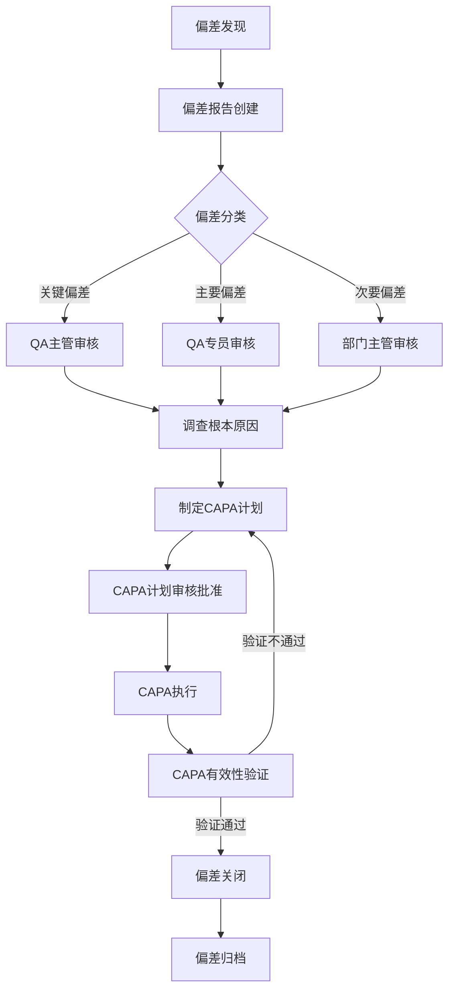
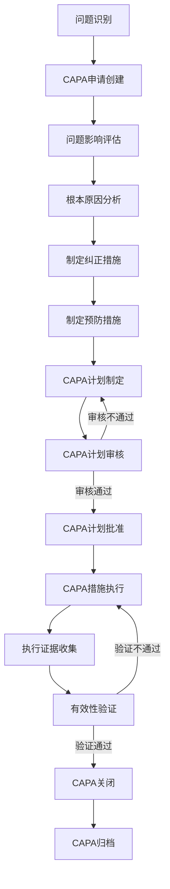
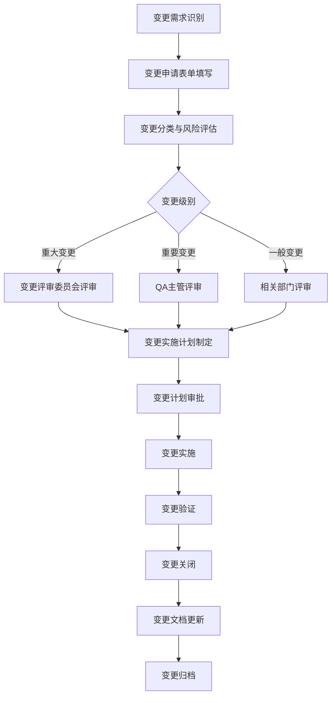
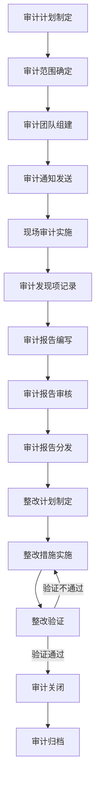
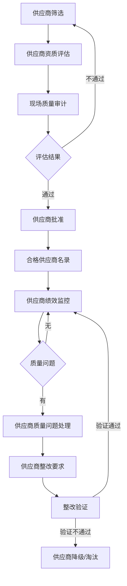
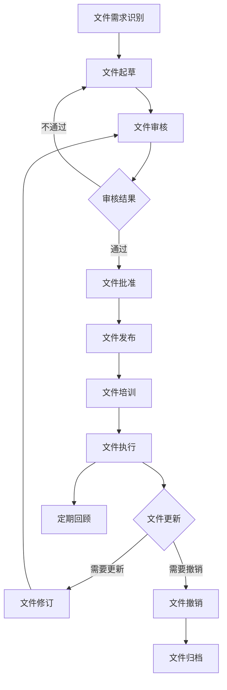

# QMS子系统（质量管理系统）业务流程描述

## 文档信息
- **版本号**：v1.0.0-draft
- **创建日期**：2024年
- **审核状态**：待审核
- **保密级别**：内部使用

## 1. 概述
本文档详细描述QMS（质量管理系统）的核心业务流程，包括流程步骤、涉及角色、流程规则和系统交互。这些业务流程遵循GMP（药品生产质量管理规范）的要求，确保产品质量符合法规标准，同时提高质量管理的效率和可追溯性。

## 2. 业务流程图

### 2.1 偏差管理流程

### 2.2 CAPA管理流程

### 2.3 变更控制流程

### 2.4 质量审计管理流程

### 2.5 供应商质量管理流程

### 2.6 质量文件管理流程

## 3. 流程详细描述

### 3.1 偏差管理流程

**流程目标**：及时发现、报告、调查和解决生产和质量管理过程中的偏差，确保产品质量和GMP合规性。

**流程步骤**：

1. **偏差发现**
   - 操作人员或质量人员发现与预期标准、程序或结果的偏离
   - 立即通知直接上级和质量部门

2. **偏差报告创建**
   - 发现人或指定人员在系统中创建偏差报告
   - 记录偏差发现的时间、地点、现象描述和可能的影响
   - 上传相关证据和照片

3. **偏差分类**
   - QA专员根据偏差的性质、范围和影响对偏差进行分类
   - 分类为关键偏差、主要偏差或次要偏差
   - 系统自动根据预定义规则进行初步分类，由QA专员确认

4. **偏差审核**
   - 根据偏差类别，由相应级别的人员进行审核
   - 审核内容包括偏差描述的完整性、初步评估的准确性等
   - 审核人可要求补充信息或直接进入调查阶段

5. **调查根本原因**
   - 成立调查小组，对偏差进行深入调查
   - 使用适当的工具（如鱼骨图、5Why分析等）分析根本原因
   - 记录调查过程和结果

6. **制定CAPA计划**
   - 基于根本原因分析，制定纠正和预防措施
   - 明确责任人和完成时间
   - 关联相关的质量管理活动

7. **CAPA计划审核批准**
   - QA主管审核CAPA计划的合理性和有效性
   - 必要时提交高级管理层批准

8. **CAPA执行**
   - 责任人按计划执行纠正和预防措施
   - 定期更新执行进度
   - 收集执行证据

9. **CAPA有效性验证**
   - QA人员验证CAPA措施的执行情况和有效性
   - 确认是否解决了根本原因，是否防止了类似问题再次发生
   - 记录验证结果

10. **偏差关闭**
    - 验证通过后，由QA主管批准关闭偏差
    - 总结整个偏差处理过程

11. **偏差归档**
    - 系统自动归档完整的偏差记录
    - 保留所有相关的证据和文档

**涉及角色**：操作人员、QA专员、QA主管、部门主管、CAPA执行人

**流程规则**：
- 关键偏差必须在24小时内完成初步报告
- 偏差调查必须在规定时间内完成（关键偏差5个工作日，主要偏差10个工作日）
- 所有偏差处理步骤必须有完整记录和电子签名
- 偏差关闭前必须完成CAPA有效性验证

### 3.2 CAPA管理流程

**流程目标**：系统性地解决已识别的质量问题，防止问题重复发生，持续改进质量管理体系。

**流程步骤**：

1. **问题识别**
   - 从偏差、客户投诉、审计发现、质量趋势分析等来源识别质量问题
   - 评估问题的严重性和影响范围

2. **CAPA申请创建**
   - 在系统中创建CAPA申请
   - 描述问题背景、发现方式和初步影响

3. **问题影响评估**
   - 评估问题对产品质量、患者安全和法规合规性的影响
   - 确定问题的优先级

4. **根本原因分析**
   - 组织相关人员进行根本原因分析
   - 使用适当的分析工具和方法
   - 记录分析过程和结果

5. **制定纠正措施**
   - 针对已发生的问题制定纠正措施
   - 明确措施的具体内容、责任人和完成时间

6. **制定预防措施**
   - 针对根本原因制定预防措施，防止类似问题再次发生
   - 考虑系统性的改进方案

7. **CAPA计划制定**
   - 整合纠正和预防措施，形成完整的CAPA计划
   - 设置里程碑和检查点

8. **CAPA计划审核**
   - QA专员和相关部门审核CAPA计划
   - 评估措施的可行性、有效性和资源需求

9. **CAPA计划批准**
   - QA主管或高级管理层批准CAPA计划
   - 确认计划的实施范围和权限

10. **CAPA措施执行**
    - 责任人按照计划执行各项措施
    - 定期更新执行进度和遇到的问题

11. **执行证据收集**
    - 收集措施执行的相关证据和记录
    - 确保所有执行过程可追溯

12. **有效性验证**
    - QA人员验证措施的执行情况和有效性
    - 确认问题是否得到有效解决，预防措施是否有效

13. **CAPA关闭**
    - 验证通过后，关闭CAPA
    - 总结CAPA处理过程和经验教训

14. **CAPA归档**
    - 系统自动归档完整的CAPA记录
    - 保留所有相关文档和证据

**涉及角色**：QA专员、QA主管、部门主管、CAPA执行人、相关部门代表

**流程规则**：
- CAPA计划必须在问题识别后30天内完成制定
- 所有CAPA措施必须有明确的责任人和完成时间
- CAPA执行进度必须定期更新，逾期项目系统自动提醒
- CAPA有效性验证必须在措施执行完成后10个工作日内进行

### 3.3 变更控制流程

**流程目标**：确保所有影响产品质量的变更经过适当的评估、批准、实施和验证，维持GMP合规性。

**流程步骤**：

1. **变更需求识别**
   - 相关部门识别需要进行的变更
   - 变更可以涉及工艺、设备、物料、文件、系统等多个方面

2. **变更申请表单填写**
   - 变更申请人在系统中填写变更申请
   - 描述变更的具体内容、原因和预期效果

3. **变更分类与风险评估**
   - QA人员对变更进行分类（重大、重要、一般）
   - 评估变更对产品质量、患者安全和法规合规性的潜在风险
   - 确定变更的验证范围和要求

4. **变更评审**
   - 根据变更级别，组织相应级别的评审
   - 评审内容包括变更的必要性、风险控制措施、验证方案等
   - 相关部门代表参与评审

5. **变更实施计划制定**
   - 基于评审意见，制定详细的变更实施计划
   - 包括时间表、责任分配、资源需求和验证方案

6. **变更计划审批**
   - 高级管理层或QA主管审批变更实施计划
   - 确认计划的可行性和充分性

7. **变更实施**
   - 按照批准的计划执行变更
   - 实施过程中进行必要的培训和沟通
   - 记录实施过程和遇到的问题

8. **变更验证**
   - 执行预定义的验证活动
   - 收集和分析验证数据
   - 确认变更达到预期效果且无负面影响

9. **变更关闭**
   - 验证通过后，关闭变更申请
   - 总结变更实施的经验教训

10. **变更文档更新**
    - 更新相关的质量文件、标准操作规程等
    - 确保所有文档与变更后的状态一致

11. **变更归档**
    - 系统自动归档完整的变更记录
    - 保留所有相关文档和证据

**涉及角色**：变更申请人、QA专员、QA主管、高级管理层、变更评审委员会成员、变更执行人

**流程规则**：
- 重大变更必须组织正式的评审会议并获得高层批准
- 变更实施前必须完成相关人员的培训
- 变更验证必须有完整的方案和报告
- 变更后必须进行文件的同步更新

### 3.4 质量审计管理流程

**流程目标**：通过系统的内部和外部审计，评估质量管理体系的有效性和合规性，识别改进机会。

**流程步骤**：

1. **审计计划制定**
   - 质量审核员制定年度审计计划
   - 确定审计的范围、频率和优先级

2. **审计范围确定**
   - 明确审计的具体内容、部门和流程
   - 制定详细的审计检查表

3. **审计团队组建**
   - 选择合适的审计人员组成审计团队
   - 确保团队成员具备必要的专业知识和独立性

4. **审计通知发送**
   - 提前通知被审计部门审计的时间和范围
   - 收集必要的背景资料

5. **现场审计实施**
   - 召开审计启动会议
   - 执行现场检查、文件审核和人员访谈
   - 记录审计发现和观察结果

6. **审计发现项记录**
   - 对发现的问题进行记录和分类
   - 确定问题的严重程度和整改优先级

7. **审计报告编写**
   - 编写详细的审计报告
   - 包含审计范围、方法、发现项和建议

8. **审计报告审核**
   - QA主管审核审计报告的准确性和完整性
   - 必要时提交高级管理层审阅

9. **审计报告分发**
   - 将审计报告分发给相关部门和管理层
   - 明确整改要求和期限

10. **整改计划制定**
    - 被审计部门制定整改计划
    - 明确整改措施、责任人和完成时间

11. **整改措施实施**
    - 被审计部门按照计划实施整改措施
    - 定期向质量部门汇报整改进度

12. **整改验证**
    - 质量审核员验证整改措施的执行情况和有效性
    - 确认问题是否得到彻底解决

13. **审计关闭**
    - 所有整改验证通过后，关闭审计
    - 总结审计经验和改进成果

14. **审计归档**
    - 系统自动归档完整的审计记录
    - 保留所有相关文档和证据

**涉及角色**：质量审核员、QA主管、高级管理层、被审计部门负责人、整改责任人

**流程规则**：
- 内部审计必须覆盖所有关键部门和流程，频率至少每年一次
- 关键发现项必须在15个工作日内完成整改计划制定
- 整改验证必须有客观证据支持
- 审计报告必须包含明确的整改要求和期限

### 3.5 供应商质量管理流程

**流程目标**：确保供应商提供的物料和服务符合质量要求，维护供应链的质量安全。

**流程步骤**：

1. **供应商筛选**
   - 根据物料或服务需求，筛选潜在供应商
   - 收集供应商的基本信息和资质证明

2. **供应商资质评估**
   - 对潜在供应商进行资质审核
   - 评估供应商的质量管理体系、生产能力和历史业绩

3. **现场质量审计**
   - 对关键物料的供应商进行现场审计
   - 评估供应商的生产条件、质量控制和合规状况

4. **供应商批准**
   - 基于评估和审计结果，决定是否批准供应商
   - 批准的供应商列入合格供应商名录

5. **合格供应商名录管理**
   - 维护和更新合格供应商名录
   - 定期审查供应商的资格

6. **供应商绩效监控**
   - 定期评估供应商的质量表现、交付能力和服务水平
   - 收集和分析供应商质量数据

7. **供应商质量问题处理**
   - 当发现供应商质量问题时，启动问题处理流程
   - 记录问题详情，评估影响范围

8. **供应商整改要求**
   - 向供应商提出整改要求
   - 明确整改期限和验收标准

9. **整改验证**
   - 验证供应商的整改措施和效果
   - 确认问题是否得到有效解决

10. **供应商降级/淘汰**
    - 对整改不力或多次出现质量问题的供应商进行降级或淘汰
    - 更新合格供应商名录

**涉及角色**：采购人员、QA专员、QA主管、供应商管理专员、质量审核员

**流程规则**：
- 关键物料的供应商必须通过现场审计
- 合格供应商必须定期复审，频率至少每两年一次
- 供应商质量问题必须在发现后5个工作日内通知供应商
- 重大质量问题的供应商必须暂停使用，直至整改验证通过

### 3.6 质量文件管理流程

**流程目标**：确保所有质量文件的创建、审核、批准、发布、执行和更新符合规范，维护文件的有效性和版本控制。

**流程步骤**：

1. **文件需求识别**
   - 相关部门识别文件需求
   - 确定文件类型、范围和目的

2. **文件起草**
   - 指定人员起草文件
   - 按照标准模板和格式编写

3. **文件审核**
   - 相关部门和QA人员审核文件内容
   - 确保文件内容准确、完整且符合法规要求

4. **文件批准**
   - 授权人员批准文件
   - 批准人进行电子签名

5. **文件发布**
   - 系统自动发布文件
   - 通知相关人员文件已发布

6. **文件培训**
   - 对需要执行文件的人员进行培训
   - 记录培训完成情况

7. **文件执行**
   - 相关人员按照文件要求执行工作
   - 确保实际操作与文件规定一致

8. **文件更新**
   - 当需要更改文件内容时，启动文件修订流程
   - 记录修订原因和内容变更

9. **文件撤销**
   - 当文件不再适用时，执行撤销流程
   - 通知相关人员文件已撤销

10. **文件归档**
    - 对已撤销或更新的文件进行归档
    - 保留历史版本以供查阅

11. **定期回顾**
    - 定期回顾文件的适用性和有效性
    - 及时识别需要更新的文件

**涉及角色**：文件起草人、审核人、批准人、QA专员、培训管理员、文件执行人

**流程规则**：
- 所有质量文件必须经过审核和批准才能发布
- 文件必须有唯一编号和版本号
- 文件更新后必须重新进行审核和批准
- 已撤销的文件不得继续使用，必须从工作场所收回

### 3.7 培训管理流程

**流程目标**：确保员工具备必要的质量意识和技能，能够按照规定的要求执行工作。

**流程步骤**：

1. **培训需求分析**
   - 识别员工的培训需求
   - 基于岗位职责、法规要求和系统变更

2. **培训计划制定**
   - 制定年度培训计划
   - 明确培训内容、对象、时间和方式

3. **培训教材准备**
   - 开发或选择适合的培训教材
   - 确保教材内容符合培训目标

4. **培训实施**
   - 按照计划执行培训
   - 记录培训过程和参与情况

5. **培训效果评估**
   - 通过考试、实操演示等方式评估培训效果
   - 确保员工掌握必要的知识和技能

6. **培训记录管理**
   - 维护员工培训记录
   - 记录培训内容、时间、结果和有效期

7. **培训到期提醒**
   - 系统自动提醒即将到期的培训
   - 确保员工及时参加复训

8. **培训效果跟踪**
   - 定期跟踪培训在实际工作中的应用情况
   - 识别需要改进的培训内容和方法

**涉及角色**：培训管理员、QA专员、部门主管、培训师、员工

**流程规则**：
- 所有员工必须接受GMP基础知识培训
- 特定岗位员工必须接受岗位操作培训
- 培训记录必须完整保存，至少保留至员工离职后5年
- 关键岗位培训必须定期复训，频率至少每年一次

### 3.8 客户投诉处理流程

**流程目标**：及时、有效地处理客户投诉，维护客户关系，防止类似问题再次发生。

**流程步骤**：

1. **投诉接收**
   - 通过电话、邮件、信函等方式接收客户投诉
   - 记录投诉的基本信息和详细内容

2. **投诉分类与评估**
   - 对投诉进行分类（质量投诉、服务投诉等）
   - 评估投诉的严重程度和影响范围

3. **投诉调查**
   - 组织相关部门进行调查
   - 收集和分析相关数据和证据

4. **投诉处理方案制定**
   - 基于调查结果，制定处理方案
   - 包括客户沟通、补救措施和纠正预防措施

5. **投诉处理实施**
   - 执行处理方案
   - 与客户进行沟通，提供解决方案

6. **投诉处理效果评估**
   - 评估投诉处理的效果和客户满意度
   - 确认问题是否得到彻底解决

7. **投诉关闭**
   - 客户满意后，关闭投诉
   - 总结投诉处理经验

8. **投诉数据分析**
   - 定期分析投诉数据，识别趋势和系统性问题
   - 提出改进建议

**涉及角色**：客户服务人员、QA专员、相关部门代表、高级管理层

**流程规则**：
- 严重投诉必须在24小时内启动调查
- 投诉调查必须在5个工作日内完成
- 所有投诉必须有完整记录和处理跟踪
- 客户投诉必须定期回顾，识别改进机会

## 4. 流程规则和约束

### 4.1 GMP合规要求
- 所有质量管理流程必须符合药品生产质量管理规范的要求
- 关键流程必须有明确的职责划分和权限控制
- 所有操作必须有完整记录，确保可追溯性
- 偏差、变更等关键活动必须经过适当的审核和批准

### 4.2 数据完整性要求
- 所有质量数据必须真实、准确、完整、一致和可追溯
- 数据录入、修改和删除必须有记录和审批
- 关键数据必须有电子签名确认
- 系统必须具备审计追踪功能，记录所有数据变更

### 4.3 时间要求
- 关键偏差报告必须在24小时内提交
- 变更评估必须在10个工作日内完成
- CAPA计划必须在问题识别后30天内完成
- 投诉调查必须在5个工作日内完成

### 4.4 权限控制要求
- 不同角色具有不同的系统操作权限
- 关键操作必须有双人审核机制
- 电子签名必须符合FDA 21 CFR Part 11的要求
- 权限分配必须基于岗位职责和最小必要原则

### 4.5 文档管理要求
- 所有质量文档必须有唯一编号和版本控制
- 文档必须经过审核和批准才能生效
- 文档变更必须记录原因和内容
- 文档必须定期回顾和更新

## 5. 相关系统集成

### 5.1 与设备管理系统集成
- 从设备管理系统获取设备维护、校准和验证数据
- 将设备相关的偏差和变更通知设备管理系统
- 共享设备状态和历史数据，用于质量分析

### 5.2 与MES系统集成
- 从MES系统获取生产执行数据，用于质量分析
- 向MES系统提供质量参数和检验标准
- 共享生产偏差和质量异常信息

### 5.3 与LIMS系统集成
- 从LIMS系统获取实验室检验数据和结果
- 向LIMS系统提供检验标准和方法
- 共享质量控制相关的参数和要求

### 5.4 与ERP系统集成
- 从ERP系统获取供应商、物料和订单信息
- 向ERP系统提供合格供应商和物料信息
- 共享质量相关的财务影响数据

### 5.5 与培训管理系统集成
- 从培训管理系统获取员工培训记录和资质信息
- 向培训管理系统提供质量培训需求和内容
- 共享培训完成情况，用于权限管理

## 6. 附录

### 6.1 术语定义
- **偏差**：偏离已批准的标准、程序或预期结果的情况
- **CAPA**：纠正措施和预防措施，用于系统性地解决和防止质量问题
- **变更控制**：对影响产品质量的变更进行评估、批准、实施和验证的系统
- **审计**：系统、独立地评估质量管理体系的过程
- **GMP**：药品生产质量管理规范，确保药品质量符合要求的指导原则
- **偏差分类**：将偏差分为关键、主要和次要的过程
- **电子签名**：符合法规要求的电子形式的个人签名
- **审计追踪**：记录系统中数据变更的历史记录

### 6.2 参考文档
- 《QMS子系统总体需求.md》
- 《QMS子系统角色权限矩阵.md》
- 《QMS子系统用户故事.md》
- 《药品生产质量管理规范》
- 《FDA 21 CFR Part 11》

### 6.3 联系方式
- **质量管理部门**：负责流程解释和执行监督
- **IT开发部门**：负责系统支持和技术问题解决
- **质量合规部门**：负责流程合规性评估和审计