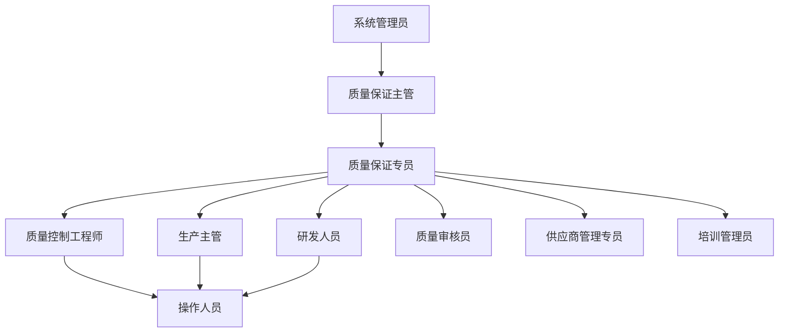
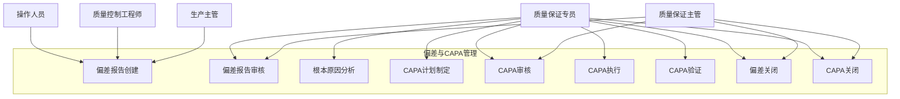
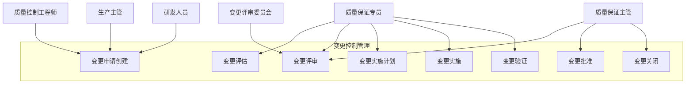

# QMS子系统（质量管理系统）用例图和用例描述

## 文档信息
- **版本号**：v1.0.0-draft
- **创建日期**：2024年
- **审核状态**：待审核
- **保密级别**：内部使用

## 1. 概述
本文档通过用例图和用例描述的方式，详细展示QMS（质量管理系统）的功能场景、参与者及其交互关系。用例图直观地呈现系统的功能边界和用户交互，而用例描述则详细说明每个功能的执行流程、前置条件、后置条件和异常处理，为系统设计和开发提供清晰的指导。

## 2. 用户角色定义

### 2.1 系统管理员 (System Administrator)
- **描述**：负责系统的配置、维护和用户权限管理
- **主要职责**：用户账户管理、权限分配、系统参数配置、日志管理

### 2.2 质量保证主管 (QA Supervisor)
- **描述**：负责质量管理体系的整体监督和重大决策
- **主要职责**：偏差审核、CAPA批准、变更审批、质量报表审阅

### 2.3 质量保证专员 (QA Specialist)
- **描述**：执行日常质量管理活动的专业人员
- **主要职责**：偏差处理、CAPA管理、变更控制、质量文档管理

### 2.4 质量控制工程师 (QC Engineer)
- **描述**：负责实验室测试和质量控制数据分析
- **主要职责**：检验数据录入、偏差报告、变更申请

### 2.5 生产主管 (Production Supervisor)
- **描述**：负责生产部门的质量相关活动协调
- **主要职责**：偏差报告、变更申请、CAPA执行

### 2.6 操作人员 (Operator)
- **描述**：一线生产和检验人员
- **主要职责**：偏差报告、日常检查记录、培训参与

### 2.7 研发人员 (R&D Personnel)
- **描述**：参与产品开发和工艺研究的人员
- **主要职责**：变更申请、技术文档管理、验证执行

### 2.8 质量审核员 (Quality Auditor)
- **描述**：负责内部和外部质量审核的专业人员
- **主要职责**：审计计划制定、审计执行、发现项跟踪

### 2.9 供应商管理专员 (Supplier Management Specialist)
- **描述**：负责供应商质量管理的专业人员
- **主要职责**：供应商评估、质量问题处理、绩效监控

### 2.10 培训管理员 (Training Administrator)
- **描述**：负责员工质量培训管理的人员
- **主要职责**：培训计划制定、培训记录管理、培训效果评估

## 3. 角色关系图

## 4. 系统用例图

### 4.1 总体用例图

```mermaid
flowchart TD
    subgraph QMS系统
        UM[用户管理]
        PM[权限管理]
        DM[偏差管理]
        CM[CAPA管理]
        CCM[变更控制管理]
        QAM[质量审计管理]
        SQM[供应商质量管理]
        QFM[质量文件管理]
        TM[培训管理]
        CRM[客户投诉管理]
        SYS_M[系统管理]
    end
    
    SA[系统管理员] --> UM
    SA --> PM
    SA --> SYS_M
    
    QA_S[质量保证主管] --> DM
    QA_S --> CM
    QA_S --> CCM
    QA_S --> QAM
    QA_S --> SQM
    QA_S --> QFM
    
    QA_SP[质量保证专员] --> DM
    QA_SP --> CM
    QA_SP --> CCM
    QA_SP --> QAM
    QA_SP --> SQM
    QA_SP --> QFM
    QA_SP --> TM
    QA_SP --> CRM
    
    QC_E[质量控制工程师] --> DM
    QC_E --> CCM
    QC_E --> SQM
    
    P_S[生产主管] --> DM
    P_S --> CCM
    P_S --> CM
    P_S --> TM
    
    OP[操作人员] --> DM
    OP --> TM
    
    R_D[研发人员] --> CCM
    R_D --> QFM
    
    Q_A[质量审核员] --> QAM
    Q_A --> DM
    Q_A --> CM
    
    S_MS[供应商管理专员] --> SQM
    
    T_A[培训管理员] --> TM
```

### 4.2 偏差与CAPA管理用例图

### 4.3 变更控制管理用例图

## 5. 用例详细描述

### 5.1 偏差管理

#### 5.1.1 用例：创建偏差报告
- **用例ID**：UC-QMS-DM-001
- **用例名称**：创建偏差报告
- **参与者**：操作人员、质量控制工程师、生产主管
- **前置条件**：
  - 参与者具备创建偏差报告的权限
  - 系统正常运行
- **后置条件**：
  - 偏差报告成功创建并分配唯一编号
  - 相关人员收到通知
- **主流程**：
  1. 参与者登录系统
  2. 选择"创建偏差报告"功能
  3. 填写偏差基本信息（发现时间、地点、描述等）
  4. 上传相关证据（照片、数据等）
  5. 提交偏差报告
  6. 系统生成偏差编号并保存报告
  7. 系统通知质量部门
- **异常流程**：
  - 信息填写不完整：系统提示缺少必要信息，返回步骤3
  - 附件上传失败：系统提示上传失败原因，允许重试

#### 5.1.2 用例：审核偏差报告
- **用例ID**：UC-QMS-DM-002
- **用例名称**：审核偏差报告
- **参与者**：质量保证专员、质量保证主管
- **前置条件**：
  - 有新创建或待审核的偏差报告
  - 参与者具备审核偏差报告的权限
- **后置条件**：
  - 偏差报告状态更新为"已审核"
  - 审核意见和结论被记录
  - 系统通知相关人员
- **主流程**：
  1. 参与者登录系统
  2. 查看待审核的偏差报告列表
  3. 选择一个偏差报告查看详情
  4. 评估偏差的严重程度和影响
  5. 记录审核意见和结论
  6. 执行电子签名
  7. 提交审核结果
  8. 系统更新偏差状态并记录审核信息
  9. 系统通知相关人员
- **异常流程**：
  - 信息不完整：审核人要求补充信息，偏差状态改为"需要补充"
  - 审核不通过：偏差报告退回修改，系统通知报告创建人

### 5.2 CAPA管理

#### 5.2.1 用例：制定CAPA计划
- **用例ID**：UC-QMS-CM-001
- **用例名称**：制定CAPA计划
- **参与者**：质量保证专员、相关部门代表
- **前置条件**：
  - 已有审核通过的偏差或问题
  - 参与者具备制定CAPA计划的权限
- **后置条件**：
  - CAPA计划成功创建
  - 计划内容被记录并分配责任人
- **主流程**：
  1. 参与者登录系统
  2. 选择"制定CAPA计划"功能
  3. 关联相关的偏差或问题
  4. 填写CAPA计划详情（根本原因、纠正措施、预防措施等）
  5. 分配责任人和计划完成时间
  6. 提交CAPA计划
  7. 系统保存计划并等待审核
- **异常流程**：
  - 信息填写不完整：系统提示缺少必要信息，返回步骤4
  - 责任人不存在：系统提示选择有效责任人

#### 5.2.2 用例：执行CAPA措施
- **用例ID**：UC-QMS-CM-002
- **用例名称**：执行CAPA措施
- **参与者**：CAPA责任人（各部门人员）
- **前置条件**：
  - 有已批准的CAPA计划分配给当前用户
  - 参与者具备执行CAPA措施的权限
- **后置条件**：
  - CAPA执行进度被更新
  - 执行证据被记录
- **主流程**：
  1. 参与者登录系统
  2. 查看分配给自己的CAPA任务
  3. 选择一个CAPA任务开始执行
  4. 记录执行过程和结果
  5. 上传执行证据
  6. 更新执行状态
  7. 提交执行报告
  8. 系统保存执行记录并更新CAPA状态
- **异常流程**：
  - 执行延期：参与者记录延期原因，申请调整时间
  - 执行遇到问题：参与者记录问题，请求支持

### 5.3 变更控制管理

#### 5.3.1 用例：提交变更申请
- **用例ID**：UC-QMS-CCM-001
- **用例名称**：提交变更申请
- **参与者**：质量控制工程师、生产主管、研发人员
- **前置条件**：
  - 参与者具备提交变更申请的权限
  - 系统正常运行
- **后置条件**：
  - 变更申请成功创建并分配唯一编号
  - 质量部门收到通知
- **主流程**：
  1. 参与者登录系统
  2. 选择"提交变更申请"功能
  3. 填写变更申请信息（变更描述、原因、影响等）
  4. 上传相关支持文件
  5. 提交变更申请
  6. 系统生成变更编号并保存申请
  7. 系统通知质量部门进行评估
- **异常流程**：
  - 信息填写不完整：系统提示缺少必要信息，返回步骤3
  - 文件格式不符：系统提示支持的文件格式

#### 5.3.2 用例：变更评审会议
- **用例ID**：UC-QMS-CCM-002
- **用例名称**：变更评审会议
- **参与者**：质量保证专员、质量保证主管、相关部门代表、变更评审委员会成员
- **前置条件**：
  - 有已评估的变更申请需要评审
  - 参与者具备参加变更评审的权限
- **后置条件**：
  - 变更评审结果被记录
  - 系统更新变更状态
- **主流程**：
  1. 质量保证专员安排评审会议
  2. 系统通知相关人员参加会议
  3. 参会人员登录系统，进入会议模块
  4. 主持人介绍变更内容和评估结果
  5. 参会人员讨论并提出意见
  6. 记录评审结论和决策
  7. 参会人员通过电子签名确认
  8. 系统保存评审记录并更新变更状态
- **异常流程**：
  - 评审未达成一致：会议延期或升级决策
  - 关键人员缺席：重新安排会议或采用其他方式收集意见

### 5.4 质量审计管理

#### 5.4.1 用例：制定审计计划
- **用例ID**：UC-QMS-QAM-001
- **用例名称**：制定审计计划
- **参与者**：质量审核员、质量保证主管
- **前置条件**：
  - 参与者具备制定审计计划的权限
  - 系统中有可用的审计资源和模板
- **后置条件**：
  - 审计计划成功创建
  - 相关人员收到审计通知
- **主流程**：
  1. 质量审核员登录系统
  2. 选择"制定审计计划"功能
  3. 填写审计计划信息（目的、范围、时间、人员等）
  4. 制定审计检查表
  5. 提交审计计划给质量保证主管审核
  6. 质量保证主管审核并批准计划
  7. 系统保存计划并通知相关部门
- **异常流程**：
  - 计划审核不通过：质量保证主管提出修改意见，返回修改
  - 资源冲突：系统提示资源冲突，需要调整时间或人员

#### 5.4.2 用例：记录审计发现项
- **用例ID**：UC-QMS-QAM-002
- **用例名称**：记录审计发现项
- **参与者**：质量审核员
- **前置条件**：
  - 审计正在进行中
  - 参与者是当前审计的成员
- **后置条件**：
  - 审计发现项被记录在系统中
  - 发现项状态为"待整改"
- **主流程**：
  1. 质量审核员登录系统
  2. 进入当前审计项目
  3. 选择"记录发现项"功能
  4. 填写发现项详情（问题描述、严重程度、位置等）
  5. 上传相关证据
  6. 提交发现项记录
  7. 系统保存发现项并更新审计进度
- **异常流程**：
  - 信息填写不完整：系统提示缺少必要信息，返回步骤4
  - 证据上传失败：系统提示上传失败原因，允许重试

### 5.5 供应商质量管理

#### 5.5.1 用例：供应商评估
- **用例ID**：UC-QMS-SQM-001
- **用例名称**：供应商评估
- **参与者**：供应商管理专员、质量保证专员、质量审核员
- **前置条件**：
  - 有潜在供应商需要评估
  - 参与者具备供应商评估的权限
- **后置条件**：
  - 供应商评估结果被记录
  - 供应商状态被更新
- **主流程**：
  1. 供应商管理专员登录系统
  2. 选择"供应商评估"功能
  3. 创建供应商评估记录
  4. 收集供应商资质和相关信息
  5. 执行现场审计（如适用）
  6. 填写评估结果和结论
  7. 提交评估报告给质量保证主管审核
  8. 审核通过后，更新供应商状态
- **异常流程**：
  - 评估信息不足：要求补充信息，暂停评估
  - 评估不通过：供应商被标记为不合格

#### 5.5.2 用例：供应商质量问题处理
- **用例ID**：UC-QMS-SQM-002
- **用例名称**：供应商质量问题处理
- **参与者**：供应商管理专员、质量保证专员、采购人员
- **前置条件**：
  - 发现供应商提供的物料或服务存在质量问题
  - 参与者具备处理供应商质量问题的权限
- **后置条件**：
  - 供应商质量问题记录被创建
  - 整改要求被发送给供应商
- **主流程**：
  1. 参与者登录系统
  2. 选择"记录供应商质量问题"功能
  3. 填写问题详情（描述、影响、发现方式等）
  4. 选择相关供应商和物料
  5. 制定整改要求和期限
  6. 提交问题记录
  7. 系统保存记录并通知相关人员和供应商
- **异常流程**：
  - 问题描述不清：系统提示补充详细信息
  - 供应商不存在：系统提示选择有效供应商

### 5.6 质量文件管理

#### 5.6.1 用例：创建质量文件
- **用例ID**：UC-QMS-QFM-001
- **用例名称**：创建质量文件
- **参与者**：质量保证专员、研发人员、相关部门文档负责人
- **前置条件**：
  - 参与者具备创建质量文件的权限
  - 系统中有可用的文件模板
- **后置条件**：
  - 质量文件草稿成功创建
  - 文件处于"待审核"状态
- **主流程**：
  1. 参与者登录系统
  2. 选择"创建质量文件"功能
  3. 选择文件类型和模板
  4. 填写文件内容
  5. 添加版本信息和修订历史
  6. 提交文件进行审核
  7. 系统保存文件并通知审核人
- **异常流程**：
  - 内容格式不符：系统提示格式要求
  - 模板选择错误：允许返回重新选择

#### 5.6.2 用例：文件审批
- **用例ID**：UC-QMS-QFM-002
- **用例名称**：文件审批
- **参与者**：质量保证主管、授权审批人
- **前置条件**：
  - 有待审批的质量文件
  - 参与者是指定的审批人
- **后置条件**：
  - 文件状态更新为"已批准"或"已拒绝"
  - 审批意见被记录
- **主流程**：
  1. 审批人登录系统
  2. 查看待审批文件列表
  3. 选择一个文件查看内容
  4. 评估文件内容的准确性和合规性
  5. 记录审批意见
  6. 执行电子签名
  7. 提交审批结果
  8. 系统更新文件状态并通知相关人员
- **异常流程**：
  - 文件内容有问题：审批人标记需要修改的地方，拒绝文件
  - 缺少必要信息：要求补充信息后重新提交

### 5.7 培训管理

#### 5.7.1 用例：制定培训计划
- **用例ID**：UC-QMS-TM-001
- **用例名称**：制定培训计划
- **参与者**：培训管理员、质量保证专员、部门主管
- **前置条件**：
  - 参与者具备制定培训计划的权限
  - 系统中有可用的培训资源
- **后置条件**：
  - 培训计划成功创建
  - 相关人员收到培训通知
- **主流程**：
  1. 培训管理员登录系统
  2. 选择"制定培训计划"功能
  3. 填写培训计划信息（主题、目标、内容等）
  4. 设定培训时间、地点和培训师
  5. 选择参训人员
  6. 提交培训计划
  7. 系统保存计划并通知相关人员
- **异常流程**：
  - 资源冲突：系统提示时间或地点冲突
  - 培训师不可用：要求选择其他培训师

#### 5.7.2 用例：记录培训结果
- **用例ID**：UC-QMS-TM-002
- **用例名称**：记录培训结果
- **参与者**：培训管理员、培训师
- **前置条件**：
  - 培训已完成
  - 参与者具备记录培训结果的权限
- **后置条件**：
  - 培训记录被更新
  - 员工培训状态被更新
- **主流程**：
  1. 培训管理员登录系统
  2. 进入已完成的培训项目
  3. 记录参训人员的出勤情况
  4. 录入培训考核结果
  5. 上传培训材料和证据
  6. 提交培训记录
  7. 系统更新员工培训档案
- **异常流程**：
  - 考核未通过：标记需要补考的人员
  - 记录不完整：系统提示补充缺失信息

### 5.8 系统管理

#### 5.8.1 用例：用户账户管理
- **用例ID**：UC-QMS-SYS-001
- **用例名称**：用户账户管理
- **参与者**：系统管理员
- **前置条件**：
  - 参与者具备系统管理员权限
  - 系统正常运行
- **后置条件**：
  - 用户账户信息被成功创建、修改或禁用
  - 系统记录操作日志
- **主流程**：
  1. 系统管理员登录系统
  2. 进入"用户管理"模块
  3. 选择"创建用户"、"修改用户"或"禁用用户"等操作
  4. 填写或修改用户信息
  5. 分配用户角色和权限
  6. 提交操作
  7. 系统执行操作并记录日志
- **异常流程**：
  - 用户信息重复：系统提示用户名已存在
  - 权限分配错误：系统提示无效的权限组合

#### 5.8.2 用例：系统参数配置
- **用例ID**：UC-QMS-SYS-002
- **用例名称**：系统参数配置
- **参与者**：系统管理员、质量保证主管
- **前置条件**：
  - 参与者具备系统配置权限
  - 系统正常运行
- **后置条件**：
  - 系统参数被成功更新
  - 参数变更记录被保存
- **主流程**：
  1. 参与者登录系统
  2. 进入"系统配置"模块
  3. 选择需要配置的参数类别
  4. 查看和修改参数值
  5. 保存参数配置
  6. 系统更新参数并记录变更历史
- **异常流程**：
  - 参数值无效：系统提示参数值的有效范围
  - 配置保存失败：系统提示错误原因，允许重试

## 6. 附录

### 6.1 参考文档
- 《QMS子系统总体需求.md》
- 《QMS子系统角色权限矩阵.md》
- 《QMS子系统用户故事.md》
- 《QMS子系统业务流程描述.md》

### 6.2 术语定义
- **用例**：描述系统如何响应外部请求，展示系统功能和用户交互
- **参与者**：与系统交互的人员或外部系统
- **前置条件**：用例执行前必须满足的条件
- **后置条件**：用例执行后系统达到的状态
- **主流程**：用例的正常执行路径
- **异常流程**：用例执行过程中可能出现的错误或异常情况的处理路径
- **电子签名**：符合法规要求的电子形式的个人签名

### 6.3 联系方式
- **质量管理部门**：负责业务需求解释和流程指导
- **IT开发部门**：负责系统实现和技术支持
- **质量合规部门**：负责法规合规性审核