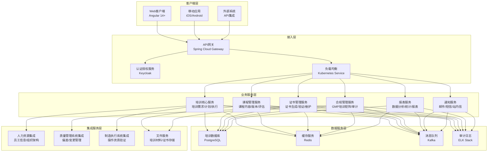
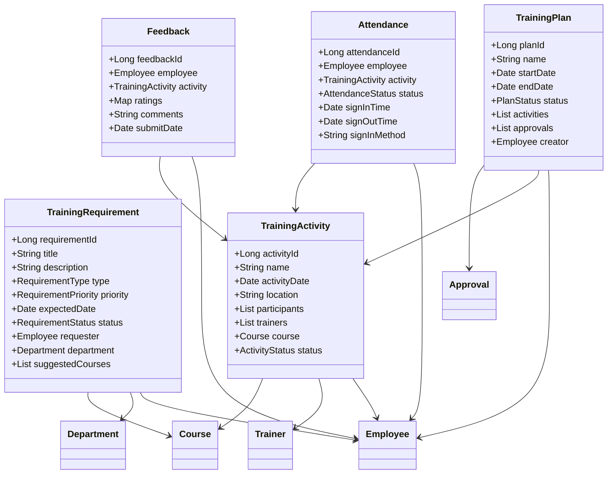
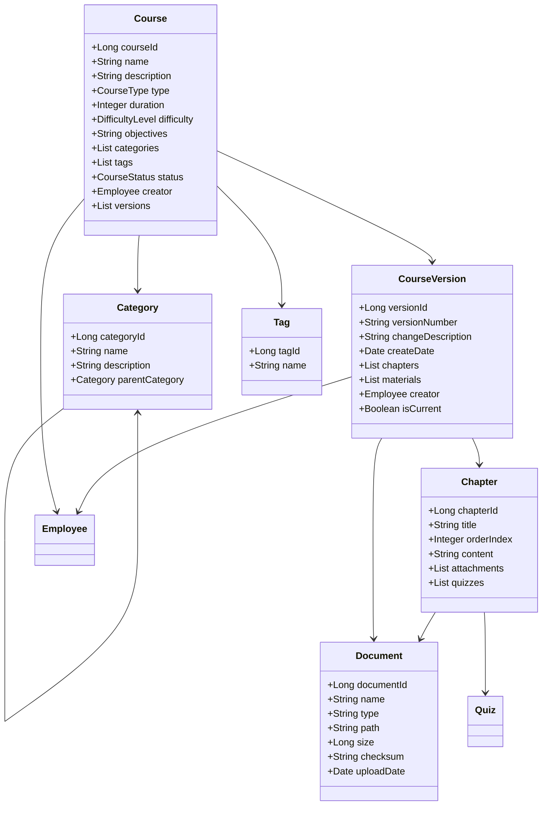
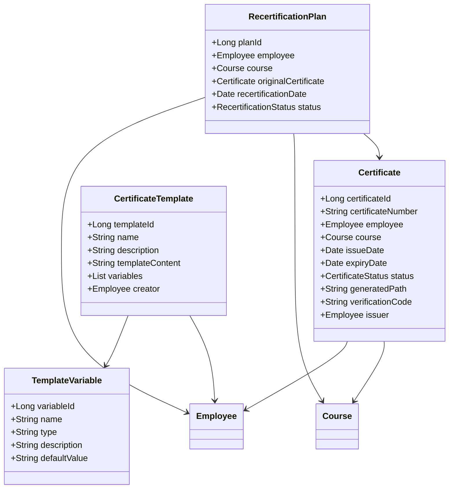
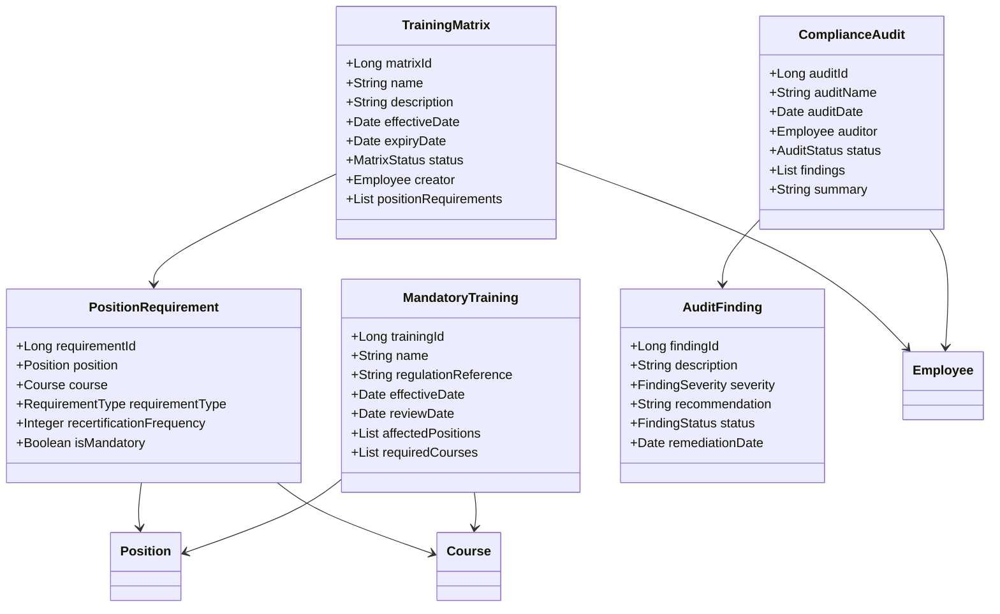
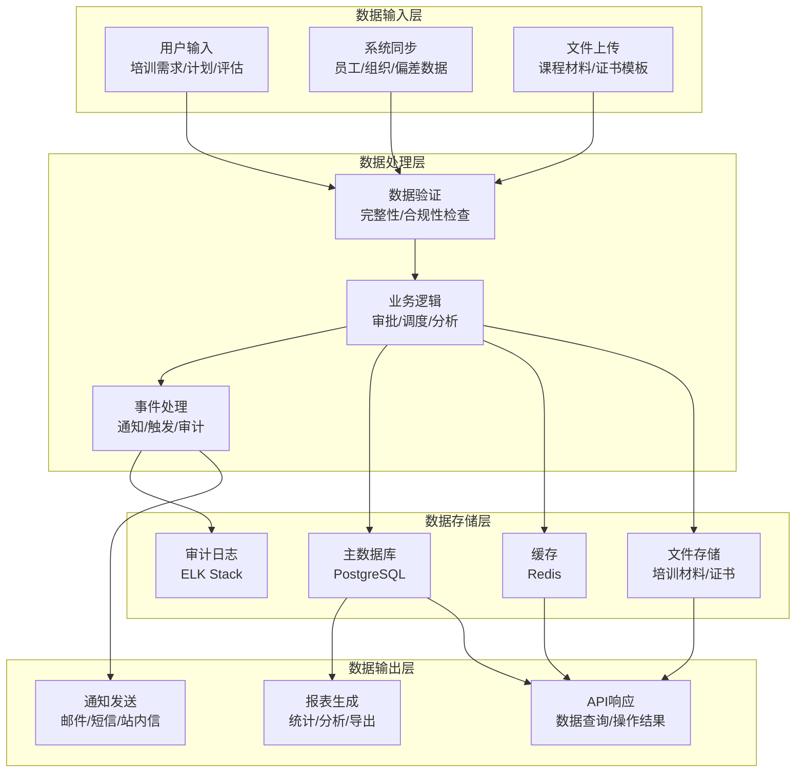
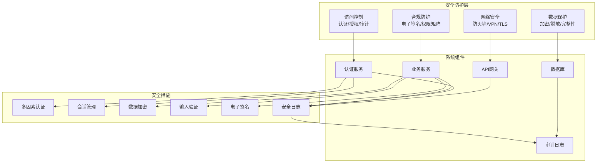
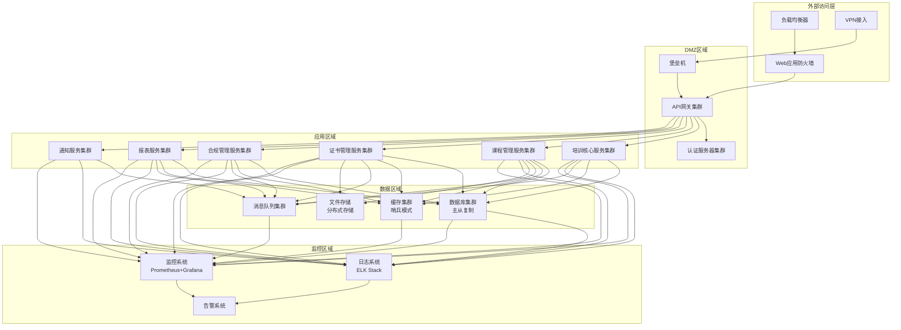

# 培训管理系统架构设计

## 1. 架构概述

### 1.1 文档目的
本文档描述培训管理系统的整体架构设计，包括系统组件、技术栈、层次结构、模块划分和集成方式。该架构设计旨在确保系统具有良好的可扩展性、可维护性、安全性和性能，同时满足GMP合规性要求。

### 1.2 架构原则

| 原则 | 描述 | 实现方式 |
|------|------|----------|
| **合规性优先** | 系统架构必须满足GMP法规要求，确保数据完整性、审计追踪和电子签名等核心功能 | 采用合规性设计模式，实现数据验证、审计日志和电子签名机制 |
| **模块化设计** | 系统采用高度模块化的设计，各功能模块松耦合，便于独立开发、测试和维护 | 基于微服务架构思想，各功能模块通过明确的接口通信 |
| **安全性保障** | 系统架构必须保障数据和系统访问的安全，防止未授权访问和数据泄露 | 实现多层次的安全控制，包括身份认证、授权、加密和防入侵措施 |
| **可扩展性** | 系统架构能够支持业务规模的增长和功能的扩展，无需大规模重构 | 采用可扩展的组件设计，支持水平扩展和功能插件化 |
| **高可用性** | 系统必须保持高可用性，确保关键业务功能不受系统故障的影响 | 实现冗余设计、故障转移和灾难恢复机制 |
| **性能优化** | 系统架构必须支持高效的数据处理和响应，满足业务操作的性能要求 | 采用缓存机制、异步处理和数据库优化等措施 |

## 2. 技术栈选择

### 2.1 核心技术栈

| 类别 | 技术/框架 | 版本 | 用途 | 选择理由 |
|------|----------|------|------|----------|
| **后端语言** | Java | 11+ | 核心业务逻辑开发 | 成熟稳定，生态丰富，企业级应用首选 |
| **前端框架** | Angular | 14+ | 用户界面开发 | 组件化设计，双向数据绑定，支持复杂表单处理 |
| **数据库** | PostgreSQL | 13+ | 核心数据存储 | 支持复杂查询，事务完整性强，符合GMP数据完整性要求 |
| **缓存** | Redis | 6+ | 数据缓存和会话管理 | 高性能，支持多种数据结构，适合缓存培训数据 |
| **消息队列** | Kafka | 3.0+ | 异步消息处理和事件驱动 | 高吞吐量，可持久化，支持事件溯源 |
| **身份认证** | Keycloak | 18+ | 统一身份认证和授权 | 支持OAuth2/OIDC，符合现代安全标准 |
| **API网关** | Spring Cloud Gateway | 3.1+ | API路由和安全控制 | 轻量级，集成Spring生态，支持丰富的过滤功能 |
| **服务注册与发现** | Eureka | 2.0+ | 微服务注册与发现 | 与Spring Cloud生态集成，支持动态服务管理 |
| **配置管理** | Spring Cloud Config | 3.1+ | 集中式配置管理 | 支持配置版本控制和动态更新 |
| **容器化** | Docker | 20.10+ | 应用容器化部署 | 标准化部署，环境一致性 |
| **编排** | Kubernetes | 1.23+ | 容器编排和管理 | 自动化部署，弹性伸缩，高可用 |
| **API文档** | Swagger/OpenAPI | 3.0+ | API接口文档生成 | 自动生成API文档，支持交互式测试 |
| **日志管理** | ELK Stack | 7.x | 日志收集、分析和可视化 | 集中式日志管理，支持复杂查询和告警 |
| **监控告警** | Prometheus + Grafana | 2.x | 系统监控和性能分析 | 强大的指标收集和可视化能力 |

### 2.2 合规性技术

| 类别 | 技术/框架 | 用途 | 实现方式 |
|------|----------|------|----------|
| **电子签名** | 自定义组件 | 数据操作授权验证 | 基于PKI的数字签名，支持多人审批链 |
| **审计追踪** | Spring Data JPA Auditing | 操作日志记录 | 自动记录数据变更历史，包含操作者、时间、操作类型和内容 |
| **数据加密** | AES-256 | 敏感数据保护 | 对个人信息和关键业务数据进行加密存储 |
| **数据完整性** | HMAC校验 | 数据完整性验证 | 对关键数据进行校验，防止篡改 |
| **权限控制** | RBAC + ABAC | 细粒度权限管理 | 结合角色和属性的访问控制，支持复杂权限策略 |

## 3. 系统架构图

### 3.1 整体架构图



### 3.2 分层架构设计

| 层次 | 主要职责 | 关键组件 | 技术实现 |
|------|----------|----------|----------|
| **客户端层** | 用户界面交互 | Web客户端、移动应用、外部系统接入 | Angular、iOS/Android SDK、REST API |
| **接入层** | 安全控制、请求路由 | API网关、身份认证、负载均衡 | Spring Cloud Gateway、Keycloak、Kubernetes Service |
| **业务服务层** | 核心业务逻辑 | 培训核心服务、课程管理、证书管理、合规管理等 | Spring Boot微服务 |
| **数据服务层** | 数据存储、缓存、消息处理 | 数据库、缓存、消息队列、审计日志 | PostgreSQL、Redis、Kafka、ELK Stack |
| **集成服务层** | 外部系统集成 | 人力资源、质量管理、制造执行等系统集成 | REST API、事件驱动、文件服务 |

## 4. 模块架构设计

### 4.1 培训核心服务模块

#### 4.1.1 模块职责
培训核心服务是系统的中心业务模块，负责管理培训需求、培训计划和培训执行的全流程。

#### 4.1.2 子模块设计

| 子模块 | 主要功能 | 关键类/接口 | 依赖关系 |
|--------|----------|-------------|----------|
| **培训需求管理** | 个人需求提报、部门需求汇总、需求分析 | `TrainingRequirementService`<br>`RequirementAnalysisService` | 员工信息、部门信息 |
| **培训计划管理** | 培训计划制定、审批、执行跟踪 | `TrainingPlanService`<br>`PlanApprovalService` | 培训需求、课程信息、资源信息 |
| **培训执行管理** | 培训签到、考勤管理、培训反馈 | `TrainingExecutionService`<br>`AttendanceService`<br>`FeedbackService` | 培训计划、员工信息、评估标准 |
| **培训资源管理** | 培训场地、讲师、设备管理 | `ResourceManagementService`<br>`TrainerService` | 日程安排、资源日历 |
| **培训评估管理** | 培训效果评估、问卷管理 | `EvaluationService`<br>`QuestionnaireService` | 培训执行、课程内容 |

#### 4.1.3 类图



### 4.2 课程管理服务模块

#### 4.2.1 模块职责
课程管理服务负责培训课程的创建、版本控制、内容管理和分类。

#### 4.2.2 子模块设计

| 子模块 | 主要功能 | 关键类/接口 | 依赖关系 |
|--------|----------|-------------|----------|
| **课程内容管理** | 课程基本信息、章节内容管理 | `CourseContentService`<br>`ChapterService` | 文件服务 |
| **课程版本管理** | 课程版本控制、变更历史 | `CourseVersionService`<br>`VersionHistoryService` | 文件版本控制 |
| **课程分类管理** | 课程分类、标签、搜索 | `CourseCategoryService`<br>`CourseSearchService` | 课程元数据 |
| **课程评估标准** | 评估指标、评分标准管理 | `EvaluationCriteriaService` | 培训评估模块 |

#### 4.2.3 类图



### 4.3 证书管理服务模块

#### 4.3.1 模块职责
证书管理服务负责培训证书的生成、发放、验证和有效期管理。

#### 4.3.2 子模块设计

| 子模块 | 主要功能 | 关键类/接口 | 依赖关系 |
|--------|----------|-------------|----------|
| **证书模板管理** | 证书模板设计、变量配置 | `CertificateTemplateService`<br>`TemplateVariableService` | 文件服务 |
| **证书生成与发放** | 电子证书生成、签名、发放 | `CertificateGenerationService`<br>`CertificateDistributionService` | 培训记录、电子签名 |
| **证书验证** | 证书真伪验证、信息查询 | `CertificateVerificationService` | 证书数据存储 |
| **证书有效期管理** | 过期提醒、复训管理 | `CertificateExpiryService`<br>`RecertificationService` | 通知服务 |

#### 4.3.3 类图



### 4.4 合规管理服务模块

#### 4.4.1 模块职责
合规管理服务负责确保培训系统满足GMP法规要求，包括培训矩阵维护、强制性培训管理和审计支持。

#### 4.4.2 子模块设计

| 子模块 | 主要功能 | 关键类/接口 | 依赖关系 |
|--------|----------|-------------|----------|
| **培训矩阵管理** | 岗位培训要求配置、矩阵维护 | `TrainingMatrixService`<br>`PositionRequirementService` | 组织结构、岗位信息 |
| **强制性培训管理** | 法规要求培训识别、跟踪 | `MandatoryTrainingService`<br>`ComplianceTrackerService` | 法规库、培训计划 |
| **审计支持** | 审计跟踪、记录查询、报告生成 | `AuditSupportService`<br>`ComplianceReportService` | 审计日志、培训记录 |
| **法规变更管理** | 法规更新跟踪、影响分析 | `RegulationChangeService`<br>`ImpactAnalysisService` | 法规库、培训矩阵 |

#### 4.4.3 类图



### 4.5 报表服务模块

#### 4.5.1 模块职责
报表服务负责培训数据的统计分析、报表生成和数据可视化。

#### 4.5.2 子模块设计

| 子模块 | 主要功能 | 关键类/接口 | 依赖关系 |
|--------|----------|-------------|----------|
| **数据统计分析** | 培训完成率、覆盖率、满意度分析 | `DataAnalyticsService`<br>`StatisticalService` | 培训记录、评估数据 |
| **报表模板管理** | 预定义报表模板、自定义报表 | `ReportTemplateService`<br>`CustomReportService` | 数据模型、权限系统 |
| **报表生成与导出** | 报表生成、格式转换、导出 | `ReportGenerationService`<br>`ExportService` | 报表模板、数据服务 |
| **数据可视化** | 图表展示、仪表盘设计 | `VisualizationService`<br>`DashboardService` | 分析数据、图表引擎 |

## 5. 集成架构设计

### 5.1 内部系统集成

| 集成点 | 集成系统 | 集成方式 | 数据流向 | 主要功能 |
|--------|----------|----------|----------|----------|
| **员工信息集成** | 人力资源系统 | REST API/WebService | 双向同步 | 员工基本信息、组织架构、岗位信息获取和更新 |
| **权限管理集成** | 认证授权系统 | OAuth2/OIDC | 单向调用 | 用户认证、权限验证、单点登录 |
| **质量管理集成** | 质量管理系统 | 事件驱动/API | 双向同步 | 偏差/变更触发培训、培训完成状态更新 |
| **生产执行集成** | 制造执行系统 | REST API | 单向调用 | 操作资质验证、培训状态查询 |
| **文件管理集成** | 文件服务系统 | REST API | 单向调用 | 培训材料、证书文件存储和获取 |
| **消息通知集成** | 消息服务系统 | 事件驱动/API | 单向调用 | 培训通知、提醒消息发送 |
| **移动应用集成** | 移动应用 | REST API | 双向同步 | 移动端培训功能、签到、通知推送 |

### 5.2 外部系统集成

| 集成点 | 集成系统 | 集成方式 | 数据流向 | 主要功能 |
|--------|----------|----------|----------|----------|
| **外部培训平台集成** | 第三方培训平台 | WebService/API | 双向同步 | 外部课程信息、培训结果同步 |
| **电子签名服务集成** | 第三方签名服务 | API | 单向调用 | 合规电子签名、时间戳服务 |
| **法规库集成** | 行业法规库 | WebService | 单向获取 | 法规更新、合规要求获取 |
| **审计系统集成** | 外部审计系统 | API/数据导出 | 单向提供 | 审计数据提供、报告导出 |

### 5.3 集成架构图

```mermaid
flowchart LR
    subgraph "培训管理系统"[培训管理系统] 
        TrainingCore["培训核心服务"]
        CourseMgr["课程管理服务"]
        CertificateMgr["证书管理服务"]
        ComplianceMgr["合规管理服务"]
    end

    subgraph "内部系统"[内部系统] 
        HR["人力资源系统"]
        Auth["认证授权系统"]
        QMS["质量管理系统"]
        MES["制造执行系统"]
        FileSvc["文件服务"]
        MessageSvc["消息服务"]
        MobileApp["移动应用"]
    end

    subgraph "外部系统"[外部系统] 
        ExtTraining["外部培训平台"]
        SigSvc["电子签名服务"]
        RegLib["法规库"]
        AuditSvc["审计系统"]
    end

    %% 培训核心服务集成
    TrainingCore <--> HR: 员工信息同步
    TrainingCore --> Auth: 认证授权
    TrainingCore <--> QMS: 培训触发/状态更新
    TrainingCore --> MES: 资质验证
    TrainingCore --> MessageSvc: 通知发送
    TrainingCore <--> MobileApp: 培训数据同步
    
    %% 课程管理服务集成
    CourseMgr --> FileSvc: 课程材料存储
    CourseMgr <--> ExtTraining: 外部课程同步
    
    %% 证书管理服务集成
    CertificateMgr --> FileSvc: 证书存储
    CertificateMgr --> SigSvc: 电子签名
    
    %% 合规管理服务集成
    ComplianceMgr <--> QMS: 合规数据同步
    ComplianceMgr --> RegLib: 法规信息获取
    ComplianceMgr --> AuditSvc: 审计数据提供
    ComplianceMgr --> HR: 岗位信息获取
```

## 6. 数据流设计

### 6.1 核心数据流

| 数据实体 | 数据流向 | 处理方式 | 存储位置 | 安全级别 |
|----------|----------|----------|----------|----------|
| **培训需求数据** | 员工/部门 → 系统 → 培训计划 | 结构化处理、审批流程 | 主数据库 | 中 |
| **培训计划数据** | 培训管理员 → 系统 → 培训活动 | 结构化处理、资源分配 | 主数据库 | 中 |
| **培训执行数据** | 员工/培训管理员 → 系统 → 培训记录 | 实时处理、状态追踪 | 主数据库+缓存 | 高 |
| **课程内容数据** | 培训管理员 → 系统 → 课程库 | 结构化处理、版本控制 | 主数据库+文件存储 | 中 |
| **证书数据** | 系统生成 → 员工/查询者 | 批量生成、异步处理 | 主数据库+文件存储 | 高 |
| **合规数据** | 质量管理 → 系统 → 审计报告 | 结构化处理、分析统计 | 主数据库+审计日志 | 高 |
| **报表数据** | 系统分析 → 报表 → 用户 | 聚合处理、可视化 | 报表缓存 | 中 |

### 6.2 数据流图



## 7. 安全架构设计

### 7.1 安全控制层次

| 层次 | 安全控制措施 | 技术实现 | 目的 |
|------|--------------|----------|------|
| **网络安全** | 防火墙、VPN、SSL/TLS加密 | Kubernetes Network Policies、Ingress TLS | 保护网络传输安全，防止未授权访问 |
| **身份认证** | 多因素认证、单点登录、会话管理 | Keycloak、OAuth2/OIDC | 验证用户身份，确保身份真实性 |
| **授权控制** | 基于角色的访问控制、细粒度权限 | RBAC、ABAC、Spring Security | 确保用户只能访问授权资源 |
| **数据安全** | 敏感数据加密、数据脱敏、数据完整性 | AES-256、HMAC校验、数据脱敏组件 | 保护数据机密性和完整性 |
| **应用安全** | 输入验证、防注入、CSRF防护 | Spring Validation、OWASP库 | 防止应用层攻击 |
| **审计追踪** | 操作日志、变更记录、访问日志 | Spring Data JPA Auditing、ELK Stack | 记录所有关键操作，支持审计和取证 |
| **合规控制** | 电子签名、权限矩阵、数据验证 | 自定义签名组件、合规性检查器 | 确保系统符合GMP等法规要求 |

### 7.2 安全架构图



## 8. 部署架构设计

### 8.1 部署拓扑图



### 8.2 部署配置

| 组件 | 部署规格 | 扩展策略 | 高可用配置 | 备份策略 |
|------|----------|----------|------------|----------|
| **API网关** | 2-4个实例，2核4G/实例 | 基于CPU利用率自动扩展 | 多实例负载均衡，故障自动切换 | 配置文件备份 |
| **认证服务** | 2-3个实例，2核4G/实例 | 基于用户并发数扩展 | 多实例集群，主从复制 | 数据每日备份，配置文件备份 |
| **业务服务** | 3-6个实例，4核8G/实例 | 基于请求量和CPU利用率扩展 | 多实例负载均衡，无状态设计 | 配置文件备份 |
| **数据库** | 1主2从，8核16G/节点 | 垂直扩展 + 读写分离 | 主从复制，自动故障切换 | 每日全量备份，每小时增量备份 |
| **缓存** | 3-5个节点，4核8G/节点 | 基于内存使用量扩展 | 哨兵模式，数据分片 | 定期RDB快照，AOF日志 |
| **消息队列** | 3节点集群，4核8G/节点 | 基于消息吞吐量扩展 | 多副本，分区容错 | 消息持久化，日志备份 |
| **文件存储** | 分布式存储，10TB起 | 按需扩展存储容量 | 多副本，数据分片 | 数据定期备份，异地存储 |
| **监控系统** | 2节点集群，4核8G/节点 | 基于监控数据量扩展 | 主从部署，数据同步 | 监控数据定期清理归档 |

## 9. 扩展性设计

### 9.1 功能扩展点

| 扩展点 | 设计方式 | 实现机制 | 适用场景 |
|--------|----------|----------|----------|
| **插件化课程类型** | 基于策略模式的课程类型扩展 | 课程类型接口 + 具体实现类，通过配置动态加载 | 支持新的课程格式和交付方式 |
| **可配置工作流** | 基于状态机的动态工作流配置 | 工作流定义 + 规则引擎，支持流程自定义 | 适应不同组织的审批流程需求 |
| **自定义报表模板** | 基于模板引擎的报表定制 | 报表模板设计器 + 数据绑定，支持用户自定义 | 满足不同角色的报表需求 |
| **集成适配器** | 基于适配器模式的系统集成 | 集成接口 + 适配器实现，支持多种集成协议 | 连接新的外部系统和数据源 |
| **动态表单定义** | 基于元数据驱动的表单系统 | 表单配置 + 渲染引擎，支持运行时表单定制 | 适应不同类型的培训评估和调查需求 |

### 9.2 性能扩展策略

| 策略 | 实现方式 | 预期效果 | 适用场景 |
|------|----------|----------|----------|
| **水平扩展** | Kubernetes自动扩缩容，无状态设计 | 线性提升处理能力 | 高并发请求场景 |
| **缓存优化** | Redis多级缓存，热点数据预加载 | 降低数据库负载，提升响应速度 | 频繁读取的培训信息和用户数据 |
| **异步处理** | Kafka消息队列，任务异步执行 | 提高系统吞吐量，避免阻塞 | 批量操作，报表生成，通知发送 |
| **数据库优化** | 读写分离，索引优化，分区表 | 提升数据库性能和并发能力 | 大数据量存储和查询场景 |
| **内容分发优化** | CDN加速，文件分块传输 | 提升培训材料和证书的访问速度 | 多媒体培训内容和大文件传输 |

## 10. 灾难恢复设计

### 10.1 灾备策略

| 层次 | 灾备措施 | 恢复时间目标(RTO) | 恢复点目标(RPO) |
|------|----------|-------------------|-----------------|
| **应用层** | 容器化部署，自动重启，配置管理 | < 30分钟 | 0 |
| **数据库层** | 主从复制，自动故障切换，定期备份 | < 1小时 | < 15分钟 |
| **存储层** | 分布式存储，多副本，定期备份 | < 2小时 | < 1小时 |
| **网络层** | 多活部署，流量切换，DNS故障转移 | < 1小时 | 0 |
| **全站灾备** | 异地多活，数据同步，定期演练 | < 4小时 | < 15分钟 |

### 10.2 恢复流程

1. **故障检测**：监控系统自动检测服务异常或性能下降
2. **告警通知**：告警系统向运维团队发送通知
3. **故障定位**：通过日志分析和监控数据确定故障点
4. **自动恢复**：对于可自动恢复的故障，系统执行自动恢复流程
5. **手动干预**：对于复杂故障，运维团队进行手动干预
6. **服务验证**：恢复后进行服务完整性和功能验证
7. **数据恢复**：必要时从备份恢复数据
8. **事后分析**：记录故障原因和恢复过程，优化灾备策略

## 11. 文档版本控制

| 版本 | 修改日期 | 修改人 | 修改内容 | 审批人 |
|------|----------|--------|----------|--------|
| v1.0 | 2023-10-15 | 架构设计团队 | 初始版本 | 技术总监 |
| v1.1 | 2023-11-05 | 架构设计团队 | 优化数据流程，增加灾备设计 | 技术总监 |
| v1.2 | 2023-12-10 | 架构设计团队 | 完善安全架构，增加扩展性设计 | 技术总监 |

---

**文档状态**：已完成
**最后更新**：2023-12-10
**文档维护**：培训系统架构设计团队