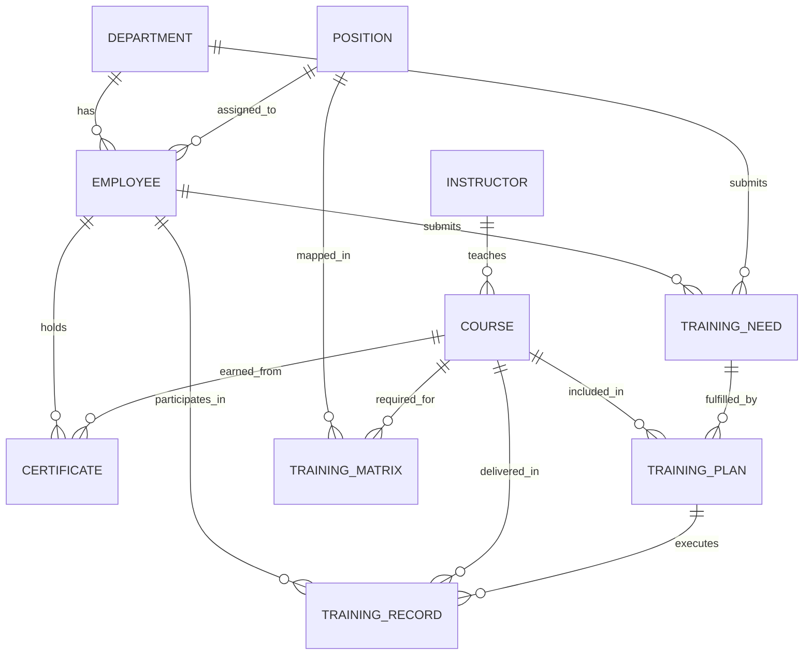

# 培训管理系统详细需求

## 1. 简介

### 1.1 文档目的
本文档详细描述培训管理系统的功能需求、非功能需求、数据需求和集成需求，为系统设计、开发和测试提供明确的依据。文档涵盖培训全生命周期的管理功能，确保系统能够满足GMP合规性要求和企业培训管理的实际需求。

### 1.2 术语定义
| 术语 | 解释 |
|------|------|
| GMP | 药品生产质量管理规范，是药品生产和质量管理的基本准则 |
| 培训计划 | 规定培训目标、内容、对象、时间、地点、资源等信息的规划性文件 |
| 培训矩阵 | 展示岗位与所需培训课程之间关系的矩阵图 |
| 合规培训 | 满足法规和标准要求的强制性培训 |
| 培训评估 | 对培训效果进行测量和评价的过程 |
| 培训证书 | 证明员工完成特定培训的凭证文档 |

## 2. 功能需求

### 2.1 培训需求管理

#### 2.1.1 部门培训需求提报
- **功能描述**：部门负责人或指定人员提报部门整体培训需求
- **输入**：部门信息、需求描述、建议课程、优先级、期望时间
- **输出**：培训需求提报表单
- **流程**：需求填写→审核→汇总
- **GMP要求**：需记录提报人和审核人的电子签名

#### 2.1.2 个人培训需求申请
- **功能描述**：员工可根据自身发展和工作需要申请个人培训
- **输入**：员工信息、需求描述、建议课程、申请理由
- **输出**：个人培训需求申请单
- **流程**：申请提交→部门审核→汇总
- **GMP要求**：培训需求应与岗位要求相关联

#### 2.1.3 合规性培训需求识别
- **功能描述**：系统自动识别基于岗位、法规要求的强制性培训需求
- **输入**：法规更新信息、岗位变动信息、证书过期预警
- **输出**：合规性培训需求列表
- **流程**：需求触发→需求确认→纳入计划
- **GMP要求**：需记录触发原因和识别依据

#### 2.1.4 培训需求分析与汇总
- **功能描述**：对收集的各类培训需求进行分析、分类和汇总
- **输入**：各类培训需求数据
- **输出**：需求分析报告、汇总统计
- **流程**：数据收集→分析处理→报告生成
- **GMP要求**：分析过程可追溯，结果可审计

### 2.2 培训计划管理

#### 2.2.1 年度/月度培训计划制定
- **功能描述**：基于培训需求制定年度和月度培训计划
- **输入**：培训需求、可用资源、时间安排
- **输出**：培训计划表
- **流程**：计划制定→部门审核→管理层审批→发布
- **GMP要求**：计划内容需涵盖所有强制性培训项目

#### 2.2.2 培训课程安排与调整
- **功能描述**：具体安排培训课程的时间、地点、讲师等信息，并支持调整
- **输入**：课程信息、时间、地点、讲师、参与人员
- **输出**：课程安排表、调整记录
- **流程**：课程安排→通知→执行（调整→重新通知）
- **GMP要求**：调整记录需保留完整历史

#### 2.2.3 培训资源分配
- **功能描述**：合理分配培训所需的讲师、场地、设备等资源
- **输入**：资源信息、培训需求
- **输出**：资源分配方案
- **流程**：资源申请→资源确认→分配记录
- **GMP要求**：培训资源需满足培训实施需求

#### 2.2.4 培训计划审批流程
- **功能描述**：培训计划的多级审批管理
- **输入**：培训计划、审批意见
- **输出**：审批记录、最终计划
- **流程**：计划提交→部门审批→质量管理审批→管理层审批
- **GMP要求**：审批过程需记录审批人、时间和意见

### 2.3 课程管理

#### 2.3.1 课程库建设与维护
- **功能描述**：建立和维护培训课程库，管理各类培训课程信息
- **输入**：课程名称、描述、类别、难度、时长、适用对象
- **输出**：课程库
- **流程**：课程创建→审核→发布→维护更新
- **GMP要求**：课程内容需定期审核更新，确保合规

#### 2.3.2 培训材料上传与管理
- **功能描述**：上传、分类、版本控制培训相关的文档、课件等材料
- **输入**：培训材料文件、版本信息、描述
- **输出**：培训材料库
- **流程**：材料上传→审核→发布→版本管理
- **GMP要求**：材料需经过质量管理部门审核，版本历史可追溯

#### 2.3.3 讲师信息管理
- **功能描述**：管理内部和外部讲师的信息
- **输入**：讲师基本信息、专长领域、培训经历、资质证书
- **输出**：讲师库
- **流程**：讲师录入→审核→分配任务
- **GMP要求**：关键岗位培训讲师需具备相应资质

#### 2.3.4 培训课程版本控制
- **功能描述**：对培训课程内容进行版本管理，确保使用最新有效的培训内容
- **输入**：课程更新内容、版本信息
- **输出**：版本历史记录
- **流程**：内容更新→审核→版本更新→通知
- **GMP要求**：版本变更需记录原因和审批人

### 2.4 培训执行

#### 2.4.1 培训通知自动发送
- **功能描述**：根据培训计划自动向相关人员发送培训通知
- **输入**：培训课程信息、参与人员列表
- **输出**：培训通知（邮件、短信、系统消息）
- **流程**：通知生成→发送→确认接收
- **GMP要求**：通知记录需包含发送时间和接收状态

#### 2.4.2 培训签到与考勤记录
- **功能描述**：记录培训参与情况，支持多种签到方式
- **输入**：员工信息、培训课程信息、签到时间
- **输出**：签到记录、考勤统计
- **流程**：签到→数据采集→记录保存
- **GMP要求**：签到记录不可篡改，支持电子签名确认

#### 2.4.3 在线/线下培训支持
- **功能描述**：支持线上和线下两种培训方式的管理
- **输入**：培训方式选择、相关参数配置
- **输出**：培训执行环境、数据记录
- **流程**：培训准备→执行→数据采集
- **GMP要求**：需确保培训过程的真实性和可追溯性

#### 2.4.4 培训过程记录
- **功能描述**：记录培训实施过程中的关键信息和异常情况
- **输入**：培训过程数据、异常记录
- **输出**：过程记录报告
- **流程**：数据采集→记录→审核→归档
- **GMP要求**：过程记录需详细、准确、完整

### 2.5 培训评估

#### 2.5.1 培训满意度调查
- **功能描述**：培训后收集参训人员对培训内容、讲师、组织等方面的满意度反馈
- **输入**：调查问题、评分标准、反馈内容
- **输出**：满意度统计报告
- **流程**：问卷设计→发放→收集→分析
- **GMP要求**：调查数据需真实记录，不可篡改

#### 2.5.2 培训效果测试与评估
- **功能描述**：通过测试评估参训人员对培训内容的掌握程度
- **输入**：测试题目、答案、评分标准
- **输出**：测试成绩、评估报告
- **流程**：测试准备→执行→评分→结果记录
- **GMP要求**：测试过程需保证公平公正，结果可追溯

#### 2.5.3 培训评估报告生成
- **功能描述**：根据培训评估数据自动生成评估报告
- **输入**：满意度数据、测试成绩、其他评估指标
- **输出**：评估报告
- **流程**：数据汇总→分析→报告生成→审核
- **GMP要求**：报告内容需客观真实，包含必要的统计分析

#### 2.5.4 培训改进建议
- **功能描述**：基于评估结果提出培训改进建议
- **输入**：评估报告、问题分析
- **输出**：改进建议清单
- **流程**：问题识别→原因分析→建议生成→审核
- **GMP要求**：改进建议需可执行，并与后续培训计划关联

### 2.6 证书管理

#### 2.6.1 培训证书自动生成
- **功能描述**：培训完成并通过评估后，自动生成电子培训证书
- **输入**：员工信息、培训课程信息、成绩、完成时间
- **输出**：电子证书
- **流程**：证书生成→审核→颁发
- **GMP要求**：证书内容需符合法规要求，包含必要信息

#### 2.6.2 证书有效期监控
- **功能描述**：监控培训证书的有效期，及时提醒更新
- **输入**：证书信息、有效期设置
- **输出**：有效期监控报告、预警通知
- **流程**：有效期设置→自动监控→预警触发
- **GMP要求**：预警时间需足够提前，确保及时安排复训

#### 2.6.3 证书到期提醒
- **功能描述**：当证书即将到期时，向相关人员发送提醒
- **输入**：预警设置、证书信息
- **输出**：提醒通知
- **流程**：预警触发→通知生成→发送→确认
- **GMP要求**：提醒记录需可追溯，包含发送时间和接收状态

#### 2.6.4 证书查询与验证
- **功能描述**：提供证书查询和验证功能，确认证书的真实性和有效性
- **输入**：查询条件（证书编号、员工信息、课程信息等）
- **输出**：证书详情、验证结果
- **流程**：查询请求→数据检索→结果返回
- **GMP要求**：查询结果需准确，验证过程安全可靠

### 2.7 GMP合规管理

#### 2.7.1 关键岗位培训矩阵维护
- **功能描述**：维护关键岗位与所需培训之间的对应关系
- **输入**：岗位信息、培训课程信息、矩阵关系
- **输出**：培训矩阵表
- **流程**：矩阵设计→审核→更新→应用
- **GMP要求**：矩阵需定期审核，确保符合最新法规要求

#### 2.7.2 强制性培训跟踪
- **功能描述**：跟踪记录强制性培训的完成情况
- **输入**：培训计划、执行记录、完成状态
- **输出**：完成情况报告、未完成项清单
- **流程**：任务分配→状态跟踪→提醒→报告
- **GMP要求**：未完成项需及时提醒，确保100%完成

#### 2.7.3 培训记录审计追踪
- **功能描述**：提供完整的培训记录审计追踪功能
- **输入**：审计查询条件
- **输出**：审计追踪报告
- **流程**：查询请求→数据检索→报告生成
- **GMP要求**：审计记录需包含所有关键操作和变更历史

#### 2.7.4 培训合规性报告生成
- **功能描述**：生成满足GMP审计要求的培训合规性报告
- **输入**：培训数据、合规标准
- **输出**：合规性报告
- **流程**：数据汇总→合规检查→报告生成→审核
- **GMP要求**：报告需符合监管审计要求，包含必要的证明材料

### 2.8 数据分析与报表

#### 2.8.1 培训完成率分析
- **功能描述**：分析各部门、各岗位、各课程的培训完成情况
- **输入**：培训计划数据、执行数据
- **输出**：完成率统计报告、趋势图表
- **流程**：数据收集→计算分析→结果呈现
- **GMP要求**：分析结果需准确，可用于合规性评估

#### 2.8.2 人均培训时长统计
- **功能描述**：统计分析员工人均培训时长
- **输入**：培训时长数据、人员数据
- **输出**：人均培训时长统计报告
- **流程**：数据收集→计算分析→结果呈现
- **GMP要求**：统计数据需准确，可用于培训投入评估

#### 2.8.3 部门培训投入分析
- **功能描述**：分析各部门在培训方面的投入情况
- **输入**：培训费用数据、人力资源数据
- **输出**：投入分析报告
- **流程**：数据收集→计算分析→结果呈现
- **GMP要求**：分析结果需准确，可用于资源优化

#### 2.8.4 各类培训报表自动生成
- **功能描述**：根据不同需求自动生成各类培训报表
- **输入**：报表模板、数据筛选条件
- **输出**：培训报表
- **流程**：报表选择→参数设置→数据处理→报表生成
- **GMP要求**：报表内容需符合法规和管理要求，数据准确

## 3. 非功能需求

### 3.1 性能需求
- 系统响应时间：页面加载≤3秒，数据查询≤2秒
- 并发用户数：支持100人同时在线操作
- 数据处理能力：日处理培训记录≥1000条
- 报表生成时间：复杂报表≤5秒，标准报表≤3秒

### 3.2 可用性需求
- 系统可用性：≥99.5%
- 计划维护时间：每月≤4小时，提前24小时通知
- 故障恢复时间：≤4小时
- 数据备份频率：每日全量备份，每小时增量备份

### 3.3 安全需求
- 访问控制：基于角色的访问控制（RBAC）
- 数据加密：敏感数据传输和存储加密
- 电子签名：支持21 CFR Part 11要求的电子签名
- 审计日志：记录所有关键操作，不可篡改
- 会话管理：支持会话超时自动退出

### 3.4 合规性需求
- 符合21 CFR Part 11关于电子记录和电子签名的要求
- 符合GMP关于培训管理的相关要求
- 支持系统验证和确认
- 提供完整的审计跟踪功能

## 4. 数据需求

### 4.1 实体关系

#### 4.1.1 核心实体
- **员工信息**：员工基本信息、部门、岗位、入职时间等
- **培训课程**：课程名称、描述、类别、时长、难度、版本等
- **培训计划**：计划名称、时间、负责人、状态等
- **培训记录**：参与人员、完成情况、成绩、证书信息等
- **讲师信息**：讲师基本信息、专长、资质等
- **培训需求**：需求描述、优先级、提出人、状态等
- **证书信息**：证书编号、颁发对象、课程、有效期等

#### 4.1.2 关系图

### 4.2 数据字典

#### 4.2.1 员工表(EMPLOYEE)
| 字段名 | 数据类型 | 长度 | 约束 | 描述 |
|--------|----------|------|------|------|
| EMPLOYEE_ID | VARCHAR(36) | 36 | PK | 员工ID |
| EMPLOYEE_NAME | VARCHAR(100) | 100 | NOT NULL | 员工姓名 |
| DEPARTMENT_ID | VARCHAR(36) | 36 | FK | 部门ID |
| POSITION_ID | VARCHAR(36) | 36 | FK | 岗位ID |
| HIRE_DATE | DATE | - | NOT NULL | 入职日期 |
| EMAIL | VARCHAR(200) | 200 | UNIQUE | 邮箱 |
| PHONE | VARCHAR(20) | 20 | - | 电话 |
| STATUS | VARCHAR(20) | 20 | NOT NULL | 状态 |

#### 4.2.2 课程表(COURSE)
| 字段名 | 数据类型 | 长度 | 约束 | 描述 |
|--------|----------|------|------|------|
| COURSE_ID | VARCHAR(36) | 36 | PK | 课程ID |
| COURSE_NAME | VARCHAR(200) | 200 | NOT NULL | 课程名称 |
| DESCRIPTION | TEXT | - | - | 课程描述 |
| COURSE_TYPE | VARCHAR(50) | 50 | NOT NULL | 课程类型 |
| DURATION | INTEGER | - | NOT NULL | 时长(分钟) |
| DIFFICULTY_LEVEL | VARCHAR(20) | 20 | - | 难度级别 |
| VERSION | VARCHAR(20) | 20 | NOT NULL | 版本号 |
| IS_MANDATORY | BOOLEAN | - | NOT NULL | 是否强制 |
| STATUS | VARCHAR(20) | 20 | NOT NULL | 状态 |

#### 4.2.3 培训计划表(TRAINING_PLAN)
| 字段名 | 数据类型 | 长度 | 约束 | 描述 |
|--------|----------|------|------|------|
| PLAN_ID | VARCHAR(36) | 36 | PK | 计划ID |
| PLAN_NAME | VARCHAR(200) | 200 | NOT NULL | 计划名称 |
| PLAN_TYPE | VARCHAR(50) | 50 | NOT NULL | 计划类型(年度/月度) |
| PLAN_YEAR | INTEGER | 4 | NOT NULL | 计划年份 |
| PLAN_MONTH | INTEGER | 2 | - | 计划月份 |
| STATUS | VARCHAR(20) | 20 | NOT NULL | 状态 |
| CREATED_BY | VARCHAR(36) | 36 | FK | 创建人ID |
| CREATED_TIME | TIMESTAMP | - | NOT NULL | 创建时间 |

#### 4.2.4 培训记录表(TRAINING_RECORD)
| 字段名 | 数据类型 | 长度 | 约束 | 描述 |
|--------|----------|------|------|------|
| RECORD_ID | VARCHAR(36) | 36 | PK | 记录ID |
| PLAN_ID | VARCHAR(36) | 36 | FK | 计划ID |
| COURSE_ID | VARCHAR(36) | 36 | FK | 课程ID |
| EMPLOYEE_ID | VARCHAR(36) | 36 | FK | 员工ID |
| TRAINING_DATE | DATE | - | NOT NULL | 培训日期 |
| TRAINING_METHOD | VARCHAR(50) | 50 | NOT NULL | 培训方式 |
| ATTENDANCE_STATUS | VARCHAR(20) | 20 | NOT NULL | 出勤状态 |
| SCORE | DECIMAL(5,2) | - | - | 成绩 |
| COMPLETION_STATUS | VARCHAR(20) | 20 | NOT NULL | 完成状态 |
| INSTRUCTOR_ID | VARCHAR(36) | 36 | FK | 讲师ID |
| CREATED_TIME | TIMESTAMP | - | NOT NULL | 创建时间 |

## 5. 集成需求

### 5.1 内部系统集成

#### 5.1.1 与人力资源管理系统(HR-MANAGEMENT)
- **集成目的**：获取员工基本信息、组织架构、岗位信息
- **集成方式**：RESTful API
- **数据交换**：
  - 从HR获取：员工信息、部门信息、岗位信息
  - 向HR提供：培训完成情况、证书信息
- **同步频率**：员工基础数据每日同步，培训结果实时同步

#### 5.1.2 与认证授权系统(AUTH-SYS)
- **集成目的**：实现统一认证和权限控制
- **集成方式**：JWT Token认证
- **数据交换**：
  - 从AUTH获取：用户认证信息、权限信息
  - 向AUTH提供：无
- **集成要求**：确保符合21 CFR Part 11的电子签名要求

#### 5.1.3 与质量管理系统(QMS)
- **集成目的**：实现偏差相关培训的触发和记录
- **集成方式**：RESTful API、消息队列
- **数据交换**：
  - 从QMS获取：偏差信息、需培训人员列表
  - 向QMS提供：培训完成情况
- **集成要求**：培训记录与偏差记录需建立关联

#### 5.1.4 与制造执行系统(MES)
- **集成目的**：验证操作人员的培训资质
- **集成方式**：RESTful API
- **数据交换**：
  - 从MES获取：人员操作请求
  - 向MES提供：培训资质验证结果
- **集成要求**：验证响应时间≤1秒

#### 5.1.5 与消息服务(MESSAGE-SERVICE)
- **集成目的**：发送培训通知、提醒等消息
- **集成方式**：消息队列
- **数据交换**：
  - 从培训系统发送：通知内容、接收人、发送类型
  - 从消息服务接收：发送状态回执
- **集成要求**：支持邮件、短信、系统消息等多种通知方式

#### 5.1.6 与移动应用(MOBILE-APP)
- **集成目的**：支持移动端培训数据访问和操作
- **集成方式**：RESTful API
- **数据交换**：
  - 从培训系统提供：培训课程、记录查询、签到功能
  - 从移动应用接收：签到信息、培训反馈
- **集成要求**：确保移动端数据安全和完整性

### 5.2 外部系统集成

#### 5.2.1 外部培训平台集成
- **集成目的**：对接外部在线培训平台
- **集成方式**：RESTful API
- **数据交换**：
  - 从外部平台获取：课程信息、完成记录
  - 向外部平台发送：用户信息、学习进度
- **集成要求**：需确保数据一致性和完整性

#### 5.2.2 监管系统数据对接
- **集成目的**：满足监管审计需求，支持数据导出
- **集成方式**：标准数据格式导出、API接口
- **数据交换**：
  - 向监管系统提供：培训记录、证书信息、合规报告
- **集成要求**：支持多种导出格式(PDF、Excel、XML)

## 6. 验收标准

### 6.1 功能验收标准
- 所有功能需求项需100%实现
- 用户操作流程符合GMP合规要求
- 培训记录的创建、修改、删除需有完整审计跟踪
- 电子签名功能需符合21 CFR Part 11要求
- 报表生成功能需准确、及时

### 6.2 性能验收标准
- 系统响应时间需满足性能需求中的指标
- 并发用户数测试需达到设计要求
- 长时间运行(7×24小时)无性能下降
- 大数据量处理能力需满足业务需求

### 6.3 安全验收标准
- 通过安全漏洞扫描，无高危漏洞
- 数据加密传输和存储符合安全要求
- 访问控制机制有效，未授权访问被拒绝
- 审计日志记录完整、准确

### 6.4 合规性验收标准
- 系统功能符合GMP培训管理要求
- 电子记录和电子签名符合21 CFR Part 11规定
- 提供完整的系统验证文档
- 支持监管审计和检查

## 7. 风险评估

| 风险描述 | 风险等级 | 应对措施 |
|----------|----------|----------|
| 培训数据量大，影响系统性能 | 中 | 实施数据分区、索引优化、定期归档 |
| 多系统集成复杂度高 | 高 | 建立完善的集成测试机制，制定详细的接口规范 |
| 合规要求变更导致系统调整 | 中 | 设计灵活的系统架构，易于扩展和调整 |
| 用户操作不规范导致数据错误 | 中 | 加强用户培训，优化界面设计，增加数据校验 |
| 系统故障导致数据丢失 | 高 | 实施完善的数据备份和恢复机制，定期演练 |

---

**文档版本**：v1.0
**文档状态**：已完成
**最后更新**：2023-10-15
**文档维护**：培训系统开发团队