# 仓库管理系统（Warehouse）架构设计

## 1. 概述

本架构设计文档描述了仓库管理系统的整体架构、组件设计、数据模型、接口定义和技术选型，旨在指导开发团队构建一个高性能、可扩展、安全可靠的仓库管理平台，为GMP系统提供物料和成品的全生命周期管理支持。

### 1.1 设计目标

- **高度可扩展性**：支持水平扩展以应对不断增长的仓库数据和业务需求
- **模块化设计**：采用微服务架构，实现松耦合、高内聚的组件设计
- **实时数据更新**：确保库存数据的实时准确性和一致性
- **高性能**：优化物料入库、出库和盘点操作的响应速度
- **安全可靠**：符合GMP规范的安全设计和数据保护
- **可集成性**：与其他GMP子系统无缝集成
- **可运维性**：完善的监控、日志和故障恢复机制

### 1.2 术语定义

| 术语 | 解释 |
|------|------|
| WMS | Warehouse Management System，仓库管理系统 |
| GMP | Good Manufacturing Practice，良好生产规范 |
| API | Application Programming Interface，应用程序接口 |
| REST | Representational State Transfer，表征状态转移 |
| RBAC | Role-Based Access Control，基于角色的访问控制 |
| ERP | Enterprise Resource Planning，企业资源规划 |
| RFID | Radio Frequency Identification，射频识别 |
| BOM | Bill of Materials，物料清单 |

## 2. 系统架构

### 2.1 分层架构设计

仓库管理系统采用分层架构设计，确保关注点分离和系统的可维护性。系统从下至上分为以下几层：

```
+-------------------------------------------+
|             表示层 (Presentation)          |
|  Web界面、移动应用、条形码/RFID集成、API网关 |
+-------------------------------------------+
|             应用层 (Application)           |
|  业务流程、工作流引擎、规则引擎、事件处理  |
+-------------------------------------------+
|             领域层 (Domain)                |
|  核心业务逻辑、实体关系、领域服务          |
+-------------------------------------------+
|             基础设施层 (Infrastructure)    |
|  数据存储、消息队列、缓存、搜索、任务调度  |
+-------------------------------------------+
|             集成层 (Integration)           |
|  外部系统接口、消息集成、服务注册发现      |
+-------------------------------------------+
```

#### 2.1.1 表示层
- **Web界面**：基于React构建的响应式Web应用，提供仓库管理人员日常操作界面
- **移动应用**：适配移动终端的响应式设计或专用App，支持仓库操作人员便捷工作
- **条形码/RFID集成**：支持扫描枪、RFID读写器等硬件设备集成
- **API网关**：统一的API入口，提供认证、授权、限流等功能

#### 2.1.2 应用层
- **业务流程引擎**：处理跨服务的业务流程编排，如物料入库流程、成品出库流程
- **规则引擎**：管理业务规则和决策逻辑，如上架规则、库存预警规则
- **事件处理**：处理系统内部和外部事件，实现松耦合的系统集成

#### 2.1.3 领域层
- **库存管理服务**：负责库存数据的实时管理和状态维护
- **入库管理服务**：处理采购到货、生产入库等入库流程
- **出库管理服务**：处理生产领料、销售发货等出库流程
- **盘点管理服务**：管理库存盘点、差异处理等功能
- **库位管理服务**：负责仓库货位管理、空间优化等功能
- **包装与标签服务**：处理物料包装、标签生成与打印等功能

#### 2.1.4 基础设施层
- **数据存储**：关系型数据库、NoSQL数据库、文件存储
- **消息队列**：处理异步通信和事件驱动架构
- **缓存系统**：提升数据访问性能
- **搜索引擎**：提供高效的全文搜索能力
- **任务调度**：管理定时任务和批处理作业

#### 2.1.5 集成层
- **外部系统接口**：与ERP、MES、QMS等系统的集成接口
- **消息集成**：基于消息的系统间通信机制
- **服务注册与发现**：管理微服务实例

### 2.2 微服务架构图

```mermaid
flowchart TD
    subgraph 客户端层
        WebUI[Web界面]
        MobileApp[移动应用]
        BarcodeScanner[条形码/RFID扫描器]
        ExternalSystem[外部系统]
    end

    subgraph 网关层
        APIGateway[API网关]
        AuthService[认证授权服务]
    end

    subgraph 核心服务层
        InventoryService[库存管理服务]
        InboundService[入库管理服务]
        OutboundService[出库管理服务]
        StocktakingService[盘点管理服务]
        LocationService[库位管理服务]
        PackagingService[包装与标签服务]
        NotificationService[通知服务]
        ReportService[报表服务]
    end

    subgraph 集成层
        ERPIntegration[ERP集成适配器]
        MESIntegration[MES集成适配器]
        QMSIntegration[QMS集成适配器]
        BIIntegration[BI集成适配器]
    end

    subgraph 基础设施层
        RelationalDB[(关系型数据库)]
        NoSQL[(NoSQL数据库)]
        MessageQueue[消息队列]
        Cache[缓存系统]
        SearchEngine[搜索引擎]
        FileStorage[文件存储]
        ServiceRegistry[服务注册中心]
        ConfigCenter[配置中心]
    end

    WebUI -->|HTTP请求| APIGateway
    MobileApp -->|HTTP请求| APIGateway
    BarcodeScanner -->|HTTP请求| APIGateway
    ExternalSystem -->|API调用| APIGateway

    APIGateway -->|认证鉴权| AuthService
    APIGateway -->|路由请求| InventoryService
    APIGateway -->|路由请求| InboundService
    APIGateway -->|路由请求| OutboundService
    APIGateway -->|路由请求| StocktakingService
    APIGateway -->|路由请求| LocationService
    APIGateway -->|路由请求| PackagingService
    APIGateway -->|路由请求| NotificationService
    APIGateway -->|路由请求| ReportService

    InventoryService -->|数据读写| RelationalDB
    InventoryService -->|缓存操作| Cache
    InventoryService -->|消息发布| MessageQueue

    InboundService -->|数据读写| RelationalDB
    InboundService -->|缓存操作| Cache
    InboundService -->|消息发布| MessageQueue
    InboundService -->|文件操作| FileStorage

    OutboundService -->|数据读写| RelationalDB
    OutboundService -->|缓存操作| Cache
    OutboundService -->|消息发布| MessageQueue
    OutboundService -->|文件操作| FileStorage

    StocktakingService -->|数据读写| RelationalDB
    StocktakingService -->|缓存操作| Cache
    StocktakingService -->|消息发布| MessageQueue

    LocationService -->|数据读写| RelationalDB
    LocationService -->|缓存操作| Cache

    PackagingService -->|数据读写| RelationalDB
    PackagingService -->|文件操作| FileStorage
    PackagingService -->|消息发布| MessageQueue

    NotificationService -->|消息发送| MessageQueue
    NotificationService -->|数据读写| RelationalDB

    ReportService -->|数据查询| RelationalDB
    ReportService -->|数据查询| NoSQL
    ReportService -->|缓存操作| Cache

    InventoryService -->|系统集成| ERPIntegration
    InboundService -->|系统集成| ERPIntegration
    InboundService -->|系统集成| MESIntegration
    OutboundService -->|系统集成| ERPIntegration
    OutboundService -->|系统集成| MESIntegration
    ReportService -->|系统集成| BIIntegration
    ReportService -->|系统集成| QMSIntegration

    InventoryService -->|服务发现| ServiceRegistry
    InboundService -->|服务发现| ServiceRegistry
    OutboundService -->|服务发现| ServiceRegistry
    StocktakingService -->|服务发现| ServiceRegistry
    LocationService -->|服务发现| ServiceRegistry
    PackagingService -->|服务发现| ServiceRegistry
    NotificationService -->|服务发现| ServiceRegistry
    ReportService -->|服务发现| ServiceRegistry

    InventoryService -->|配置获取| ConfigCenter
    InboundService -->|配置获取| ConfigCenter
    OutboundService -->|配置获取| ConfigCenter
    StocktakingService -->|配置获取| ConfigCenter
    LocationService -->|配置获取| ConfigCenter
    PackagingService -->|配置获取| ConfigCenter
    NotificationService -->|配置获取| ConfigCenter
    ReportService -->|配置获取| ConfigCenter
```



## 3. 服务设计

### 3.1 微服务边界

| 服务名称 | 主要职责 | 关键接口 | 依赖服务 |
|---------|---------|---------|----------|
| **库存管理服务** | 物料库存管理、库存状态跟踪、批次管理 | /api/inventory/v1/items<br>/api/inventory/v1/batches<br>/api/inventory/v1/levels | 认证授权服务<br>库位管理服务<br>ERP集成适配器 |
| **入库管理服务** | 采购到货管理、生产入库、物料接收、质检协调 | /api/inbound/v1/receipts<br>/api/inbound/v1/transactions<br>/api/inbound/v1/quality-notices | 认证授权服务<br>库存管理服务<br>包装与标签服务<br>ERP/MES集成适配器 |
| **出库管理服务** | 生产领料、销售发货、物料发放、发货确认 | /api/outbound/v1/picks<br>/api/outbound/v1/shipments<br>/api/outbound/v1/issuances | 认证授权服务<br>库存管理服务<br>库位管理服务<br>ERP/MES集成适配器 |
| **盘点管理服务** | 盘点计划、盘点执行、差异处理、调整确认 | /api/stocktaking/v1/plans<br>/api/stocktaking/v1/counts<br>/api/stocktaking/v1/adjustments | 认证授权服务<br>库存管理服务<br>库位管理服务 |
| **库位管理服务** | 仓库布局、货位管理、上架策略、空间优化 | /api/location/v1/warehouses<br>/api/location/v1/aisles<br>/api/location/v1/bin-locations | 认证授权服务 |
| **包装与标签服务** | 物料包装、标签生成、标签打印、标准合规 | /api/packaging/v1/packages<br>/api/packaging/v1/labels<br>/api/packaging/v1/templates | 认证授权服务<br>文件存储 |
| **通知服务** | 邮件、短信、站内信发送 | /api/notification/v1/emails<br>/api/notification/v1/sms<br>/api/notification/v1/messages | 认证授权服务<br>消息队列 |
| **报表服务** | 库存报表、收发存报表、批次跟踪报表 | /api/reports/v1/inventory<br>/api/reports/v1/transactions<br>/api/reports/v1/traceability | 认证授权服务<br>库存管理服务<br>BI集成适配器 |
| **认证授权服务** | 用户认证、权限管理、访问控制 | /api/auth/v1/login<br>/api/auth/v1/token<br>/api/auth/v1/permissions | 关系型数据库 |

### 3.2 服务接口设计

#### 3.2.1 库存管理服务接口

```yaml
paths:
  /api/inventory/v1/items:
    get:
      summary: 获取库存项目列表
      parameters:
        - name: page
          in: query
          required: false
          schema:
            type: integer
        - name: size
          in: query
          required: false
          schema:
            type: integer
        - name: materialCode
          in: query
          required: false
          schema:
            type: string
        - name: warehouseId
          in: query
          required: false
          schema:
            type: string
      responses:
        '200':
          description: 库存项目列表
    post:
      summary: 创建库存项目
      requestBody:
        content:
          application/json:
            schema:
              $ref: '#/components/schemas/InventoryItem'
      responses:
        '201':
          description: 库存项目创建成功

  /api/inventory/v1/items/{id}:
    get:
      summary: 获取库存项目详情
      parameters:
        - name: id
          in: path
          required: true
          schema:
            type: string
      responses:
        '200':
          description: 库存项目详情
    put:
      summary: 更新库存项目
      parameters:
        - name: id
          in: path
          required: true
          schema:
            type: string
      requestBody:
        content:
          application/json:
            schema:
              $ref: '#/components/schemas/InventoryItem'
      responses:
        '200':
          description: 库存项目更新成功

  /api/inventory/v1/batches:
    get:
      summary: 获取批次列表
      parameters:
        - name: page
          in: query
          required: false
          schema:
            type: integer
        - name: size
          in: query
          required: false
          schema:
            type: integer
        - name: materialCode
          in: query
          required: false
          schema:
            type: string
        - name: batchNumber
          in: query
          required: false
          schema:
            type: string
      responses:
        '200':
          description: 批次列表

  /api/inventory/v1/batches/{id}:
    get:
      summary: 获取批次详情
      parameters:
        - name: id
          in: path
          required: true
          schema:
            type: string
      responses:
        '200':
          description: 批次详情

  /api/inventory/v1/levels:
    get:
      summary: 获取库存预警级别设置
      responses:
        '200':
          description: 库存预警级别设置
    put:
      summary: 更新库存预警级别设置
      requestBody:
        content:
          application/json:
            schema:
              $ref: '#/components/schemas/InventoryAlertLevels'
      responses:
        '200':
          description: 库存预警级别设置更新成功
```

#### 3.2.2 入库管理服务接口

```yaml
paths:
  /api/inbound/v1/receipts:
    get:
      summary: 获取入库接收列表
      parameters:
        - name: page
          in: query
          required: false
          schema:
            type: integer
        - name: size
          in: query
          required: false
          schema:
            type: integer
        - name: status
          in: query
          required: false
          schema:
            type: string
      responses:
        '200':
          description: 入库接收列表
    post:
      summary: 创建入库接收单
      requestBody:
        content:
          application/json:
            schema:
              $ref: '#/components/schemas/Receipt'
      responses:
        '201':
          description: 入库接收单创建成功

  /api/inbound/v1/receipts/{id}:
    get:
      summary: 获取入库接收单详情
      parameters:
        - name: id
          in: path
          required: true
          schema:
            type: string
      responses:
        '200':
          description: 入库接收单详情
    put:
      summary: 更新入库接收单
      parameters:
        - name: id
          in: path
          required: true
          schema:
            type: string
      requestBody:
        content:
          application/json:
            schema:
              $ref: '#/components/schemas/Receipt'
      responses:
        '200':
          description: 入库接收单更新成功
    patch:
      summary: 更新入库接收单状态
      parameters:
        - name: id
          in: path
          required: true
          schema:
            type: string
      requestBody:
        content:
          application/json:
            schema:
              $ref: '#/components/schemas/ReceiptStatusUpdate'
      responses:
        '200':
          description: 入库接收单状态更新成功

  /api/inbound/v1/transactions:
    get:
      summary: 获取入库交易记录
      parameters:
        - name: page
          in: query
          required: false
          schema:
            type: integer
        - name: size
          in: query
          required: false
          schema:
            type: integer
        - name: startDate
          in: query
          required: false
          schema:
            type: string
            format: date-time
        - name: endDate
          in: query
          required: false
          schema:
            type: string
            format: date-time
      responses:
        '200':
          description: 入库交易记录

  /api/inbound/v1/quality-notices:
    post:
      summary: 创建质量检验通知
      requestBody:
        content:
          application/json:
            schema:
              $ref: '#/components/schemas/QualityNotice'
      responses:
        '201':
          description: 质量检验通知创建成功
```

#### 3.2.3 出库管理服务接口

```yaml
paths:
  /api/outbound/v1/picks:
    get:
      summary: 获取拣货任务列表
      parameters:
        - name: page
          in: query
          required: false
          schema:
            type: integer
        - name: size
          in: query
          required: false
          schema:
            type: integer
        - name: status
          in: query
          required: false
          schema:
            type: string
      responses:
        '200':
          description: 拣货任务列表
    post:
      summary: 创建拣货任务
      requestBody:
        content:
          application/json:
            schema:
              $ref: '#/components/schemas/PickTask'
      responses:
        '201':
          description: 拣货任务创建成功

  /api/outbound/v1/picks/{id}:
    get:
      summary: 获取拣货任务详情
      parameters:
        - name: id
          in: path
          required: true
          schema:
            type: string
      responses:
        '200':
          description: 拣货任务详情
    patch:
      summary: 更新拣货任务状态
      parameters:
        - name: id
          in: path
          required: true
          schema:
            type: string
      requestBody:
        content:
          application/json:
            schema:
              $ref: '#/components/schemas/PickTaskStatusUpdate'
      responses:
        '200':
          description: 拣货任务状态更新成功

  /api/outbound/v1/shipments:
    get:
      summary: 获取发货单列表
      parameters:
        - name: page
          in: query
          required: false
          schema:
            type: integer
        - name: size
          in: query
          required: false
          schema:
            type: integer
        - name: status
          in: query
          required: false
          schema:
            type: string
      responses:
        '200':
          description: 发货单列表
    post:
      summary: 创建发货单
      requestBody:
        content:
          application/json:
            schema:
              $ref: '#/components/schemas/Shipment'
      responses:
        '201':
          description: 发货单创建成功

  /api/outbound/v1/issuances:
    get:
      summary: 获取物料发放列表
      parameters:
        - name: page
          in: query
          required: false
          schema:
            type: integer
        - name: size
          in: query
          required: false
          schema:
            type: integer
        - name: productionOrderId
          in: query
          required: false
          schema:
            type: string
      responses:
        '200':
          description: 物料发放列表
    post:
      summary: 创建物料发放单
      requestBody:
        content:
          application/json:
            schema:
              $ref: '#/components/schemas/Issuance'
      responses:
        '201':
          description: 物料发放单创建成功
```

## 4. 数据架构设计

### 4.1 核心数据模型

#### 4.1.1 仓库与库位相关实体

```java
// 仓库
public class Warehouse {
    private String id;              // 仓库ID
    private String code;            // 仓库编码
    private String name;            // 仓库名称
    private String type;            // 仓库类型（原材料仓、成品仓、辅料仓等）
    private String status;          // 状态（启用、停用）
    private Address address;        // 仓库地址
    private ContactInfo contactInfo; // 联系信息
    private String description;     // 描述
    private Date createdAt;         // 创建时间
    private Date updatedAt;         // 更新时间
}

// 库位
public class BinLocation {
    private String id;              // 库位ID
    private String warehouseId;     // 所属仓库ID
    private String zoneCode;        // 区域编码
    private String aisleCode;       // 通道编码
    private String rackCode;        // 货架编码
    private String shelfCode;       // 层编码
    private String positionCode;    // 位编码
    private String fullCode;        // 完整库位编码
    private String type;            // 库位类型（常规、恒温、冷藏等）
    private String status;          // 状态（可用、占用、禁用）
    private BigDecimal capacity;    // 容量
    private String unit;            // 容量单位
    private String allowedMaterialTypes; // 允许存放的物料类型
    private Date createdAt;         // 创建时间
    private Date updatedAt;         // 更新时间
}
```

#### 4.1.2 物料与库存相关实体

```java
// 物料
public class Material {
    private String id;              // 物料ID
    private String code;            // 物料编码
    private String name;            // 物料名称
    private String description;     // 描述
    private String type;            // 物料类型（原材料、半成品、成品、辅料等）
    private String unit;            // 计量单位
    private String specification;   // 规格型号
    private String brand;           // 品牌
    private String manufacturer;    // 制造商
    private String supplierId;      // 供应商ID
    private String categoryId;      // 物料类别ID
    private String status;          // 状态（启用、停用）
    private boolean isBatchTracked; // 是否批次管理
    private boolean isExpiryTracked; // 是否有效期管理
    private Date createdAt;         // 创建时间
    private Date updatedAt;         // 更新时间
}

// 库存项目
public class InventoryItem {
    private String id;              // 库存ID
    private String materialId;      // 物料ID
    private String warehouseId;     // 仓库ID
    private String binLocationId;   // 库位ID
    private String batchId;         // 批次ID
    private BigDecimal quantity;    // 数量
    private String unit;            // 单位
    private String status;          // 状态（合格、待检、不合格、冻结）
    private Date createdAt;         // 创建时间
    private Date updatedAt;         // 更新时间
}

// 批次
public class Batch {
    private String id;              // 批次ID
    private String materialId;      // 物料ID
    private String batchNumber;     // 批次号
    private String manufacturerBatchNo; // 厂商批次号
    private Date manufactureDate;   // 生产日期
    private Date expiryDate;        // 有效期至
    private String productionOrderId; // 生产订单号（成品）
    private String supplierId;      // 供应商ID（原材料）
    private BigDecimal totalQuantity; // 总数量
    private String status;          // 状态
    private Date createdAt;         // 创建时间
    private Date updatedAt;         // 更新时间
}

// 库存交易记录
public class InventoryTransaction {
    private String id;              // 交易ID
    private String transactionType; // 交易类型（入库、出库、调整等）
    private String sourceDocumentId; // 源单据ID
    private String sourceDocumentType; // 源单据类型
    private String materialId;      // 物料ID
    private String batchId;         // 批次ID
    private String fromWarehouseId; // 来源仓库ID
    private String fromBinLocationId; // 来源库位ID
    private String toWarehouseId;   // 目标仓库ID
    private String toBinLocationId; // 目标库位ID
    private BigDecimal quantity;    // 数量
    private String unit;            // 单位
    private String reference;       // 参考信息
    private Date transactionDate;   // 交易日期
    private String createdBy;       // 创建人
    private Date createdAt;         // 创建时间
}
```

#### 4.1.3 入库与出库相关实体

```java
// 入库接收单
public class Receipt {
    private String id;              // 接收单ID
    private String code;            // 接收单号
    private String receiptType;     // 接收类型（采购入库、生产入库、退货入库等）
    private String sourceDocumentId; // 源单据ID
    private String sourceDocumentType; // 源单据类型
    private Date receiptDate;       // 接收日期
    private String supplierId;      // 供应商ID
    private String warehouseId;     // 仓库ID
    private String status;          // 状态（待接收、部分接收、已完成、已取消）
    private String receivedBy;      // 接收人
    private String notes;           // 备注
    private List<ReceiptItem> items; // 接收明细
    private Date createdAt;         // 创建时间
    private Date updatedAt;         // 更新时间
}

// 入库接收明细
public class ReceiptItem {
    private String id;              // 明细ID
    private String receiptId;       // 接收单ID
    private String materialId;      // 物料ID
    private String expectedBatchNumber; // 预期批次号
    private BigDecimal expectedQuantity; // 预期数量
    private BigDecimal actualQuantity; // 实际接收数量
    private String unit;            // 单位
    private String status;          // 状态（待接收、已接收、部分接收）
    private String qualityStatus;   // 质量状态（待检、合格、不合格）
    private List<InventoryTransaction> transactions; // 对应的库存交易
}

// 拣货任务
public class PickTask {
    private String id;              // 拣货任务ID
    private String code;            // 拣货任务编号
    private String shipmentId;      // 发货单ID
    private String issuanceId;      // 发放单ID
    private String pickType;        // 拣货类型（销售发货、生产领料等）
    private String warehouseId;     // 仓库ID
    private String assignedTo;      // 分配给
    private Date scheduledTime;     // 计划时间
    private Date completedTime;     // 完成时间
    private String status;          // 状态（待拣货、拣货中、已完成、已取消）
    private List<PickItem> items;   // 拣货明细
    private Date createdAt;         // 创建时间
    private Date updatedAt;         // 更新时间
}

// 发货单
public class Shipment {
    private String id;              // 发货单ID
    private String code;            // 发货单号
    private String sourceDocumentId; // 源单据ID（如销售订单）
    private String customerId;      // 客户ID
    private Date shipDate;          // 发货日期
    private Date deliveryDate;      // 预计送达日期
    private String warehouseId;     // 发货仓库ID
    private Address shipToAddress;  // 收货地址
    private String status;          // 状态（待发货、部分发货、已发货、已完成、已取消）
    private String shippedBy;       // 发货人
    private String notes;           // 备注
    private List<ShipmentItem> items; // 发货明细
    private Date createdAt;         // 创建时间
    private Date updatedAt;         // 更新时间
}

// 物料发放单
public class Issuance {
    private String id;              // 发放单ID
    private String code;            // 发放单号
    private String productionOrderId; // 生产订单ID
    private Date issuanceDate;      // 发放日期
    private String warehouseId;     // 发放仓库ID
    private String productionLineId; // 生产线ID
    private String status;          // 状态（待发放、部分发放、已完成、已取消）
    private String issuedBy;        // 发放人
    private String receivedBy;      // 接收人
    private String notes;           // 备注
    private List<IssuanceItem> items; // 发放明细
    private Date createdAt;         // 创建时间
    private Date updatedAt;         // 更新时间
}
```

#### 4.1.4 盘点相关实体

```java
// 盘点计划
public class StocktakingPlan {
    private String id;              // 盘点计划ID
    private String code;            // 盘点计划编号
    private String name;            // 盘点计划名称
    private String type;            // 盘点类型（全盘、抽盘、循环盘点等）
    private String warehouseId;     // 仓库ID
    private List<String> binLocationIds; // 盘点库位列表
    private List<String> materialIds; // 盘点物料列表
    private Date scheduledStartDate; // 计划开始日期
    private Date scheduledEndDate;   // 计划结束日期
    private Date actualStartDate;    // 实际开始日期
    private Date actualEndDate;      // 实际结束日期
    private String status;           // 状态（未开始、进行中、已完成、已取消）
    private String createdBy;        // 创建人
    private String approvedBy;       // 审批人
    private Date createdAt;          // 创建时间
    private Date updatedAt;          // 更新时间
}

// 盘点记录
public class StocktakingCount {
    private String id;              // 盘点记录ID
    private String planId;          // 盘点计划ID
    private String materialId;      // 物料ID
    private String batchId;         // 批次ID
    private String binLocationId;   // 库位ID
    private BigDecimal systemQuantity; // 系统数量
    private BigDecimal countedQuantity; // 实盘数量
    private BigDecimal difference;   // 差异数量
    private String reason;          // 差异原因
    private String status;          // 状态（待确认、已确认、已调整）
    private String countedBy;       // 盘点人
    private Date countedDate;       // 盘点日期
    private Date createdAt;         // 创建时间
    private Date updatedAt;         // 更新时间
}

// 库存调整单
public class InventoryAdjustment {
    private String id;              // 调整单ID
    private String code;            // 调整单号
    private String sourceType;      // 来源类型（盘点差异、溢缺处理等）
    private String sourceId;        // 来源ID
    private Date adjustmentDate;    // 调整日期
    private String status;          // 状态（待审批、已批准、已执行、已拒绝）
    private String reason;          // 调整原因
    private String approvedBy;      // 审批人
    private List<AdjustmentItem> items; // 调整明细
    private Date createdAt;         // 创建时间
    private Date updatedAt;         // 更新时间
}
```

### 4.2 Repository层设计

Repository层负责数据访问和持久化，为上层业务逻辑提供数据支持。

```java
// 库存Repository
public interface InventoryRepository extends JpaRepository<InventoryItem, String> {
    List<InventoryItem> findByMaterialIdAndWarehouseId(String materialId, String warehouseId);
    List<InventoryItem> findByWarehouseId(String warehouseId);
    List<InventoryItem> findByBinLocationId(String binLocationId);
    List<InventoryItem> findByBatchId(String batchId);
    List<InventoryItem> findByStatus(String status);
    Optional<InventoryItem> findByMaterialIdAndBatchIdAndWarehouseIdAndBinLocationId(
            String materialId, String batchId, String warehouseId, String binLocationId);
}

// 批次Repository
public interface BatchRepository extends JpaRepository<Batch, String> {
    List<Batch> findByMaterialId(String materialId);
    List<Batch> findByMaterialIdAndStatus(String materialId, String status);
    Optional<Batch> findByBatchNumber(String batchNumber);
    List<Batch> findByExpiryDateBefore(Date date);
}

// 库位Repository
public interface BinLocationRepository extends JpaRepository<BinLocation, String> {
    List<BinLocation> findByWarehouseId(String warehouseId);
    List<BinLocation> findByWarehouseIdAndStatus(String warehouseId, String status);
    Optional<BinLocation> findByFullCode(String fullCode);
    List<BinLocation> findByWarehouseIdAndType(String warehouseId, String type);
}

// 库存交易Repository
public interface InventoryTransactionRepository extends JpaRepository<InventoryTransaction, String> {
    List<InventoryTransaction> findByMaterialId(String materialId);
    List<InventoryTransaction> findByTransactionType(String transactionType);
    List<InventoryTransaction> findByTransactionDateBetween(Date startDate, Date endDate);
    List<InventoryTransaction> findBySourceDocumentId(String sourceDocumentId);
    List<InventoryTransaction> findByBatchId(String batchId);
}

// 入库接收Repository
public interface ReceiptRepository extends JpaRepository<Receipt, String> {
    List<Receipt> findByStatus(String status);
    List<Receipt> findByReceiptDateBetween(Date startDate, Date endDate);
    Optional<Receipt> findByCode(String code);
    List<Receipt> findBySourceDocumentId(String sourceDocumentId);
}

// 发货Repository
public interface ShipmentRepository extends JpaRepository<Shipment, String> {
    List<Shipment> findByStatus(String status);
    List<Shipment> findByShipDateBetween(Date startDate, Date endDate);
    Optional<Shipment> findByCode(String code);
    List<Shipment> findByCustomerId(String customerId);
}
```

## 5. 集成设计

### 5.1 与其他GMP子系统的集成

仓库管理系统需要与GMP系统的其他子系统进行集成，实现数据共享和业务协同。

```java
// ERP集成服务
@Service
public class ERPIntegrationService {
    
    private final RestTemplate restTemplate;
    private final String erpBaseUrl;
    
    @Autowired
    public ERPIntegrationService(RestTemplate restTemplate, @Value("${integration.erp.base-url}") String erpBaseUrl) {
        this.restTemplate = restTemplate;
        this.erpBaseUrl = erpBaseUrl;
    }
    
    // 从ERP获取采购订单信息
    public PurchaseOrder getPurchaseOrderFromERP(String orderNumber) {
        ResponseEntity<ERPPurchaseOrder> response = restTemplate.getForEntity(
            erpBaseUrl + "/api/purchase-orders/{number}", ERPPurchaseOrder.class, orderNumber);
        
        if (response.getStatusCode().is2xxSuccessful() && response.getBody() != null) {
            return convertFromERPPurchaseOrder(response.getBody());
        }
        return null;
    }
    
    // 同步入库信息到ERP
    public ResponseEntity<ERPResponse> syncReceiptToERP(Receipt receipt) {
        HttpHeaders headers = new HttpHeaders();
        headers.setContentType(MediaType.APPLICATION_JSON);
        
        // 转换为ERP系统所需的入库数据格式
        ERPReceipt erpReceipt = convertToERPReceipt(receipt);
        
        HttpEntity<ERPReceipt> request = new HttpEntity<>(erpReceipt, headers);
        return restTemplate.postForEntity(erpBaseUrl + "/api/receipts", request, ERPResponse.class);
    }
    
    // 同步出库信息到ERP
    public ResponseEntity<ERPResponse> syncShipmentToERP(Shipment shipment) {
        HttpHeaders headers = new HttpHeaders();
        headers.setContentType(MediaType.APPLICATION_JSON);
        
        // 转换为ERP系统所需的出库数据格式
        ERPShipment erpShipment = convertToERPShipment(shipment);
        
        HttpEntity<ERPShipment> request = new HttpEntity<>(erpShipment, headers);
        return restTemplate.postForEntity(erpBaseUrl + "/api/shipments", request, ERPResponse.class);
    }
    
    // 辅助方法：转换数据格式
    private PurchaseOrder convertFromERPPurchaseOrder(ERPPurchaseOrder erpOrder) {
        // 实现转换逻辑
        // ...
        return new PurchaseOrder();
    }
    
    private ERPReceipt convertToERPReceipt(Receipt receipt) {
        // 实现转换逻辑
        // ...
        return new ERPReceipt();
    }
    
    private ERPShipment convertToERPShipment(Shipment shipment) {
        // 实现转换逻辑
        // ...
        return new ERPShipment();
    }
}

// MES集成服务
@Service
public class MESIntegrationService {
    
    private final RestTemplate restTemplate;
    private final String mesBaseUrl;
    
    @Autowired
    public MESIntegrationService(RestTemplate restTemplate, @Value("${integration.mes.base-url}") String mesBaseUrl) {
        this.restTemplate = restTemplate;
        this.mesBaseUrl = mesBaseUrl;
    }
    
    // 获取生产订单信息
    public ProductionOrder getProductionOrderFromMES(String orderNumber) {
        ResponseEntity<MESProductionOrder> response = restTemplate.getForEntity(
            mesBaseUrl + "/api/production-orders/{number}", MESProductionOrder.class, orderNumber);
        
        if (response.getStatusCode().is2xxSuccessful() && response.getBody() != null) {
            return convertFromMESProductionOrder(response.getBody());
        }
        return null;
    }
    
    // 同步物料发放信息到MES
    public ResponseEntity<MESResponse> syncIssuanceToMES(Issuance issuance) {
        HttpHeaders headers = new HttpHeaders();
        headers.setContentType(MediaType.APPLICATION_JSON);
        
        // 转换为MES系统所需的发放数据格式
        MESIssuance mesIssuance = convertToMESIssuance(issuance);
        
        HttpEntity<MESIssuance> request = new HttpEntity<>(mesIssuance, headers);
        return restTemplate.postForEntity(mesBaseUrl + "/api/issuances", request, MESResponse.class);
    }
    
    // 同步生产入库信息到MES
    public ResponseEntity<MESResponse> syncProductionReceiptToMES(Receipt receipt) {
        HttpHeaders headers = new HttpHeaders();
        headers.setContentType(MediaType.APPLICATION_JSON);
        
        // 转换为MES系统所需的入库数据格式
        MESReceipt mesReceipt = convertToMESReceipt(receipt);
        
        HttpEntity<MESReceipt> request = new HttpEntity<>(mesReceipt, headers);
        return restTemplate.postForEntity(mesBaseUrl + "/api/receipts", request, MESResponse.class);
    }
    
    // 辅助方法：转换数据格式
    private ProductionOrder convertFromMESProductionOrder(MESProductionOrder mesOrder) {
        // 实现转换逻辑
        // ...
        return new ProductionOrder();
    }
    
    private MESIssuance convertToMESIssuance(Issuance issuance) {
        // 实现转换逻辑
        // ...
        return new MESIssuance();
    }
    
    private MESReceipt convertToMESReceipt(Receipt receipt) {
        // 实现转换逻辑
        // ...
        return new MESReceipt();
    }
}

// QMS集成服务
@Service
public class QMSIntegrationService {
    
    private final RestTemplate restTemplate;
    private final String qmsBaseUrl;
    
    @Autowired
    public QMSIntegrationService(RestTemplate restTemplate, @Value("${integration.qms.base-url}") String qmsBaseUrl) {
        this.restTemplate = restTemplate;
        this.qmsBaseUrl = qmsBaseUrl;
    }
    
    // 创建质量检验请求
    public ResponseEntity<QMSResponse> createInspectionRequest(InspectionRequest request) {
        HttpHeaders headers = new HttpHeaders();
        headers.setContentType(MediaType.APPLICATION_JSON);
        
        HttpEntity<InspectionRequest> httpRequest = new HttpEntity<>(request, headers);
        return restTemplate.postForEntity(qmsBaseUrl + "/api/inspection-requests", httpRequest, QMSResponse.class);
    }
    
    // 获取检验结果
    public InspectionResult getInspectionResult(String requestId) {
        ResponseEntity<QMSInspectionResult> response = restTemplate.getForEntity(
            qmsBaseUrl + "/api/inspection-requests/{id}/result", QMSInspectionResult.class, requestId);
        
        if (response.getStatusCode().is2xxSuccessful() && response.getBody() != null) {
            return convertFromQMSInspectionResult(response.getBody());
        }
        return null;
    }
    
    // 辅助方法：转换检验结果格式
    private InspectionResult convertFromQMSInspectionResult(QMSInspectionResult qmsResult) {
        // 实现转换逻辑
        // ...
        return new InspectionResult();
    }
}
```

### 5.2 事件驱动集成

系统采用事件驱动架构实现松耦合的系统集成。

```java
// 事件发布服务
@Service
public class EventPublisherService {
    
    private final KafkaTemplate<String, EventMessage> kafkaTemplate;
    
    @Autowired
    public EventPublisherService(KafkaTemplate<String, EventMessage> kafkaTemplate) {
        this.kafkaTemplate = kafkaTemplate;
    }
    
    // 发布库存变动事件
    public void publishInventoryChangedEvent(InventoryTransaction transaction) {
        EventMessage message = new EventMessage(
            "INVENTORY_CHANGED", 
            transaction.getId(), 
            transaction, 
            LocalDateTime.now()
        );
        kafkaTemplate.send("inventory-events", transaction.getMaterialId(), message);
    }
    
    // 发布入库完成事件
    public void publishReceiptCompletedEvent(Receipt receipt) {
        EventMessage message = new EventMessage(
            "RECEIPT_COMPLETED", 
            receipt.getId(), 
            receipt, 
            LocalDateTime.now()
        );
        kafkaTemplate.send("warehouse-events", receipt.getId(), message);
    }
    
    // 发布出库完成事件
    public void publishShipmentCompletedEvent(Shipment shipment) {
        EventMessage message = new EventMessage(
            "SHIPMENT_COMPLETED", 
            shipment.getId(), 
            shipment, 
            LocalDateTime.now()
        );
        kafkaTemplate.send("warehouse-events", shipment.getId(), message);
    }
    
    // 发布库存预警事件
    public void publishInventoryAlertEvent(InventoryAlert alert) {
        EventMessage message = new EventMessage(
            "INVENTORY_ALERT", 
            UUID.randomUUID().toString(), 
            alert, 
            LocalDateTime.now()
        );
        kafkaTemplate.send("inventory-alerts", alert.getMaterialId(), message);
    }
}

// 事件订阅服务
@Service
public class EventSubscriberService {
    
    private final ReceiptService receiptService;
    private final ShipmentService shipmentService;
    private final InventoryService inventoryService;
    
    @Autowired
    public EventSubscriberService(ReceiptService receiptService, 
                                 ShipmentService shipmentService, 
                                 InventoryService inventoryService) {
        this.receiptService = receiptService;
        this.shipmentService = shipmentService;
        this.inventoryService = inventoryService;
    }
    
    // 订阅采购订单确认事件
    @KafkaListener(topics = "erp-purchase-events", groupId = "warehouse-group")
    public void handlePurchaseOrderConfirmedEvent(EventMessage message) {
        if ("PURCHASE_ORDER_CONFIRMED".equals(message.getEventType())) {
            PurchaseOrderData data = (PurchaseOrderData) message.getData();
            // 创建入库接收单
            receiptService.createReceiptFromPurchaseOrder(data);
        }
    }
    
    // 订阅销售订单确认事件
    @KafkaListener(topics = "erp-sales-events", groupId = "warehouse-group")
    public void handleSalesOrderConfirmedEvent(EventMessage message) {
        if ("SALES_ORDER_CONFIRMED".equals(message.getEventType())) {
            SalesOrderData data = (SalesOrderData) message.getData();
            // 创建发货单
            shipmentService.createShipmentFromSalesOrder(data);
        }
    }
    
    // 订阅生产订单释放事件
    @KafkaListener(topics = "mes-production-events", groupId = "warehouse-group")
    public void handleProductionOrderReleasedEvent(EventMessage message) {
        if ("PRODUCTION_ORDER_RELEASED".equals(message.getEventType())) {
            ProductionOrderData data = (ProductionOrderData) message.getData();
            // 检查物料可用性
            inventoryService.checkMaterialAvailability(data.getMaterialRequirements());
        }
    }
    
    // 订阅检验结果事件
    @KafkaListener(topics = "qms-inspection-events", groupId = "warehouse-group")
    public void handleInspectionResultEvent(EventMessage message) {
        if ("INSPECTION_RESULT_COMPLETED".equals(message.getEventType())) {
            InspectionResultData data = (InspectionResultData) message.getData();
            // 更新物料质量状态
            inventoryService.updateMaterialQualityStatus(data);
        }
    }
}
```

## 6. 安全架构

### 6.1 身份认证与授权

仓库管理系统采用多层安全架构，确保数据和系统安全。

```java
// 安全配置
@Configuration
@EnableWebSecurity
public class SecurityConfig extends WebSecurityConfigurerAdapter {
    
    @Autowired
    private JwtAuthenticationConverter jwtAuthenticationConverter;
    
    @Override
    protected void configure(HttpSecurity http) throws Exception {
        http
            .csrf(csrf -> csrf.disable()) // API服务通常禁用CSRF
            .authorizeRequests(authorizeRequests ->
                authorizeRequests
                    .antMatchers("/api/public/**").permitAll()
                    .antMatchers("/api/admin/**").hasRole("ADMIN")
                    .antMatchers("/api/inventory/**").hasAnyRole("WAREHOUSE_MANAGER", "WAREHOUSE_STAFF", "ADMIN")
                    .antMatchers("/api/inbound/**").hasAnyRole("WAREHOUSE_STAFF", "QC_STAFF", "ADMIN")
                    .antMatchers("/api/outbound/**").hasAnyRole("WAREHOUSE_STAFF", "PRODUCTION_STAFF", "ADMIN")
                    .antMatchers("/api/stocktaking/**").hasAnyRole("WAREHOUSE_MANAGER", "WAREHOUSE_STAFF", "FINANCE_STAFF", "ADMIN")
                    .antMatchers("/api/location/**").hasAnyRole("WAREHOUSE_MANAGER", "ADMIN")
                    .antMatchers("/api/reports/**").hasAnyRole("WAREHOUSE_MANAGER", "FINANCE_STAFF", "ADMIN")
                    .anyRequest().authenticated()
            )
            .oauth2ResourceServer(oauth2 ->
                oauth2.jwt(jwt -> jwt.jwtAuthenticationConverter(jwtAuthenticationConverter))
            )
            .sessionManagement(session ->
                session.sessionCreationPolicy(SessionCreationPolicy.STATELESS)
            )
            .headers(headers ->
                headers.frameOptions().deny()
            );
    }
}

// 自定义权限评估器
@Component
public class WarehousePermissionEvaluator implements PermissionEvaluator {
    
    @Autowired
    private WarehouseService warehouseService;
    
    @Override
    public boolean hasPermission(Authentication authentication, Object targetDomainObject, Object permission) {
        // 实现细粒度权限评估逻辑
        // 例如：仓库人员只能访问自己所属仓库的数据
        String username = authentication.getName();
        Set<String> userWarehouseIds = warehouseService.getUserAssignedWarehouseIds(username);
        
        if (targetDomainObject instanceof InventoryItem) {
            InventoryItem item = (InventoryItem) targetDomainObject;
            return userWarehouseIds.contains(item.getWarehouseId());
        } else if (targetDomainObject instanceof Receipt) {
            Receipt receipt = (Receipt) targetDomainObject;
            return userWarehouseIds.contains(receipt.getWarehouseId());
        } else if (targetDomainObject instanceof Shipment) {
            Shipment shipment = (Shipment) targetDomainObject;
            return userWarehouseIds.contains(shipment.getWarehouseId());
        }
        
        return false;
    }
    
    @Override
    public boolean hasPermission(Authentication authentication, Serializable targetId, String targetType, Object permission) {
        // 实现基于ID和类型的权限评估
        String username = authentication.getName();
        Set<String> userWarehouseIds = warehouseService.getUserAssignedWarehouseIds(username);
        
        if ("inventory-item".equals(targetType)) {
            Optional<InventoryItem> item = warehouseService.getInventoryItemById((String) targetId);
            return item.map(i -> userWarehouseIds.contains(i.getWarehouseId())).orElse(false);
        } else if ("receipt".equals(targetType)) {
            Optional<Receipt> receipt = warehouseService.getReceiptById((String) targetId);
            return receipt.map(r -> userWarehouseIds.contains(r.getWarehouseId())).orElse(false);
        }
        
        return false;
    }
}

// 操作审计服务
@Service
public class AuditLogService {
    
    private final AuditLogRepository auditLogRepository;
    
    @Autowired
    public AuditLogService(AuditLogRepository auditLogRepository) {
        this.auditLogRepository = auditLogRepository;
    }
    
    // 记录库存操作
    public void logInventoryOperation(String operationType, String materialId, String batchId,
                                     String warehouseId, String binLocationId, BigDecimal quantity,
                                     String reference, String username) {
        AuditLog log = new AuditLog();
        log.setOperationType(operationType);
        log.setEntityType("INVENTORY");
        log.setEntityId(materialId);
        log.setAdditionalInfo(Map.of(
            "batchId", batchId,
            "warehouseId", warehouseId,
            "binLocationId", binLocationId,
            "quantity", quantity.toString(),
            "reference", reference
        ));
        log.setUsername(username);
        log.setTimestamp(LocalDateTime.now());
        log.setIpAddress(getCurrentRequestIp());
        
        auditLogRepository.save(log);
    }
    
    // 记录单据操作
    public void logDocumentOperation(String operationType, String documentType, String documentId,
                                   String documentCode, String status, String username) {
        AuditLog log = new AuditLog();
        log.setOperationType(operationType);
        log.setEntityType(documentType);
        log.setEntityId(documentId);
        log.setEntityName(documentCode);
        log.setAdditionalInfo(Map.of("status", status));
        log.setUsername(username);
        log.setTimestamp(LocalDateTime.now());
        log.setIpAddress(getCurrentRequestIp());
        
        auditLogRepository.save(log);
    }
    
    // 获取当前请求IP地址
    private String getCurrentRequestIp() {
        HttpServletRequest request = ((ServletRequestAttributes) RequestContextHolder.getRequestAttributes()).getRequest();
        return request.getRemoteAddr();
    }
}
```

## 7. 性能优化

### 7.1 缓存策略

系统采用多级缓存策略，提升数据访问性能和响应速度。

```java
// 缓存配置
@Configuration
@EnableCaching
public class CacheConfig extends CachingConfigurerSupport {
    
    @Bean
    public RedisCacheManager cacheManager(RedisConnectionFactory factory) {
        RedisCacheConfiguration config = RedisCacheConfiguration.defaultCacheConfig()
            .entryTtl(Duration.ofMinutes(10))
            .serializeKeysWith(RedisSerializationContext.SerializationPair.fromSerializer(new StringRedisSerializer()))
            .serializeValuesWith(RedisSerializationContext.SerializationPair.fromSerializer(new GenericJackson2JsonRedisSerializer()))
            .disableCachingNullValues();
        
        Map<String, RedisCacheConfiguration> cacheConfigurations = new HashMap<>();
        // 为不同类型的缓存配置不同的过期时间
        cacheConfigurations.put("materials", config.entryTtl(Duration.ofHours(2)));
        cacheConfigurations.put("warehouses", config.entryTtl(Duration.ofHours(24)));
        cacheConfigurations.put("binLocations", config.entryTtl(Duration.ofHours(6)));
        cacheConfigurations.put("inventoryLevels", config.entryTtl(Duration.ofMinutes(5)));
        cacheConfigurations.put("batches", config.entryTtl(Duration.ofMinutes(30)));
        
        return RedisCacheManager.builder(factory)
            .cacheDefaults(config)
            .withInitialCacheConfigurations(cacheConfigurations)
            .build();
    }
}

// 库存服务（使用缓存）
@Service
@Transactional
public class InventoryServiceImpl implements InventoryService {
    
    private final InventoryRepository inventoryRepository;
    
    @Autowired
    public InventoryServiceImpl(InventoryRepository inventoryRepository) {
        this.inventoryRepository = inventoryRepository;
    }
    
    @Cacheable(value = "inventoryLevels", key = "#materialId + '-' + #warehouseId")
    @Override
    public BigDecimal getInventoryLevel(String materialId, String warehouseId) {
        List<InventoryItem> items = inventoryRepository.findByMaterialIdAndWarehouseId(materialId, warehouseId);
        return items.stream()
            .filter(item -> "AVAILABLE".equals(item.getStatus()) || "QUARANTINED".equals(item.getStatus()))
            .map(InventoryItem::getQuantity)
            .reduce(BigDecimal.ZERO, BigDecimal::add);
    }
    
    @Caching(evict = {
        @CacheEvict(value = "inventoryLevels", key = "#item.materialId + '-' + #item.warehouseId"),
        @CacheEvict(value = "inventoryItems", key = "#item.id")
    })
    @Override
    public InventoryItem updateInventoryItem(InventoryItem item) {
        return inventoryRepository.save(item);
    }
    
    @Caching(evict = {
        @CacheEvict(value = "inventoryLevels", key = "#item.materialId + '-' + #item.warehouseId"),
        @CacheEvict(value = "binLocations", key = "#item.binLocationId")
    })
    @Override
    public InventoryItem createInventoryItem(InventoryItem item) {
        return inventoryRepository.save(item);
    }
}
```

### 7.2 批量操作与异步处理

系统实现批量操作和异步处理，提升数据处理效率和系统吞吐量。

```java
// 异步配置
@Configuration
@EnableAsync
public class AsyncConfig {
    
    @Bean(name = "warehouseTaskExecutor")
    public Executor warehouseTaskExecutor() {
        ThreadPoolTaskExecutor executor = new ThreadPoolTaskExecutor();
        executor.setCorePoolSize(10);
        executor.setMaxPoolSize(50);
        executor.setQueueCapacity(100);
        executor.setThreadNamePrefix("Warehouse-");
        executor.initialize();
        return executor;
    }
}

// 批量处理服务
@Service
public class BatchProcessingService {
    
    private final InventoryRepository inventoryRepository;
    private final InventoryTransactionRepository transactionRepository;
    private final EventPublisherService eventPublisherService;
    
    @Autowired
    public BatchProcessingService(InventoryRepository inventoryRepository,
                                InventoryTransactionRepository transactionRepository,
                                EventPublisherService eventPublisherService) {
        this.inventoryRepository = inventoryRepository;
        this.transactionRepository = transactionRepository;
        this.eventPublisherService = eventPublisherService;
    }
    
    // 批量处理入库事务
    @Async("warehouseTaskExecutor")
    @Transactional
    public CompletableFuture<BatchProcessResult> processBatchReceipts(List<ReceiptItem> receiptItems) {
        List<String> processedIds = new ArrayList<>();
        List<String> failedIds = new ArrayList<>();
        
        for (ReceiptItem item : receiptItems) {
            try {
                // 处理单个入库项目
                processReceiptItem(item);
                processedIds.add(item.getId());
            } catch (Exception e) {
                failedIds.add(item.getId());
                // 记录错误日志但继续处理其他项目
                log.error("Failed to process receipt item: {}", item.getId(), e);
            }
        }
        
        return CompletableFuture.completedFuture(new BatchProcessResult(processedIds, failedIds));
    }
    
    // 批量处理出库事务
    @Async("warehouseTaskExecutor")
    @Transactional
    public CompletableFuture<BatchProcessResult> processBatchIssues(List<IssuanceItem> issuanceItems) {
        List<String> processedIds = new ArrayList<>();
        List<String> failedIds = new ArrayList<>();
        
        for (IssuanceItem item : issuanceItems) {
            try {
                // 处理单个出库项目
                processIssuanceItem(item);
                processedIds.add(item.getId());
            } catch (Exception e) {
                failedIds.add(item.getId());
                // 记录错误日志但继续处理其他项目
                log.error("Failed to process issuance item: {}", item.getId(), e);
            }
        }
        
        return CompletableFuture.completedFuture(new BatchProcessResult(processedIds, failedIds));
    }
    
    // 辅助方法：处理单个入库项目
    private void processReceiptItem(ReceiptItem item) {
        // 实现入库处理逻辑
        // ...
        // 1. 创建或更新库存项目
        // 2. 记录库存交易
        // 3. 发布事件
    }
    
    // 辅助方法：处理单个出库项目
    private void processIssuanceItem(IssuanceItem item) {
        // 实现出库处理逻辑
        // ...
        // 1. 更新库存项目
        // 2. 记录库存交易
        // 3. 发布事件
    }
}
```

## 8. 监控与可观测性

系统实现完善的监控和可观测性机制，确保系统健康运行和问题快速定位。

### 8.1 监控指标收集

```java
// 自定义监控指标
@Component
public class WarehouseMetrics {
    
    private final MeterRegistry meterRegistry;
    
    @Autowired
    public WarehouseMetrics(MeterRegistry meterRegistry) {
        this.meterRegistry = meterRegistry;
        
        // 注册库存交易计数器
        Counter.builder("warehouse.transaction.count")
            .description("Number of warehouse transactions")
            .tag("type", "all")
            .register(meterRegistry);
        
        // 注册库存水平计量表
        Gauge.builder("warehouse.inventory.level", this, WarehouseMetrics::getTotalInventoryValue)
            .description("Total inventory value")
            .register(meterRegistry);
        
        // 注册入库处理时间计时器
        Timer.builder("warehouse.receipt.processing.time")
            .description("Time taken to process receipts")
            .register(meterRegistry);
        
        // 注册出库处理时间计时器
        Timer.builder("warehouse.shipment.processing.time")
            .description("Time taken to process shipments")
            .register(meterRegistry);
    }
    
    // 记录新的入库交易
    public void recordInboundTransaction(BigDecimal quantity) {
        Counter.builder("warehouse.transaction.count")
            .tag("type", "inbound")
            .register(meterRegistry)
            .increment();
        
        DistributionSummary.builder("warehouse.transaction.quantity")
            .tag("type", "inbound")
            .register(meterRegistry)
            .record(quantity.doubleValue());
    }
    
    // 记录新的出库交易
    public void recordOutboundTransaction(BigDecimal quantity) {
        Counter.builder("warehouse.transaction.count")
            .tag("type", "outbound")
            .register(meterRegistry)
            .increment();
        
        DistributionSummary.builder("warehouse.transaction.quantity")
            .tag("type", "outbound")
            .register(meterRegistry)
            .record(quantity.doubleValue());
    }
    
    // 记录库存预警
    public void recordInventoryAlert(String alertType, String materialId) {
        Counter.builder("warehouse.inventory.alert.count")
            .tag("type", alertType)
            .register(meterRegistry)
            .increment();
    }
    
    // 获取总库存价值（示例方法，实际实现可能需要从数据库查询）
    private double getTotalInventoryValue() {
        // 实际实现中会查询数据库获取总库存价值
        return 0.0;
    }
}
```

### 8.2 业务监控与报警

```java
// 库存监控服务
@Service
public class InventoryMonitoringService {
    
    private final InventoryRepository inventoryRepository;
    private final WarehouseMetrics warehouseMetrics;
    private final NotificationService notificationService;
    
    @Autowired
    public InventoryMonitoringService(InventoryRepository inventoryRepository,
                                   WarehouseMetrics warehouseMetrics,
                                   NotificationService notificationService) {
        this.inventoryRepository = inventoryRepository;
        this.warehouseMetrics = warehouseMetrics;
        this.notificationService = notificationService;
    }
    
    // 检查库存预警
    @Scheduled(fixedRate = 3600000) // 每小时执行一次
    public void checkInventoryAlerts() {
        // 获取所有库存项目
        List<InventoryItem> items = inventoryRepository.findAll();
        
        for (InventoryItem item : items) {
            // 检查最低库存预警
            checkMinimumStockAlert(item);
            
            // 检查过期预警
            checkExpiryAlert(item);
        }
    }
    
    // 检查最低库存预警
    private void checkMinimumStockAlert(InventoryItem item) {
        // 这里应该从配置中获取物料的最低库存阈值
        BigDecimal minimumStock = getMaterialMinimumStock(item.getMaterialId());
        
        if (item.getQuantity().compareTo(minimumStock) < 0) {
            String alertType = "MINIMUM_STOCK";
            warehouseMetrics.recordInventoryAlert(alertType, item.getMaterialId());
            
            // 发送预警通知
            notificationService.sendInventoryAlert(alertType, item.getMaterialId(), 
                                                 item.getQuantity(), minimumStock);
        }
    }
    
    // 检查过期预警
    private void checkExpiryAlert(InventoryItem item) {
        // 只有批次物料才检查过期
        if (item.getBatchId() != null) {
            // 获取批次信息
            Batch batch = getBatchById(item.getBatchId());
            
            if (batch != null && batch.getExpiryDate() != null) {
                // 计算距离过期的天数
                long daysToExpiry = ChronoUnit.DAYS.between(
                    LocalDate.now(), 
                    batch.getExpiryDate().toInstant().atZone(ZoneId.systemDefault()).toLocalDate()
                );
                
                // 如果距离过期少于30天，发送预警
                if (daysToExpiry > 0 && daysToExpiry <= 30) {
                    String alertType = "EXPIRY_WARNING";
                    warehouseMetrics.recordInventoryAlert(alertType, item.getMaterialId());
                    
                    // 发送预警通知
                    notificationService.sendExpiryAlert(item.getMaterialId(), batch.getBatchNumber(), 
                                                      batch.getExpiryDate(), daysToExpiry);
                }
            }
        }
    }
    
    // 辅助方法：获取物料最低库存配置
    private BigDecimal getMaterialMinimumStock(String materialId) {
        // 实际实现中会从配置服务获取
        return BigDecimal.ZERO;
    }
    
    // 辅助方法：根据ID获取批次
    private Batch getBatchById(String batchId) {
        // 实际实现中会从仓库获取批次信息
        return null;
    }
}
```

## 9. 部署与扩展性

### 9.1 容器化与编排

仓库管理系统采用容器化部署和Kubernetes编排，确保系统高可用性和弹性扩展。

```yaml
# Kubernetes Deployment配置示例
apiVersion: apps/v1
kind: Deployment
metadata:
  name: warehouse-service
spec:
  replicas: 3
  selector:
    matchLabels:
      app: warehouse-service
  template:
    metadata:
      labels:
        app: warehouse-service
    spec:
      containers:
      - name: warehouse-service
        image: gmp-system/warehouse-service:latest
        ports:
        - containerPort: 8080
        resources:
          requests:
            memory: "512Mi"
            cpu: "500m"
          limits:
            memory: "1Gi"
            cpu: "1000m"
        env:
        - name: SPRING_PROFILES_ACTIVE
          value: "production"
        - name: SPRING_REDIS_HOST
          valueFrom:
            configMapKeyRef:
              name: warehouse-config
              key: redis.host
        - name: SPRING_DATASOURCE_URL
          valueFrom:
            configMapKeyRef:
              name: warehouse-config
              key: db.url
        - name: SPRING_DATASOURCE_USERNAME
          valueFrom:
            secretKeyRef:
              name: warehouse-secrets
              key: db.username
        - name: SPRING_DATASOURCE_PASSWORD
          valueFrom:
            secretKeyRef:
              name: warehouse-secrets
              key: db.password
        readinessProbe:
          httpGet:
            path: /actuator/health/readiness
            port: 8080
          initialDelaySeconds: 30
          periodSeconds: 10
        livenessProbe:
          httpGet:
            path: /actuator/health/liveness
            port: 8080
          initialDelaySeconds: 60
          periodSeconds: 30

### 10.3 Kubernetes Service配置示例
```yaml
apiVersion: v1
kind: Service
metadata:
  name: warehouse-service
spec:
  selector:
    app: warehouse-service
  ports:
  - port: 80
    targetPort: 8080
  type: ClusterIP
```

### 10.4 Kubernetes Ingress配置示例
```yaml
apiVersion: networking.k8s.io/v1
kind: Ingress
metadata:
  name: warehouse-ingress
  annotations:
    kubernetes.io/ingress.class: nginx
    nginx.ingress.kubernetes.io/ssl-redirect: "true"
    nginx.ingress.kubernetes.io/backend-protocol: "HTTP"
    nginx.ingress.kubernetes.io/rewrite-target: /$2
spec:
  tls:
  - hosts:
    - warehouse.gmp-system.com
    secretName: warehouse-tls-secret
  rules:
  - host: warehouse.gmp-system.com
    http:
      paths:
      - path: /api(/|$)(.*)
        pathType: Prefix
        backend:
          service:
            name: warehouse-service
            port:
              number: 80
```

### 10.5 CI/CD流程配置

#### GitHub Actions工作流示例
```yaml
name: Warehouse Service CI/CD

on:
  push:
    branches: [ main, develop ]
    paths:
      - 'warehouse-service/**'
  pull_request:
    branches: [ main ]
    paths:
      - 'warehouse-service/**'

jobs:
  build-and-test:
    runs-on: ubuntu-latest
    steps:
    - uses: actions/checkout@v3
    - name: Set up JDK 17
      uses: actions/setup-java@v3
      with:
        java-version: '17'
        distribution: 'temurin'
        cache: maven
    - name: Build with Maven
      run: mvn -B package --file warehouse-service/pom.xml
    - name: Run tests
      run: mvn -B test --file warehouse-service/pom.xml
    - name: Build and push Docker image
      uses: docker/build-push-action@v4
      with:
        context: ./warehouse-service
        push: true
        tags: gmp-system/warehouse-service:${{ github.sha }}
        cache-from: type=registry,ref=gmp-system/warehouse-service:latest
        cache-to: type=inline

  deploy-to-staging:
    needs: build-and-test
    if: github.ref == 'refs/heads/develop'
    runs-on: ubuntu-latest
    steps:
    - uses: actions/checkout@v3
    - name: Set up kubectl
      uses: azure/setup-kubectl@v3
      with:
        version: 'latest'
    - name: Configure Kubernetes context
      uses: azure/k8s-set-context@v3
      with:
        method: kubeconfig
        kubeconfig: ${{ secrets.KUBE_CONFIG_STAGING }}
    - name: Update image in Kubernetes
      run: |
        kubectl set image deployment/warehouse-service warehouse-service=gmp-system/warehouse-service:${{ github.sha }} -n staging
        kubectl rollout status deployment/warehouse-service -n staging

  deploy-to-production:
    needs: build-and-test
    if: github.ref == 'refs/heads/main'
    runs-on: ubuntu-latest
    steps:
    - uses: actions/checkout@v3
    - name: Set up kubectl
      uses: azure/setup-kubectl@v3
      with:
        version: 'latest'
    - name: Configure Kubernetes context
      uses: azure/k8s-set-context@v3
      with:
        method: kubeconfig
        kubeconfig: ${{ secrets.KUBE_CONFIG_PRODUCTION }}
    - name: Update image in Kubernetes
      run: |
        kubectl set image deployment/warehouse-service warehouse-service=gmp-system/warehouse-service:${{ github.sha }} -n production
        kubectl rollout status deployment/warehouse-service -n production
```

### 10.6 数据库迁移策略

#### Flyway配置示例
```yaml
# flyway.conf
flyway.url=jdbc:mysql://warehouse-db:3306/warehouse_db
flyway.user=${DB_USERNAME}
flyway.password=${DB_PASSWORD}
flyway.locations=filesystem:db/migration
flyway.schemas=warehouse
flyway.cleanDisabled=true
flyway.baselineOnMigrate=true
```

#### 数据库迁移工作流
1. **开发阶段**：开发人员创建新的迁移脚本（如V1.1__Add_new_fields.sql）
2. **CI/CD阶段**：CI/CD流水线在部署应用前执行数据库迁移
3. **部署阶段**：应用启动时验证数据库版本与应用版本兼容性
4. **回滚策略**：保留旧版本迁移脚本，支持版本回滚

### 10.7 灾难恢复与备份策略

#### 数据备份计划
- **全量备份**：每日凌晨2:00执行
- **增量备份**：每4小时执行一次
- **事务日志备份**：每15分钟执行一次
- **备份存储**：主备两地存储，备份保留30天

#### 恢复流程
1. **故障检测**：监控系统检测到服务异常或数据不一致
2. **确认灾难**：运维团队确认故障范围和影响
3. **启动恢复**：根据RTO和RPO目标选择合适的备份进行恢复
4. **数据校验**：恢复后执行数据一致性检查
5. **服务切换**：验证数据无误后切换流量到恢复的服务

#### 高可用配置
- 数据库主从复制
- Redis集群部署
- 多区域部署与流量切换
- 自动故障检测与恢复机制

## 11. 总结与展望

### 11.1 架构设计总结

仓库管理系统采用微服务架构，实现了以下关键特性：

1. **高内聚低耦合**：每个微服务职责单一，通过API网关进行集成
2. **弹性伸缩**：基于Kubernetes的容器化部署，支持自动扩缩容
3. **高可用性**：关键服务多副本部署，支持故障自动转移
4. **安全性**：实现了完整的认证授权机制和数据加密传输
5. **可观测性**：完善的监控、日志和追踪体系

### 11.2 技术债务与改进方向

1. **服务治理**：引入更完善的服务发现和配置中心
2. **缓存优化**：实现多级缓存策略，提升系统性能
3. **自动化测试**：增加端到端测试覆盖率
4. **文档自动化**：实现API文档自动生成和更新
5. **DevOps优化**：缩短CI/CD流水线，提高部署效率

### 11.3 未来扩展规划

1. **AI集成**：引入预测分析功能，优化库存管理和需求预测
2. **物联网集成**：支持更多智能仓储设备的数据采集和控制
3. **移动应用支持**：开发移动应用，支持仓库作业移动化
4. **多语言支持**：扩展系统的国际化能力
5. **区块链集成**：探索区块链技术在供应链追踪中的应用

---

本架构设计文档为仓库管理系统的技术实现提供了完整的指导。系统设计遵循了现代微服务架构的最佳实践，确保了系统的可扩展性、可靠性和安全性。通过合理的分层设计和服务划分，系统能够支持业务的快速发展和变化。