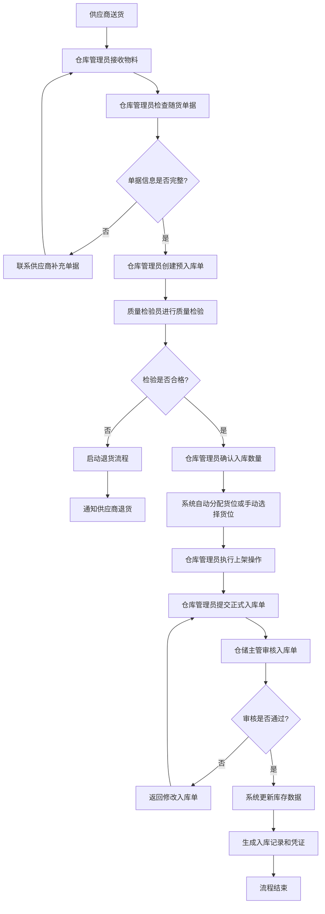
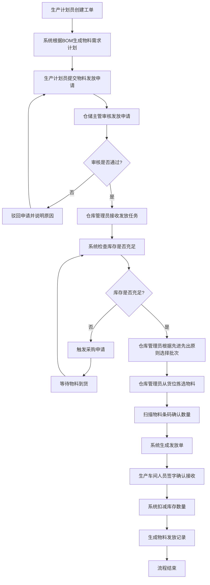
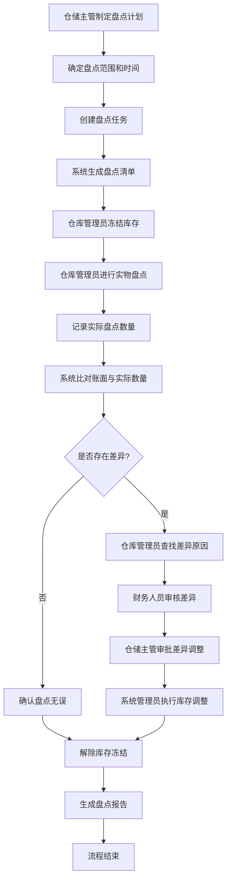
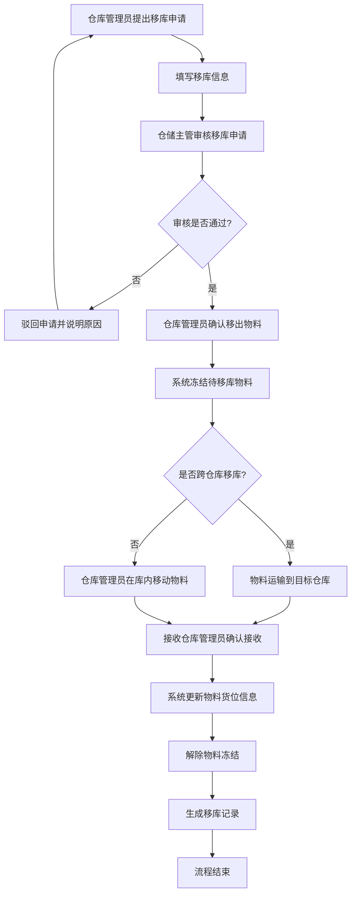
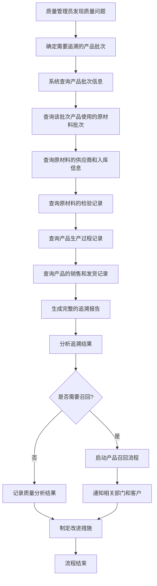
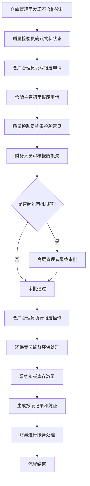

# 仓库管理子系统 - 业务流程详细描述

## 1. 文档目的

本文档详细描述仓库管理子系统中的核心业务流程，包括流程步骤、参与角色、数据流转和相关系统交互。通过本流程描述，确保开发团队、测试团队和业务用户对系统业务流程有统一的理解。

## 2. 流程建模方法

本文档采用业务流程图(BPMN)标准描述业务流程，包含以下元素：

- **活动(Activity)**：流程中的任务或操作
- **网关(Gateway)**：流程的分支或合并点
- **事件(Event)**：流程的开始、结束或中间触发点
- **流程流(Flow)**：活动之间的连接，表示流程方向
- **角色(Pool)**：参与流程的组织或系统

## 3. 核心业务流程详细描述

### 3.1 物料入库流程

#### 3.1.1 流程概述

物料入库流程是指物料从外部进入仓库，并在系统中进行登记、检验和上架的完整过程。该流程确保入库物料信息准确记录，库存数据及时更新，并为后续的物料管理提供基础。

#### 3.1.2 流程参与者

- **供应商**：提供物料的外部单位
- **仓库管理员**：负责物料接收和入库登记
- **质量检验员**：负责物料质量检验
- **仓储主管**：负责入库单审核

#### 3.1.3 流程详细步骤

#### 3.1.4 数据流转

1. **预入库单数据**：物料编号、名称、规格、供应商、预计数量、交货日期
2. **检验结果数据**：检验项目、检验标准、检验结果、不合格原因（如有）
3. **正式入库单数据**：物料信息、实际入库数量、批次号、有效期、存放货位、入库时间
4. **库存更新数据**：物料编号、货位、批次、数量变更、操作时间、操作人

#### 3.1.5 系统交互

1. **与采购管理系统交互**：获取采购订单信息，验证到货物料
2. **与质量管理系统交互**：提交检验申请，获取检验结果
3. **与财务系统交互**：生成入库凭证，用于后续付款结算

### 3.2 物料发放流程

#### 3.2.1 流程概述

物料发放流程是指根据生产工单或其他需求，从仓库中领取物料并进行发放登记的过程。该流程确保物料准确发放到需求部门，并维护库存数据的准确性。

#### 3.2.2 流程参与者

- **生产计划员**：提交物料需求申请
- **仓库管理员**：负责物料发放操作
- **生产车间人员**：接收发放的物料
- **仓储主管**：审核物料发放申请

#### 3.2.3 流程详细步骤

#### 3.2.4 数据流转

1. **物料需求数据**：工单编号、物料清单、需求数量、需求日期
2. **库存检查数据**：物料编号、当前库存数量、可用数量、分配数量
3. **物料发放数据**：发放单号、物料信息、实际发放数量、批次号、发放时间、接收人
4. **库存更新数据**：物料编号、货位、批次、数量变更、操作时间、操作人

#### 3.2.5 系统交互

1. **与生产管理系统交互**：获取工单信息和物料需求清单
2. **与采购管理系统交互**：当库存不足时，触发采购申请
3. **与质量管理系统交互**：检查物料是否在有效期内

### 3.3 库存盘点流程

#### 3.3.1 流程概述

库存盘点流程是指定期或不定期对仓库中的物料进行实物清点，并与系统账面数据进行比对，发现差异并进行调整的过程。该流程确保库存数据的准确性和真实性。

#### 3.3.2 流程参与者

- **仓储主管**：发起盘点任务，审核盘点结果
- **仓库管理员**：执行实物盘点，记录盘点数据
- **财务人员**：参与监盘，确认盘点差异
- **系统管理员**：执行盘点调整操作

#### 3.3.3 流程详细步骤

#### 3.3.4 数据流转

1. **盘点计划数据**：盘点编号、盘点范围、计划日期、参与人员
2. **盘点清单数据**：物料编号、账面数量、货位、批次信息
3. **实际盘点数据**：物料编号、实际数量、盘点时间、盘点人
4. **差异数据**：物料编号、账面数量、实际数量、差异数量、差异原因
5. **调整数据**：调整单号、物料编号、调整数量、调整原因、审批人

#### 3.3.5 系统交互

1. **与财务系统交互**：提供盘点差异数据，用于财务核算
2. **与审计系统交互**：记录盘点过程和调整记录，用于审计

### 3.4 物料移库流程

#### 3.4.1 流程概述

物料移库流程是指物料在不同仓库或同一仓库内不同货位之间的移动过程。该流程确保物料存储位置的合理性和库存数据的准确性。

#### 3.4.2 流程参与者

- **仓库管理员**：提出移库申请，执行移库操作
- **仓储主管**：审核移库申请
- **接收仓库管理员**：确认接收物料（跨仓库移库时）

#### 3.4.3 流程详细步骤

#### 3.4.4 数据流转

1. **移库申请数据**：移库单号、物料信息、移出仓库/货位、移入仓库/货位、移库数量、移库原因
2. **移库执行数据**：实际移库数量、移库时间、操作人
3. **库存更新数据**：物料编号、原货位、新货位、数量变更

### 3.5 批次追溯流程

#### 3.5.1 流程概述

批次追溯流程是指根据产品或物料的批次信息，追踪其在供应链中的流动过程，包括原材料来源、生产过程和最终去向。该流程对于质量问题的快速定位和召回管理至关重要。

#### 3.5.2 流程参与者

- **质量管理员**：发起追溯请求，分析追溯结果
- **仓库管理员**：提供物料批次信息
- **生产管理员**：提供生产过程信息
- **销售管理员**：提供产品销售信息

#### 3.5.3 流程详细步骤

#### 3.5.4 数据流转

1. **追溯请求数据**：产品编号、批次号、追溯方向（正向/反向）
2. **批次链数据**：每一级物料的批次号、供应商、入库日期、检验结果
3. **生产过程数据**：生产工单、生产时间、操作人员、关键参数
4. **销售发货数据**：客户信息、发货日期、数量、批次号
5. **追溯报告数据**：完整的物料流向图、关键节点信息、异常情况

#### 3.5.5 系统交互

1. **与质量管理系统交互**：获取质量检验数据和质量问题记录
2. **与生产管理系统交互**：获取生产过程数据和工艺参数
3. **与销售管理系统交互**：获取产品销售和客户信息

### 3.6 物料报废流程

#### 3.6.1 流程概述

物料报废流程是指对过期、损坏或质量不合格的物料进行识别、审批和处理的过程。该流程确保不合格物料及时处理，避免误用，并维护库存数据的准确性。

#### 3.6.2 流程参与者

- **仓库管理员**：发现需要报废的物料，提出报废申请
- **质量检验员**：确认物料是否需要报废
- **仓储主管**：审核报废申请
- **财务人员**：确认报废损失
- **环保专员**：监督报废物料的环保处理

#### 3.6.3 流程详细步骤

#### 3.6.4 数据流转

1. **报废申请数据**：物料编号、数量、批次号、报废原因、申请日期
2. **质量检验数据**：检验结论、不合格项目、检验日期
3. **报废审批数据**：各环节审批意见、审批人、审批日期
4. **报废执行数据**：实际报废数量、处理方式、处理日期
5. **财务处理数据**：损失金额、账务处理凭证

#### 3.6.5 系统交互

1. **与质量管理系统交互**：获取质量检验报告和判定结果
2. **与财务系统交互**：生成报废损失凭证，用于财务核算
3. **与环保管理系统交互**：记录报废物料的环保处理情况

## 4. 业务流程集成点

### 4.1 与认证子系统集成

所有业务流程均需要通过认证子系统进行身份验证和权限控制，确保只有授权用户才能执行相应操作。

### 4.2 与采购管理系统集成

- 入库流程需要从采购管理系统获取采购订单信息
- 库存不足时，物料发放流程需要触发采购申请

### 4.3 与生产管理系统集成

- 物料发放流程需要获取工单信息和物料需求计划
- 生产完成后的成品入库需要记录生产批次信息

### 4.4 与质量管理系统集成

- 入库物料需要进行质量检验
- 库存物料的定期质量检查
- 质量问题的追溯和处理

### 4.5 与财务系统集成

- 入库、出库、报废等操作需要生成财务凭证
- 库存价值的核算和报表生成

## 5. 流程优化建议

1. **自动化处理**：对于常规入库流程，可考虑通过条形码/RFID技术实现自动识别和数据录入，减少人工操作
2. **移动应用**：开发仓库管理移动应用，使仓库管理员可以在现场进行操作，提高效率
3. **智能推荐**：基于历史数据和物料特性，实现货位智能推荐和物料需求预测
4. **预警机制**：建立库存预警机制，对库存异常情况（如低库存、过期物料）及时提醒
5. **数据分析**：加强对仓库运营数据的分析，识别流程瓶颈，持续优化业务流程

## 6. 文档版本管理

| 版本号 | 修改日期 | 修改人 | 修改内容 | 审批人 |
|--------|----------|--------|----------|--------|
| V1.0   | 2023-XX-XX | XXX | 初始版本 | XXX |

---

*本文档由仓库管理子系统项目组编制，最终解释权归项目组所有。*