# 仓库管理子系统 - 用例图和用例描述文档

## 1. 文档目的

本文档旨在通过用例图和详细的用例描述，定义仓库管理子系统中用户与系统的交互场景和功能边界。本文档将作为系统设计、开发和测试的重要依据，确保所有功能需求都得到明确的捕获和描述。

## 2. 术语定义

| 术语 | 解释 |
|------|------|
| 用例 | 描述系统与外部实体（参与者）之间的交互，定义一个完整的功能场景 |
| 参与者 | 与系统交互的外部实体，可以是人、系统或其他组织 |
| 扩展点 | 用例中可以被其他用例扩展的位置 |
| 包含关系 | 一个用例包含另一个用例的功能 |
| 扩展关系 | 一个用例可以扩展另一个用例的功能 |
| 泛化关系 | 一般用例与特殊用例之间的关系 |

## 3. 参与者定义

### 3.1 主要参与者

| 参与者 | 描述 | 主要职责 |
|--------|------|----------|
| 仓库管理员 | 负责日常仓库操作的人员 | 入库处理、发放管理、库存盘点、货位管理 |
| 质量检验员 | 负责物料质量检验的人员 | 入库检验、质量判定、不合格品处理 |
| 物料申请人 | 申请领取物料的生产或其他部门人员 | 提交物料申请、查询申请状态 |
| 仓库主管 | 负责仓库管理和决策的人员 | 审批单据、配置参数、查看报表 |
| 系统管理员 | 负责系统维护和用户管理的IT人员 | 用户权限管理、系统配置、日志审计 |

### 3.2 外部系统参与者

| 参与者 | 描述 | 主要交互 |
|--------|------|----------|
| MES系统 | 制造执行系统 | 物料需求同步、消耗确认、生产工单关联 |
| QMS系统 | 质量管理系统 | 质量状态同步、检验结果反馈 |
| 采购系统 | 采购管理系统 | 采购订单同步、供应商信息共享 |
| 财务系统 | 财务管理系统 | 成本核算、库存价值同步 |

## 4. 系统用例图

### 4.1 顶层用例图

```mermaid
flowchart TD
    subgraph "仓库管理子系统"
        U1[物料主数据管理] --> U11[新增物料]
        U1 --> U12[修改物料]
        U1 --> U13[查询物料]
        U1 --> U14[物料分类管理]
        
        U2[入库管理] --> U21[创建入库单]
        U2 --> U22[审核入库单]
        U2 --> U23[执行入库]
        U2 --> U24[入库异常处理]
        
        U3[发放管理] --> U31[创建发放申请]
        U3 --> U32[审核发放申请]
        U3 --> U33[执行发放]
        U3 --> U34[发放反馈]
        
        U4[库存管理] --> U41[查询库存]
        U4 --> U42[库存预警]
        U4 --> U43[库存调整]
        U4 --> U44[库存盘点]
        
        U5[批次追溯管理] --> U51[批次查询]
        U5 --> U52[正向追溯]
        U5 --> U53[反向追溯]
        U5 --> U54[追溯报告生成]
        
        U6[货位管理] --> U61[货位定义]
        U6 --> U62[货位分配]
        U6 --> U63[货位状态管理]
        U6 --> U64[货位可视化]
        
        U7[供应商管理] --> U71[新增供应商]
        U7 --> U72[维护供应商信息]
        U7 --> U73[供应商绩效评估]
        
        U8[报表统计] --> U81[库存报表]
        U8 --> U82[业务报表]
        U8 --> U83[自定义报表]
        
        U9[系统管理] --> U91[用户管理]
        U9 --> U92[权限管理]
        U9 --> U93[参数配置]
        U9 --> U94[日志审计]
    end
    
    A1[仓库管理员] --> U1
    A1 --> U2
    A1 --> U3
    A1 --> U4
    A1 --> U5
    A1 --> U6
    A1 --> U8
    
    A2[质量检验员] --> U2
    A2 --> U5
    
    A3[物料申请人] --> U3
    A3 --> U4
    
    A4[仓库主管] --> U2
    A4 --> U3
    A4 --> U4
    A4 --> U7
    A4 --> U8
    A4 --> U9
    
    A5[系统管理员] --> U9
    
    S1[MES系统] --> U3
    S1 --> U4
    S2[QMS系统] --> U2
    S2 --> U5
    S3[采购系统] --> U2
    S3 --> U7
    S4[财务系统] --> U4
    S4 --> U8
```

## 5. 详细用例描述

### 5.1 物料主数据管理用例

#### 5.1.1 新增物料

**用例ID**: WM-MDM-001

**用例名称**: 新增物料

**参与者**: 仓库管理员

**前置条件**: 
- 参与者已登录系统
- 参与者具有物料管理权限

**后置条件**: 
- 新物料信息被成功保存到系统
- 系统生成唯一的物料编码

**流程描述**: 
1. 参与者从主菜单进入物料管理页面
2. 参与者点击"新增物料"按钮
3. 系统显示物料信息录入表单
4. 参与者填写物料信息（名称、规格、型号、分类、单位、安全库存等）
5. 参与者上传物料图片/文档（可选）
6. 参与者点击"保存"按钮
7. 系统验证输入数据的完整性和有效性
8. 系统生成物料编码并保存物料信息
9. 系统显示保存成功提示
10. 系统返回物料列表页面

**异常流程**: 
- 若输入数据无效，系统显示错误提示并高亮显示错误字段
- 若保存失败，系统显示错误信息

#### 5.1.2 修改物料

**用例ID**: WM-MDM-002

**用例名称**: 修改物料

**参与者**: 仓库管理员

**前置条件**: 
- 参与者已登录系统
- 参与者具有物料管理权限
- 要修改的物料已存在

**后置条件**: 
- 物料信息被成功更新

**流程描述**: 
1. 参与者从主菜单进入物料管理页面
2. 参与者在物料列表中找到要修改的物料，点击"编辑"按钮
3. 系统显示物料信息编辑表单，预填充当前物料信息
4. 参与者修改必要的物料信息
5. 参与者点击"保存"按钮
6. 系统验证输入数据的完整性和有效性
7. 系统更新物料信息
8. 系统显示保存成功提示
9. 系统返回物料列表页面

**异常流程**: 
- 若物料被锁定（正在被其他操作使用），系统提示无法修改
- 若输入数据无效，系统显示错误提示
- 若更新失败，系统显示错误信息

#### 5.1.3 查询物料

**用例ID**: WM-MDM-003

**用例名称**: 查询物料

**参与者**: 仓库管理员、物料申请人、仓库主管

**前置条件**: 
- 参与者已登录系统

**后置条件**: 
- 显示符合查询条件的物料列表

**流程描述**: 
1. 参与者从主菜单进入物料管理页面
2. 参与者在搜索框中输入查询条件（如物料编码、名称、规格等）
3. 参与者可以使用高级筛选功能设置更多筛选条件（如分类、单位、状态等）
4. 参与者点击"查询"按钮
5. 系统根据查询条件检索物料信息
6. 系统在物料列表中显示查询结果
7. 参与者可以对查询结果进行排序、分页操作
8. 参与者可以点击物料行查看详细信息

**异常流程**: 
- 若无符合条件的物料，系统显示"未找到相关记录"提示

#### 5.1.4 物料分类管理

**用例ID**: WM-MDM-004

**用例名称**: 物料分类管理

**参与者**: 仓库管理员、仓库主管

**前置条件**: 
- 参与者已登录系统
- 参与者具有物料分类管理权限

**后置条件**: 
- 物料分类体系被成功创建或更新

**流程描述**: 
1. 参与者从主菜单进入物料分类管理页面
2. 参与者可以查看现有的物料分类树
3. 参与者可以点击"新增分类"按钮添加新分类
   a. 系统显示分类信息录入表单
   b. 参与者输入分类名称、编码、描述等信息
   c. 参与者选择父级分类
   d. 参与者点击"保存"按钮
   e. 系统保存分类信息并更新分类树
4. 参与者可以点击"编辑"按钮修改现有分类信息
5. 参与者可以点击"删除"按钮删除不需要的分类
   a. 系统弹出确认对话框
   b. 参与者确认删除
   c. 系统删除分类（如果没有子分类和关联物料）

**异常流程**: 
- 若要删除的分类包含子分类或已关联物料，系统提示无法删除
- 若操作失败，系统显示错误信息

### 5.2 入库管理用例

#### 5.2.1 创建入库单

**用例ID**: WM-RCV-001

**用例名称**: 创建入库单

**参与者**: 仓库管理员

**前置条件**: 
- 参与者已登录系统
- 参与者具有入库管理权限
- 相关物料主数据已存在

**后置条件**: 
- 入库单被成功创建，状态为"草稿"

**流程描述**: 
1. 参与者从主菜单进入入库管理页面
2. 参与者点击"新增入库单"按钮
3. 系统显示入库单创建表单
4. 参与者选择入库类型、供应商、来源单据等基本信息
5. 参与者点击"添加明细"按钮添加物料明细
   a. 系统显示物料选择界面
   b. 参与者选择物料并输入数量、批次、有效期等信息
   c. 参与者点击"确认"添加到明细列表
6. 参与者可以修改或删除明细项
7. 参与者点击"保存"按钮
8. 系统验证入库单信息的完整性和有效性
9. 系统创建入库单并生成入库单号
10. 系统显示保存成功提示
11. 系统返回入库单列表页面

**异常流程**: 
- 若输入数据无效，系统显示错误提示
- 若保存失败，系统显示错误信息

#### 5.2.2 审核入库单

**用例ID**: WM-RCV-002

**用例名称**: 审核入库单

**参与者**: 仓库主管、质量检验员

**前置条件**: 
- 参与者已登录系统
- 参与者具有入库单审核权限
- 入库单状态为"待审核"或"待质检"

**后置条件**: 
- 入库单状态变更为"已审核"或"已质检"（根据流程）

**流程描述**: 
1. 参与者从主菜单进入入库管理页面
2. 参与者筛选状态为"待审核"或"待质检"的入库单
3. 参与者点击要审核的入库单的"审核"按钮
4. 系统显示入库单详情页面，包含审核操作区域
5. 参与者审核入库单信息和物料明细
6. 若需要质检，质量检验员填写检验结果
7. 参与者选择"审核通过"或"审核拒绝"
8. 参与者填写审核意见（可选）
9. 参与者点击"提交"按钮
10. 系统更新入库单状态
11. 系统显示操作成功提示
12. 系统返回入库单列表页面

**异常流程**: 
- 若审核拒绝，系统提示入库单被拒绝，可重新编辑
- 若质检不合格，系统提示质检不合格，进入异常处理流程

#### 5.2.3 执行入库

**用例ID**: WM-RCV-003

**用例名称**: 执行入库

**参与者**: 仓库管理员

**前置条件**: 
- 参与者已登录系统
- 参与者具有入库执行权限
- 入库单状态为"已审核"或"已质检"

**后置条件**: 
- 入库单状态变更为"已完成"
- 库存数量增加
- 货位分配记录更新

**流程描述**: 
1. 参与者从主菜单进入入库管理页面
2. 参与者筛选状态为"已审核"或"已质检"的入库单
3. 参与者点击要执行的入库单的"执行入库"按钮
4. 系统显示入库执行界面，包含物料明细和货位分配区域
5. 参与者为每个物料明细分配货位
6. 参与者确认实际入库数量（可与计划数量不同）
7. 参与者点击"确认入库"按钮
8. 系统验证数据完整性
9. 系统更新库存数量
10. 系统更新入库单状态为"已完成"
11. 系统记录库存变动历史
12. 系统显示操作成功提示
13. 系统返回入库单列表页面

**异常流程**: 
- 若分配的货位库存不足，系统提示无法执行
- 若实际数量与计划数量差异过大，系统提示需要特殊授权

### 5.3 发放管理用例

#### 5.3.1 创建发放申请

**用例ID**: WM-ISS-001

**用例名称**: 创建发放申请

**参与者**: 物料申请人

**前置条件**: 
- 参与者已登录系统
- 参与者具有发放申请权限
- 相关物料主数据已存在

**后置条件**: 
- 发放申请单被成功创建，状态为"草稿"

**流程描述**: 
1. 参与者从主菜单进入发放管理页面
2. 参与者点击"新增发放申请"按钮
3. 系统显示发放申请创建表单
4. 参与者选择申请类型、申请部门、用途等基本信息
5. 参与者点击"添加明细"按钮添加物料明细
   a. 系统显示物料选择界面
   b. 参与者选择物料并输入申请数量、用途等信息
   c. 参与者点击"确认"添加到明细列表
6. 参与者可以修改或删除明细项
7. 参与者点击"保存"按钮
8. 系统验证申请单信息的完整性和有效性
9. 系统创建发放申请单并生成申请单号
10. 系统显示保存成功提示
11. 系统返回发放申请列表页面

**异常流程**: 
- 若输入数据无效，系统显示错误提示
- 若保存失败，系统显示错误信息

#### 5.3.2 审核发放申请

**用例ID**: WM-ISS-002

**用例名称**: 审核发放申请

**参与者**: 仓库主管

**前置条件**: 
- 参与者已登录系统
- 参与者具有发放申请审核权限
- 发放申请单状态为"待审核"
- 相关物料库存充足

**后置条件**: 
- 发放申请单状态变更为"已审核"

**流程描述**: 
1. 参与者从主菜单进入发放管理页面
2. 参与者筛选状态为"待审核"的发放申请
3. 参与者点击要审核的申请单的"审核"按钮
4. 系统显示申请单详情页面，包含审核操作区域
5. 参与者审核申请单信息和物料明细
6. 系统显示当前库存状态
7. 参与者选择"审核通过"或"审核拒绝"
8. 参与者填写审核意见（可选）
9. 参与者点击"提交"按钮
10. 系统更新申请单状态
11. 系统显示操作成功提示
12. 系统返回发放申请列表页面

**异常流程**: 
- 若审核拒绝，系统提示申请被拒绝，可重新编辑
- 若库存不足，系统提示库存不足，建议调整申请数量

#### 5.3.3 执行发放

**用例ID**: WM-ISS-003

**用例名称**: 执行发放

**参与者**: 仓库管理员

**前置条件**: 
- 参与者已登录系统
- 参与者具有发放执行权限
- 发放申请单状态为"已审核"
- 相关物料库存充足

**后置条件**: 
- 发放申请单状态变更为"已完成"
- 库存数量减少
- 领取记录被创建

**流程描述**: 
1. 参与者从主菜单进入发放管理页面
2. 参与者筛选状态为"已审核"的发放申请
3. 参与者点击要执行的申请单的"执行发放"按钮
4. 系统显示发放执行界面，包含物料明细和批次选择区域
5. 系统根据FIFO原则推荐批次
6. 参与者确认或调整发放批次
7. 参与者确认实际发放数量
8. 参与者输入领取人信息
9. 参与者点击"确认发放"按钮
10. 系统验证数据完整性和库存可用性
11. 系统更新库存数量
12. 系统更新申请单状态为"已完成"
13. 系统记录库存变动历史
14. 系统显示操作成功提示
15. 系统返回发放申请列表页面

**异常流程**: 
- 若库存不足，系统提示无法执行
- 若选择的批次无效，系统提示错误

### 5.4 库存管理用例

#### 5.4.1 查询库存

**用例ID**: WM-STK-001

**用例名称**: 查询库存

**参与者**: 仓库管理员、物料申请人、仓库主管

**前置条件**: 
- 参与者已登录系统

**后置条件**: 
- 显示符合查询条件的库存信息

**流程描述**: 
1. 参与者从主菜单进入库存管理页面
2. 参与者在搜索框中输入查询条件（如物料编码、名称、批次等）
3. 参与者可以使用高级筛选功能设置更多筛选条件（如仓库、货位、状态等）
4. 参与者点击"查询"按钮
5. 系统根据查询条件检索库存信息
6. 系统在库存列表中显示查询结果，包括物料、批次、数量、货位等信息
7. 参与者可以对查询结果进行排序、分页操作
8. 参与者可以点击库存记录查看历史变动

**异常流程**: 
- 若无符合条件的库存记录，系统显示"未找到相关记录"提示

#### 5.4.2 库存预警

**用例ID**: WM-STK-002

**用例名称**: 库存预警

**参与者**: 仓库管理员、仓库主管

**前置条件**: 
- 参与者已登录系统
- 系统已配置库存预警规则

**后置条件**: 
- 系统显示库存预警信息
- 相关人员收到预警通知

**流程描述**: 
1. 参与者从主菜单进入库存预警页面
2. 系统自动显示所有触发预警条件的物料库存
3. 系统按预警类型（低于安全库存、即将过期、质量异常等）分类显示
4. 参与者可以筛选预警类型、时间范围等条件
5. 参与者可以点击预警记录查看详情
6. 参与者可以对预警进行处理（如标记已处理、创建采购申请等）
7. 系统记录预警处理状态

**异常流程**: 
- 若系统预警规则配置错误，可能导致误报或漏报

#### 5.4.3 库存调整

**用例ID**: WM-STK-003

**用例名称**: 库存调整

**参与者**: 仓库管理员、仓库主管

**前置条件**: 
- 参与者已登录系统
- 参与者具有库存调整权限
- 相关物料库存记录存在

**后置条件**: 
- 库存数量被调整
- 调整记录被保存

**流程描述**: 
1. 参与者从主菜单进入库存调整页面
2. 参与者点击"新增调整单"按钮
3. 系统显示库存调整表单
4. 参与者选择调整类型（增加/减少）、调整原因
5. 参与者选择需要调整的物料和批次
6. 参与者输入调整数量
7. 参与者点击"提交"按钮
8. 系统验证调整数据的有效性
9. 系统更新库存数量
10. 系统记录库存调整历史
11. 系统显示操作成功提示

**异常流程**: 
- 若调整后库存数量为负，系统提示错误
- 若调整审批未通过，系统提示调整失败

#### 5.4.4 库存盘点

**用例ID**: WM-STK-004

**用例名称**: 库存盘点

**参与者**: 仓库管理员、仓库主管

**前置条件**: 
- 参与者已登录系统
- 参与者具有库存盘点权限

**后置条件**: 
- 盘点计划被执行
- 盘点差异被记录
- 必要时调整库存

**流程描述**: 
1. 参与者从主菜单进入库存盘点页面
2. 参与者点击"新建盘点计划"按钮
3. 系统显示盘点计划创建表单
4. 参与者输入盘点名称、范围、时间等信息
5. 参与者点击"生成盘点任务"按钮
6. 系统生成盘点任务并分配给相应人员
7. 盘点人员执行盘点任务，输入实际盘点数量
8. 系统自动计算盘点差异
9. 参与者审核盘点结果
10. 参与者选择是否根据盘点结果调整库存
11. 系统更新库存数据（如需）
12. 系统生成盘点报告

**异常流程**: 
- 若盘点差异过大，系统提示需要特殊审批
- 若盘点过程中断，系统支持断点续盘

### 5.5 批次追溯管理用例

#### 5.5.1 批次查询

**用例ID**: WM-LOT-001

**用例名称**: 批次查询

**参与者**: 仓库管理员、质量检验员、仓库主管

**前置条件**: 
- 参与者已登录系统

**后置条件**: 
- 显示符合查询条件的批次信息

**流程描述**: 
1. 参与者从主菜单进入批次管理页面
2. 参与者在搜索框中输入查询条件（如批次号、物料编码、生产日期等）
3. 参与者可以使用高级筛选功能设置更多筛选条件（如状态、有效期等）
4. 参与者点击"查询"按钮
5. 系统根据查询条件检索批次信息
6. 系统在批次列表中显示查询结果，包括批次号、物料、数量、状态等信息
7. 参与者可以对查询结果进行排序、分页操作
8. 参与者可以点击批次记录查看详细信息

**异常流程**: 
- 若无符合条件的批次记录，系统显示"未找到相关记录"提示

#### 5.5.2 正向追溯

**用例ID**: WM-LOT-002

**用例名称**: 正向追溯

**参与者**: 质量检验员、仓库主管

**前置条件**: 
- 参与者已登录系统
- 参与者具有批次追溯权限
- 输入的批次号或物料编码有效

**后置条件**: 
- 显示物料的正向流转路径和使用情况

**流程描述**: 
1. 参与者从主菜单进入批次追溯页面
2. 参与者选择"正向追溯"模式
3. 参与者输入起始批次号或物料编码
4. 参与者点击"开始追溯"按钮
5. 系统根据起始批次信息，追踪物料的发放、使用、消耗路径
6. 系统以图表和列表形式显示追溯结果
7. 参与者可以点击追溯路径中的节点查看详细信息
8. 参与者可以导出追溯报告

**异常流程**: 
- 若输入的批次号或物料编码无效，系统显示错误提示
- 若追溯过程中发现数据缺失，系统提示数据不完整

#### 5.5.3 反向追溯

**用例ID**: WM-LOT-003

**用例名称**: 反向追溯

**参与者**: 质量检验员、仓库主管

**前置条件**: 
- 参与者已登录系统
- 参与者具有批次追溯权限
- 输入的产品编号或物料使用点有效

**后置条件**: 
- 显示物料的来源和上游供应商信息

**流程描述**: 
1. 参与者从主菜单进入批次追溯页面
2. 参与者选择"反向追溯"模式
3. 参与者输入目标产品编号或物料使用点信息
4. 参与者点击"开始追溯"按钮
5. 系统从目标点出发，追踪物料的来源、供应商、入库批次等信息
6. 系统以图表和列表形式显示追溯结果
7. 参与者可以点击追溯路径中的节点查看详细信息
8. 参与者可以导出追溯报告

**异常流程**: 
- 若输入的产品编号或使用点无效，系统显示错误提示
- 若追溯过程中发现数据缺失，系统提示数据不完整

### 5.6 系统管理用例

#### 5.6.1 用户管理

**用例ID**: WM-SYS-001

**用例名称**: 用户管理

**参与者**: 系统管理员

**前置条件**: 
- 参与者已登录系统
- 参与者具有用户管理权限

**后置条件**: 
- 用户信息被成功创建、修改或删除

**流程描述**: 
1. 参与者从主菜单进入系统管理页面
2. 参与者选择"用户管理"功能
3. 系统显示用户列表页面
4. **新增用户流程**:
   a. 参与者点击"新增用户"按钮
   b. 系统显示用户信息录入表单
   c. 参与者输入用户名、密码、角色等信息
   d. 参与者点击"保存"按钮
   e. 系统创建用户并返回用户列表
5. **修改用户流程**:
   a. 参与者选择要修改的用户，点击"编辑"按钮
   b. 系统显示用户信息编辑表单
   c. 参与者修改用户信息
   d. 参与者点击"保存"按钮
   e. 系统更新用户信息
6. **删除用户流程**:
   a. 参与者选择要删除的用户，点击"删除"按钮
   b. 系统弹出确认对话框
   c. 参与者确认删除
   d. 系统删除用户（如果用户未关联业务数据）
7. **重置密码流程**:
   a. 参与者选择要重置密码的用户，点击"重置密码"按钮
   b. 系统生成新密码并发送给用户

**异常流程**: 
- 若用户已关联业务数据，系统提示无法删除
- 若操作失败，系统显示错误信息

#### 5.6.2 权限管理

**用例ID**: WM-SYS-002

**用例名称**: 权限管理

**参与者**: 系统管理员

**前置条件**: 
- 参与者已登录系统
- 参与者具有权限管理权限

**后置条件**: 
- 角色和权限配置被成功创建、修改或删除

**流程描述**: 
1. 参与者从主菜单进入系统管理页面
2. 参与者选择"权限管理"功能
3. 系统显示角色列表页面
4. **新增角色流程**:
   a. 参与者点击"新增角色"按钮
   b. 系统显示角色信息录入表单
   c. 参与者输入角色名称、描述等信息
   d. 参与者为角色分配权限（功能权限、数据权限）
   e. 参与者点击"保存"按钮
   f. 系统创建角色并返回角色列表
5. **修改角色流程**:
   a. 参与者选择要修改的角色，点击"编辑"按钮
   b. 系统显示角色信息编辑表单
   c. 参与者修改角色信息和权限分配
   d. 参与者点击"保存"按钮
   e. 系统更新角色信息
6. **删除角色流程**:
   a. 参与者选择要删除的角色，点击"删除"按钮
   b. 系统弹出确认对话框
   c. 参与者确认删除
   d. 系统删除角色（如果角色未分配给用户）
7. **用户角色分配**:
   a. 参与者选择用户，点击"分配角色"按钮
   b. 系统显示角色选择界面
   c. 参与者选择要分配的角色
   d. 参与者点击"确认"按钮
   e. 系统更新用户角色

**异常流程**: 
- 若角色已分配给用户，系统提示无法删除
- 若权限配置冲突，系统提示错误

## 6. 扩展点和包含关系

### 6.1 扩展点

| 用例 | 扩展点 | 触发条件 | 扩展用例 |
|------|--------|----------|----------|
| 执行入库 | 发现质量异常 | 质检不合格 | 入库异常处理 |
| 执行发放 | 库存不足 | 实际库存小于申请数量 | 库存预警处理 |
| 库存调整 | 差异过大 | 调整数量超过阈值 | 特殊审批流程 |
| 批次追溯 | 发现问题批次 | 追溯发现异常物料 | 质量事件处理 |

### 6.2 包含关系

| 用例 | 包含用例 | 描述 |
|------|----------|------|
| 所有业务用例 | 用户认证 | 所有业务操作前必须进行用户认证 |
| 创建入库单 | 查询物料 | 创建入库单时需要选择物料 |
| 执行入库 | 货位分配 | 执行入库时需要分配货位 |
| 执行发放 | 批次选择 | 执行发放时需要选择批次 |
| 库存盘点 | 盘点差异处理 | 盘点完成后需要处理盘点差异 |

## 7. 用例优先级

| 优先级 | 用例范围 | 说明 |
|--------|----------|------|
| 高 | 基础功能 | 包括物料主数据管理、基础入库/发放流程、库存查询等核心功能 |
| 中 | 扩展功能 | 包括批次追溯、高级报表、预警管理等提升系统价值的功能 |
| 低 | 优化功能 | 包括界面优化、操作简化、性能提升等改善用户体验的功能 |

## 8. 文档版本管理

| 版本号 | 修改日期 | 修改人 | 修改内容 | 审批人 |
|--------|----------|--------|----------|--------|
| V1.0   | 2023-XX-XX | XXX | 初始版本 | XXX |

---

*本文档由仓库管理子系统项目组编制，最终解释权归项目组所有。*