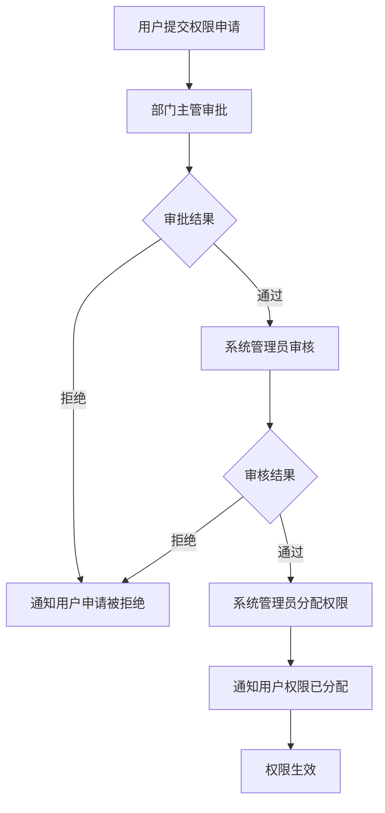
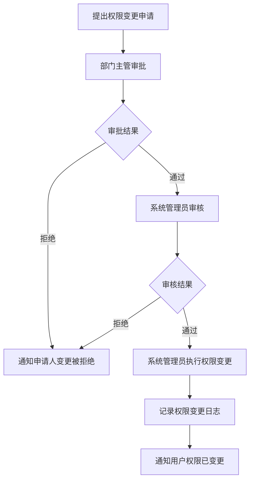

# 仓库管理子系统 - 角色权限矩阵文档

## 1. 文档目的

本文档旨在定义仓库管理子系统中的角色和权限分配，明确不同角色对系统功能模块的访问和操作权限。通过建立清晰的权限矩阵，确保系统安全性、数据保密性和操作合规性，同时满足GMP标准对权限管理的要求。本文档将作为系统开发、测试和运维的重要依据。

## 2. 术语定义

| 术语 | 解释 |
|------|------|
| 角色 | 系统中定义的具有相同权限集合的用户分组 |
| 权限 | 对系统功能或数据执行特定操作的许可 |
| 功能权限 | 允许用户访问和操作特定系统功能的权限 |
| 数据权限 | 允许用户查看和操作特定数据范围的权限 |
| RBAC | 基于角色的访问控制(Role-Based Access Control)，一种将权限分配给角色，再将角色分配给用户的权限管理方法 |
| GMP | 良好生产规范(Good Manufacturing Practice)，确保产品质量和安全的法规要求 |
| 主数据 | 组织中共享的核心数据，如物料、供应商等 |
| 事务数据 | 记录业务操作过程中产生的数据，如入库单、发放记录等 |

## 3. 角色定义

### 3.1 系统角色概览

| 角色名称 | 角色代码 | 角色类型 | 优先级 | 备注 |
|----------|----------|----------|--------|------|
| 系统管理员 | SYS_ADMIN | 系统管理角色 | 高 | 负责系统整体配置和管理 |
| 仓库主管 | WH_SUPERVISOR | 管理层角色 | 高 | 负责仓库整体运营管理 |
| 质量检验员 | QA_INSPECTOR | 业务操作角色 | 中 | 负责物料质量检验 |
| 仓库管理员 | WH_MANAGER | 业务操作角色 | 高 | 负责日常仓库操作 |
| 物料申请人 | MAT_APPLICANT | 业务操作角色 | 中 | 申请领用物料的人员 |
| 报表查看员 | RPT_VIEWER | 查看角色 | 低 | 仅允许查看报表数据 |
| 临时访客 | TEMP_VISITOR | 查看角色 | 低 | 临时访问权限 |

### 3.2 角色详细说明

#### 3.2.1 系统管理员 (SYS_ADMIN)

**职责描述**：
- 负责系统的整体配置和管理
- 管理所有用户账号和角色权限
- 监控系统运行状态和安全日志
- 执行系统备份和恢复操作
- 处理系统级异常和技术问题

**用户来源**：
- IT部门系统管理员
- 具有系统管理职责的技术人员

#### 3.2.2 仓库主管 (WH_SUPERVISOR)

**职责描述**：
- 负责仓库的整体运营和管理
- 审核重要业务单据和操作
- 监控库存状态和业务流程
- 生成和分析各类业务报表
- 管理供应商信息和评估
- 协调跨部门物料管理工作

**用户来源**：
- 仓库部门主管或经理
- 仓储物流负责人

#### 3.2.3 质量检验员 (QA_INSPECTOR)

**职责描述**：
- 执行物料入库前质量检验
- 记录和管理检验结果
- 处理不合格物料
- 参与质量追溯和异常处理
- 维护质量检验标准和规范

**用户来源**：
- 质量管理部门检验人员
- 具有质量检验资质的仓库人员

#### 3.2.4 仓库管理员 (WH_MANAGER)

**职责描述**：
- 执行日常物料入库、发放操作
- 维护库存数据和货位信息
- 执行库存盘点和调整
- 管理物料批次信息
- 处理日常物料异常情况

**用户来源**：
- 仓库操作人员
- 仓储物流专员

#### 3.2.5 物料申请人 (MAT_APPLICANT)

**职责描述**：
- 提交物料领用申请
- 查询申请状态和物料信息
- 确认收到物料并反馈
- 查看个人申请历史记录

**用户来源**：
- 生产部门人员
- 研发部门人员
- 其他需要使用物料的部门人员

#### 3.2.6 报表查看员 (RPT_VIEWER)

**职责描述**：
- 查看指定的业务报表
- 导出报表数据
- 进行数据查询和分析

**用户来源**：
- 管理层人员
- 财务人员
- 其他需要报表数据的部门人员

#### 3.2.7 临时访客 (TEMP_VISITOR)

**职责描述**：
- 临时查看有限的系统信息
- 仅具备基本查询权限

**用户来源**：
- 临时访问系统的外部人员
- 实习生或新员工（试用期）

## 4. 权限分类

### 4.1 操作权限类型

| 权限代码 | 权限名称 | 权限描述 | 备注 |
|----------|----------|----------|------|
| VIEW | 查看权限 | 允许查看功能或数据 | 最基础的权限 |
| CREATE | 创建权限 | 允许创建新记录或文档 | 写入权限的一种 |
| EDIT | 修改权限 | 允许修改现有记录或文档 | 写入权限的一种 |
| DELETE | 删除权限 | 允许删除记录或文档 | 高风险权限 |
| APPROVE | 审批权限 | 允许审核或批准业务流程 | 管理权限 |
| CONFIG | 配置权限 | 允许修改系统或模块配置 | 系统管理权限 |
| EXPORT | 导出权限 | 允许导出数据或报表 | 数据导出权限 |
| IMPORT | 导入权限 | 允许导入外部数据 | 数据导入权限 |
| AUDIT | 审计权限 | 允许查看审计日志和历史记录 | 合规审计权限 |

### 4.2 数据权限类型

| 数据权限类型 | 描述 | 适用场景 |
|--------------|------|----------|
| 全部数据权限 | 可访问和操作所有数据 | 系统管理员、仓库主管等高级角色 |
| 部门数据权限 | 仅可访问和操作本部门数据 | 按部门划分的业务操作人员 |
| 个人数据权限 | 仅可访问和操作个人相关数据 | 物料申请人、普通用户等 |
| 只读数据权限 | 仅可查看数据，不可修改 | 报表查看员、临时访客等 |

## 5. 详细权限矩阵

### 5.1 功能模块权限矩阵

| 功能模块 | 操作权限 | 系统管理员 (SYS_ADMIN) | 仓库主管 (WH_SUPERVISOR) | 质量检验员 (QA_INSPECTOR) | 仓库管理员 (WH_MANAGER) | 物料申请人 (MAT_APPLICANT) | 报表查看员 (RPT_VIEWER) | 临时访客 (TEMP_VISITOR) |
|----------|----------|----------------------------|-----------------------------|------------------------------|---------------------------|-----------------------------|----------------------------|----------------------------|
| **用户管理** | VIEW | ✓ | ✓ | ✗ | ✗ | ✗ | ✗ | ✗ |
| | CREATE | ✓ | ✗ | ✗ | ✗ | ✗ | ✗ | ✗ |
| | EDIT | ✓ | ✓ | ✗ | ✗ | ✗ | ✗ | ✗ |
| | DELETE | ✓ | ✗ | ✗ | ✗ | ✗ | ✗ | ✗ |
| **角色权限管理** | VIEW | ✓ | ✓ | ✗ | ✗ | ✗ | ✗ | ✗ |
| | CREATE | ✓ | ✗ | ✗ | ✗ | ✗ | ✗ | ✗ |
| | EDIT | ✓ | ✗ | ✗ | ✗ | ✗ | ✗ | ✗ |
| | DELETE | ✓ | ✗ | ✗ | ✗ | ✗ | ✗ | ✗ |
| **物料主数据管理** | VIEW | ✓ | ✓ | ✓ | ✓ | ✓ | ✓ | ✓ |
| | CREATE | ✓ | ✓ | ✗ | ✓ | ✗ | ✗ | ✗ |
| | EDIT | ✓ | ✓ | ✗ | ✓ | ✗ | ✗ | ✗ |
| | DELETE | ✓ | ✓ | ✗ | ✗ | ✗ | ✗ | ✗ |
| | IMPORT | ✓ | ✓ | ✗ | ✗ | ✗ | ✗ | ✗ |
| | EXPORT | ✓ | ✓ | ✓ | ✓ | ✗ | ✓ | ✗ |
| **供应商管理** | VIEW | ✓ | ✓ | ✗ | ✓ | ✗ | ✓ | ✗ |
| | CREATE | ✓ | ✓ | ✗ | ✗ | ✗ | ✗ | ✗ |
| | EDIT | ✓ | ✓ | ✗ | ✗ | ✗ | ✗ | ✗ |
| | DELETE | ✓ | ✗ | ✗ | ✗ | ✗ | ✗ | ✗ |
| **入库管理** | VIEW | ✓ | ✓ | ✓ | ✓ | ✗ | ✓ | ✗ |
| | CREATE | ✓ | ✓ | ✗ | ✓ | ✗ | ✗ | ✗ |
| | EDIT | ✓ | ✓ | ✗ | ✓ | ✗ | ✗ | ✗ |
| | DELETE | ✓ | ✗ | ✗ | ✗ | ✗ | ✗ | ✗ |
| | APPROVE | ✓ | ✓ | ✓ | ✗ | ✗ | ✗ | ✗ |
| | EXPORT | ✓ | ✓ | ✓ | ✓ | ✗ | ✓ | ✗ |
| **发放管理** | VIEW | ✓ | ✓ | ✗ | ✓ | ✓ | ✓ | ✗ |
| | CREATE | ✓ | ✓ | ✗ | ✗ | ✓ | ✗ | ✗ |
| | EDIT | ✓ | ✓ | ✗ | ✗ | ✓ | ✗ | ✗ |
| | DELETE | ✓ | ✗ | ✗ | ✗ | ✗ | ✗ | ✗ |
| | APPROVE | ✓ | ✓ | ✗ | ✗ | ✗ | ✗ | ✗ |
| | EXPORT | ✓ | ✓ | ✗ | ✓ | ✗ | ✓ | ✗ |
| **库存管理** | VIEW | ✓ | ✓ | ✓ | ✓ | ✓ | ✓ | ✓ |
| | CREATE | ✓ | ✓ | ✗ | ✓ | ✗ | ✗ | ✗ |
| | EDIT | ✓ | ✓ | ✗ | ✓ | ✗ | ✗ | ✗ |
| | DELETE | ✓ | ✗ | ✗ | ✗ | ✗ | ✗ | ✗ |
| | EXPORT | ✓ | ✓ | ✓ | ✓ | ✗ | ✓ | ✗ |
| **货位管理** | VIEW | ✓ | ✓ | ✗ | ✓ | ✗ | ✗ | ✗ |
| | CREATE | ✓ | ✓ | ✗ | ✓ | ✗ | ✗ | ✗ |
| | EDIT | ✓ | ✓ | ✗ | ✓ | ✗ | ✗ | ✗ |
| | DELETE | ✓ | ✗ | ✗ | ✗ | ✗ | ✗ | ✗ |
| **批次追溯管理** | VIEW | ✓ | ✓ | ✓ | ✓ | ✗ | ✓ | ✗ |
| | CREATE | ✗ | ✗ | ✗ | ✗ | ✗ | ✗ | ✗ |
| | EDIT | ✗ | ✗ | ✗ | ✗ | ✗ | ✗ | ✗ |
| | DELETE | ✗ | ✗ | ✗ | ✗ | ✗ | ✗ | ✗ |
| | EXPORT | ✓ | ✓ | ✓ | ✓ | ✗ | ✓ | ✗ |
| **报表统计管理** | VIEW | ✓ | ✓ | ✓ | ✓ | ✗ | ✓ | ✗ |
| | CREATE | ✓ | ✓ | ✗ | ✗ | ✗ | ✗ | ✗ |
| | EDIT | ✓ | ✓ | ✗ | ✗ | ✗ | ✗ | ✗ |
| | DELETE | ✓ | ✗ | ✗ | ✗ | ✗ | ✗ | ✗ |
| | EXPORT | ✓ | ✓ | ✓ | ✓ | ✗ | ✓ | ✗ |
| **系统参数配置** | VIEW | ✓ | ✓ | ✗ | ✗ | ✗ | ✗ | ✗ |
| | CONFIG | ✓ | ✓ | ✗ | ✗ | ✗ | ✗ | ✗ |
| **日志审计** | VIEW | ✓ | ✓ | ✗ | ✗ | ✗ | ✗ | ✗ |
| | AUDIT | ✓ | ✗ | ✗ | ✗ | ✗ | ✗ | ✗ |

### 5.2 数据权限矩阵

| 数据类型 | 系统管理员 (SYS_ADMIN) | 仓库主管 (WH_SUPERVISOR) | 质量检验员 (QA_INSPECTOR) | 仓库管理员 (WH_MANAGER) | 物料申请人 (MAT_APPLICANT) | 报表查看员 (RPT_VIEWER) | 临时访客 (TEMP_VISITOR) |
|----------|----------------------------|-----------------------------|------------------------------|---------------------------|-----------------------------|----------------------------|----------------------------|
| 用户数据 | 全部 | 全部 | 无 | 无 | 无 | 无 | 无 |
| 角色权限数据 | 全部 | 全部 | 无 | 无 | 无 | 无 | 无 |
| 物料主数据 | 全部 | 全部 | 全部 | 全部 | 全部 | 全部 | 全部 |
| 供应商数据 | 全部 | 全部 | 无 | 部门 | 无 | 部门 | 无 |
| 入库单据数据 | 全部 | 全部 | 全部 | 部门 | 无 | 部门 | 无 |
| 发放单据数据 | 全部 | 全部 | 无 | 部门 | 个人 | 部门 | 无 |
| 库存数据 | 全部 | 全部 | 全部 | 部门 | 有限（仅查询） | 部门 | 有限（仅查询） |
| 货位数据 | 全部 | 全部 | 无 | 部门 | 无 | 无 | 无 |
| 批次数据 | 全部 | 全部 | 全部 | 部门 | 无 | 部门 | 无 |
| 报表数据 | 全部 | 全部 | 全部（质量相关） | 部门 | 无 | 有限（根据配置） | 无 |
| 系统配置数据 | 全部 | 全部 | 无 | 无 | 无 | 无 | 无 |
| 审计日志数据 | 全部 | 有限（仅查看） | 无 | 无 | 无 | 无 | 无 |

## 6. 权限控制实现建议

### 6.1 权限控制架构

1. **基于RBAC模型**：采用标准的RBAC权限控制模型，通过角色关联用户和权限
2. **权限粒度设计**：
   - 功能级权限：控制用户对具体功能模块的访问
   - 操作级权限：控制用户对具体功能操作的权限（如查看、创建、修改、删除等）
   - 数据级权限：控制用户对特定数据范围的访问和操作
3. **权限继承机制**：支持角色权限的继承，简化权限管理
4. **动态权限分配**：支持在运行时动态分配和调整权限

### 6.2 安全控制措施

1. **权限校验**：所有系统操作必须进行权限校验，包括前端和后端
2. **最小权限原则**：用户仅被分配完成工作所需的最小权限集
3. **权限审批流程**：重要权限的分配和变更需要审批
4. **权限审计**：记录所有权限相关操作，包括权限分配、变更和使用
5. **定期权限审查**：定期审查用户权限，确保权限的合理性和必要性

### 6.3 权限实现技术建议

1. **认证机制**：采用JWT或OAuth2.0进行用户认证
2. **授权实现**：
   - 前端：实现基于路由和组件的权限控制
   - 后端：实现基于API和数据访问层的权限控制
3. **权限缓存**：使用Redis等缓存技术缓存权限数据，提高性能
4. **统一权限管理接口**：提供统一的权限管理API，便于集成和扩展
5. **与认证系统集成**：与企业现有的认证系统（如LDAP、SSO）集成

## 7. 权限申请与变更流程

### 7.1 权限申请流程

### 7.2 权限变更流程

### 7.3 权限撤销流程

1. 系统管理员或用户所在部门主管可以发起权限撤销请求
2. 权限撤销需要记录详细原因
3. 权限撤销后，系统应立即生效，用户将无法使用已撤销的权限
4. 所有权限撤销操作必须记录审计日志

## 8. 权限审计与监控

### 8.1 权限审计内容

1. **用户权限变更记录**：记录所有用户权限的分配、修改和撤销
2. **角色权限变更记录**：记录所有角色权限的创建、修改和删除
3. **关键操作审计**：记录用户执行的关键业务操作
4. **异常访问监控**：监控和记录异常的权限使用情况

### 8.2 权限审计报告

| 报告类型 | 生成周期 | 报告内容 | 接收人 |
|----------|----------|----------|--------|
| 权限变更日报 | 每日 | 当天所有权限变更记录 | 系统管理员、安全负责人 |
| 权限审计周报 | 每周 | 本周权限审计汇总，包括权限变更、异常访问等 | 系统管理员、IT主管 |
| 权限审计月报 | 每月 | 详细的月度权限审计报告，包括趋势分析 | IT主管、业务负责人 |
| 异常访问告警 | 实时 | 异常权限访问或权限滥用告警 | 系统管理员、安全负责人 |

### 8.3 权限监控机制

1. **实时监控**：实时监控系统权限使用情况
2. **异常检测**：建立异常访问模式检测机制
3. **自动告警**：对检测到的异常行为进行自动告警
4. **定期审查**：定期审查用户权限使用情况，发现和修正不合理权限

## 9. 角色权限最佳实践

### 9.1 权限管理原则

1. **最小权限原则**：用户仅获得完成工作所需的最小权限
2. **职责分离原则**：关键职责由不同角色承担，避免权限过度集中
3. **定期审查原则**：定期审查用户权限，确保权限的必要性和合理性
4. **权限过期原则**：对于临时权限设置有效期，到期自动撤销
5. **权限变更审计原则**：所有权限变更必须记录详细审计日志

### 9.2 GMP合规要求

1. **可追溯性**：确保所有物料操作都可追溯到具体用户
2. **职责分离**：关键操作（如审批和执行）必须由不同人员完成
3. **授权控制**：所有操作必须经过适当授权
4. **审计跟踪**：保持完整的操作审计日志
5. **定期审查**：定期审查权限设置和执行情况

### 9.3 常见权限管理问题及解决方案

| 问题 | 解决方案 |
|------|----------|
| 权限过度分配 | 实施最小权限原则，定期进行权限审查 |
| 权限管理复杂 | 使用角色继承，建立权限模板，简化权限分配 |
| 权限过期未撤销 | 实施权限到期提醒和自动撤销机制 |
| 权限审计困难 | 建立完善的权限审计系统，自动生成审计报告 |
| 紧急权限需求 | 建立紧急权限审批流程，确保快速响应但不失控 |

## 10. 文档版本管理

| 版本号 | 修改日期 | 修改人 | 修改内容 | 审批人 |
|--------|----------|--------|----------|--------|
| V1.0   | 2023-XX-XX | XXX | 初始版本 | XXX |

---

*本文档由仓库管理子系统项目组编制，最终解释权归项目组所有。*